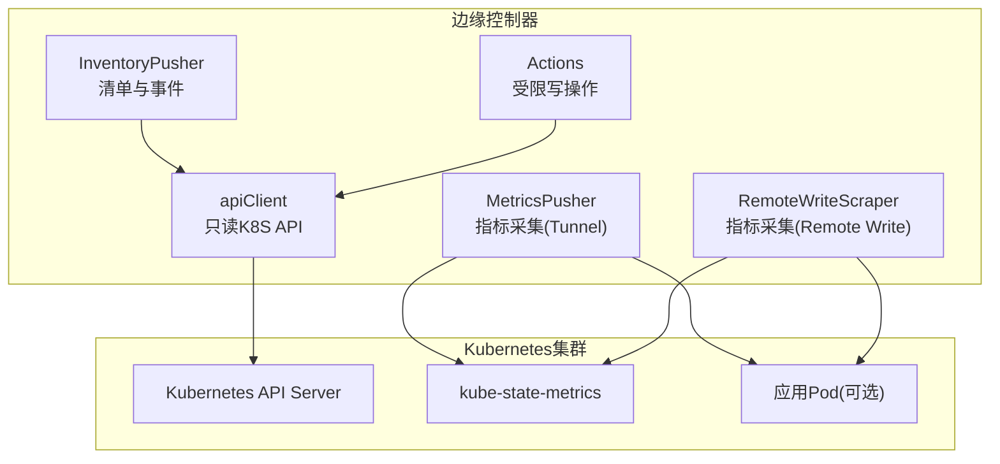
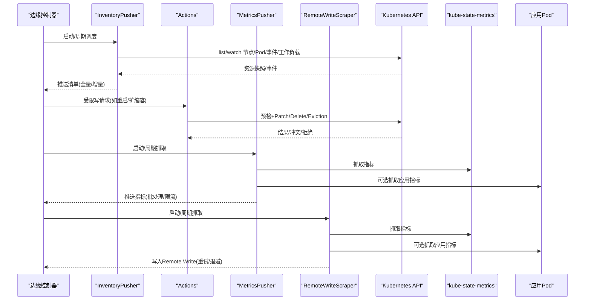
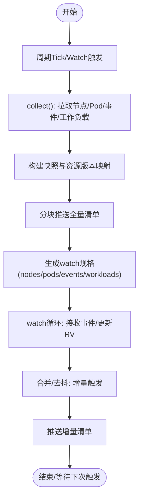
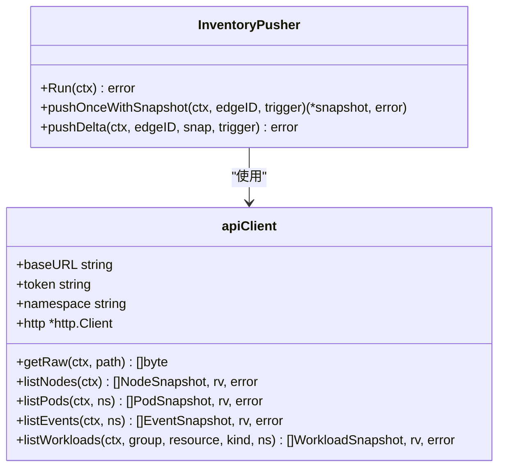
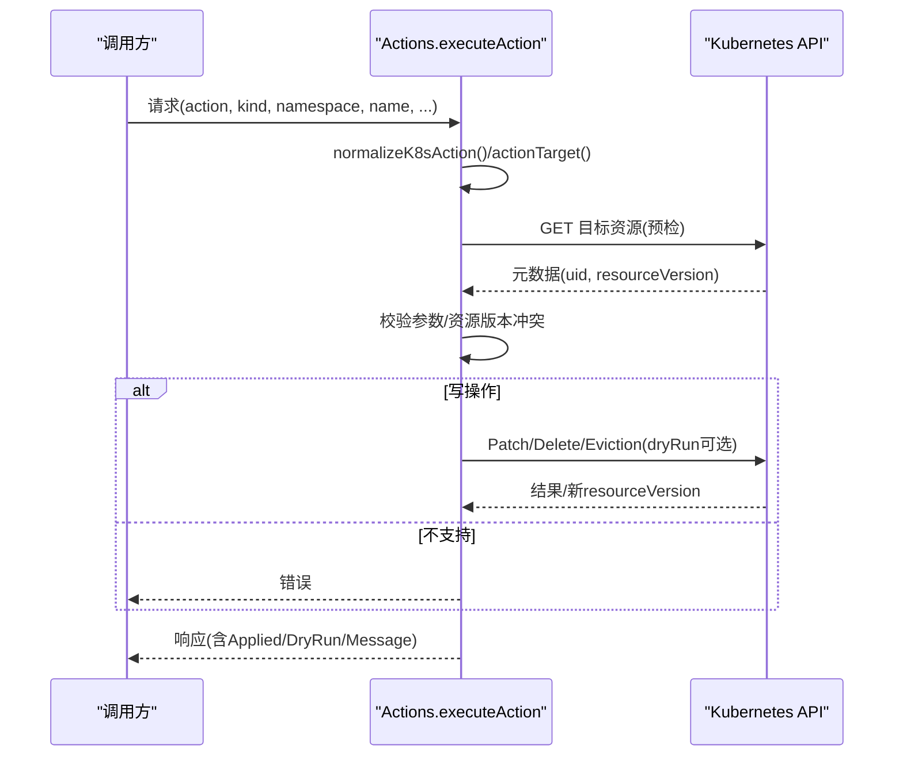
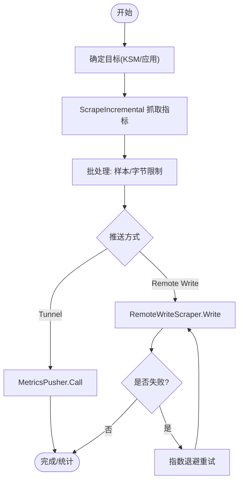
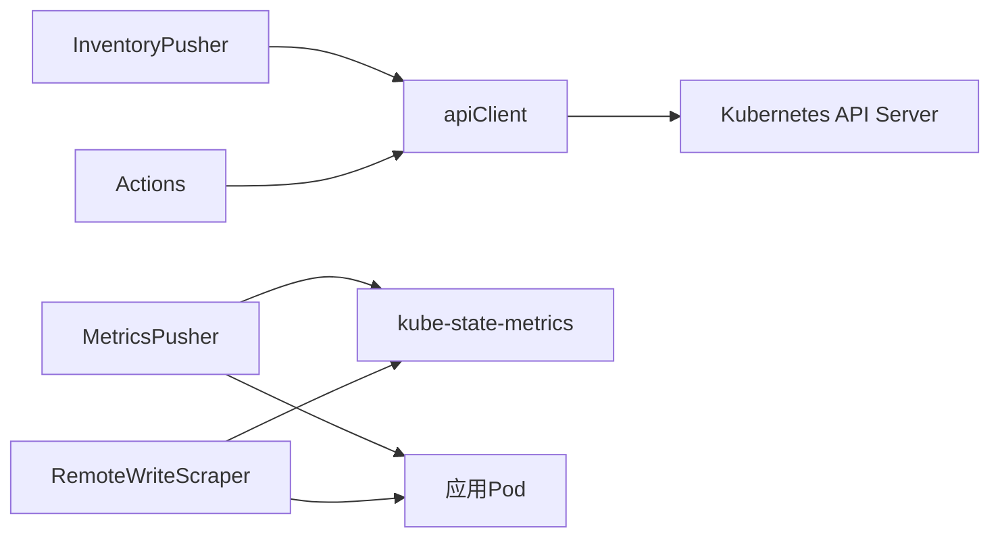

# Kubernetes集成

<cite>
**本文引用的文件**
- [internal/edgeagent/k8s/inventory.go](file://internal/edgeagent/k8s/inventory.go)
- [internal/edgeagent/k8s/readonly.go](file://internal/edgeagent/k8s/readonly.go)
- [internal/edgeagent/k8s/actions.go](file://internal/edgeagent/k8s/actions.go)
- [internal/edgeagent/k8s/metrics.go](file://internal/edgeagent/k8s/metrics.go)
- [internal/edgeagent/k8s/metrics_batch.go](file://internal/edgeagent/k8s/metrics_batch.go)
- [internal/edgeagent/k8s/remote_write_scraper.go](file://internal/edgeagent/k8s/remote_write_scraper.go)
- [internal/edgeagent/k8s/inventory_watch_accumulator.go](file://internal/edgeagent/k8s/inventory_watch_accumulator.go)
- [cmd/ongrid-edge/k8s_credentials.go](file://cmd/ongrid-edge/k8s_credentials.go)
- [deploy/kubernetes/ongrid-edge/templates/rbac.yaml](file://deploy/kubernetes/ongrid-edge/templates/rbac.yaml)
- [deploy/kubernetes/ongrid-edge/templates/serviceaccount.yaml](file://deploy/kubernetes/ongrid-edge/templates/serviceaccount.yaml)
- [deploy/kubernetes/ongrid-edge/templates/deployment.yaml](file://deploy/kubernetes/ongrid-edge/templates/deployment.yaml)
- [deploy/kubernetes/ongrid-edge/templates/controller-credentials-secret.yaml](file://deploy/kubernetes/ongrid-edge/templates/controller-credentials-secret.yaml)
</cite>

## 目录
1. [简介](#简介)
2. [项目结构](#项目结构)
3. [核心组件](#核心组件)
4. [架构总览](#架构总览)
5. [详细组件分析](#详细组件分析)
6. [依赖关系分析](#依赖关系分析)
7. [性能考量](#性能考量)
8. [故障排查指南](#故障排查指南)
9. [结论](#结论)
10. [附录](#附录)

## 简介
本文件面向Kubernetes集成能力，系统性说明集群信息收集、资源清单同步与事件监听机制；解释只读客户端实现、权限最小化与安全上下文管理；覆盖工作负载监控、节点状态采集与性能指标采集；详述Kubernetes API调用优化、缓存策略与错误重试；包含集群认证、RBAC配置与网络安全设置；并提供故障排查、性能调优与最佳实践建议。

## 项目结构
本项目在边缘侧（Edge）提供对Kubernetes集群的“只读”集成能力，并在控制器模式下支持有限的写操作（如重启、扩缩容、驱逐等）。主要模块包括：
- 资源清单与事件：InventoryPusher负责周期性全量与增量推送节点、Pod、事件与工作负载快照；watch机制基于资源版本进行增量更新。
- 只读API客户端：apiClient通过ServiceAccount令牌访问Kubernetes API，仅暴露必要的读取端点，并对敏感字段进行脱敏。
- 动作执行：actions.go将受限的写操作封装为可审计、可DryRun的动作，并做参数校验与预检查。
- 指标采集：MetricsPusher与RemoteWriteScraper分别通过Tunnel推送或直接Remote Write方式采集kube-state-metrics与应用指标。
- 认证与凭据：k8s_credentials.go负责从Kubernetes Secret或本地文件加载/存储Edge与遥测凭据，支持TLS安全传输。
- RBAC与服务账号：Helm模板定义最小权限的Role/ClusterRole及绑定，按组件拆分职责。

图表来源
- [internal/edgeagent/k8s/inventory.go:85-170](file://internal/edgeagent/k8s/inventory.go#L85-L170)
- [internal/edgeagent/k8s/actions.go:37-141](file://internal/edgeagent/k8s/actions.go#L37-L141)
- [internal/edgeagent/k8s/metrics.go:128-171](file://internal/edgeagent/k8s/metrics.go#L128-L171)
- [internal/edgeagent/k8s/remote_write_scraper.go:135-189](file://internal/edgeagent/k8s/remote_write_scraper.go#L135-L189)
- [internal/edgeagent/k8s/inventory.go:707-741](file://internal/edgeagent/k8s/inventory.go#L707-L741)

章节来源
- [internal/edgeagent/k8s/inventory.go:85-170](file://internal/edgeagent/k8s/inventory.go#L85-L170)
- [internal/edgeagent/k8s/actions.go:37-141](file://internal/edgeagent/k8s/actions.go#L37-L141)
- [internal/edgeagent/k8s/metrics.go:128-171](file://internal/edgeagent/k8s/metrics.go#L128-L171)
- [internal/edgeagent/k8s/remote_write_scraper.go:135-189](file://internal/edgeagent/k8s/remote_write_scraper.go#L135-L189)
- [internal/edgeagent/k8s/inventory.go:707-741](file://internal/edgeagent/k8s/inventory.go#L707-L741)

## 核心组件
- InventoryPusher：周期全量+增量推送节点、Pod、事件与工作负载快照；支持watch触发合并与去抖；维护资源版本以保障一致性。
- apiClient：基于ServiceAccount的只读HTTP客户端，支持列出/监听节点、Pod、事件与工作负载；对返回对象进行敏感字段脱敏。
- Actions：将受限写操作标准化为rollout_restart、scale、delete_pod、evict_pod、cordon/uncordon、drain，并支持DryRun与资源版本冲突检测。
- MetricsPusher：定时抓取kube-state-metrics与可选的应用指标，经批处理与限流后通过Tunnel推送。
- RemoteWriteScraper：独立数据面，直接写入远端Prometheus Remote Write，具备重试与指数退避。
- 凭据管理：从Kubernetes Secret或文件加载/存储Edge与遥测凭据，支持TLS与同域放宽策略。

章节来源
- [internal/edgeagent/k8s/inventory.go:44-83](file://internal/edgeagent/k8s/inventory.go#L44-L83)
- [internal/edgeagent/k8s/readonly.go:26-87](file://internal/edgeagent/k8s/readonly.go#L26-L87)
- [internal/edgeagent/k8s/actions.go:18-35](file://internal/edgeagent/k8s/actions.go#L18-L35)
- [internal/edgeagent/k8s/metrics.go:28-48](file://internal/edgeagent/k8s/metrics.go#L28-L48)
- [internal/edgeagent/k8s/remote_write_scraper.go:45-56](file://internal/edgeagent/k8s/remote_write_scraper.go#L45-L56)
- [cmd/ongrid-edge/k8s_credentials.go:54-99](file://cmd/ongrid-edge/k8s_credentials.go#L54-L99)

## 架构总览
下图展示控制器模式下的关键交互：InventoryPusher与MetricsPusher通过apiClient访问Kubernetes API；Actions在受控范围内执行写操作；指标可通过Tunnel或直接Remote Write输出。

图表来源
- [internal/edgeagent/k8s/inventory.go:85-170](file://internal/edgeagent/k8s/inventory.go#L85-L170)
- [internal/edgeagent/k8s/actions.go:37-141](file://internal/edgeagent/k8s/actions.go#L37-L141)
- [internal/edgeagent/k8s/metrics.go:128-171](file://internal/edgeagent/k8s/metrics.go#L128-L171)
- [internal/edgeagent/k8s/remote_write_scraper.go:135-189](file://internal/edgeagent/k8s/remote_write_scraper.go#L135-L189)

## 详细组件分析

### 资源清单与事件：InventoryPusher与Watch
- 全量采集：周期tick触发collect()，拉取节点、Pod、事件与工作负载，记录各资源的resourceVersion，构建快照并分块推送。
- Watch增量：根据scope与namespace构造watch spec，并行watch nodes/pods/events/workloads，累积变更并通过去抖合并后推送增量。
- 资源版本与回退：当watch因过期触发RESYNC时，清空RV并重走全量；失败时指数退避重试。
- 安全与范围：若集群级list被拒绝，自动降级到命名空间级采集。

图表来源
- [internal/edgeagent/k8s/inventory.go:85-170](file://internal/edgeagent/k8s/inventory.go#L85-L170)
- [internal/edgeagent/k8s/inventory.go:346-444](file://internal/edgeagent/k8s/inventory.go#L346-L444)
- [internal/edgeagent/k8s/inventory.go:536-594](file://internal/edgeagent/k8s/inventory.go#L536-L594)
- [internal/edgeagent/k8s/inventory_watch_accumulator.go:22-93](file://internal/edgeagent/k8s/inventory_watch_accumulator.go#L22-L93)

章节来源
- [internal/edgeagent/k8s/inventory.go:85-170](file://internal/edgeagent/k8s/inventory.go#L85-L170)
- [internal/edgeagent/k8s/inventory.go:346-444](file://internal/edgeagent/k8s/inventory.go#L346-L444)
- [internal/edgeagent/k8s/inventory.go:536-594](file://internal/edgeagent/k8s/inventory.go#L536-L594)
- [internal/edgeagent/k8s/inventory_watch_accumulator.go:22-93](file://internal/edgeagent/k8s/inventory_watch_accumulator.go#L22-L93)

### 只读客户端与敏感信息脱敏
- 只读访问：apiClient通过ServiceAccount token与CA证书建立HTTPS连接，默认超时15秒，仅暴露必要读取接口。
- 描述资源：describeResource支持多种Kind，自动拼接API路径，限制不允许的Kind（如Secret/ConfigMap），并对返回对象进行敏感字段脱敏。
- Pod日志：queryPodLogs支持tailLines/limitBytes/sinceSeconds/container/previous/timestamps等参数，并对日志文本进行脱敏。
- 事件关联：可选获取与资源相关的事件，限制数量并脱敏消息内容。

图表来源
- [internal/edgeagent/k8s/inventory.go:700-741](file://internal/edgeagent/k8s/inventory.go#L700-L741)
- [internal/edgeagent/k8s/inventory.go:750-797](file://internal/edgeagent/k8s/inventory.go#L750-L797)
- [internal/edgeagent/k8s/readonly.go:89-137](file://internal/edgeagent/k8s/readonly.go#L89-L137)
- [internal/edgeagent/k8s/readonly.go:139-207](file://internal/edgeagent/k8s/readonly.go#L139-L207)

章节来源
- [internal/edgeagent/k8s/inventory.go:700-741](file://internal/edgeagent/k8s/inventory.go#L700-L741)
- [internal/edgeagent/k8s/readonly.go:89-137](file://internal/edgeagent/k8s/readonly.go#L89-L137)
- [internal/edgeagent/k8s/readonly.go:139-207](file://internal/edgeagent/k8s/readonly.go#L139-L207)

### 受限写操作：Actions
- 动作白名单：仅允许rollout_restart、scale、delete_pod、evict_pod、cordon/uncordon、drain。
- 预检查：校验Kind/Action匹配性、名称/命名空间必填、副本数范围、grace period范围等。
- 资源版本冲突：支持ExpectedResourceVersion，避免并发修改导致的不一致。
- DryRun：所有写操作支持DryRun，便于验证而不实际生效。
- Drain流程：先标记不可调度，再驱逐/删除Pod，统计跳过/驱逐/删除数量，支持忽略DaemonSet、强制删除emptyDir等选项。

图表来源
- [internal/edgeagent/k8s/actions.go:37-141](file://internal/edgeagent/k8s/actions.go#L37-L141)
- [internal/edgeagent/k8s/actions.go:206-265](file://internal/edgeagent/k8s/actions.go#L206-L265)
- [internal/edgeagent/k8s/actions.go:267-400](file://internal/edgeagent/k8s/actions.go#L267-L400)
- [internal/edgeagent/k8s/actions.go:421-544](file://internal/edgeagent/k8s/actions.go#L421-L544)

章节来源
- [internal/edgeagent/k8s/actions.go:37-141](file://internal/edgeagent/k8s/actions.go#L37-L141)
- [internal/edgeagent/k8s/actions.go:206-265](file://internal/edgeagent/k8s/actions.go#L206-L265)
- [internal/edgeagent/k8s/actions.go:267-400](file://internal/edgeagent/k8s/actions.go#L267-L400)
- [internal/edgeagent/k8s/actions.go:421-544](file://internal/edgeagent/k8s/actions.go#L421-L544)

### 指标采集：MetricsPusher与RemoteWriteScraper
- MetricsPusher：周期抓取kube-state-metrics与可选应用指标，使用批处理器按样本数/字节数切分，通过Tunnel推送；支持上报抓取状态与Up指标。
- RemoteWriteScraper：独立数据面，直接写入远端Remote Write；具备重试与指数退避；支持应用发现（基于注解）；提供Ready就绪信号。
- 批处理：metricsBatcher保证单批次不超过样本/字节限制，失败记录统计并继续推进。

图表来源
- [internal/edgeagent/k8s/metrics.go:128-171](file://internal/edgeagent/k8s/metrics.go#L128-L171)
- [internal/edgeagent/k8s/metrics.go:173-230](file://internal/edgeagent/k8s/metrics.go#L173-L230)
- [internal/edgeagent/k8s/metrics_batch.go:29-120](file://internal/edgeagent/k8s/metrics_batch.go#L29-L120)
- [internal/edgeagent/k8s/remote_write_scraper.go:135-189](file://internal/edgeagent/k8s/remote_write_scraper.go#L135-L189)
- [internal/edgeagent/k8s/remote_write_scraper.go:279-306](file://internal/edgeagent/k8s/remote_write_scraper.go#L279-L306)

章节来源
- [internal/edgeagent/k8s/metrics.go:128-171](file://internal/edgeagent/k8s/metrics.go#L128-L171)
- [internal/edgeagent/k8s/metrics.go:173-230](file://internal/edgeagent/k8s/metrics.go#L173-L230)
- [internal/edgeagent/k8s/metrics_batch.go:29-120](file://internal/edgeagent/k8s/metrics_batch.go#L29-L120)
- [internal/edgeagent/k8s/remote_write_scraper.go:135-189](file://internal/edgeagent/k8s/remote_write_scraper.go#L135-L189)
- [internal/edgeagent/k8s/remote_write_scraper.go:279-306](file://internal/edgeagent/k8s/remote_write_scraper.go#L279-L306)

### 认证、RBAC与安全上下文
- 认证：
  - 控制器与数据面通过ServiceAccount token访问Kubernetes API；CA证书来自服务账户目录。
  - Edge凭据与遥测凭据通过Kubernetes Secret或本地文件加载/存储，支持TLS与同域放宽策略。
- RBAC：
  - 控制器：读取nodes/namespaces/pods/services/endpoints/persistentvolumeclaims/events，读取pods/log，patch nodes，delete pods，create pods/eviction，读取/监听apps/batch工作负载。
  - 遥测网关：读取pods/namespaces/nodes及apps/batch工作负载（用于属性推导）。
  - 指标抓取器：仅list pods（应用发现）。
- 安全上下文：
  - 控制器容器禁止特权升级、丢弃全部capabilities，根文件系统可读可写（需持久化状态）。
  - ServiceAccount按需挂载token（仅启用应用发现时）。

章节来源
- [cmd/ongrid-edge/k8s_credentials.go:54-99](file://cmd/ongrid-edge/k8s_credentials.go#L54-L99)
- [cmd/ongrid-edge/k8s_credentials.go:314-364](file://cmd/ongrid-edge/k8s_credentials.go#L314-L364)
- [deploy/kubernetes/ongrid-edge/templates/rbac.yaml:1-174](file://deploy/kubernetes/ongrid-edge/templates/rbac.yaml#L1-L174)
- [deploy/kubernetes/ongrid-edge/templates/serviceaccount.yaml:1-35](file://deploy/kubernetes/ongrid-edge/templates/serviceaccount.yaml#L1-L35)
- [deploy/kubernetes/ongrid-edge/templates/deployment.yaml:49-53](file://deploy/kubernetes/ongrid-edge/templates/deployment.yaml#L49-L53)
- [deploy/kubernetes/ongrid-edge/templates/deployment.yaml:182-186](file://deploy/kubernetes/ongrid-edge/templates/deployment.yaml#L182-L186)

## 依赖关系分析
- 组件耦合：
  - InventoryPusher依赖apiClient进行资源读取与watch；依赖tunnel.Client推送清单。
  - Actions依赖apiClient执行受限写操作。
  - MetricsPusher依赖metricscommon进行抓取与批处理，依赖tunnel.Client推送指标。
  - RemoteWriteScraper依赖RemoteWriteWriter写入远端。
- 外部依赖：
  - Kubernetes API Server（HTTPS，ServiceAccount认证）。
  - kube-state-metrics（指标源）。
  - 应用Pod（可选，基于注解发现）。
- 潜在循环依赖：无直接循环；watch与推送通过通道与定时器解耦。

图表来源
- [internal/edgeagent/k8s/inventory.go:85-170](file://internal/edgeagent/k8s/inventory.go#L85-L170)
- [internal/edgeagent/k8s/actions.go:37-141](file://internal/edgeagent/k8s/actions.go#L37-L141)
- [internal/edgeagent/k8s/metrics.go:128-171](file://internal/edgeagent/k8s/metrics.go#L128-L171)
- [internal/edgeagent/k8s/remote_write_scraper.go:135-189](file://internal/edgeagent/k8s/remote_write_scraper.go#L135-L189)

章节来源
- [internal/edgeagent/k8s/inventory.go:85-170](file://internal/edgeagent/k8s/inventory.go#L85-L170)
- [internal/edgeagent/k8s/actions.go:37-141](file://internal/edgeagent/k8s/actions.go#L37-L141)
- [internal/edgeagent/k8s/metrics.go:128-171](file://internal/edgeagent/k8s/metrics.go#L128-L171)
- [internal/edgeagent/k8s/remote_write_scraper.go:135-189](file://internal/edgeagent/k8s/remote_write_scraper.go#L135-L189)

## 性能考量
- 清单同步：
  - 全量周期间隔可调；增量watch合并去抖减少频繁推送。
  - 资源版本控制避免重复与丢失；过期时自动回退全量。
- 指标采集：
  - 批处理限制样本数与字节数，防止大报文阻塞。
  - 抓取超时与推送超时分离，避免长尾影响。
  - Remote Write支持指数退避重试，提升稳定性。
- API调用：
  - 合理设置超时与并发；watch按资源维度并行。
  - 命名空间级降级避免集群级权限不足导致的失败。
- 内存与CPU：
  - 快照与事件列表控制在合理大小；日志与事件脱敏开销可控。
  - 调整采样限制与批大小平衡吞吐与延迟。

[本节为通用指导，不直接分析具体文件]

## 故障排查指南
- 无法读取资源：
  - 检查ServiceAccount与RBAC是否授予对应资源与动词；确认命名空间正确。
  - 查看是否触发errForbidden/errNotFound，必要时切换至命名空间级采集。
- Watch频繁断开：
  - 关注资源版本过期导致的RESYNC；检查网络与API Server压力。
  - 观察重试退避与日志中的reason。
- 指标未上报：
  - 确认kube-state-metrics可达；检查抓取超时与样本限制。
  - 对于Remote Write，检查重试次数与退避时间；查看部分失败日志。
- 动作执行失败：
  - 校验Kind/Action匹配性与参数范围；检查ExpectedResourceVersion冲突。
  - 使用DryRun验证后再执行；关注PDB导致的驱逐阻塞。
- 凭据问题：
  - 检查Secret是否存在且键值完整；确认Token与CA证书有效。
  - 若使用同域放宽，确认Manager URL与目标Endpoint同源。

章节来源
- [internal/edgeagent/k8s/inventory.go:377-444](file://internal/edgeagent/k8s/inventory.go#L377-L444)
- [internal/edgeagent/k8s/actions.go:59-62](file://internal/edgeagent/k8s/actions.go#L59-L62)
- [internal/edgeagent/k8s/actions.go:519-539](file://internal/edgeagent/k8s/actions.go#L519-L539)
- [internal/edgeagent/k8s/remote_write_scraper.go:279-306](file://internal/edgeagent/k8s/remote_write_scraper.go#L279-L306)
- [cmd/ongrid-edge/k8s_credentials.go:54-99](file://cmd/ongrid-edge/k8s_credentials.go#L54-L99)

## 结论
本集成在边缘侧提供了对Kubernetes集群的只读能力与受限写操作，结合watch与资源版本实现高效一致的清单同步；通过批处理与重试机制保障指标采集的稳定性与可扩展性；RBAC与服务账号遵循最小权限原则，配合安全上下文降低风险。建议在大规模集群中合理配置抓取间隔、超时与批大小，并结合观测指标持续调优。

[本节为总结，不直接分析具体文件]

## 附录
- 部署与配置要点：
  - 控制器模式要求replicas=1；通过ConfigMap注入模式、公共URL与Tunnel地址。
  - 凭据通过Secret注入；遥测配置可刷新。
  - 按需启用应用指标发现，并配置相应RBAC。
- 安全建议：
  - 保持TLS启用；仅在必要时放宽同域TLS策略。
  - 限制ServiceAccount token自动挂载范围。
  - 定期轮换凭据与证书。

章节来源
- [deploy/kubernetes/ongrid-edge/templates/deployment.yaml:14-16](file://deploy/kubernetes/ongrid-edge/templates/deployment.yaml#L14-L16)
- [deploy/kubernetes/ongrid-edge/templates/deployment.yaml:68-143](file://deploy/kubernetes/ongrid-edge/templates/deployment.yaml#L68-L143)
- [deploy/kubernetes/ongrid-edge/templates/controller-credentials-secret.yaml:1-16](file://deploy/kubernetes/ongrid-edge/templates/controller-credentials-secret.yaml#L1-L16)
- [deploy/kubernetes/ongrid-edge/templates/rbac.yaml:70-99](file://deploy/kubernetes/ongrid-edge/templates/rbac.yaml#L70-L99)