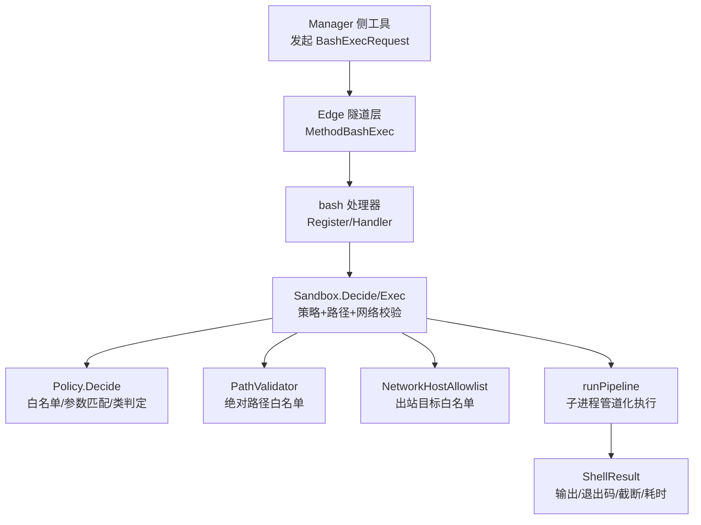
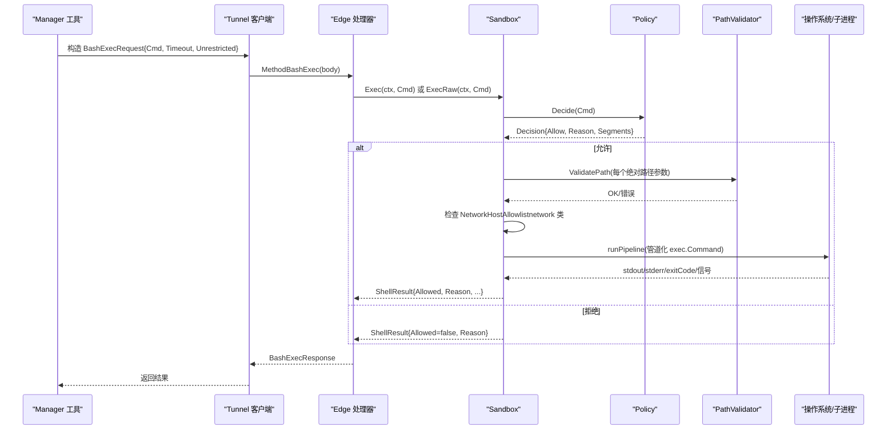
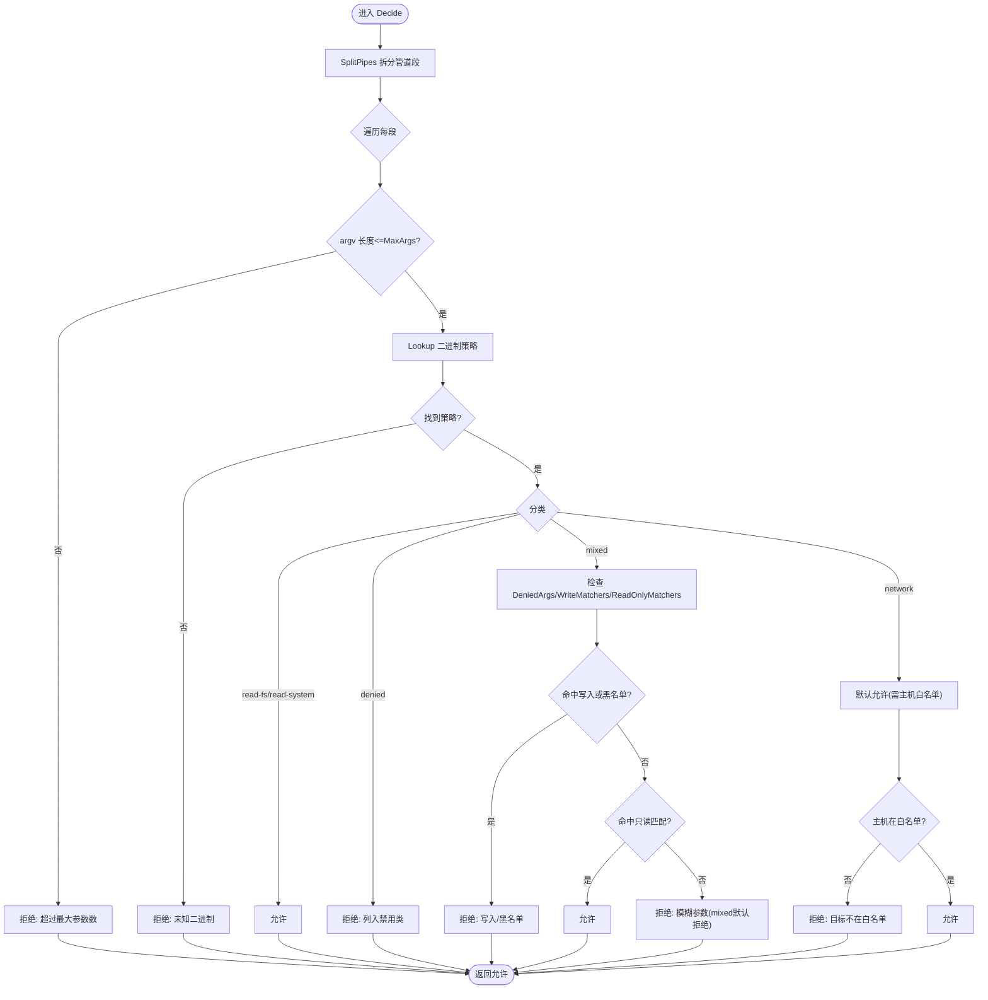
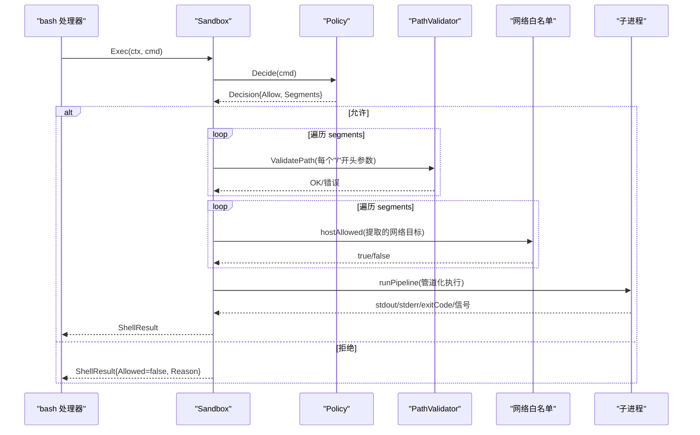
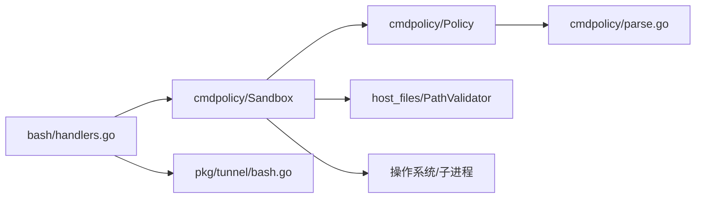

# 命令执行沙箱

<cite>
**本文引用的文件**
- [policy.go](file://internal/edgeagent/cmdpolicy/policy.go)
- [sandbox.go](file://internal/edgeagent/cmdpolicy/sandbox.go)
- [parse.go](file://internal/edgeagent/cmdpolicy/parse.go)
- [types.go](file://internal/edgeagent/cmdpolicy/types.go)
- [handlers.go](file://internal/edgeagent/bash/handlers.go)
- [bash.go](file://internal/pkg/tunnel/bash.go)
- [shell.go](file://internal/pkg/runner/shell.go)
- [bash-policy.example.yaml](file://deploy/edge/bash-policy.example.yaml)
</cite>

## 目录
1. [简介](#简介)
2. [项目结构](#项目结构)
3. [核心组件](#核心组件)
4. [架构总览](#架构总览)
5. [详细组件分析](#详细组件分析)
6. [依赖关系分析](#依赖关系分析)
7. [性能与资源限制](#性能与资源限制)
8. [故障排查指南](#故障排查指南)
9. [结论](#结论)
10. [附录：配置与安全最佳实践](#附录配置与安全最佳实践)

## 简介
本文件面向“命令执行沙箱”子系统，系统性说明其安全控制机制、隔离环境实现、命令解析器、权限模型与审计日志、以及自定义策略与动态规则更新方法。该子系统用于在边缘节点上以最小权限和强约束的方式执行由 LLM/工具链触发的 shell 命令，确保只读为主、可审计、可回滚，并提供受控的写操作逃逸通道（需管理员显式开启）。

## 项目结构
命令执行沙箱位于 edgeagent 的 cmdpolicy 包中，并通过 bash 技能处理器暴露为网络调用；manager 侧通过 tunnel 协议发起请求。关键路径如下：
- 策略定义与合并：cmdpolicy/policy.go
- 执行与隔离：cmdpolicy/sandbox.go
- 命令解析与语法限制：cmdpolicy/parse.go
- 类型与分类：cmdpolicy/types.go
- 边缘侧注册与处理：edgeagent/bash/handlers.go
- 传输协议与请求体：pkg/tunnel/bash.go
- 通用子进程运行器（参考）：pkg/runner/shell.go
- 默认策略示例与覆盖配置：deploy/edge/bash-policy.example.yaml



图表来源
- [handlers.go:49-93](file://internal/edgeagent/bash/handlers.go#L49-L93)
- [bash.go:13-43](file://internal/pkg/tunnel/bash.go#L13-L43)
- [sandbox.go:76-188](file://internal/edgeagent/cmdpolicy/sandbox.go#L76-L188)
- [policy.go:707-800](file://internal/edgeagent/cmdpolicy/policy.go#L707-L800)

章节来源
- [handlers.go:49-93](file://internal/edgeagent/bash/handlers.go#L49-L93)
- [bash.go:13-43](file://internal/pkg/tunnel/bash.go#L13-L43)

## 核心组件
- 策略引擎（Policy）：基于二进制分类（read-fs、read-system、mixed、network、denied）与参数匹配器（AnyFlag/Subcmd/SubcmdPath）决定允许或拒绝；提供默认只读基线及 YAML 覆盖合并。
- 沙箱执行器（Sandbox）：组合 Policy、PathValidator、Logger，负责路径校验、网络目标白名单、超时、输出容量限制、管道化执行与结果封装。
- 命令解析器（Tokenizer）：仅支持有限 POSIX 风格子集（管道、引号、转义），严格禁止重定向、后台任务、命令替换等危险语法。
- 传输协议（Tunnel）：定义 BashExecRequest/Response，统一 manager 与 edge 之间的调用契约。
- 处理器（bash handler）：启动时加载默认策略与可选 YAML 覆盖，注入 PathValidator，注册并处理 bash.exec 请求。

章节来源
- [types.go:43-182](file://internal/edgeagent/cmdpolicy/types.go#L43-L182)
- [policy.go:33-492](file://internal/edgeagent/cmdpolicy/policy.go#L33-L492)
- [sandbox.go:52-188](file://internal/edgeagent/cmdpolicy/sandbox.go#L52-L188)
- [parse.go:9-94](file://internal/edgeagent/cmdpolicy/parse.go#L9-L94)
- [bash.go:21-71](file://internal/pkg/tunnel/bash.go#L21-L71)
- [handlers.go:49-93](file://internal/edgeagent/bash/handlers.go#L49-L93)

## 架构总览
命令执行从 manager 到 edge 的完整流程如下：



图表来源
- [bash.go:21-71](file://internal/pkg/tunnel/bash.go#L21-L71)
- [handlers.go:99-158](file://internal/edgeagent/bash/handlers.go#L99-L158)
- [sandbox.go:76-188](file://internal/edgeagent/cmdpolicy/sandbox.go#L76-L188)
- [policy.go:707-800](file://internal/edgeagent/cmdpolicy/policy.go#L707-L800)

## 详细组件分析

### 策略引擎（Policy）
- 二进制分类与默认基线：
  - read-fs/read-system：无条件允许（如 ls、cat、ps、df 等）。
  - mixed：按参数区分读写（如 iptables -L/-A、systemctl status/start、ip addr/show/add/del 等）。
  - network：出站网络访问（nc、curl、dig、ping 等），需要 NetworkHostAllowlist 放行目标。
  - denied：一律拒绝（shell、脚本语言、破坏性命令等）。
- 参数匹配器：
  - AnyFlag：任意位置出现指定标志即命中。
  - Subcmd：argv[1] 精确匹配。
  - SubcmdPath：连续多个位置参数匹配（如 tc qdisc show）。
- 全局黑名单 DeniedArgs：对特定二进制进行子串级拦截（如 awk system(、find -delete、sed -i）。
- 决策流程：
  - 先拆分管道段，逐段校验 argv 数量上限。
  - 查找二进制策略，若未注册或未安装则拒绝。
  - 应用 DeniedArgs 与 WriteMatchers 优先拒绝，再匹配 ReadOnlyMatchers 允许，否则按类别默认策略（mixed 默认拒绝，network 默认允许但需主机白名单）。
- YAML 覆盖：
  - 支持 binaries[*] 完全替换同名条目、新增条目；network_host_allowlist/path_allowlist/caps/timeout/max_argv_length 覆盖。
  - 合并语义“叠加且覆盖”，无删除动词（移除二进制需重启并以空 base 构建）。



图表来源
- [policy.go:707-800](file://internal/edgeagent/cmdpolicy/policy.go#L707-L800)
- [types.go:79-130](file://internal/edgeagent/cmdpolicy/types.go#L79-L130)

章节来源
- [policy.go:33-492](file://internal/edgeagent/cmdpolicy/policy.go#L33-L492)
- [policy.go:546-697](file://internal/edgeagent/cmdpolicy/policy.go#L546-L697)
- [policy.go:707-800](file://internal/edgeagent/cmdpolicy/policy.go#L707-L800)
- [types.go:43-182](file://internal/edgeagent/cmdpolicy/types.go#L43-L182)

### 沙箱执行器（Sandbox）
- 职责：
  - 组合 Policy + PathValidator + Logger。
  - Decide：除策略外，还校验所有以“/”开头的参数路径是否合法，并对 network 类命令提取目标主机并校验白名单。
  - Exec：在 Decide 通过后，设置上下文超时、清理环境变量（PATH/LANG/LC_ALL）、创建进程组、连接管道、限制输出大小、收集退出码与耗时。
  - ExecRaw：管理员写门限开启时的逃逸通道，绕过所有 cmdpolicy 检查，直接通过 /bin/sh -c 执行，但仍受超时与输出容量限制。
- 管道执行：
  - 将多段命令通过 stdout→stdin 串联，最后一段的 stdout 作为最终输出；每段 stderr 聚合返回。
  - 遇到 SIGPIPE/早退视为非致命（非末段）。
- 输出容量：
  - StdoutCap/StderrCap 硬限制，超出部分丢弃并在结果中标记 Truncated=true。
- 网络目标提取：
  - 针对 curl/wget/dig/host/nslookup/ping/traceroute/nc 等，按启发式提取目标主机，支持 CIDR、后缀匹配与精确匹配。



图表来源
- [sandbox.go:76-188](file://internal/edgeagent/cmdpolicy/sandbox.go#L76-L188)
- [sandbox.go:260-342](file://internal/edgeagent/cmdpolicy/sandbox.go#L260-L342)
- [sandbox.go:428-549](file://internal/edgeagent/cmdpolicy/sandbox.go#L428-L549)

章节来源
- [sandbox.go:52-188](file://internal/edgeagent/cmdpolicy/sandbox.go#L52-L188)
- [sandbox.go:260-342](file://internal/edgeagent/cmdpolicy/sandbox.go#L260-L342)
- [sandbox.go:428-549](file://internal/edgeagent/cmdpolicy/sandbox.go#L428-L549)

### 命令解析器（Tokenizer）
- 支持的语法：
  - 简单命令与管道 |。
  - 单引号与双引号字符串，支持 POSIX 转义规则。
  - 反斜杠转义下一个字符。
- 严格禁止：
  - 重定向 > >> < <<、heredoc/herestring。
  - 命令列表与后台任务 ; && || &。
  - 命令替换 $( )、反引号 `` ` ``、进程替换 <( >(。
  - 子shell ( ) 顶层使用。
  - 变量展开 $()、${}（裸 $VAR 作为字面量传递，不展开）。
- 设计动机：
  - 避免引入完整 shell 解析器，减少攻击面；确保传入 exec.Command 的是干净 argv 数组。

```mermaid
flowchart TD
In["输入命令字符串"] --> Scan["扫描字符流"]
Scan --> Q{"遇到引号?"}
Q -- 是 --> ReadQ["读取引号内容(支持转义)"]
Q -- 否 --> Tok{"空白/管道/非法字符?"}
Tok -- 空白 --> Emit["输出token"]
Tok -- 管道 "|" --> Pipe["记录分段点"]
Tok -- 非法字符 --> Err["拒绝: 包含不允许的元字符"]
ReadQ --> Emit
Emit --> Next["继续扫描"]
Pipe --> Next
Next --> Done{"结束?"}
Done -- 否 --> Scan
Done -- 是 --> Segs["组装各段argv"]
Segs --> Out["返回segments"]
```

图表来源
- [parse.go:32-94](file://internal/edgeagent/cmdpolicy/parse.go#L32-L94)
- [parse.go:96-235](file://internal/edgeagent/cmdpolicy/parse.go#L96-L235)

章节来源
- [parse.go:9-94](file://internal/edgeagent/cmdpolicy/parse.go#L9-L94)
- [parse.go:96-235](file://internal/edgeagent/cmdpolicy/parse.go#L96-L235)

### 权限模型、用户上下文与审计日志
- 权限模型：
  - 基于二进制的分类与参数匹配器，形成“白名单+参数白名单”的最小权限模型。
  - 路径白名单：复用 host_files.SandboxConfig 的 PathValidator，统一约束所有以“/”开头的参数。
  - 网络白名单：NetworkHostAllowlist 控制出站目标（CIDR/后缀/精确匹配）。
- 用户上下文：
  - 当前代码中未体现 per-user 的策略分支；策略为全局生效。可通过 YAML 覆盖调整策略范围。
- 审计日志：
  - 处理器在调用前后记录调试信息（命令、是否受限）。
  - 当启用不受限执行（Unrestricted=true）时，记录告警级别日志，明确标记 cmdpolicy 被绕过，便于审计追踪。
  - 建议结合系统日志/集中式日志系统进行持久化与检索。

章节来源
- [handlers.go:49-93](file://internal/edgeagent/bash/handlers.go#L49-L93)
- [handlers.go:99-158](file://internal/edgeagent/bash/handlers.go#L99-L158)
- [bash.go:21-43](file://internal/pkg/tunnel/bash.go#L21-L43)

### 自定义策略配置与动态规则更新
- 默认策略：
  - DefaultReadOnly() 提供生产默认只读基线，涵盖常见诊断二进制与网络探测工具。
- YAML 覆盖：
  - 放置于 /etc/ongrid-edge/bash-policy.yaml，启动时自动加载并合并到基线。
  - 可添加/替换二进制规则、收紧/放宽 matchers、调整 caps/timeout/max_argv_length、扩展 path/network 白名单。
- 动态更新：
  - 当前实现为启动时加载；如需热更新，可在管理器侧触发 edge 进程重载策略（例如通过管理接口重启相关服务或重新加载配置）。
- 示例配置：
  - deploy/edge/bash-policy.example.yaml 提供了完整的示例，包括各类二进制、matchers、白名单与资源限制。

章节来源
- [policy.go:546-697](file://internal/edgeagent/cmdpolicy/policy.go#L546-L697)
- [handlers.go:49-93](file://internal/edgeagent/bash/handlers.go#L49-L93)
- [bash-policy.example.yaml:1-178](file://deploy/edge/bash-policy.example.yaml#L1-L178)

### 安全最佳实践与漏洞修复指南
- 最小权限原则：
  - 默认保持只读基线；仅在必要时通过 YAML 添加 narrow 的 write matchers。
  - 对 mixed 类二进制，尽量细化 ReadOnlyMatchers/WriteMatchers，避免宽泛匹配。
- 路径与网络限制：
  - 启用 PathValidator 并限定 path_allowlist。
  - 明确配置 network_host_allowlist，默认拒绝所有出站。
- 资源保护：
  - 合理设置 stdout_cap_bytes、stderr_cap_bytes、timeout_seconds、max_argv_length，防止 OOM/长时间占用。
- 逃逸通道管控：
  - Unrestricted 模式应仅在管理员显式开启时使用；务必配合严格的审批与审计。
- 常见威胁防护：
  - 禁止 shell/脚本语言、破坏性命令、权限变更、系统关机/重启等（已在 denied 类中内置）。
  - 对 find/awk/sed/journalctl 等工具附加 DeniedArgs，防止隐蔽写操作。
  - 对 ip netns exec 等可能逃逸命名空间的命令显式拒绝。
- 漏洞修复建议：
  - 若发现某二进制存在误判风险，优先通过 DeniedArgs 或更严格的 WriteMatchers 收窄。
  - 若需新增工具，先在测试环境验证 matchers 的正确性与边界情况。
  - 定期审查 YAML 覆盖，确保与基线一致且不过度放宽。

章节来源
- [policy.go:51-492](file://internal/edgeagent/cmdpolicy/policy.go#L51-L492)
- [bash-policy.example.yaml:19-178](file://deploy/edge/bash-policy.example.yaml#L19-L178)
- [sandbox.go:190-253](file://internal/edgeagent/cmdpolicy/sandbox.go#L190-L253)

## 依赖关系分析
- 模块耦合：
  - handlers.go 依赖 cmdpolicy.Sandbox 与 host_files.PathValidator。
  - Sandbox 依赖 Policy、PathValidator、Logger，并调用 OS 子进程。
  - Policy 依赖 YAML 解析与二进制发现逻辑。
  - parse.go 独立实现 tokenizer，供 Policy/Sandbox 使用。
- 外部依赖：
  - 文件系统访问（PathValidator）。
  - 网络访问（仅当 network 类且目标在白名单）。
  - 系统调用（exec.Command、SysProcAttr.Setpgid）。



图表来源
- [handlers.go:49-93](file://internal/edgeagent/bash/handlers.go#L49-L93)
- [sandbox.go:52-188](file://internal/edgeagent/cmdpolicy/sandbox.go#L52-L188)
- [policy.go:707-800](file://internal/edgeagent/cmdpolicy/policy.go#L707-L800)
- [parse.go:32-94](file://internal/edgeagent/cmdpolicy/parse.go#L32-L94)
- [bash.go:21-43](file://internal/pkg/tunnel/bash.go#L21-L43)

章节来源
- [handlers.go:49-93](file://internal/edgeagent/bash/handlers.go#L49-L93)
- [sandbox.go:52-188](file://internal/edgeagent/cmdpolicy/sandbox.go#L52-L188)
- [policy.go:707-800](file://internal/edgeagent/cmdpolicy/policy.go#L707-L800)
- [parse.go:32-94](file://internal/edgeagent/cmdpolicy/parse.go#L32-L94)
- [bash.go:21-43](file://internal/pkg/tunnel/bash.go#L21-L43)

## 性能与资源限制
- 超时控制：
  - 默认 30 秒，可通过 YAML 或请求级 Timeout 覆盖（处理器限制最大 5 分钟）。
- 输出限制：
  - StdoutCap/StderrCap 默认分别为 64KB/16KB，可配置；超出后标记 Truncated。
- 参数限制：
  - MaxArgs 默认 32，防止 ARG_MAX 洪水攻击。
- 进程组与管道：
  - 使用 Setpgid 组织进程组，便于超时取消与批量终止。
- 内存与 CPU：
  - 通过 capWriter/capBuffer 限制输出缓冲增长，避免 OOM。
- 参考实现：
  - pkg/runner/shell.go 展示了通用的子进程运行器模式（隔离 None），可作为其他场景参考。

章节来源
- [policy.go:26-31](file://internal/edgeagent/cmdpolicy/policy.go#L26-L31)
- [sandbox.go:140-188](file://internal/edgeagent/cmdpolicy/sandbox.go#L140-L188)
- [sandbox.go:260-342](file://internal/edgeagent/cmdpolicy/sandbox.go#L260-L342)
- [shell.go:25-102](file://internal/pkg/runner/shell.go#L25-L102)

## 故障排查指南
- 常见问题定位：
  - “binary not installed”：二进制未在 PATH 或约定目录中找到，需确认安装路径或策略 AbsPath。
  - “empty argv segment”：解析失败或管道段为空，检查命令语法是否符合 tokenizer 要求。
  - “not in policy”：二进制未注册或属于 denied 类，需在 YAML 中添加或调整分类。
  - “target not in allowlist”：网络目标未加入 NetworkHostAllowlist，需补充 CIDR/后缀/精确匹配。
  - “command timed out”：执行超时，检查命令复杂度与超时配置。
  - “unrestricted exec bypassed”：管理员写门限开启，确认是否为预期行为并加强审计。
- 日志与审计：
  - 关注处理器日志中的 debug/warn 级别信息，尤其是 unrestricted 执行记录。
  - 结合集中式日志平台进行检索与告警。

章节来源
- [handlers.go:99-158](file://internal/edgeagent/bash/handlers.go#L99-L158)
- [sandbox.go:76-188](file://internal/edgeagent/cmdpolicy/sandbox.go#L76-L188)
- [policy.go:707-800](file://internal/edgeagent/cmdpolicy/policy.go#L707-L800)

## 结论
命令执行沙箱通过“分类+参数匹配+路径/网络白名单+资源限制”的多层防御，实现了最小权限的命令执行环境。默认只读基线覆盖常见诊断需求，YAML 覆盖提供灵活扩展能力；同时保留管理员写门限的逃逸通道以满足运维需要。建议在生产环境中严格配置网络与路径白名单，精细化 mixed 类工具的 matchers，并持续审计 unrestricted 执行。

## 附录：配置与安全最佳实践
- 配置要点：
  - 使用默认只读基线，按需通过 YAML 覆盖添加/替换二进制规则。
  - 明确配置 network_host_allowlist，默认拒绝所有出站。
  - 设置合理的 stdout/stderr 容量、超时与最大参数长度。
  - 启用 PathValidator 并限定 path_allowlist。
- 安全最佳实践：
  - 对 mixed 类工具细化 matchers，避免宽泛匹配。
  - 对 find/awk/sed/journalctl 等附加 DeniedArgs，防止隐蔽写操作。
  - 谨慎启用 Unrestricted，仅在管理员审批后使用，并强化审计。
  - 定期审查策略覆盖，确保与基线一致且不过度放宽。
- 示例配置路径：
  - deploy/edge/bash-policy.example.yaml 提供完整示例与注释。

章节来源
- [bash-policy.example.yaml:1-178](file://deploy/edge/bash-policy.example.yaml#L1-L178)
- [handlers.go:49-93](file://internal/edgeagent/bash/handlers.go#L49-L93)
- [policy.go:546-697](file://internal/edgeagent/cmdpolicy/policy.go#L546-L697)