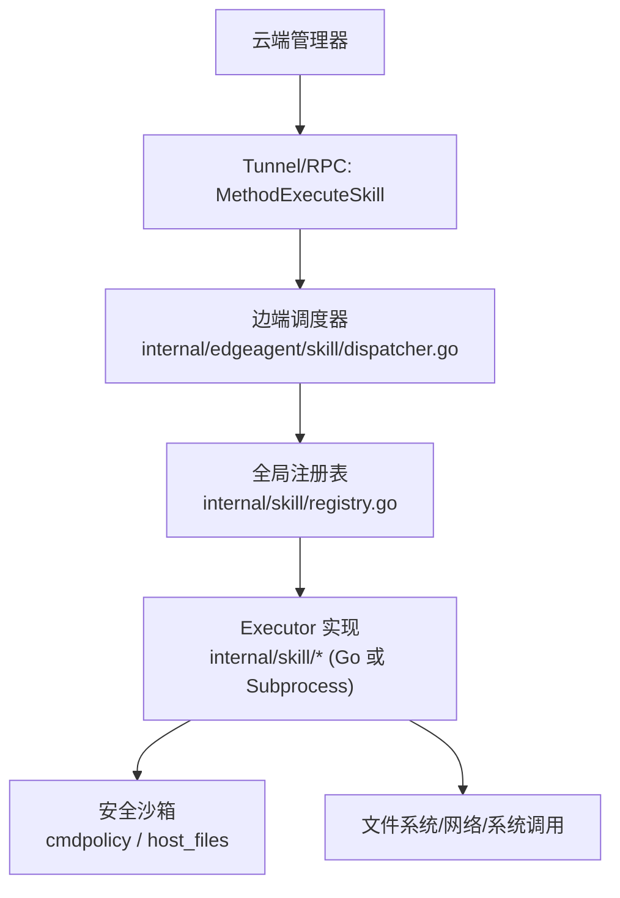
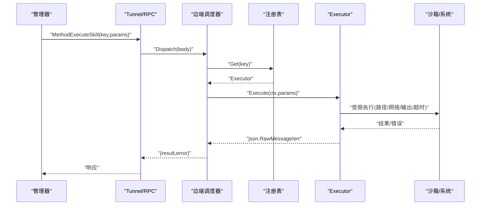
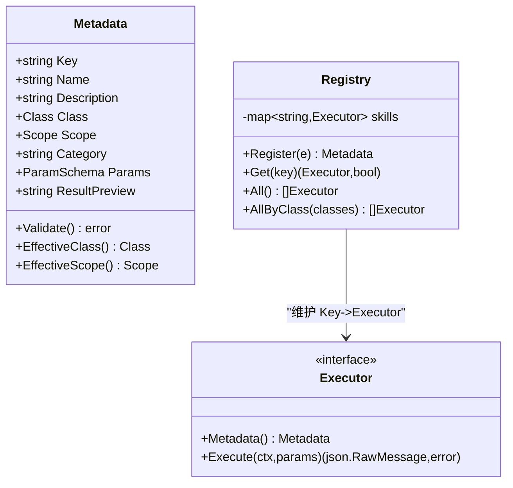
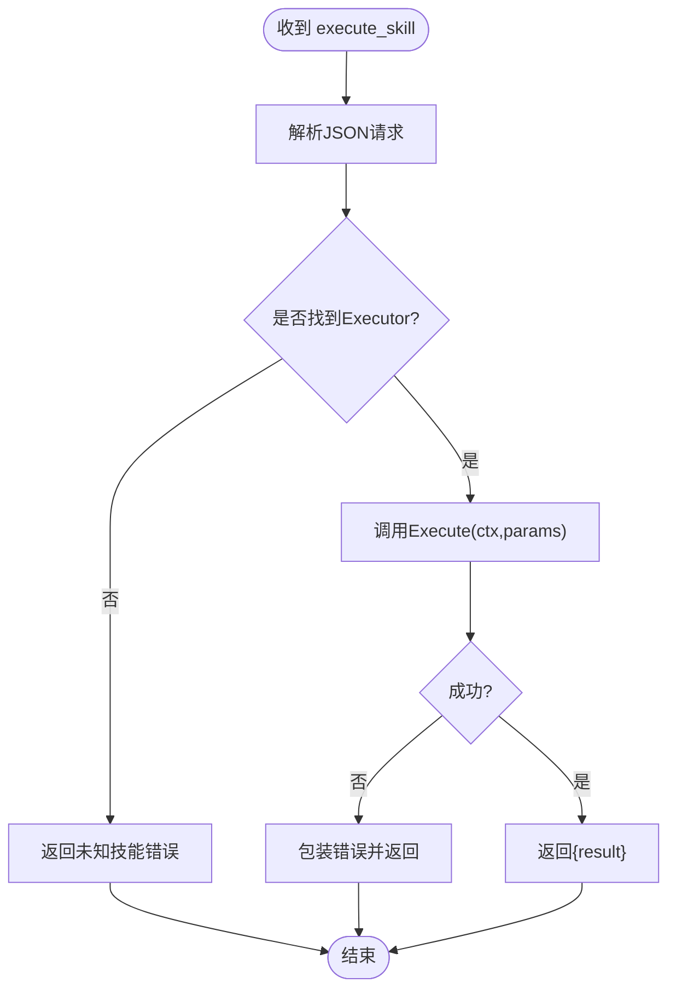
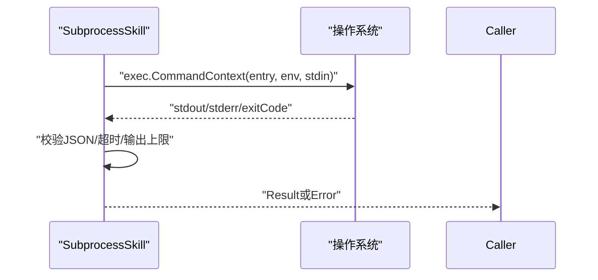
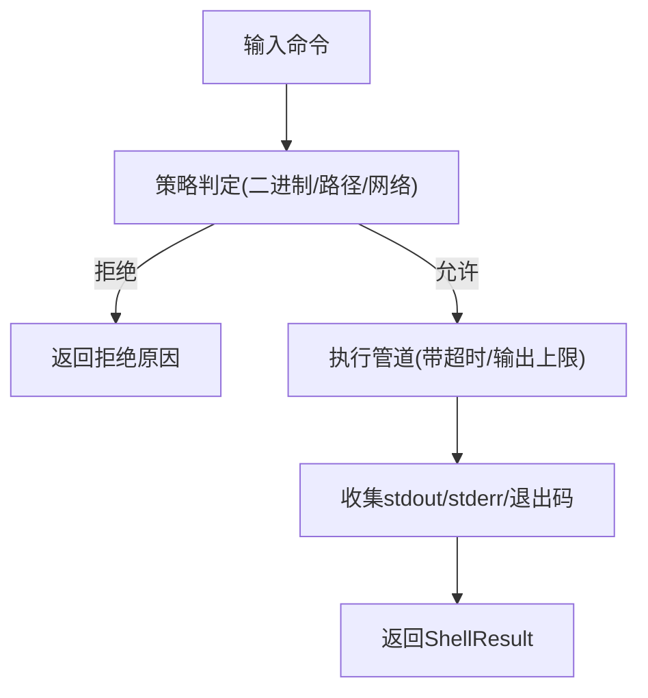
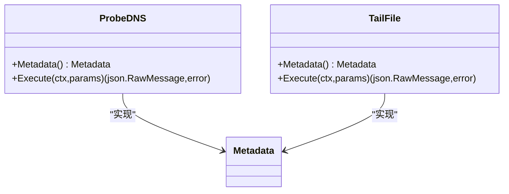
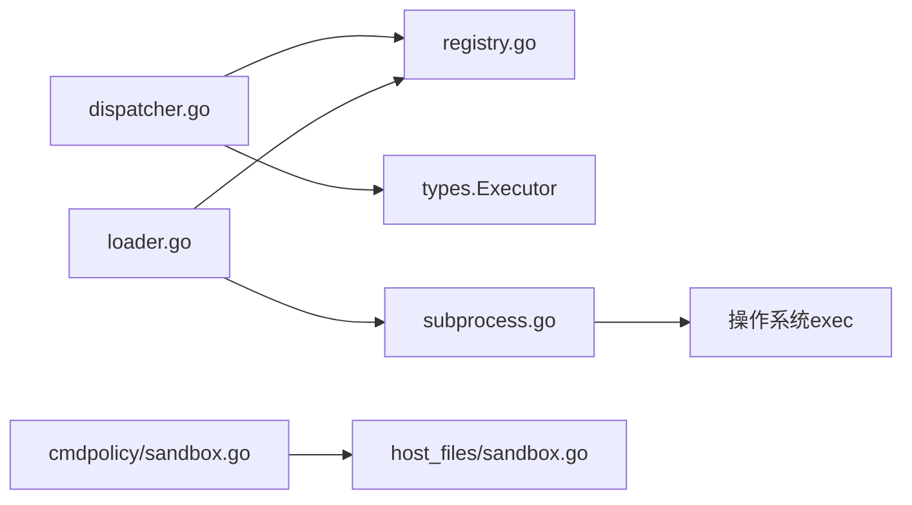

# 技能执行框架

<cite>
**本文引用的文件**
- [internal/skill/types.go](file://internal/skill/types.go)
- [internal/skill/registry.go](file://internal/skill/registry.go)
- [internal/skill/loader.go](file://internal/skill/loader.go)
- [internal/skill/subprocess.go](file://internal/skill/subprocess.go)
- [internal/edgeagent/skill/dispatcher.go](file://internal/edgeagent/skill/dispatcher.go)
- [internal/skill/builtin/probe_dns.go](file://internal/skill/builtin/probe_dns.go)
- [internal/skill/builtin/tail_file.go](file://internal/skill/builtin/tail_file.go)
- [internal/edgeagent/cmdpolicy/sandbox.go](file://internal/edgeagent/cmdpolicy/sandbox.go)
- [internal/edgeagent/host_files/sandbox.go](file://internal/edgeagent/host_files/sandbox.go)
- [skills/bash/SKILL.md](file://skills/bash/SKILL.md)
- [deploy/install/edge/install.sh](file://deploy/install/edge/install.sh)
- [internal/skill/subprocess_test.go](file://internal/skill/subprocess_test.go)
</cite>

## 目录
1. [简介](#简介)
2. [项目结构](#项目结构)
3. [核心组件](#核心组件)
4. [架构总览](#架构总览)
5. [详细组件分析](#详细组件分析)
6. [依赖关系分析](#依赖关系分析)
7. [性能与资源限制](#性能与资源限制)
8. [故障排查指南](#故障排查指南)
9. [结论](#结论)
10. [附录：API参考、配置与部署](#附录api参考配置与部署)

## 简介
本文件系统化说明 ongrid 的“技能执行框架”，覆盖技能注册机制、调度器实现、执行环境管理、子进程隔离、资源限制与安全沙箱，以及技能生命周期、状态跟踪与错误处理。同时梳理内置技能（网络探测、文件操作、系统检查）的功能与用法，并提供开发规范、测试方法与部署流程建议。

## 项目结构
- 技能核心定义与注册：位于 internal/skill，提供统一接口、元数据、全局注册表、外部技能加载器与子进程执行器。
- 边端调度：internal/edgeagent/skill/dispatcher.go 将云端下发的 execute_skill RPC 分发到具体 Executor。
- 安全与沙箱：internal/edgeagent/cmdpolicy/sandbox.go 与 internal/edgeagent/host_files/sandbox.go 提供命令策略、路径校验、网络白名单与输出限流。
- 内置技能：internal/skill/builtin 提供 DNS 解析、文件尾部读取等能力。
- 文档与部署：skills/bash/SKILL.md 描述边缘侧 bash 工具的使用与约束；deploy/install/edge/install.sh 提供边缘节点安装脚本。

**图示来源**
- [internal/edgeagent/skill/dispatcher.go:16-44](file://internal/edgeagent/skill/dispatcher.go#L16-L44)
- [internal/skill/registry.go:10-47](file://internal/skill/registry.go#L10-L47)
- [internal/skill/subprocess.go:30-78](file://internal/skill/subprocess.go#L30-L78)
- [internal/edgeagent/cmdpolicy/sandbox.go:17-38](file://internal/edgeagent/cmdpolicy/sandbox.go#L17-L38)
- [internal/edgeagent/host_files/sandbox.go:1-24](file://internal/edgeagent/host_files/sandbox.go#L1-L24)

**章节来源**
- [internal/skill/types.go:1-27](file://internal/skill/types.go#L1-L27)
- [internal/skill/registry.go:10-47](file://internal/skill/registry.go#L10-L47)
- [internal/edgeagent/skill/dispatcher.go:1-56](file://internal/edgeagent/skill/dispatcher.go#L1-L56)

## 核心组件
- 技能元数据与执行接口：定义权限等级（safe/mutating/dangerous）、作用域（host/manager）、参数 Schema、结果预览等，并规定 Execute(ctx, params) 契约。
- 全局注册表：维护 Key→Executor 映射，支持按权限类过滤枚举，启动时完成注册，运行时并发读。
- 外部技能加载器：扫描指定目录下的 skill.json，构建 SubprocessSkill 并注册，强制 ScopeManager，限制 Entry 路径在允许根目录下。
- 子进程执行器：以 JSON 通过 stdin/stdout 通信，限制 stdout/stderr 大小、超时、环境变量白名单，非零退出码视为错误。
- 边端调度器：解析请求体，查找 Executor，执行并封装结果/错误返回。

**章节来源**
- [internal/skill/types.go:35-125](file://internal/skill/types.go#L35-L125)
- [internal/skill/registry.go:10-127](file://internal/skill/registry.go#L10-L127)
- [internal/skill/loader.go:13-74](file://internal/skill/loader.go#L13-L74)
- [internal/skill/subprocess.go:17-78](file://internal/skill/subprocess.go#L17-L78)
- [internal/edgeagent/skill/dispatcher.go:16-44](file://internal/edgeagent/skill/dispatcher.go#L16-L44)

## 架构总览
云端通过隧道下发 execute_skill 请求，边端调度器根据 key 从全局注册表找到对应 Executor 执行。Go 原生技能直接在进程内运行；外部技能通过 SubprocessSkill 在独立进程中执行，受限于超时、输出上限与环境变量白名单。所有涉及系统资源的调用均经过 cmdpolicy 与 host_files 的安全策略校验。

**图示来源**
- [internal/edgeagent/skill/dispatcher.go:16-44](file://internal/edgeagent/skill/dispatcher.go#L16-L44)
- [internal/skill/registry.go:35-47](file://internal/skill/registry.go#L35-L47)
- [internal/skill/subprocess.go:99-172](file://internal/skill/subprocess.go#L99-L172)
- [internal/edgeagent/cmdpolicy/sandbox.go:140-188](file://internal/edgeagent/cmdpolicy/sandbox.go#L140-L188)

## 详细组件分析

### 技能类型与注册机制
- 权限类：safe（只读无副作用）、mutating（可逆修改）、dangerous（不可逆/集群影响）。默认 safe，缺失时需显式声明。
- 作用域：ScopeHost（在目标边缘设备执行，需 edge_id），ScopeManager（在管理器进程执行，适合访问公网或运行子进程包）。
- 参数 Schema：声明 UI 表单与 LLM 函数调用所需 JSON Schema；支持基础类型、枚举、数组及元素类型。
- 注册表：全局单例，init 阶段注册，运行时并发读；重复 Key 会 panic，便于作者级错误尽早暴露。

**图示来源**
- [internal/skill/types.go:99-175](file://internal/skill/types.go#L99-L175)
- [internal/skill/registry.go:21-74](file://internal/skill/registry.go#L21-L74)

**章节来源**
- [internal/skill/types.go:35-175](file://internal/skill/types.go#L35-L175)
- [internal/skill/registry.go:10-74](file://internal/skill/registry.go#L10-L74)

### 调度器实现（边端）
- 接收 execute_skill 请求体，解析 key 与 params。
- 查询注册表获取 Executor，调用 Execute。
- 将错误或结果统一封装为 {result,error} 返回，保持审计链路完整。

**图示来源**
- [internal/edgeagent/skill/dispatcher.go:16-44](file://internal/edgeagent/skill/dispatcher.go#L16-L44)

**章节来源**
- [internal/edgeagent/skill/dispatcher.go:16-44](file://internal/edgeagent/skill/dispatcher.go#L16-L44)

### 执行环境与子进程隔离
- 外部技能以独立进程运行，stdin 传入 JSON 参数，stdout 必须为合法 JSON。
- 环境变量白名单：仅允许 manifest 中声明的环境变量注入，默认不继承 PATH。
- 资源限制：
  - 超时：默认 30s，可通过 manifest 配置。
  - 输出上限：stdout 最大 16MiB，stderr 保留尾部 4KiB 用于诊断。
  - 路径限制：Entry 必须绝对路径且位于允许的根目录下，防止逃逸。
- 错误语义：非零退出码、上下文超时、非法 JSON 均作为错误返回，附带 stderr 片段。

**图示来源**
- [internal/skill/subprocess.go:99-172](file://internal/skill/subprocess.go#L99-L172)
- [internal/skill/subprocess.go:207-238](file://internal/skill/subprocess.go#L207-L238)

**章节来源**
- [internal/skill/subprocess.go:17-78](file://internal/skill/subprocess.go#L17-L78)
- [internal/skill/subprocess.go:99-172](file://internal/skill/subprocess.go#L99-L172)
- [internal/skill/loader.go:176-254](file://internal/skill/loader.go#L176-L254)

### 安全沙箱与资源限制
- 命令策略（cmdpolicy）：
  - 二进制白名单：仅允许预定义的可执行名。
  - 路径校验：复用 host_files 的路径验证，拒绝相对路径、符号链接逃逸与敏感路径。
  - 网络主机白名单：对 curl/wget/dig/ping 等网络命令的目标主机进行匹配，空列表即拒绝全部出站。
  - 管道执行：支持多段命令通过 stdout→stdin 连接，统一超时与输出上限。
- 文件系统沙箱（host_files）：
  - 默认拒绝虚拟文件系统（/proc,/sys,/dev,/run）与敏感文件（shadow、SSH/GPG 私钥等）。
  - 可选白名单：当设置 AllowedReadPaths 时，路径还需命中白名单前缀。
  - 二进制发现：启动时解析 find/du/stat/ls 等，缺失则不可用。

**图示来源**
- [internal/edgeagent/cmdpolicy/sandbox.go:76-132](file://internal/edgeagent/cmdpolicy/sandbox.go#L76-L132)
- [internal/edgeagent/cmdpolicy/sandbox.go:140-188](file://internal/edgeagent/cmdpolicy/sandbox.go#L140-L188)
- [internal/edgeagent/host_files/sandbox.go:111-193](file://internal/edgeagent/host_files/sandbox.go#L111-L193)

**章节来源**
- [internal/edgeagent/cmdpolicy/sandbox.go:17-38](file://internal/edgeagent/cmdpolicy/sandbox.go#L17-L38)
- [internal/edgeagent/cmdpolicy/sandbox.go:76-188](file://internal/edgeagent/cmdpolicy/sandbox.go#L76-L188)
- [internal/edgeagent/host_files/sandbox.go:34-109](file://internal/edgeagent/host_files/sandbox.go#L34-L109)
- [internal/edgeagent/host_files/sandbox.go:135-193](file://internal/edgeagent/host_files/sandbox.go#L135-L193)

### 内置技能功能与使用
- DNS 解析（host_probe_dns）：
  - 功能：解析主机名为 A/AAAA 地址，返回延迟与错误信息。
  - 权限：safe；作用域：host（默认）。
  - 参数：host（必填）、timeout_ms（可选，默认 3000ms）。
  - 结果预览：包含 addrs、latency_ms、error?。
- 文件尾部读取（host_tail_file）：
  - 功能：类似 tail -n，读取文件最后 N 行，支持字节预算与截断标记。
  - 权限：safe；作用域：host。
  - 参数：path（必填，绝对路径且不含 ..）、lines（可选，默认 100）、max_bytes（可选，默认 1MiB）。
  - 结果预览：包含 lines、total_lines_returned、file_size、truncated、error?。

**图示来源**
- [internal/skill/builtin/probe_dns.go:15-85](file://internal/skill/builtin/probe_dns.go#L15-L85)
- [internal/skill/builtin/tail_file.go:17-133](file://internal/skill/builtin/tail_file.go#L17-L133)

**章节来源**
- [internal/skill/builtin/probe_dns.go:15-85](file://internal/skill/builtin/probe_dns.go#L15-L85)
- [internal/skill/builtin/tail_file.go:17-133](file://internal/skill/builtin/tail_file.go#L17-L133)

### 生命周期、状态跟踪与错误处理
- 生命周期：
  - 启动期：注册表初始化，加载内置与外部技能清单，校验元数据。
  - 运行期：调度器按 key 分发执行，记录审计日志（由上层服务负责）。
  - 销毁期：子进程随上下文取消而终止，输出缓冲释放。
- 状态跟踪：
  - 子进程执行器记录超时、退出码、stderr 尾部，便于审计与排错。
  - 管道执行器记录每段 stderr 与最终 stdout，并标记是否被截断。
- 错误处理：
  - 参数校验失败：立即返回错误，不进入执行。
  - 策略拒绝：返回 reason，提示调整命令或配置。
  - 运行时错误：包装上下文错误、非零退出码、非法 JSON 输出，附带诊断片段。

**章节来源**
- [internal/skill/loader.go:69-160](file://internal/skill/loader.go#L69-L160)
- [internal/skill/subprocess.go:99-172](file://internal/skill/subprocess.go#L99-L172)
- [internal/edgeagent/cmdpolicy/sandbox.go:140-188](file://internal/edgeagent/cmdpolicy/sandbox.go#L140-L188)

## 依赖关系分析
- 模块耦合：
  - dispatcher 依赖 registry 与 executor 接口，解耦具体实现。
  - loader 依赖注册表与 subprocess 实现，负责外部技能装配。
  - cmdpolicy 与 host_files 提供安全边界，被调度与技能实现间接使用。
- 外部依赖：
  - 子进程执行依赖操作系统 exec 能力。
  - 网络探测依赖系统解析器与网络栈。
- 循环依赖：未发现直接循环依赖；职责分层清晰。

**图示来源**
- [internal/edgeagent/skill/dispatcher.go:16-44](file://internal/edgeagent/skill/dispatcher.go#L16-L44)
- [internal/skill/loader.go:69-160](file://internal/skill/loader.go#L69-L160)
- [internal/skill/subprocess.go:207-238](file://internal/skill/subprocess.go#L207-L238)
- [internal/edgeagent/cmdpolicy/sandbox.go:140-188](file://internal/edgeagent/cmdpolicy/sandbox.go#L140-L188)
- [internal/edgeagent/host_files/sandbox.go:135-193](file://internal/edgeagent/host_files/sandbox.go#L135-L193)

**章节来源**
- [internal/edgeagent/skill/dispatcher.go:16-44](file://internal/edgeagent/skill/dispatcher.go#L16-L44)
- [internal/skill/loader.go:69-160](file://internal/skill/loader.go#L69-L160)
- [internal/skill/subprocess.go:207-238](file://internal/skill/subprocess.go#L207-L238)
- [internal/edgeagent/cmdpolicy/sandbox.go:140-188](file://internal/edgeagent/cmdpolicy/sandbox.go#L140-L188)
- [internal/edgeagent/host_files/sandbox.go:135-193](file://internal/edgeagent/host_files/sandbox.go#L135-L193)

## 性能与资源限制
- 子进程输出限制：stdout 上限 16MiB，stderr 保留尾部 4KiB，避免内存膨胀。
- 超时控制：默认 30s，可通过 manifest 或策略配置，防止长任务阻塞。
- 管道执行：多段命令共享上下文超时，输出分别限流，减少资源占用。
- 路径与网络限制：减少不必要 I/O 与外联，降低抖动与安全风险。
- 优化建议：
  - 合理设置 max_bytes 与 lines，避免大文件全量读取。
  - 使用结构化技能优先于通用 shell，减少 token 与解析开销。
  - 对高频技能缓存结果（由上层服务实现），避免重复 IO。

[本节为通用指导，无需特定文件引用]

## 故障排查指南
- 常见错误与定位：
  - 未知技能 key：检查注册表是否加载该技能，确认 key 命名符合 lower_snake。
  - 子进程超时：检查 manifest 中 timeout_seconds 与任务复杂度。
  - 非 JSON 输出：确保外部技能 stdout 输出合法 JSON。
  - 策略拒绝：查看 reason，调整命令或扩展 allowlist。
  - 路径拒绝：确认路径为绝对路径且不在 DeniedReadPaths，必要时调整 AllowedReadPaths。
- 调试手段：
  - 启用 loader 日志，观察技能加载情况。
  - 捕获 stderr 尾部，快速定位子进程异常。
  - 使用单元测试模拟子进程行为，验证参数传递与错误分支。

**章节来源**
- [internal/skill/loader.go:69-160](file://internal/skill/loader.go#L69-L160)
- [internal/skill/subprocess.go:99-172](file://internal/skill/subprocess.go#L99-L172)
- [internal/edgeagent/cmdpolicy/sandbox.go:76-132](file://internal/edgeagent/cmdpolicy/sandbox.go#L76-L132)
- [internal/edgeagent/host_files/sandbox.go:135-193](file://internal/edgeagent/host_files/sandbox.go#L135-L193)
- [internal/skill/subprocess_test.go:122-185](file://internal/skill/subprocess_test.go#L122-L185)

## 结论
技能执行框架通过统一的元数据与接口，实现了 Go 原生与外部子进程技能的无缝集成；借助注册表与调度器，云端与边端协同执行；通过 cmdpolicy 与 host_files 提供细粒度安全与资源限制；配合完善的错误处理与测试用例，保障稳定性与可维护性。建议在业务中优先使用结构化技能，结合沙箱策略与资源限制，实现安全高效的运维自动化。

[本节为总结，无需特定文件引用]

## 附录：API参考、配置与部署

### API参考（execute_skill）
- 请求体字段：
  - key：技能唯一标识（lower_snake）。
  - params：JSON 对象，按技能元数据中的 ParamSchema 校验。
- 响应体字段：
  - result：成功时的 JSON 结果。
  - error：失败时的错误消息。

**章节来源**
- [internal/edgeagent/skill/dispatcher.go:16-44](file://internal/edgeagent/skill/dispatcher.go#L16-L44)

### 配置选项
- 外部技能清单（skill.json）关键字段：
  - name：技能键名（lower_snake）。
  - description：人类可读描述。
  - schema：可选的原始 JSON Schema。
  - entry：可执行入口路径（相对或绝对，需位于允许根目录）。
  - env_allow：允许注入的环境变量名列表。
  - timeout_seconds：子进程超时秒数（默认 30s）。
  - class：权限类（safe/mutating/dangerous，默认 safe）。
  - category：UI 分组标签（默认 external）。

**章节来源**
- [internal/skill/loader.go:13-74](file://internal/skill/loader.go#L13-L74)
- [internal/skill/loader.go:176-254](file://internal/skill/loader.go#L176-L254)

### 部署流程（边缘节点）
- 使用 install.sh 下载并安装 ongrid-edge，支持凭据模式与令牌模式。
- 关键参数：
  - --access-key/--secret-key：访问凭据。
  - --enrollment-token：一次性入网令牌。
  - --server-edge-addr：边缘隧道地址。
  - --server-http-addr：HTTP 前端地址。
  - --tls-insecure：跳过 TLS 校验（仅限自签名场景）。
- 安装后自动注册服务并等待云端握手成功。

**章节来源**
- [deploy/install/edge/install.sh:1-200](file://deploy/install/edge/install.sh#L1-L200)

### 技能开发规范
- 元数据规范：
  - Key 必须为 lower_snake，Name 与 Description 必填。
  - Class 与 Scope 明确声明，避免默认带来的误判。
  - Params 使用 ParamSchema，必要时提供 RawSchemaProvider。
- 安全实践：
  - 外部技能 Entry 必须在允许根目录下，环境变量严格白名单。
  - 输出必须为合法 JSON，避免污染上游解析。
  - 遵循 cmdpolicy 与 host_files 的策略，避免写操作与危险命令。
- 测试方法：
  - 使用单元测试模拟子进程，验证参数传递、超时、错误分支。
  - 覆盖正常路径、非法参数、缺失二进制、非 JSON 输出等场景。

**章节来源**
- [internal/skill/types.go:99-175](file://internal/skill/types.go#L99-L175)
- [internal/skill/loader.go:176-254](file://internal/skill/loader.go#L176-L254)
- [internal/skill/subprocess_test.go:29-200](file://internal/skill/subprocess_test.go#L29-L200)
- [skills/bash/SKILL.md:1-188](file://skills/bash/SKILL.md#L1-L188)