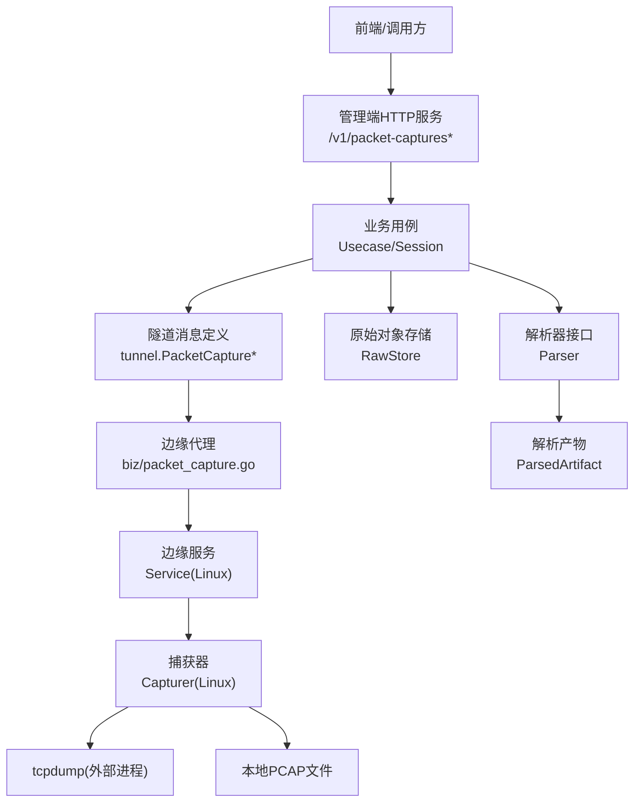
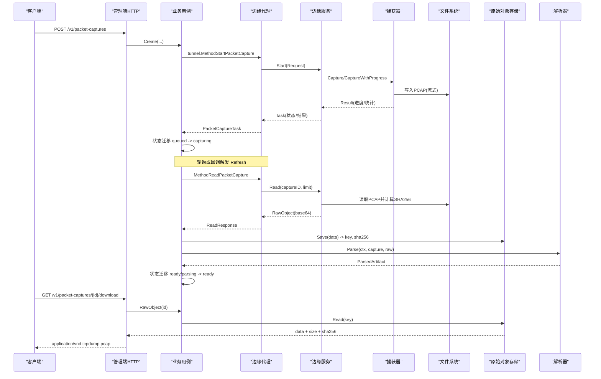
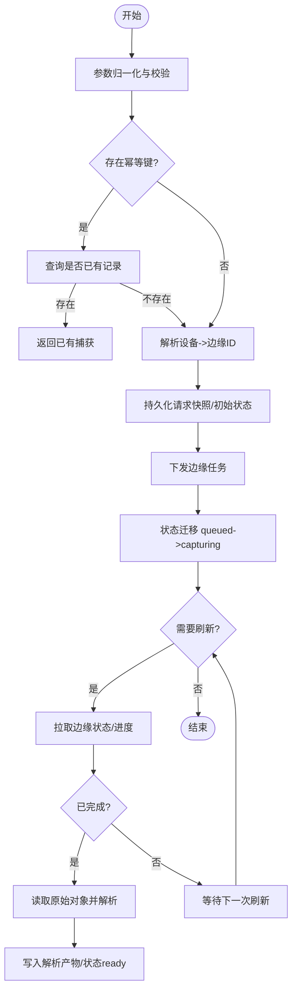
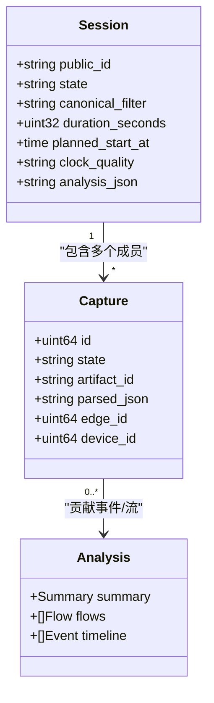
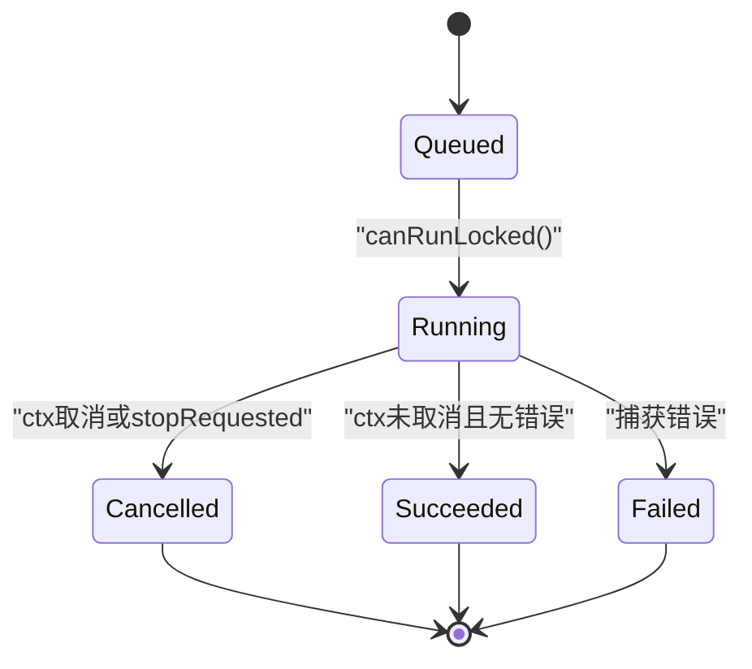
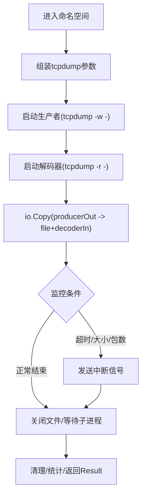
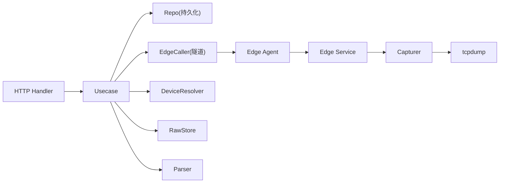

# 数据包捕获

<cite>
**本文引用的文件**
- [packet_capture.proto](file://api/manager/packetcapture/v1/packet_capture.proto)
- [usecase.go](file://internal/manager/biz/packetcapture/usecase.go)
- [session.go](file://internal/manager/biz/packetcapture/session.go)
- [http.go](file://internal/manager/server/packetcapture/http.go)
- [model.go](file://internal/manager/model/packetcapture/model.go)
- [packet_capture.go](file://internal/pkg/tunnel/packet_capture.go)
- [service_linux.go](file://internal/edgeagent/packetcapture/service_linux.go)
- [capture_linux.go](file://internal/edgeagent/packetcapture/capture_linux.go)
</cite>

## 目录
1. [简介](#简介)
2. [项目结构](#项目结构)
3. [核心组件](#核心组件)
4. [架构总览](#架构总览)
5. [详细组件分析](#详细组件分析)
6. [依赖关系分析](#依赖关系分析)
7. [性能与调优](#性能与调优)
8. [故障诊断与排错](#故障诊断与排错)
9. [结论](#结论)
10. [附录：过滤语法与规则](#附录：过滤语法与规则)

## 简介
本模块提供端到端的数据包捕获能力，覆盖从管理端 API、任务编排、边缘侧实时捕获、原始 PCAP 存储与校验、解析产物持久化，到会话级多网卡协同与结果分析。其设计要点包括：
- 通过隧道协议将“创建/刷新/停止/取消”等控制面指令下发至边缘节点，边缘使用系统工具进行真实抓包并产出 PCAP。
- 管理端负责状态机推进、原始对象落盘与哈希校验、解析产物生成与下载鉴权。
- 支持网络命名空间切换、多目标会话（多设备/多接口）统一编排与聚合分析。
- 提供预定义的安全过滤语法，限制为最小可用集，避免复杂 BPF 表达式带来的风险。

## 项目结构
该功能横跨三层：
- 管理端 HTTP 服务：暴露 RESTful API，处理认证、参数校验、任务生命周期控制与会话聚合。
- 管理端业务层：实现状态机、边缘调度、原始对象存取、解析产物写入、会话分析与协调。
- 边缘代理：接收任务、执行捕获、维护本地任务队列与进度、返回只读元数据与受限的原始数据读取。

**图表来源**
- [http.go:32-47](file://internal/manager/server/packetcapture/http.go#L32-L47)
- [usecase.go:240-379](file://internal/manager/biz/packetcapture/usecase.go#L240-L379)
- [packet_capture.go:5-22](file://internal/pkg/tunnel/packet_capture.go#L5-L22)
- [service_linux.go:47-77](file://internal/edgeagent/packetcapture/service_linux.go#L47-L77)
- [capture_linux.go:131-187](file://internal/edgeagent/packetcapture/capture_linux.go#L131-L187)

**章节来源**
- [http.go:32-47](file://internal/manager/server/packetcapture/http.go#L32-L47)
- [packet_capture.proto:9-26](file://api/manager/packetcapture/v1/packet_capture.proto#L9-L26)

## 核心组件
- 管理端 HTTP 处理器：注册路由、鉴权、请求解析、DTO 转换、错误码映射。
- 业务用例 Usecase：创建捕获、刷新状态、停止/取消、原始对象读取、解析入库、会话创建与协调。
- 会话 Session：多目标捕获的协调记录、成员捕获聚合、完成事件通知、会话分析。
- 模型 Model：持久化的捕获与会话实体、状态常量、字段约束。
- 隧道协议 Tunnel：定义 manager-to-edge 的消息类型与方法名。
- 边缘服务 Service：任务入队、并发控制、进度上报、取消/停止、读取完成结果。
- 捕获器 Capturer：进入指定网络命名空间、启动 tcpdump、管道复制、预览解码、超时/大小/包数限制、清理与失败回滚。

**章节来源**
- [http.go:24-81](file://internal/manager/server/packetcapture/http.go#L24-L81)
- [usecase.go:99-117](file://internal/manager/biz/packetcapture/usecase.go#L99-L117)
- [session.go:21-47](file://internal/manager/biz/packetcapture/session.go#L21-L47)
- [model.go:13-34](file://internal/manager/model/packetcapture/model.go#L13-L34)
- [packet_capture.go:24-114](file://internal/pkg/tunnel/packet_capture.go#L24-L114)
- [service_linux.go:17-77](file://internal/edgeagent/packetcapture/service_linux.go#L17-L77)
- [capture_linux.go:40-69](file://internal/edgeagent/packetcapture/capture_linux.go#L40-L69)

## 架构总览
下图展示一次完整的捕获流程：从创建到边缘执行、原始对象落地、解析产物生成与下载。

**图表来源**
- [http.go:421-453](file://internal/manager/server/packetcapture/http.go#L421-L453)
- [usecase.go:262-379](file://internal/manager/biz/packetcapture/usecase.go#L262-L379)
- [usecase.go:445-520](file://internal/manager/biz/packetcapture/usecase.go#L445-L520)
- [usecase.go:602-716](file://internal/manager/biz/packetcapture/usecase.go#L602-L716)
- [packet_capture.go:5-22](file://internal/pkg/tunnel/packet_capture.go#L5-L22)
- [service_linux.go:82-110](file://internal/edgeagent/packetcapture/service_linux.go#L82-L110)
- [capture_linux.go:131-187](file://internal/edgeagent/packetcapture/capture_linux.go#L131-L187)

## 详细组件分析

### 管理端 HTTP 服务
- 路由注册：捕获列表、详情、创建、刷新、停止、取消；会话列表、详情、创建、刷新、停止、取消；工件下载。
- 鉴权与权限：租户上下文校验，写操作需非 viewer 角色。
- DTO 转换：将领域模型转换为对外 JSON，包含 live_preview、analysis 等。
- 下载保护：内部下载支持令牌校验，外部下载直接鉴权后输出二进制。

**章节来源**
- [http.go:32-47](file://internal/manager/server/packetcapture/http.go#L32-L47)
- [http.go:68-81](file://internal/manager/server/packetcapture/http.go#L68-L81)
- [http.go:361-419](file://internal/manager/server/packetcapture/http.go#L361-L419)

### 业务用例 Usecase
- 创建捕获：参数归一化、幂等键去重、设备到边缘 ID 解析、持久化请求快照、下发边缘任务、状态迁移。
- 刷新捕获：拉取边缘任务状态，更新 captured_bytes/packets/live_preview，必要时触发解析入库。
- 停止/取消：分别保留有效前缀与丢弃部分输出，状态迁移并持久化。
- 原始对象读取：优先使用已保存的 key，否则通过隧道读取边缘 PCAP 并落盘，校验大小与 SHA256。
- 解析产物：将 PCAP 转为结构化摘要与包列表，持久化为 parsed_json，状态迁移至 ready。
- 失败恢复：解析失败时保留原始对象并标记失败，便于后续重试或人工干预。

**图表来源**
- [usecase.go:262-379](file://internal/manager/biz/packetcapture/usecase.go#L262-L379)
- [usecase.go:445-520](file://internal/manager/biz/packetcapture/usecase.go#L445-L520)
- [usecase.go:602-716](file://internal/manager/biz/packetcapture/usecase.go#L602-L716)

**章节来源**
- [usecase.go:262-379](file://internal/manager/biz/packetcapture/usecase.go#L262-L379)
- [usecase.go:445-520](file://internal/manager/biz/packetcapture/usecase.go#L445-L520)
- [usecase.go:602-716](file://internal/manager/biz/packetcapture/usecase.go#L602-L716)

### 会话 Session
- 创建会话：在发起任何边缘 RPC 之前先创建协调记录，按目标逐个创建捕获，支持延迟启动。
- 刷新会话：遍历成员捕获，对未完成者调用刷新，汇总分析并持久化。
- 取消/停止会话：对非终态成员执行取消或停止，尽可能保留有效数据。
- 会话分析：基于解析产物提取时间线、流聚合、缺失边检测，并提示时钟质量。

**图表来源**
- [session.go:21-47](file://internal/manager/biz/packetcapture/session.go#L21-L47)
- [session.go:55-110](file://internal/manager/biz/packetcapture/session.go#L55-L110)
- [session.go:173-212](file://internal/manager/biz/packetcapture/session.go#L173-L212)
- [session.go:300-394](file://internal/manager/biz/packetcapture/session.go#L300-L394)
- [model.go:95-127](file://internal/manager/model/packetcapture/model.go#L95-L127)

**章节来源**
- [session.go:55-110](file://internal/manager/biz/packetcapture/session.go#L55-L110)
- [session.go:173-212](file://internal/manager/biz/packetcapture/session.go#L173-L212)
- [session.go:214-250](file://internal/manager/biz/packetcapture/session.go#L214-L250)
- [session.go:300-394](file://internal/manager/biz/packetcapture/session.go#L300-L394)
- [model.go:95-127](file://internal/manager/model/packetcapture/model.go#L95-L127)

### 边缘服务 Service(Linux)
- 任务入队与并发控制：同一时刻仅运行一个捕获，防止内存/磁盘/拷贝压力倍增；支持排队上限。
- 生命周期：queued -> running -> succeeded/failed/cancelled；支持 Stop 保留有效前缀。
- 进度上报：通过 ProgressReporter 周期性上报 Result，包含包数、字节数、预览行。
- 读取限制：Read 方法限制最大读取字节数，并计算 SHA256。

**图表来源**
- [service_linux.go:17-25](file://internal/edgeagent/packetcapture/service_linux.go#L17-L25)
- [service_linux.go:82-110](file://internal/edgeagent/packetcapture/service_linux.go#L82-L110)
- [service_linux.go:112-208](file://internal/edgeagent/packetcapture/service_linux.go#L112-L208)
- [service_linux.go:269-383](file://internal/edgeagent/packetcapture/service_linux.go#L269-L383)

**章节来源**
- [service_linux.go:47-77](file://internal/edgeagent/packetcapture/service_linux.go#L47-L77)
- [service_linux.go:82-110](file://internal/edgeagent/packetcapture/service_linux.go#L82-L110)
- [service_linux.go:112-208](file://internal/edgeagent/packetcapture/service_linux.go#L112-L208)
- [service_linux.go:269-383](file://internal/edgeagent/packetcapture/service_linux.go#L269-L383)

### 捕获器 Capturer(Linux)
- 网络命名空间：通过 setns 切换到目标 netns，确保在容器/隔离环境中抓取正确流量。
- 捕获实现：启动 tcpdump 写入 PCAP，同时用另一个 tcpdump 实例解码为文本行作为 LivePreview。
- 资源限制：默认/最大时长、最大字节、最大包数、snaplen；达到阈值即优雅停止。
- 清理策略：失败路径删除未完成文件，成功路径保留最终 PCAP。

**图表来源**
- [capture_linux.go:101-129](file://internal/edgeagent/packetcapture/capture_linux.go#L101-L129)
- [capture_linux.go:131-187](file://internal/edgeagent/packetcapture/capture_linux.go#L131-L187)
- [capture_linux.go:247-335](file://internal/edgeagent/packetcapture/capture_linux.go#L247-L335)
- [capture_linux.go:337-346](file://internal/edgeagent/packetcapture/capture_linux.go#L337-L346)

**章节来源**
- [capture_linux.go:101-129](file://internal/edgeagent/packetcapture/capture_linux.go#L101-L129)
- [capture_linux.go:131-187](file://internal/edgeagent/packetcapture/capture_linux.go#L131-L187)
- [capture_linux.go:247-335](file://internal/edgeagent/packetcapture/capture_linux.go#L247-L335)
- [capture_linux.go:337-346](file://internal/edgeagent/packetcapture/capture_linux.go#L337-L346)

### 隧道协议与传输
- 方法名：start/get/read/cancel/stop。
- 请求/响应：包含 capture_id、interface、network_namespace、filter、duration、max_bytes、max_packets、snaplen、promiscuous、start_at。
- 安全边界：边缘不返回本地文件路径；read 仅用于管理端内部读取原始对象。

**章节来源**
- [packet_capture.go:5-22](file://internal/pkg/tunnel/packet_capture.go#L5-L22)
- [packet_capture.go:24-114](file://internal/pkg/tunnel/packet_capture.go#L24-L114)

## 依赖关系分析
- HTTP 层依赖业务用例；业务用例依赖仓库接口、边缘调用器、设备解析器、原始对象存储、解析器。
- 边缘代理依赖边缘服务；边缘服务依赖捕获器；捕获器依赖操作系统工具 tcpdump。
- 会话与捕获共享模型定义；会话分析依赖解析产物。

**图表来源**
- [http.go:24-81](file://internal/manager/server/packetcapture/http.go#L24-L81)
- [usecase.go:99-117](file://internal/manager/biz/packetcapture/usecase.go#L99-L117)
- [packet_capture.go:5-22](file://internal/pkg/tunnel/packet_capture.go#L5-L22)
- [service_linux.go:47-77](file://internal/edgeagent/packetcapture/service_linux.go#L47-L77)
- [capture_linux.go:131-187](file://internal/edgeagent/packetcapture/capture_linux.go#L131-L187)

**章节来源**
- [http.go:24-81](file://internal/manager/server/packetcapture/http.go#L24-L81)
- [usecase.go:99-117](file://internal/manager/biz/packetcapture/usecase.go#L99-L117)
- [packet_capture.go:5-22](file://internal/pkg/tunnel/packet_capture.go#L5-L22)
- [service_linux.go:47-77](file://internal/edgeagent/packetcapture/service_linux.go#L47-L77)
- [capture_linux.go:131-187](file://internal/edgeagent/packetcapture/capture_linux.go#L131-L187)

## 性能与调优
- 单实例并发限制：边缘服务强制同一时刻仅运行一个捕获，避免 AF_PACKET 双开导致内存/磁盘/拷贝压力翻倍。
- 队列上限：最多允许一定数量的排队捕获，防止无限堆积。
- 资源限制：默认与最大时长、最大字节、最大包数、snaplen 均受控，避免长时间高吞吐影响主机健康。
- 预览缓冲：LivePreview 仅保留有限行数，减少内存占用。
- 进度上报节流：周期上报，降低通道开销。
- 建议：在高流量场景下适当增大 snaplen 与 max_bytes，缩短 duration；或使用更严格的过滤以减少数据量。

[本节为通用指导，不直接分析具体文件]

## 故障诊断与排错
- 常见错误：
  - 边缘不可用或未配置：返回“未配置/不可用”错误。
  - 命名空间无效：名称长度/字符限制不通过。
  - 过滤器非法：不支持的语法或重复关键字。
  - 文件读取失败：权限/路径不存在/大小超限。
  - 解析失败：保留原始对象并标记失败，便于重试。
- 定位手段：
  - 查看捕获状态与错误码/详情。
  - 检查 live_preview 内容确认过滤是否生效。
  - 核对设备到边缘的解析结果。
  - 校验原始对象大小与 SHA256。
  - 会话分析中关注 missing_edge_ids 与时钟质量提示。

**章节来源**
- [usecase.go:729-748](file://internal/manager/biz/packetcapture/usecase.go#L729-L748)
- [capture_linux.go:348-391](file://internal/edgeagent/packetcapture/capture_linux.go#L348-L391)
- [service_linux.go:282-313](file://internal/edgeagent/packetcapture/service_linux.go#L282-L313)
- [session.go:339-394](file://internal/manager/biz/packetcapture/session.go#L339-L394)

## 结论
该数据包捕获方案以“管理端编排 + 边缘执行”的分层架构实现，兼顾安全性与可观测性：通过严格的最小化过滤语法、命名空间隔离、资源限制与进度预览，保障生产环境稳定；通过原始对象校验、解析产物与会话分析，提供完整的取证与分析能力。未来可扩展更多解析后端与存储后端，进一步提升吞吐与可观测性。

[本节为总结，不直接分析具体文件]

## 附录：过滤语法与规则
- 支持的协议：tcp、udp、icmp、icmp6、icmpv6。
- 支持的关键字：host <ip>、port <n>。
- 组合方式：使用 and 连接，但规范化过程中会拒绝含 “and” 的输入，要求以简洁形式表达。
- 限制：
  - 仅允许一个协议、一个 host、一个 port。
  - host 必须为合法 IP 地址；port 必须为 1-65535 的正整数。
  - 过滤字符串会被归一化并作为单个 argv 值传递给 tcpdump。
- 示例语义：
  - “tcp host 1.2.3.4” 等价于 “tcp and host 1.2.3.4”。
  - “host 1.2.3.4 port 80” 等价于 “host 1.2.3.4 and port 80”。

**章节来源**
- [capture_linux.go:422-483](file://internal/edgeagent/packetcapture/capture_linux.go#L422-L483)