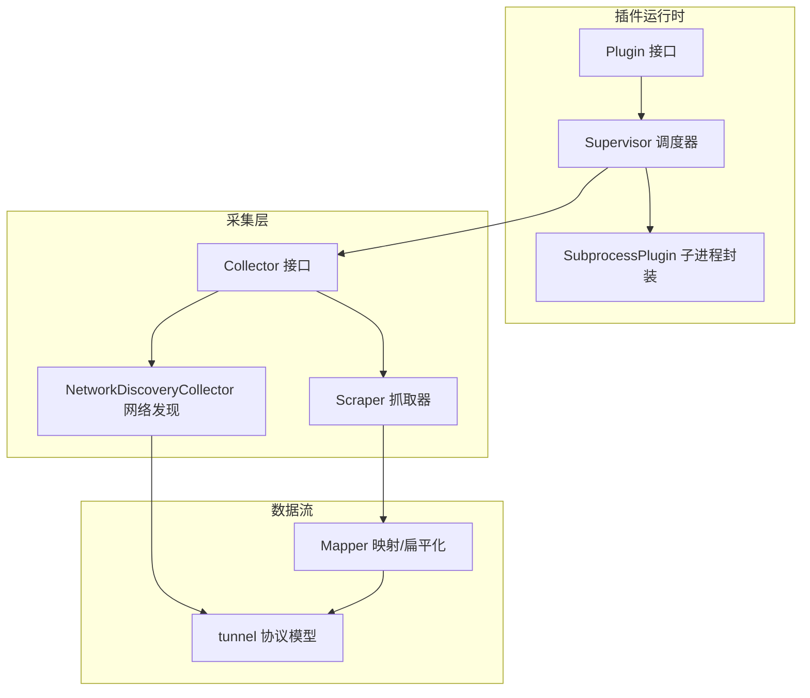
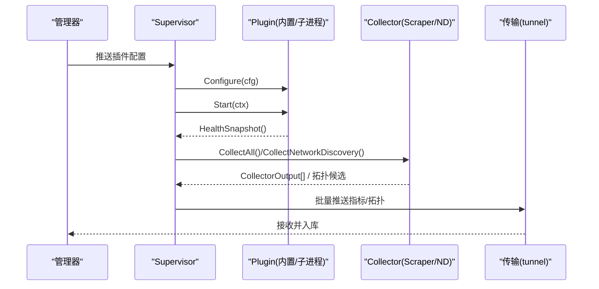
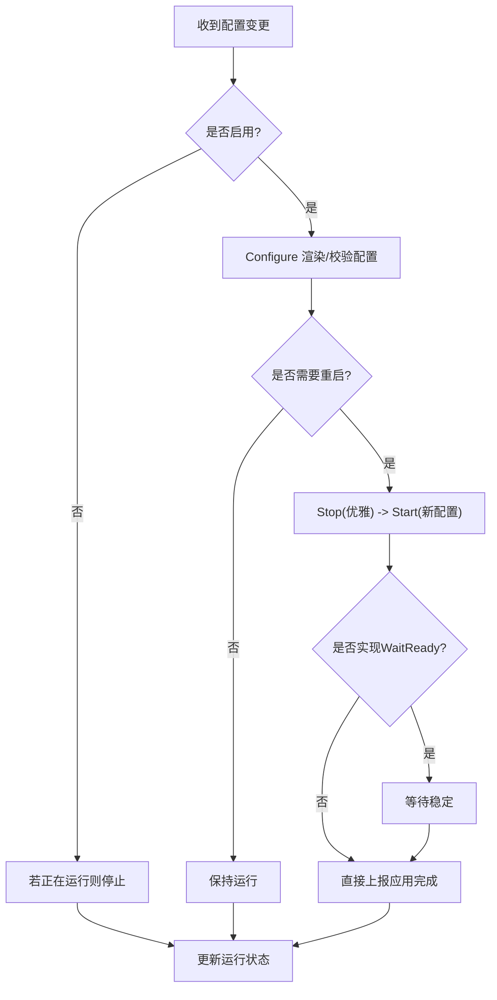
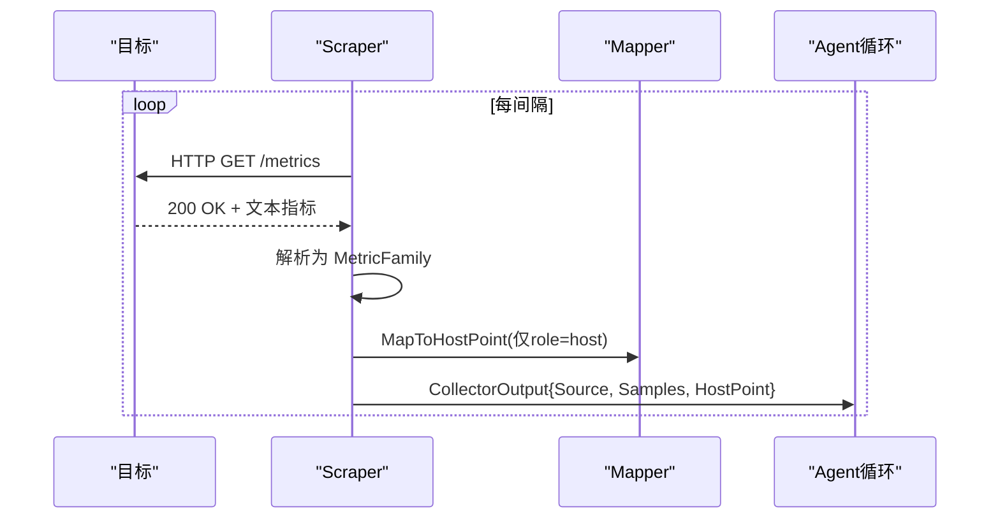
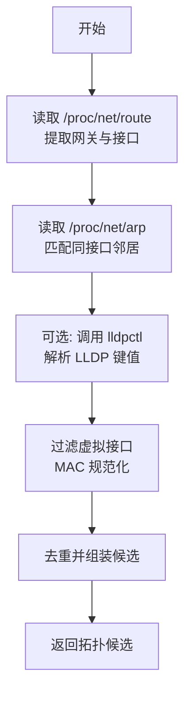
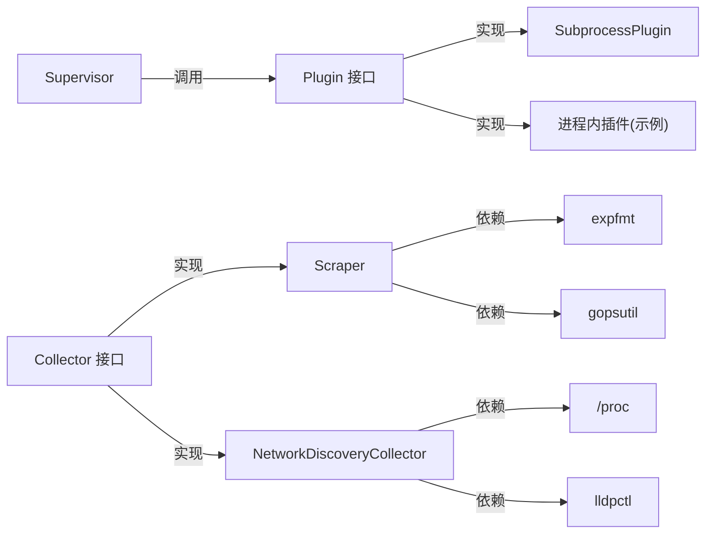

# 数据采集系统

<cite>
**本文引用的文件**
- [internal/edgeagent/plugins/plugin.go](file://internal/edgeagent/plugins/plugin.go)
- [internal/edgeagent/plugins/supervisor.go](file://internal/edgeagent/plugins/supervisor.go)
- [internal/edgeagent/plugins/subprocess.go](file://internal/edgeagent/plugins/subprocess.go)
- [internal/edgeagent/collector/scrape.go](file://internal/edgeagent/collector/scrape.go)
- [internal/edgeagent/collector/network_discovery.go](file://internal/edgeagent/collector/network_discovery.go)
- [internal/edgeagent/collector/types.go](file://internal/edgeagent/collector/types.go)
- [internal/edgeagent/collector/scrape_config.example.yaml](file://internal/edgeagent/collector/scrape_config.example.yaml)
</cite>

## 目录
1. [简介](#简介)
2. [项目结构](#项目结构)
3. [核心组件](#核心组件)
4. [架构总览](#架构总览)
5. [详细组件分析](#详细组件分析)
6. [依赖关系分析](#依赖关系分析)
7. [性能考虑](#性能考虑)
8. [故障排查指南](#故障排查指南)
9. [结论](#结论)
10. [附录](#附录)

## 简介
本文件面向数据采集系统的插件化架构与采集器接口设计，覆盖主机信息采集、进程监控、网络发现（ARP、网关、LLDP）、指标格式转换与批量推送策略，以及插件生命周期管理、错误恢复与性能优化。文档同时提供插件开发指南、配置示例与常见问题定位方法，帮助读者快速理解并扩展系统能力。

## 项目结构
本项目在边缘侧通过“插件运行时 + 采集器”的解耦设计实现可插拔的数据采集：
- 插件运行时负责插件注册、配置下发、启动/停止、健康上报与崩溃重启。
- 采集器实现统一的 Collector 接口，支持内嵌式采集（gopsutil）与 HTTP 抓取（Prometheus 文本格式）。
- 网络发现模块从本地路由表、ARP 表与 LLDP 输出中抽取拓扑候选。
- 指标数据经 Mapper 转换为统一 HostPoint 或扁平样本集合，供上层批量推送。

**图表来源**
- [internal/edgeagent/plugins/plugin.go:18-52](file://internal/edgeagent/plugins/plugin.go#L18-L52)
- [internal/edgeagent/plugins/supervisor.go:12-47](file://internal/edgeagent/plugins/supervisor.go#L12-L47)
- [internal/edgeagent/plugins/subprocess.go:17-51](file://internal/edgeagent/plugins/subprocess.go#L17-L51)
- [internal/edgeagent/collector/types.go:21-57](file://internal/edgeagent/collector/types.go#L21-L57)
- [internal/edgeagent/collector/scrape.go:29-49](file://internal/edgeagent/collector/scrape.go#L29-L49)
- [internal/edgeagent/collector/network_discovery.go:18-26](file://internal/edgeagent/collector/network_discovery.go#L18-L26)

**章节来源**
- [internal/edgeagent/plugins/plugin.go:1-135](file://internal/edgeagent/plugins/plugin.go#L1-L135)
- [internal/edgeagent/plugins/supervisor.go:1-301](file://internal/edgeagent/plugins/supervisor.go#L1-L301)
- [internal/edgeagent/plugins/subprocess.go:1-391](file://internal/edgeagent/plugins/subprocess.go#L1-L391)
- [internal/edgeagent/collector/types.go:1-58](file://internal/edgeagent/collector/types.go#L1-L58)
- [internal/edgeagent/collector/scrape.go:1-415](file://internal/edgeagent/collector/scrape.go#L1-L415)
- [internal/edgeagent/collector/network_discovery.go:1-282](file://internal/edgeagent/collector/network_discovery.go#L1-L282)

## 核心组件
- 插件接口与配置
  - Plugin 定义名称、配置、启动/停止与健康快照；支持进程内与子进程两种实现。
  - PluginConfig 包含启用标志、端点、鉴权信息与插件私有 Spec。
  - Supervisor 负责拉取配置、差异对比、启停控制与崩溃恢复。
  - SubprocessPlugin 封装子进程生命周期、配置渲染/校验、日志落盘与指数退避重启。

- 采集器接口与实现
  - Collector 抽象 CollectAll、HostInfo、GetHostLoad、GetProcessList。
  - Scraper 按目标并行抓取 Prometheus 文本指标，解析为 MetricFamily，维护每目标快照，并提供 HostPoint 映射与进程列表查询。
  - NetworkDiscoveryCollector 读取 /proc/net/route、/proc/net/arp 与 lldpctl 输出，过滤虚拟接口，去重后产出候选。

- 数据模型与转换
  - CollectorOutput 承载 Source、HostPoint 与 Samples 两类输出路径。
  - 扁平样本由 FlattenSamples 生成，用于新的 push_prom_samples 通道；HostPoint 用于旧版 push_host_metrics。

**章节来源**
- [internal/edgeagent/plugins/plugin.go:18-135](file://internal/edgeagent/plugins/plugin.go#L18-L135)
- [internal/edgeagent/plugins/supervisor.go:12-301](file://internal/edgeagent/plugins/supervisor.go#L12-L301)
- [internal/edgeagent/plugins/subprocess.go:17-391](file://internal/edgeagent/plugins/subprocess.go#L17-L391)
- [internal/edgeagent/collector/types.go:9-57](file://internal/edgeagent/collector/types.go#L9-L57)
- [internal/edgeagent/collector/scrape.go:29-356](file://internal/edgeagent/collector/scrape.go#L29-L356)
- [internal/edgeagent/collector/network_discovery.go:18-113](file://internal/edgeagent/collector/network_discovery.go#L18-L113)

## 架构总览
插件运行时与采集器通过统一接口协作：Supervisor 根据配置驱动插件生命周期；采集器以多目标并发方式采集指标，并将结果标准化为统一模型；网络发现独立于指标采集，专注拓扑候选收集。

**图表来源**
- [internal/edgeagent/plugins/supervisor.go:112-243](file://internal/edgeagent/plugins/supervisor.go#L112-L243)
- [internal/edgeagent/collector/scrape.go:79-226](file://internal/edgeagent/collector/scrape.go#L79-L226)
- [internal/edgeagent/collector/network_discovery.go:43-113](file://internal/edgeagent/collector/network_discovery.go#L43-L113)

## 详细组件分析

### 插件运行时（Plugin/Supervisor/SubprocessPlugin）
- 设计要点
  - 统一 Plugin 接口，屏蔽进程内与子进程差异。
  - Supervisor 周期性拉取配置，计算差异并执行 Configure/Start/Stop。
  - SubprocessPlugin 负责配置原子替换、校验、子进程启动、SIGTERM 优雅退出、崩溃指数退避重启。
  - 健康快照包含状态、错误、PID、重启计数与更新时间，供心跳上报。

- 关键流程
  - 配置变更：Configure 失败保持“已崩溃”可见；成功则进入 Start。
  - 启动就绪：可选 WaitReady 等待稳定运行后再上报应用完成。
  - 崩溃恢复：非零退出或意外退出触发指数退避重启，上限固定。

**图表来源**
- [internal/edgeagent/plugins/supervisor.go:135-243](file://internal/edgeagent/plugins/supervisor.go#L135-L243)
- [internal/edgeagent/plugins/subprocess.go:140-229](file://internal/edgeagent/plugins/subprocess.go#L140-L229)
- [internal/edgeagent/plugins/subprocess.go:267-308](file://internal/edgeagent/plugins/subprocess.go#L267-L308)

**章节来源**
- [internal/edgeagent/plugins/plugin.go:18-135](file://internal/edgeagent/plugins/plugin.go#L18-L135)
- [internal/edgeagent/plugins/supervisor.go:12-301](file://internal/edgeagent/plugins/supervisor.go#L12-L301)
- [internal/edgeagent/plugins/subprocess.go:17-391](file://internal/edgeagent/plugins/subprocess.go#L17-L391)

### 采集器接口与抓取器（Collector/Scraper）
- 接口契约
  - CollectAll：每次采集返回一个或多个 CollectorOutput（多目标场景）。
  - HostInfo：返回本机标识信息（OS、内核、CPU、内存、指纹等）。
  - GetHostLoad：基于最近一次 host 角色快照计算负载。
  - GetProcessList：通过 gopsutil 获取进程列表并按 CPU/内存排序。

- 抓取流程
  - 每个目标独立 goroutine 定时抓取，超时与 TLS 配置按目标隔离。
  - 解析 Prometheus 文本格式为 MetricFamily，维护 per-target 快照。
  - 将快照映射为 HostPoint（仅 role=host）与扁平样本集合。
  - 失败不阻塞其他目标，记录告警日志。

**图表来源**
- [internal/edgeagent/collector/scrape.go:79-226](file://internal/edgeagent/collector/scrape.go#L79-L226)
- [internal/edgeagent/collector/types.go:21-57](file://internal/edgeagent/collector/types.go#L21-L57)

**章节来源**
- [internal/edgeagent/collector/types.go:9-57](file://internal/edgeagent/collector/types.go#L9-L57)
- [internal/edgeagent/collector/scrape.go:29-356](file://internal/edgeagent/collector/scrape.go#L29-L356)

### 网络发现（ARP/网关/LLDP）
- 机制说明
  - 网关发现：解析 /proc/net/route 提取默认网关及出口接口。
  - ARP 邻居：解析 /proc/net/arp，结合网关接口过滤有效邻居。
  - LLDP：调用 lldpctl 输出 key=value 形式，解析 chassis/port/management IP，构建链路。
  - 过滤虚拟接口（docker、veth、flannel、cali、tun/tap、lo 等），避免噪声。
  - MAC 规范化与去重，保证候选唯一性。

**图表来源**
- [internal/edgeagent/collector/network_discovery.go:43-113](file://internal/edgeagent/collector/network_discovery.go#L43-L113)
- [internal/edgeagent/collector/network_discovery.go:149-253](file://internal/edgeagent/collector/network_discovery.go#L149-L253)

**章节来源**
- [internal/edgeagent/collector/network_discovery.go:18-282](file://internal/edgeagent/collector/network_discovery.go#L18-L282)

### 指标数据格式转换与批量处理
- 双通道输出
  - HostPoint：8字段快速路径，兼容旧版 push_host_metrics。
  - Samples：开放集扁平样本，适配新版 push_prom_samples。
- 批量策略
  - 每目标独立快照，CollectAll 返回多个 CollectorOutput，Agent 逐条推送，携带不同 Source 标签。
  - 首次采样无历史差分时速率类字段为 0，后续逐步收敛。

**章节来源**
- [internal/edgeagent/collector/types.go:21-36](file://internal/edgeagent/collector/types.go#L21-L36)
- [internal/edgeagent/collector/scrape.go:185-226](file://internal/edgeagent/collector/scrape.go#L185-L226)

### 插件开发指南
- 实现步骤
  - 实现 Plugin 接口：Name、Configure、Start、Stop、HealthSnapshot。
  - 进程内插件：在 Start 中启动协程，Stop 中取消上下文。
  - 子进程插件：使用 SubprocessPlugin，提供二进制路径、配置渲染函数、参数构造函数与可选校验器。
  - 健康上报：定期返回当前状态、错误与目标级健康（如多目标 metrics）。
- 配置与生命周期
  - 通过 Supervisor 拉取配置，Configure 失败会置为“已崩溃”，便于观测。
  - 支持 WaitReady 钩子，确保子进程稳定后再上报应用完成。
  - 崩溃自动重启，指数退避，上限保护。

**章节来源**
- [internal/edgeagent/plugins/plugin.go:18-135](file://internal/edgeagent/plugins/plugin.go#L18-L135)
- [internal/edgeagent/plugins/subprocess.go:86-229](file://internal/edgeagent/plugins/subprocess.go#L86-L229)
- [internal/edgeagent/plugins/supervisor.go:135-243](file://internal/edgeagent/plugins/supervisor.go#L135-L243)

### 配置示例（抓取模式）
- 抓取配置文件位于 scrape_config.example.yaml，支持多目标、独立间隔/超时、Bearer Token 文件、TLS 跳过验证与静态标签。
- 典型目标包括 node-exporter、kubelet-cadvisor、mysql-exporter 等。

**章节来源**
- [internal/edgeagent/collector/scrape_config.example.yaml:1-30](file://internal/edgeagent/collector/scrape_config.example.yaml#L1-L30)

## 依赖关系分析
- 松耦合
  - Supervisor 仅依赖 Plugin 接口，不感知具体实现。
  - Collector 接口解耦采集源，Scraper 与 NetworkDiscoveryCollector 分别实现。
- 外部依赖
  - gopsutil 用于主机与进程信息。
  - Prometheus expfmt 用于指标解析。
  - 系统 /proc 与 lldpctl 用于网络发现。

**图表来源**
- [internal/edgeagent/plugins/supervisor.go:12-47](file://internal/edgeagent/plugins/supervisor.go#L12-L47)
- [internal/edgeagent/plugins/subprocess.go:17-51](file://internal/edgeagent/plugins/subprocess.go#L17-L51)
- [internal/edgeagent/collector/scrape.go:18-27](file://internal/edgeagent/collector/scrape.go#L18-L27)
- [internal/edgeagent/collector/network_discovery.go:3-16](file://internal/edgeagent/collector/network_discovery.go#L3-L16)

**章节来源**
- [internal/edgeagent/plugins/supervisor.go:12-47](file://internal/edgeagent/plugins/supervisor.go#L12-L47)
- [internal/edgeagent/collector/scrape.go:18-27](file://internal/edgeagent/collector/scrape.go#L18-L27)
- [internal/edgeagent/collector/network_discovery.go:3-16](file://internal/edgeagent/collector/network_discovery.go#L3-L16)

## 性能考虑
- 并发与资源
  - 每个抓取目标独立 goroutine，errgroup 管理生命周期，单个目标失败不影响其他目标。
  - 每目标独立 http.Client，复用连接池，减少握手开销。
- 超时与重试
  - 抓取请求带超时，避免长尾阻塞；失败仅记录日志，下次 tick 重试。
- 内存与快照
  - 每目标维护最新 MetricFamily 快照，避免重复解析；CollectAll 时只读拷贝。
- 进程列表
  - 按需查询并排序，限制 topN，降低系统调用成本。
- 网络发现
  - 过滤虚拟接口与无效条目，MAC 规范化与去重，减少冗余数据。

[本节为通用指导，无需特定文件引用]

## 故障排查指南
- 插件无法启动
  - 检查 Configure 是否报错（配置渲染/校验失败）；查看 Supervisor 日志中的“plugin configure failed”。
  - 子进程二进制缺失会导致 Start 失败；确认二进制路径与工作目录权限。
- 插件频繁重启
  - 观察 HealthSnapshot 的 RestartCount 与 LastError；子进程异常退出会触发指数退避重启。
  - 检查子进程日志文件（workDir/<name>.log）定位崩溃原因。
- 抓取失败
  - 确认目标 URL、Bearer Token 文件、TLS 设置；关注“scrape: http error”“scrape: non-2xx”“scrape: parse failed”日志。
  - 对 role=host 的目标，确认其暴露的指标能被映射为 HostPoint。
- 网络发现为空
  - 在非 Linux 环境或无 lldpctl 时，仅能依赖 ARP/网关；检查 /proc 可读性与接口名过滤规则。
  - 虚拟接口会被过滤，确认实际物理/桥接接口未被误判。

**章节来源**
- [internal/edgeagent/plugins/supervisor.go:135-243](file://internal/edgeagent/plugins/supervisor.go#L135-L243)
- [internal/edgeagent/plugins/subprocess.go:267-308](file://internal/edgeagent/plugins/subprocess.go#L267-L308)
- [internal/edgeagent/collector/scrape.go:117-183](file://internal/edgeagent/collector/scrape.go#L117-L183)
- [internal/edgeagent/collector/network_discovery.go:43-113](file://internal/edgeagent/collector/network_discovery.go#L43-L113)

## 结论
本系统通过插件运行时与采集器接口实现了高度可扩展的数据采集能力。Supervisor 统一管理插件生命周期与崩溃恢复；Scraper 与 NetworkDiscoveryCollector 分别承担指标与拓扑采集；Mapper 与统一模型保障数据一致性与兼容性。配合合理的并发、超时、快照与过滤策略，系统在大规模部署下具备良好的稳定性与性能。

[本节为总结性内容，无需特定文件引用]

## 附录
- 抓取配置示例路径：internal/edgeagent/collector/scrape_config.example.yaml
- 插件接口与生命周期：internal/edgeagent/plugins/plugin.go
- 插件调度与恢复：internal/edgeagent/plugins/supervisor.go
- 子进程封装与重启策略：internal/edgeagent/plugins/subprocess.go
- 抓取器实现与指标转换：internal/edgeagent/collector/scrape.go
- 网络发现实现：internal/edgeagent/collector/network_discovery.go
- 采集器接口与输出模型：internal/edgeagent/collector/types.go

[本节为索引性内容，无需特定文件引用]