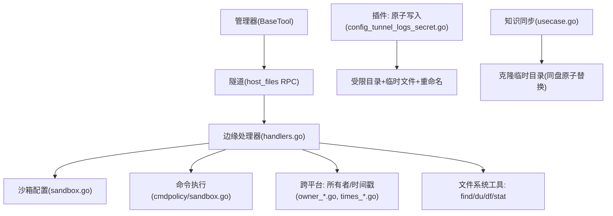
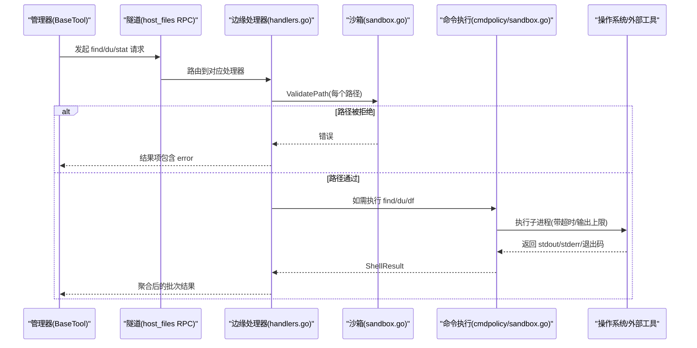
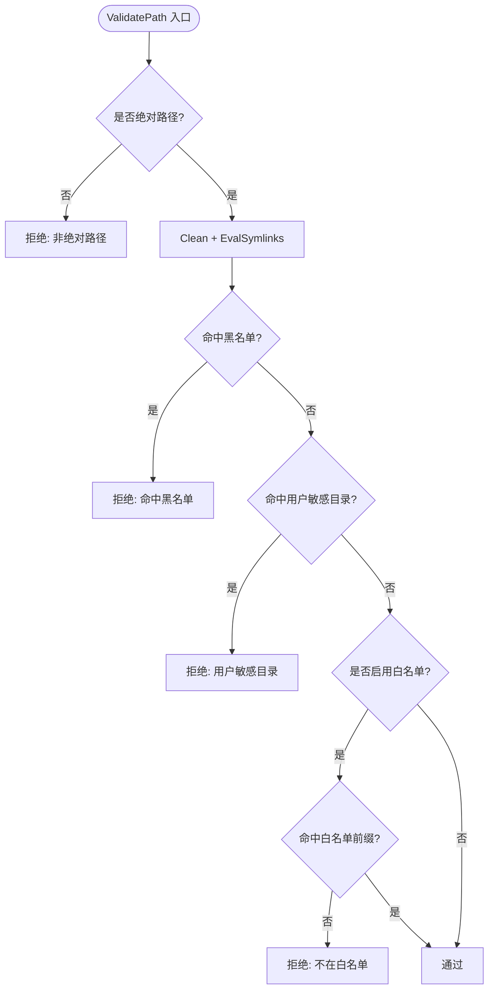
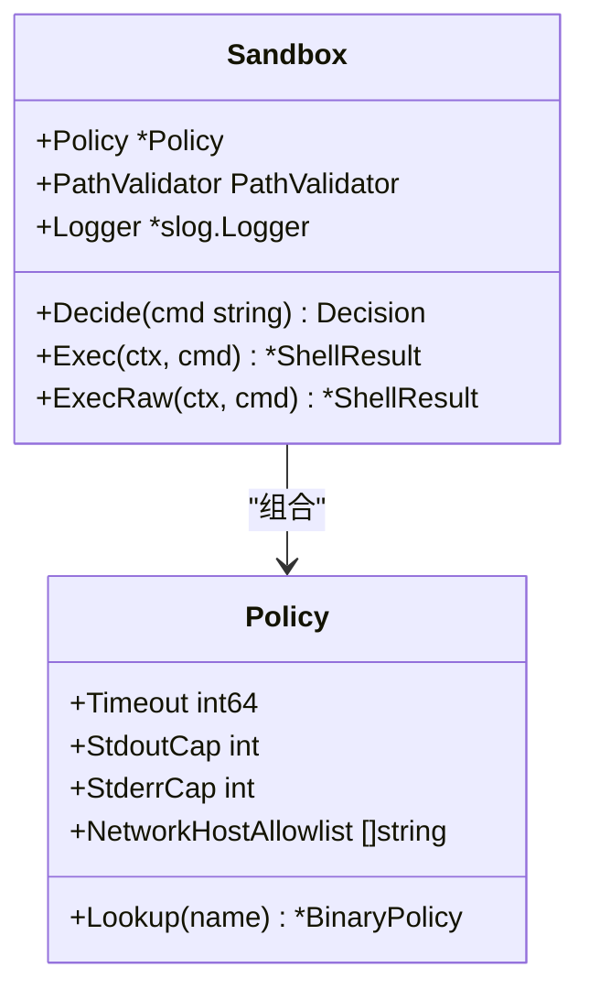
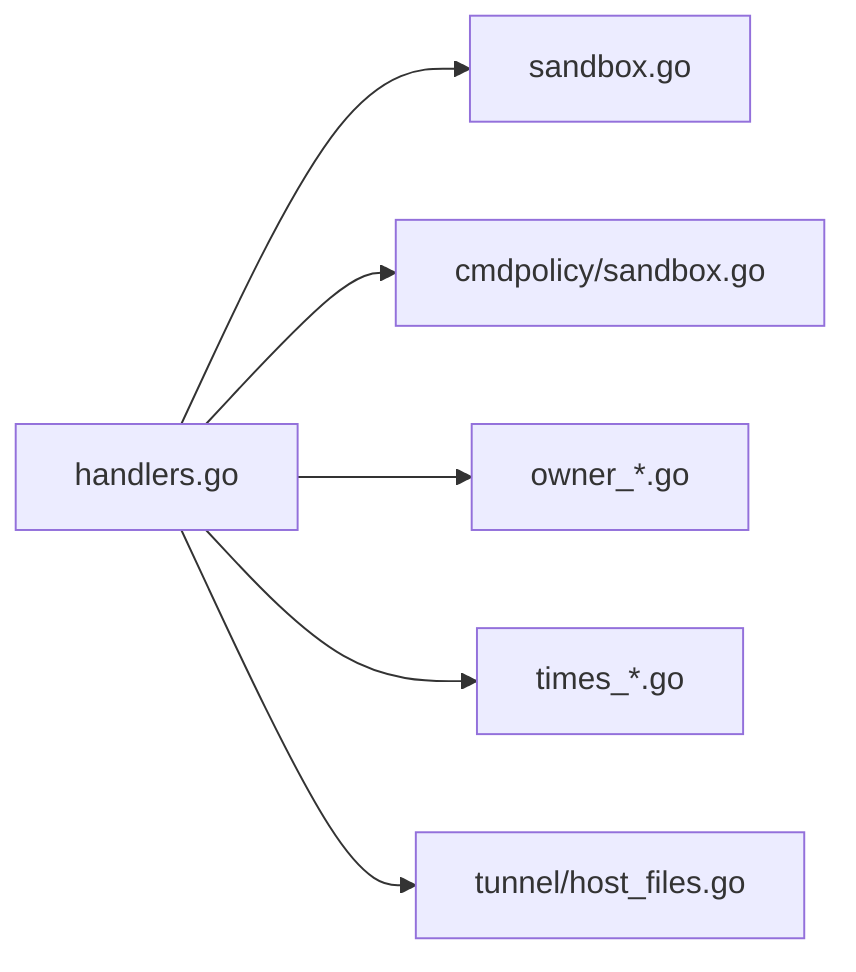

# 文件操作安全

<cite>
**本文引用的文件**
- [sandbox.go](file://internal/edgeagent/host_files/sandbox.go)
- [handlers.go](file://internal/edgeagent/host_files/handlers.go)
- [owner_unix.go](file://internal/edgeagent/host_files/owner_unix.go)
- [owner_windows.go](file://internal/edgeagent/host_files/owner_windows.go)
- [times_linux.go](file://internal/edgeagent/host_files/times_linux.go)
- [times_darwin.go](file://internal/edgeagent/host_files/times_darwin.go)
- [times_windows.go](file://internal/edgeagent/host_files/times_windows.go)
- [host_files.go](file://internal/pkg/tunnel/host_files.go)
- [cmdpolicy_sandbox.go](file://internal/edgeagent/cmdpolicy/sandbox.go)
- [config_tunnel_logs_secret.go](file://internal/edgeagent/plugins/config_tunnel_logs_secret.go)
- [workspace_test.go](file://internal/pkg/workspace/workspace_test.go)
- [usecase.go](file://internal/manager/biz/knowledge/usecase.go)
</cite>

## 目录
1. [简介](#简介)
2. [项目结构](#项目结构)
3. [核心组件](#核心组件)
4. [架构总览](#架构总览)
5. [详细组件分析](#详细组件分析)
6. [依赖关系分析](#依赖关系分析)
7. [性能考量](#性能考量)
8. [故障排查指南](#故障排查指南)
9. [结论](#结论)
10. [附录：API参考与错误模式](#附录api参考与错误模式)

## 简介
本文件围绕“文件操作安全”主题，系统化梳理了边缘侧主机文件访问的沙箱机制、跨平台实现差异、元数据管理（所有者、时间戳）、并发与超时控制、临时文件与原子写入策略，以及命令执行沙箱对路径与网络的约束。目标是帮助开发者与安全审计人员理解并正确使用这些能力，确保在不可信输入（如 LLM 生成的路径）场景下仍具备强隔离与可观测性。

## 项目结构
与文件操作安全相关的代码主要分布在以下模块：
- 边缘侧主机文件能力：提供 find_large_files、du_summary、stat_file 三类只读文件探测工具，并通过隧道协议暴露给管理器。
- 命令策略沙箱：对任意 shell 命令进行白名单、路径校验、网络目标限制与输出上限控制。
- 临时文件与原子写入：用于密钥等敏感数据的受保护写入。
- 工作区与克隆临时目录：保证原子替换与清理残留临时目录。
- 跨平台适配：Unix/Darwin/Windows 下的所有者与时间戳解析差异处理。

**图示来源**
- [handlers.go:86-108](file://internal/edgeagent/host_files/handlers.go#L86-L108)
- [host_files.go:24-37](file://internal/pkg/tunnel/host_files.go#L24-L37)
- [cmdpolicy_sandbox.go:17-37](file://internal/edgeagent/cmdpolicy/sandbox.go#L17-L37)
- [config_tunnel_logs_secret.go:294-337](file://internal/edgeagent/plugins/config_tunnel_logs_secret.go#L294-L337)
- [usecase.go:1535-1566](file://internal/manager/biz/knowledge/usecase.go#L1535-L1566)

**章节来源**
- [handlers.go:86-108](file://internal/edgeagent/host_files/handlers.go#L86-L108)
- [host_files.go:24-37](file://internal/pkg/tunnel/host_files.go#L24-L37)

## 核心组件
- 路径与二进制白名单沙箱：统一入口 ValidatePath 与 ResolveBinary，负责拒绝危险路径、可选白名单过滤、仅允许受控的二进制。
- 批量文件探测处理器：find_large_files、du_summary、stat_file，支持并发批处理、单路径超时、结果顺序保持与部分失败容忍。
- 命令执行沙箱：对任意命令进行策略决策、路径校验、网络目标白名单、管道串联、输出截断与超时控制。
- 跨平台元数据：按系统差异获取所有者与访问时间；Windows 暂以 mtime 填充 atime。
- 临时文件与原子写入：在受限目录内创建临时文件，设置严格权限后原子重命名为目标，避免竞态与泄露。
- 工作区与克隆临时目录：在同文件系统内创建隐藏前缀的临时目录，完成后再原子替换，并定期清理残留。

**章节来源**
- [sandbox.go:34-109](file://internal/edgeagent/host_files/sandbox.go#L34-L109)
- [handlers.go:121-137](file://internal/edgeagent/host_files/handlers.go#L121-L137)
- [cmdpolicy_sandbox.go:52-188](file://internal/edgeagent/cmdpolicy/sandbox.go#L52-L188)
- [owner_unix.go:12-34](file://internal/edgeagent/host_files/owner_unix.go#L12-L34)
- [owner_windows.go:7-14](file://internal/edgeagent/host_files/owner_windows.go#L7-L14)
- [times_linux.go:11-22](file://internal/edgeagent/host_files/times_linux.go#L11-L22)
- [times_darwin.go:11-22](file://internal/edgeagent/host_files/times_darwin.go#L11-L22)
- [times_windows.go:10-20](file://internal/edgeagent/host_files/times_windows.go#L10-L20)
- [config_tunnel_logs_secret.go:294-337](file://internal/edgeagent/plugins/config_tunnel_logs_secret.go#L294-L337)
- [usecase.go:1535-1566](file://internal/manager/biz/knowledge/usecase.go#L1535-L1566)

## 架构总览
下图展示了从管理器调用到边缘侧执行的完整链路，包括沙箱校验、命令执行与结果聚合。

**图示来源**
- [handlers.go:147-188](file://internal/edgeagent/host_files/handlers.go#L147-L188)
- [handlers.go:388-430](file://internal/edgeagent/host_files/handlers.go#L388-L430)
- [handlers.go:633-659](file://internal/edgeagent/host_files/handlers.go#L633-L659)
- [cmdpolicy_sandbox.go:76-188](file://internal/edgeagent/cmdpolicy/sandbox.go#L76-L188)
- [host_files.go:24-37](file://internal/pkg/tunnel/host_files.go#L24-L37)

## 详细组件分析

### 路径遍历防护与目录白名单/黑名单
- 绝对路径强制：拒绝相对路径与空路径。
- 规范化与符号链接解析：使用 Clean 与 EvalSymlinks 防止 ../ 与恶意软链逃逸。
- 黑名单优先：默认拒绝虚拟文件系统（/proc /sys /dev /run）及高敏文件（/etc/shadow、sudoers、用户私钥目录）。
- 可选白名单：当配置 AllowedReadPaths 时，路径需额外命中白名单前缀（区分精确匹配与前缀分隔符，避免 /var-evil 误配）。
- 每用户敏感目录：动态检测 /home/<user>/.ssh 与 .gnupg。

**图示来源**
- [sandbox.go:152-193](file://internal/edgeagent/host_files/sandbox.go#L152-L193)
- [sandbox.go:195-264](file://internal/edgeagent/host_files/sandbox.go#L195-L264)

**章节来源**
- [sandbox.go:71-109](file://internal/edgeagent/host_files/sandbox.go#L71-L109)
- [sandbox.go:152-193](file://internal/edgeagent/host_files/sandbox.go#L152-L193)
- [sandbox.go:195-264](file://internal/edgeagent/host_files/sandbox.go#L195-L264)

### 二进制白名单与命令执行沙箱
- 二进制白名单：仅允许 find、du、df、stat、ls 等受控命令，启动时通过 LookPath 与回退路径解析为绝对路径。
- 命令策略：对 argv 中所有以 “/” 开头的参数再次进行路径校验；对 ClassNetwork 类命令提取目标主机并检查网络白名单。
- 管道与超时：支持多段命令管道化执行，统一环境变量，设置进程组以便超时取消；stdout/stderr 有硬上限，Truncated 标志提示 LLM。
- 直通模式：ExecRaw 绕过策略检查，但保留超时与输出上限，作为管理员写门限逃生通道。

**图示来源**
- [cmdpolicy_sandbox.go:52-74](file://internal/edgeagent/cmdpolicy/sandbox.go#L52-L74)
- [cmdpolicy_sandbox.go:76-188](file://internal/edgeagent/cmdpolicy/sandbox.go#L76-L188)
- [cmdpolicy_sandbox.go:190-253](file://internal/edgeagent/cmdpolicy/sandbox.go#L190-L253)

**章节来源**
- [sandbox.go:266-305](file://internal/edgeagent/host_files/sandbox.go#L266-L305)
- [cmdpolicy_sandbox.go:17-37](file://internal/edgeagent/cmdpolicy/sandbox.go#L17-L37)
- [cmdpolicy_sandbox.go:76-188](file://internal/edgeagent/cmdpolicy/sandbox.go#L76-L188)
- [cmdpolicy_sandbox.go:190-253](file://internal/edgeagent/cmdpolicy/sandbox.go#L190-L253)

### 跨平台文件操作实现（Unix 与 Windows）
- 所有者解析：
  - Unix/Darwin：通过 syscall.Stat_t 获取 uid/gid，再解析为用户/组名；若无法解析则回退为数字字符串。
  - Windows：ACL/SID 体系不同，当前返回空字符串，待后续技能需求扩展。
- 时间戳：
  - Linux/Darwin：mtime 来自 ModTime，atime 来自 Stat_t 字段（Linux 为 Atim，Darwin 为 Atimespec），均转换为 UTC。
  - Windows：当前将 atime 设置为与 mtime 相同，等待更精确实现。
- 工具差异：
  - find：Linux 使用 -printf；Darwin 使用 -exec stat。
  - du：Linux 使用 --max-depth 与 -B1；Darwin 使用 -d 与 -k。
  - df：Linux 使用 -B1 --output；Darwin 使用 -kP。

**章节来源**
- [owner_unix.go:12-34](file://internal/edgeagent/host_files/owner_unix.go#L12-L34)
- [owner_windows.go:7-14](file://internal/edgeagent/host_files/owner_windows.go#L7-L14)
- [times_linux.go:11-22](file://internal/edgeagent/host_files/times_linux.go#L11-L22)
- [times_darwin.go:11-22](file://internal/edgeagent/host_files/times_darwin.go#L11-L22)
- [times_windows.go:10-20](file://internal/edgeagent/host_files/times_windows.go#L10-L20)
- [handlers.go:224-260](file://internal/edgeagent/host_files/handlers.go#L224-L260)
- [handlers.go:557-585](file://internal/edgeagent/host_files/handlers.go#L557-L585)
- [handlers.go:470-530](file://internal/edgeagent/host_files/handlers.go#L470-L530)

### 大文件传输、流式处理与临时文件管理
- 流式扫描：find/du 输出通过 Scanner 逐行读取，缓冲大小可调，避免一次性加载大输出。
- 输出上限：命令执行沙箱对 stdout/stderr 设置字节上限，超过时标记 Truncated，避免内存膨胀。
- 临时文件与原子写入：
  - 在受限目录内创建临时文件，设置严格权限，写入并 Sync 后原子重命名为目标路径，最后同步目录。
  - 知识同步中使用同盘隐藏前缀临时目录进行克隆，完成后原子替换，并定期清理残留临时目录。
- 工作区 ID 清洗：防止路径穿越，确保会话目录不逃逸根目录。

**章节来源**
- [handlers.go:262-320](file://internal/edgeagent/host_files/handlers.go#L262-L320)
- [cmdpolicy_sandbox.go:398-422](file://internal/edgeagent/cmdpolicy/sandbox.go#L398-L422)
- [config_tunnel_logs_secret.go:294-337](file://internal/edgeagent/plugins/config_tunnel_logs_secret.go#L294-L337)
- [usecase.go:1535-1566](file://internal/manager/biz/knowledge/usecase.go#L1535-L1566)
- [workspace_test.go:38-71](file://internal/pkg/workspace/workspace_test.go#L38-L71)

### 文件锁定机制、并发访问控制与性能优化
- 并发控制：
  - 批处理并发度限制（默认 4），避免同时触发过多 find/du 导致磁盘与 CPU 饱和。
  - 每路径独立超时（默认 30s），批次整体超时（默认 60s），保障资源不被长期占用。
- 管道与进程组：
  - 多段命令通过管道串联，设置 Setpgid 便于超时取消整个进程组。
- 输出截断：
  - 自定义 capWriter 限制 stdout/stderr 大小，避免 OOM 或响应过大。
- 最佳实践：
  - 合理设置 TopN、MinSizeBytes、Depth，减少不必要扫描范围。
  - 使用 ExcludePaths 排除虚拟文件系统与无关目录。

**章节来源**
- [handlers.go:58-84](file://internal/edgeagent/host_files/handlers.go#L58-L84)
- [handlers.go:121-137](file://internal/edgeagent/host_files/handlers.go#L121-L137)
- [cmdpolicy_sandbox.go:260-342](file://internal/edgeagent/cmdpolicy/sandbox.go#L260-L342)
- [cmdpolicy_sandbox.go:398-422](file://internal/edgeagent/cmdpolicy/sandbox.go#L398-L422)

## 依赖关系分析
- 处理器依赖沙箱配置进行路径与二进制校验。
- 命令执行沙箱复用路径校验接口，统一策略与网络白名单。
- 跨平台文件属性由 build-tag 文件提供实现，处理器保持平台无关。
- 隧道协议定义请求/响应结构，确保两端一致。

**图示来源**
- [handlers.go:86-108](file://internal/edgeagent/host_files/handlers.go#L86-L108)
- [handlers.go:195-222](file://internal/edgeagent/host_files/handlers.go#L195-L222)
- [handlers.go:533-555](file://internal/edgeagent/host_files/handlers.go#L533-L555)
- [handlers.go:662-703](file://internal/edgeagent/host_files/handlers.go#L662-L703)
- [host_files.go:24-37](file://internal/pkg/tunnel/host_files.go#L24-L37)

**章节来源**
- [handlers.go:86-108](file://internal/edgeagent/host_files/handlers.go#L86-L108)
- [host_files.go:24-37](file://internal/pkg/tunnel/host_files.go#L24-L37)

## 性能考量
- 批处理并发度与超时：建议根据边缘设备资源调整 hostFilesBatchConcurrency 与 per-path timeout。
- 扫描范围控制：TopN、MinSizeBytes、Depth、ExcludePaths 能有效降低 IO 压力。
- 输出上限：避免大输出导致内存增长与网络拥塞。
- 工具选择：Linux 上优先使用 GNU find/du 的高效选项；Darwin 注意 BSD 工具差异。
- 原子写入：受限目录+临时文件+重命名，减少竞争条件与部分写入风险。

[本节为通用指导，不直接分析具体文件]

## 故障排查指南
- 路径被拒绝：
  - 检查是否为绝对路径、是否存在 ../ 或软链逃逸、是否命中黑名单或用户敏感目录。
  - 若启用了白名单，确认路径是否命中白名单前缀且分隔符正确。
- 命令执行失败：
  - 确认二进制是否在白名单中，PATH 是否包含预期位置。
  - 检查网络目标是否在白名单中（针对 curl/dig/ping 等）。
  - 关注 Truncated 标志，必要时调大输出上限或拆分查询。
- 超时与卡顿：
  - 调整 per-path 与 batch 超时；缩小扫描范围；避免全树扫描。
- 临时文件问题：
  - 确认受限目录存在且权限正确；检查是否有残留临时目录需要清理。

**章节来源**
- [sandbox.go:152-193](file://internal/edgeagent/host_files/sandbox.go#L152-L193)
- [cmdpolicy_sandbox.go:76-188](file://internal/edgeagent/cmdpolicy/sandbox.go#L76-L188)
- [cmdpolicy_sandbox.go:190-253](file://internal/edgeagent/cmdpolicy/sandbox.go#L190-L253)
- [config_tunnel_logs_secret.go:294-337](file://internal/edgeagent/plugins/config_tunnel_logs_secret.go#L294-L337)

## 结论
该实现通过“黑名单优先 + 可选白名单”的路径策略、严格的二进制白名单、命令执行沙箱的网络与输出限制、跨平台元数据解析、以及临时文件的原子写入与清理策略，构建了面向不可信输入的文件操作安全基线。配合合理的并发与超时控制，可在边缘设备上稳定运行大规模文件诊断任务。

[本节为总结性内容，不直接分析具体文件]

## 附录：API参考与错误模式
- 方法常量：
  - host_files.find_large_files
  - host_files.du_summary
  - host_files.stat_file
- 请求/响应结构：
  - FindLargeFilesRequest/Response：paths、top_n、min_size_bytes、exclude_paths；results 每项含 path、files、error。
  - DuSummaryRequest/Response：paths、depth；results 每项含 subpaths、total_size_bytes、error；filesystems 可选。
  - StatFileRequest/Response：paths；results 每项含 type、size、mtime、atime、mode、owner、group、error。
- 错误模式：
  - 路径相关：非绝对路径、命中黑名单、用户敏感目录、不在白名单。
  - 执行相关：二进制未找到、网络目标未授权、超时、输出截断。
  - 批处理：部分失败容忍，错误信息位于对应 result 项的 error 字段。

**章节来源**
- [host_files.go:24-37](file://internal/pkg/tunnel/host_files.go#L24-L37)
- [host_files.go:43-97](file://internal/pkg/tunnel/host_files.go#L43-L97)
- [host_files.go:114-164](file://internal/pkg/tunnel/host_files.go#L114-L164)
- [host_files.go:187-221](file://internal/pkg/tunnel/host_files.go#L187-L221)
- [handlers.go:147-188](file://internal/edgeagent/host_files/handlers.go#L147-L188)
- [handlers.go:388-430](file://internal/edgeagent/host_files/handlers.go#L388-L430)
- [handlers.go:633-659](file://internal/edgeagent/host_files/handlers.go#L633-L659)