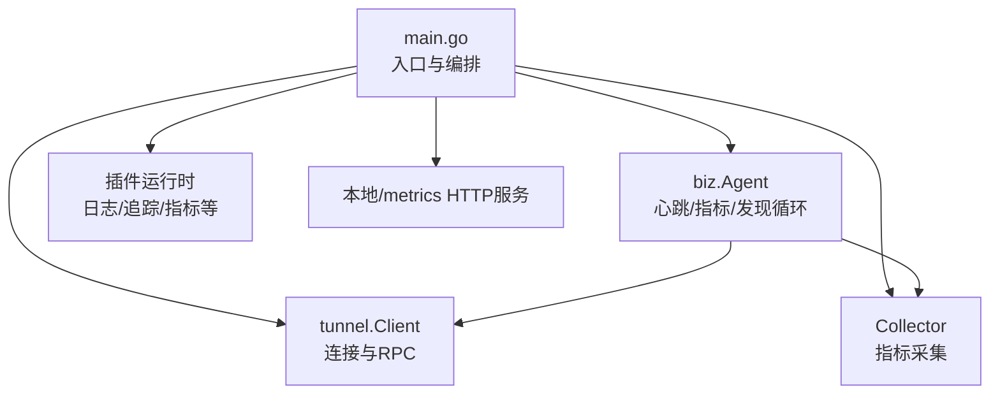
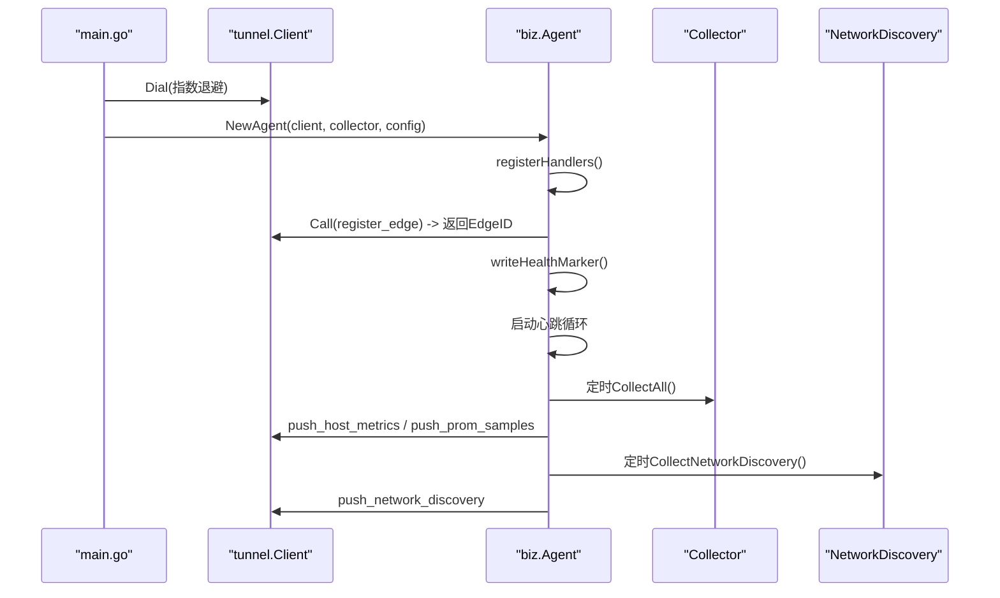
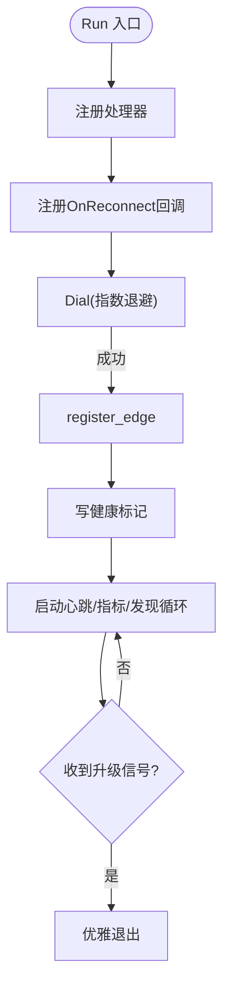
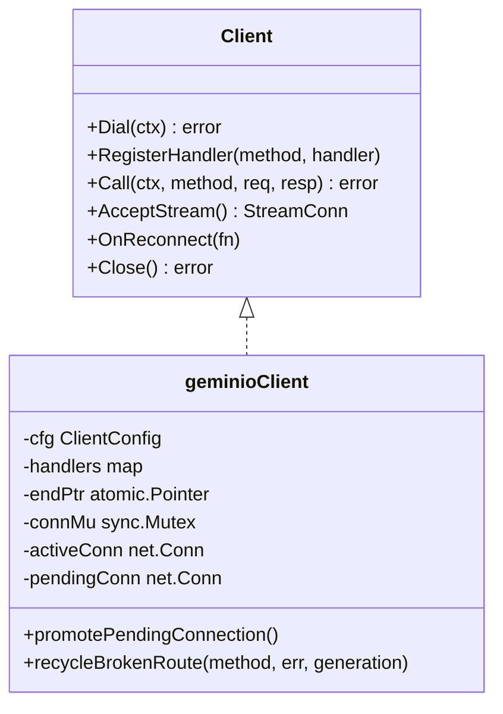
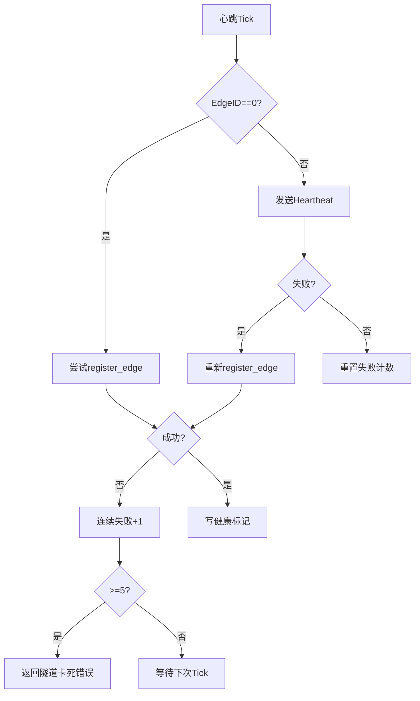
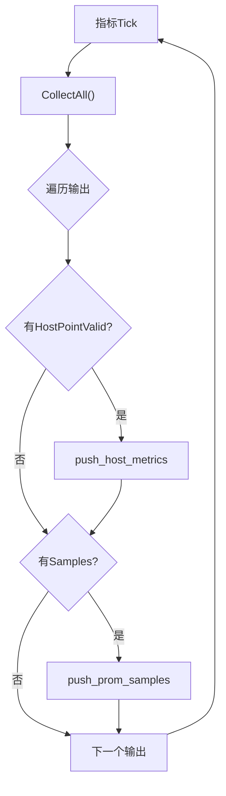
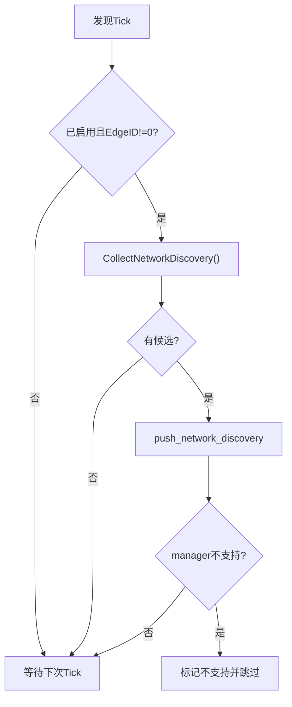
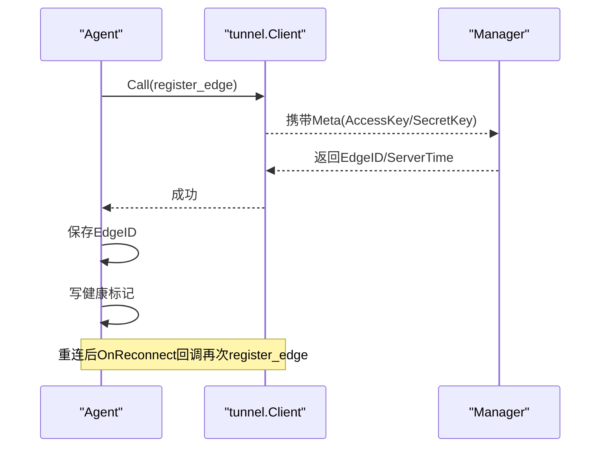
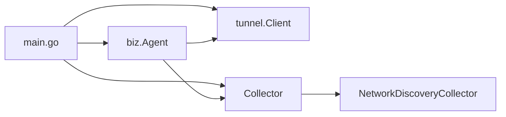

# 核心架构与生命周期

<cite>
**本文引用的文件**
- [cmd/ongrid-edge/main.go](file://cmd/ongrid-edge/main.go)
- [cmd/ongrid-edge/enroll.go](file://cmd/ongrid-edge/enroll.go)
- [internal/edgeagent/biz/agent.go](file://internal/edgeagent/biz/agent.go)
- [internal/pkg/tunnel/client.go](file://internal/pkg/tunnel/client.go)
- [internal/pkg/tunnel/types.go](file://internal/pkg/tunnel/types.go)
- [internal/edgeagent/collector/network_discovery.go](file://internal/edgeagent/collector/network_discovery.go)
- [internal/pkg/config/config.go](file://internal/pkg/config/config.go)
</cite>

## 目录
1. [简介](#简介)
2. [项目结构](#项目结构)
3. [核心组件](#核心组件)
4. [架构总览](#架构总览)
5. [详细组件分析](#详细组件分析)
6. [依赖关系分析](#依赖关系分析)
7. [性能考量](#性能考量)
8. [故障排查指南](#故障排查指南)
9. [结论](#结论)
10. [附录：配置参数与调优](#附录：配置参数与调优)

## 简介
本文件面向“边缘代理（Edge Agent）”的核心架构与生命周期，聚焦以下主题：
- 启动流程、生命周期管理与核心组件交互
- Agent 结构体设计模式：客户端连接管理、心跳循环、指标收集循环、网络发现循环
- 与云端管理器的通信协议、连接建立与重连策略
- 注册流程、EdgeID 分配与健康标记机制
- 错误处理、重试逻辑与故障恢复策略
- 配置参数说明与运行时行为调优指南

## 项目结构
边缘侧二进制由 cmd/ongrid-edge/main.go 驱动，负责：
- 加载配置与环境变量
- 初始化隧道客户端（tunnel.Client）
- 构建采集器（Collector），支持多种采集模式
- 注册各类能力处理器（host files、bash、operator、webshell 等）
- 创建并运行 Agent（biz.Agent），驱动心跳、指标推送、网络发现等周期任务
- 可选地启用插件运行时（日志、追踪、数据库指标、主机/进程指标等）

图表来源
- [cmd/ongrid-edge/main.go:136-300](file://cmd/ongrid-edge/main.go#L136-L300)
- [internal/edgeagent/biz/agent.go:186-271](file://internal/edgeagent/biz/agent.go#L186-L271)
- [internal/pkg/tunnel/client.go:81-165](file://internal/pkg/tunnel/client.go#L81-L165)

章节来源
- [cmd/ongrid-edge/main.go:66-300](file://cmd/ongrid-edge/main.go#L66-L300)

## 核心组件
- 隧道客户端（tunnel.Client）：封装与云端的长连接、认证元信息、指数退避拨号、自动重连、方法注册与调用。
- 采集器（Collector）：抽象指标源，支持嵌入式（gopsutil）、HTTP scrape、组合模式；提供 HostInfo、HostLoad、ProcessList 等查询。
- Agent（biz.Agent）：编排心跳、指标推送、网络发现、升级信号监听、健康标记写入、注册回调。
- 网络发现（NetworkDiscoveryCollector）：被动读取网关、ARP、LLDP 邻居信息，去重后上报。
- 配置（config.Config）：集中从环境变量加载 Edge 相关参数（CloudAddr、AccessKey、SecretKey、CollectorMode、Interval 等）。

章节来源
- [internal/pkg/tunnel/types.go:33-105](file://internal/pkg/tunnel/types.go#L33-L105)
- [internal/edgeagent/biz/agent.go:22-92](file://internal/edgeagent/biz/agent.go#L22-L92)
- [internal/edgeagent/collector/network_discovery.go:18-46](file://internal/edgeagent/collector/network_discovery.go#L18-L46)
- [internal/pkg/config/config.go:377-412](file://internal/pkg/config/config.go#L377-L412)

## 架构总览
边缘代理通过 tunnel.Client 与云端管理器建立双向通道，Agent 在 Run() 中完成：
- 注册云端到边缘的 RPC 处理器
- 拨号连接（指数退避）
- 执行 register_edge 获取 EdgeID 并写入健康标记
- 启动心跳循环、指标收集循环、网络发现循环（可选）
- 监听升级信号，优雅退出以触发系统级替换

图表来源
- [cmd/ongrid-edge/main.go:136-300](file://cmd/ongrid-edge/main.go#L136-L300)
- [internal/edgeagent/biz/agent.go:186-271](file://internal/edgeagent/biz/agent.go#L186-L271)
- [internal/pkg/tunnel/client.go:81-165](file://internal/pkg/tunnel/client.go#L81-L165)

## 详细组件分析

### Agent 结构与生命周期
- Agent 持有 tunnel.Client、Collector、Config、Logger，以及 EdgeID、升级信号通道、插件健康函数等。
- Run() 顺序：
  1) 注册处理器（避免连接就绪后无 handler）
  2) 设置 OnReconnect 回调，重连后重新 register_edge
  3) Dial 阻塞直到成功或取消
  4) register_edge 成功后写健康标记
  5) 启动心跳、指标、网络发现三个 goroutine（errgroup 管理）
  6) 监听升级信号，收到后返回特殊错误以触发 errgroup 取消，最终优雅退出

图表来源
- [internal/edgeagent/biz/agent.go:186-271](file://internal/edgeagent/biz/agent.go#L186-L271)
- [internal/edgeagent/biz/agent.go:323-353](file://internal/edgeagent/biz/agent.go#L323-L353)

章节来源
- [internal/edgeagent/biz/agent.go:94-171](file://internal/edgeagent/biz/agent.go#L94-L171)
- [internal/edgeagent/biz/agent.go:186-271](file://internal/edgeagent/biz/agent.go#L186-L271)

### 客户端连接管理与重连策略
- Dial：使用 geminio RetryEnd，指数退避（1s 起，上限 60s），首次成功后断线由底层透明重连。
- OnReconnect：当路由失效或 broker 重连后，Agent 会再次 register_edge 以绑定新的传输端点。
- 连接回收：对特定错误（如路由失效、edge id 不匹配）主动关闭旧连接，触发单次串行重连，避免并发 End 竞争。

图表来源
- [internal/pkg/tunnel/types.go:68-105](file://internal/pkg/tunnel/types.go#L68-L105)
- [internal/pkg/tunnel/client.go:81-165](file://internal/pkg/tunnel/client.go#L81-L165)
- [internal/pkg/tunnel/client.go:322-361](file://internal/pkg/tunnel/client.go#L322-L361)

章节来源
- [internal/pkg/tunnel/client.go:81-165](file://internal/pkg/tunnel/client.go#L81-L165)
- [internal/pkg/tunnel/client.go:241-270](file://internal/pkg/tunnel/client.go#L241-L270)
- [internal/pkg/tunnel/client.go:322-361](file://internal/pkg/tunnel/client.go#L322-L361)

### 心跳循环
- 周期性发送 HeartbeatRequest（含 EdgeID、时间戳、插件健康快照）。
- 若 EdgeID 为 0，先尝试 register_edge；失败则累计连续失败次数。
- 心跳失败时尝试重新 register_edge；达到阈值（5次）视为“隧道卡死”，返回错误以终止循环。

图表来源
- [internal/edgeagent/biz/agent.go:530-602](file://internal/edgeagent/biz/agent.go#L530-L602)

章节来源
- [internal/edgeagent/biz/agent.go:530-602](file://internal/edgeagent/biz/agent.go#L530-L602)

### 指标收集循环
- 按 MetricsInterval 定时 CollectAll()，将结果拆分为两条路径：
  - 快速路径：push_host_metrics（仅针对选定的 host 源）
  - 开放集路径：push_prom_samples（Prometheus 兼容样本）
- 任一推送失败仅记录日志，下一轮重试；不缓冲样本，确保时效性。

图表来源
- [internal/edgeagent/biz/agent.go:608-693](file://internal/edgeagent/biz/agent.go#L608-L693)

章节来源
- [internal/edgeagent/biz/agent.go:608-693](file://internal/edgeagent/biz/agent.go#L608-L693)

### 网络发现循环
- 可选功能，默认启用；周期读取网关、ARP、LLDP 邻居，去重后上报。
- 若 manager 不支持该 RPC，则标记为不支持并跳过后续尝试。

图表来源
- [internal/edgeagent/biz/agent.go:273-321](file://internal/edgeagent/biz/agent.go#L273-L321)
- [internal/edgeagent/collector/network_discovery.go:43-113](file://internal/edgeagent/collector/network_discovery.go#L43-L113)

章节来源
- [internal/edgeagent/biz/agent.go:273-321](file://internal/edgeagent/biz/agent.go#L273-L321)
- [internal/edgeagent/collector/network_discovery.go:43-113](file://internal/edgeagent/collector/network_discovery.go#L43-L113)

### 注册流程与 EdgeID 分配
- 首次 register_edge 成功后，Agent 保存 EdgeID 并写入健康标记（用于升级回滚判断）。
- 重连后通过 OnReconnect 回调再次 register_edge，保证新传输绑定同一 canonical edge_id。
- Kubernetes 模式下，ensureK8sEnrollment 可走独立 HTTP 注册流程，拉取 AccessKey/SecretKey 并持久化。

图表来源
- [internal/edgeagent/biz/agent.go:480-510](file://internal/edgeagent/biz/agent.go#L480-L510)
- [internal/edgeagent/biz/agent.go:195-210](file://internal/edgeagent/biz/agent.go#L195-L210)
- [cmd/ongrid-edge/main.go:537-668](file://cmd/ongrid-edge/main.go#L537-L668)

章节来源
- [internal/edgeagent/biz/agent.go:480-510](file://internal/edgeagent/biz/agent.go#L480-L510)
- [cmd/ongrid-edge/main.go:537-668](file://cmd/ongrid-edge/main.go#L537-L668)

### 健康标记机制
- 成功 register_edge 后写入 <stage>/healthy_marker，内容为当前 Agent 版本。
- 升级脚本在下次启动时读取该标记，若与上次升级版本一致则认为健康，否则回滚。
- 非 systemd 环境或不可写目录时，忽略错误继续运行。

章节来源
- [internal/edgeagent/biz/agent.go:323-353](file://internal/edgeagent/biz/agent.go#L323-L353)

### 错误处理、重试与故障恢复
- 拨号阶段：指数退避重试，直至上下文取消或连接成功。
- 心跳阶段：连续失败超过阈值视为隧道卡死，返回错误以终止循环。
- 指标推送：单条失败仅记录日志，下一轮重试；不缓存样本。
- 网络发现：manager 不支持时标记并跳过；缺失工具（lldpctl）不影响其他来源。
- 连接层：检测到路由失效或 ID 不匹配时，主动关闭旧连接，触发单次串行重连。

章节来源
- [internal/pkg/tunnel/client.go:81-165](file://internal/pkg/tunnel/client.go#L81-L165)
- [internal/pkg/tunnel/client.go:322-361](file://internal/pkg/tunnel/client.go#L322-L361)
- [internal/edgeagent/biz/agent.go:530-602](file://internal/edgeagent/biz/agent.go#L530-L602)
- [internal/edgeagent/biz/agent.go:608-693](file://internal/edgeagent/biz/agent.go#L608-L693)
- [internal/edgeagent/collector/network_discovery.go:103-113](file://internal/edgeagent/collector/network_discovery.go#L103-L113)

## 依赖关系分析
- main.go 依赖 tunnel.Client、biz.Agent、collector、plugins、httpserver 等模块，负责装配与生命周期编排。
- biz.Agent 依赖 tunnel.Client 和 Collector，并通过接口解耦具体采集实现。
- tunnel.Client 依赖 geminio 提供的 RetryEnd，封装了重连、注册、调用、流式通道等能力。
- network_discovery 依赖系统资源（/proc、lldpctl），在非 Linux 或工具缺失时降级为空信号。

图表来源
- [cmd/ongrid-edge/main.go:136-300](file://cmd/ongrid-edge/main.go#L136-L300)
- [internal/edgeagent/biz/agent.go:186-271](file://internal/edgeagent/biz/agent.go#L186-L271)
- [internal/edgeagent/collector/network_discovery.go:18-46](file://internal/edgeagent/collector/network_discovery.go#L18-L46)

章节来源
- [cmd/ongrid-edge/main.go:136-300](file://cmd/ongrid-edge/main.go#L136-L300)
- [internal/edgeagent/biz/agent.go:186-271](file://internal/edgeagent/biz/agent.go#L186-L271)

## 性能考量
- 指标推送采用“即时丢弃”策略：失败即丢，下一轮重试，避免内存堆积与过期数据。
- 心跳失败阈值保护：连续失败达阈值后快速失败，便于上层感知并重启。
- 网络发现去重与虚拟接口过滤：减少无效上报与噪声。
- 插件运行时按需启用：控制器节点默认禁用主机相关插件，降低开销。

[本节为通用指导，不直接分析具体文件]

## 故障排查指南
- 无法连接云端：检查 CloudAddr、AccessKey/SecretKey、TLS CA 配置；查看拨号退避日志。
- 注册失败：确认 manager 是否可用、证书与鉴权是否正确；关注 register_edge 错误。
- 心跳持续失败：检查隧道状态、manager 是否重启导致绑定丢失；观察是否触发 re-register。
- 指标未上报：确认 CollectorMode 与 ScrapeConfig 是否生效；查看 push_host_metrics/push_prom_samples 日志。
- 网络发现无结果：确认 /proc/net/route、/proc/net/arp 可读；Linux 下 lldpctl 是否存在。

章节来源
- [internal/pkg/tunnel/client.go:81-165](file://internal/pkg/tunnel/client.go#L81-L165)
- [internal/edgeagent/biz/agent.go:530-602](file://internal/edgeagent/biz/agent.go#L530-L602)
- [internal/edgeagent/collector/network_discovery.go:73-113](file://internal/edgeagent/collector/network_discovery.go#L73-L113)

## 结论
边缘代理通过清晰的职责划分与健壮的重连机制，实现了稳定的云端通信与数据采集。Agent 的生命周期管理将心跳、指标、网络发现等关键任务解耦为独立循环，配合健康标记与升级信号，保障了系统的可维护性与可升级性。配置项丰富且可调，便于在不同部署场景下优化性能与可靠性。

[本节为总结，不直接分析具体文件]

## 附录：配置参数与调优
- 环境变量（部分关键项）
  - ONGRID_EDGE_CLOUD_ADDR：云端隧道地址
  - ONGRID_EDGE_ACCESS_KEY / ONGRID_EDGE_SECRET_KEY：鉴权密钥
  - ONGRID_EDGE_COLLECTOR_MODE：采集模式（off/auto/embedded/scrape）
  - ONGRID_EDGE_SCRAPE_CONFIG_FILE：scrape 目标配置文件路径
  - ONGRID_EDGE_COLLECTOR_INTERVAL：采集间隔（秒或 duration）
  - ONGRID_NETWORK_DISCOVERY_ENABLED：是否启用网络发现
  - ONGRID_NETWORK_DISCOVERY_INTERVAL：网络发现间隔
  - ONGRID_K8S_*：Kubernetes 模式相关参数（集群ID、角色、命名空间等）
  - ONGRID_K8S_TELEMETRY_GATEWAY_ENABLED：是否启用遥测网关插件
  - ONGRID_K8S_METRICS_ENDPOINT / ONGRID_K8S_GATEWAY_METRICS_ENDPOINT：K8s 指标端点
  - ONGRID_K8S_METRICS_INTERVAL / TIMEOUT / PUSH_TIMEOUT / SAMPLE_LIMIT / BATCH_SAMPLE_LIMIT / BATCH_BYTE_LIMIT：K8s 指标推送参数
  - ONGRID_PACKET_CAPTURE_DIR：抓包临时目录
  - ONGRID_EDGE_PLUGIN_BIN_DIR / ONGRID_EDGE_PLUGIN_WORK_DIR：插件二进制与工作目录

- 调优建议
  - 提高 CollectorInterval 可降低 CPU 与带宽压力，但会增加指标延迟。
  - 在大规模节点场景，优先使用 scrape 模式，减少边端推送负载。
  - 合理设置 K8s 指标采样限制与批大小，避免过大请求导致超时或被限流。
  - 网络发现可根据环境决定是否启用及调整间隔，避免频繁系统调用。

章节来源
- [internal/pkg/config/config.go:377-412](file://internal/pkg/config/config.go#L377-L412)
- [cmd/ongrid-edge/main.go:222-280](file://cmd/ongrid-edge/main.go#L222-L280)
- [cmd/ongrid-edge/main.go:428-488](file://cmd/ongrid-edge/main.go#L428-L488)