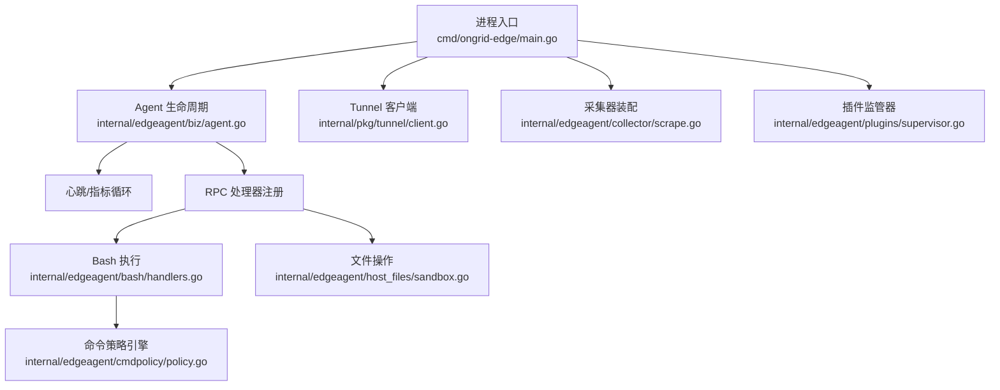
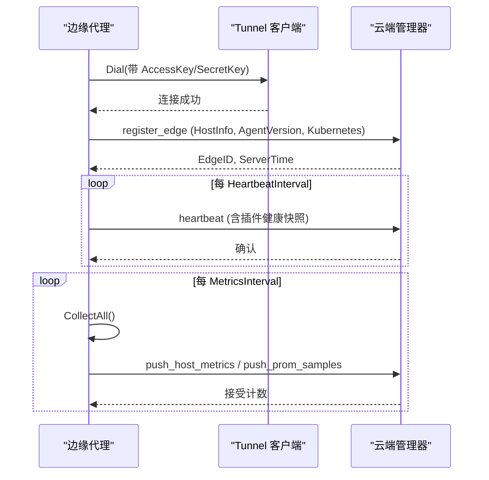
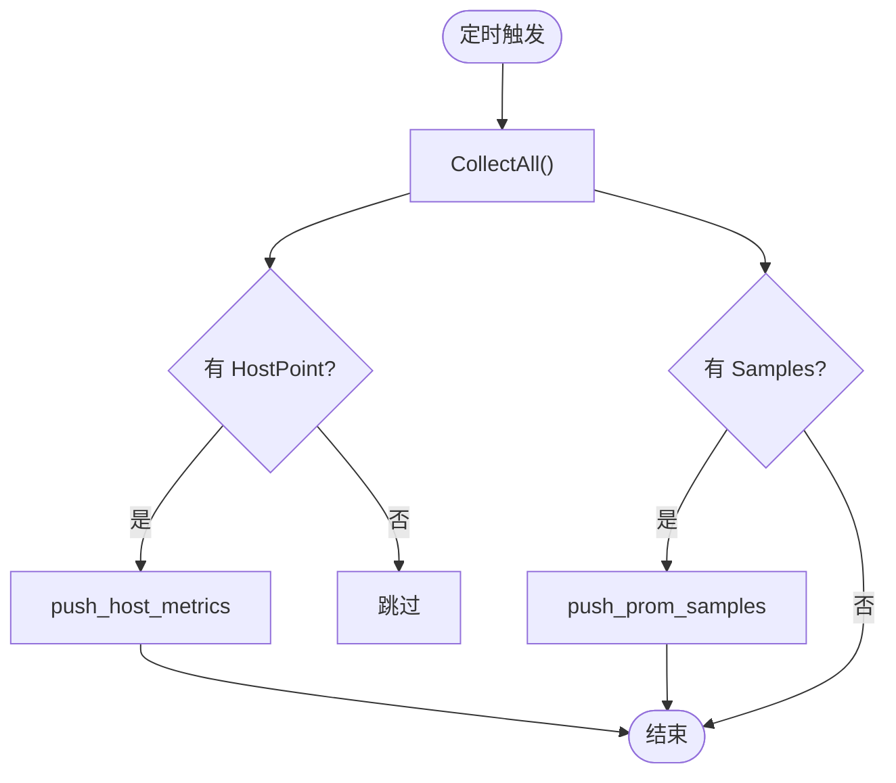
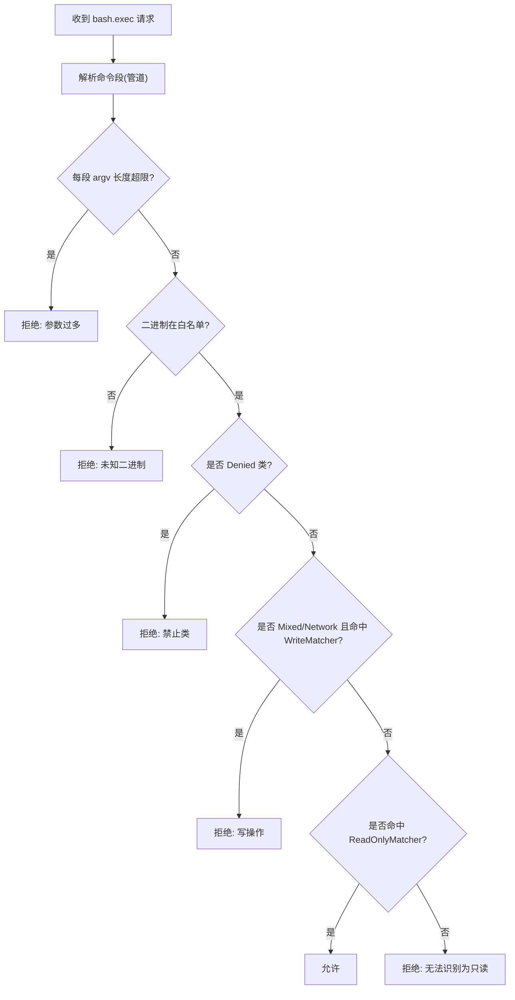
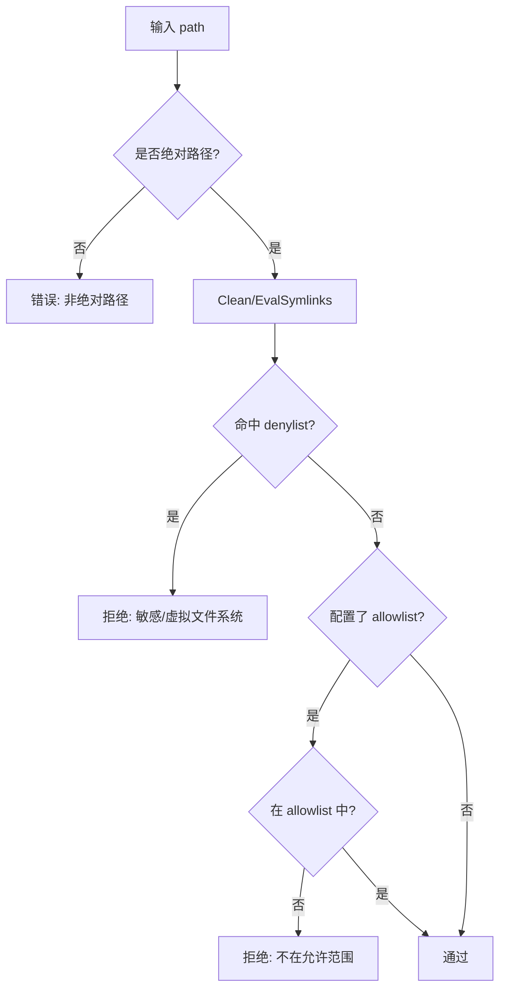
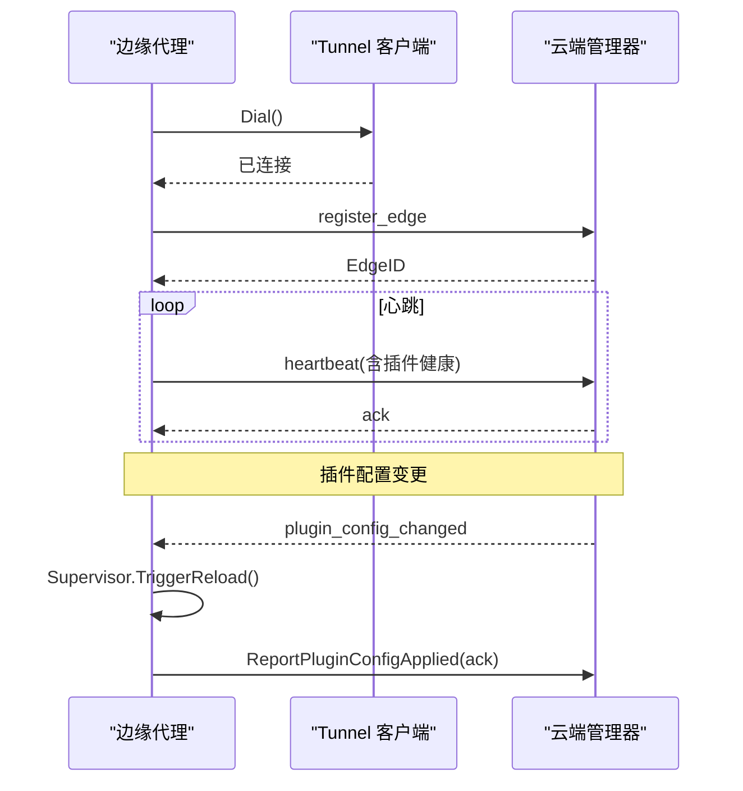
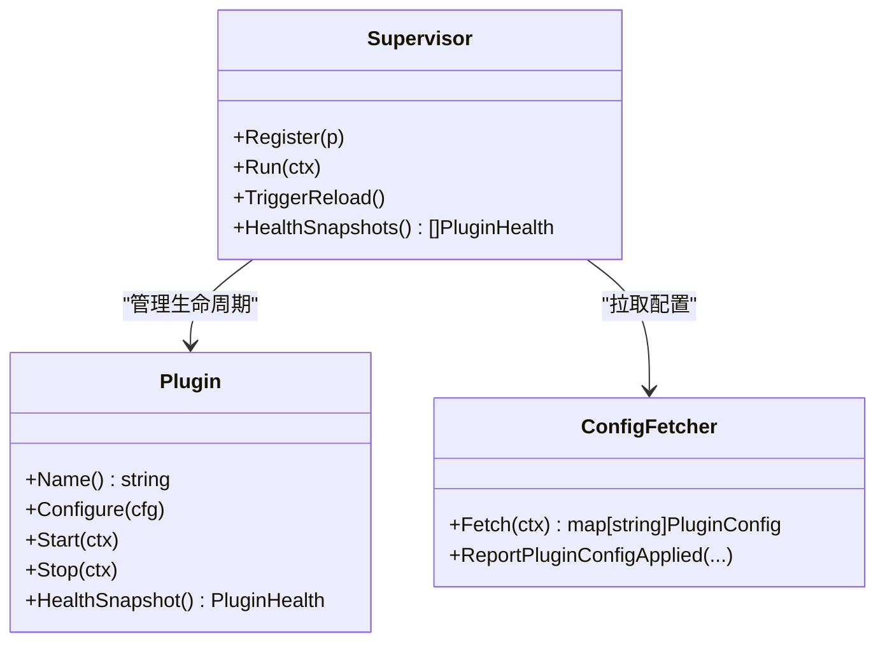
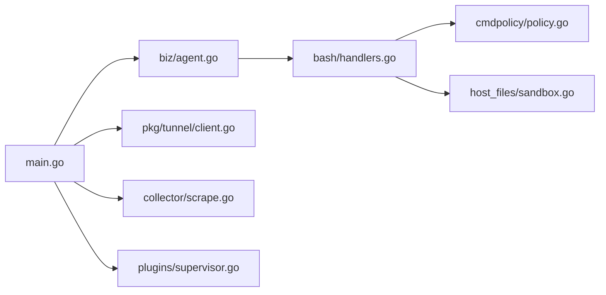

# 边缘代理

<cite>
**本文引用的文件**   
- [cmd/ongrid-edge/main.go](file://cmd/ongrid-edge/main.go)
- [internal/edgeagent/biz/agent.go](file://internal/edgeagent/biz/agent.go)
- [internal/pkg/tunnel/client.go](file://internal/pkg/tunnel/client.go)
- [internal/edgeagent/cmdpolicy/policy.go](file://internal/edgeagent/cmdpolicy/policy.go)
- [internal/edgeagent/host_files/sandbox.go](file://internal/edgeagent/host_files/sandbox.go)
- [internal/edgeagent/bash/handlers.go](file://internal/edgeagent/bash/handlers.go)
- [internal/edgeagent/collector/scrape.go](file://internal/edgeagent/collector/scrape.go)
- [internal/edgeagent/plugins/supervisor.go](file://internal/edgeagent/plugins/supervisor.go)
- [deploy/install/edge/ongrid-edge.env.example](file://deploy/install/edge/ongrid-edge.env.example)
</cite>

## 目录
1. [简介](#简介)
2. [项目结构](#项目结构)
3. [核心组件](#核心组件)
4. [架构总览](#架构总览)
5. [详细组件分析](#详细组件分析)
6. [依赖关系分析](#依赖关系分析)
7. [性能考量](#性能考量)
8. [故障排查指南](#故障排查指南)
9. [结论](#结论)
10. [附录](#附录)

## 简介
本文件面向“边缘代理”（ongrid-edge）的完整技术文档，聚焦以下目标：
- 设备信息采集、命令执行沙箱、文件操作安全与网络通信
- 与云端管理器的通信协议、数据同步机制与心跳保持
- 命令策略引擎的安全控制、权限验证与执行隔离
- 文件操作的沙箱机制、路径限制与权限检查
- 插件架构设计、数据采集器与监控指标收集实现细节
- 部署配置与故障排查指南

## 项目结构
边缘代理以单一二进制 ongrid-edge 启动，负责：
- 建立到云端的隧道连接并注册自身
- 周期性上报心跳与采集指标
- 提供远程可执行的技能（bash、文件读取等）并通过策略与沙箱严格限制
- 运行插件运行时（日志、追踪、指标导出器等），由管理器动态下发配置并驱动启停

**图表来源**
- [cmd/ongrid-edge/main.go:136-417](file://cmd/ongrid-edge/main.go#L136-L417)
- [internal/edgeagent/biz/agent.go:186-271](file://internal/edgeagent/biz/agent.go#L186-L271)
- [internal/pkg/tunnel/client.go:81-165](file://internal/pkg/tunnel/client.go#L81-L165)
- [internal/edgeagent/collector/scrape.go:58-95](file://internal/edgeagent/collector/scrape.go#L58-L95)
- [internal/edgeagent/plugins/supervisor.go:112-133](file://internal/edgeagent/plugins/supervisor.go#L112-L133)
- [internal/edgeagent/bash/handlers.go:49-93](file://internal/edgeagent/bash/handlers.go#L49-L93)
- [internal/edgeagent/host_files/sandbox.go:111-133](file://internal/edgeagent/host_files/sandbox.go#L111-L133)
- [internal/edgeagent/cmdpolicy/policy.go:33-492](file://internal/edgeagent/cmdpolicy/policy.go#L33-L492)

**章节来源**
- [cmd/ongrid-edge/main.go:66-426](file://cmd/ongrid-edge/main.go#L66-L426)

## 核心组件
- Agent 主循环：负责注册处理器、拨号云端、注册 edge、心跳与指标推送、升级信号监听。
- Tunnel 客户端：封装底层 geminio 重连、认证元信息、方法注册与调用、断线恢复。
- 采集器：支持 embedded（gopsutil）、scrape（HTTP /metrics）及组合模式，统一输出 CollectorOutput。
- 命令策略引擎：白名单二进制 + 读写分类 + 参数匹配 + 路径/网络允许列表。
- 文件沙箱：路径校验（denylist + 可选 allowlist）、符号链接解析、受限二进制白名单。
- Bash 执行：通过策略与沙箱执行只读命令；管理员可开启“不受限”写门控（审计告警）。
- 插件监管器：从管理器拉取插件配置，按启用状态启停子进程或内嵌采集器，健康上报。

**章节来源**
- [internal/edgeagent/biz/agent.go:22-123](file://internal/edgeagent/biz/agent.go#L22-L123)
- [internal/pkg/tunnel/client.go:24-67](file://internal/pkg/tunnel/client.go#L24-L67)
- [internal/edgeagent/collector/scrape.go:29-77](file://internal/edgeagent/collector/scrape.go#L29-L77)
- [internal/edgeagent/cmdpolicy/policy.go:14-492](file://internal/edgeagent/cmdpolicy/policy.go#L14-L492)
- [internal/edgeagent/host_files/sandbox.go:34-133](file://internal/edgeagent/host_files/sandbox.go#L34-L133)
- [internal/edgeagent/bash/handlers.go:1-93](file://internal/edgeagent/bash/handlers.go#L1-L93)
- [internal/edgeagent/plugins/supervisor.go:12-133](file://internal/edgeagent/plugins/supervisor.go#L12-L133)

## 架构总览
边缘代理作为边端守护进程，通过隧道与云端管理器双向通信：
- 控制面：心跳、注册、能力上报、远程升级、插件配置变更通知
- 数据面：指标推送（兼容旧路径与新 prom samples）、网络发现、抓包、日志/追踪/数据库指标等插件数据

**图表来源**
- [internal/pkg/tunnel/client.go:81-165](file://internal/pkg/tunnel/client.go#L81-L165)
- [internal/edgeagent/biz/agent.go:186-271](file://internal/edgeagent/biz/agent.go#L186-L271)
- [internal/edgeagent/biz/agent.go:530-602](file://internal/edgeagent/biz/agent.go#L530-L602)
- [internal/edgeagent/biz/agent.go:608-693](file://internal/edgeagent/biz/agent.go#L608-L693)

## 详细组件分析

### 设备信息采集与指标推送
- 采集模式：off/auto/embedded/scrape，默认 off（使用插件 node_exporter/process-exporter 直接暴露 metrics，管理器侧抓取）。
- 采集器接口：CollectAll 返回多个逻辑源（embedded、scrape:<name>），每个源包含 HostPoint（兼容旧路径）与 Samples（新 prom samples）。
- 推送路径：
  - 旧路径：push_host_metrics（单点快速通道）
  - 新路径：push_prom_samples（开放集合指标）
- 网络发现：可选被动发现网关/ARP/LLDP，定期上报候选拓扑。

**图表来源**
- [internal/edgeagent/biz/agent.go:608-693](file://internal/edgeagent/biz/agent.go#L608-L693)
- [internal/edgeagent/collector/scrape.go:185-226](file://internal/edgeagent/collector/scrape.go#L185-L226)

**章节来源**
- [cmd/ongrid-edge/main.go:428-488](file://cmd/ongrid-edge/main.go#L428-L488)
- [internal/edgeagent/biz/agent.go:22-58](file://internal/edgeagent/biz/agent.go#L22-L58)
- [internal/edgeagent/biz/agent.go:608-693](file://internal/edgeagent/biz/agent.go#L608-L693)
- [internal/edgeagent/collector/scrape.go:58-95](file://internal/edgeagent/collector/scrape.go#L58-L95)

### 命令执行沙箱与策略引擎
- 策略基线：DefaultReadOnly 内置大量只读/混合类二进制，明确拒绝危险命令与参数。
- 规则类型：
  - ClassReadFS/ClassReadSystem：直接放行
  - ClassMixed：基于 ReadOnlyMatchers/WriteMatchers 判定读写
  - ClassNetwork：网络探测工具，默认放行但可限制写操作
  - ClassDenied：直接拒绝
- 参数匹配：AnyFlag/Subcmd/SubcmdPath 组合，支持复杂语义（如 ip netns exec 拒绝）
- YAML 覆盖：operator 可通过 /etc/ongrid-edge/bash-policy.yaml 扩展/替换规则，合并策略时遵循“覆盖+追加”语义。
- 路径/网络限制：Sandbox 层附加 PathAllowlist 与 NetworkHostAllowlist 进一步约束。

**图表来源**
- [internal/edgeagent/cmdpolicy/policy.go:707-800](file://internal/edgeagent/cmdpolicy/policy.go#L707-L800)
- [internal/edgeagent/cmdpolicy/policy.go:33-492](file://internal/edgeagent/cmdpolicy/policy.go#L33-L492)

**章节来源**
- [internal/edgeagent/cmdpolicy/policy.go:14-492](file://internal/edgeagent/cmdpolicy/policy.go#L14-L492)
- [internal/edgeagent/bash/handlers.go:49-93](file://internal/edgeagent/bash/handlers.go#L49-L93)

### 文件操作安全与路径限制
- 路径校验：
  - 必须绝对路径，清理后做 denylist 检查（虚拟文件系统、敏感文件）
  - 解析符号链接后进行二次校验，防止绕过
  - 可选 allowlist：当配置非空时，路径需额外落在允许前缀下
- 二进制白名单：仅允许 find/du/df/stat/ls 等有限命令，缺失则优雅降级
- 启动校验：Validate 确保关键二进制存在，否则禁用该能力但不影响整体启动

**图表来源**
- [internal/edgeagent/host_files/sandbox.go:135-193](file://internal/edgeagent/host_files/sandbox.go#L135-L193)
- [internal/edgeagent/host_files/sandbox.go:230-264](file://internal/edgeagent/host_files/sandbox.go#L230-L264)

**章节来源**
- [internal/edgeagent/host_files/sandbox.go:34-133](file://internal/edgeagent/host_files/sandbox.go#L34-L133)
- [internal/edgeagent/host_files/sandbox.go:135-193](file://internal/edgeagent/host_files/sandbox.go#L135-L193)

### 与云端管理器的通信协议、数据同步与心跳
- 连接建立：Tunnel Client 携带 Meta(AccessKey/SecretKey)，指数退避重连，自动重注册处理器
- 注册与心跳：
  - register_edge：上报 HostInfo、AgentVersion、Kubernetes 信息，获取 EdgeID
  - heartbeat：周期上报，附带插件健康快照
- 数据同步：
  - 指标：push_host_metrics（兼容）与 push_prom_samples（新）
  - 网络发现：push_network_discovery（若管理器不支持则自动降级）
  - 插件配置：Manager 推送 plugin_config_changed，边缘触发 reload 并应用
- 断线恢复：Tunnel 层检测路由失效，回收连接并重连；Agent 层 OnReconnect 回调重新 register_edge

**图表来源**
- [internal/pkg/tunnel/client.go:81-165](file://internal/pkg/tunnel/client.go#L81-L165)
- [internal/edgeagent/biz/agent.go:186-271](file://internal/edgeagent/biz/agent.go#L186-L271)
- [internal/edgeagent/biz/agent.go:530-602](file://internal/edgeagent/biz/agent.go#L530-L602)
- [internal/edgeagent/plugins/supervisor.go:84-133](file://internal/edgeagent/plugins/supervisor.go#L84-L133)

**章节来源**
- [internal/pkg/tunnel/client.go:81-165](file://internal/pkg/tunnel/client.go#L81-L165)
- [internal/edgeagent/biz/agent.go:186-271](file://internal/edgeagent/biz/agent.go#L186-L271)
- [internal/edgeagent/biz/agent.go:530-602](file://internal/edgeagent/biz/agent.go#L530-L602)
- [internal/edgeagent/plugins/supervisor.go:135-255](file://internal/edgeagent/plugins/supervisor.go#L135-L255)

### 插件架构设计与监控指标收集
- 插件类型：
  - 日志：journald/file tail，推送到 Loki
  - 追踪：otelcol-contrib 子进程
  - 指标：node_exporter/process-exporter 子进程，或内嵌 scraper 抓取本地 /metrics
  - 数据库指标：管理端下发 source spec，边缘读取本地密钥启动 exporter
- 监管器职责：
  - 从管理器拉取插件配置（TunnelConfigFetcher）
  - 对比期望态与实际态，按需 Configure/Start/Stop
  - 健康快照上报至心跳
- 指标收集：
  - 内嵌 scraper：多目标 HTTP 抓取 Prometheus 格式，映射为 HostPoint/Samples
  - 插件 exporter：子进程暴露标准指标端口，管理器侧抓取或通过 tunnel 上报

**图表来源**
- [internal/edgeagent/plugins/supervisor.go:12-133](file://internal/edgeagent/plugins/supervisor.go#L12-L133)
- [internal/edgeagent/plugins/supervisor.go:135-255](file://internal/edgeagent/plugins/supervisor.go#L135-L255)

**章节来源**
- [cmd/ongrid-edge/main.go:302-417](file://cmd/ongrid-edge/main.go#L302-L417)
- [internal/edgeagent/plugins/supervisor.go:12-133](file://internal/edgeagent/plugins/supervisor.go#L12-L133)
- [internal/edgeagent/collector/scrape.go:58-95](file://internal/edgeagent/collector/scrape.go#L58-L95)

### 部署配置与运行模式
- 环境变量：
  - 连接：ONGRID_EDGE_CLOUD_ADDR / ACCESS_KEY / SECRET_KEY
  - 采集：COLLECTOR_MODE / SCRAPE_CONFIG_FILE / COLLECTOR_INTERVAL
  - 网络发现：NETWORK_DISCOVERY_ENABLED / INTERVAL
  - 插件：LOGS_ENABLED / ENDPOINT / AUTH_USER / AUTH_PASS / SPEC_JSON
- 安装与系统服务：
  - systemd 单元与环境文件渲染
  - 升级阶段目录与健康标记文件用于回滚决策

**章节来源**
- [deploy/install/edge/ongrid-edge.env.example:1-37](file://deploy/install/edge/ongrid-edge.env.example#L1-L37)
- [cmd/ongrid-edge/main.go:106-117](file://cmd/ongrid-edge/main.go#L106-L117)
- [internal/edgeagent/biz/agent.go:328-353](file://internal/edgeagent/biz/agent.go#L328-L353)

## 依赖关系分析
- 低耦合：Agent 通过 Collector 接口解耦采集后端；Tunnel 抽象屏蔽底层重连与认证
- 高内聚：命令策略与文件沙箱各自专注安全边界，bash handler 仅做薄封装
- 外部依赖：geminio（传输）、prometheus/expfmt（指标）、gopsutil（主机信息）

**图表来源**
- [cmd/ongrid-edge/main.go:136-417](file://cmd/ongrid-edge/main.go#L136-L417)
- [internal/edgeagent/biz/agent.go:186-271](file://internal/edgeagent/biz/agent.go#L186-L271)
- [internal/edgeagent/bash/handlers.go:49-93](file://internal/edgeagent/bash/handlers.go#L49-L93)

**章节来源**
- [cmd/ongrid-edge/main.go:136-417](file://cmd/ongrid-edge/main.go#L136-L417)

## 性能考量
- 指标推送不缓冲：为避免过期样本，失败即丢弃并在下次 tick 重试
- 多目标并发采集：Scraper 为每个目标独立 goroutine，互不影响
- 心跳与指标分离：独立 ticker，避免互相阻塞
- 插件健康快照：轻量聚合，随心跳上报，降低额外开销
- 网络发现：超时与降级处理，避免长时间阻塞

[本节为通用指导，无需特定文件引用]

## 故障排查指南
- 连接问题：
  - 检查 CloudAddr、AccessKey/SecretKey 是否正确
  - 关注 dial 失败的重试日志与 backoff
- 注册失败：
  - register_edge 失败多为认证不匹配，会持续重试
  - 查看健康标记文件是否写入（表示成功注册）
- 指标未上报：
  - 确认采集模式与 scrape 配置正确
  - 检查目标 /metrics 可达性与 TLS 设置
- 命令被拒绝：
  - 查看 bash.exec 日志中的 Reason
  - 核对策略 YAML 是否覆盖正确，二进制是否在 PATH
- 文件访问被拒：
  - 检查路径是否命中 denylist 或未落入 allowlist
  - 确认 find/du 等二进制可用
- 插件异常：
  - 查看 supervisor reconcile 日志与插件健康快照
  - 确认配置生效与子进程启动状态

**章节来源**
- [internal/pkg/tunnel/client.go:81-165](file://internal/pkg/tunnel/client.go#L81-L165)
- [internal/edgeagent/biz/agent.go:530-602](file://internal/edgeagent/biz/agent.go#L530-L602)
- [internal/edgeagent/plugins/supervisor.go:135-255](file://internal/edgeagent/plugins/supervisor.go#L135-L255)
- [internal/edgeagent/cmdpolicy/policy.go:707-800](file://internal/edgeagent/cmdpolicy/policy.go#L707-L800)
- [internal/edgeagent/host_files/sandbox.go:135-193](file://internal/edgeagent/host_files/sandbox.go#L135-L193)

## 结论
边缘代理通过清晰的模块划分与安全边界设计，实现了：
- 可靠的云端通信与心跳保活
- 灵活可扩展的指标采集与插件体系
- 严格的命令与文件操作安全控制
- 健壮的故障恢复与降级机制
在生产环境中建议结合策略 YAML 与路径 allowlist 进行最小权限配置，并启用插件健康监控以便快速定位问题。

[本节为总结性内容，无需特定文件引用]

## 附录
- 环境变量参考：见环境示例文件
- 升级流程：通过 fetch_package/apply_package 分阶段完成，配合健康标记文件实现回滚

**章节来源**
- [deploy/install/edge/ongrid-edge.env.example:1-37](file://deploy/install/edge/ongrid-edge.env.example#L1-L37)
- [internal/edgeagent/biz/agent.go:430-477](file://internal/edgeagent/biz/agent.go#L430-L477)