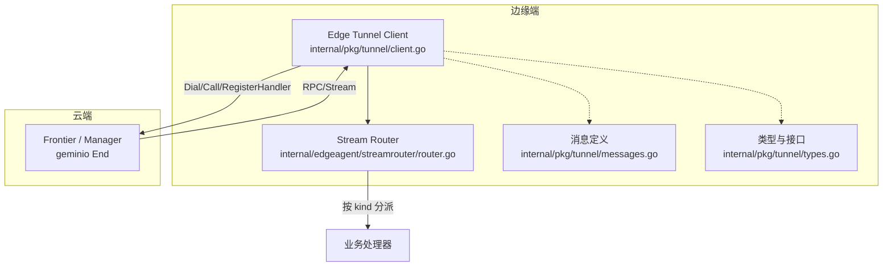
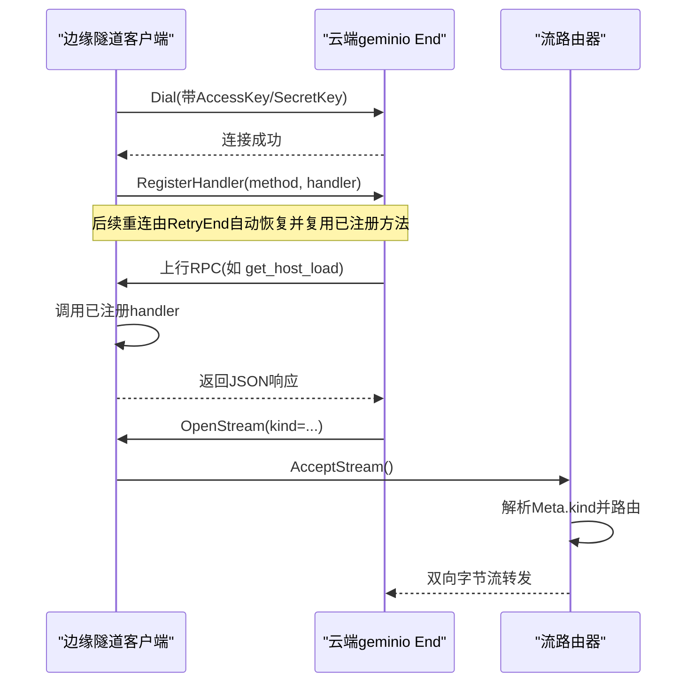
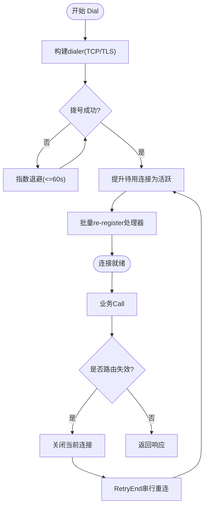
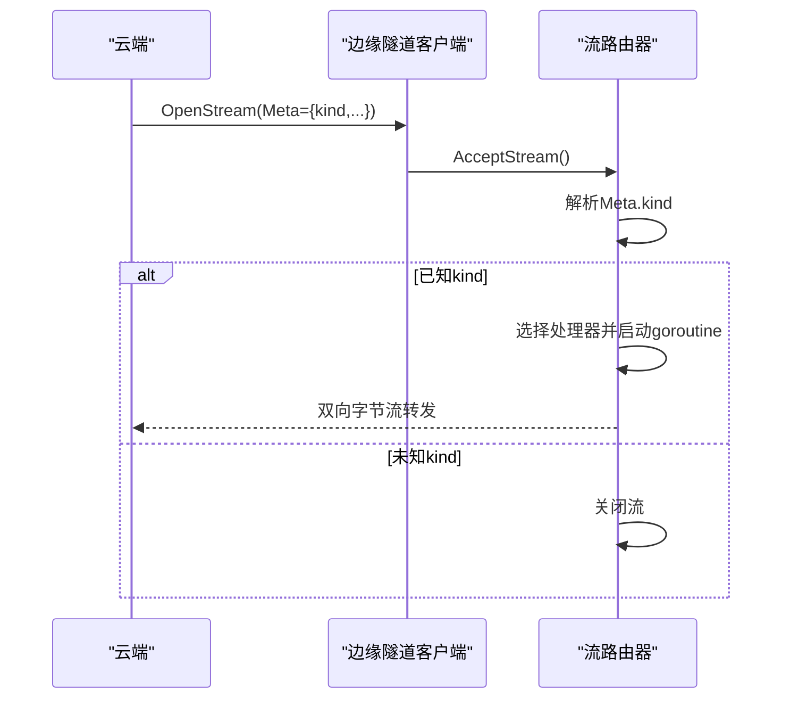
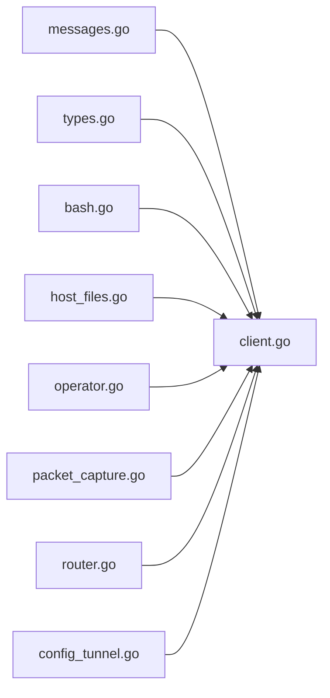

# 通信隧道

<cite>
**本文引用的文件**
- [tunnel.proto](file://api/tunnel/v1/tunnel.proto)
- [client.go](file://internal/pkg/tunnel/client.go)
- [messages.go](file://internal/pkg/tunnel/messages.go)
- [types.go](file://internal/pkg/tunnel/types.go)
- [router.go](file://internal/edgeagent/streamrouter/router.go)
- [bash.go](file://internal/pkg/tunnel/bash.go)
- [host_files.go](file://internal/pkg/tunnel/host_files.go)
- [operator.go](file://internal/pkg/tunnel/operator.go)
- [packet_capture.go](file://internal/pkg/tunnel/packet_capture.go)
- [config_tunnel.go](file://internal/edgeagent/plugins/config_tunnel.go)
</cite>

## 目录
1. [简介](#简介)
2. [项目结构](#项目结构)
3. [核心组件](#核心组件)
4. [架构总览](#架构总览)
5. [详细组件分析](#详细组件分析)
6. [依赖关系分析](#依赖关系分析)
7. [性能与并发](#性能与并发)
8. [故障排查指南](#故障排查指南)
9. [结论](#结论)
10. [附录：客户端集成与调试](#附录客户端集成与调试)

## 简介
本仓库实现了一个面向边缘与云端的“双向通信隧道”，用于在受限网络环境下建立稳定、可重连的远程调用通道。该隧道基于自定义协议（MVP 阶段使用 JSON 编码），通过 geminio 提供的长连接与重试机制，承载多种业务 RPC（如注册、心跳、指标上报、Kubernetes 资源查询/操作、WebSSH、包捕获等）。文档聚焦于连接建立、消息路由、状态同步、协议与序列化、连接管理、重连策略、负载均衡与故障转移、消息类型系统、事件驱动模式、性能优化、并发与内存管理，以及客户端集成与调试方法。

## 项目结构
- API 定义位于 api/tunnel/v1/tunnel.proto，描述云端与边缘之间的请求/响应消息形状（JSON 字段名由 json_name 控制）。
- 边缘侧隧道客户端封装 internal/pkg/tunnel/client.go，提供 Dial、Call、RegisterHandler、AcceptStream、OnReconnect、Close 等能力。
- 消息体与常量定义集中在 internal/pkg/tunnel/messages.go，保持与 proto 同构但避免引入 protobuf 依赖。
- 类型与接口定义在 internal/pkg/tunnel/types.go，包括 Session、Handler、Client 接口、StreamConn 等。
- 流式通道分发器 internal/edgeagent/streamrouter/router.go 负责 AcceptStream 循环与按 kind 路由到具体处理器。
- 各业务域的消息定义分布在 bash.go、host_files.go、operator.go、packet_capture.go 等文件中。
- 插件配置拉取逻辑 internal/edgeagent/plugins/config_tunnel.go 通过隧道 RPC 获取并缓存配置，支持离线回退。

图表来源
- [client.go:24-165](file://internal/pkg/tunnel/client.go#L24-L165)
- [router.go:22-66](file://internal/edgeagent/streamrouter/router.go#L22-L66)
- [messages.go:18-96](file://internal/pkg/tunnel/messages.go#L18-L96)
- [types.go:8-118](file://internal/pkg/tunnel/types.go#L8-L118)

章节来源
- [tunnel.proto:1-524](file://api/tunnel/v1/tunnel.proto#L1-L524)
- [client.go:24-165](file://internal/pkg/tunnel/client.go#L24-L165)
- [messages.go:18-96](file://internal/pkg/tunnel/messages.go#L18-L96)
- [types.go:8-118](file://internal/pkg/tunnel/types.go#L8-L118)
- [router.go:22-66](file://internal/edgeagent/streamrouter/router.go#L22-L66)

## 核心组件
- 隧道客户端（Edge Tunnel Client）
  - 负责建立连接、自动重连、注册/重新注册处理器、发起 RPC、接受流式连接、生命周期管理。
  - 关键能力：指数退避重连、TLS 可选校验、连接代际切换、错误路由回收、回调通知。
- 消息与协议
  - 以 JSON 为线格式，方法名作为 RPC 标识；proto 仅定义消息形状，Go 侧手动镜像结构体以保持无依赖。
- 流式路由器（Stream Router）
  - 单循环 AcceptStream，解析 Meta 中的 kind，将流分派给对应处理器，异常隔离与日志记录。
- 插件配置拉取器（TunnelConfigFetcher）
  - 通过隧道 RPC 获取插件配置快照，失败时回退到环境变量配置，支持 Kubernetes 场景默认值注入。

章节来源
- [client.go:24-165](file://internal/pkg/tunnel/client.go#L24-L165)
- [messages.go:18-96](file://internal/pkg/tunnel/messages.go#L18-L96)
- [router.go:22-66](file://internal/edgeagent/streamrouter/router.go#L22-L66)
- [config_tunnel.go:18-186](file://internal/edgeagent/plugins/config_tunnel.go#L18-L186)

## 架构总览
隧道采用“云端-边缘”的双向通信模型：
- 边缘主动拨号建立长连接，携带访问密钥元数据。
- 云端通过 geminio End 暴露 RPC 方法；边缘注册本地处理器接收云端下行调用。
- 流式通道用于需要双向字节流的场景（如 WebSSH、操作执行流）。
- 重连由底层 RetryEnd 透明处理；上层通过 OnReconnect 回调恢复业务状态（如重新注册 edge）。

图表来源
- [client.go:81-165](file://internal/pkg/tunnel/client.go#L81-L165)
- [client.go:208-239](file://internal/pkg/tunnel/client.go#L208-L239)
- [router.go:22-66](file://internal/edgeagent/streamrouter/router.go#L22-L66)

## 详细组件分析

### 连接建立与重连策略
- 拨号流程
  - 构建 dialer（TCP 或 TLS），设置超时；每次拨号成功后跟踪连接并提升为活跃连接。
  - 指数退避：初始 1s，最大 60s，直到首次成功或上下文取消。
  - 注册处理器：首次成功后批量 re-register 所有已注册方法；后续重连由 RetryEnd 记忆已注册方法。
- 重连与状态恢复
  - RetryEnd 内部维护重连锁；当恢复后调用 EndReOnline，客户端提升待用连接并异步触发 OnReconnect 回调。
  - 回调中可重新执行 register_edge 等操作，确保云端绑定正确的 edge_id。
- 断线检测与路由回收
  - Call 返回错误时，若检测到“前端路由失效”（如 no such rpc、mismatch clientID、register_edge 未找到、heartbeat 绑定不就绪等），则关闭当前连接，交由 RetryEnd 串行重连，避免并行 End 竞争。

图表来源
- [client.go:81-165](file://internal/pkg/tunnel/client.go#L81-L165)
- [client.go:272-346](file://internal/pkg/tunnel/client.go#L272-L346)
- [client.go:348-361](file://internal/pkg/tunnel/client.go#L348-L361)

章节来源
- [client.go:81-165](file://internal/pkg/tunnel/client.go#L81-L165)
- [client.go:272-346](file://internal/pkg/tunnel/client.go#L272-L346)
- [client.go:348-361](file://internal/pkg/tunnel/client.go#L348-L361)

### 消息路由与流式通道
- RPC 路由
  - 方法名为字符串常量（如 heartbeat、push_host_metrics、execute_skill 等），边缘侧通过 RegisterHandler 注册对应处理器。
  - 云端通过 End.Call 发送请求，边缘 Handler 返回 JSON 编码的响应或错误。
- 流式通道路由
  - 云端通过 OpenStream 打开双向流，附带 Meta（JSON，包含 kind）。
  - 边缘侧 streamrouter 启动 acceptLoop，解析 Meta.kind 并选择对应处理器；未知 kind 走 fallback 或直接关闭。
  - 每个流处理器在独立 goroutine 运行，panic 被捕获并记录堆栈，避免影响主循环。

图表来源
- [router.go:22-66](file://internal/edgeagent/streamrouter/router.go#L22-L66)
- [types.go:81-118](file://internal/pkg/tunnel/types.go#L81-L118)

章节来源
- [messages.go:18-96](file://internal/pkg/tunnel/messages.go#L18-L96)
- [router.go:22-66](file://internal/edgeagent/streamrouter/router.go#L22-L66)
- [types.go:81-118](file://internal/pkg/tunnel/types.go#L81-L118)

### 状态同步机制
- 注册与心跳
  - 首次连接后发送 register_edge，云端返回 edge_id 与服务器时间；周期性发送 heartbeat，携带时间戳与可选状态位（如 collector_lag）。
- 指标与发现
  - 周期推送主机指标（push_host_metrics）、Prometheus 样本（push_prom_samples）、网络邻居发现（push_network_discovery）。
- 配置同步
  - 通过 get_plugin_configs 获取插件配置快照；收到 plugin_configs_changed 通知后重新拉取；失败时回退到环境变量配置。
- Kubernetes 资源同步
  - 控制器模式定期推送集群资源快照（push_k8s_inventory），支持增量删除引用；云端可下发 describe/query/action 指令。

章节来源
- [messages.go:259-406](file://internal/pkg/tunnel/messages.go#L259-L406)
- [messages.go:437-523](file://internal/pkg/tunnel/messages.go#L437-L523)
- [messages.go:525-795](file://internal/pkg/tunnel/messages.go#L525-L795)
- [config_tunnel.go:100-186](file://internal/edgeagent/plugins/config_tunnel.go#L100-L186)

### 支持的通信协议与序列化
- 传输层
  - 基于 TCP 的长连接，可选 TLS（最小版本 TLS1.2，支持 CA 校验）。
- 应用层
  - MVP 阶段使用 JSON 编码的请求/响应体；方法名作为 RPC 标识。
  - 未来可能切换到 protobuf 二进制（Phase 2），当前 Go 结构体与 proto 保持字段一致以便平滑迁移。
- 流式通道
  - 双向字节流，适合终端会话、实时数据转发等场景。

章节来源
- [client.go:167-206](file://internal/pkg/tunnel/client.go#L167-L206)
- [messages.go:8-16](file://internal/pkg/tunnel/messages.go#L8-L16)
- [types.go:81-118](file://internal/pkg/tunnel/types.go#L81-L118)

### 连接管理与重连策略
- 连接代际
  - 使用 activeGeneration/pendingGeneration 区分新旧连接，避免并发下误关新连接。
- 错误分类与回收
  - shouldRecycleBrokenRoute 判断是否为“路由失效”类错误，仅对特定方法（register_edge、heartbeat）进行连接回收，交由 RetryEnd 统一重连。
- 生命周期
  - Close 原子关闭，停止重连，清理待用与活跃连接。

章节来源
- [client.go:56-67](file://internal/pkg/tunnel/client.go#L56-L67)
- [client.go:290-346](file://internal/pkg/tunnel/client.go#L290-L346)
- [client.go:348-361](file://internal/pkg/tunnel/client.go#L348-L361)
- [client.go:401-423](file://internal/pkg/tunnel/client.go#L401-L423)

### 负载均衡与故障转移
- 负载均衡
  - 代码库未实现多后端负载均衡；客户端固定连接到单一 ServerAddr（或兼容 CloudAddr）。
- 故障转移
  - 通过 RetryEnd 实现透明重连；当检测到路由失效时主动回收连接，触发重连。
  - 插件配置拉取具备环境回退路径，保证离线或短暂不可用时仍可维持基本运行。

章节来源
- [types.go:33-66](file://internal/pkg/tunnel/types.go#L33-L66)
- [client.go:81-165](file://internal/pkg/tunnel/client.go#L81-L165)
- [config_tunnel.go:100-186](file://internal/edgeagent/plugins/config_tunnel.go#L100-L186)

### 消息类型系统与事件驱动
- 方法名常量集中管理，避免拼写错误；涵盖注册、心跳、指标、Kubernetes、WebSSH、升级、包拉取、算子执行、抓包等。
- 事件驱动
  - 插件配置变更通过 plugin_configs_changed 推送，边缘收到后立即重新拉取。
  - 流式通道用于实时事件（如 shell_output、operator_exec 事件流）。

章节来源
- [messages.go:18-96](file://internal/pkg/tunnel/messages.go#L18-L96)
- [operator.go:1-61](file://internal/pkg/tunnel/operator.go#L1-L61)
- [config_tunnel.go:100-186](file://internal/edgeagent/plugins/config_tunnel.go#L100-L186)

### 实时通信模式
- WebSSH
  - 通过 shell_open/shell_input/shell_resize/shell_close 等方法建立终端会话；shell_output/shell_exit 推送输出与退出帧。
- 操作执行
  - operator.exec_start 启动执行任务，operator.push_event 推送实时事件；stream_kind 为 operator_exec。
- 抓包
  - packet_capture.start/get/read/cancel/stop 管理边缘本地抓包任务，read 返回 base64 编码的 PCAP 数据。

章节来源
- [messages.go:59-96](file://internal/pkg/tunnel/messages.go#L59-L96)
- [operator.go:1-61](file://internal/pkg/tunnel/operator.go#L1-L61)
- [packet_capture.go:1-114](file://internal/pkg/tunnel/packet_capture.go#L1-L114)

## 依赖关系分析
- 外部依赖
  - geminio：提供 End、RetryEnd、Delegate、Stream 等能力，负责连接、重试、流式通道。
- 内部依赖
  - messages.go 与 types.go 为 tunnel 包的核心契约，其他业务文件（bash.go、host_files.go、operator.go、packet_capture.go）扩展消息类型。
  - streamrouter 依赖 tunnel.Client 的 AcceptStream 能力。
  - config_tunnel.go 依赖 tunnel.Client 的 Call 能力。

图表来源
- [messages.go:18-96](file://internal/pkg/tunnel/messages.go#L18-L96)
- [types.go:8-118](file://internal/pkg/tunnel/types.go#L8-L118)
- [client.go:24-165](file://internal/pkg/tunnel/client.go#L24-L165)
- [router.go:22-66](file://internal/edgeagent/streamrouter/router.go#L22-L66)
- [config_tunnel.go:18-186](file://internal/edgeagent/plugins/config_tunnel.go#L18-L186)

章节来源
- [messages.go:18-96](file://internal/pkg/tunnel/messages.go#L18-L96)
- [types.go:8-118](file://internal/pkg/tunnel/types.go#L8-L118)
- [client.go:24-165](file://internal/pkg/tunnel/client.go#L24-L165)
- [router.go:22-66](file://internal/edgeagent/streamrouter/router.go#L22-L66)
- [config_tunnel.go:18-186](file://internal/edgeagent/plugins/config_tunnel.go#L18-L186)

## 性能与并发
- 连接与重连
  - 指数退避限制重连频率，避免雪崩；单次重连串行化，避免并行 End 竞争。
- 批处理与去重
  - 指标与样本推送支持批量（points/samples），服务端可去重与拒收；响应中包含 accepted 计数。
- 并发安全
  - 处理器注册与回调使用互斥锁保护；流处理器在独立 goroutine 运行，panic 隔离。
- 内存管理
  - 敏感字段（如 SSH 密码）仅在内存中使用并在 Dial 后清除；避免持久化与日志泄露。
  - 插件配置快照缓存，减少频繁网络开销；失败时回退到环境变量配置。

章节来源
- [client.go:81-165](file://internal/pkg/tunnel/client.go#L81-L165)
- [messages.go:379-435](file://internal/pkg/tunnel/messages.go#L379-L435)
- [router.go:54-64](file://internal/edgeagent/streamrouter/router.go#L54-L64)
- [config_tunnel.go:100-186](file://internal/edgeagent/plugins/config_tunnel.go#L100-L186)

## 故障排查指南
- 常见错误与处理
  - 路由失效：no such rpc、mismatch clientID、register_edge 未找到、heartbeat 绑定不就绪；客户端会回收连接并重连。
  - 认证失败：access_key/secret_key 错误导致连接被关闭；需检查配置。
  - 流处理 panic：streamrouter 捕获并记录堆栈，不影响主循环。
- 诊断建议
  - 启用 slog 日志，关注 tunnel 相关日志（连接、重连、错误）。
  - 检查插件配置拉取是否回退到环境变量；确认 manager 可达性与权限。
  - 对于 WebSSH/操作执行，检查 Meta.kind 是否正确、处理器是否注册。

章节来源
- [client.go:348-361](file://internal/pkg/tunnel/client.go#L348-L361)
- [router.go:54-64](file://internal/edgeagent/streamrouter/router.go#L54-L64)
- [config_tunnel.go:100-186](file://internal/edgeagent/plugins/config_tunnel.go#L100-L186)

## 结论
该通信隧道以简洁的 JSON 协议与稳定的长连接为基础，提供了丰富的业务 RPC 与流式通道能力。通过指数退避重连、错误路由回收、回调状态恢复、插件配置回退等机制，确保了高可用与鲁棒性。未来可在 Phase 2 切换到 protobuf 二进制以提升性能与类型安全。

## 附录：客户端集成与调试
- 集成步骤
  - 构造 ClientConfig（ServerAddr/CloudAddr、AccessKey/SecretKey、可选 TLSCAFile）。
  - 调用 Dial 建立连接；注册处理器（RegisterHandler）。
  - 使用 Call 发起 RPC（如 heartbeat、push_host_metrics）。
  - 如需流式通道，调用 AcceptStream 并通过 streamrouter 路由到处理器。
  - 使用 OnReconnect 注册回调，重连后重新执行必要初始化（如 register_edge）。
  - 最后调用 Close 释放资源。
- 调试工具
  - 启用 slog 日志，观察连接、重连、错误信息。
  - 检查插件配置拉取是否成功，必要时查看环境变量回退。
  - 对于 WebSSH/操作执行，验证 Meta.kind 与处理器注册。

章节来源
- [types.go:33-118](file://internal/pkg/tunnel/types.go#L33-L118)
- [client.go:24-165](file://internal/pkg/tunnel/client.go#L24-L165)
- [router.go:22-66](file://internal/edgeagent/streamrouter/router.go#L22-L66)
- [config_tunnel.go:100-186](file://internal/edgeagent/plugins/config_tunnel.go#L100-L186)