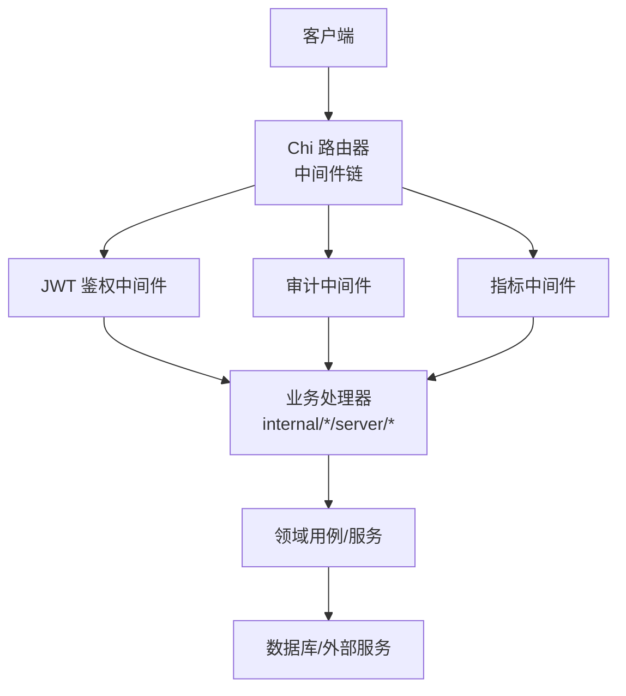
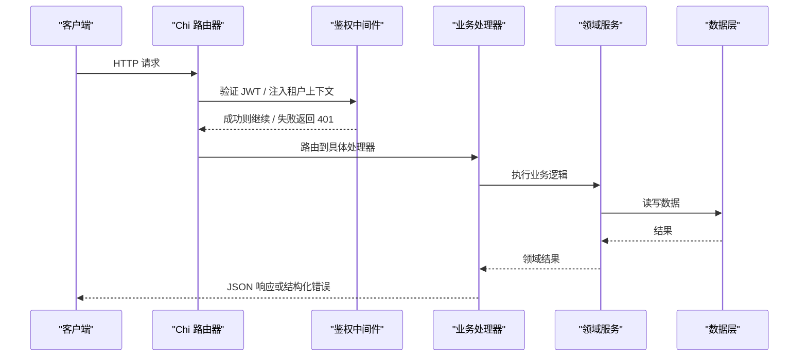
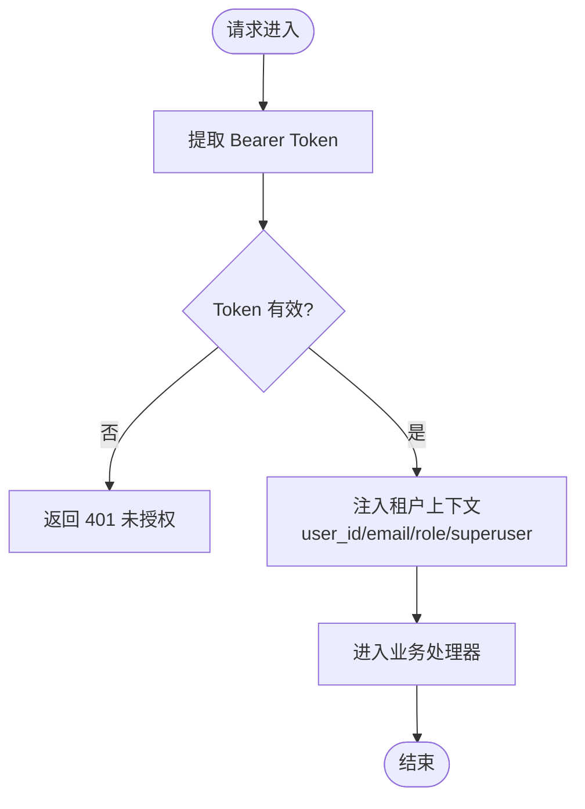
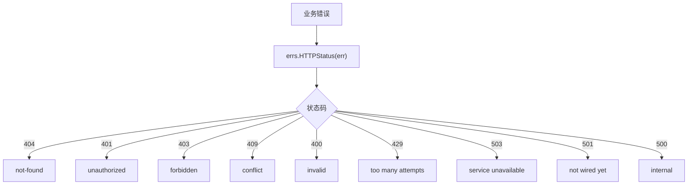
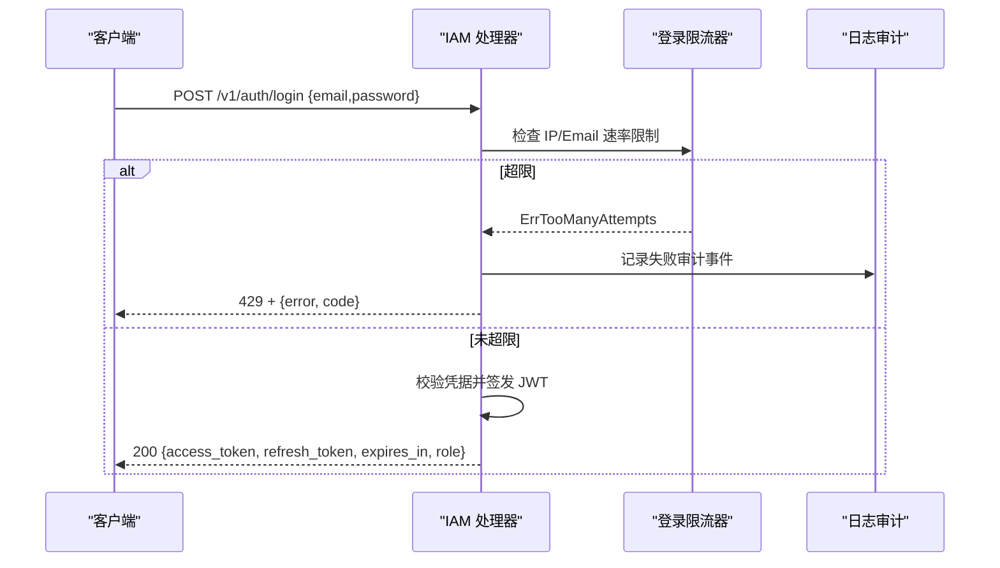
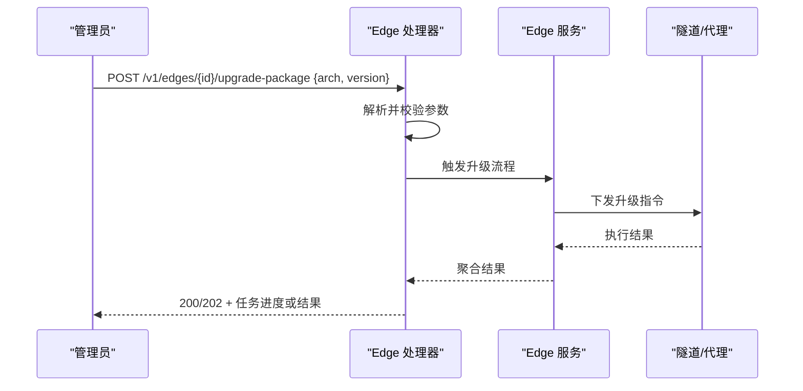
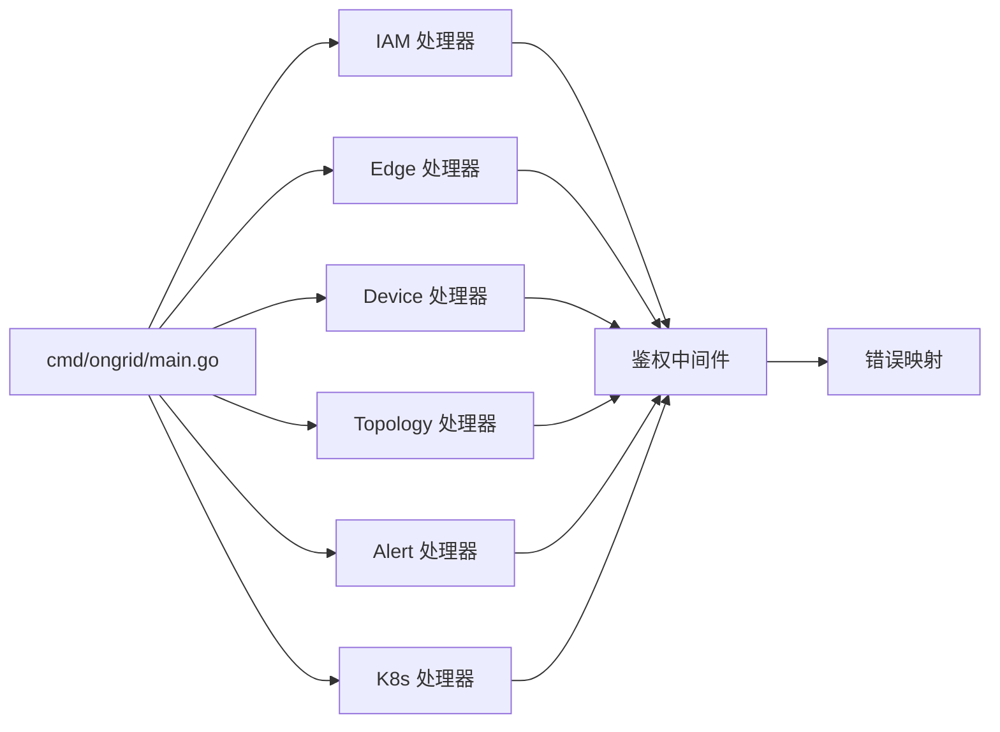

# REST API 协议

<cite>
**本文引用的文件**
- [cmd/ongrid/main.go](file://cmd/ongrid/main.go)
- [internal/pkg/httpserver/server.go](file://internal/pkg/httpserver/server.go)
- [internal/pkg/auth/middleware.go](file://internal/pkg/auth/middleware.go)
- [internal/pkg/errs/errs.go](file://internal/pkg/errs/errs.go)
- [internal/manager/server/middleware/metrics.go](file://internal/manager/server/middleware/metrics.go)
- [internal/manager/server/middleware/audit.go](file://internal/manager/server/middleware/audit.go)
- [internal/iam/server/http.go](file://internal/iam/server/http.go)
- [internal/manager/server/device/http.go](file://internal/manager/server/device/http.go)
- [internal/manager/server/topology/http.go](file://internal/manager/server/topology/http.go)
- [internal/manager/server/alert/http.go](file://internal/manager/server/alert/http.go)
- [internal/manager/server/k8s/http.go](file://internal/manager/server/k8s/http.go)
- [internal/manager/server/edge/http.go](file://internal/manager/server/edge/http.go)
- [api/README.md](file://api/README.md)
- [api/iam/v1/iam.proto](file://api/iam/v1/iam.proto)
- [api/manager/edge/v1/edge.proto](file://api/manager/edge/v1/edge.proto)
</cite>

## 目录
1. [简介](#简介)
2. [项目结构](#项目结构)
3. [核心组件](#核心组件)
4. [架构总览](#架构总览)
5. [详细组件分析](#详细组件分析)
6. [依赖关系分析](#依赖关系分析)
7. [性能与可观测性](#性能与可观测性)
8. [故障排查指南](#故障排查指南)
9. [结论](#结论)
10. [附录：API 端点清单与示例](#附录api-端点清单与示例)

## 简介
本文件为基于 Chi Router 的 RESTful API 协议文档。系统以 Protobuf 作为单一事实来源（SSOT），通过手写 HTTP 处理器将 gRPC 风格的 RPC 契约映射到 REST 端点，不使用 grpc-gateway。认证采用 JWT Bearer Token，组织上下文由中间件注入；错误统一通过哨兵错误映射为 HTTP 状态码并返回结构化 JSON 错误体。文档覆盖认证机制、请求响应格式、错误处理规范、Protobuf 到 REST 的映射策略、版本兼容与安全实践。

## 项目结构
- API 契约位于 api 目录，按业务域划分 v1 版本；每个服务一个 .proto 文件，消息使用 json_name 控制 JSON 字段名。
- HTTP 路由在 cmd/ongrid/main.go 中集中组装，使用 chi.Router 分组注册公共与受保护路由。
- 通用中间件包括鉴权、审计、指标采集等；HTTP 服务器封装了优雅关闭。
- 各业务域 handler 集中在 internal/manager/server/* 与 internal/iam/server/*。

图表来源
- [cmd/ongrid/main.go:2489-2651](file://cmd/ongrid/main.go#L2489-L2651)
- [internal/pkg/auth/middleware.go:21-53](file://internal/pkg/auth/middleware.go#L21-L53)
- [internal/manager/server/middleware/audit.go:72-103](file://internal/manager/server/middleware/audit.go#L72-L103)
- [internal/manager/server/middleware/metrics.go:22-33](file://internal/manager/server/middleware/metrics.go#L22-L33)

章节来源
- [api/README.md:1-42](file://api/README.md#L1-L42)
- [cmd/ongrid/main.go:2489-2651](file://cmd/ongrid/main.go#L2489-L2651)

## 核心组件
- HTTP 服务器：封装 net/http.Server，提供带超时的优雅关闭。
- 鉴权中间件：从 Authorization: Bearer 或查询参数 token 提取 JWT，校验后写入租户上下文（用户 ID、邮箱、角色、是否超级用户）。
- 错误体系：统一的哨兵错误集合，映射到 HTTP 状态码；处理器统一输出 {error, code} 结构。
- 审计中间件：仅记录显式标注的用户操作，自动填充 IP、UA、请求 ID、状态桶等。
- 指标中间件：按 chi 编译期路由模式统计请求数与耗时，未知路由归入 unknown 避免基数爆炸。

章节来源
- [internal/pkg/httpserver/server.go:13-59](file://internal/pkg/httpserver/server.go#L13-L59)
- [internal/pkg/auth/middleware.go:10-67](file://internal/pkg/auth/middleware.go#L10-L67)
- [internal/pkg/errs/errs.go:12-53](file://internal/pkg/errs/errs.go#L12-L53)
- [internal/manager/server/middleware/audit.go:56-103](file://internal/manager/server/middleware/audit.go#L56-L103)
- [internal/manager/server/middleware/metrics.go:18-33](file://internal/manager/server/middleware/metrics.go#L18-L33)

## 架构总览
系统入口在 main 中构建 chi 路由器，分别注册公共路由（登录、刷新、部分公开接口）与受保护路由（需要 JWT）。所有受保护路由均经过鉴权中间件，随后进入业务处理器。业务处理器调用领域用例/服务，最终访问存储或外部系统。

图表来源
- [cmd/ongrid/main.go:2489-2651](file://cmd/ongrid/main.go#L2489-L2651)
- [internal/pkg/auth/middleware.go:21-53](file://internal/pkg/auth/middleware.go#L21-L53)

## 详细组件分析

### 认证与授权
- 认证方式：Authorization: Bearer <JWT>；WebSocket 升级场景支持 ?token= 回退。
- 令牌校验：由鉴权中间件完成，不查库；后续权限检查在业务处理器内基于租户上下文进行。
- 授权模型：基于 casbin 的 RBAC，对象命名如 edge:*、knowledge:doc 等，动作包含 read/write/delete/manage；超级用户短路以避免策略损坏导致管理员被锁。

图表来源
- [internal/pkg/auth/middleware.go:21-53](file://internal/pkg/auth/middleware.go#L21-L53)

章节来源
- [internal/pkg/auth/middleware.go:10-67](file://internal/pkg/auth/middleware.go#L10-L67)
- [internal/manager/server/middleware/audit.go:72-103](file://internal/manager/server/middleware/audit.go#L72-L103)

### 错误处理规范
- 统一错误类型：NotFound、Unauthorized、Forbidden、Conflict、Invalid、TooManyAttempts、EdgeOffline、NotWiredYet 等。
- 状态码映射：通过 errs.HTTPStatus 将哨兵错误映射为标准 HTTP 状态码；未知错误返回 500。
- 响应体：{ error: 字符串, code: 字符串 }，code 为人类可读的错误码（如 not-found、unauthorized、invalid、conflict、internal 等）。

图表来源
- [internal/pkg/errs/errs.go:28-53](file://internal/pkg/errs/errs.go#L28-L53)

章节来源
- [internal/pkg/errs/errs.go:12-53](file://internal/pkg/errs/errs.go#L12-L53)
- [internal/manager/server/device/http.go:669-696](file://internal/manager/server/device/http.go#L669-L696)
- [internal/manager/server/topology/http.go:651-675](file://internal/manager/server/topology/http.go#L651-L675)
- [internal/manager/server/alert/http.go:947-962](file://internal/manager/server/alert/http.go#L947-L962)
- [internal/manager/server/k8s/http.go:1217-1242](file://internal/manager/server/k8s/http.go#L1217-L1242)

### Protobuf 到 REST 的映射策略
- 契约优先：所有对外 API 契约定义在 api/*.proto，JSON 字段通过 json_name 控制。
- 无网关：MVP 阶段手写 HTTP 处理器直接消费 Go 类型，不启用 grpc-gateway。
- org_id 来源：来自 URL 路径与 JWT claims，不在请求体中由用户提供；响应中可只读回显。
- 时间与时序：使用 google.protobuf.Timestamp；ID 使用 uint64；令牌使用 string。
- 版本化：包名遵循 ongrid.<bc>[.<subdomain>].v<major>，通过 buf breaking 检测破坏性变更。

章节来源
- [api/README.md:6-33](file://api/README.md#L6-L33)
- [api/iam/v1/iam.proto:9-42](file://api/iam/v1/iam.proto#L9-L42)
- [api/manager/edge/v1/edge.proto:10-61](file://api/manager/edge/v1/edge.proto#L10-L61)

### 关键业务端点与协议

#### IAM 认证与会话
- 公开端点
  - POST /v1/auth/login：邮箱+密码登录，返回 access_token、refresh_token、expires_in、role。
  - POST /v1/auth/refresh：用 refresh_token 换取新令牌对。
- 受保护端点（需 JWT）
  - POST /v1/auth/register：注册并创建个人组织。
  - GET /v1/self、GET /v1/me：获取当前用户信息及其成员资格。
  - 用户管理：/v1/users（CRUD）、/v1/users/{id}/role、/v1/users/{id}/password、/v1/users/{id}。
  - 组织管理：/v1/orgs（CRUD）、/v1/orgs/{id}/members（CRUD）。

图表来源
- [internal/iam/server/http.go:151-155](file://internal/iam/server/http.go#L151-L155)
- [internal/iam/server/http.go:221-269](file://internal/iam/server/http.go#L221-L269)

章节来源
- [internal/iam/server/http.go:151-183](file://internal/iam/server/http.go#L151-L183)
- [internal/iam/server/http.go:221-269](file://internal/iam/server/http.go#L221-L269)

#### Edge 设备管理
- 端点
  - POST /v1/edges：创建边缘设备（admin）。
  - GET /v1/edges：列出设备（支持在线状态过滤、分页、名称模糊搜索）。
  - GET /v1/edges/{id}：获取设备详情。
  - DELETE /v1/edges/{id}：删除设备（admin）。
  - POST /v1/edges/{id}/rotate-secret：轮换密钥（admin）。
  - POST /v1/edges/{id}/upgrade：远程代理升级（admin）。
  - POST /v1/edges/{id}/upgrade-package：整数包升级（admin）。
  - 批量操作：/v1/edges/batch/upgrade-package、/v1/edges/batch/upgrade、/v1/edges/batch/delete。
  - 升级任务：/v1/edge-upgrade-jobs（CRUD）、/v1/edge-upgrade-jobs/{id}/retry。
  - 主机探测：/v1/edges/{id}/processes、/v1/edges/{id}/plugins、/v1/integrations/plugin-counts。

图表来源
- [internal/manager/server/edge/http.go:150-199](file://internal/manager/server/edge/http.go#L150-L199)

章节来源
- [internal/manager/server/edge/http.go:150-199](file://internal/manager/server/edge/http.go#L150-L199)
- [api/manager/edge/v1/edge.proto:10-61](file://api/manager/edge/v1/edge.proto#L10-L61)

#### 设备与拓扑
- 设备
  - GET /v1/devices：列表（支持 hostname/name/roles/online/limit/offset）。
  - GET /v1/devices/{id}：详情。
  - PATCH /v1/devices/{id}：更新名称/描述（admin）。
  - PATCH /v1/devices/{id}/roles：更新角色（admin）。
  - DELETE /v1/devices/{id}：删除（admin）。
  - GET /v1/devices/{id}/edges：关联 edges。
  - GET /v1/devices/{id}/network：已验证网络配置。
  - 网络发现：/v1/network-discovery/candidates 及扫描/提升操作（admin）。
- 拓扑
  - GET /v1/topology/nodes、/v1/topology/relations 等（参考前端测试中的路径约定）。

章节来源
- [internal/manager/server/device/http.go:40-65](file://internal/manager/server/device/http.go#L40-L65)
- [internal/manager/server/device/http.go:193-247](file://internal/manager/server/device/http.go#L193-L247)
- [internal/manager/server/topology/http.go:628-675](file://internal/manager/server/topology/http.go#L628-L675)

#### 告警与其他模块
- 告警：统一错误映射与 JSON 响应体（见 alert http 处理器）。
- K8s：Bearer Token 解析与错误体一致（见 k8s http 处理器）。

章节来源
- [internal/manager/server/alert/http.go:920-962](file://internal/manager/server/alert/http.go#L920-L962)
- [internal/manager/server/k8s/http.go:1194-1242](file://internal/manager/server/k8s/http.go#L1194-L1242)

## 依赖关系分析
- 路由装配：main 中构建 chi 路由器，注册 IAM 公开/受保护路由、Prometheus 代理、IM Bridge、K8s、Edge 等子模块。
- 中间件链：鉴权、审计、指标依次包裹，确保上下文传递与可观测性。
- 错误与状态码：所有处理器统一使用 errs.HTTPStatus 与 writeErr/writeJSON 工具函数。

图表来源
- [cmd/ongrid/main.go:2489-2651](file://cmd/ongrid/main.go#L2489-L2651)
- [internal/pkg/auth/middleware.go:21-53](file://internal/pkg/auth/middleware.go#L21-L53)
- [internal/pkg/errs/errs.go:28-53](file://internal/pkg/errs/errs.go#L28-L53)

章节来源
- [cmd/ongrid/main.go:2489-2651](file://cmd/ongrid/main.go#L2489-L2651)

## 性能与可观测性
- 指标采集：按 chi 编译期路由模式统计请求数与耗时，未知路由归入 unknown，避免基数爆炸。
- 审计日志：仅记录显式标注的操作，自动填充 IP、UA、请求 ID、状态桶，便于安全审计与问题定位。
- 服务器生命周期：ReadHeaderTimeout 设置，优雅关闭超时 10 秒，避免长连接阻塞。

章节来源
- [internal/manager/server/middleware/metrics.go:18-33](file://internal/manager/server/middleware/metrics.go#L18-L33)
- [internal/manager/server/middleware/audit.go:56-103](file://internal/manager/server/middleware/audit.go#L56-L103)
- [internal/pkg/httpserver/server.go:19-59](file://internal/pkg/httpserver/server.go#L19-L59)

## 故障排查指南
- 401 未授权：检查 Authorization 头是否为 Bearer Token；确认 Token 未过期且签名有效。
- 403 禁止：检查角色与资源权限（casbin 策略）；确认 org_id 与 JWT claims 一致。
- 404 不存在：检查资源 ID 是否正确；确认资源未被软删除。
- 400 无效参数：检查请求体字段类型与必填项；注意分页与过滤参数的合法性。
- 409 冲突：检查唯一约束（如 slug、名称）；避免重复创建。
- 429 过多尝试：登录等敏感路径有速率限制；等待窗口后重试或降低频率。
- 503 不可用：边缘离线或后端依赖不可用；检查边缘状态与依赖服务健康。
- 501 尚未接入：功能未上线或未配置依赖；查看相关开关与配置。

章节来源
- [internal/pkg/errs/errs.go:28-53](file://internal/pkg/errs/errs.go#L28-L53)
- [internal/iam/server/http.go:221-269](file://internal/iam/server/http.go#L221-L269)

## 结论
本系统以 Protobuf 为契约中心，通过 Chi Router 实现 REST API，结合 JWT 鉴权、RBAC 授权、统一错误映射与审计/指标中间件，形成高内聚、低耦合、可观测的 API 架构。建议在生产环境中严格配置 JWT 密钥、启用审计与指标、合理设置速率限制与超时，并持续通过 buf breaking 保障版本兼容性。

## 附录：API 端点清单与示例

### 认证与会话
- POST /v1/auth/login
  - 方法：POST
  - 路径：/v1/auth/login
  - 认证：无
  - 请求体：{ email, password }
  - 响应：{ access_token, refresh_token, expires_in, role }
  - 状态码：200 / 400 / 429
- POST /v1/auth/refresh
  - 方法：POST
  - 路径：/v1/auth/refresh
  - 认证：无
  - 请求体：{ refresh_token }
  - 响应：{ tokens }
  - 状态码：200 / 400

### 用户与组织
- POST /v1/auth/register
  - 方法：POST
  - 路径：/v1/auth/register
  - 认证：无
  - 请求体：{ email, password, role? }
  - 响应：用户与个人组织信息、令牌对
  - 状态码：200 / 400 / 409
- GET /v1/self、GET /v1/me
  - 方法：GET
  - 路径：/v1/self、/v1/me
  - 认证：JWT
  - 响应：用户信息与成员资格
  - 状态码：200 / 401
- 用户 CRUD：/v1/users、/v1/users/{id}、/v1/users/{id}/role、/v1/users/{id}/password
- 组织 CRUD：/v1/orgs、/v1/orgs/{id}/members

### 边缘设备
- POST /v1/edges
  - 方法：POST
  - 路径：/v1/edges
  - 认证：JWT（admin）
  - 请求体：{ name }
  - 响应：设备与密钥对（secret_key 仅一次明文）
  - 状态码：200 / 400 / 401 / 403
- GET /v1/edges
  - 方法：GET
  - 路径：/v1/edges
  - 认证：JWT
  - 查询参数：status_filter、page、page_size、name
  - 响应：{ edges[], total, page, page_size }
  - 状态码：200 / 401
- GET /v1/edges/{id}
  - 方法：GET
  - 路径：/v1/edges/{id}
  - 认证：JWT
  - 响应：{ edge }
  - 状态码：200 / 404
- DELETE /v1/edges/{id}
  - 方法：DELETE
  - 路径：/v1/edges/{id}
  - 认证：JWT（admin）
  - 响应：空
  - 状态码：204 / 401 / 403 / 404
- POST /v1/edges/{id}/rotate-secret
  - 方法：POST
  - 路径：/v1/edges/{id}/rotate-secret
  - 认证：JWT（admin）
  - 响应：{ secret_key, rotated_at }
  - 状态码：200 / 401 / 403 / 404
- 升级与批量操作：/v1/edges/{id}/upgrade、/v1/edges/{id}/upgrade-package、/v1/edges/batch/*
- 升级任务：/v1/edge-upgrade-jobs（CRUD）、/v1/edge-upgrade-jobs/{id}/retry

### 设备与拓扑
- GET /v1/devices
  - 方法：GET
  - 路径：/v1/devices
  - 认证：JWT
  - 查询参数：hostname、name、roles、online、limit、offset
  - 响应：{ items[], total }
  - 状态码：200 / 401
- GET /v1/devices/{id}
  - 方法：GET
  - 路径：/v1/devices/{id}
  - 认证：JWT
  - 响应：设备详情
  - 状态码：200 / 404
- PATCH /v1/devices/{id}、PATCH /v1/devices/{id}/roles、DELETE /v1/devices/{id}
  - 方法：PATCH/DELETE
  - 路径：/v1/devices/{id}、/v1/devices/{id}/roles
  - 认证：JWT（admin）
  - 响应：根据操作返回
  - 状态码：200/204 / 401 / 403 / 404
- 网络发现：/v1/network-discovery/candidates、扫描与提升（admin）

### 错误响应示例
- 成功：
  - 200 OK
  - Content-Type: application/json
  - Body: { ... }
- 错误：
  - 400 Bad Request
  - Content-Type: application/json
  - Body: { error: "invalid argument", code: "invalid" }
- 401 Unauthorized
  - Body: { error: "missing bearer token", code: "unauthorized" }
- 403 Forbidden
  - Body: { error: "...", code: "forbidden" }
- 404 Not Found
  - Body: { error: "...", code: "not-found" }
- 409 Conflict
  - Body: { error: "...", code: "conflict" }
- 429 Too Many Requests
  - Body: { error: "...", code: "too many attempts" }
- 500 Internal Server Error
  - Body: { error: "...", code: "internal" }

章节来源
- [internal/iam/server/http.go:151-183](file://internal/iam/server/http.go#L151-L183)
- [internal/manager/server/edge/http.go:150-199](file://internal/manager/server/edge/http.go#L150-L199)
- [internal/manager/server/device/http.go:40-65](file://internal/manager/server/device/http.go#L40-L65)
- [internal/manager/server/device/http.go:669-696](file://internal/manager/server/device/http.go#L669-L696)
- [internal/manager/server/topology/http.go:651-675](file://internal/manager/server/topology/http.go#L651-L675)
- [internal/manager/server/alert/http.go:947-962](file://internal/manager/server/alert/http.go#L947-L962)
- [internal/manager/server/k8s/http.go:1217-1242](file://internal/manager/server/k8s/http.go#L1217-L1242)
- [internal/pkg/errs/errs.go:28-53](file://internal/pkg/errs/errs.go#L28-L53)