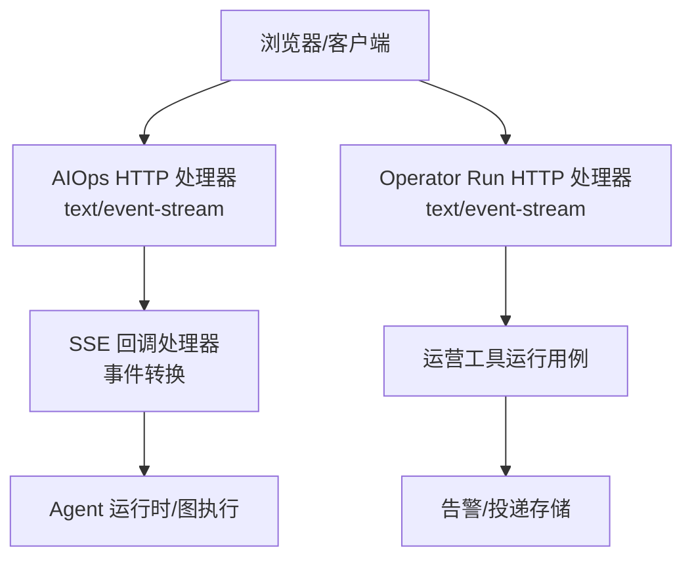
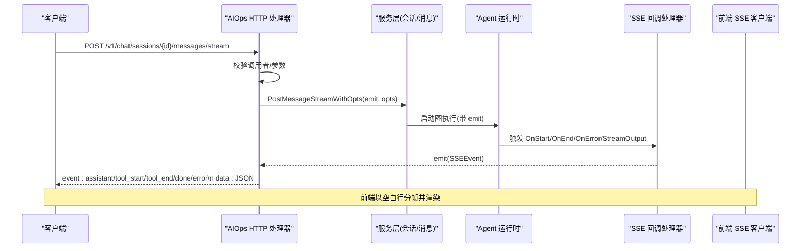
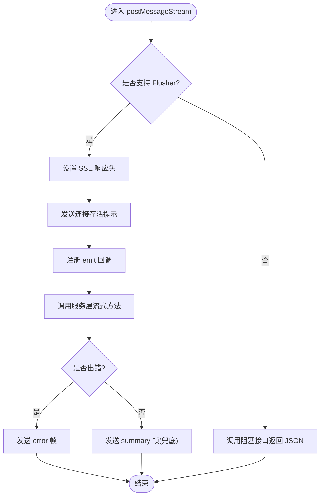
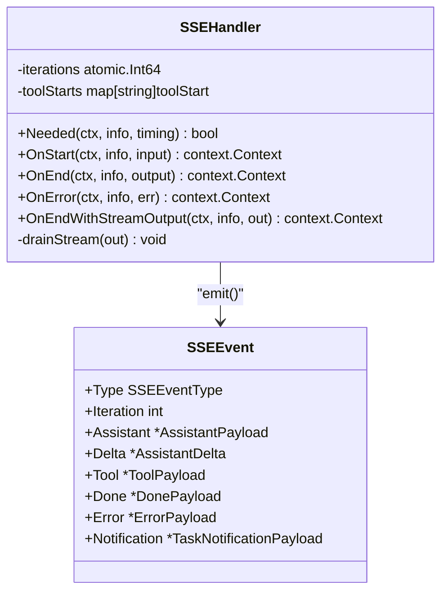
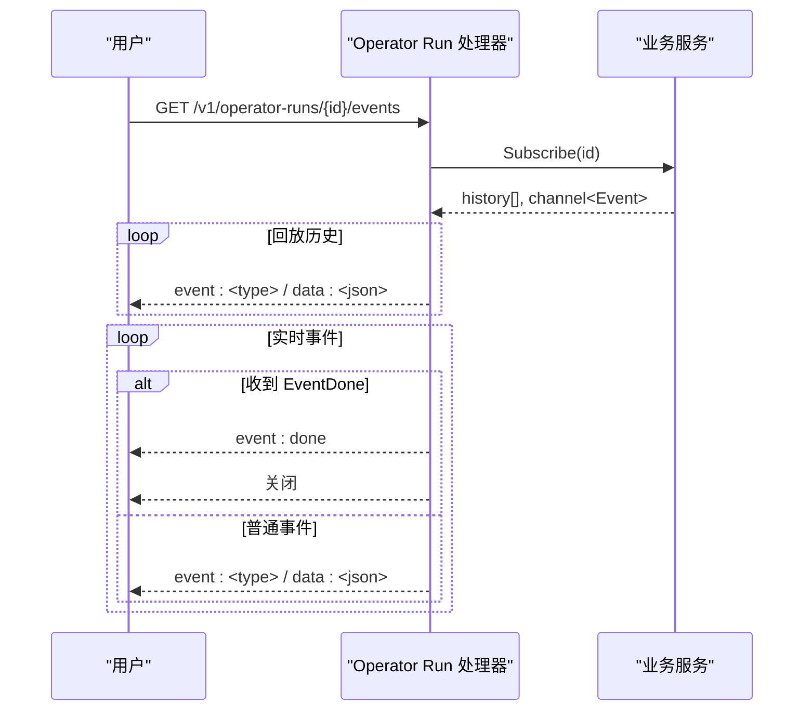
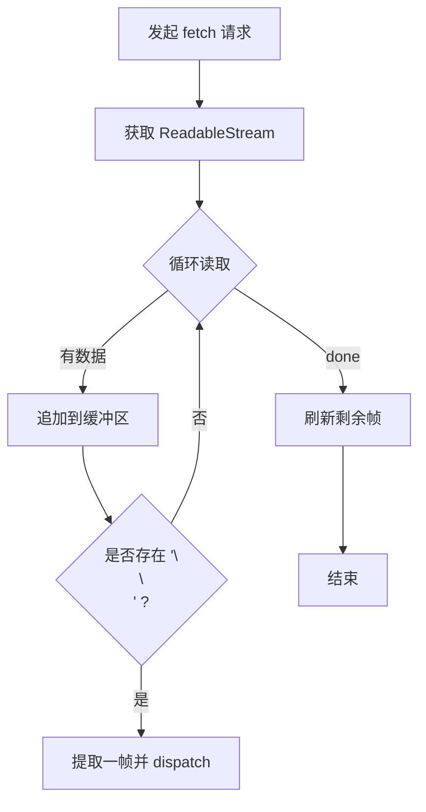
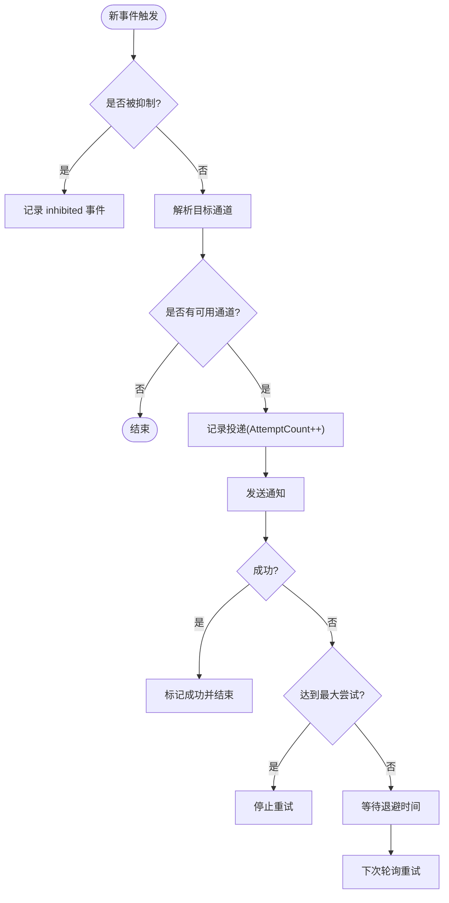
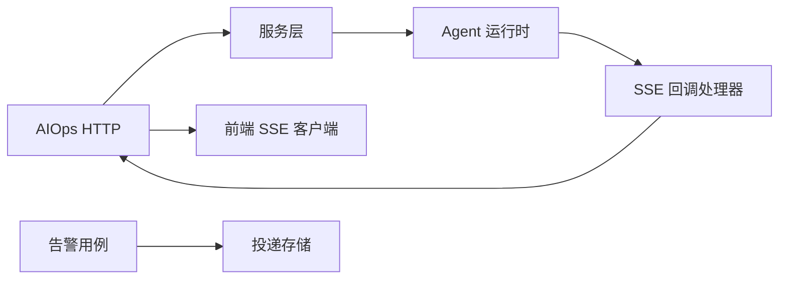

# SSE 事件流

<cite>
**本文引用的文件**
- [internal/manager/server/aiops/http.go](file://internal/manager/server/aiops/http.go)
- [internal/manager/biz/aiops/graph/callbacks/sse.go](file://internal/manager/biz/aiops/graph/callbacks/sse.go)
- [internal/manager/server/operatorrun/http.go](file://internal/manager/server/operatorrun/http.go)
- [web/src/api/chat.ts](file://web/src/api/chat.ts)
- [web/src/pages/ChatThread.tsx](file://web/src/pages/ChatThread.tsx)
- [internal/manager/biz/alert/usecase.go](file://internal/manager/biz/alert/usecase.go)
- [internal/manager/model/alert/model.go](file://internal/manager/model/alert/model.go)
- [internal/pkg/tunnel/client.go](file://internal/pkg/tunnel/client.go)
- [internal/edgeagent/biz/agent.go](file://internal/edgeagent/biz/agent.go)
</cite>

## 目录
1. [简介](#简介)
2. [项目结构](#项目结构)
3. [核心组件](#核心组件)
4. [架构总览](#架构总览)
5. [详细组件分析](#详细组件分析)
6. [依赖关系分析](#依赖关系分析)
7. [性能考量](#性能考量)
8. [故障排查指南](#故障排查指南)
9. [结论](#结论)
10. [附录](#附录)

## 简介
本文件面向 SSE（Server-Sent Events）事件流协议，覆盖实时事件推送机制、事件类型定义、消息格式规范与连接管理策略。重点说明 AI Agent 对话流、告警通知与系统事件的实时推送实现，涵盖事件订阅、过滤、重试策略与断线恢复，并提供事件流示例、客户端集成指南、性能优化建议以及浏览器兼容性与网络异常处理方案。

## 项目结构
SSE 能力在系统中分布于以下层次：
- HTTP 服务层：暴露 SSE 端点并负责流式响应头设置与帧写入
- 业务回调层：将图执行过程中的事件转换为统一 SSE 事件
- 前端消费层：通过 Fetch + ReadableStream 解析 SSE 帧并驱动 UI
- 运维工具运行：提供独立的事件流用于操作任务执行过程
- 告警通道：持久化投递记录与重试，支撑通知类事件

**图表来源**
- [internal/manager/server/aiops/http.go:539-637](file://internal/manager/server/aiops/http.go#L539-L637)
- [internal/manager/server/operatorrun/http.go:104-151](file://internal/manager/server/operatorrun/http.go#L104-L151)
- [internal/manager/biz/aiops/graph/callbacks/sse.go:16-50](file://internal/manager/biz/aiops/graph/callbacks/sse.go#L16-L50)

**章节来源**
- [internal/manager/server/aiops/http.go:539-637](file://internal/manager/server/aiops/http.go#L539-L637)
- [internal/manager/server/operatorrun/http.go:104-151](file://internal/manager/server/operatorrun/http.go#L104-L151)
- [internal/manager/biz/aiops/graph/callbacks/sse.go:16-50](file://internal/manager/biz/aiops/graph/callbacks/sse.go#L16-L50)

## 核心组件
- AIOps SSE 处理器：负责建立 SSE 连接、设置响应头、发送心跳提示、将 agent 事件映射为 SSE 帧
- SSE 回调处理器：监听图执行回调，产出 assistant_start/delta/end、tool_start/end、done/error、task_notification 等事件
- Operator Run SSE 处理器：为短生命周期操作任务提供历史事件回放与实时事件流
- 前端 SSE 客户端：基于 Fetch + ReadableStream 的通用 SSE 解析器，按空白行分帧并分发到回调
- 告警通知与投递：记录投递状态、支持退避重试与最大尝试次数控制

**章节来源**
- [internal/manager/server/aiops/http.go:539-637](file://internal/manager/server/aiops/http.go#L539-L637)
- [internal/manager/biz/aiops/graph/callbacks/sse.go:16-50](file://internal/manager/biz/aiops/graph/callbacks/sse.go#L16-L50)
- [internal/manager/server/operatorrun/http.go:104-151](file://internal/manager/server/operatorrun/http.go#L104-L151)
- [web/src/api/chat.ts:247-318](file://web/src/api/chat.ts#L247-L318)
- [internal/manager/biz/alert/usecase.go:1387-1443](file://internal/manager/biz/alert/usecase.go#L1387-L1443)

## 架构总览
下图展示从请求到事件落地的端到端流程，包括认证、流式响应、回调转换与前端消费。

**图表来源**
- [internal/manager/server/aiops/http.go:539-637](file://internal/manager/server/aiops/http.go#L539-L637)
- [internal/manager/biz/aiops/graph/callbacks/sse.go:149-171](file://internal/manager/biz/aiops/graph/callbacks/sse.go#L149-L171)
- [web/src/api/chat.ts:247-318](file://web/src/api/chat.ts#L247-L318)

## 详细组件分析

### AIOps SSE 处理器
- 职责
  - 设置 SSE 响应头：Content-Type=text/event-stream、Cache-Control=no-cache、X-Accel-Buffering=no
  - 立即发送连接存活提示，确保代理不缓冲
  - 将 agent 事件映射为标准 SSE 帧名：assistant、tool_start、tool_end、done、error、task_notification、approval_pending、summary
  - 错误路径仍发送 error 帧，避免中断后无法识别终止状态
- 关键行为
  - 若不支持流式（无 Flusher），自动降级为阻塞 JSON 响应
  - writeSSE 序列化 payload 并 flush，忽略写失败（连接已关闭时继续推进）

**图表来源**
- [internal/manager/server/aiops/http.go:539-637](file://internal/manager/server/aiops/http.go#L539-L637)

**章节来源**
- [internal/manager/server/aiops/http.go:539-637](file://internal/manager/server/aiops/http.go#L539-L637)

### SSE 回调处理器
- 事件类型
  - assistant_start：模型开始输出前
  - assistant_delta：增量内容块（token/chunk 级）
  - assistant_end：完整回复与待执行工具数量
  - tool_start / tool_end：工具调用生命周期
  - done：终端成功
  - error：不可恢复错误
  - task_notification：后台子任务完成通知
- 并发与顺序
  - 迭代计数使用原子变量保证一致性
  - 工具并行执行时 start/end 可能交错，但每个工具的起止成对出现
- 流式输出
  - 通过 OnEndWithStreamOutput 读取 ChatModel 流，非空 Content 即发出 assistant_delta

**图表来源**
- [internal/manager/biz/aiops/graph/callbacks/sse.go:16-50](file://internal/manager/biz/aiops/graph/callbacks/sse.go#L16-L50)
- [internal/manager/biz/aiops/graph/callbacks/sse.go:149-171](file://internal/manager/biz/aiops/graph/callbacks/sse.go#L149-L171)
- [internal/manager/biz/aiops/graph/callbacks/sse.go:235-387](file://internal/manager/biz/aiops/graph/callbacks/sse.go#L235-L387)
- [internal/manager/biz/aiops/graph/callbacks/sse.go:397-440](file://internal/manager/biz/aiops/graph/callbacks/sse.go#L397-L440)

**章节来源**
- [internal/manager/biz/aiops/graph/callbacks/sse.go:16-50](file://internal/manager/biz/aiops/graph/callbacks/sse.go#L16-L50)
- [internal/manager/biz/aiops/graph/callbacks/sse.go:235-387](file://internal/manager/biz/aiops/graph/callbacks/sse.go#L235-L387)
- [internal/manager/biz/aiops/graph/callbacks/sse.go:397-440](file://internal/manager/biz/aiops/graph/callbacks/sse.go#L397-L440)

### Operator Run SSE 处理器
- 职责
  - 提供历史事件回放与实时事件流
  - 遇到 EventDone 时停止推送
  - 使用统一的 writeSSE 写入事件
- 适用场景
  - 短生命周期操作任务的进度与结果推送

**图表来源**
- [internal/manager/server/operatorrun/http.go:104-151](file://internal/manager/server/operatorrun/http.go#L104-L151)
- [internal/manager/server/operatorrun/http.go:210-224](file://internal/manager/server/operatorrun/http.go#L210-L224)

**章节来源**
- [internal/manager/server/operatorrun/http.go:104-151](file://internal/manager/server/operatorrun/http.go#L104-L151)
- [internal/manager/server/operatorrun/http.go:210-224](file://internal/manager/server/operatorrun/http.go#L210-L224)

### 前端 SSE 客户端
- 实现要点
  - 使用 Fetch + ReadableStream 拉取 text/event-stream
  - 以空白行作为帧分隔符，逐帧解析并分发到回调
  - 支持 Accept:text/event-stream 与错误体解析（含 code）
- 页面集成
  - ChatThread 根据事件类型更新消息气泡、工具卡片、审批卡片等

**图表来源**
- [web/src/api/chat.ts:247-318](file://web/src/api/chat.ts#L247-L318)

**章节来源**
- [web/src/api/chat.ts:247-318](file://web/src/api/chat.ts#L247-L318)
- [web/src/pages/ChatThread.tsx:109-131](file://web/src/pages/ChatThread.tsx#L109-L131)
- [web/src/pages/ChatThread.tsx:236-258](file://web/src/pages/ChatThread.tsx#L236-L258)

### 告警通知与投递
- 抑制与通道选择
  - 高优先级活跃事件可抑制低优先级通知，并记录 inhibited 事件
  - 未配置目的地的占位通道跳过发送，避免噪音
- 投递记录与重试
  - 每条投递记录 AttemptCount、Status、SentAt、FinishedAt、ErrorMessage 等
  - 重试工作器遵循退避策略与最大尝试次数限制

**图表来源**
- [internal/manager/biz/alert/usecase.go:1387-1443](file://internal/manager/biz/alert/usecase.go#L1387-L1443)
- [internal/manager/model/alert/model.go:366-388](file://internal/manager/model/alert/model.go#L366-L388)

**章节来源**
- [internal/manager/biz/alert/usecase.go:1387-1443](file://internal/manager/biz/alert/usecase.go#L1387-L1443)
- [internal/manager/model/alert/model.go:366-388](file://internal/manager/model/alert/model.go#L366-L388)

## 依赖关系分析
- AIOps HTTP 处理器依赖服务层提供的流式接口，并通过回调层将图执行事件转为 SSE 帧
- 回调层依赖 eino 回调体系，按组件类型与时间点触发不同事件
- 前端依赖标准 SSE 文本格式，以空白行分帧；对代理/网关需禁用响应缓冲
- 告警模块与投递记录解耦，便于扩展更多通道与重试策略

**图表来源**
- [internal/manager/server/aiops/http.go:539-637](file://internal/manager/server/aiops/http.go#L539-L637)
- [internal/manager/biz/aiops/graph/callbacks/sse.go:149-171](file://internal/manager/biz/aiops/graph/callbacks/sse.go#L149-L171)
- [web/src/api/chat.ts:247-318](file://web/src/api/chat.ts#L247-L318)
- [internal/manager/biz/alert/usecase.go:1387-1443](file://internal/manager/biz/alert/usecase.go#L1387-L1443)

**章节来源**
- [internal/manager/server/aiops/http.go:539-637](file://internal/manager/server/aiops/http.go#L539-L637)
- [internal/manager/biz/aiops/graph/callbacks/sse.go:149-171](file://internal/manager/biz/aiops/graph/callbacks/sse.go#L149-L171)
- [web/src/api/chat.ts:247-318](file://web/src/api/chat.ts#L247-L318)
- [internal/manager/biz/alert/usecase.go:1387-1443](file://internal/manager/biz/alert/usecase.go#L1387-L1443)

## 性能考量
- 服务端
  - 设置 X-Accel-Buffering=no 与 Cache-Control=no-cache，避免反向代理缓冲导致延迟
  - 使用 http.Flusher 即时 flush，降低首字节延迟
  - 回调层对空内容块进行过滤，减少无效帧
  - 工具并行执行时注意锁粒度，避免热点竞争
- 客户端
  - 使用 ReadableStream 增量解析，避免整包缓存
  - 对长连接做心跳检测与断线重连，合理退避
  - 对大对象字段（如 arguments/result）按需解析，减少主线程压力

[本节为通用指导，无需具体文件引用]

## 故障排查指南
- 连接问题
  - 检查响应头是否正确设置（text/event-stream、no-cache、X-Accel-Buffering=no）
  - 确认代理/网关未缓冲响应
- 事件缺失或乱序
  - 核对回调层事件类型与前端处理逻辑匹配
  - 关注工具并行导致的 start/end 交错，确保客户端按 tool_call_id 聚合
- 告警未送达
  - 检查通道是否启用且配置了 endpoint
  - 查看投递记录的 AttemptCount、ErrorMessage 与 FinishedAt
- 断线恢复
  - 边缘侧心跳与重连回调：OnReconnect 在传输恢复后触发，用于重新初始化本地处理器
  - 心跳循环在初始注册失败时会持续重试，避免 edge_id=0 长期存在

**章节来源**
- [internal/manager/server/aiops/http.go:539-637](file://internal/manager/server/aiops/http.go#L539-L637)
- [internal/manager/biz/aiops/graph/callbacks/sse.go:235-387](file://internal/manager/biz/aiops/graph/callbacks/sse.go#L235-L387)
- [internal/manager/biz/alert/usecase.go:1387-1443](file://internal/manager/biz/alert/usecase.go#L1387-L1443)
- [internal/pkg/tunnel/client.go:348-376](file://internal/pkg/tunnel/client.go#L348-L376)
- [internal/edgeagent/biz/agent.go:530-558](file://internal/edgeagent/biz/agent.go#L530-L558)

## 结论
本项目实现了稳定、可扩展的 SSE 事件流能力，覆盖 AI Agent 对话流、操作任务事件与告警通知。通过回调层抽象与统一帧格式，前后端解耦良好；结合告警投递与重试机制，提升了可靠性。建议在网关层禁用缓冲、客户端做好断线重连与资源释放，以获得更优体验。

[本节为总结性内容，无需具体文件引用]

## 附录

### 事件类型与消息格式
- 事件名
  - assistant：助手回复（完整或摘要）
  - assistant_start / assistant_delta / assistant_end：模型输出阶段事件
  - tool_start / tool_end：工具调用生命周期
  - done：终端成功
  - error：终端失败
  - task_notification：后台子任务完成通知
  - approval_pending：需要人工审批
  - summary：最终汇总（兜底）
- 载荷关键字段（节选）
  - session_id：会话标识
  - tool_call_id / name / status / started_at / ended_at / duration_ms / arguments / result / error
  - iteration / message_id / content / pending_tool_calls / created_at
  - task_id / status / summary / result / error / usage
  - approval_id / kind / tool_name / command / credentials

**章节来源**
- [internal/manager/server/aiops/http.go:620-738](file://internal/manager/server/aiops/http.go#L620-L738)
- [internal/manager/biz/aiops/graph/callbacks/sse.go:84-139](file://internal/manager/biz/aiops/graph/callbacks/sse.go#L84-L139)

### 连接管理与断线恢复
- 服务端
  - 立即发送连接存活提示，帮助客户端快速感知连接就绪
  - 错误发生后仍发送 error 帧，确保客户端能正确收尾
- 客户端
  - 使用 AbortController 取消请求，避免悬挂连接
  - 检测到断开后进行指数退避重连，避免雪崩
- 边缘侧
  - 心跳循环与重连回调保障传输层恢复后的状态一致

**章节来源**
- [internal/manager/server/aiops/http.go:579-617](file://internal/manager/server/aiops/http.go#L579-L617)
- [internal/pkg/tunnel/client.go:348-376](file://internal/pkg/tunnel/client.go#L348-L376)
- [internal/edgeagent/biz/agent.go:530-558](file://internal/edgeagent/biz/agent.go#L530-L558)

### 客户端集成指南
- 后端对接
  - 请求头：Accept:text/event-stream
  - 响应头：Content-Type:text/event-stream、Cache-Control:no-cache、X-Accel-Buffering:no
  - 帧分隔：以空白行分隔，event/data 成对出现
- 前端解析
  - 使用 ReadableStream 增量读取，按空白行分帧
  - 根据 event 类型路由到对应 UI 更新逻辑
- 兼容性
  - 现代浏览器均支持 Fetch + ReadableStream
  - 旧环境可回退为轮询或 WebSocket（如 Shell）

**章节来源**
- [web/src/api/chat.ts:247-318](file://web/src/api/chat.ts#L247-L318)
- [internal/manager/server/aiops/http.go:579-617](file://internal/manager/server/aiops/http.go#L579-L617)

### 事件流示例（文本示意）
- 助手开始
  - event: assistant_start
  - data: {"session_id":"...","iteration":1}
- 增量内容
  - event: assistant_delta
  - data: {"session_id":"...","iteration":1,"content":"新增能力"}
- 工具开始
  - event: tool_start
  - data: {"session_id":"...","tool_call_id":"...","name":"query_promql","status":"pending","started_at":"..."}
- 工具结束
  - event: tool_end
  - data: {"session_id":"...","tool_call_id":"...","name":"query_promql","status":"success","ended_at":"...","duration_ms":123}
- 完成
  - event: done
  - data: {"session_id":"...","iterations":1}

**章节来源**
- [internal/manager/server/aiops/http.go:620-738](file://internal/manager/server/aiops/http.go#L620-L738)
- [internal/manager/biz/aiops/graph/callbacks/sse.go:22-50](file://internal/manager/biz/aiops/graph/callbacks/sse.go#L22-L50)