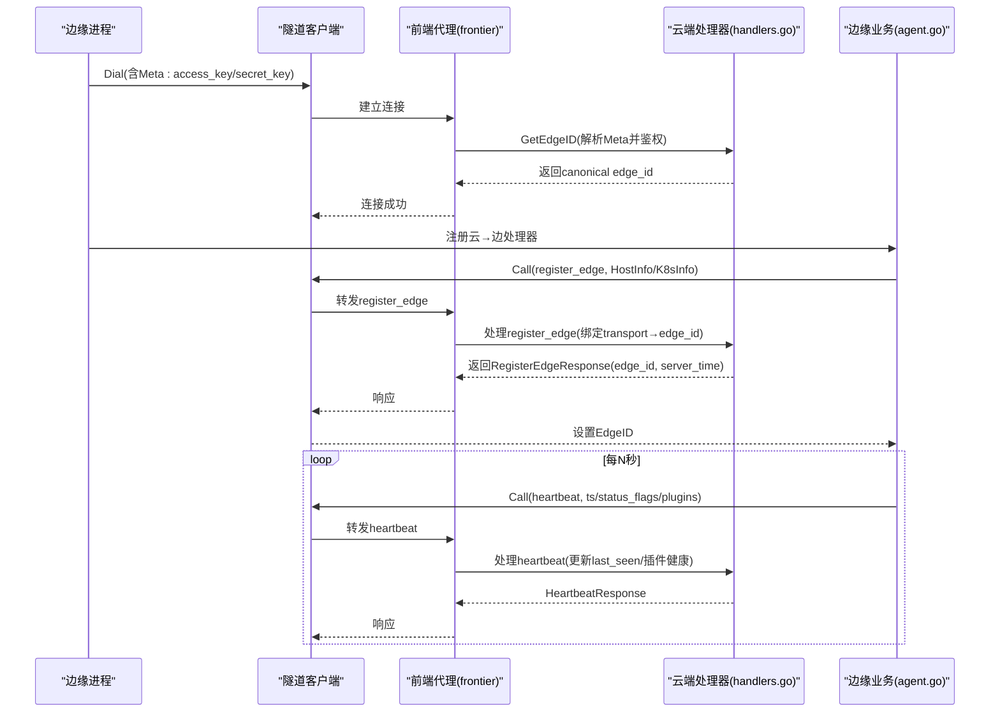
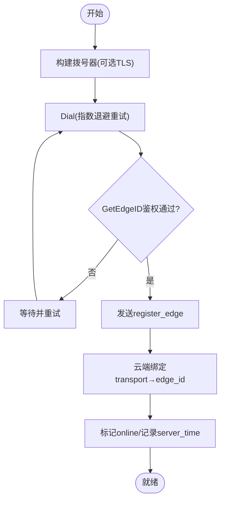
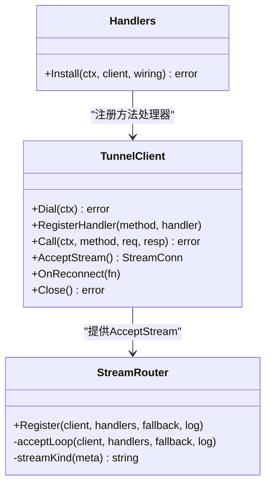
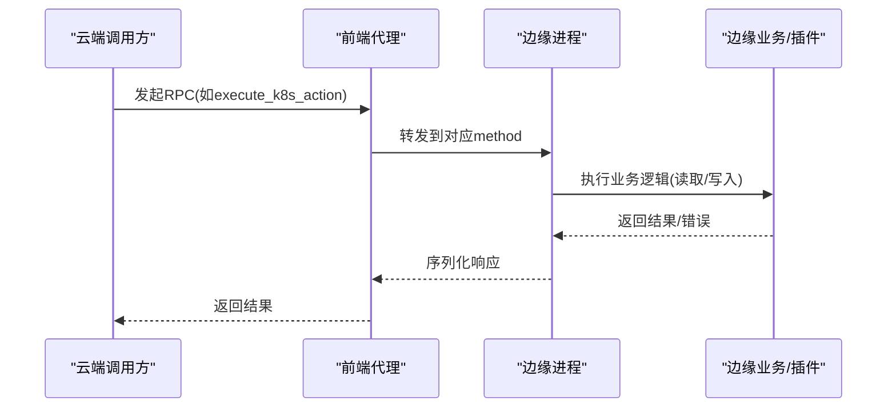
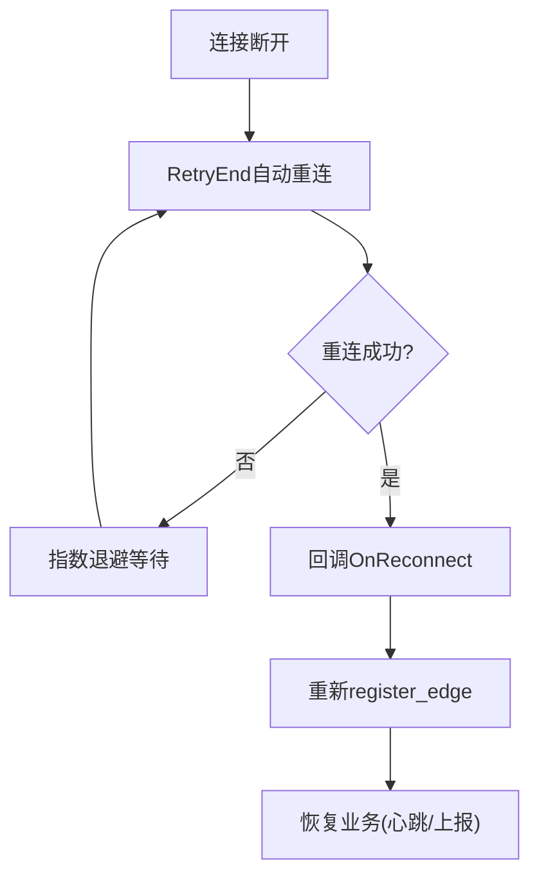
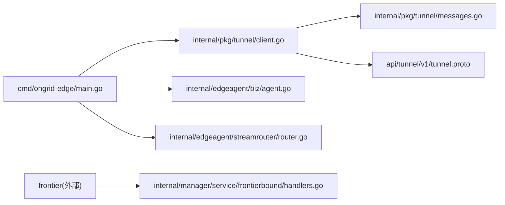

# WebSocket 隧道

<cite>
**本文引用的文件**   
- [tunnel.proto](file://api/tunnel/v1/tunnel.proto)
- [messages.go](file://internal/pkg/tunnel/messages.go)
- [client.go](file://internal/pkg/tunnel/client.go)
- [types.go](file://internal/pkg/tunnel/types.go)
- [router.go](file://internal/edgeagent/streamrouter/router.go)
- [handlers.go](file://internal/manager/service/frontierbound/handlers.go)
- [main.go（边缘端）](file://cmd/ongrid-edge/main.go)
- [agent.go（边缘业务）](file://internal/edgeagent/biz/agent.go)
</cite>

## 目录
1. [简介](#简介)
2. [项目结构](#项目结构)
3. [核心组件](#核心组件)
4. [架构总览](#架构总览)
5. [详细组件分析](#详细组件分析)
6. [依赖关系分析](#依赖关系分析)
7. [性能考量](#性能考量)
8. [故障排查指南](#故障排查指南)
9. [结论](#结论)
10. [附录](#附录)

## 简介
本文件面向 Edge 节点与云端之间的双向通信机制，系统化说明 WebSocket 隧道协议在连接建立、消息路由、会话管理、心跳检测、命令执行与结果返回等方面的设计与实现。文档覆盖连接生命周期管理、断线重连策略、负载均衡与故障转移、错误处理场景、性能监控指标，以及安全性、访问控制与审计日志等关键主题。

## 项目结构
该仓库将“隧道协议”以两层方式组织：
- 协议定义层：使用 protobuf 描述消息形状，并通过 JSON 编码在 wire 上传输（MVP 阶段）。
- 运行时实现层：Edge 侧提供客户端与流式通道；云端通过前端代理（frontier）暴露服务，并由 manager 的 frontierbound 层注册并处理各方法。

```mermaid
graph TB
subgraph "边缘端"
EMain["边缘进程<br/>cmd/ongrid-edge/main.go"]
ETun["隧道客户端<br/>internal/pkg/tunnel/client.go"]
EMesg["消息类型<br/>internal/pkg/tunnel/messages.go"]
ERouter["流分发器<br/>internal/edgeagent/streamrouter/router.go"]
EBiz["边缘业务编排<br/>internal/edgeagent/biz/agent.go"]
end
subgraph "云端"
F["前端代理<br/>frontier外部"]
FH["云端处理器<br/>internal/manager/service/frontierbound/handlers.go"]
end
EMain --> ETun
ETun --> EMesg
EMain --> ERouter
EMain --> EBiz
ETun < --> F
F --> FH
```

图表来源
- [main.go（边缘端）:136-230](file://cmd/ongrid-edge/main.go#L136-L230)
- [client.go:24-165](file://internal/pkg/tunnel/client.go#L24-L165)
- [messages.go:18-96](file://internal/pkg/tunnel/messages.go#L18-L96)
- [router.go:22-66](file://internal/edgeagent/streamrouter/router.go#L22-L66)
- [handlers.go:122-310](file://internal/manager/service/frontierbound/handlers.go#L122-L310)

章节来源
- [tunnel.proto:1-18](file://api/tunnel/v1/tunnel.proto#L1-L18)
- [messages.go:18-96](file://internal/pkg/tunnel/messages.go#L18-L96)
- [client.go:24-165](file://internal/pkg/tunnel/client.go#L24-L165)
- [router.go:22-66](file://internal/edgeagent/streamrouter/router.go#L22-L66)
- [handlers.go:122-310](file://internal/manager/service/frontierbound/handlers.go#L122-L310)
- [main.go（边缘端）:136-230](file://cmd/ongrid-edge/main.go#L136-L230)

## 核心组件
- 协议与消息体
  - 协议定义位于 api/tunnel/v1/tunnel.proto，声明了 edge↔cloud 的双向消息形状（如 register_edge、heartbeat、push_host_metrics、describe_k8s_resource、execute_k8s_action 等），并在 MVP 阶段以 JSON 传输。
  - internal/pkg/tunnel/messages.go 以 Go struct + JSON tag 镜像 proto 形状，保持内部包无 protobuf 依赖，便于未来切换二进制格式。
- 边缘侧隧道客户端
  - internal/pkg/tunnel/client.go 基于 geminio 实现带重试的长连接、自动重连、Call/RPC 封装、流 AcceptStream 能力，以及 OnReconnect 回调用于重注册。
- 边缘侧流分发器
  - internal/edgeagent/streamrouter/router.go 负责 AcceptStream 循环，按 Meta 中的 kind 分派到具体处理器（如 WebSSH、OperatorExec）。
- 云端处理器
  - internal/manager/service/frontierbound/handlers.go 注册所有方法处理器，完成鉴权、绑定 transport→canonical edge_id、持久化状态、转发至下游（指标、K8s、网络发现、插件配置等）。
- 边缘业务编排
  - internal/edgeagent/biz/agent.go 驱动心跳、指标上报、K8s 清单推送、插件健康上报，并在重连后重新 register_edge。

章节来源
- [tunnel.proto:15-524](file://api/tunnel/v1/tunnel.proto#L15-L524)
- [messages.go:18-932](file://internal/pkg/tunnel/messages.go#L18-L932)
- [client.go:24-458](file://internal/pkg/tunnel/client.go#L24-L458)
- [router.go:22-80](file://internal/edgeagent/streamrouter/router.go#L22-L80)
- [handlers.go:122-800](file://internal/manager/service/frontierbound/handlers.go#L122-L800)
- [agent.go:173-218](file://internal/edgeagent/biz/agent.go#L173-L218)

## 架构总览
整体采用“边缘主动出站到云端前端代理，云端管理器注册反向调用处理器”的模式。Edge 通过 TLS/TCP 建立连接，携带 access_key/secret_key 元数据；云端在 GetEdgeID 中校验身份并绑定 canonical edge_id。随后 Edge 发送 register_edge 完成设备注册与在线状态更新；周期性 heartbeat 维持活跃；各类 push/get RPC 承载遥测与控制面操作。



图表来源
- [client.go:81-165](file://internal/pkg/tunnel/client.go#L81-L165)
- [handlers.go:153-310](file://internal/manager/service/frontierbound/handlers.go#L153-L310)
- [agent.go:173-218](file://internal/edgeagent/biz/agent.go#L173-L218)

## 详细组件分析

### 连接建立与会话管理
- 连接建立
  - 边缘侧构建 dialer（支持可选 TLS CA），将 access_key/secret_key 序列化为 Meta 字节传入；底层 RetryEnd 负责失败重试与指数退避。
  - 云端 GetEdgeID 解析 Meta 并调用 EdgeAuthenticator 鉴权，成功后绑定 transport ID 到 canonical edge_id。
- 会话管理
  - register_edge 完成后，云端记录 edge 在线状态，并处理 K8s 控制器/节点角色信息；后续 heartbeat 持续刷新 last_seen。
  - 断线时，RetryEnd 自动重连；OnReconnect 回调触发边缘业务重新 register_edge，恢复云端绑定。



图表来源
- [client.go:81-165](file://internal/pkg/tunnel/client.go#L81-L165)
- [handlers.go:153-310](file://internal/manager/service/frontierbound/handlers.go#L153-L310)

章节来源
- [client.go:81-165](file://internal/pkg/tunnel/client.go#L81-L165)
- [handlers.go:153-310](file://internal/manager/service/frontierbound/handlers.go#L153-L310)
- [agent.go:173-218](file://internal/edgeagent/biz/agent.go#L173-L218)

### 心跳检测与健康上报
- 心跳频率由边缘业务周期触发，携带时间戳、可选状态位与插件健康快照。
- 云端处理器更新 last_seen，并合并插件健康信息供 UI/告警使用。
- 连续失败达到阈值会触发“隧道卡死”保护，促使进程退出以便系统重启恢复。

```mermaid
sequenceDiagram
participant Biz as "边缘业务"
participant Tun as "隧道客户端"
participant Front as "前端代理"
participant Mgr as "云端处理器"
Biz->>Tun : Call(heartbeat, {ts,status_flags,plugins})
Tun->>Front : 转发
Front->>Mgr : 处理heartbeat
Mgr->>Mgr : 更新last_seen/记录插件健康
Mgr-->>Front : HeartbeatResponse
Front-->>Tun : 响应
Note over Biz,Tun : 失败计数递增; 达到阈值则终止并触发重启
```

图表来源
- [agent.go:560-606](file://internal/edgeagent/biz/agent.go#L560-L606)
- [handlers.go:312-378](file://internal/manager/service/frontierbound/handlers.go#L312-L378)

章节来源
- [agent.go:560-606](file://internal/edgeagent/biz/agent.go#L560-L606)
- [handlers.go:312-378](file://internal/manager/service/frontierbound/handlers.go#L312-L378)

### 消息路由与流通道
- 方法级路由：云端 handlers.go 为每个 method 注册处理器，统一解码请求、鉴权、路由到下游服务。
- 流式通道：AcceptStream 用于双向流（如 WebSSH），streamrouter 根据 stream.Meta 中的 kind 选择处理器，未匹配则关闭流。



图表来源
- [types.go:68-119](file://internal/pkg/tunnel/types.go#L68-L119)
- [router.go:22-80](file://internal/edgeagent/streamrouter/router.go#L22-L80)
- [handlers.go:122-310](file://internal/manager/service/frontierbound/handlers.go#L122-L310)

章节来源
- [types.go:68-119](file://internal/pkg/tunnel/types.go#L68-L119)
- [router.go:22-80](file://internal/edgeagent/streamrouter/router.go#L22-L80)
- [handlers.go:122-310](file://internal/manager/service/frontierbound/handlers.go#L122-L310)

### 命令执行流程与结果返回
- 读操作（如 describe_k8s_resource、get_host_load、get_process_list、get_netstat）：云端→边缘，边缘采集或查询本地资源后返回结果。
- 写操作（如 execute_k8s_action）：云端→边缘，边缘执行变更并返回预检查、结果版本、统计信息等。
- 批量上报（push_host_metrics、push_prom_samples、push_network_discovery、push_k8s_inventory）：边缘→云端，云端去重/校验后落库或转发。



图表来源
- [messages.go:655-795](file://internal/pkg/tunnel/messages.go#L655-L795)
- [handlers.go:380-568](file://internal/manager/service/frontierbound/handlers.go#L380-L568)

章节来源
- [messages.go:655-795](file://internal/pkg/tunnel/messages.go#L655-L795)
- [handlers.go:380-568](file://internal/manager/service/frontierbound/handlers.go#L380-L568)

### 连接生命周期管理与断线重连
- 指数退避重连：Dial 阶段从 1s 起指数增长，上限 60s，直到成功或被取消。
- 透明重连：底层 RetryEnd 维护连接；发生断开时自动重建，并回调 OnReconnect。
- 重注册：OnReconnect 触发边缘业务重新 register_edge，确保云端绑定 canonical edge_id。
- 坏路由回收：当检测到特定错误（如 no such rpc/mismatch clientID/register not found）时，主动关闭旧连接，触发单一重连避免并发竞争。



图表来源
- [client.go:81-165](file://internal/pkg/tunnel/client.go#L81-L165)
- [client.go:322-361](file://internal/pkg/tunnel/client.go#L322-L361)
- [agent.go:173-218](file://internal/edgeagent/biz/agent.go#L173-L218)

章节来源
- [client.go:81-165](file://internal/pkg/tunnel/client.go#L81-L165)
- [client.go:322-361](file://internal/pkg/tunnel/client.go#L322-L361)
- [agent.go:173-218](file://internal/edgeagent/biz/agent.go#L173-L218)

### 负载均衡与故障转移
- 负载均衡：当前实现为单路长连接（Edge→Frontier），不涉及多实例负载分担。若需水平扩展，可在前端代理层做多后端接入，Edge 侧仍维持单连接。
- 故障转移：通过 RetryEnd 的自动重连与 OnReconnect 重注册实现；云端离线时边缘持续重试，恢复后自动续传。

章节来源
- [client.go:81-165](file://internal/pkg/tunnel/client.go#L81-L165)
- [handlers.go:188-243](file://internal/manager/service/frontierbound/handlers.go#L188-L243)

### 安全与访问控制
- 传输安全：支持可选 TLS CA 校验，最小 TLS 版本限制。
- 身份认证：连接时 Meta 携带 access_key/secret_key，云端 GetEdgeID 鉴权通过后绑定 canonical edge_id。
- 权限边界：write 类操作（如 execute_k8s_action）需经过审批与审计；敏感字段（如插件密钥）仅在受控通道内传输，不落盘。
- 审计日志：云端处理器对关键事件（上线/下线、注册、心跳、指标入库、K8s 动作）均有日志记录，便于审计追踪。

章节来源
- [client.go:167-206](file://internal/pkg/tunnel/client.go#L167-L206)
- [handlers.go:153-310](file://internal/manager/service/frontierbound/handlers.go#L153-L310)
- [messages.go:213-241](file://internal/pkg/tunnel/messages.go#L213-L241)

### 性能监控指标
- 边缘侧 /metrics（端口 :9101）暴露进程指标，便于观察运行状态。
- 云端可基于 last_seen、accepted 计数、插件健康等指标评估链路质量与吞吐。
- 建议关注：
  - 心跳成功率与延迟
  - 指标批接受率（accepted/点数）
  - 重连次数与间隔
  - 插件健康状态与目标级采样成功率

章节来源
- [main.go（边缘端）:282-290](file://cmd/ongrid-edge/main.go#L282-L290)
- [handlers.go:429-568](file://internal/manager/service/frontierbound/handlers.go#L429-L568)

## 依赖关系分析
- 边缘侧
  - cmd/ongrid-edge/main.go 组装 collector、插件、streamrouter、agent，并启动 tunnel client。
  - internal/pkg/tunnel/* 提供协议抽象与客户端实现。
  - internal/edgeagent/biz/agent.go 编排心跳、指标、K8s 清单与插件健康。
- 云端侧
  - internal/manager/service/frontierbound/handlers.go 注册所有方法处理器，对接指标、K8s、网络发现、插件配置等下游。



图表来源
- [main.go（边缘端）:136-230](file://cmd/ongrid-edge/main.go#L136-L230)
- [client.go:24-165](file://internal/pkg/tunnel/client.go#L24-L165)
- [messages.go:18-96](file://internal/pkg/tunnel/messages.go#L18-L96)
- [handlers.go:122-310](file://internal/manager/service/frontierbound/handlers.go#L122-L310)

章节来源
- [main.go（边缘端）:136-230](file://cmd/ongrid-edge/main.go#L136-L230)
- [client.go:24-165](file://internal/pkg/tunnel/client.go#L24-L165)
- [messages.go:18-96](file://internal/pkg/tunnel/messages.go#L18-L96)
- [handlers.go:122-310](file://internal/manager/service/frontierbound/handlers.go#L122-L310)

## 性能考量
- 批量化上报：host metrics、Prom samples、K8s inventory 均采用批量提交，降低往返开销。
- 去重与拒收：服务端对重复/无效数据进行去重或拒绝，减少存储压力。
- 超时与限流：Call 使用 context 控制超时；部分路径有样本数/字节数限制。
- 插件健康：心跳附带插件健康，帮助快速定位异常，避免静默失败影响吞吐。

章节来源
- [messages.go:379-435](file://internal/pkg/tunnel/messages.go#L379-L435)
- [messages.go:524-653](file://internal/pkg/tunnel/messages.go#L524-L653)
- [handlers.go:429-568](file://internal/manager/service/frontierbound/handlers.go#L429-L568)

## 故障排查指南
- 连接失败
  - 检查 TLS CA 配置与证书有效性；确认 ServerAddr/CloudAddr 可达。
  - 查看 Dial 日志中的 backoff 与错误信息。
- 鉴权失败
  - 确认 access_key/secret_key 正确；云端 GetEdgeID 会记录鉴权失败。
- 心跳失败
  - 连续失败超过阈值会触发“隧道卡死”，进程退出由系统重启恢复；检查云端是否在线、网络是否稳定。
- 指标未入库
  - 检查 device_id 是否已解析（register_edge 后才会建立关联）；若未解析，批次会被丢弃并返回 accepted=0。
- 流通道问题
  - streamrouter 遇到未知 kind 会关闭流；检查 Meta 是否正确传递。

章节来源
- [client.go:81-165](file://internal/pkg/tunnel/client.go#L81-L165)
- [handlers.go:153-310](file://internal/manager/service/frontierbound/handlers.go#L153-L310)
- [agent.go:560-606](file://internal/edgeagent/biz/agent.go#L560-L606)
- [router.go:22-80](file://internal/edgeagent/streamrouter/router.go#L22-L80)

## 结论
该 WebSocket 隧道通过简洁的 JSON 消息与稳定的长连接机制，实现了 Edge 与云端之间的高效双向通信。其设计重点在于：
- 明确的连接生命周期与重连策略，保证高可用
- 清晰的消息路由与流通道，支撑多种能力（遥测、诊断、控制）
- 完善的安全与审计机制，保障可控与可追溯
- 可扩展的插件与 K8s 集成，满足多样化运维场景

## 附录

### 消息与方法速览
- 连接与心跳
  - register_edge：首次注册/重连，携带 HostInfo、AgentVersion、Kubernetes 信息
  - heartbeat：周期性保活，携带时间戳、状态位、插件健康
- 遥测上报
  - push_host_metrics：主机指标点批量上报
  - push_prom_samples：开放集指标样本上报
  - push_network_discovery：网络邻居发现候选上报
  - push_k8s_inventory：K8s 对象快照上报
- 查询与诊断
  - get_host_load：实时主机负载
  - get_process_list：进程 Top-N
  - get_netstat：网络套接字快照
  - describe_k8s_resource：只读 K8s 资源描述
  - query_k8s_logs：K8s Pod 日志兜底查询
- 控制与执行
  - execute_k8s_action：K8s 写动作（重启、扩缩容、驱逐、排空等）
- 插件与升级
  - get_plugin_configs / plugin_configs_changed：插件配置拉取与变更通知
  - get_plugin_secret / report_plugin_config_applied：插件密钥获取与应用确认
  - agent_upgrade / fetch_package / apply_package：边缘代理升级流程
- 流通道
  - shell_open / shell_input / shell_resize / shell_close / shell_output / shell_exit：WebSSH 会话

章节来源
- [messages.go:18-932](file://internal/pkg/tunnel/messages.go#L18-L932)
- [tunnel.proto:15-524](file://api/tunnel/v1/tunnel.proto#L15-L524)