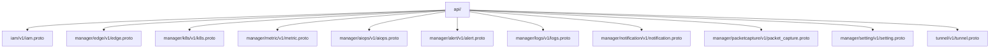
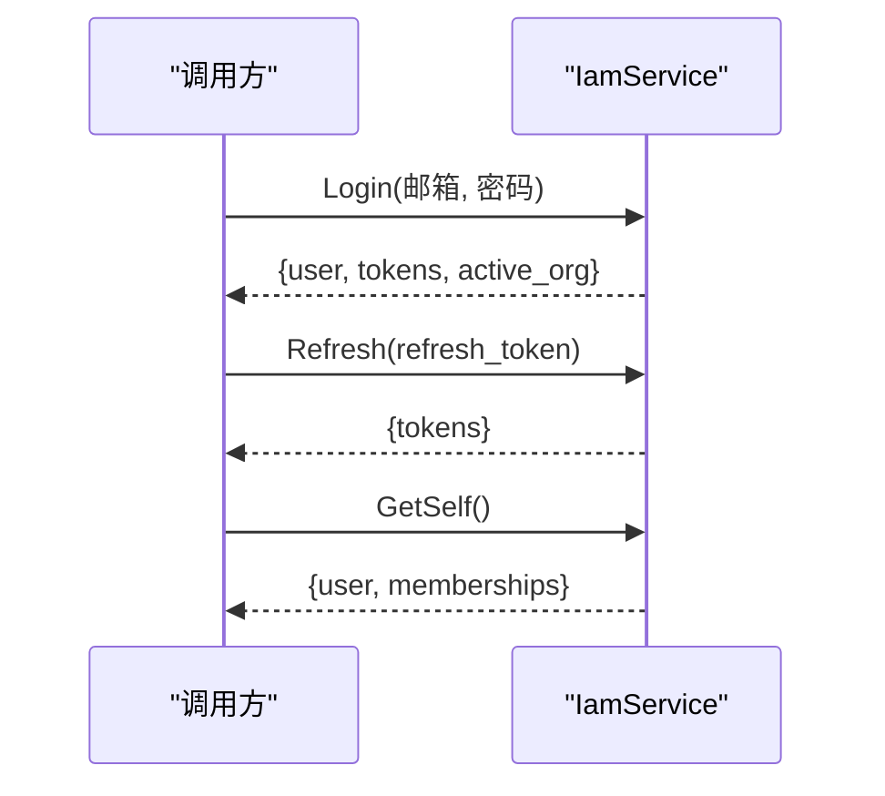
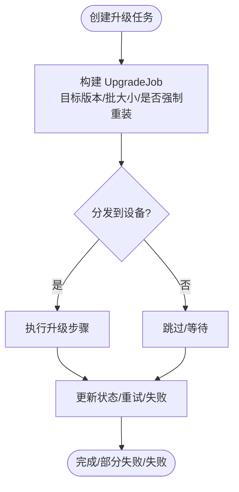
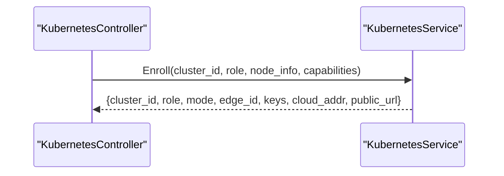
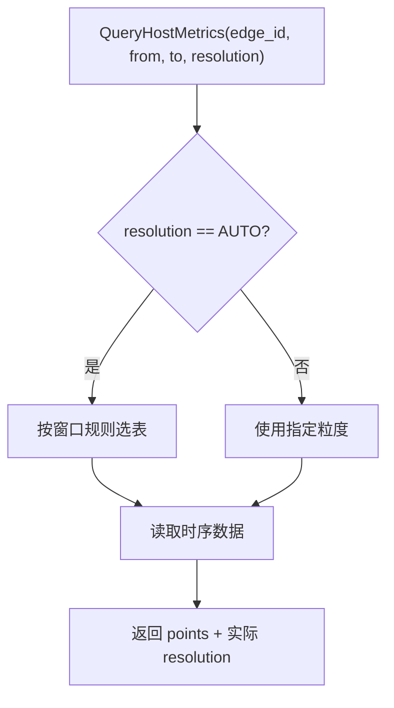
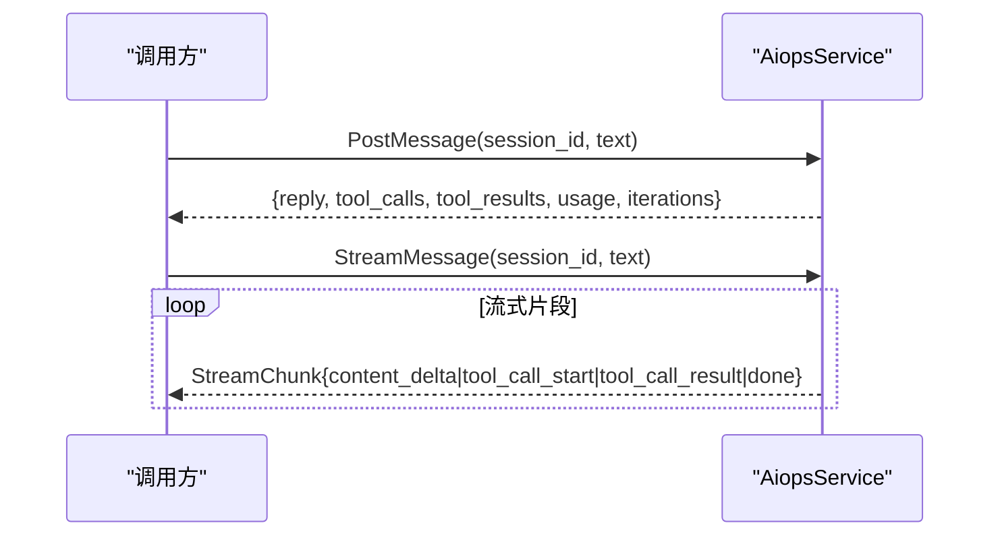
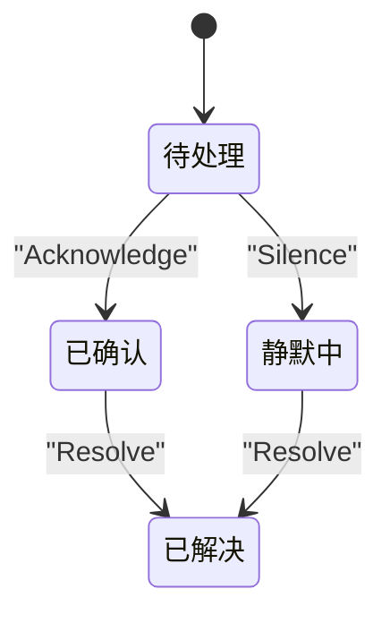
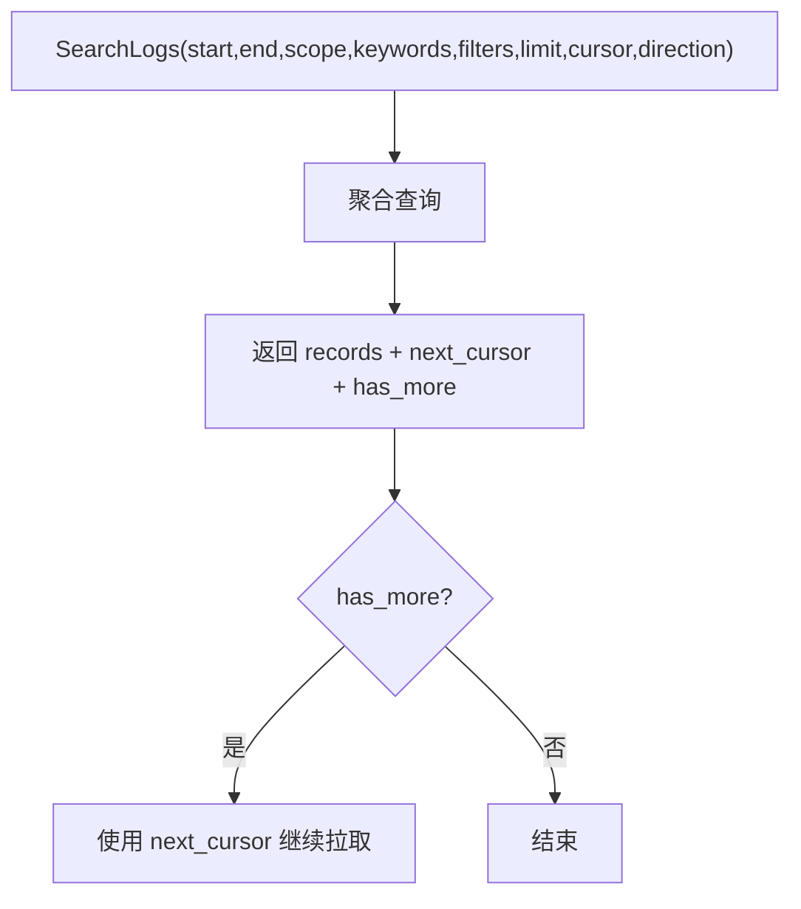
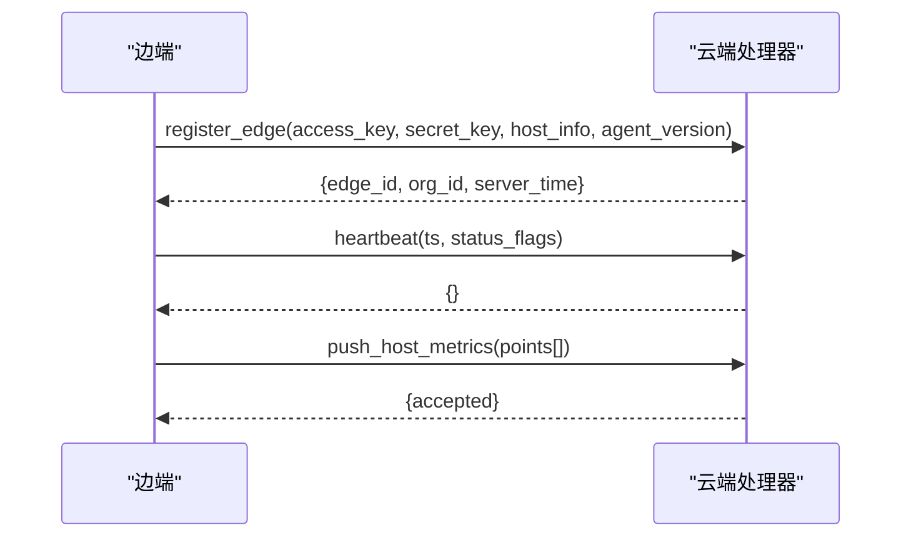
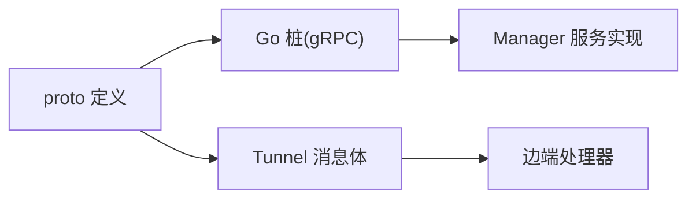

# gRPC 接口

<cite>
**本文引用的文件**
- [api/README.md](file://api/README.md)
- [api/buf.yaml](file://api/buf.yaml)
- [api/buf.gen.yaml](file://api/buf.gen.yaml)
- [api/iam/v1/iam.proto](file://api/iam/v1/iam.proto)
- [api/manager/edge/v1/edge.proto](file://api/manager/edge/v1/edge.proto)
- [api/manager/k8s/v1/k8s.proto](file://api/manager/k8s/v1/k8s.proto)
- [api/manager/metric/v1/metric.proto](file://api/manager/metric/v1/metric.proto)
- [api/manager/aiops/v1/aiops.proto](file://api/manager/aiops/v1/aiops.proto)
- [api/manager/alert/v1/alert.proto](file://api/manager/alert/v1/alert.proto)
- [api/manager/logs/v1/logs.proto](file://api/manager/logs/v1/logs.proto)
- [api/manager/notification/v1/notification.proto](file://api/manager/notification/v1/notification.proto)
- [api/manager/packetcapture/v1/packet_capture.proto](file://api/manager/packetcapture/v1/packet_capture.proto)
- [api/manager/setting/v1/setting.proto](file://api/manager/setting/v1/setting.proto)
- [api/tunnel/v1/tunnel.proto](file://api/tunnel/v1/tunnel.proto)
</cite>

## 目录
1. [简介](#简介)
2. [项目结构](#项目结构)
3. [核心组件](#核心组件)
4. [架构总览](#架构总览)
5. [详细组件分析](#详细组件分析)
6. [依赖关系分析](#依赖关系分析)
7. [性能与调优](#性能与调优)
8. [故障排查指南](#故障排查指南)
9. [结论](#结论)
10. [附录](#附录)

## 简介
本文件面向内部服务间通信的 gRPC 接口协议，基于仓库中的 Protobuf 定义进行系统化说明。内容涵盖：
- RPC 方法签名、消息类型与服务发现约定
- Protobuf 文件组织、包命名与版本管理策略
- 连接建立、流式通信、错误处理与超时控制建议
- 客户端实现要点、服务端配置与性能调优
- 与 REST API 的集成方式与互操作性考虑

本项目采用“单一事实来源”的 proto 契约，REST 路由由手写代码生成；MVP 阶段未使用 grpc-gateway，但所有对外/对内接口均以 proto 为权威定义。

**章节来源**
- [api/README.md:1-42](file://api/README.md#L1-L42)

## 项目结构
Proto 文件按业务域分层组织，统一遵循包命名与版本化规范：
- 包命名：ongrid.<bc>[.<subdomain>].v<major>
- go_package：指向 gen/<path>/v1 下的 Go 包名
- 每个服务的消息集中在单个 .proto 文件中，便于演进与维护
- 通过 buf 进行 lint、breaking-change 检测与代码生成



**图表来源**
- [api/README.md:6-20](file://api/README.md#L6-L20)

**章节来源**
- [api/README.md:6-42](file://api/README.md#L6-L42)
- [api/buf.yaml:1-10](file://api/buf.yaml#L1-L10)
- [api/buf.gen.yaml:1-12](file://api/buf.gen.yaml#L1-L12)

## 核心组件
以下服务构成内部通信的核心面：
- IAM：身份认证与会话（注册、登录、刷新、组织与成员）
- Edge：边缘设备生命周期、批量安装与升级任务
- Kubernetes：集群纳管、节点/工作负载/事件查询与健康检查
- Metric：主机指标查询（只读）
- AIOPS：对话会话与 Agent 流式交互
- Alert：告警事件生命周期管理
- Logs：日志检索、字段/直方图/上下文与后端管理
- Notification：通知渠道管理
- PacketCapture：抓包任务与结果访问
- Setting：LLM 集成配置校验与保存
- Tunnel：边云隧道消息体（非 gRPC，JSON 承载）

这些服务在 manager 域内提供统一的 gRPC 能力，IAM 与 tunnel 分别承担鉴权与边云通道职责。

**章节来源**
- [api/iam/v1/iam.proto:9-42](file://api/iam/v1/iam.proto#L9-L42)
- [api/manager/edge/v1/edge.proto:10-61](file://api/manager/edge/v1/edge.proto#L10-L61)
- [api/manager/k8s/v1/k8s.proto:9-27](file://api/manager/k8s/v1/k8s.proto#L9-L27)
- [api/manager/metric/v1/metric.proto:9-17](file://api/manager/metric/v1/metric.proto#L9-L17)
- [api/manager/aiops/v1/aiops.proto:9-29](file://api/manager/aiops/v1/aiops.proto#L9-L29)
- [api/manager/alert/v1/alert.proto:9-14](file://api/manager/alert/v1/alert.proto#L9-L14)
- [api/manager/logs/v1/logs.proto:9-25](file://api/manager/logs/v1/logs.proto#L9-L25)
- [api/manager/notification/v1/notification.proto:10-17](file://api/manager/notification/v1/notification.proto#L10-L17)
- [api/manager/packetcapture/v1/packet_capture.proto:9-26](file://api/manager/packetcapture/v1/packet_capture.proto#L9-L26)
- [api/manager/setting/v1/setting.proto:7-17](file://api/manager/setting/v1/setting.proto#L7-L17)
- [api/tunnel/v1/tunnel.proto:1-18](file://api/tunnel/v1/tunnel.proto#L1-L18)

## 架构总览
整体通信分为两类：
- 服务间 gRPC：manager 域各服务以 gRPC 暴露能力，IAM 负责鉴权上下文注入，AIOPS 提供流式响应
- 边云隧道：tunnel 消息通过 geminio 隧道传输（MVP 使用 JSON），用于设备注册、心跳、指标上报、K8s 资源同步与操作等

```mermaid
graph TB
subgraph "Manager 服务"
IAM["IamService"]
EDGE["EdgeService"]
K8S["KubernetesService"]
METRIC["MetricService"]
AIOPS["AiopsService"]
ALERT["AlertService"]
LOGS["LogsService"]
NOTIF["NotificationService"]
PCAP["PacketCaptureService"]
SETTING["SettingService"]
end
subgraph "边端"
TUNNEL["Tunnel Messages<br/>geminio 隧道(JSON)"]
end
IAM --> EDGE
IAM --> K8S
IAM --> METRIC
IAM --> AIOPS
IAM --> ALERT
IAM --> LOGS
IAM --> NOTIF
IAM --> PCAP
IAM --> SETTING
EDGE < --> TUNNEL
K8S < --> TUNNEL
METRIC < --> TUNNEL
```

**图表来源**
- [api/iam/v1/iam.proto:9-42](file://api/iam/v1/iam.proto#L9-L42)
- [api/manager/edge/v1/edge.proto:10-61](file://api/manager/edge/v1/edge.proto#L10-L61)
- [api/manager/k8s/v1/k8s.proto:9-27](file://api/manager/k8s/v1/k8s.proto#L9-L27)
- [api/manager/metric/v1/metric.proto:9-17](file://api/manager/metric/v1/metric.proto#L9-L17)
- [api/manager/aiops/v1/aiops.proto:9-29](file://api/manager/aiops/v1/aiops.proto#L9-L29)
- [api/manager/alert/v1/alert.proto:9-14](file://api/manager/alert/v1/alert.proto#L9-L14)
- [api/manager/logs/v1/logs.proto:9-25](file://api/manager/logs/v1/logs.proto#L9-L25)
- [api/manager/notification/v1/notification.proto:10-17](file://api/manager/notification/v1/notification.proto#L10-L17)
- [api/manager/packetcapture/v1/packet_capture.proto:9-26](file://api/manager/packetcapture/v1/packet_capture.proto#L9-L26)
- [api/manager/setting/v1/setting.proto:7-17](file://api/manager/setting/v1/setting.proto#L7-L17)
- [api/tunnel/v1/tunnel.proto:1-18](file://api/tunnel/v1/tunnel.proto#L1-L18)

## 详细组件分析

### IAM 服务（身份与会话）
- 主要能力：注册、登录、刷新令牌、获取当前用户、组织与成员管理、切换组织
- 安全约定：org_id/user_id 不来自请求体，由 JWT claims 与 URL path 经中间件注入
- 典型流程：登录成功后返回 access/refresh token，后续请求携带 access token



**图表来源**
- [api/iam/v1/iam.proto:9-42](file://api/iam/v1/iam.proto#L9-L42)

**章节来源**
- [api/iam/v1/iam.proto:9-171](file://api/iam/v1/iam.proto#L9-L171)

### Edge 服务（边缘设备管理）
- 主要能力：创建/列表/详情/删除设备、密钥轮换、批量安装配置、升级任务
- 安全约定：org_id 从 URL path 与 JWT claims 取，不在请求体中
- 关键数据：Edge、EnrollmentProfile、UpgradeJob/Item



**图表来源**
- [api/manager/edge/v1/edge.proto:10-61](file://api/manager/edge/v1/edge.proto#L10-L61)
- [api/manager/edge/v1/edge.proto:232-316](file://api/manager/edge/v1/edge.proto#L232-L316)

**章节来源**
- [api/manager/edge/v1/edge.proto:10-317](file://api/manager/edge/v1/edge.proto#L10-L317)

### Kubernetes 服务（集群纳管）
- 主要能力：集群创建/健康检查/节点/工作负载/Pod/事件查询、边缘挂载、引导 Token 轮换、删除集群
- 内部引导：Enroll 使用一次性集群引导 Token 而非用户 JWT



**图表来源**
- [api/manager/k8s/v1/k8s.proto:9-27](file://api/manager/k8s/v1/k8s.proto#L9-L27)
- [api/manager/k8s/v1/k8s.proto:369-390](file://api/manager/k8s/v1/k8s.proto#L369-L390)

**章节来源**
- [api/manager/k8s/v1/k8s.proto:9-391](file://api/manager/k8s/v1/k8s.proto#L9-L391)

### Metric 服务（主机指标查询）
- 主要能力：按时间窗口查询主机指标点，支持自动粒度选择（RAW/M5/H1）
- 注意：写入路径由 edge tunnel push_host_metrics + Ingester 处理，不通过此 service



**图表来源**
- [api/manager/metric/v1/metric.proto:9-17](file://api/manager/metric/v1/metric.proto#L9-L17)
- [api/manager/metric/v1/metric.proto:19-55](file://api/manager/metric/v1/metric.proto#L19-L55)

**章节来源**
- [api/manager/metric/v1/metric.proto:9-55](file://api/manager/metric/v1/metric.proto#L9-L55)

### AIOPS 服务（对话与流式 Agent）
- 主要能力：创建/列出会话、发送消息（阻塞或流式）、历史消息查询
- 流式语义：StreamMessage 以 StreamChunk 推送文本片段、工具调用开始/结果、完成信号



**图表来源**
- [api/manager/aiops/v1/aiops.proto:9-29](file://api/manager/aiops/v1/aiops.proto#L9-L29)
- [api/manager/aiops/v1/aiops.proto:128-158](file://api/manager/aiops/v1/aiops.proto#L128-L158)

**章节来源**
- [api/manager/aiops/v1/aiops.proto:9-170](file://api/manager/aiops/v1/aiops.proto#L9-L170)

### Alert 服务（告警事件）
- 主要能力：事件列表、详情、确认、解决
- 状态机：open → acknowledged/silenced → resolved



**图表来源**
- [api/manager/alert/v1/alert.proto:9-14](file://api/manager/alert/v1/alert.proto#L9-L14)
- [api/manager/alert/v1/alert.proto:16-29](file://api/manager/alert/v1/alert.proto#L16-L29)

**章节来源**
- [api/manager/alert/v1/alert.proto:9-88](file://api/manager/alert/v1/alert.proto#L9-L88)

### Logs 服务（日志检索与后端管理）
- 主要能力：搜索日志、字段/值/直方图/上下文、后端配置与连通性检查、选择 Loki
- 分页游标：SearchLogsResponse 包含 next_cursor 与 has_more



**图表来源**
- [api/manager/logs/v1/logs.proto:9-25](file://api/manager/logs/v1/logs.proto#L9-L25)
- [api/manager/logs/v1/logs.proto:76-114](file://api/manager/logs/v1/logs.proto#L76-L114)

**章节来源**
- [api/manager/logs/v1/logs.proto:9-346](file://api/manager/logs/v1/logs.proto#L9-L346)

### Notification 服务（通知渠道）
- 主要能力：渠道 CRUD、测试发送
- 类型：Webhook、Slack、飞书、钉钉

**章节来源**
- [api/manager/notification/v1/notification.proto:10-91](file://api/manager/notification/v1/notification.proto#L10-L91)

### PacketCapture 服务（抓包）
- 主要能力：预检、创建抓包、状态查询、结果与数据包访问、会话管理
- 状态丰富：pending_approval → queued → dispatching → capturing → uploading → parsing → ready → expired/deleted

**章节来源**
- [api/manager/packetcapture/v1/packet_capture.proto:9-347](file://api/manager/packetcapture/v1/packet_capture.proto#L9-L347)

### Setting 服务（LLM 配置）
- 主要能力：校验草稿配置、原子保存全部模型配置
- 行为：空 api_key 表示显式禁用某提供商

**章节来源**
- [api/manager/setting/v1/setting.proto:7-72](file://api/manager/setting/v1/setting.proto#L7-L72)

### Tunnel 消息（边云通道）
- 说明：非 gRPC 服务，消息通过 geminio 隧道传输，MVP 使用 JSON 编码
- 场景：设备注册、心跳、指标上报、K8s 清单同步、描述资源、Pod 日志、写动作、网络发现、SNMP 探测



**图表来源**
- [api/tunnel/v1/tunnel.proto:1-18](file://api/tunnel/v1/tunnel.proto#L1-L18)
- [api/tunnel/v1/tunnel.proto:73-117](file://api/tunnel/v1/tunnel.proto#L73-L117)

**章节来源**
- [api/tunnel/v1/tunnel.proto:1-524](file://api/tunnel/v1/tunnel.proto#L1-L524)

## 依赖关系分析
- 包与版本：所有服务遵循 ongrid.*.v1 包命名，go_package 指向 gen 下对应 v1 包
- 代码生成：buf 插件生成 Go 与 gRPC 桩，要求实现未实现的服务器
- 跨域耦合：tunnel 刻意复制 HostInfo/HostMetricPoint，避免与 manager 包强耦合，提升独立演进能力



**图表来源**
- [api/buf.gen.yaml:1-12](file://api/buf.gen.yaml#L1-L12)
- [api/README.md:22-32](file://api/README.md#L22-L32)
- [api/tunnel/v1/tunnel.proto:15-42](file://api/tunnel/v1/tunnel.proto#L15-L42)

**章节来源**
- [api/buf.yaml:1-10](file://api/buf.yaml#L1-L10)
- [api/buf.gen.yaml:1-12](file://api/buf.gen.yaml#L1-L12)
- [api/README.md:22-42](file://api/README.md#L22-L42)

## 性能与调优
- 流式通信：AIOPS 的 StreamMessage 适合前端 SSE/WebSocket 展示增量输出，降低首屏延迟
- 指标粒度：Metric 的 Resolution.AUTO 按窗口自动选择 RAW/M5/H1，减少大窗口查询压力
- 日志分页：Logs 使用 cursor 分页，避免全量加载；合理设置 limit/direction
- 批处理：Edge 升级任务支持 batch_size/current_batch/total_batches，建议根据设备规模调整批次
- 连接复用：gRPC 默认 HTTP/2 多路复用，建议复用连接并设置合理的 KeepAlive
- 超时控制：对长耗时 RPC（如升级、日志搜索、Agent 循环）设置服务端与客户端超时，避免悬挂请求
- 背压与限流：对高吞吐指标上报（push_host_metrics）在服务端做去重与限流，避免落库抖动
- 缓存策略：对热点只读数据（如集群健康摘要、节点列表）可引入短 TTL 缓存

[本节为通用指导，无需特定文件引用]

## 故障排查指南
- 鉴权问题：确保 org_id/user_id 由中间件注入，不要在请求体中传递；检查 JWT 有效性与组织绑定
- 流式中断：AIOPS 流式响应需处理 stream 关闭与错误码；前端应实现重连与退避
- 指标丢失：检查 edge 心跳与 push_host_metrics 成功率；关注 accepted 计数与去重逻辑
- 升级失败：查看 UpgradeJobItem 的 error_code/error_message 与 attempt 次数；必要时 RetryUpgradeJob
- 日志查询慢：缩小 scope/time window，使用字段过滤与关键词匹配；必要时切换到合适后端
- 抓包失败：通过 Preflight 检查能力与可用接口；关注 state 与 error_code/detail
- 通道异常：tunnel 消息需关注 register_edge/heartbeat 成功与否；云端侧记录 rejected/accepted 统计

**章节来源**
- [api/manager/edge/v1/edge.proto:232-316](file://api/manager/edge/v1/edge.proto#L232-L316)
- [api/manager/metric/v1/metric.proto:42-55](file://api/manager/metric/v1/metric.proto#L42-L55)
- [api/manager/logs/v1/logs.proto:76-114](file://api/manager/logs/v1/logs.proto#L76-L114)
- [api/manager/packetcapture/v1/packet_capture.proto:124-141](file://api/manager/packetcapture/v1/packet_capture.proto#L124-L141)
- [api/tunnel/v1/tunnel.proto:73-117](file://api/tunnel/v1/tunnel.proto#L73-L117)

## 结论
本项目的 gRPC 协议以 proto 为唯一契约，覆盖身份、设备、K8s、指标、日志、告警、通知、抓包与配置等核心能力。通过 buf 保障向后兼容与代码生成一致性；tunnel 作为边云通道解耦了实时数据与控制面。建议在实现中重视鉴权注入、流式响应、分页与批处理、超时与重试策略，以及性能监控与可观测性建设。

[本节为总结性内容，无需特定文件引用]

## 附录

### Protobuf 组织与版本管理
- 包命名：ongrid.<bc>[.<subdomain>].v<major>
- go_package：指向 github.com/.../api/gen/<path>/v1;<name>v1
- 每个服务一个 .proto 文件，消息集中管理
- 使用 buf lint 与 breaking 检测，CI 中强制执行

**章节来源**
- [api/README.md:22-42](file://api/README.md#L22-L42)
- [api/buf.yaml:1-10](file://api/buf.yaml#L1-L10)
- [api/buf.gen.yaml:1-12](file://api/buf.gen.yaml#L1-L12)

### 与 REST API 的集成与互操作性
- MVP 阶段不使用 grpc-gateway，REST 路由由手写代码基于 Go 类型实现
- 建议：如需外部系统直接调用，可在网关层将 REST 映射到 gRPC；保持 proto 为权威契约
- 鉴权：REST 与 gRPC 共享 JWT 与 org 隔离策略，确保一致的安全边界

**章节来源**
- [api/README.md:1-5](file://api/README.md#L1-L5)

### 客户端实现示例（要点）
- IAM：登录后保存 access/refresh token；过期时调用 Refresh；GetSelf 获取当前用户与组织
- Edge：CreateEdge 后妥善保存 SecretKey；批量升级使用 CreateUpgradeJob 并轮询状态
- K8s：使用 Enroll 完成集群引导；ListNodes/ListWorkloads/ListPods/ListEvents 进行巡检
- Metric：按窗口查询指标，AUTO 粒度适用于大屏展示
- AIOPS：PostMessage 用于后台批处理；StreamMessage 用于前端实时展示
- Logs：使用 SearchLogs 的 cursor 分页；结合 GetLogFields/GetLogFieldValues 优化查询
- PacketCapture：先 Preflight，再 Create；通过 List/Get 跟踪状态与结果
- Notification：CRUD 渠道并 TestChannel 验证连通性
- Setting：ValidateLLMConfiguration 预览失败原因；ValidateAndSave 原子保存

[本节为实践要点，无需特定文件引用]

### 服务端配置与部署建议
- 启用 require_unimplemented_servers=true，防止未实现的服务被误用
- 配置 gRPC 超时、KeepAlive、最大消息大小与并发限制
- 对长耗时 RPC 增加熔断与降级策略
- 对 tunnel 通道配置重试与指数退避，保证弱网稳定性

**章节来源**
- [api/buf.gen.yaml:7-12](file://api/buf.gen.yaml#L7-L12)