# 协议安全机制

<cite>
**本文引用的文件**
- [internal/pkg/auth/jwt.go](file://internal/pkg/auth/jwt.go)
- [internal/pkg/auth/middleware.go](file://internal/pkg/auth/middleware.go)
- [internal/pkg/authzmw/middleware.go](file://internal/pkg/authzmw/middleware.go)
- [internal/pkg/tenantctx/tenantctx.go](file://internal/pkg/tenantctx/tenantctx.go)
- [internal/pkg/httpserver/server.go](file://internal/pkg/httpserver/server.go)
- [internal/pkg/config/config.go](file://internal/pkg/config/config.go)
- [internal/pkg/secretbox/secretbox.go](file://internal/pkg/secretbox/secretbox.go)
- [internal/manager/model/audit/log.go](file://internal/manager/model/audit/log.go)
- [internal/manager/biz/audit/usecase.go](file://internal/manager/biz/audit/usecase.go)
- [internal/manager/data/edge/store/enrollment.go](file://internal/manager/data/edge/store/enrollment.go)
- [internal/manager/biz/edge/authcache.go](file://internal/manager/biz/edge/authcache.go)
- [internal/manager/biz/packetcapture/parser_client.go](file://internal/manager/biz/packetcapture/parser_client.go)
- [internal/manager/model/secret/model.go](file://internal/manager/model/secret/model.go)
- [internal/manager/biz/secret/usecase.go](file://internal/manager/biz/secret/usecase.go)
- [tests/e2e/settings_reveal_test.go](file://tests/e2e/settings_reveal_test.go)
</cite>

## 目录
1. [简介](#简介)
2. [项目结构](#项目结构)
3. [核心组件](#核心组件)
4. [架构总览](#架构总览)
5. [详细组件分析](#详细组件分析)
6. [依赖关系分析](#依赖关系分析)
7. [性能考量](#性能考量)
8. [故障排查指南](#故障排查指南)
9. [结论](#结论)
10. [附录](#附录)

## 简介
本文件面向通信协议与接口层的安全机制，覆盖身份认证、授权校验、传输加密、审计日志、敏感数据保护、防重放与输入验证等主题。重点说明：
- JWT 令牌签发与校验、中间件鉴权与安全上下文传递
- 基于角色的访问控制（RBAC）中间件与超级管理员短路策略
- 边端隧道与外部服务调用的 TLS 配置与证书校验
- 审计日志的写入、查询与合规用途
- 静态加密与输出脱敏，防止凭证泄露
- 防重放与请求签名（短时效票据）
- 多租户隔离与安全上下文传播
- 安全配置项、漏洞防护策略与最佳实践

## 项目结构
安全相关代码主要分布在以下模块：
- 认证与授权：JWT 签发/校验、HTTP 鉴权中间件、RBAC 授权中间件、租户上下文
- 传输与网络：HTTP Server 封装、边端隧道 TLS 配置、外部服务调用 TLS
- 审计与合规：审计模型与用例、操作记录与过滤
- 敏感数据：静态加密、列表/读取脱敏、测试断言
- 配置：环境变量驱动的安全参数（JWT TTL、TLS、密钥等）

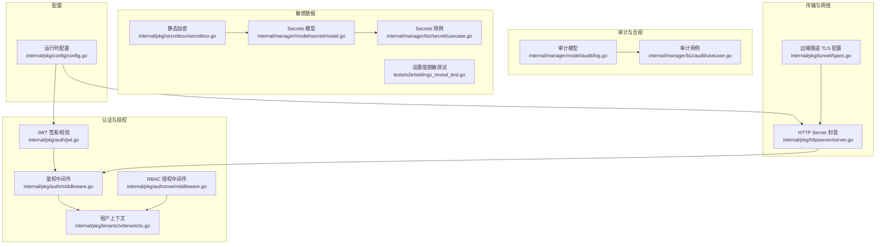

图表来源
- [internal/pkg/auth/jwt.go:1-100](file://internal/pkg/auth/jwt.go#L1-L100)
- [internal/pkg/auth/middleware.go:1-68](file://internal/pkg/auth/middleware.go#L1-L68)
- [internal/pkg/authzmw/middleware.go:1-98](file://internal/pkg/authzmw/middleware.go#L1-L98)
- [internal/pkg/tenantctx/tenantctx.go:1-87](file://internal/pkg/tenantctx/tenantctx.go#L1-L87)
- [internal/pkg/httpserver/server.go:1-60](file://internal/pkg/httpserver/server.go#L1-L60)
- [internal/pkg/config/config.go:417-549](file://internal/pkg/config/config.go#L417-L549)
- [internal/pkg/secretbox/secretbox.go:1-110](file://internal/pkg/secretbox/secretbox.go#L1-L110)
- [internal/manager/model/audit/log.go:49-76](file://internal/manager/model/audit/log.go#L49-L76)
- [internal/manager/biz/audit/usecase.go:118-147](file://internal/manager/biz/audit/usecase.go#L118-L147)
- [internal/manager/model/secret/model.go:32-45](file://internal/manager/model/secret/model.go#L32-L45)
- [internal/manager/biz/secret/usecase.go:1-43](file://internal/manager/biz/secret/usecase.go#L1-L43)
- [tests/e2e/settings_reveal_test.go:24-68](file://tests/e2e/settings_reveal_test.go#L24-L68)

章节来源
- [internal/pkg/auth/jwt.go:1-100](file://internal/pkg/auth/jwt.go#L1-L100)
- [internal/pkg/auth/middleware.go:1-68](file://internal/pkg/auth/middleware.go#L1-L68)
- [internal/pkg/authzmw/middleware.go:1-98](file://internal/pkg/authzmw/middleware.go#L1-L98)
- [internal/pkg/tenantctx/tenantctx.go:1-87](file://internal/pkg/tenantctx/tenantctx.go#L1-L87)
- [internal/pkg/httpserver/server.go:1-60](file://internal/pkg/httpserver/server.go#L1-L60)
- [internal/pkg/config/config.go:417-549](file://internal/pkg/config/config.go#L417-L549)
- [internal/pkg/secretbox/secretbox.go:1-110](file://internal/pkg/secretbox/secretbox.go#L1-L110)
- [internal/manager/model/audit/log.go:49-76](file://internal/manager/model/audit/log.go#L49-L76)
- [internal/manager/biz/audit/usecase.go:118-147](file://internal/manager/biz/audit/usecase.go#L118-L147)
- [internal/manager/model/secret/model.go:32-45](file://internal/manager/model/secret/model.go#L32-L45)
- [internal/manager/biz/secret/usecase.go:1-43](file://internal/manager/biz/secret/usecase.go#L1-L43)
- [tests/e2e/settings_reveal_test.go:24-68](file://tests/e2e/settings_reveal_test.go#L24-L68)

## 核心组件
- JWT 签发与校验：使用 HS256 对称签名，支持访问令牌与刷新令牌，包含标准声明与自定义字段；校验失败返回未授权错误。
- 鉴权中间件：从 Authorization 头或 WebSocket 查询参数提取令牌，校验后注入租户上下文（用户ID、邮箱、角色、是否超级管理员），供下游处理。
- RBAC 授权中间件：基于对象与动作的权限检查，超级管理员可短路放行；缺失租户上下文时拒绝；无授权器时兼容旧部署。
- 租户上下文：通过 context 在请求链路中传递身份与角色信息，并支持“可变槽”让外层中间件也能读取内层写入的身份。
- HTTP Server：封装 net/http.Server，提供优雅关闭与超时控制，便于统一生命周期管理。
- 静态加密：使用 AES-256-GCM 对敏感数据进行信封式加密，密钥由环境变量派生，支持版本前缀与向后兼容明文迁移。
- 审计日志：定义标准化动作枚举与状态，提供查询能力以支撑运维与合规需求。
- 配置：集中管理 JWT TTL、TLS、数据库、通知、告警等运行参数，确保关键安全参数可通过环境变量注入。

章节来源
- [internal/pkg/auth/jwt.go:16-99](file://internal/pkg/auth/jwt.go#L16-L99)
- [internal/pkg/auth/middleware.go:10-67](file://internal/pkg/auth/middleware.go#L10-L67)
- [internal/pkg/authzmw/middleware.go:1-98](file://internal/pkg/authzmw/middleware.go#L1-L98)
- [internal/pkg/tenantctx/tenantctx.go:13-86](file://internal/pkg/tenantctx/tenantctx.go#L13-L86)
- [internal/pkg/httpserver/server.go:13-59](file://internal/pkg/httpserver/server.go#L13-L59)
- [internal/pkg/secretbox/secretbox.go:1-110](file://internal/pkg/secretbox/secretbox.go#L1-L110)
- [internal/manager/model/audit/log.go:49-76](file://internal/manager/model/audit/log.go#L49-L76)
- [internal/manager/biz/audit/usecase.go:118-147](file://internal/manager/biz/audit/usecase.go#L118-L147)
- [internal/pkg/config/config.go:417-549](file://internal/pkg/config/config.go#L417-L549)

## 架构总览
下图展示了从客户端到业务处理的完整安全链路：鉴权中间件解析 JWT 并注入租户上下文，授权中间件进行 RBAC 校验，业务处理器执行具体逻辑，审计中间件记录变更，敏感数据在存储与输出侧进行加密与脱敏。

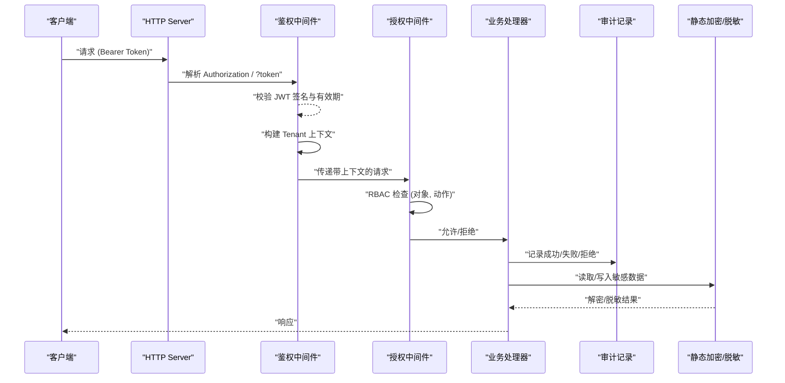

图表来源
- [internal/pkg/httpserver/server.go:13-59](file://internal/pkg/httpserver/server.go#L13-L59)
- [internal/pkg/auth/middleware.go:10-67](file://internal/pkg/auth/middleware.go#L10-L67)
- [internal/pkg/authzmw/middleware.go:57-98](file://internal/pkg/authzmw/middleware.go#L57-L98)
- [internal/manager/model/audit/log.go:49-76](file://internal/manager/model/audit/log.go#L49-L76)
- [internal/pkg/secretbox/secretbox.go:53-109](file://internal/pkg/secretbox/secretbox.go#L53-L109)

## 详细组件分析

### JWT 令牌认证
- 令牌结构：包含用户ID、邮箱、角色、是否超级管理员以及标准声明（exp、iat、sub 等）。
- 签发流程：为访问令牌与刷新令牌分别设置 TTL；内部短效票据可使用自定义 TTL。
- 校验流程：强制 HMAC 算法，校验签名与有效期；失败返回未授权。
- 安全上下文：鉴权成功后将租户信息写入上下文，供后续中间件与处理器使用。

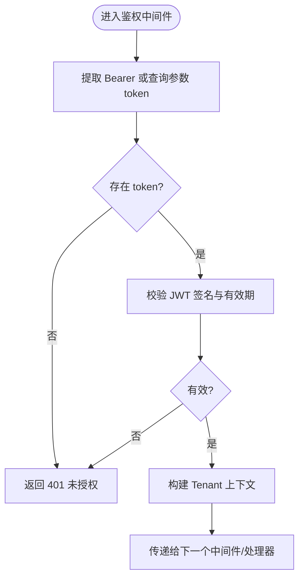

图表来源
- [internal/pkg/auth/middleware.go:21-53](file://internal/pkg/auth/middleware.go#L21-L53)
- [internal/pkg/auth/jwt.go:56-99](file://internal/pkg/auth/jwt.go#L56-L99)

章节来源
- [internal/pkg/auth/jwt.go:16-99](file://internal/pkg/auth/jwt.go#L16-L99)
- [internal/pkg/auth/middleware.go:10-67](file://internal/pkg/auth/middleware.go#L10-L67)

### 授权中间件实现
- 解析租户上下文：若缺失则返回未授权。
- 超级管理员短路：当 IsSuperuser 为真时直接放行，避免策略损坏导致系统锁死。
- 兼容模式：若无授权器实例，则放行以兼容未启用 IAM 的部署。
- 资源与动作：按对象与动作进行授权判断，失败返回禁止。

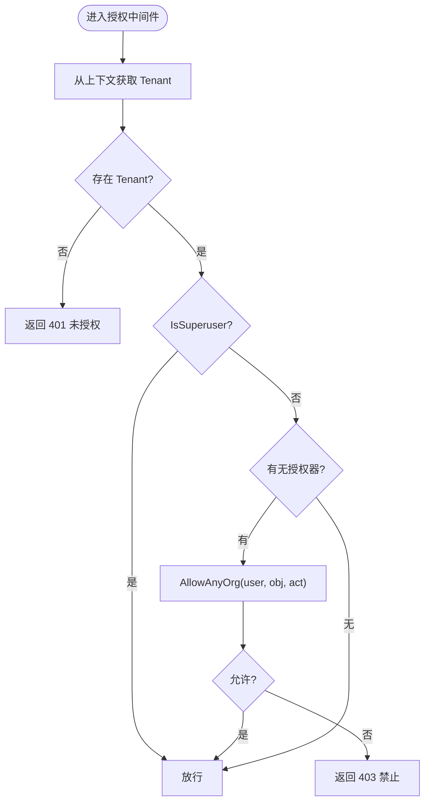

图表来源
- [internal/pkg/authzmw/middleware.go:57-98](file://internal/pkg/authzmw/middleware.go#L57-L98)

章节来源
- [internal/pkg/authzmw/middleware.go:1-98](file://internal/pkg/authzmw/middleware.go#L1-L98)

### 安全上下文传递
- 上下文键：通过 context 携带 Tenant（用户ID、邮箱、角色、是否超级管理员）。
- 可变槽：外层中间件（如审计）可在内层中间件（如鉴权）之后读取已设置的 Tenant，避免 r.WithContext 导致的上下文丢失问题。
- 使用方式：鉴权中间件在验证成功后写入上下文；业务层通过 From 读取并进行权限与归属判断。

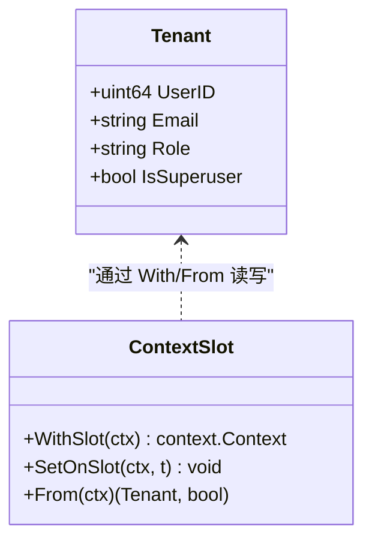

图表来源
- [internal/pkg/tenantctx/tenantctx.go:13-86](file://internal/pkg/tenantctx/tenantctx.go#L13-L86)

章节来源
- [internal/pkg/tenantctx/tenantctx.go:13-86](file://internal/pkg/tenantctx/tenantctx.go#L13-L86)

### TLS 加密传输
- 边端隧道：支持指定 CA 文件用于服务器证书校验；支持历史别名字段兼容。
- 外部服务：Prom/Grafana/TLS 等配置项支持跳过校验（仅开发/内网场景）与指定 CA 路径。
- HTTP Server：统一监听地址与优雅关闭，便于接入反向代理与 TLS 终止。

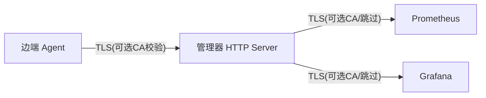

图表来源
- [internal/pkg/tunnel/types.go:33-66](file://internal/pkg/tunnel/types.go#L33-L66)
- [internal/pkg/config/config.go:254-286](file://internal/pkg/config/config.go#L254-L286)
- [internal/pkg/config/config.go:498-507](file://internal/pkg/config/config.go#L498-L507)
- [internal/pkg/httpserver/server.go:13-59](file://internal/pkg/httpserver/server.go#L13-L59)

章节来源
- [internal/pkg/tunnel/types.go:33-66](file://internal/pkg/tunnel/types.go#L33-L66)
- [internal/pkg/config/config.go:254-286](file://internal/pkg/config/config.go#L254-L286)
- [internal/pkg/config/config.go:498-507](file://internal/pkg/config/config.go#L498-L507)
- [internal/pkg/httpserver/server.go:13-59](file://internal/pkg/httpserver/server.go#L13-L59)

### 防重放攻击与请求签名
- 包捕获解析器：使用 EdDSA 对请求摘要与过期时间进行签名，生成短时效票据，限制请求可被重放的时间窗口。
- 边缘注册：注册与领取流程使用一次性令牌哈希与设备指纹，结合事务与锁定，防止重复领取。

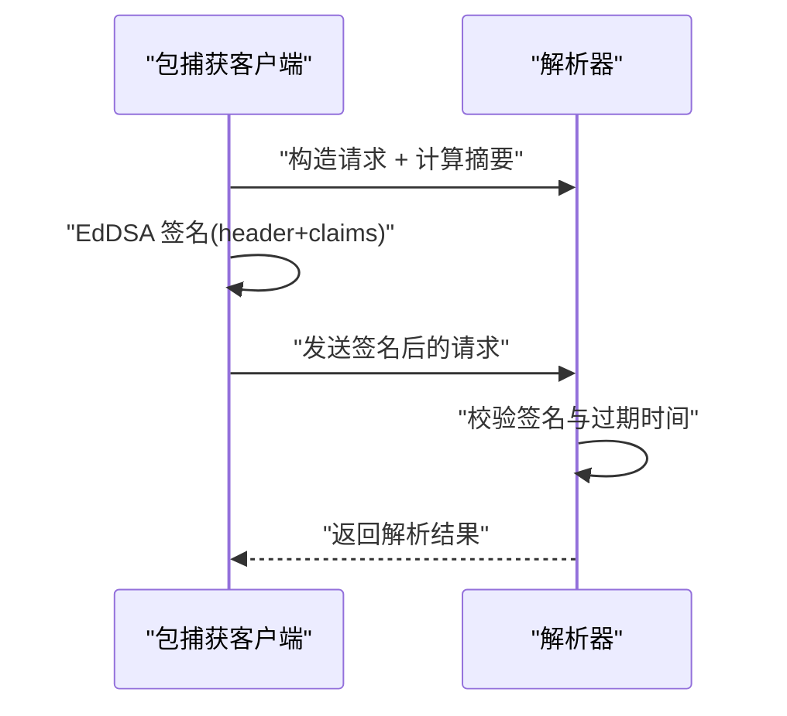

图表来源
- [internal/manager/biz/packetcapture/parser_client.go:249-283](file://internal/manager/biz/packetcapture/parser_client.go#L249-L283)
- [internal/manager/data/edge/store/enrollment.go:109-158](file://internal/manager/data/edge/store/enrollment.go#L109-L158)

章节来源
- [internal/manager/biz/packetcapture/parser_client.go:249-283](file://internal/manager/biz/packetcapture/parser_client.go#L249-L283)
- [internal/manager/data/edge/store/enrollment.go:109-158](file://internal/manager/data/edge/store/enrollment.go#L109-L158)

### 输入验证与缓存加速
- 输入验证：MCP 服务器创建时对传输类型与端点进行校验，非法输入返回无效错误。
- 认证缓存：对成功的凭据校验进行短期缓存，降低高并发下的计算成本，同时保证撤销在有限时间内生效。

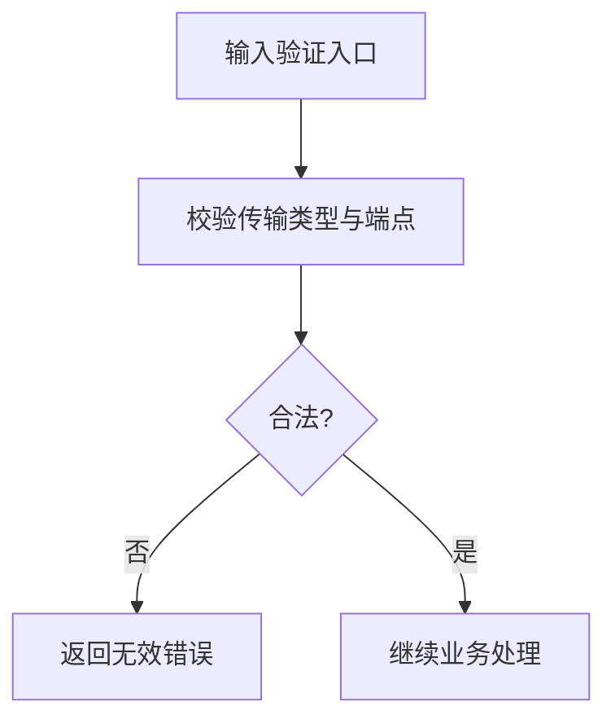

图表来源
- [internal/manager/biz/mcp/usecase_test.go:299-346](file://internal/manager/biz/mcp/usecase_test.go#L299-L346)

章节来源
- [internal/manager/biz/mcp/usecase_test.go:299-346](file://internal/manager/biz/mcp/usecase_test.go#L299-L346)
- [internal/manager/biz/edge/authcache.go:1-56](file://internal/manager/biz/edge/authcache.go#L1-L56)

### 审计日志
- 动作与状态：定义成功、失败、拒绝等状态与标准化动作命名，便于 UI 筛选与审计分析。
- 查询能力：提供时间范围、资源类型、动作过滤的查询接口，支持 RCA 场景的事件回溯。

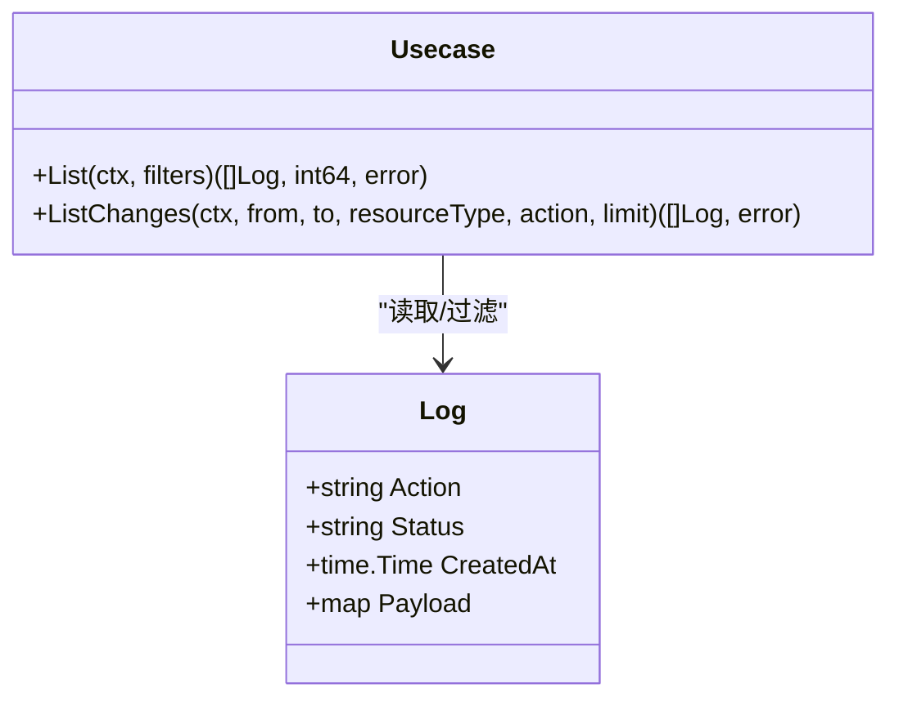

图表来源
- [internal/manager/model/audit/log.go:49-76](file://internal/manager/model/audit/log.go#L49-L76)
- [internal/manager/biz/audit/usecase.go:118-147](file://internal/manager/biz/audit/usecase.go#L118-L147)

章节来源
- [internal/manager/model/audit/log.go:49-76](file://internal/manager/model/audit/log.go#L49-L76)
- [internal/manager/biz/audit/usecase.go:118-147](file://internal/manager/biz/audit/usecase.go#L118-L147)

### 敏感数据传输保护与脱敏
- 静态加密：使用 AES-256-GCM 对凭证数据进行信封式加密，密钥来自环境变量派生；支持版本前缀与向后兼容明文迁移。
- 输出脱敏：设置值 API 自动标记敏感键并在响应中隐藏明文；列表接口同样进行脱敏，防止凭证泄露。
- 凭证库：只暴露字段名而不暴露值，确保读路径不泄露敏感内容。

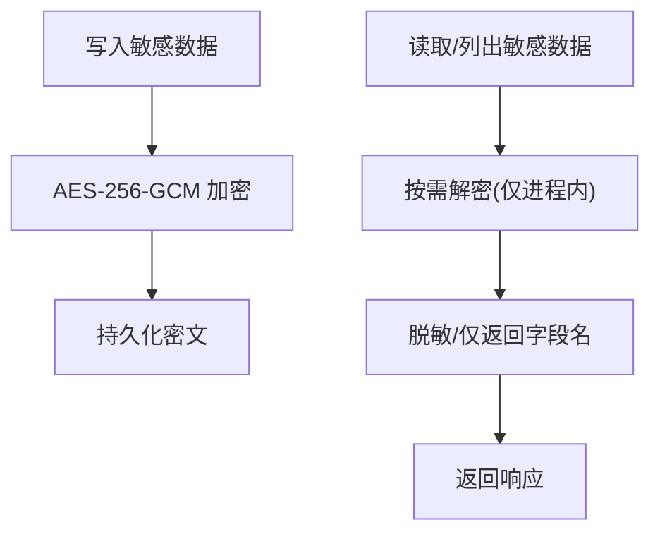

图表来源
- [internal/pkg/secretbox/secretbox.go:31-109](file://internal/pkg/secretbox/secretbox.go#L31-L109)
- [internal/manager/model/secret/model.go:32-45](file://internal/manager/model/secret/model.go#L32-L45)
- [internal/manager/biz/secret/usecase.go:1-43](file://internal/manager/biz/secret/usecase.go#L1-L43)
- [tests/e2e/settings_reveal_test.go:24-68](file://tests/e2e/settings_reveal_test.go#L24-L68)

章节来源
- [internal/pkg/secretbox/secretbox.go:31-109](file://internal/pkg/secretbox/secretbox.go#L31-L109)
- [internal/manager/model/secret/model.go:32-45](file://internal/manager/model/secret/model.go#L32-L45)
- [internal/manager/biz/secret/usecase.go:1-43](file://internal/manager/biz/secret/usecase.go#L1-L43)
- [tests/e2e/settings_reveal_test.go:24-68](file://tests/e2e/settings_reveal_test.go#L24-L68)

### 多租户隔离与安全上下文
- 当前 MVP 为单租户，Tenant 即代表已认证调用者；未来扩展至多租户时，可通过组织 ID 与策略进一步隔离。
- 上下文传播：鉴权中间件写入 Tenant，授权中间件与业务层通过 From 读取，审计中间件通过可变槽读取，确保全链路一致。

章节来源
- [internal/pkg/tenantctx/tenantctx.go:1-26](file://internal/pkg/tenantctx/tenantctx.go#L1-L26)
- [internal/pkg/auth/middleware.go:34-50](file://internal/pkg/auth/middleware.go#L34-L50)
- [internal/pkg/authzmw/middleware.go:70-98](file://internal/pkg/authzmw/middleware.go#L70-L98)

## 依赖关系分析
- 鉴权中间件依赖 JWT 签发器与租户上下文；授权中间件依赖租户上下文与授权器接口。
- HTTP Server 作为入口承载中间件链；配置模块提供 JWT、TLS、数据库等关键参数。
- 审计与敏感数据模块独立于认证授权，但依赖上下文中的身份信息以标注审计行。

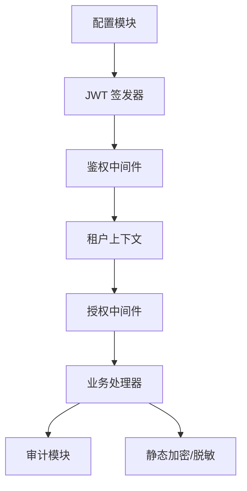

图表来源
- [internal/pkg/config/config.go:417-549](file://internal/pkg/config/config.go#L417-L549)
- [internal/pkg/auth/jwt.go:56-99](file://internal/pkg/auth/jwt.go#L56-L99)
- [internal/pkg/auth/middleware.go:21-53](file://internal/pkg/auth/middleware.go#L21-L53)
- [internal/pkg/tenantctx/tenantctx.go:30-86](file://internal/pkg/tenantctx/tenantctx.go#L30-L86)
- [internal/pkg/authzmw/middleware.go:57-98](file://internal/pkg/authzmw/middleware.go#L57-L98)
- [internal/manager/model/audit/log.go:49-76](file://internal/manager/model/audit/log.go#L49-L76)
- [internal/pkg/secretbox/secretbox.go:53-109](file://internal/pkg/secretbox/secretbox.go#L53-L109)

章节来源
- [internal/pkg/config/config.go:417-549](file://internal/pkg/config/config.go#L417-L549)
- [internal/pkg/auth/jwt.go:56-99](file://internal/pkg/auth/jwt.go#L56-L99)
- [internal/pkg/auth/middleware.go:21-53](file://internal/pkg/auth/middleware.go#L21-L53)
- [internal/pkg/tenantctx/tenantctx.go:30-86](file://internal/pkg/tenantctx/tenantctx.go#L30-L86)
- [internal/pkg/authzmw/middleware.go:57-98](file://internal/pkg/authzmw/middleware.go#L57-L98)
- [internal/manager/model/audit/log.go:49-76](file://internal/manager/model/audit/log.go#L49-L76)
- [internal/pkg/secretbox/secretbox.go:53-109](file://internal/pkg/secretbox/secretbox.go#L53-L109)

## 性能考量
- 认证缓存：对凭据校验结果进行短期缓存，减少高并发下的计算开销，同时保证撤销在有限时间窗口内生效。
- 审计查询：提供时间范围与资源类型过滤，避免全表扫描；合理设置限制以提升查询效率。
- 输入验证：尽早拒绝非法输入，减少后续处理成本。

章节来源
- [internal/manager/biz/edge/authcache.go:1-56](file://internal/manager/biz/edge/authcache.go#L1-L56)
- [internal/manager/biz/audit/usecase.go:118-147](file://internal/manager/biz/audit/usecase.go#L118-L147)
- [internal/manager/biz/mcp/usecase_test.go:299-346](file://internal/manager/biz/mcp/usecase_test.go#L299-L346)

## 故障排查指南
- JWT 认证失败：检查令牌过期、时钟偏差、签名密钥轮换、受众/发行者匹配与算法选择。
- 授权失败：确认租户上下文是否存在、是否超级管理员、授权器是否正确配置。
- 敏感数据泄露：确认静态加密是否启用、输出是否脱敏、测试是否断言明文未泄露。
- 审计缺失：确认审计用例是否被调用、过滤器是否过严、时间范围是否正确。

章节来源
- [internal/manager/biz/knowledge/builtin_vault/diagnostics/jwt-auth-failures.md:1-83](file://internal/manager/biz/knowledge/builtin_vault/diagnostics/jwt-auth-failures.md#L1-L83)
- [internal/pkg/authzmw/middleware.go:70-98](file://internal/pkg/authzmw/middleware.go#L70-L98)
- [tests/e2e/settings_reveal_test.go:24-68](file://tests/e2e/settings_reveal_test.go#L24-L68)
- [internal/manager/biz/audit/usecase.go:118-147](file://internal/manager/biz/audit/usecase.go#L118-L147)

## 结论
本项目的通信协议安全机制围绕 JWT 认证、RBAC 授权、TLS 传输、审计日志与静态加密展开，并通过租户上下文贯穿全链路。通过短期缓存、输入验证与请求签名等手段提升安全性与性能。建议在生产环境严格配置 JWT 密钥与 TTL、启用 TLS 证书校验、开启静态加密与输出脱敏，并结合审计日志进行持续监控与合规审计。

## 附录

### 安全配置示例（环境变量）
- JWT 密钥与有效期：
  - ONGRID_JWT_SECRET
  - ONGRID_JWT_ACCESS_TTL
  - ONGRID_JWT_REFRESH_TTL
- TLS 与外部服务：
  - ONGRID_PROM_TLS_INSECURE
  - ONGRID_PROM_TLS_CA_FILE
  - ONGRID_GRAFANA_TLS_INSECURE
  - 边端隧道 TLSCAFile/TLSCA
- 静态加密：
  - ONGRID_SECRET_KEY（强烈建议设置，避免弱密钥）
- 其他：
  - ONGRID_DB_DIALECT / ONGRID_DB_DSN / ONGRID_DB_PATH
  - ONGRID_PUBLIC_URL（影响数据平面端点暴露）

章节来源
- [internal/pkg/config/config.go:417-549](file://internal/pkg/config/config.go#L417-L549)
- [internal/pkg/config/config.go:254-286](file://internal/pkg/config/config.go#L254-L286)
- [internal/pkg/config/config.go:498-507](file://internal/pkg/config/config.go#L498-L507)
- [internal/pkg/tunnel/types.go:33-66](file://internal/pkg/tunnel/types.go#L33-L66)
- [internal/pkg/secretbox/secretbox.go:31-51](file://internal/pkg/secretbox/secretbox.go#L31-L51)

### 漏洞防护策略与最佳实践
- 强制 HTTPS 与证书校验，禁用跳过校验的生产配置。
- 使用强随机密钥与合理的 JWT TTL，配合刷新令牌与短效票据。
- 对所有敏感数据进行静态加密，并在输出侧进行脱敏。
- 启用审计日志并定期审查，结合时间范围与资源类型过滤。
- 对输入进行严格校验，尽早拒绝非法请求。
- 对高频认证路径进行缓存优化，同时保证撤销时效性。
- 遵循最小权限原则，结合 RBAC 与超级管理员短路策略。

章节来源
- [internal/pkg/auth/jwt.go:56-99](file://internal/pkg/auth/jwt.go#L56-L99)
- [internal/pkg/authzmw/middleware.go:57-98](file://internal/pkg/authzmw/middleware.go#L57-L98)
- [internal/pkg/secretbox/secretbox.go:53-109](file://internal/pkg/secretbox/secretbox.go#L53-L109)
- [internal/manager/model/audit/log.go:49-76](file://internal/manager/model/audit/log.go#L49-L76)
- [internal/manager/biz/edge/authcache.go:1-56](file://internal/manager/biz/edge/authcache.go#L1-L56)