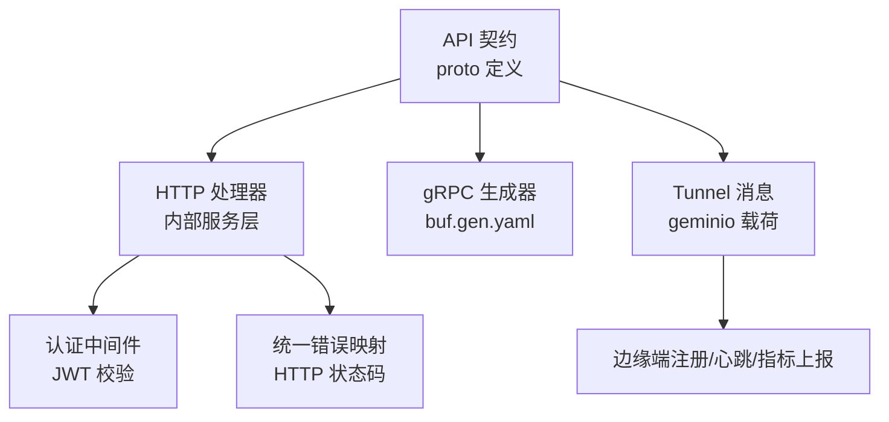
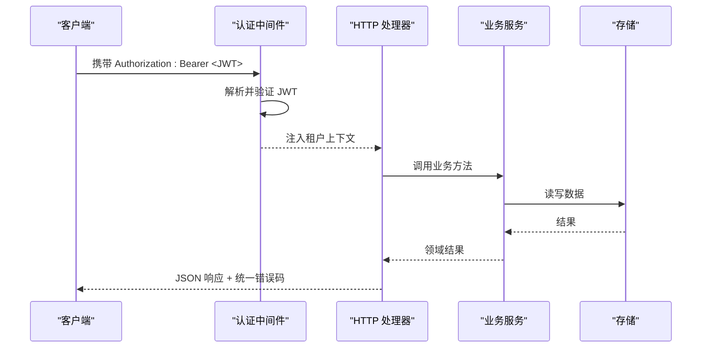
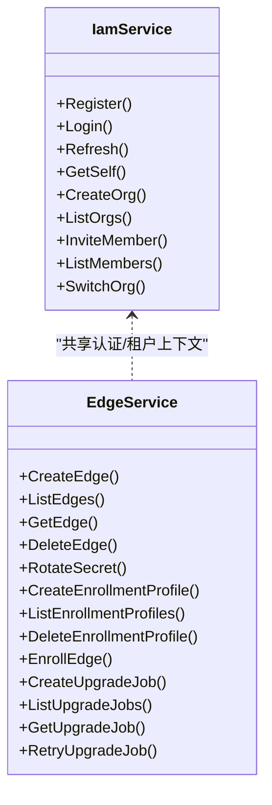
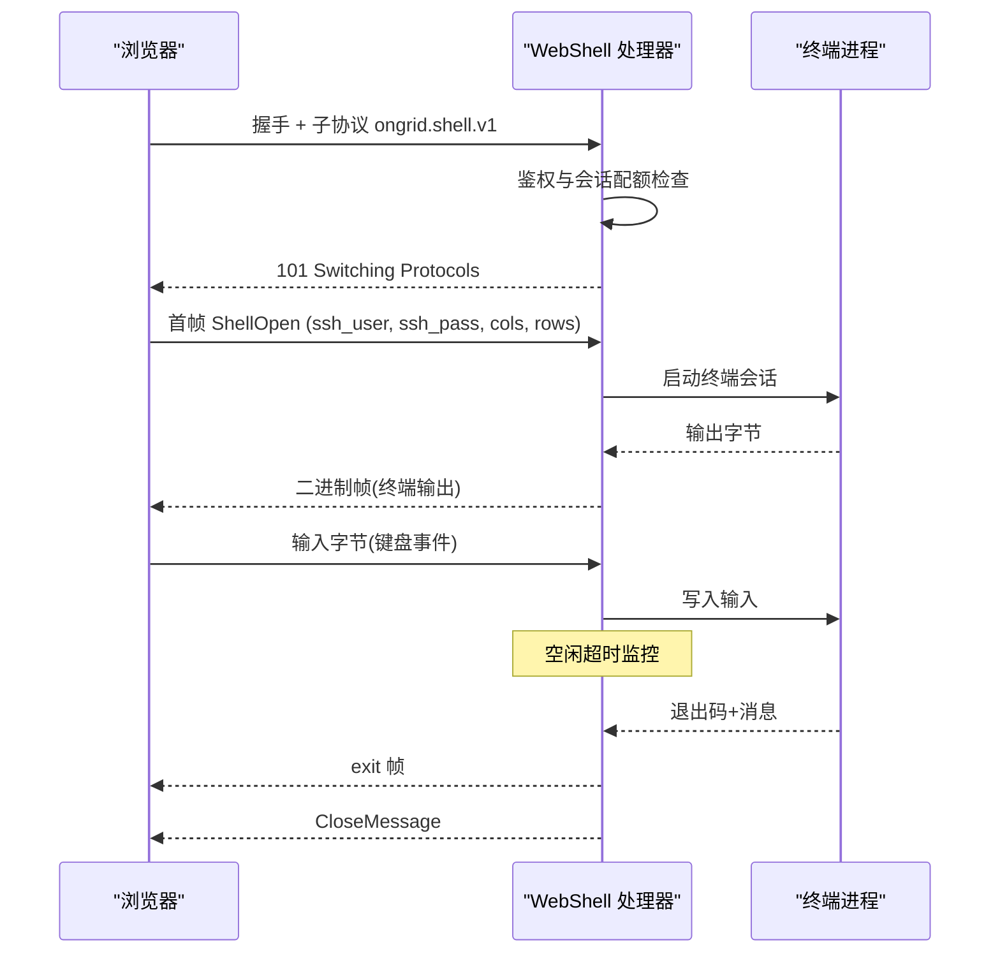
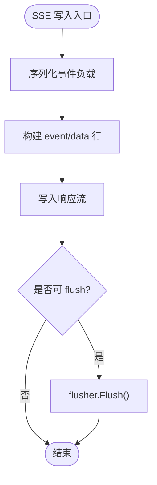
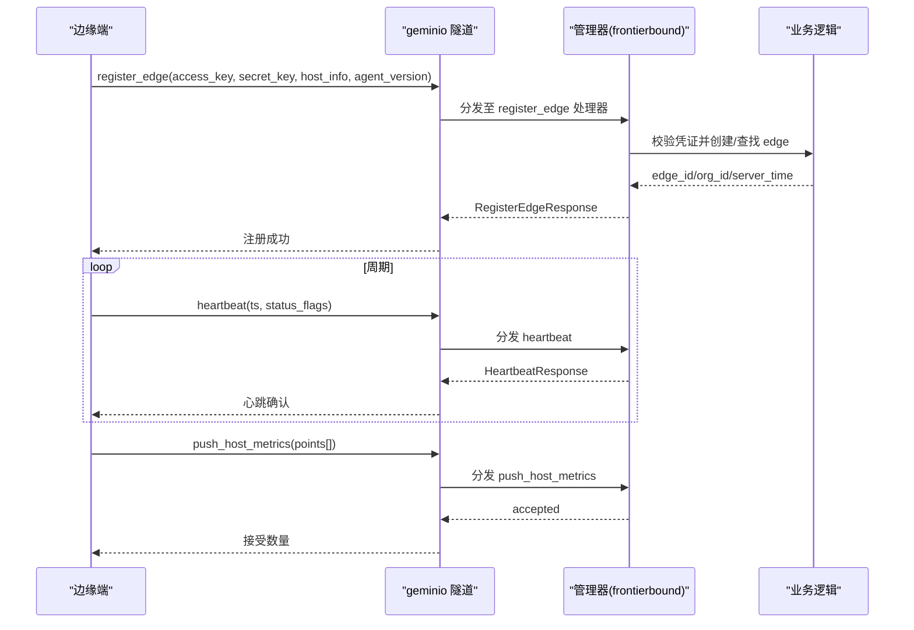
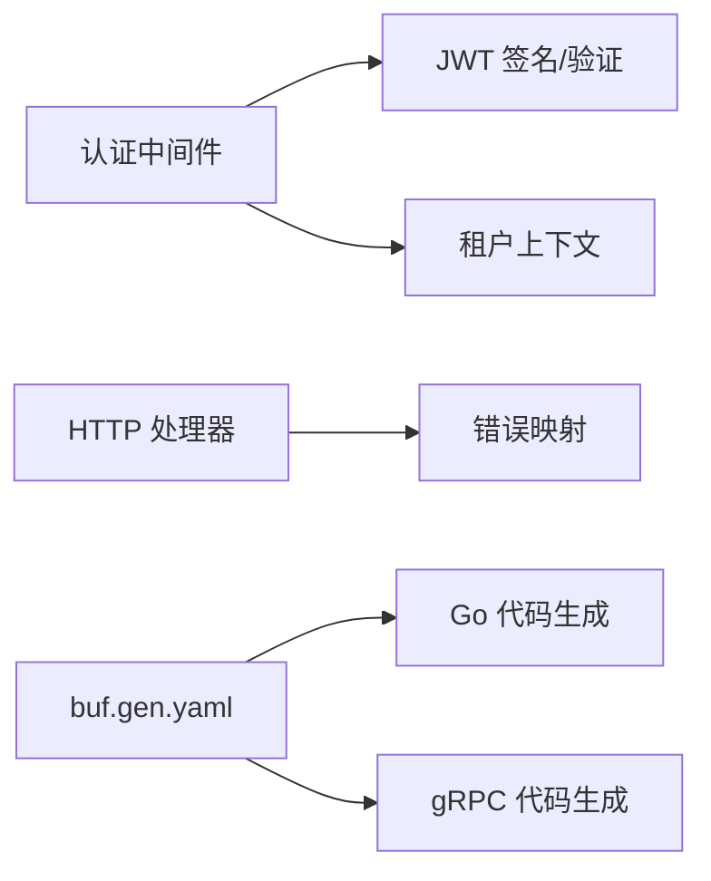

# 通信协议设计

<cite>
**本文引用的文件**
- [api/README.md](file://api/README.md)
- [api/buf.yaml](file://api/buf.yaml)
- [api/buf.gen.yaml](file://api/buf.gen.yaml)
- [api/iam/v1/iam.proto](file://api/iam/v1/iam.proto)
- [api/manager/edge/v1/edge.proto](file://api/manager/edge/v1/edge.proto)
- [api/tunnel/v1/tunnel.proto](file://api/tunnel/v1/tunnel.proto)
- [internal/pkg/auth/middleware.go](file://internal/pkg/auth/middleware.go)
- [internal/pkg/auth/jwt.go](file://internal/pkg/auth/jwt.go)
- [internal/pkg/errs/errs.go](file://internal/pkg/errs/errs.go)
- [internal/manager/server/webshell/http.go](file://internal/manager/server/webshell/http.go)
- [web/src/api/webshell.ts](file://web/src/api/webshell.ts)
- [internal/manager/server/operatorrun/http.go](file://internal/manager/server/operatorrun/http.go)
- [internal/manager/service/frontierbound/client.go](file://internal/manager/service/frontierbound/client.go)
</cite>

## 目录
1. [简介](#简介)
2. [项目结构](#项目结构)
3. [核心组件](#核心组件)
4. [架构总览](#架构总览)
5. [详细组件分析](#详细组件分析)
6. [依赖关系分析](#依赖关系分析)
7. [性能考虑](#性能考虑)
8. [故障排查指南](#故障排查指南)
9. [结论](#结论)
10. [附录](#附录)

## 简介
本文件为 Ongrid 通信协议设计文档，覆盖 RESTful API、gRPC 接口、WebSocket 连接与 SSE 事件流的协议规范。重点说明消息格式定义、版本兼容性策略、错误处理机制；并给出连接管理、心跳检测、断线重连与负载均衡策略建议。文档包含协议序列图与消息格式示例路径，展示典型通信场景的实现方式，并对性能优化与安全性进行讨论。

## 项目结构
Ongrid 的公共 API 契约以 Protocol Buffers 作为单一事实来源（Single Source of Truth），REST 路由由手写处理器实现，MVP 阶段未使用 grpc-gateway。tunnel 协议通过 geminio 隧道承载，非 gRPC 服务。

图表来源
- [api/README.md:1-42](file://api/README.md#L1-L42)
- [api/buf.gen.yaml:1-11](file://api/buf.gen.yaml#L1-L11)
- [internal/pkg/auth/middleware.go:10-67](file://internal/pkg/auth/middleware.go#L10-L67)
- [internal/pkg/errs/errs.go:28-53](file://internal/pkg/errs/errs.go#L28-L53)

章节来源
- [api/README.md:1-42](file://api/README.md#L1-L42)
- [api/buf.yaml:1-10](file://api/buf.yaml#L1-L10)
- [api/buf.gen.yaml:1-11](file://api/buf.gen.yaml#L1-L11)

## 核心组件
- 身份与权限：IAM 服务提供登录、令牌签发与组织成员管理；JWT 签名与验证在独立模块中实现。
- 边缘设备管理：EdgeService 负责设备注册、密钥轮换、批量安装配置与升级任务。
- 隧道通信：tunnel 协议通过 geminio 隧道承载 edge↔cloud 的请求/响应消息，包括注册、心跳、指标上报、Kubernetes 资源查询与操作等。
- WebShell：基于 WebSocket 的双向终端通道，具备会话生命周期管理与空闲超时控制。
- SSE 事件流：SSE 用于实时事件推送（如 AI 助手流程事件）。
- 错误与认证：统一的错误哨兵与 HTTP 状态码映射；JWT 中间件支持 Header 与查询参数两种鉴权方式。

章节来源
- [api/iam/v1/iam.proto:9-42](file://api/iam/v1/iam.proto#L9-L42)
- [api/manager/edge/v1/edge.proto:10-61](file://api/manager/edge/v1/edge.proto#L10-L61)
- [api/tunnel/v1/tunnel.proto:1-18](file://api/tunnel/v1/tunnel.proto#L1-L18)
- [internal/manager/server/webshell/http.go:184-231](file://internal/manager/server/webshell/http.go#L184-L231)
- [internal/manager/server/operatorrun/http.go:210-224](file://internal/manager/server/operatorrun/http.go#L210-L224)
- [internal/pkg/auth/middleware.go:10-67](file://internal/pkg/auth/middleware.go#L10-L67)
- [internal/pkg/errs/errs.go:28-53](file://internal/pkg/errs/errs.go#L28-L53)

## 架构总览
Ongrid 采用“契约先行”的架构：proto 定义公共接口，HTTP 处理器按契约实现 REST 路由；gRPC 代码由 buf 生成；tunnel 协议通过 geminio 隧道传输 JSON 载荷。认证由 JWT 中间件统一处理，错误通过统一映射返回标准 HTTP 状态码。

图表来源
- [internal/pkg/auth/middleware.go:21-51](file://internal/pkg/auth/middleware.go#L21-L51)
- [internal/pkg/errs/errs.go:28-53](file://internal/pkg/errs/errs.go#L28-L53)

## 详细组件分析

### RESTful API 与 gRPC 接口
- 契约与版本
  - proto 包命名遵循 ongrid.<bc>[.<subdomain>].v<major> 约定，每个 RPC 拥有独立的 Request/Response 类型以保证向前兼容。
  - 通过 buf 生成 Go 代码，CI 中使用 buf breaking 检测破坏性变更。
- IAM 服务
  - 提供注册、登录、刷新令牌、获取当前用户、创建组织、邀请成员、切换组织等能力。
  - org_id/user_id 不来自请求体，由 JWT claims 与 URL path 注入。
- Edge 管理服务
  - 提供设备创建、列表、详情、删除、密钥轮换、批量安装配置、升级任务管理等能力。
  - 敏感字段（如 SecretKey）仅在首次响应明文返回一次，服务端仅保存哈希。
- 错误处理
  - 统一错误哨兵映射到 HTTP 状态码（401/403/404/409/400/429/503/501/500）。
  - 处理器统一封装 errorBody 返回 {error, code}。

图表来源
- [api/iam/v1/iam.proto:9-42](file://api/iam/v1/iam.proto#L9-L42)
- [api/manager/edge/v1/edge.proto:10-61](file://api/manager/edge/v1/edge.proto#L10-L61)
- [internal/pkg/errs/errs.go:28-53](file://internal/pkg/errs/errs.go#L28-L53)

章节来源
- [api/README.md:22-32](file://api/README.md#L22-L32)
- [api/iam/v1/iam.proto:9-42](file://api/iam/v1/iam.proto#L9-L42)
- [api/manager/edge/v1/edge.proto:10-61](file://api/manager/edge/v1/edge.proto#L10-L61)
- [internal/pkg/errs/errs.go:28-53](file://internal/pkg/errs/errs.go#L28-L53)

### WebSocket 连接（WebShell）
- 连接建立
  - 前端通过 wss://.../devices/{device_id}/shell 发起 WebSocket 升级，并在首帧发送 ShellOpen 文本帧（包含 SSH 用户、密码、终端尺寸等）。
  - 后端对并发会话数进行限制（每用户/每设备上限），并通过中间件完成鉴权（支持 ?token= 回退）。
- 会话生命周期
  - 空闲超时监控：定期检查最后输入时间，超过阈值则终止会话。
  - 退出通知：当子进程退出时，通过 exit 帧返回退出码与消息。
  - 关闭流程：服务器侧主动关闭时发送 CloseMessage，客户端在 beforeunload 时尝试礼貌关闭。
- 前端行为
  - 异常断开（1006）时进行预检探测，将 HTTP 状态转换为可读提示。
  - 支持 resize 控制帧，动态调整终端行列。

图表来源
- [internal/manager/server/webshell/http.go:184-231](file://internal/manager/server/webshell/http.go#L184-L231)
- [internal/manager/server/webshell/http.go:397-431](file://internal/manager/server/webshell/http.go#L397-L431)
- [web/src/api/webshell.ts:1-19](file://web/src/api/webshell.ts#L1-L19)
- [web/src/pages/DeviceShell.tsx:190-364](file://web/src/pages/DeviceShell.tsx#L190-L364)

章节来源
- [internal/manager/server/webshell/http.go:184-231](file://internal/manager/server/webshell/http.go#L184-L231)
- [internal/manager/server/webshell/http.go:397-431](file://internal/manager/server/webshell/http.go#L397-L431)
- [web/src/api/webshell.ts:1-19](file://web/src/api/webshell.ts#L1-L19)
- [web/src/pages/DeviceShell.tsx:190-364](file://web/src/pages/DeviceShell.tsx#L190-L364)

### SSE 事件流
- 事件格式
  - 事件行 event: <name>，数据行 data: <JSON payload>，以空行结束。
  - 处理器负责编码事件并 flush 输出。
- 典型用途
  - AI 助手流程事件（开始/结束、工具调用开始/结束、迭代计数等）。
- 错误处理
  - 事件编码失败时返回内嵌错误对象，保持流式推进。

图表来源
- [internal/manager/server/operatorrun/http.go:210-224](file://internal/manager/server/operatorrun/http.go#L210-L224)

章节来源
- [internal/manager/server/operatorrun/http.go:210-224](file://internal/manager/server/operatorrun/http.go#L210-L224)

### Tunnel 协议（geminio 隧道）
- 传输与版本
  - 通过 geminio 隧道传输，MVP 使用 JSON 编码；未来可能切换到 proto 二进制。
  - 无 gRPC service 声明，边云通过 method name 注册处理器。
- 关键消息
  - 注册：register_edge（access_key/secret_key/host_info/agent_version）→ 返回 edge_id/org_id/server_time。
  - 心跳：heartbeat（ts/status_flags）→ 空响应。
  - 指标上报：push_host_metrics（批量 HostMetricPoint）→ accepted 计数。
  - 云端拉取：get_host_load、get_process_list、get_netstat。
  - Kubernetes 相关：describe_k8s_resource、query_k8s_logs、execute_k8s_action。
  - 网络发现：push_network_discovery、probe_network_snmp。
- 边云交互
  - 管理器通过 frontierbound 注册方法处理器，提取 edgeID 并转发给业务逻辑。

图表来源
- [api/tunnel/v1/tunnel.proto:73-117](file://api/tunnel/v1/tunnel.proto#L73-L117)
- [internal/manager/service/frontierbound/client.go:179-218](file://internal/manager/service/frontierbound/client.go#L179-L218)

章节来源
- [api/tunnel/v1/tunnel.proto:1-18](file://api/tunnel/v1/tunnel.proto#L1-L18)
- [api/tunnel/v1/tunnel.proto:73-117](file://api/tunnel/v1/tunnel.proto#L73-L117)
- [internal/manager/service/frontierbound/client.go:179-218](file://internal/manager/service/frontierbound/client.go#L179-L218)

## 依赖关系分析
- 认证依赖
  - 中间件从 Authorization: Bearer 或 ?token= 提取 JWT，调用 Signer.Verify 校验签名与有效期，并将租户上下文注入请求。
- 错误映射依赖
  - 所有处理器通过 errs.HTTPStatus 将错误哨兵映射为标准 HTTP 状态码，保证一致性。
- 生成器依赖
  - buf.gen.yaml 指定 go 与 grpc 插件，确保生成的代码路径与 require_unimplemented_servers 策略。

图表来源
- [internal/pkg/auth/middleware.go:21-67](file://internal/pkg/auth/middleware.go#L21-L67)
- [internal/pkg/auth/jwt.go:73-99](file://internal/pkg/auth/jwt.go#L73-L99)
- [internal/pkg/errs/errs.go:28-53](file://internal/pkg/errs/errs.go#L28-L53)
- [api/buf.gen.yaml:1-11](file://api/buf.gen.yaml#L1-L11)

章节来源
- [internal/pkg/auth/middleware.go:21-67](file://internal/pkg/auth/middleware.go#L21-L67)
- [internal/pkg/auth/jwt.go:73-99](file://internal/pkg/auth/jwt.go#L73-L99)
- [internal/pkg/errs/errs.go:28-53](file://internal/pkg/errs/errs.go#L28-L53)
- [api/buf.gen.yaml:1-11](file://api/buf.gen.yaml#L1-L11)

## 性能考虑
- 连接复用与长连接
  - WebSocket 与隧道均为长连接，减少握手开销；合理设置读/写超时与空闲超时，避免资源泄漏。
- 批量化与节流
  - 指标上报采用批量点（points[]），降低网络与入库压力；心跳周期与指标周期需平衡实时性与吞吐。
- 并发与限流
  - WebShell 对每用户/每设备会话数进行限制；登录等敏感路径应配合速率限制（429）。
- 缓存与去重
  - 指标入库前可进行去重；Kubernetes 快照按需采集，避免全量高频同步。
- 资源池与数据库
  - 连接池大小应与实例数匹配，避免超配导致数据库连接耗尽；监控 idle-in-transaction 等泄漏信号。

[本节为通用指导，无需具体文件引用]

## 故障排查指南
- 认证失败（401/403）
  - 检查 JWT 签名、过期时间、时钟偏差、issuer/audience 是否匹配；必要时刷新令牌。
  - WebSocket 升级失败时，可通过同路径 GET 预检获取 HTTP 状态（如 429/503/403）辅助定位。
- 连接异常（1006）
  - 可能是网络中断或服务器主动断开；查看服务端日志中的 close 原因与空闲超时。
- 指标未入库
  - 检查 tunnel 心跳是否正常；确认 push_host_metrics 的 accepted 计数；核对去重与入库链路。
- 系统健康检查
  - 管理员可通过系统健康检查接口获取各组件状态与摘要，快速定位退化项。

章节来源
- [internal/pkg/auth/middleware.go:21-67](file://internal/pkg/auth/middleware.go#L21-L67)
- [web/src/api/webshell.ts:140-181](file://web/src/api/webshell.ts#L140-L181)
- [internal/manager/server/systemhealth/http.go:30-50](file://internal/manager/server/systemhealth/http.go#L30-L50)

## 结论
Ongrid 以 proto 契约为核心，结合 REST、gRPC、WebSocket 与 SSE 形成多模态通信体系。通过统一的认证与错误处理机制，保障跨接口的稳定性与可观测性。tunnel 协议支撑边云双向通信，满足设备注册、心跳、指标上报与 Kubernetes 运维等场景。建议在部署中关注连接池、速率限制与资源监控，以确保高可用与高性能。

[本节为总结，无需具体文件引用]

## 附录

### 协议序列图与消息格式示例路径
- 登录与令牌刷新
  - 参考：[api/iam/v1/iam.proto:9-42](file://api/iam/v1/iam.proto#L9-L42)
- 设备注册与心跳
  - 参考：[api/tunnel/v1/tunnel.proto:73-117](file://api/tunnel/v1/tunnel.proto#L73-L117)
- 指标上报
  - 参考：[api/tunnel/v1/tunnel.proto:105-117](file://api/tunnel/v1/tunnel.proto#L105-L117)
- WebShell 连接与退出
  - 参考：[internal/manager/server/webshell/http.go:184-231](file://internal/manager/server/webshell/http.go#L184-L231)
  - 参考：[web/src/pages/DeviceShell.tsx:190-364](file://web/src/pages/DeviceShell.tsx#L190-L364)
- SSE 事件推送
  - 参考：[internal/manager/server/operatorrun/http.go:210-224](file://internal/manager/server/operatorrun/http.go#L210-L224)

### 安全与合规要点
- 最小化敏感信息暴露：SecretKey 仅首次响应明文返回；后续仅哈希比对。
- 强认证：JWT HS256 签名，严格校验签名与有效期；支持 ?token= 回退以适配浏览器 WebSocket。
- 访问控制：org_id 与角色由中间件注入，不在请求体中由用户提供；管理员接口需额外校验。
- 速率限制：登录等敏感路径启用短窗口限流，防止暴力破解。

章节来源
- [api/manager/edge/v1/edge.proto:14-16](file://api/manager/edge/v1/edge.proto#L14-L16)
- [internal/pkg/auth/middleware.go:21-67](file://internal/pkg/auth/middleware.go#L21-L67)
- [internal/pkg/auth/jwt.go:73-99](file://internal/pkg/auth/jwt.go#L73-L99)