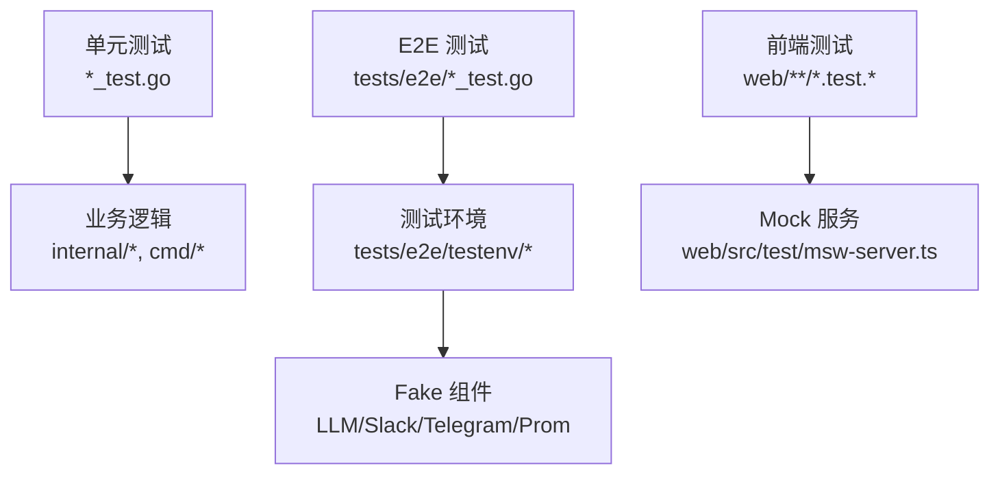
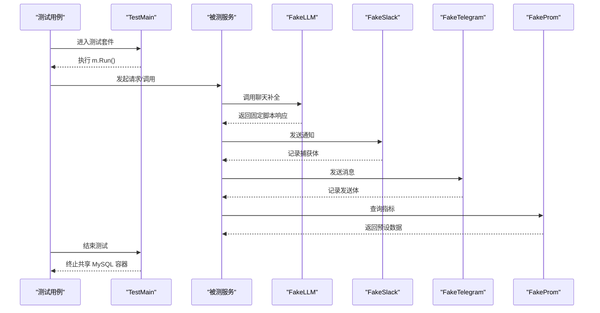
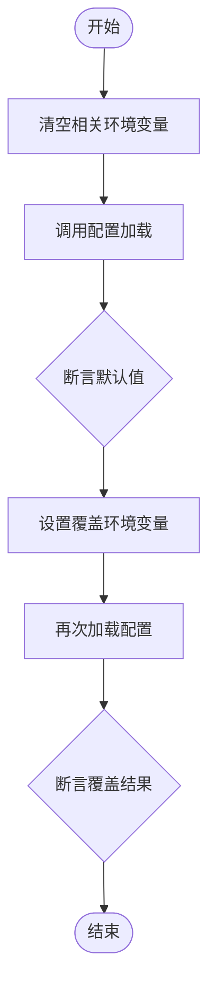
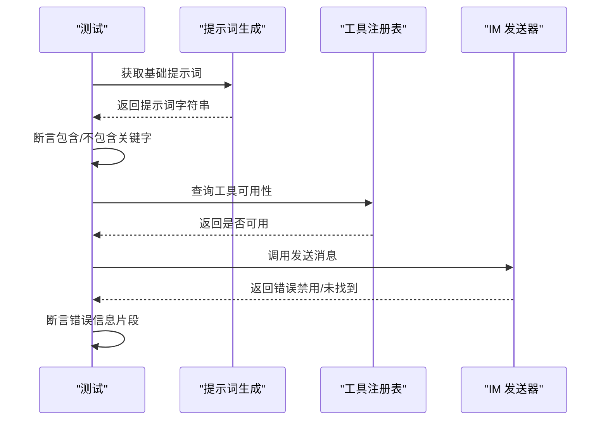
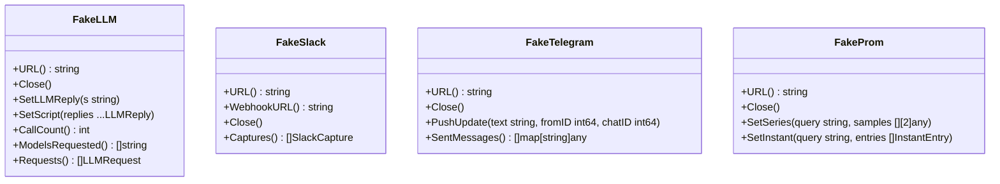
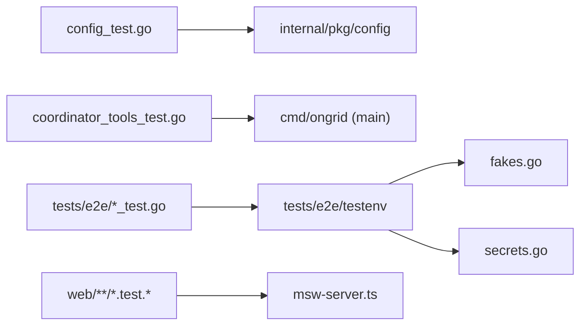

# 单元测试

<cite>
**本文引用的文件**
- [Makefile](file://Makefile)
- [coordinator_tools_test.go](file://cmd/ongrid/coordinator_tools_test.go)
- [config_test.go](file://internal/pkg/config/config_test.go)
- [main_test.go](file://tests/e2e/main_test.go)
- [fakes.go](file://tests/e2e/testenv/fakes.go)
- [secrets.go](file://tests/e2e/testenv/secrets.go)
- [msw-server.ts](file://web/src/test/msw-server.ts)
</cite>

## 目录
1. [简介](#简介)
2. [项目结构](#项目结构)
3. [核心组件](#核心组件)
4. [架构总览](#架构总览)
5. [详细组件分析](#详细组件分析)
6. [依赖关系分析](#依赖关系分析)
7. [性能与稳定性考虑](#性能与稳定性考虑)
8. [故障排查指南](#故障排查指南)
9. [结论](#结论)
10. [附录](#附录)

## 简介
本文件面向对 ongrid 项目单元测试的编写与维护，目标是：
- 明确测试命名、结构与断言规范
- 说明如何为业务逻辑编写测试（含外部依赖模拟、边界条件、异常处理）
- 覆盖工具函数测试方法（输入校验、输出格式化、错误处理）
- 给出针对 AI Agent 协调器、数据采集器、配置管理等核心组件的测试示例指引
- 提供覆盖率要求与代码质量检查工具使用建议

## 项目结构
仓库采用 Go 工程组织，测试按层次划分：
- 单元测试：与源码同目录或同级包内以 _test.go 结尾的文件
- 集成/E2E：位于 tests/e2e，通过 build tag e2e 控制执行
- 前端测试：位于 web 目录，使用 MSW 进行接口 Mock

**图表来源**
- [main_test.go:1-23](file://tests/e2e/main_test.go#L1-L23)
- [fakes.go:1-575](file://tests/e2e/testenv/fakes.go#L1-L575)
- [msw-server.ts:1-6](file://web/src/test/msw-server.ts#L1-L6)

**章节来源**
- [Makefile:103-117](file://Makefile#L103-L117)
- [main_test.go:1-23](file://tests/e2e/main_test.go#L1-L23)

## 核心组件
- 构建与测试入口：通过 Makefile 统一暴露 test、test-race、test-integration、test-e2e、test-e2e-live 等目标
- 配置加载测试：验证默认值与环境变量覆盖行为
- AI Agent 协调器相关测试：验证提示词策略、工具可用性、路由规则
- E2E 测试基础设施：统一的 TestMain、共享 MySQL 容器生命周期管理、Live Mode 开关、Secrets 读取
- Fake 组件：FakeLLM、FakeSlack、FakeTelegram、FakeProm，用于隔离外部依赖
- 前端 Mock：MSW 服务器用于拦截 HTTP 请求

**章节来源**
- [Makefile:103-117](file://Makefile#L103-L117)
- [config_test.go:1-363](file://internal/pkg/config/config_test.go#L1-L363)
- [coordinator_tools_test.go:1-153](file://cmd/ongrid/coordinator_tools_test.go#L1-L153)
- [fakes.go:1-575](file://tests/e2e/testenv/fakes.go#L1-L575)
- [secrets.go:51-132](file://tests/e2e/testenv/secrets.go#L51-L132)
- [msw-server.ts:1-6](file://web/src/test/msw-server.ts#L1-L6)

## 架构总览
下图展示了 E2E 测试在运行时的关键交互：测试通过 TestMain 启动并负责清理共享资源；测试调用被测服务，并通过 Fake 组件替代真实外部系统。

**图表来源**
- [main_test.go:12-22](file://tests/e2e/main_test.go#L12-L22)
- [fakes.go:102-167](file://tests/e2e/testenv/fakes.go#L102-L167)
- [fakes.go:279-345](file://tests/e2e/testenv/fakes.go#L279-L345)
- [fakes.go:347-437](file://tests/e2e/testenv/fakes.go#L347-L437)
- [fakes.go:439-548](file://tests/e2e/testenv/fakes.go#L439-L548)

## 详细组件分析

### 配置加载测试（Config）
- 目标：确保默认配置正确，环境变量可覆盖预期字段
- 方法：
  - 清空相关环境变量后调用 Load，断言默认值
  - 设置一组环境变量，断言覆盖后的配置
  - 针对日志/追踪 URL 的显式禁用场景进行验证
- 断言风格：直接使用 t.Errorf/t.Fatalf 表达期望与实际差异
- 最佳实践：
  - 每个测试聚焦一个职责（如仅覆盖 Prom 或仅覆盖 Edge Collector）
  - 使用 t.Setenv 保证测试间隔离
  - 避免全局状态污染

**图表来源**
- [config_test.go:8-155](file://internal/pkg/config/config_test.go#L8-L155)
- [config_test.go:157-196](file://internal/pkg/config/config_test.go#L157-L196)
- [config_test.go:198-238](file://internal/pkg/config/config_test.go#L198-L238)
- [config_test.go:240-326](file://internal/pkg/config/config_test.go#L240-L326)
- [config_test.go:328-363](file://internal/pkg/config/config_test.go#L328-L363)

**章节来源**
- [config_test.go:1-363](file://internal/pkg/config/config_test.go#L1-L363)

### AI Agent 协调器测试（Coordinator Tools）
- 目标：验证基础提示词内容、工具可用性、路由策略与默认参数
- 方法：
  - 获取基础提示词字符串，断言包含/不包含特定关键词
  - 验证某些工具是否在流程运行时不可用，或在工作流中可用
  - 验证 IM 消息发送器的禁用与缺失应用分支
- 断言风格：基于字符串包含判断，结合 t.Fatalf 快速失败
- 最佳实践：
  - 将“必须存在”的关键语义作为白名单断言
  - 将“不应出现”的旧语义作为黑名单断言
  - 对工具名常量引用，避免硬编码导致维护成本上升

**图表来源**
- [coordinator_tools_test.go:18-143](file://cmd/ongrid/coordinator_tools_test.go#L18-L143)

**章节来源**
- [coordinator_tools_test.go:1-153](file://cmd/ongrid/coordinator_tools_test.go#L1-L153)

### E2E 测试基础设施
- TestMain：统一管理共享 MySQL 容器的生命周期，防止资源泄漏
- Live Mode：通过环境变量控制是否启用真实外部服务
- Secrets：从环境变量或本地 secrets.local.env 读取敏感信息，并提供 RequireSecret 便捷跳过机制
- Fake 组件：
  - FakeLLM：模拟 OpenAI/Anthropic 补全接口，支持脚本化回复、模型与工具名观测、阻塞下一个请求
  - FakeSlack：捕获 Webhook 请求路径、查询串、头部与 JSON 体
  - FakeTelegram：模拟 Bot API 的 getUpdates/sendMessage/editMessageText，支持注入入站消息
  - FakeProm：模拟 /api/v1/query 与 /api/v1/query_range，支持注入即时与范围数据

**图表来源**
- [fakes.go:28-167](file://tests/e2e/testenv/fakes.go#L28-L167)
- [fakes.go:285-345](file://tests/e2e/testenv/fakes.go#L285-L345)
- [fakes.go:354-437](file://tests/e2e/testenv/fakes.go#L354-L437)
- [fakes.go:448-548](file://tests/e2e/testenv/fakes.go#L448-L548)

**章节来源**
- [main_test.go:12-22](file://tests/e2e/main_test.go#L12-L22)
- [secrets.go:51-132](file://tests/e2e/testenv/secrets.go#L51-L132)
- [fakes.go:1-575](file://tests/e2e/testenv/fakes.go#L1-L575)

### 前端测试（MSW）
- 使用 MSW 提供空的 Node 服务器，测试内通过 server.use(...) 注册局部处理器
- 优点：将 Mock 与测试绑定，便于定位断言依据

**章节来源**
- [msw-server.ts:1-6](file://web/src/test/msw-server.ts#L1-L6)

## 依赖关系分析
- 测试与源码耦合点：
  - 配置加载：config_test 依赖 internal/pkg/config 的 Load 函数
  - 协调器：coordinator_tools_test 依赖 main 中的提示词与工具注册逻辑
  - E2E：依赖 internal 各模块对外暴露的 HTTP/业务接口
- 外部依赖隔离：
  - LLM、Slack、Telegram、Prom 均通过 Fake 组件替换
  - 数据库通过共享 MySQL 容器（由 TestMain 管理生命周期）
- 构建与执行：
  - 通过 Makefile 统一入口，区分单元测试、race 检测、集成测试、E2E 与 live 模式

**图表来源**
- [config_test.go:1-363](file://internal/pkg/config/config_test.go#L1-L363)
- [coordinator_tools_test.go:1-153](file://cmd/ongrid/coordinator_tools_test.go#L1-L153)
- [main_test.go:1-23](file://tests/e2e/main_test.go#L1-L23)
- [fakes.go:1-575](file://tests/e2e/testenv/fakes.go#L1-L575)
- [secrets.go:51-132](file://tests/e2e/testenv/secrets.go#L51-L132)
- [msw-server.ts:1-6](file://web/src/test/msw-server.ts#L1-L6)

**章节来源**
- [Makefile:103-117](file://Makefile#L103-L117)

## 性能与稳定性考虑
- 并发安全：
  - 使用 go test -race 检测竞态（Makefile 已提供 target）
- 资源管理：
  - E2E 通过 TestMain 集中清理共享 MySQL 容器，避免内存泄漏
- 网络与 I/O：
  - 所有外部依赖通过 Fake 组件替换，降低不稳定因素
- 测试隔离：
  - 使用 t.Setenv 与包级隔离，避免测试间相互影响
- 执行效率：
  - 单元测试优先，E2E 仅在必要时启用 live 模式

[本节为通用指导，不直接分析具体文件]

## 故障排查指南
- 常见问题：
  - 环境变量未生效：确认测试中使用 t.Setenv 并在加载前设置
  - 外部依赖不稳定：切换到 E2E 的 mock-only 模式，或通过 LiveMode 控制
  - 资源泄漏：确保 TestMain 正常退出并清理共享容器
  - 断言失败：检查断言关键词是否与实现一致，避免硬编码漂移
- 建议：
  - 在测试中打印关键上下文（如 ManagerLogs），便于定位问题
  - 使用 RequireSecret 优雅跳过缺少凭据的测试

**章节来源**
- [main_test.go:12-22](file://tests/e2e/main_test.go#L12-L22)
- [secrets.go:51-132](file://tests/e2e/testenv/secrets.go#L51-L132)

## 结论
本项目测试体系清晰分层：单元测试聚焦内部逻辑与配置，E2E 通过 Fake 组件隔离外部依赖，前端使用 MSW 进行接口 Mock。通过 Makefile 统一入口与清晰的测试规范，能够有效保障代码质量与回归稳定性。建议在新增功能时同步补充单测与必要的 E2E 用例，并遵循本文的命名、结构与断言约定。

[本节为总结性内容，不直接分析具体文件]

## 附录

### 测试命令与覆盖率建议
- 常用命令：
  - 单元测试：make test
  - 竞态检测：make test-race
  - 集成测试：make test-integration
  - E2E（mock-only）：make test-e2e
  - E2E（live 模式）：make test-e2e-live
- 覆盖率：
  - 建议使用 go test -coverprofile=coverage.out ./... 收集覆盖率
  - 结合 golangci-lint 进行静态检查（make lint）
  - 对关键路径（配置加载、协调器提示词、E2E 主流程）设定最低覆盖率阈值

**章节来源**
- [Makefile:103-129](file://Makefile#L103-L129)

### 测试编写规范与最佳实践
- 命名约定：
  - 测试文件：*_test.go
  - 测试函数：TestXxx(t *testing.T)
  - 子测试：t.Run(name, func(t *testing.T){})
- 结构建议：
  - 每个测试只验证一个职责
  - 使用表格驱动测试组织多组用例
  - 通过 t.Helper 抽取重复逻辑
- 断言方法：
  - 使用 t.Errorf/t.Fatalf 表达期望与实际差异
  - 对字符串断言使用包含/不包含关键词的方式
- 外部依赖模拟：
  - 优先使用 Fake 组件（LLM/Slack/Telegram/Prom）
  - 前端使用 MSW 注册局部处理器
- 边界与异常：
  - 覆盖空值、越界、超时、权限不足等场景
  - 对错误信息进行片段匹配断言

[本节为通用指导，不直接分析具体文件]