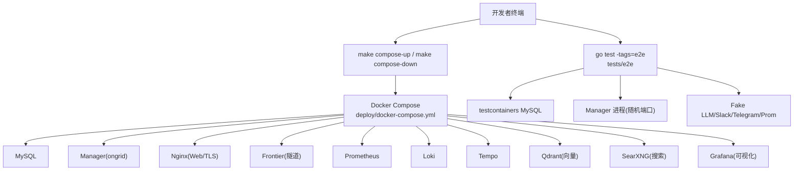
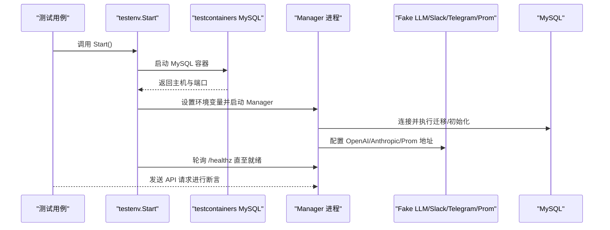
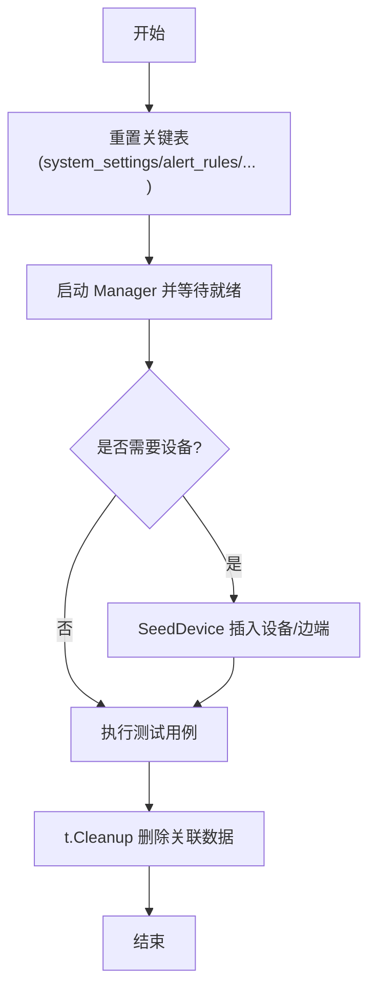
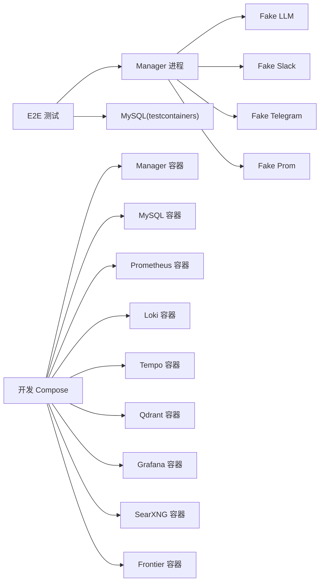

# 测试环境

<cite>
**本文引用的文件**
- [deploy/docker-compose.yml](file://deploy/docker-compose.yml)
- [deploy/install/docker-compose.yml](file://deploy/install/docker-compose.yml)
- [Makefile](file://Makefile)
- [tests/e2e/README.md](file://tests/e2e/README.md)
- [tests/e2e/main_test.go](file://tests/e2e/main_test.go)
- [tests/e2e/testenv/env.go](file://tests/e2e/testenv/env.go)
- [tests/e2e/testenv/fakes.go](file://tests/e2e/testenv/fakes.go)
- [tests/e2e/testenv/secrets.go](file://tests/e2e/testenv/secrets.go)
- [scripts/test-compose-release-package.sh](file://scripts/test-compose-release-package.sh)
- [db/README.md](file://db/README.md)
- [internal/pkg/dbx/migrate.go](file://internal/pkg/dbx/migrate.go)
</cite>

## 目录
1. [简介](#简介)
2. [项目结构](#项目结构)
3. [核心组件](#核心组件)
4. [架构总览](#架构总览)
5. [详细组件分析](#详细组件分析)
6. [依赖关系分析](#依赖关系分析)
7. [性能考虑](#性能考虑)
8. [故障排查指南](#故障排查指南)
9. [结论](#结论)
10. [附录](#附录)

## 简介
本文件面向“测试环境”的搭建、配置与运维，覆盖开发、测试、生产三类环境的差异；说明测试数据的准备与管理策略（种子数据、用例数据、动态数据）；给出测试服务（数据库、缓存/向量库、日志与追踪后端、外部依赖）的自动化启动与停止方案；提供基于 Docker Compose 的服务编排与使用指南；阐述测试隔离机制（数据、网络、资源限制）；并给出常见问题的故障排查与性能优化建议。

## 项目结构
仓库围绕“本地开发”和“生产安装”两套 Compose 编排展开：
- 开发环境：deploy/docker-compose.yml，用于本地联调与 E2E 测试支撑，包含 MySQL、Manager、Nginx、Frontier、Prometheus、Loki、Tempo、SearXNG、Qdrant、Grafana 等。
- 生产环境：deploy/install/docker-compose.yml，用于发布包内的一键部署，强调安全、可观测性与可维护性。
- 测试框架：tests/e2e 通过 testcontainers 拉起 MySQL，并以进程方式运行 Manager，配合内置 Fake LLM/Slack/Telegram/Prom 等实现稳定、快速、无凭据的端到端测试。
- 构建与命令：Makefile 统一了 build/test/compose/run/package 等入口，便于 CI 与本地一致执行。

图表来源
- [deploy/docker-compose.yml:13-367](file://deploy/docker-compose.yml#L13-L367)
- [tests/e2e/testenv/env.go:95-200](file://tests/e2e/testenv/env.go#L95-L200)

章节来源
- [deploy/docker-compose.yml:1-37](file://deploy/docker-compose.yml#L1-L37)
- [deploy/install/docker-compose.yml:1-19](file://deploy/install/docker-compose.yml#L1-L19)
- [Makefile:187-192](file://Makefile#L187-L192)
- [tests/e2e/README.md:7-55](file://tests/e2e/README.md#L7-L55)

## 核心组件
- 数据库：MySQL（开发与生产均默认），E2E 通过 testcontainers 启动单实例共享容器，并在每个测试前清理关键表，避免跨用例污染。
- 管理器（Manager）：以进程方式在 E2E 中启动，绑定随机回环端口，等待健康检查就绪后对外暴露 API。
- 可观测性：Prometheus（指标）、Loki（日志）、Tempo（链路）在开发/生产 Compose 中作为独立服务；E2E 用 HTTP Fake 替代真实服务。
- 向量检索：Qdrant 用于知识库/RAG；E2E 默认不启用或走本地嵌入路径。
- Web/Nginx：前端 SPA + TLS 终止 + /api 反向代理；生产通过 install 脚本生成 .env 并拉取镜像。
- 隧道：Frontier 作为上游 broker；E2E 默认禁用 Frontier，edge 侧流程通过 in-process handler 模拟。
- 搜索：SearXNG 为 web_search skill 提供元搜索聚合。
- 可视化：Grafana 集成 Prometheus/Loki/Tempo，支持匿名查看与内嵌面板。

章节来源
- [tests/e2e/testenv/env.go:95-200](file://tests/e2e/testenv/env.go#L95-L200)
- [tests/e2e/testenv/fakes.go:16-119](file://tests/e2e/testenv/fakes.go#L16-L119)
- [deploy/docker-compose.yml:13-367](file://deploy/docker-compose.yml#L13-L367)
- [deploy/install/docker-compose.yml:21-520](file://deploy/install/docker-compose.yml#L21-L520)

## 架构总览
下图展示 E2E 测试环境与开发 Compose 的整体交互：测试通过 testenv 启动 MySQL 与 Manager，并用 Fake 服务替代外部依赖；开发/生产则通过 Compose 编排完整栈。

图表来源
- [tests/e2e/testenv/env.go:95-200](file://tests/e2e/testenv/env.go#L95-L200)
- [tests/e2e/testenv/env.go:447-534](file://tests/e2e/testenv/env.go#L447-L534)
- [tests/e2e/testenv/fakes.go:16-119](file://tests/e2e/testenv/fakes.go#L16-L119)

## 详细组件分析

### 开发环境 vs 生产环境差异
- 镜像来源：开发从仓库上下文构建镜像；生产直接拉取版本化镜像。
- 端口暴露：开发将部分端口（如 MySQL、Prometheus、Grafana）映射到宿主机以便调试；生产仅暴露必要端口，内部服务通过 Compose 网络互通。
- 密钥管理：开发允许硬编码默认值；生产要求所有敏感项来自 .env，缺失时强制报错。
- 存储挂载：生产将所有状态数据 bind-mount 到宿主目录，便于备份与替换；开发使用命名卷或临时目录。
- 可观测性：生产开启更严格的日志轮转与保留策略，且通过 nginx 统一入口访问 Loki/Tempo。

章节来源
- [deploy/docker-compose.yml:1-12](file://deploy/docker-compose.yml#L1-L12)
- [deploy/install/docker-compose.yml:1-19](file://deploy/install/docker-compose.yml#L1-L19)
- [deploy/install/docker-compose.yml:21-520](file://deploy/install/docker-compose.yml#L21-L520)

### 测试数据准备与管理策略
- 种子数据：E2E 通过 SeedDevice 插入设备与边端关系，用于需要设备上下文的场景。
- 测试用例数据：每个测试通过登录获取 JWT，创建所需用户/规则/通知渠道等；测试结束后由 t.Cleanup 清理。
- 动态数据生成：Fake Prom 支持注入查询结果；Fake LLM 支持脚本化回复；Slack/Telegram 捕获入/出站消息。
- 数据隔离：共享 MySQL 容器，但每次 Start 前 DROP 关键表，避免跨用例泄漏；Manager 进程绑定随机端口，互不干扰。

图表来源
- [tests/e2e/testenv/env.go:447-534](file://tests/e2e/testenv/env.go#L447-L534)
- [tests/e2e/testenv/env.go:271-337](file://tests/e2e/testenv/env.go#L271-L337)

章节来源
- [tests/e2e/testenv/env.go:271-337](file://tests/e2e/testenv/env.go#L271-L337)
- [tests/e2e/testenv/fakes.go:439-559](file://tests/e2e/testenv/fakes.go#L439-L559)

### 测试服务的启动与停止管理
- 数据库：testcontainers 启动 MySQL 容器，进程退出时统一终止，避免资源泄漏。
- 管理器：按测试粒度启动进程，Stop 发送 SIGTERM，超时则 Kill；同时关闭 Fake 服务与数据库连接。
- 外部依赖：LLM/Slack/Telegram/Prom 均为内存中的 httptest.Server，随 Env.Stop 关闭。
- 生产/开发 Compose：通过 make compose-up/down 管理整套服务生命周期。

章节来源
- [tests/e2e/testenv/env.go:202-238](file://tests/e2e/testenv/env.go#L202-L238)
- [tests/e2e/main_test.go:12-22](file://tests/e2e/main_test.go#L12-L22)
- [Makefile:187-192](file://Makefile#L187-L192)

### 测试容器的使用指南（Docker Compose）
- 开发栈：
  - 启动：make compose-up
  - 停止：make compose-down
  - 主要服务：MySQL、Manager、Nginx、Frontier、Prometheus、Loki、Tempo、Qdrant、SearXNG、Grafana
- 生产栈：
  - 通过 release tarball 内的 install.sh 一键部署，自动渲染 .env、拉取镜像、启动服务
  - 所有状态数据 bind-mount 到宿主目录，便于备份与升级

章节来源
- [Makefile:187-192](file://Makefile#L187-L192)
- [deploy/docker-compose.yml:13-367](file://deploy/docker-compose.yml#L13-L367)
- [deploy/install/docker-compose.yml:1-19](file://deploy/install/docker-compose.yml#L1-L19)

### 测试隔离机制
- 数据隔离：共享 MySQL 容器，但在每次 Start 前 DROP 关键表；设备/边端数据在测试结束时清理。
- 网络隔离：E2E 使用 127.0.0.1 随机端口；Compose 服务间通过 ongrid_net 互通，生产不暴露内部端口。
- 资源限制：E2E 默认禁用 testcontainers reaper（macOS 稳定性），并通过 t.Cleanup 确保资源释放；生产通过日志轮转与存储大小限制控制资源。

章节来源
- [tests/e2e/testenv/env.go:447-534](file://tests/e2e/testenv/env.go#L447-L534)
- [deploy/docker-compose.yml:394-405](file://deploy/docker-compose.yml#L394-L405)
- [deploy/install/docker-compose.yml:46-51](file://deploy/install/docker-compose.yml#L46-L51)

## 依赖关系分析
E2E 对 Manager 的依赖最小化：仅需要 MySQL 与 Manager 二进制；其余外部依赖通过 Fake 替代。开发/生产 Compose 则依赖多个外部服务（Prometheus/Loki/Tempo/Qdrant/Grafana/SearXNG/Frontier）。

图表来源
- [tests/e2e/testenv/env.go:95-200](file://tests/e2e/testenv/env.go#L95-L200)
- [tests/e2e/testenv/fakes.go:16-119](file://tests/e2e/testenv/fakes.go#L16-L119)
- [deploy/docker-compose.yml:13-367](file://deploy/docker-compose.yml#L13-L367)

章节来源
- [tests/e2e/testenv/env.go:95-200](file://tests/e2e/testenv/env.go#L95-L200)
- [deploy/docker-compose.yml:13-367](file://deploy/docker-compose.yml#L13-L367)

## 性能考虑
- 数据库冷启动：MySQL 冷启动较慢，建议分配足够 Docker 内存；E2E 已增加超时与重试。
- Reaper 开销：macOS 上 testcontainers reaper 导致慢与不稳定，默认禁用；通过 t.Cleanup 保证回收。
- 日志与存储：生产环境启用 json-file 驱动与轮转策略，避免磁盘膨胀；Prometheus/Loki/Tempo 设置合理保留期。
- 模型与缓存：本地嵌入模型缓存于宿主目录，避免重复下载；E2E 使用 Fake LLM 减少外部依赖与延迟。

[本节为通用指导，不直接分析具体文件]

## 故障排查指南
- 无法连接 MySQL：确认 testcontainers 是否成功启动；检查端口映射与 DSN；首次启动可能因表不存在而 DROP 失败，属预期。
- Manager 未就绪：检查 /healthz 响应；若进程提前退出，查看 Manager 日志输出。
- 外部依赖不可达：E2E 默认使用 Fake；如需 live 模式，需配置 secrets.local.env 或通过环境变量注入。
- Compose 启动失败：核对 .env 必填项；生产安装脚本会校验 docker-compose.yml 与镜像清单。

章节来源
- [tests/e2e/testenv/env.go:585-604](file://tests/e2e/testenv/env.go#L585-L604)
- [tests/e2e/testenv/env.go:447-534](file://tests/e2e/testenv/env.go#L447-L534)
- [tests/e2e/README.md:18-29](file://tests/e2e/README.md#L18-L29)
- [deploy/install/docker-compose.yml:209-227](file://deploy/install/docker-compose.yml#L209-L227)

## 结论
本项目提供了完善的测试环境体系：E2E 通过 testcontainers 与 Fake 服务实现快速、稳定、无凭据的端到端验证；开发/生产通过 Compose 编排完整栈，满足联调与上线需求。数据隔离、网络隔离与资源限制策略确保了测试的可重复性与可靠性。结合 Makefile 的统一入口与脚本校验，可在本地与 CI 中保持一致的执行体验。

## 附录

### 常用命令与环境变量
- 运行 E2E：make test-e2e（默认 fakes）；make test-e2e-live（live 模式需 secrets）
- 启动/停止开发栈：make compose-up / make compose-down
- 数据库迁移：make migrate-up / make migrate-down（DB_DSN 可覆盖）

章节来源
- [Makefile:103-117](file://Makefile#L103-L117)
- [Makefile:157-162](file://Makefile#L157-L162)
- [tests/e2e/README.md:7-13](file://tests/e2e/README.md#L7-L13)

### 数据库迁移与初始化工具
- 生产使用 golang-migrate 管理版本化 SQL 迁移；本地/新装使用 GORM AutoMigrate 初始化空库。
- 迁移工具封装了顺序执行与错误定位，便于诊断慢迁移与失败点。

章节来源
- [db/README.md:1-15](file://db/README.md#L1-L15)
- [internal/pkg/dbx/migrate.go:12-46](file://internal/pkg/dbx/migrate.go#L12-L46)

### 发布包与 Compose 校验
- 发布脚本校验安装包内容、权限、镜像引用与升级前置条件，确保 Compose 与服务编排的正确性。

章节来源
- [scripts/test-compose-release-package.sh:1-214](file://scripts/test-compose-release-package.sh#L1-L214)