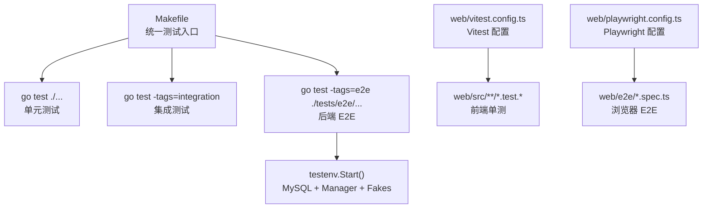
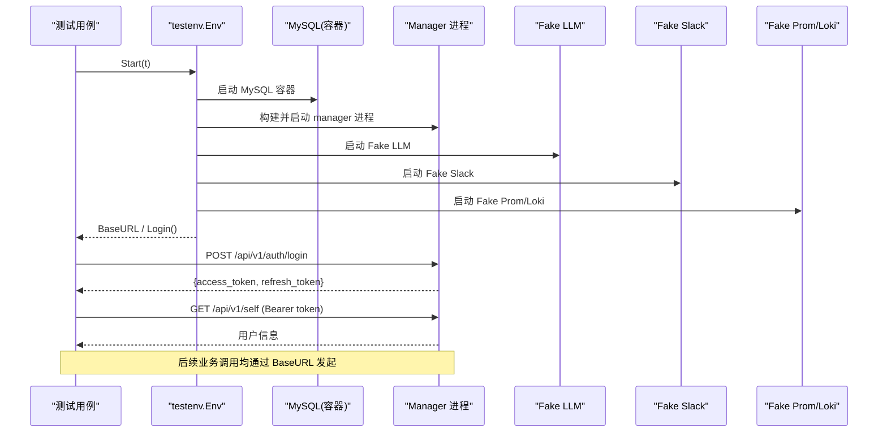
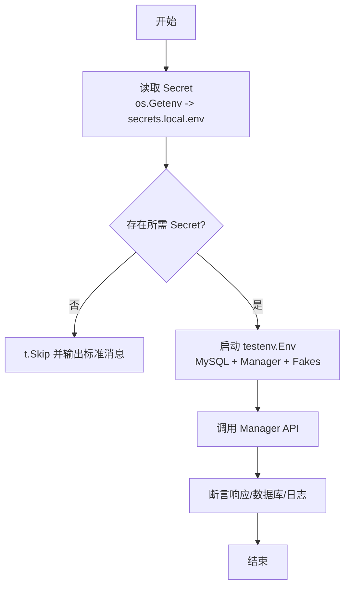
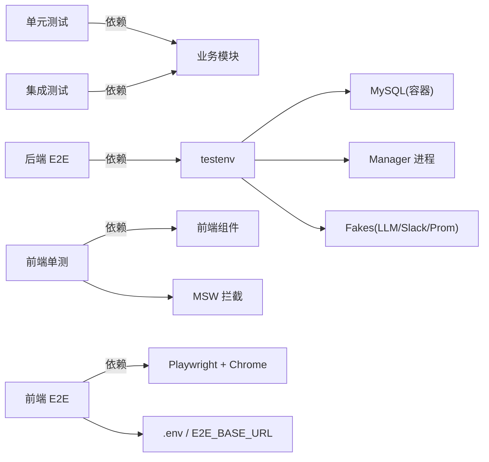

# 测试策略

<cite>
**本文引用的文件**
- [Makefile](file://Makefile)
- [tests/e2e/README.md](file://tests/e2e/README.md)
- [tests/e2e/testenv/env.go](file://tests/e2e/testenv/env.go)
- [tests/e2e/testenv/secrets.go](file://tests/e2e/testenv/secrets.go)
- [tests/e2e/auth_login_test.go](file://tests/e2e/auth_login_test.go)
- [web/playwright.config.ts](file://web/playwright.config.ts)
- [web/vitest.config.ts](file://web/vitest.config.ts)
- [web/src/test/setup.ts](file://web/src/test/setup.ts)
- [web/src/test/msw-server.ts](file://web/src/test/msw-server.ts)
- [docs/test/e2e-catalog.md](file://docs/test/e2e-catalog.md)
</cite>

## 目录
1. [简介](#简介)
2. [项目结构](#项目结构)
3. [核心组件](#核心组件)
4. [架构总览](#架构总览)
5. [详细组件分析](#详细组件分析)
6. [依赖关系分析](#依赖关系分析)
7. [性能与稳定性考量](#性能与稳定性考量)
8. [故障排查指南](#故障排查指南)
9. [结论](#结论)
10. [附录](#附录)

## 简介
本测试策略文档面向 Ongrid 项目的后端（Go）与前端（Web）全栈，覆盖单元测试、集成测试、端到端测试（E2E）、浏览器 E2E、测试环境搭建与管理、持续集成与覆盖率要求。目标是提供可执行的规范与最佳实践，确保测试套件稳定、可维护、可度量，并能在 CI 中快速反馈质量风险。

## 项目结构
仓库将测试按层次清晰划分：
- 后端单元测试与集成测试：位于各业务包下的 *_test.go，通过 Makefile 统一入口执行。
- 后端 E2E：位于 tests/e2e，使用 testcontainers + fakes 启动真实 manager 进程与 MySQL，外部服务以 httptest.Server 模拟。
- 前端单元测试：位于 web/src/**/*.test.{ts,tsx}，基于 Vitest + jsdom。
- 前端浏览器 E2E：位于 web/e2e，基于 Playwright，验证真实 UI 行为与请求载荷。

**图表来源**
- [Makefile:103-117](file://Makefile#L103-L117)
- [tests/e2e/testenv/env.go:90-200](file://tests/e2e/testenv/env.go#L90-L200)
- [web/vitest.config.ts:1-19](file://web/vitest.config.ts#L1-L19)
- [web/playwright.config.ts:1-68](file://web/playwright.config.ts#L1-L68)

**章节来源**
- [Makefile:103-117](file://Makefile#L103-L117)
- [tests/e2e/README.md:1-161](file://tests/e2e/README.md#L1-L161)
- [web/playwright.config.ts:1-68](file://web/playwright.config.ts#L1-L68)
- [web/vitest.config.ts:1-19](file://web/vitest.config.ts#L1-L19)

## 核心组件
- 后端测试编排与运行
  - 通过 Makefile 暴露 test、test-race、test-integration、test-e2e、test-e2e-live 等目标，统一入口，避免裸 go test。
  - 使用 Go build tags 隔离 e2e 与 integration，保证默认测试快速且无外部依赖。
- 后端 E2E 测试框架
  - testenv.Env：封装 MySQL 容器、manager 二进制启动、fakes（LLM、Slack、Telegram、Prom/Loki），并提供 HTTP 助手与登录流程。
  - secrets 管理：RequireSecret 模式，优先从环境变量读取，其次从 secrets.local.env，缺失时 t.Skip，避免泄露与失败。
- 前端测试工具链
  - Vitest：jsdom 环境，全局 setup 注入 MSW server，严格未处理请求报错，保障测试确定性。
  - Playwright：本地 Chrome，支持截图/视频/trace，读写 .env 与 E2E_BASE_URL，分离 setup 与用例项目。

**章节来源**
- [Makefile:103-117](file://Makefile#L103-L117)
- [tests/e2e/testenv/env.go:29-200](file://tests/e2e/testenv/env.go#L29-L200)
- [tests/e2e/testenv/secrets.go:51-87](file://tests/e2e/testenv/secrets.go#L51-L87)
- [web/src/test/setup.ts:1-29](file://web/src/test/setup.ts#L1-L29)
- [web/playwright.config.ts:1-68](file://web/playwright.config.ts#L1-L68)

## 架构总览
下图展示后端 E2E 的运行时架构：测试驱动通过 testenv 启动 MySQL、manager 进程与多个 httptest.Server 作为外部服务替身；测试通过 HTTP 调用 manager API 进行断言。

**图表来源**
- [tests/e2e/testenv/env.go:90-200](file://tests/e2e/testenv/env.go#L90-L200)
- [tests/e2e/auth_login_test.go:15-43](file://tests/e2e/auth_login_test.go#L15-L43)

## 详细组件分析

### 后端单元测试与集成测试规范
- 编写原则
  - 每个业务逻辑或工具函数应有对应 *_test.go，覆盖正常路径与异常路径。
  - 使用接口与依赖注入，便于在测试中替换为 mock/fake。
  - 对并发相关代码使用 -race 检测（make test-race）。
  - 集成测试通过 build tag isolation，避免污染默认测试集。
- 示例参考
  - 认证登录链路：[auth_login_test.go:15-43](file://tests/e2e/auth_login_test.go#L15-L43) 展示了如何借助 testenv 完成登录与鉴权断言。
  - 报告生成与投递：report generator/delivery 的测试覆盖了成功、失败、手动报告不投递等分支。
  - 指标回调：metrics handler 测试验证了计数器与复用注册器。

**章节来源**
- [Makefile:103-117](file://Makefile#L103-L117)
- [tests/e2e/auth_login_test.go:15-43](file://tests/e2e/auth_login_test.go#L15-L43)

### 后端 E2E 测试设计与实现
- 环境与数据
  - 共享 MySQL 容器（testcontainers-go），每进程一次，测试间通过清理关键表避免状态泄漏。
  - manager 二进制构建一次缓存，每次 Start 随机端口启动新进程，健康检查等待 ready。
  - 外部服务全部以 httptest.Server 模拟（LLM、Slack、Telegram、Prom/Loki），无需真实凭据。
- 秘密管理与 Live Mode
  - RequireSecret 模式：优先读环境变量，其次 secrets.local.env，缺失则 t.Skip，输出统一提示。
  - live mode 开关：E2E_LIVE_ALL=1 或 E2E_LIVE_SLACK=1 等，仅当具备相应 secret 时才连通真实服务。
- 测试组织
  - 遵循 docs/test/e2e-catalog.md 的编号化用例，一个文件一条用例，便于回归定位与并行执行。
  - 使用 testenv.DoJSON/LoginAdmin 等助手简化 HTTP 调用与鉴权。

**图表来源**
- [tests/e2e/testenv/secrets.go:51-87](file://tests/e2e/testenv/secrets.go#L51-L87)
- [tests/e2e/testenv/env.go:90-200](file://tests/e2e/testenv/env.go#L90-L200)

**章节来源**
- [tests/e2e/README.md:1-161](file://tests/e2e/README.md#L1-L161)
- [docs/test/e2e-catalog.md:1-228](file://docs/test/e2e-catalog.md#L1-L228)
- [tests/e2e/testenv/env.go:90-200](file://tests/e2e/testenv/env.go#L90-L200)
- [tests/e2e/testenv/secrets.go:51-87](file://tests/e2e/testenv/secrets.go#L51-L87)

### 前端单元测试（Vitest + MSW）
- 配置要点
  - vitest.config.ts 继承 vite 配置，启用 jsdom 环境，setupFiles 注入 MSW server。
  - setup.ts 中全局监听 MSW，未处理请求直接报错，防止静默挂起；修复 Node 22+ localStorage 兼容问题。
- 最佳实践
  - 每个测试注册局部 handlers，保持 fixture 与断言一一对应。
  - 使用 @testing-library/jest-dom 增强断言能力。
  - 关闭 CSS 解析以提升速度。

**章节来源**
- [web/vitest.config.ts:1-19](file://web/vitest.config.ts#L1-L19)
- [web/src/test/setup.ts:1-29](file://web/src/test/setup.ts#L1-L29)
- [web/src/test/msw-server.ts:1-6](file://web/src/test/msw-server.ts#L1-L6)

### 前端浏览器 E2E（Playwright）
- 配置要点
  - playwright.config.ts 定义 baseURL、浏览器通道、重试策略、截图/视频/trace 保留策略。
  - 分离 setup 项目（auth.setup.ts）用于登录态持久化，主项目依赖 setup 并使用 storageState。
  - 自动加载 deploy/.env（若存在），支持 E2E_BASE_URL 覆盖目标地址。
- 实践建议
  - 写操作通过浏览器侧 API stub 拦截，避免修改本地数据。
  - 只读导航与资源视图走真实环境，验证 UI 渲染与交互。

**章节来源**
- [web/playwright.config.ts:1-68](file://web/playwright.config.ts#L1-L68)

## 依赖关系分析
- 测试层依赖
  - 后端 E2E 依赖 MySQL 容器、manager 二进制、fakes（LLM/Slack/Telegram/Prom/Loki）。
  - 前端单测依赖 Vitest、jsdom、MSW。
  - 前端 E2E 依赖 Playwright、Chrome、可选 .env。
- 耦合与内聚
  - testenv 高内聚地封装了环境启动与清理，降低测试用例复杂度。
  - MSW 将网络依赖解耦到测试层，提高前端单测稳定性。
- 外部依赖
  - 通过 build tags 与 RequireSecret 控制外部服务接入，默认离线运行，CI 安全可控。

**图表来源**
- [tests/e2e/testenv/env.go:90-200](file://tests/e2e/testenv/env.go#L90-L200)
- [web/vitest.config.ts:1-19](file://web/vitest.config.ts#L1-L19)
- [web/playwright.config.ts:1-68](file://web/playwright.config.ts#L1-L68)

**章节来源**
- [tests/e2e/testenv/env.go:90-200](file://tests/e2e/testenv/env.go#L90-L200)
- [web/vitest.config.ts:1-19](file://web/vitest.config.ts#L1-L19)
- [web/playwright.config.ts:1-68](file://web/playwright.config.ts#L1-L68)

## 性能与稳定性考量
- 后端 E2E
  - 共享 MySQL 容器减少启动开销；通过 startMu 序列化 schema 初始化，避免竞争。
  - 禁用 testcontainers ryuk 以减少 macOS 上的不稳定因素，由 t.Cleanup 显式回收。
  - 健康检查轮询 /healthz，超时保护避免长时间阻塞。
- 前端测试
  - Vitest 关闭 CSS 解析提升速度；MSW 严格未处理请求，避免假阳性。
  - Playwright 限制 workers=1，减少资源争用；仅在失败时保留截图/视频/trace。

**章节来源**
- [tests/e2e/testenv/env.go:419-534](file://tests/e2e/testenv/env.go#L419-L534)
- [tests/e2e/testenv/env.go:585-604](file://tests/e2e/testenv/env.go#L585-L604)
- [web/vitest.config.ts:1-19](file://web/vitest.config.ts#L1-L19)
- [web/playwright.config.ts:13-34](file://web/playwright.config.ts#L13-L34)

## 故障排查指南
- 后端 E2E 启动失败
  - Docker 内存不足导致 MySQL 冷启动慢：适当增加 Docker Desktop 内存分配。
  - 健康检查超时：查看 Manager 日志（env.ManagerLogs()），确认依赖服务可用。
- 外部服务 Live Mode 跳过
  - 缺少 Secret：检查环境变量或 tests/e2e/secrets.local.env；遵循 RequireSecret 的标准跳过消息。
- 前端单测失败
  - localStorage 不可用：确保 setup.ts 已注入内存实现。
  - 未处理的 fetch：检查 MSW handlers 是否覆盖所有请求。
- 浏览器 E2E 失败
  - 浏览器通道或 baseURL 配置错误：调整 E2E_BROWSER_CHANNEL 或 E2E_BASE_URL。
  - 登录态丢失：确认 setup 项目正确生成 auth.json 并被主项目引用。

**章节来源**
- [tests/e2e/README.md:18-30](file://tests/e2e/README.md#L18-L30)
- [tests/e2e/testenv/env.go:240-257](file://tests/e2e/testenv/env.go#L240-L257)
- [tests/e2e/testenv/secrets.go:75-87](file://tests/e2e/testenv/secrets.go#L75-L87)
- [web/src/test/setup.ts:5-22](file://web/src/test/setup.ts#L5-L22)
- [web/playwright.config.ts:27-49](file://web/playwright.config.ts#L27-L49)

## 结论
本项目建立了分层清晰、可重复执行的测试体系：
- 单元测试与集成测试通过 build tags 隔离，默认快速运行。
- 后端 E2E 通过 testenv 统一管理真实进程与外部依赖替身，支持 live mode 按需打通真实服务。
- 前端采用 Vitest + MSW 保障单测稳定性，Playwright 验证真实 UI 行为。
- 通过 Makefile 统一入口与 catalog 化管理，便于扩展与维护。
建议在团队内推广本策略，逐步补齐 catalog 中的 P0/P1 用例，并在 CI 中固化覆盖率门禁。

## 附录
- 运行命令
  - 后端单元测试：make test
  - 带竞态检测：make test-race
  - 集成测试：make test-integration
  - 后端 E2E（默认 fakes）：make test-e2e
  - 后端 E2E（live mode）：make test-e2e-live
  - 前端单测：cd web && npm run test
  - 前端浏览器 E2E：cd web && npm run test:e2e

- 覆盖率与 CI
  - 当前仓库未内置覆盖率统计目标，建议在 CI 中为后端添加 go test -coverprofile，前端添加 vitest --coverage，并设置阈值门禁。
  - 建议将 e2e 与 live e2e 分阶段执行：PR 默认跑 fast path，nightly 跑 live 模式。

**章节来源**
- [Makefile:103-117](file://Makefile#L103-L117)
- [tests/e2e/README.md:7-16](file://tests/e2e/README.md#L7-L16)
- [web/playwright.config.ts:13-34](file://web/playwright.config.ts#L13-L34)