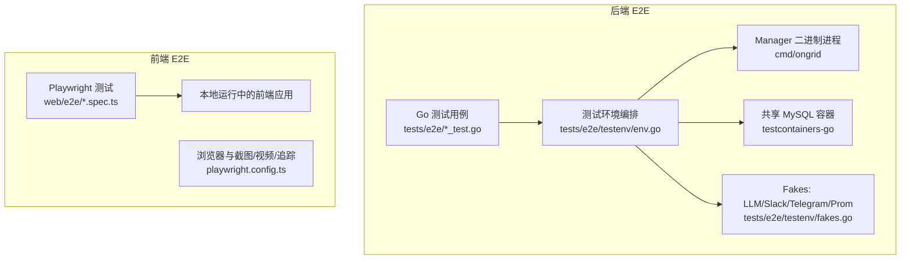
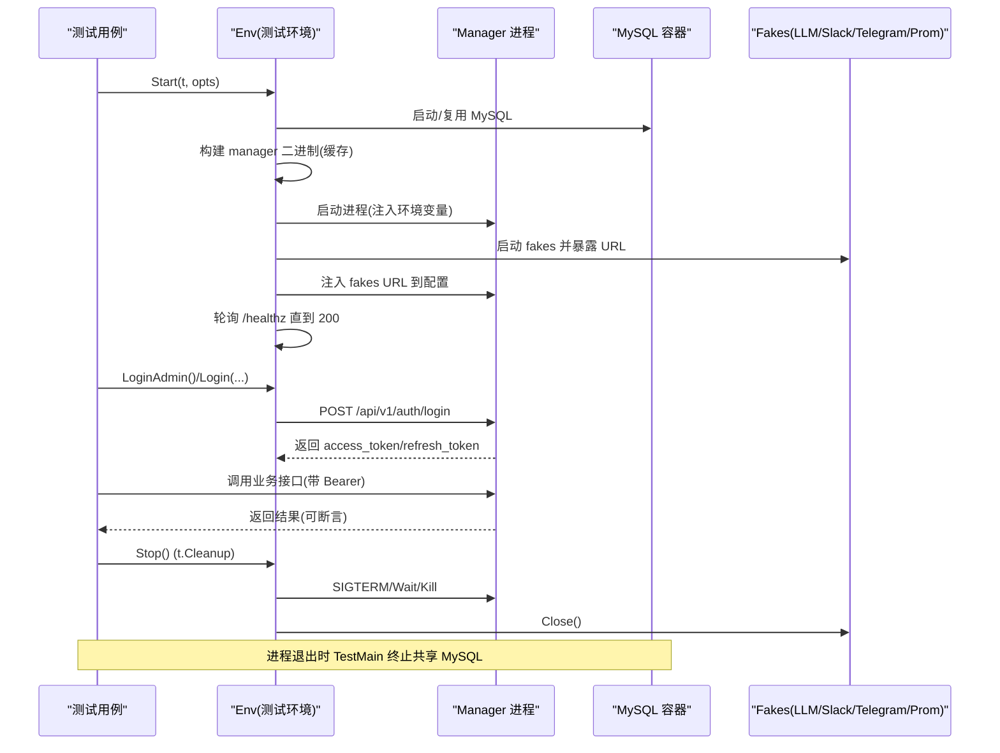
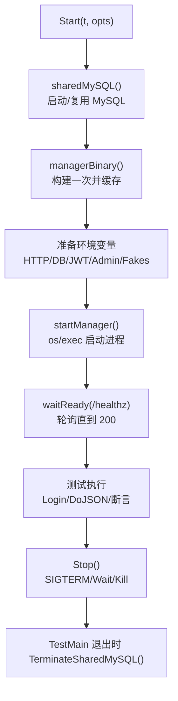
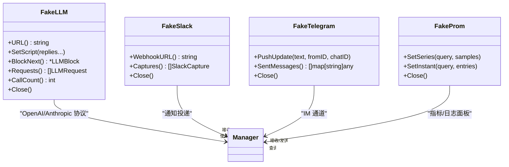
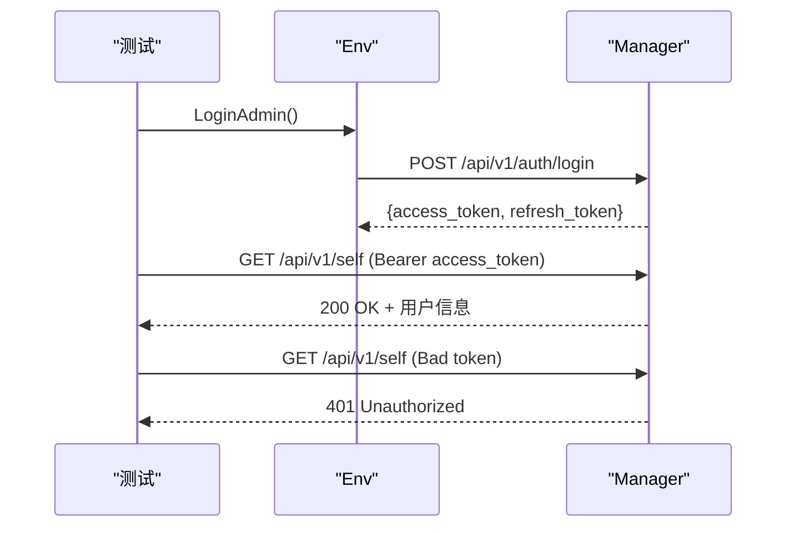
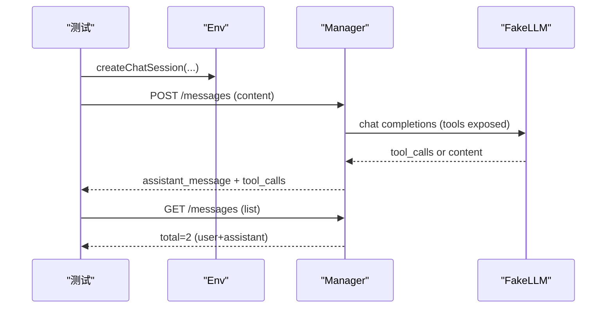
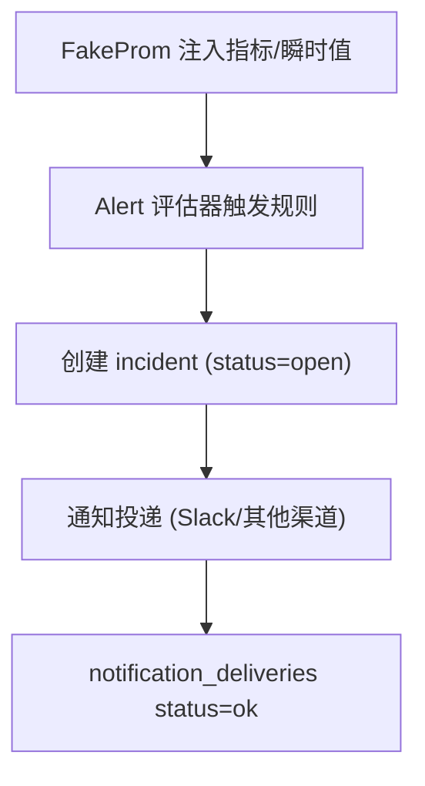
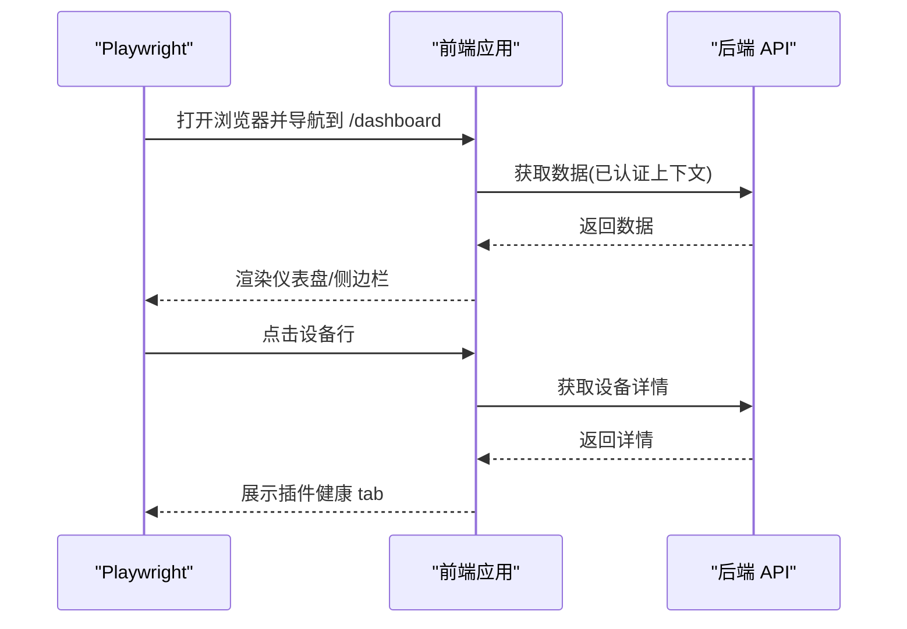
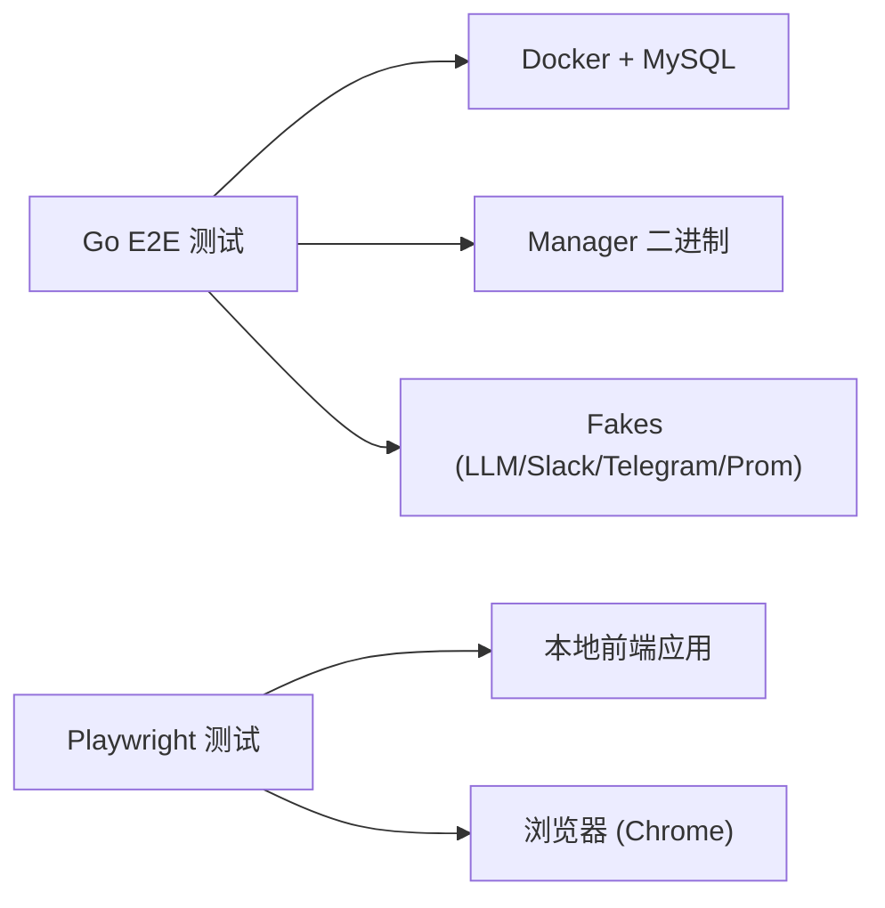

# 端到端测试

<cite>
**本文引用的文件**
- [tests/e2e/README.md](file://tests/e2e/README.md)
- [tests/e2e/main_test.go](file://tests/e2e/main_test.go)
- [tests/e2e/testenv/env.go](file://tests/e2e/testenv/env.go)
- [tests/e2e/testenv/fakes.go](file://tests/e2e/testenv/fakes.go)
- [tests/e2e/auth_login_test.go](file://tests/e2e/auth_login_test.go)
- [tests/e2e/assistant_chat_test.go](file://tests/e2e/assistant_chat_test.go)
- [web/e2e/README.md](file://web/e2e/README.md)
- [web/playwright.config.ts](file://web/playwright.config.ts)
- [web/e2e/live-navigation.spec.ts](file://web/e2e/live-navigation.spec.ts)
- [web/e2e/mocked-workflows.spec.ts](file://web/e2e/mocked-workflows.spec.ts)
- [docs/test/e2e-catalog.md](file://docs/test/e2e-catalog.md)
- [Makefile](file://Makefile)
</cite>

## 目录
1. [简介](#简介)
2. [项目结构](#项目结构)
3. [核心组件](#核心组件)
4. [架构总览](#架构总览)
5. [详细组件分析](#详细组件分析)
6. [依赖关系分析](#依赖关系分析)
7. [性能考虑](#性能考虑)
8. [故障排查指南](#故障排查指南)
9. [结论](#结论)
10. [附录](#附录)

## 简介
本文件面向 Ongrid 的端到端（E2E）测试，覆盖后端 Go 测试套件与前端 Playwright 浏览器测试。文档解释 E2E 的架构设计、执行流程、环境搭建、服务初始化、测试数据管理；并详细说明用户界面测试（页面导航、交互、状态验证）、业务流程测试（认证、AI 对话、告警处理）、测试环境配置与管理（环境变量、服务依赖、隔离），以及报告生成与性能基准实践。

## 项目结构
仓库包含两套 E2E：
- 后端 E2E：位于 tests/e2e，使用 Go 构建标签 e2e，通过 testcontainers 启动 MySQL，以真实 manager 二进制进程 + 内置 fakes（LLM、Slack、Telegram、Prometheus）完成端到端断言。
- 前端 E2E：位于 web/e2e，使用 Playwright 对本地运行的前端进行真实浏览器交互测试，支持路由渲染、工作流 UI 行为验证。

图表来源
- [tests/e2e/testenv/env.go:95-200](file://tests/e2e/testenv/env.go#L95-L200)
- [tests/e2e/testenv/fakes.go:102-117](file://tests/e2e/testenv/fakes.go#L102-L117)
- [web/playwright.config.ts:13-49](file://web/playwright.config.ts#L13-L49)

章节来源
- [tests/e2e/README.md:1-161](file://tests/e2e/README.md#L1-L161)
- [web/e2e/README.md:1-17](file://web/e2e/README.md#L1-L17)

## 核心组件
- 测试环境编排器 Env：负责启动 MySQL、构建并启动 manager 进程、注入环境变量、等待健康检查就绪、提供登录与 HTTP 请求辅助方法、清理资源。
- Fakes 层：FakeLLM、FakeSlack、FakeTelegram、FakeProm，模拟外部服务，使 E2E 无需真实凭据即可稳定运行。
- 测试入口与生命周期：TestMain 负责在进程退出时终止共享 MySQL 容器，避免资源泄漏。
- 前端 E2E：Playwright 项目配置、认证 setup、路由与工作流测试脚本。

章节来源
- [tests/e2e/testenv/env.go:29-69](file://tests/e2e/testenv/env.go#L29-L69)
- [tests/e2e/testenv/fakes.go:16-117](file://tests/e2e/testenv/fakes.go#L16-L117)
- [tests/e2e/main_test.go:1-23](file://tests/e2e/main_test.go#L1-L23)
- [web/playwright.config.ts:13-49](file://web/playwright.config.ts#L13-L49)

## 架构总览
后端 E2E 的执行流程如下：
- 每个测试调用 testenv.Start(t, opts...)，内部会：
  - 获取或创建共享 MySQL 容器（单进程内复用）。
  - 构建一次 manager 二进制（缓存路径）。
  - 为每个测试启动独立的 manager 进程，绑定随机端口，设置数据库 DSN、JWT Secret、管理员账号、各集成地址（Prom/Loki/Trace 关闭或指向 fakes）。
  - 启动 FakeLLM、FakeSlack、FakeTelegram、FakeProm，并将对应 URL 注入 manager 环境变量。
  - 轮询 /healthz 直到返回 200。
- 测试通过 Env.LoginAdmin() 或 Login(email, password) 获取 JWT，再调用 DoJSON(method, path, body, bearer) 访问 API 并断言响应。
- 测试结束时通过 t.Cleanup(env.Stop) 停止 manager 进程与 fakes，并在进程退出时由 TestMain 终止共享 MySQL。

图表来源
- [tests/e2e/testenv/env.go:95-200](file://tests/e2e/testenv/env.go#L95-L200)
- [tests/e2e/testenv/env.go:569-604](file://tests/e2e/testenv/env.go#L569-L604)
- [tests/e2e/main_test.go:12-22](file://tests/e2e/main_test.go#L12-L22)

章节来源
- [tests/e2e/testenv/env.go:95-200](file://tests/e2e/testenv/env.go#L95-L200)
- [tests/e2e/testenv/env.go:569-604](file://tests/e2e/testenv/env.go#L569-L604)
- [tests/e2e/main_test.go:12-22](file://tests/e2e/main_test.go#L12-L22)

## 详细组件分析

### 测试环境与数据管理
- 共享 MySQL：通过 testcontainers-go 启动 mysql:8.0，单进程内只启动一次，DSN 指向 ongrid schema。每次 Start 前会 DROP 关键表（system_settings、alert_rules、alert_incidents、alert_events、chat_*、audit_events、users、orgs、memberships、user_agents），保证测试隔离。
- Manager 进程：每 Start 一个独立进程，监听随机 loopback 端口，注入 ONGRID_HTTP_ADDR、ONGRID_DB_DSN、JWT_SECRET、ADMIN_EMAIL/PASSWORD、PUBLIC_URL、PROM/Loki/Trace 开关或 fakes URL、AGENT_KERNEL=graph、BUILTIN_AGENTS_ROOT、BUILTIN_SKILLS_ROOT、FRONTIER_DISABLED=true 等。
- 设备夹具：SeedDevice 插入 devices、edges、edge_devices 行，并注册清理回调删除关联数据。
- HTTP 助手：DoJSON 统一发送 JSON 请求并解析响应；Login/LoginAdmin 封装登录流程。

图表来源
- [tests/e2e/testenv/env.go:95-200](file://tests/e2e/testenv/env.go#L95-L200)
- [tests/e2e/testenv/env.go:454-534](file://tests/e2e/testenv/env.go#L454-L534)
- [tests/e2e/testenv/env.go:569-604](file://tests/e2e/testenv/env.go#L569-L604)
- [tests/e2e/main_test.go:12-22](file://tests/e2e/main_test.go#L12-L22)

章节来源
- [tests/e2e/testenv/env.go:95-200](file://tests/e2e/testenv/env.go#L95-L200)
- [tests/e2e/testenv/env.go:454-534](file://tests/e2e/testenv/env.go#L454-L534)
- [tests/e2e/testenv/env.go:569-604](file://tests/e2e/testenv/env.go#L569-L604)
- [tests/e2e/main_test.go:12-22](file://tests/e2e/main_test.go#L12-L22)

### Fakes 层（LLM/Slack/Telegram/Prom）
- FakeLLM：实现 OpenAI / Anthropic 兼容的 chat completions/messages 接口，支持脚本化回复、工具调用、模型参数记录、阻塞下一个调用以测试 stop 能力。
- FakeSlack：捕获所有 webhook POST，返回 200 ok，便于断言 payload 形状（attachments、签名等）。
- FakeTelegram：模拟 getUpdates/sendMessage/editMessageText，支持 PushUpdate 注入入站消息。
- FakeProm：模拟 query/query_range，支持注入瞬时向量与范围矩阵，供评估器触发规则。

图表来源
- [tests/e2e/testenv/fakes.go:16-117](file://tests/e2e/testenv/fakes.go#L16-L117)
- [tests/e2e/testenv/fakes.go:279-345](file://tests/e2e/testenv/fakes.go#L279-L345)
- [tests/e2e/testenv/fakes.go:347-437](file://tests/e2e/testenv/fakes.go#L347-L437)
- [tests/e2e/testenv/fakes.go:439-559](file://tests/e2e/testenv/fakes.go#L439-L559)

章节来源
- [tests/e2e/testenv/fakes.go:16-117](file://tests/e2e/testenv/fakes.go#L16-L117)
- [tests/e2e/testenv/fakes.go:279-345](file://tests/e2e/testenv/fakes.go#L279-L345)
- [tests/e2e/testenv/fakes.go:347-437](file://tests/e2e/testenv/fakes.go#L347-L437)
- [tests/e2e/testenv/fakes.go:439-559](file://tests/e2e/testenv/fakes.go#L439-L559)

### 认证流程测试（B1/B2/B3）
- B1：登录 → 获取 access+refresh → 用 access 调用受保护接口（如 /v1/self）→ 断言当前用户。
- B2：access 过期后 refresh → 新 access 可用。
- B3：三角色 RBAC（admin/user/viewer）权限校验。

图表来源
- [tests/e2e/auth_login_test.go:15-43](file://tests/e2e/auth_login_test.go#L15-L43)
- [tests/e2e/testenv/env.go:348-415](file://tests/e2e/testenv/env.go#L348-L415)

章节来源
- [tests/e2e/auth_login_test.go:15-43](file://tests/e2e/auth_login_test.go#L15-L43)
- [tests/e2e/testenv/env.go:348-415](file://tests/e2e/testenv/env.go#L348-L415)

### AI 对话流程测试（I1/I2/I3/I5）
- I1：创建会话 → 发消息 → 回复（user/assistant 持久化）。
- I2：流式回复（SSE）事件流持续并最终 done。
- I3：切换 provider（如 zhipu）后路由生效。
- I5：tool call（promql/logql/knowledge）→ tool result 进入 chat_messages role=tool。

图表来源
- [tests/e2e/assistant_chat_test.go:29-95](file://tests/e2e/assistant_chat_test.go#L29-L95)
- [tests/e2e/testenv/fakes.go:169-254](file://tests/e2e/testenv/fakes.go#L169-L254)

章节来源
- [tests/e2e/assistant_chat_test.go:29-95](file://tests/e2e/assistant_chat_test.go#L29-L95)
- [tests/e2e/testenv/fakes.go:169-254](file://tests/e2e/testenv/fakes.go#L169-L254)

### 告警处理流程测试（E1/E3/G3）
- E1：metric_raw 规则 fire（PromQL）→ alert_incidents 行 status=open。
- E3：incident → notification 投递 → notification_deliveries status=ok。
- G3：Slack attachments 富格式断言（text、attachment color/fields/footer）。

图表来源
- [tests/e2e/testenv/fakes.go:439-559](file://tests/e2e/testenv/fakes.go#L439-L559)
- [tests/e2e/testenv/fakes.go:279-345](file://tests/e2e/testenv/fakes.go#L279-L345)

章节来源
- [tests/e2e/testenv/fakes.go:279-345](file://tests/e2e/testenv/fakes.go#L279-L345)
- [tests/e2e/testenv/fakes.go:439-559](file://tests/e2e/testenv/fakes.go#L439-L559)

### 用户界面测试（Playwright）
- 登录与工作台渲染：P1 登录 → 仪表盘可见、侧边栏导航项可见。
- 路由渲染：遍历多个路由，断言标题出现且无页面错误。
- 设备详情与插件健康：点击设备行 → 跳转详情页 → 插件 tab 显示 metrics/logs/traces/profiles。
- Kubernetes 集群详情：切换 Nodes/Workloads/Pods/Events/Namespaces/Actions 标签页。
- 拓扑视图：图谱/节点+关系/类型管理切换。
- 语言与主题：切换 en-US/light/dark，断言 Accept-Language 头变化与 html class 变化。
- 工作流 Mock：拦截 API 调用，验证表单提交数据与 UI 行为（创建告警规则、通知渠道、双向 IM 渠道）。

图表来源
- [web/e2e/live-navigation.spec.ts:8-108](file://web/e2e/live-navigation.spec.ts#L8-L108)
- [web/e2e/mocked-workflows.spec.ts:12-300](file://web/e2e/mocked-workflows.spec.ts#L12-L300)
- [web/playwright.config.ts:13-49](file://web/playwright.config.ts#L13-L49)

章节来源
- [web/e2e/live-navigation.spec.ts:8-108](file://web/e2e/live-navigation.spec.ts#L8-L108)
- [web/e2e/mocked-workflows.spec.ts:12-300](file://web/e2e/mocked-workflows.spec.ts#L12-L300)
- [web/playwright.config.ts:13-49](file://web/playwright.config.ts#L13-L49)

## 依赖关系分析
- 后端 E2E 依赖：
  - Docker 守护进程（用于 testcontainers）。
  - MySQL 8.0 镜像（通过 testcontainers 拉取）。
  - manager 二进制（由 go build ./cmd/ongrid 构建）。
  - Fakes 服务（in-process httptest.Server）。
- 前端 E2E 依赖：
  - 本地运行的前端应用（可通过 compose 或本地开发服务器）。
  - 浏览器（默认 Chrome，可通过 E2E_BROWSER_CHANNEL 覆盖）。
  - 环境变量（ONGRID_ADMIN_EMAIL、ONGRID_ADMIN_PASSWORD、E2E_BASE_URL）。

图表来源
- [tests/e2e/README.md:18-55](file://tests/e2e/README.md#L18-L55)
- [web/e2e/README.md:1-17](file://web/e2e/README.md#L1-L17)
- [web/playwright.config.ts:13-49](file://web/playwright.config.ts#L13-L49)

章节来源
- [tests/e2e/README.md:18-55](file://tests/e2e/README.md#L18-L55)
- [web/e2e/README.md:1-17](file://web/e2e/README.md#L1-L17)
- [web/playwright.config.ts:13-49](file://web/playwright.config.ts#L13-L49)

## 性能考虑
- 默认 CI 仅运行 make test-e2e（fakes 模式，快速、无需 secret）。
- Live 模式（make test-e2e-live）需要 secrets.local.env 或环境变量，打通真实外部服务，适合夜间回归。
- 共享 MySQL 容器减少启动开销；manager 二进制构建缓存提升重复执行速度。
- 前端 E2E 使用 Playwright 的截图/视频/trace 仅在失败时保留，降低存储压力。
- 建议：
  - 合理设置 Docker Desktop 内存（≥4 GiB）以避免 MySQL 冷启动超时。
  - 使用 E2E_BASE_URL 指向稳定环境，避免网络抖动影响稳定性。
  - 对于长耗时场景（如 AI 对话、RCA），适当调整超时与重试策略。

[本节为通用指导，不直接分析具体文件]

## 故障排查指南
- MySQL 启动慢或超时：检查 Docker Desktop 内存分配；确认 TESTCONTAINERS_RYUK_DISABLED 默认禁用 ryuk 以减少 mac 侧延迟。
- Manager 未就绪：查看 waitReady 轮询 /healthz 的日志；必要时增加超时时间。
- 测试失败但无明确原因：使用 env.ManagerLogs() 输出 manager 进程 stdout/stderr 定位问题。
- 外部服务 live 模式跳过：确保 secrets.local.env 或环境变量正确设置；缺失时会 t.Skip 并给出清晰提示。
- 前端 E2E 报错：检查 playwright.config.ts 的 baseURL、浏览器 channel、忽略 HTTPS 错误；查看 output/playwright 下的 report/results.json 与失败截图/视频。

章节来源
- [tests/e2e/README.md:18-55](file://tests/e2e/README.md#L18-L55)
- [tests/e2e/testenv/env.go:585-611](file://tests/e2e/testenv/env.go#L585-L611)
- [web/playwright.config.ts:13-49](file://web/playwright.config.ts#L13-L49)

## 结论
Ongrid 的 E2E 体系通过“真实 manager + 丰富 fakes”的后端测试与“真实浏览器 + 工作流 mock”的前端测试，覆盖了认证、AI 对话、告警处理、通知渠道、UI 导航与交互等关键路径。测试环境具备强隔离性与可配置性，支持默认 fakes 与 live 模式切换，并提供完善的报告与调试能力。建议按 catalog 逐步补齐用例，保持高优先级场景的稳定回归。

[本节为总结，不直接分析具体文件]

## 附录

### 执行命令与环境变量
- 后端 E2E：
  - make test-e2e：默认 fakes，无需 secret。
  - make test-e2e-live：live 模式，需 secrets.local.env 或环境变量。
  - go test -tags=e2e ./tests/e2e/...：等价于 make test-e2e。
- 前端 E2E：
  - cd web && npm run test:e2e：运行 Playwright 测试。
  - 环境变量：E2E_BASE_URL、E2E_BROWSER_CHANNEL、ONGRID_ADMIN_EMAIL、ONGRID_ADMIN_PASSWORD。

章节来源
- [Makefile:103-117](file://Makefile#L103-L117)
- [web/e2e/README.md:1-17](file://web/e2e/README.md#L1-L17)

### 测试用例全集与进度
- 用例目录：docs/test/e2e-catalog.md，涵盖出厂安装、认证、边端、插件、告警、RCA、通知、聊天/AIOps、监控、知识库、技能/市场、Webshell、拓扑、系统设置、SPA 页面等。
- 当前实现：
  - 后端：B1（登录链路）、G3（Slack 富格式）、O1（敏感字段 reveal 权限）。
  - 前端：P1-P8（登录、告警详情、设备详情、规则创建、通知渠道、IM 渠道、locale/主题、摘要截断）。

章节来源
- [docs/test/e2e-catalog.md:1-228](file://docs/test/e2e-catalog.md#L1-L228)

### 报告与产物
- 后端：manager 进程日志可通过 env.ManagerLogs() 获取；测试失败时可结合 fakes 捕获的数据（如 Slack Captures、LLM Requests）定位问题。
- 前端：output/playwright/report（HTML）、results.json、失败截图/视频/trace。

章节来源
- [tests/e2e/testenv/env.go:242-251](file://tests/e2e/testenv/env.go#L242-L251)
- [tests/e2e/testenv/fakes.go:323-330](file://tests/e2e/testenv/fakes.go#L323-L330)
- [tests/e2e/testenv/fakes.go:157-167](file://tests/e2e/testenv/fakes.go#L157-L167)
- [web/playwright.config.ts:21-34](file://web/playwright.config.ts#L21-L34)