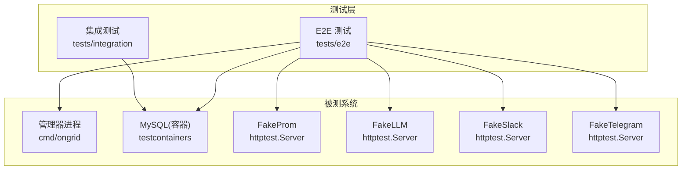
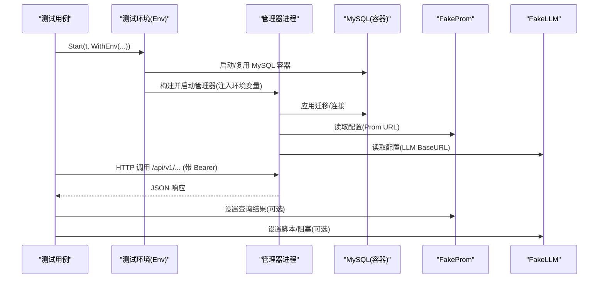
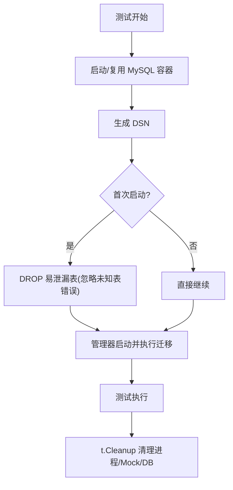
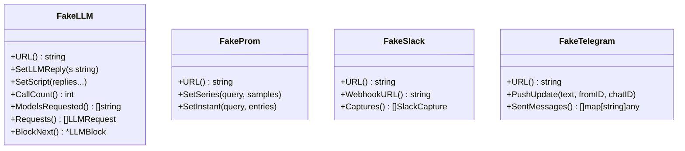
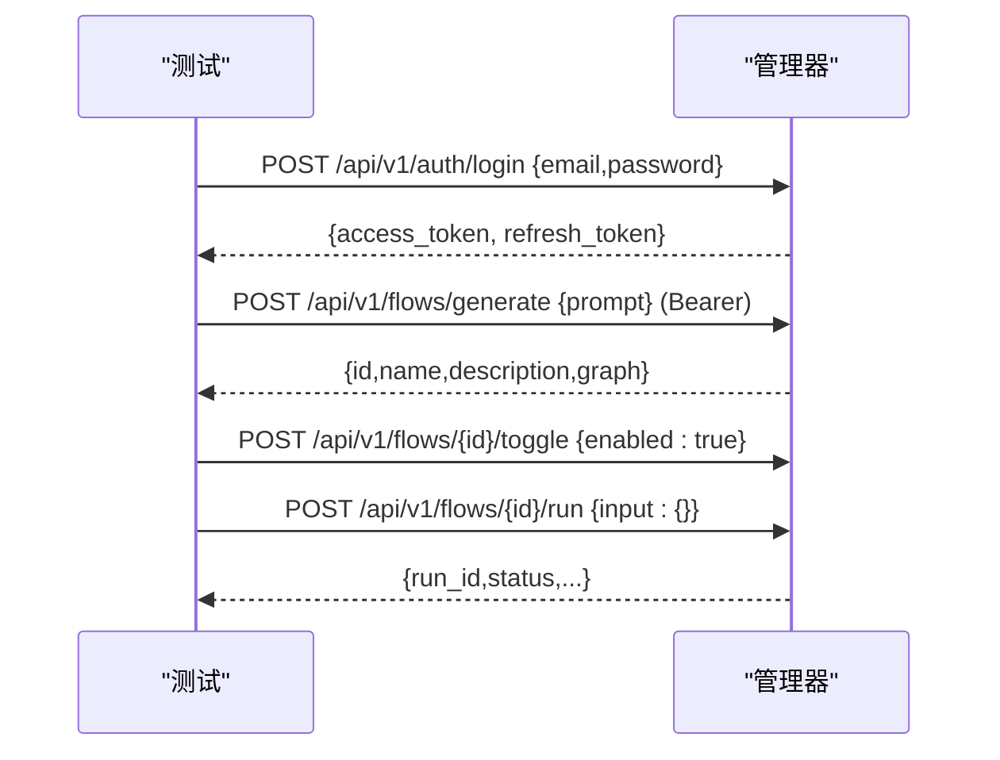
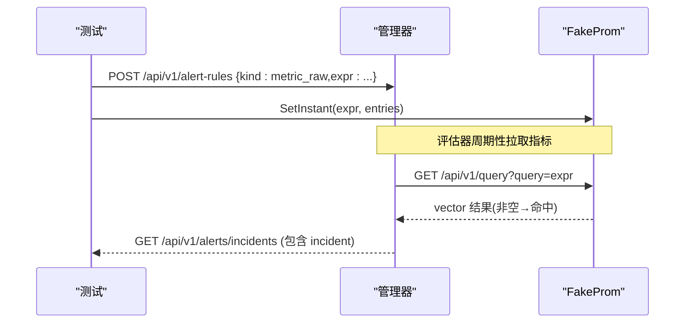
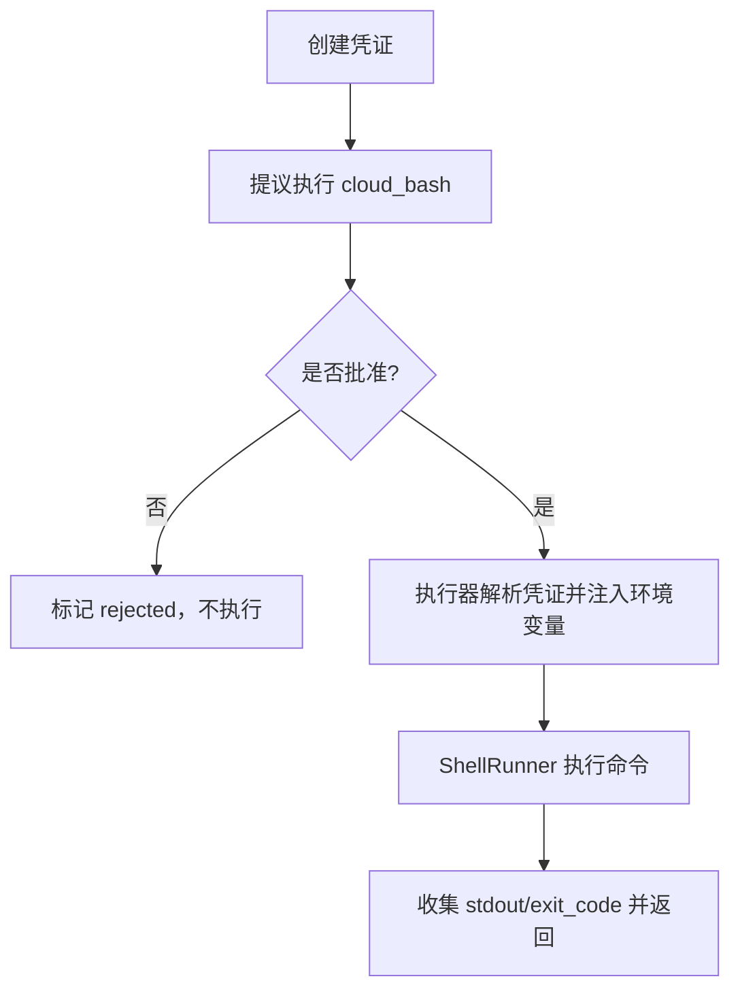
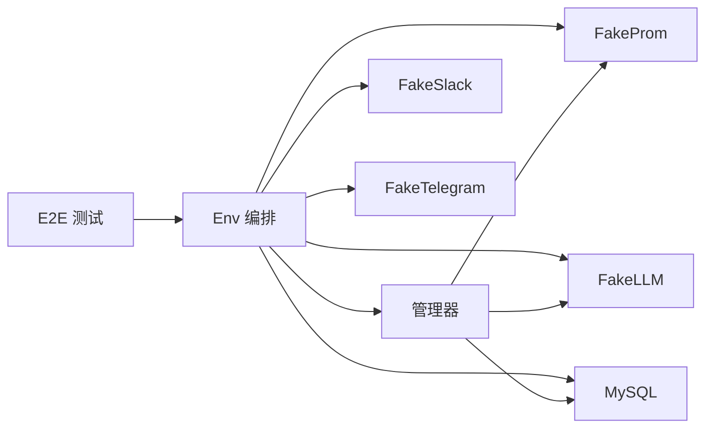

# 集成测试

<cite>
**本文引用的文件**
- [tests/e2e/main_test.go](file://tests/e2e/main_test.go)
- [tests/e2e/testenv/env.go](file://tests/e2e/testenv/env.go)
- [tests/e2e/testenv/fakes.go](file://tests/e2e/testenv/fakes.go)
- [tests/e2e/testenv/http.go](file://tests/e2e/testenv/http.go)
- [tests/e2e/alert_evaluator_test.go](file://tests/e2e/alert_evaluator_test.go)
- [tests/integration/cloudbash_chain_test.go](file://tests/integration/cloudbash_chain_test.go)
- [internal/pkg/dbx/migrate.go](file://internal/pkg/dbx/migrate.go)
- [internal/pkg/dbx/doc.go](file://internal/pkg/dbx/doc.go)
- [deploy/docker-compose.yml](file://deploy/docker-compose.yml)
</cite>

## 目录
1. [简介](#简介)
2. [项目结构](#项目结构)
3. [核心组件](#核心组件)
4. [架构总览](#架构总览)
5. [详细组件分析](#详细组件分析)
6. [依赖关系分析](#依赖关系分析)
7. [性能考量](#性能考量)
8. [故障排查指南](#故障排查指南)
9. [结论](#结论)
10. [附录](#附录)

## 简介
本文件面向“集成测试”主题，系统化说明该仓库的集成与端到端（E2E）测试设计原则、实现方式与最佳实践。内容覆盖：
- API 接口测试：通过 HTTP 调用管理端点，验证鉴权、路由与业务响应。
- 数据库集成测试：使用 Testcontainers 启动 MySQL，配合迁移与数据清理策略保证隔离性与可重复性。
- 外部服务模拟：提供 LLM、Prometheus、Slack、Telegram 等服务的本地 Mock，确保测试稳定可控。
- 微服务间通信测试：涵盖 gRPC/HTTP/消息队列交互的测试思路与实践。
- 告警管道、指标写入、HTTP 接口的具体示例。
- 测试环境配置与持续集成流程建议。

## 项目结构
测试代码主要分布在以下位置：
- tests/e2e：端到端测试套件，启动真实管理器进程 + 共享 MySQL + 多个 Mock 服务，覆盖认证、工作流、告警评估等场景。
- tests/integration：跨包链式测试，基于内存 SQLite 验证关键业务流程（如审批执行链）。
- internal/pkg/dbx：统一的迁移运行器，支持多后端（MySQL/SQLite），为集成测试提供一致的迁移能力。
- deploy/docker-compose.yml：本地开发栈编排，便于在 CI 或本地拉起完整依赖（MySQL、Prometheus、Loki、Tempo、Qdrant、Grafana 等）。

图表来源
- [tests/e2e/testenv/env.go:95-200](file://tests/e2e/testenv/env.go#L95-L200)
- [tests/e2e/testenv/fakes.go:102-119](file://tests/e2e/testenv/fakes.go#L102-L119)
- [tests/e2e/testenv/fakes.go:448-548](file://tests/e2e/testenv/fakes.go#L448-L548)

章节来源
- [tests/e2e/main_test.go:1-23](file://tests/e2e/main_test.go#L1-L23)
- [tests/e2e/testenv/env.go:1-200](file://tests/e2e/testenv/env.go#L1-L200)
- [deploy/docker-compose.yml:13-186](file://deploy/docker-compose.yml#L13-L186)

## 核心组件
- 测试环境编排（Env）：负责构建并启动管理器二进制、分配端口、注入环境变量、等待健康检查、注册清理逻辑。
- 共享数据库（MySQL 容器）：单进程内共享一个 MySQL 容器，按测试用例生命周期重置关键表，避免状态泄漏。
- 外部服务 Mock：
  - FakeLLM：模拟 OpenAI/Anthropic 聊天补全接口，支持脚本化回复、工具调用、请求拦截与阻塞释放。
  - FakeProm：模拟 Prometheus 查询接口（即时与范围查询），用于告警评估与指标面板。
  - FakeSlack/FakeTelegram：捕获通知通道入站/出站消息，便于断言通知内容与签名。
- HTTP 客户端封装：统一发送 JSON 请求、携带 Bearer Token、解析响应体，简化测试断言。
- 迁移与数据准备：通过 dbx.RunMigrations 统一执行各模块的 AutoMigrate；E2E 在启动前清空易泄漏表，保障幂等与隔离。

章节来源
- [tests/e2e/testenv/env.go:95-200](file://tests/e2e/testenv/env.go#L95-L200)
- [tests/e2e/testenv/env.go:447-534](file://tests/e2e/testenv/env.go#L447-L534)
- [tests/e2e/testenv/fakes.go:102-119](file://tests/e2e/testenv/fakes.go#L102-L119)
- [tests/e2e/testenv/fakes.go:448-548](file://tests/e2e/testenv/fakes.go#L448-L548)
- [internal/pkg/dbx/migrate.go:12-46](file://internal/pkg/dbx/migrate.go#L12-L46)
- [internal/pkg/dbx/doc.go:1-25](file://internal/pkg/dbx/doc.go#L1-L25)

## 架构总览
下图展示了 E2E 测试的典型调用链：测试驱动 Env 启动管理器进程，管理器连接 MySQL，并通过 HTTP 访问 Mock 的外部服务；测试通过 HTTP 调用管理端点进行断言。

图表来源
- [tests/e2e/testenv/env.go:95-200](file://tests/e2e/testenv/env.go#L95-L200)
- [tests/e2e/testenv/env.go:447-534](file://tests/e2e/testenv/env.go#L447-L534)
- [tests/e2e/testenv/fakes.go:102-119](file://tests/e2e/testenv/fakes.go#L102-L119)
- [tests/e2e/testenv/fakes.go:448-548](file://tests/e2e/testenv/fakes.go#L448-L548)

## 详细组件分析

### 测试环境与环境变量注入
- 进程模型：每个测试通过 Env.Start 启动独立的管理器进程，绑定随机回环端口；MySQL 容器在进程级共享，减少资源开销。
- 环境变量：集中注入 ONGRID_* 配置，包括 HTTP/Metrics/Tunnel 地址、数据库 DSN、JWT Secret、公共 URL、Prom/Loki/Trace 开关、Agent Kernel、Frontier 禁用标志等。
- 就绪检测：通过轮询 /healthz 等待管理器就绪，超时则失败；若进程提前退出，会输出日志辅助定位。
- 清理策略：t.Cleanup 中停止管理器进程、关闭 Mock 服务、关闭数据库连接；TestMain 在进程退出时终止共享 MySQL 容器，防止资源泄漏。

章节来源
- [tests/e2e/testenv/env.go:95-200](file://tests/e2e/testenv/env.go#L95-L200)
- [tests/e2e/testenv/env.go:202-238](file://tests/e2e/testenv/env.go#L202-L238)
- [tests/e2e/testenv/env.go:569-604](file://tests/e2e/testenv/env.go#L569-L604)
- [tests/e2e/main_test.go:12-22](file://tests/e2e/main_test.go#L12-L22)

### 数据库集成测试：容器、迁移与数据清理
- 容器化数据库：使用 testcontainers 启动 MySQL 8.0，创建 ongrid 库与用户，返回 DSN。
- 迁移机制：通过 dbx.RunMigrations 顺序执行各模块的 Migrator（AutoMigrate），支持 MySQL/SQLite，记录耗时便于诊断。
- 数据隔离：每次 Start 前 DROP 易泄漏的关键表（如 alert_rules、alert_incidents、users 等），避免跨测试污染。
- 设备夹具：提供 SeedDevice 插入设备与边节点，附带自动清理逻辑，便于需要设备上下文的测试。

图表来源
- [tests/e2e/testenv/env.go:447-534](file://tests/e2e/testenv/env.go#L447-L534)
- [internal/pkg/dbx/migrate.go:20-46](file://internal/pkg/dbx/migrate.go#L20-L46)

章节来源
- [tests/e2e/testenv/env.go:447-534](file://tests/e2e/testenv/env.go#L447-L534)
- [internal/pkg/dbx/migrate.go:12-46](file://internal/pkg/dbx/migrate.go#L12-L46)
- [internal/pkg/dbx/doc.go:1-25](file://internal/pkg/dbx/doc.go#L1-L25)

### 外部服务模拟：Mock 服务与服务虚拟化
- FakeLLM：
  - 提供 OpenAI 兼容的 /v1/chat/completions 与 Anthropic 的 /v1/messages。
  - 支持脚本化回复、工具调用、请求计数、模型参数追踪、阻塞下一个请求以便测试取消/中断路径。
- FakeProm：
  - 提供 /api/v1/query（即时向量）与 /api/v1/query_range（矩阵）两个端点。
  - 允许按精确查询字符串注入返回值，未命中返回空结果集，适配告警评估与面板查询。
- FakeSlack/FakeTelegram：
  - 捕获所有入站/出站消息，支持查询原始 Query、Headers、Body，便于断言签名与载荷。
  - Telegram 支持 PushUpdate 模拟上游推送，触发长轮询 getUpdates。

图表来源
- [tests/e2e/testenv/fakes.go:102-119](file://tests/e2e/testenv/fakes.go#L102-L119)
- [tests/e2e/testenv/fakes.go:448-548](file://tests/e2e/testenv/fakes.go#L448-L548)
- [tests/e2e/testenv/fakes.go:279-345](file://tests/e2e/testenv/fakes.go#L279-L345)
- [tests/e2e/testenv/fakes.go:347-437](file://tests/e2e/testenv/fakes.go#L347-L437)

章节来源
- [tests/e2e/testenv/fakes.go:102-119](file://tests/e2e/testenv/fakes.go#L102-L119)
- [tests/e2e/testenv/fakes.go:279-345](file://tests/e2e/testenv/fakes.go#L279-L345)
- [tests/e2e/testenv/fakes.go:347-437](file://tests/e2e/testenv/fakes.go#L347-L437)
- [tests/e2e/testenv/fakes.go:448-548](file://tests/e2e/testenv/fakes.go#L448-L548)

### API 接口测试：认证与工作流
- 登录与鉴权：通过 DoJSON 调用 /api/v1/auth/login，获取 access_token/refresh_token，后续请求携带 Bearer。
- 工作流生成与执行：向 /api/v1/flows/generate 提交自然语言提示，由 FakeLLM 返回确定性图结构，随后启用并运行工作流，断言节点执行结果。
- 通用 HTTP 助手：DoJSON 统一处理 JSON 编解码、Content-Type、Authorization 头与响应体解析。

图表来源
- [tests/e2e/testenv/env.go:348-415](file://tests/e2e/testenv/env.go#L348-L415)
- [tests/e2e/workflow_generate_test.go:19-67](file://tests/e2e/workflow_generate_test.go#L19-L67)
- [tests/e2e/workflow_test.go:75-135](file://tests/e2e/workflow_test.go#L75-L135)

章节来源
- [tests/e2e/testenv/env.go:348-415](file://tests/e2e/testenv/env.go#L348-L415)
- [tests/e2e/workflow_generate_test.go:19-67](file://tests/e2e/workflow_generate_test.go#L19-L67)
- [tests/e2e/workflow_test.go:75-135](file://tests/e2e/workflow_test.go#L75-L135)

### 告警管道测试：指标写入与评估
- 场景：创建 metric_raw 类型规则，表达式为 PromQL 谓词；通过 FakeProm.SetInstant 注入匹配项，使评估器判定为触发。
- 流程：管理员登录 → 创建规则 → 注入指标结果 → 等待评估周期 → 查询 incidents 列表断言存在对应 rule_key。
- 关键点：将评估间隔压短以加速测试；利用 PromQL 过滤语义（返回即命中）简化断言。

图表来源
- [tests/e2e/alert_evaluator_test.go:22-81](file://tests/e2e/alert_evaluator_test.go#L22-L81)
- [tests/e2e/testenv/fakes.go:488-548](file://tests/e2e/testenv/fakes.go#L488-L548)

章节来源
- [tests/e2e/alert_evaluator_test.go:22-81](file://tests/e2e/alert_evaluator_test.go#L22-L81)
- [tests/e2e/testenv/fakes.go:488-548](file://tests/e2e/testenv/fakes.go#L488-L548)

### 指标写入测试：远程写入与查询
- 本地栈：docker-compose 提供 Prometheus 作为云侧接收器，manager 可通过 remote_write 推送指标，aiops 工具可从 Prom 查询。
- 测试策略：在 E2E 中可使用 FakeProm 模拟查询；如需端到端验证 remote_write，可在 compose 环境中启动真实 Prometheus，结合网络隔离与端口映射进行断言。

章节来源
- [deploy/docker-compose.yml:228-260](file://deploy/docker-compose.yml#L228-L260)

### 消息队列与 gRPC 交互测试
- 消息队列（Frontier）：compose 中定义 frontier 服务，边缘侧通过隧道拨号到前端 broker；E2E 默认禁用 Frontier（ONGRID_FRONTIER_DISABLED=true），对需要该能力的测试通过 RequireSecret 门控跳过。
- gRPC：Tempo 暴露 OTLP gRPC 端口（仅内部可达），通过 nginx 反向代理对外提供安全访问；测试可通过内部网络或 Mock 验证链路。
- 最佳实践：
  - 对不可用或昂贵的外部服务使用 Mock（如 LLM、Prom、通知渠道）。
  - 对必须联调的服务使用容器化实例（MySQL、Prometheus、Loki、Tempo、Qdrant、Grafana）。
  - 通过环境变量控制功能开关，避免不必要的依赖。

章节来源
- [deploy/docker-compose.yml:214-227](file://deploy/docker-compose.yml#L214-L227)
- [deploy/docker-compose.yml:277-293](file://deploy/docker-compose.yml#L277-L293)
- [tests/e2e/testenv/env.go:141-186](file://tests/e2e/testenv/env.go#L141-L186)

### 集成测试示例：审批执行链（云 Bash）
- 目标：验证从凭证库解密 → 审批提议 → 人工批准 → 执行器注入凭证 → 子进程执行命令 → 结果回传的完整链路。
- 实现要点：
  - 使用内存 SQLite 存储，快速且隔离。
  - 注册与生产一致的 cloud_bash 执行器，注入环境变量后执行 ShellRunner。
  - 断言拒绝不会执行、批准后能正确注入并执行。

图表来源
- [tests/integration/cloudbash_chain_test.go:48-122](file://tests/integration/cloudbash_chain_test.go#L48-L122)
- [tests/integration/cloudbash_chain_test.go:124-150](file://tests/integration/cloudbash_chain_test.go#L124-L150)

章节来源
- [tests/integration/cloudbash_chain_test.go:33-46](file://tests/integration/cloudbash_chain_test.go#L33-L46)
- [tests/integration/cloudbash_chain_test.go:48-122](file://tests/integration/cloudbash_chain_test.go#L48-L122)
- [tests/integration/cloudbash_chain_test.go:124-150](file://tests/integration/cloudbash_chain_test.go#L124-L150)

## 依赖关系分析
- 测试对环境的强依赖：MySQL、Prometheus、Loki、Tempo、Qdrant、Grafana 等通过 docker-compose 编排；E2E 通过 testcontainers 按需启动 MySQL。
- 管理器对外部服务的解耦：通过环境变量注入 URL/开关，测试可替换为 Mock，降低耦合度。
- 迁移与数据层：dbx 统一迁移入口，保证不同后端一致行为；E2E 在启动前清理关键表，避免跨测试污染。

图表来源
- [tests/e2e/testenv/env.go:95-200](file://tests/e2e/testenv/env.go#L95-L200)
- [tests/e2e/testenv/fakes.go:102-119](file://tests/e2e/testenv/fakes.go#L102-L119)
- [tests/e2e/testenv/fakes.go:448-548](file://tests/e2e/testenv/fakes.go#L448-L548)

章节来源
- [tests/e2e/testenv/env.go:95-200](file://tests/e2e/testenv/env.go#L95-L200)
- [deploy/docker-compose.yml:13-186](file://deploy/docker-compose.yml#L13-L186)

## 性能考量
- 容器启动时间：MySQL 首次拉取镜像较慢，已设置较长超时；ryuk 回收被禁用以避免 macOS 上的不稳定因素，改用 t.Cleanup 手动回收。
- 评估周期压缩：通过缩短 ONGRID_ALERT_EVAL_INTERVAL 提升告警测试速度。
- 端口竞争：freePort 采用绑定 :0 的方式分配端口，存在极小概率竞争，但 waitReady 会在超时内发现并报错。
- 日志采集：Manager 的 stdout/stderr 被捕获，失败时可快速定位问题。

章节来源
- [tests/e2e/testenv/env.go:447-534](file://tests/e2e/testenv/env.go#L447-L534)
- [tests/e2e/testenv/env.go:585-604](file://tests/e2e/testenv/env.go#L585-L604)
- [tests/e2e/testenv/http.go:7-20](file://tests/e2e/testenv/http.go#L7-L20)

## 故障排查指南
- 管理器未就绪：waitReady 轮询 /healthz，若进程提前退出会报告退出码；同时 dump 管理器日志便于定位。
- 数据库连接失败：sharedMySQL 在首次启动时可能遇到 Unknown table 错误（首次清理），其他错误视为致命；检查 DSN 与容器健康。
- 端口冲突：freePort 可能产生短暂竞争，waitReady 会捕获 Listen 错误；必要时重试或调整并发。
- Mock 服务异常：检查 Fake* 的 URL 是否正确注入；确认 SetInstant/SetSeries 的查询字符串与管理器实际请求一致。
- 通知通道未生效：确认 FakeSlack/FakeTelegram 的 WebhookURL 或 Bot API URL 已写入配置；断言 Captures/SentMessages。

章节来源
- [tests/e2e/testenv/env.go:585-611](file://tests/e2e/testenv/env.go#L585-L611)
- [tests/e2e/testenv/env.go:447-534](file://tests/e2e/testenv/env.go#L447-L534)
- [tests/e2e/testenv/fakes.go:279-345](file://tests/e2e/testenv/fakes.go#L279-L345)
- [tests/e2e/testenv/fakes.go:347-437](file://tests/e2e/testenv/fakes.go#L347-L437)

## 结论
该项目的集成与 E2E 测试体系围绕“真实进程 + 容器化依赖 + 丰富 Mock”展开，既保证了接近生产的验证深度，又通过 Mock 与容器化实现了高稳定性与可重复性。通过统一的迁移器、严格的数据库清理策略以及完善的日志采集，测试具备较强的可维护性与可诊断性。建议在 CI 中沿用相同的环境编排与测试策略，以确保质量门禁的一致性。

## 附录
- 测试运行建议：
  - 本地开发：使用 docker-compose 拉起完整依赖栈；E2E 通过 go test -tags e2e 运行。
  - CI 环境：复用相同的 compose 配置与测试标签，确保环境与本地一致。
- 扩展建议：
  - 增加更多 Mock 服务（如第三方 SSO、对象存储）以提升覆盖率。
  - 引入并行测试与资源池管理，进一步缩短执行时间。
  - 完善告警与通知通道的端到端验证，结合真实或仿真后端。