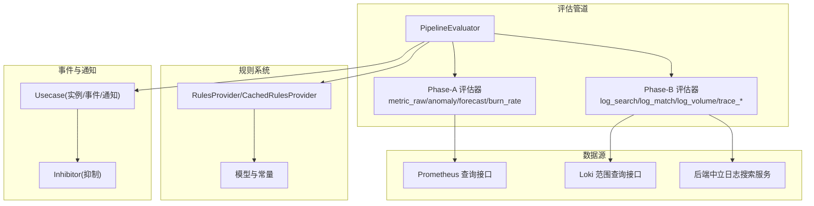
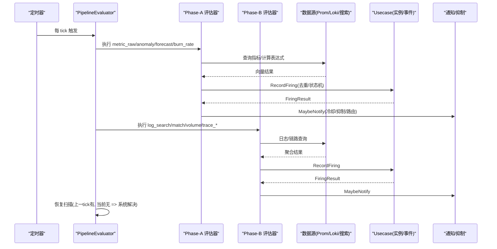
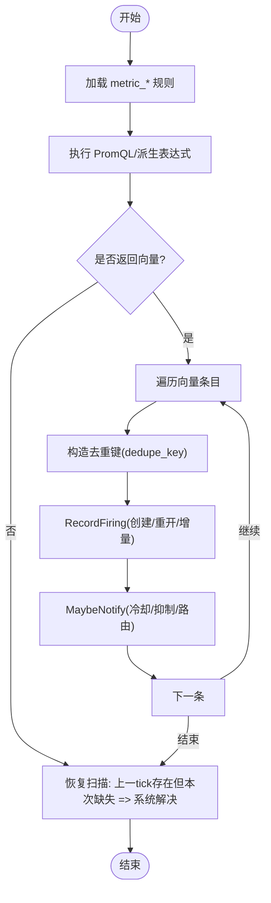
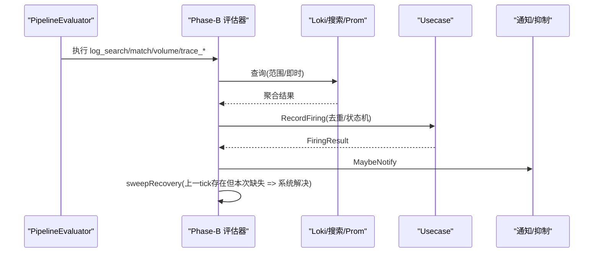
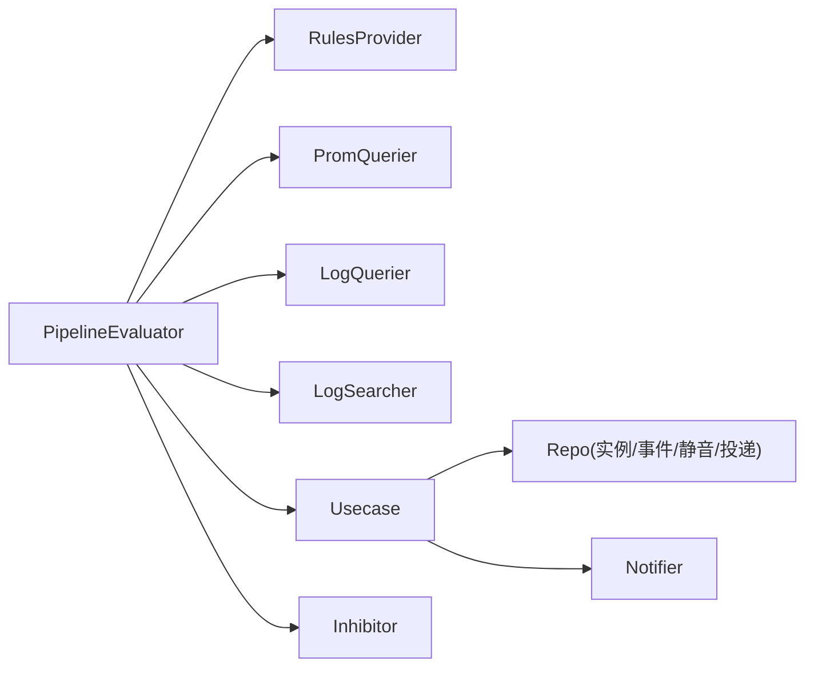

# 告警规则引擎

<cite>
**本文引用的文件**
- [pipeline.go](file://internal/manager/biz/alert/pipeline.go)
- [evaluators_phaseA.go](file://internal/manager/biz/alert/evaluators_phaseA.go)
- [evaluators_phaseB.go](file://internal/manager/biz/alert/evaluators_phaseB.go)
- [rules.go](file://internal/manager/biz/alert/rules.go)
- [usecase.go](file://internal/manager/biz/alert/usecase.go)
- [inhibit.go](file://internal/manager/biz/alert/inhibit.go)
- [model.go](file://internal/manager/model/alert/model.go)
</cite>

## 目录
1. [简介](#简介)
2. [项目结构](#项目结构)
3. [核心组件](#核心组件)
4. [架构总览](#架构总览)
5. [详细组件分析](#详细组件分析)
6. [依赖关系分析](#依赖关系分析)
7. [性能考量](#性能考量)
8. [故障排查指南](#故障排查指南)
9. [结论](#结论)
10. [附录](#附录)

## 简介
本技术文档围绕“告警规则引擎”的两阶段评估管道展开：Phase A（快速过滤）与 Phase B（深度评估）。Phase A 聚焦指标类规则的快速判定，包括任意 PromQL 表达式、异常检测、线性预测与多窗口 SLO 燃烧率；Phase B 覆盖日志结构化查询、历史日志匹配/体积统计以及链路延迟/错误率。文档同时说明规则定义语法、条件表达式与阈值配置方法，阐述告警去重、抑制与合并机制，解释优先级管理、动态加载与热更新策略，并提供复杂场景示例、调试工具、性能调优与故障诊断方法，帮助构建高效且可演进的告警策略体系。

## 项目结构
- 评估管道入口与调度：PipelineEvaluator 负责按固定间隔触发评估，协调数据源（Prometheus/Loki/搜索服务）并驱动各规则子评估器。
- 规则定义与编译：RulesProvider/CachedRulesProvider 提供规则快照，支持周期性刷新与原子替换，实现热更新。
- 事件与状态：Usecase 负责告警实例的创建、重开、静音、冷却、通知投递与审计事件记录。
- 抑制与降噪：Inhibitor 基于更高优先级告警抑制下游噪声。
- 模型与常量：统一的状态、类型、规则种类与通道类型等常量定义。

图表来源
- [pipeline.go:96-224](file://internal/manager/biz/alert/pipeline.go#L96-L224)
- [evaluators_phaseA.go:148-338](file://internal/manager/biz/alert/evaluators_phaseA.go#L148-L338)
- [evaluators_phaseB.go:28-372](file://internal/manager/biz/alert/evaluators_phaseB.go#L28-L372)
- [rules.go:218-518](file://internal/manager/biz/alert/rules.go#L218-L518)
- [usecase.go:349-513](file://internal/manager/biz/alert/usecase.go#L349-L513)
- [inhibit.go:25-73](file://internal/manager/biz/alert/inhibit.go#L25-L73)
- [model.go:61-184](file://internal/manager/model/alert/model.go#L61-L184)

章节来源
- [pipeline.go:96-224](file://internal/manager/biz/alert/pipeline.go#L96-L224)
- [rules.go:218-518](file://internal/manager/biz/alert/rules.go#L218-L518)
- [model.go:61-184](file://internal/manager/model/alert/model.go#L61-L184)

## 核心组件
- PipelineEvaluator：周期调度、设备失活指标刷新、调用各规则评估器、恢复扫描与通知。
- Phase-A 评估器：metric_raw（任意 PromQL）、metric_anomaly（基线偏离）、metric_forecast（线性预测）、metric_burn_rate（多窗口燃烧率）。
- Phase-B 评估器：log_search（后端中立结构化计数）、log_match/log_volume（LogQL 兼容）、trace_latency/trace_error_rate（通过 Prometheus spanmetrics）。
- RulesProvider/CachedRulesProvider：规则快照与热更新，编译失败行隔离不影响整体。
- Usecase：告警实例生命周期、静音、冷却、通知投递、AI 调查与工作流触发。
- Inhibitor：基于高优先级告警抑制下游噪声（如 edge_offline 抑制主机级指标告警）。

章节来源
- [pipeline.go:96-224](file://internal/manager/biz/alert/pipeline.go#L96-L224)
- [evaluators_phaseA.go:148-338](file://internal/manager/biz/alert/evaluators_phaseA.go#L148-L338)
- [evaluators_phaseB.go:28-372](file://internal/manager/biz/alert/evaluators_phaseB.go#L28-L372)
- [rules.go:218-518](file://internal/manager/biz/alert/rules.go#L218-L518)
- [usecase.go:349-513](file://internal/manager/biz/alert/usecase.go#L349-L513)
- [inhibit.go:25-73](file://internal/manager/biz/alert/inhibit.go#L25-L73)

## 架构总览
两阶段处理机制：
- Phase A（快速过滤）：以指标为中心，直接执行 PromQL 或基于内置指标的派生表达式，返回向量后逐条生成告警实例，具备自动恢复能力（上一 tick 存在而当前 tick 缺失即系统解决）。
- Phase B（深度评估）：面向日志与链路，使用后端中立查询或 Loki 范围查询，聚合计数并与阈值比较，同样具备自动恢复。

图表来源
- [pipeline.go:172-224](file://internal/manager/biz/alert/pipeline.go#L172-L224)
- [evaluators_phaseA.go:148-338](file://internal/manager/biz/alert/evaluators_phaseA.go#L148-L338)
- [evaluators_phaseB.go:28-372](file://internal/manager/biz/alert/evaluators_phaseB.go#L28-L372)
- [usecase.go:349-513](file://internal/manager/biz/alert/usecase.go#L349-L513)

## 详细组件分析

### Phase A：快速过滤（指标类）
- metric_raw：将用户表达式作为谓词，PromQL 自身过滤不满足条件的系列；对每个返回系列生成一个告警实例，并维护上一 tick 快照用于恢复。
- metric_anomaly：基于滚动基线的 z-score 或 MAD 偏离检测，构造 PromQL 表达式并执行。
- metric_forecast：使用 predict_linear 外推未来值并与阈值比较。
- metric_burn_rate：多窗口多倍率的 SLO 燃烧率，所有窗口必须同时触发才告警。

图表来源
- [pipeline.go:282-408](file://internal/manager/biz/alert/pipeline.go#L282-L408)
- [evaluators_phaseA.go:148-338](file://internal/manager/biz/alert/evaluators_phaseA.go#L148-L338)

章节来源
- [evaluators_phaseA.go:148-338](file://internal/manager/biz/alert/evaluators_phaseA.go#L148-L338)
- [pipeline.go:282-408](file://internal/manager/biz/alert/pipeline.go#L282-L408)

### Phase B：深度评估（日志与链路）
- log_search：后端中立结构化日志计数，按 group_by 维度分组，阈值比较后生成告警。
- log_match/log_volume：基于 LogQL 的 count_over_time，最近窗口内计数与阈值比较。
- trace_latency/trace_error_rate：通过 Prometheus 的 spanmetrics 指标进行分位延迟与错误率阈值判断。

图表来源
- [evaluators_phaseB.go:28-372](file://internal/manager/biz/alert/evaluators_phaseB.go#L28-L372)
- [pipeline.go:217-223](file://internal/manager/biz/alert/pipeline.go#L217-L223)

章节来源
- [evaluators_phaseB.go:28-372](file://internal/manager/biz/alert/evaluators_phaseB.go#L28-L372)

### 规则定义语法与条件表达式
- 规则种类（kind）：
  - metric_raw：存储为任意 PromQL 表达式，作为谓词直接执行。
  - metric_anomaly：指定 closed-set 指标名、选择器、方法（zscore/mad）、基线窗口与步长、偏差倍数。
  - metric_forecast：指定 closed-set 指标、拟合窗口、预测秒数、操作符与阈值。
  - metric_burn_rate：SLI 表达式（支持 $window 占位）、SLO 百分比、多窗口与倍率。
  - log_search：后端中立的结构化查询（keywords/scope/filters/group_by/window/operator/threshold）。
  - log_match/log_volume：stream_selector、line_filter、window、operator、threshold。
  - trace_latency/trace_error_rate：服务/操作/分位/窗口/阈值或错误率阈值。
- 作用域（scope_type）：host/global/monitoring_pipeline，决定去重键与抑制策略。
- 标签与注解：labels/annotations 在告警事件中传播，影响路由与展示。
- 发送策略（dampening）：per-rule 的 NotifyWindowSeconds + NotifyMinFires 控制通知节流。

章节来源
- [rules.go:29-236](file://internal/manager/biz/alert/rules.go#L29-L236)
- [rules.go:524-800](file://internal/manager/biz/alert/rules.go#L524-L800)
- [model.go:61-184](file://internal/manager/model/alert/model.go#L61-L184)

### 告警去重、抑制与合并
- 去重键（dedupe_key）：
  - 默认由 scope_type/device_id/rule 组合；Pipeline 评估器显式传入 per-instance 键（如 pipeline:scrape_down:host:9100:...）。
  - labelSetKey 会排除非身份标签（如 __name__/ongrid_source/source_id），避免同一物理实体被不同采集器重复拆分。
- 抑制（Inhibition）：
  - edge_offline 抑制同设备的 host 级指标告警。
  - prom_ingest_fail 抑制 scrape_down 系列告警。
- 合并：
  - 相同 dedupe_key 的多次触发仅维持单一实例，事件计数递增；resolve 后再触发则 reopen。

章节来源
- [pipeline.go:479-515](file://internal/manager/biz/alert/pipeline.go#L479-L515)
- [inhibit.go:25-73](file://internal/manager/biz/alert/inhibit.go#L25-L73)
- [usecase.go:349-513](file://internal/manager/biz/alert/usecase.go#L349-L513)

### 规则优先级管理与动态加载/热更新
- 优先级：
  - 通过 Inhibitor 实现跨规则优先抑制（如 edge_offline > host 指标）。
  - 通道级别可通过 MatchSeverityMin/MatchScopeTypes 限制接收范围。
- 动态加载与热更新：
  - CachedRulesProvider 周期性从 RuleSource 拉取启用规则，编译失败行单独记录并跳过，最终原子替换快照，保证并发读取安全。
  - 首次同步在 Loop 中立即执行，确保评估器启动后即可工作。

章节来源
- [rules.go:333-518](file://internal/manager/biz/alert/rules.go#L333-L518)
- [inhibit.go:25-73](file://internal/manager/biz/alert/inhibit.go#L25-L73)

### 复杂告警场景示例
- 基于指标的阈值与异常：
  - metric_raw：up==0 或 cpu_pct>90 等任意 PromQL 谓词。
  - metric_anomaly：CPU/内存偏离基线超过 Nσ（zscore 或 MAD）。
  - metric_forecast：磁盘可用空间在未来 X 小时低于阈值。
  - metric_burn_rate：多窗口 SLO 燃烧率同时触发。
- 基于日志的模式匹配与体积：
  - log_match/log_volume：统计特定正则匹配的行数或总体行数，超过阈值告警。
  - log_search：按字段分组计数，结合关键字与作用域过滤。
- 基于拓扑/链路的延迟与错误率：
  - trace_latency：某服务/操作的 p99 延迟超过阈值。
  - trace_error_rate：错误率超过阈值。

章节来源
- [evaluators_phaseA.go:148-338](file://internal/manager/biz/alert/evaluators_phaseA.go#L148-L338)
- [evaluators_phaseB.go:28-372](file://internal/manager/biz/alert/evaluators_phaseB.go#L28-L372)
- [rules.go:29-236](file://internal/manager/biz/alert/rules.go#L29-L236)

### 规则调试工具与性能调优
- 调试：
  - 观察评估器延迟直方图（observeEval），定位慢规则。
  - 查看事件表（alert_events）与投递记录（notification_deliveries）确认触发与投递结果。
  - 使用 Preview/单 tick 测试（EvaluateOnce）验证规则行为。
- 性能：
  - 合理设置 Interval（默认 5 分钟）与 Cooldown（默认 10 分钟）。
  - 利用 PromQL 的过滤语义减少后续处理量。
  - 对日志规则使用合适的 window 与 step，避免过大范围查询。
  - 使用后端中立 log_search 降低对特定 DSL 的耦合。

章节来源
- [evaluators_phaseA.go:18-32](file://internal/manager/biz/alert/evaluators_phaseA.go#L18-L32)
- [pipeline.go:139-170](file://internal/manager/biz/alert/pipeline.go#L139-L170)
- [usecase.go:547-607](file://internal/manager/biz/alert/usecase.go#L547-L607)

### 故障诊断方法
- 常见问题：
  - PromQL 查询失败：记录 rule/expr 与错误信息，检查表达式与数据源连通性。
  - 日志查询失败：检查 Loki/搜索服务可用性、时间窗口与权限。
  - 通知失败：查看 delivery 状态与错误消息，确认通道配置与签名。
  - 抑制误判：检查是否存在更高优先级告警（edge_offline/prom_ingest_fail）。
- 诊断步骤：
  - 通过事件时间线定位触发点与抑制原因。
  - 使用 Preview 与 EvaluateOnce 复现问题。
  - 调整规则窗口/阈值/选择器，缩小影响面。

章节来源
- [pipeline.go:282-408](file://internal/manager/biz/alert/pipeline.go#L282-L408)
- [evaluators_phaseB.go:28-372](file://internal/manager/biz/alert/evaluators_phaseB.go#L28-L372)
- [usecase.go:547-607](file://internal/manager/biz/alert/usecase.go#L547-L607)

## 依赖关系分析
- PipelineEvaluator 依赖：
  - RulesProvider：获取启用规则集合。
  - PromQuerier/LogQuerier/Searcher：数据源访问。
  - Notifier/ChannelResolver/Inhibitor：通知与抑制。
  - EdgeLister/DeviceIdentityResolver：设备失活指标与显示名称解析。
- 规则系统依赖：
  - RuleSource：持久化规则读取。
  - model.alert：常量与模型定义。
- 事件系统依赖：
  - Repo：实例/事件/静音/投递的持久化。
  - notify：通知通道抽象。

图表来源
- [pipeline.go:63-94](file://internal/manager/biz/alert/pipeline.go#L63-L94)
- [rules.go:218-518](file://internal/manager/biz/alert/rules.go#L218-L518)
- [usecase.go:21-31](file://internal/manager/biz/alert/usecase.go#L21-L31)
- [inhibit.go:25-73](file://internal/manager/biz/alert/inhibit.go#L25-L73)

章节来源
- [pipeline.go:63-94](file://internal/manager/biz/alert/pipeline.go#L63-L94)
- [rules.go:218-518](file://internal/manager/biz/alert/rules.go#L218-L518)
- [usecase.go:21-31](file://internal/manager/biz/alert/usecase.go#L21-L31)
- [inhibit.go:25-73](file://internal/manager/biz/alert/inhibit.go#L25-L73)

## 性能考量
- 评估间隔与冷却：
  - 合理设置 Interval（默认 5 分钟）与 Cooldown（默认 10 分钟），平衡实时性与负载。
- 查询优化：
  - 使用 PromQL 的过滤语义减少返回向量规模。
  - 日志规则采用合适的时间窗口与步长，避免全量扫描。
- 规则编译容错：
  - 编译失败行单独记录并跳过，不影响其他规则运行。
- 恢复扫描：
  - 基于上一 tick 快照进行系统级恢复，减少人工干预。

[本节为通用指导，无需引用具体文件]

## 故障排查指南
- 指标类规则：
  - 检查 PromQL 表达式是否正确，确认数据源可达与指标存在。
  - 查看 evaluatePromQuery 的错误日志与直方图。
- 日志类规则：
  - 检查 Loki/搜索服务连通性与权限，确认 stream_selector 与 line_filter。
  - 查看 runLokiInstant 的错误日志。
- 通知与抑制：
  - 检查通知通道配置与签名，查看 delivery 状态。
  - 检查是否存在 edge_offline/prom_ingest_fail 等高优先级告警导致抑制。
- 事件与审计：
  - 通过 alert_events 与 notification_deliveries 追踪触发与投递结果。

章节来源
- [pipeline.go:282-408](file://internal/manager/biz/alert/pipeline.go#L282-L408)
- [evaluators_phaseB.go:28-372](file://internal/manager/biz/alert/evaluators_phaseB.go#L28-L372)
- [usecase.go:547-607](file://internal/manager/biz/alert/usecase.go#L547-L607)

## 结论
该告警规则引擎通过两阶段评估管道实现了高效、可扩展的告警处理能力：Phase A 以指标为核心快速过滤，Phase B 覆盖日志与链路深度评估。规则定义灵活、支持多种场景；去重、抑制与合并机制有效防止告警风暴；动态加载与热更新保障规则变更的平滑生效；完善的审计与通知投递记录便于故障排查与性能调优。建议在生产环境中结合业务特点制定合理的规则策略与阈值，充分利用抑制与冷却机制，持续优化评估间隔与查询范围，构建稳定高效的告警体系。

## 附录
- 规则种类与用途速查：
  - metric_raw：任意 PromQL 谓词，适用于阈值/存在性/组合条件。
  - metric_anomaly：基线偏离检测，适用于突发异常。
  - metric_forecast：线性预测，适用于容量预警。
  - metric_burn_rate：多窗口燃烧率，适用于 SLO 预算消耗。
  - log_search：后端中立结构化日志计数，适用于多后端兼容。
  - log_match/log_volume：LogQL 兼容，适用于模式匹配与体积监控。
  - trace_latency/trace_error_rate：链路质量监控。
- 最佳实践：
  - 使用 scope_type 明确告警范围，配合抑制策略减少噪声。
  - 合理设置 window/step/threshold，避免过度查询与误报。
  - 利用 labels/annotations 增强上下文，便于路由与展示。
  - 定期审查规则有效性，清理无效或低价值规则。

[本节为概念性内容，无需引用具体文件]