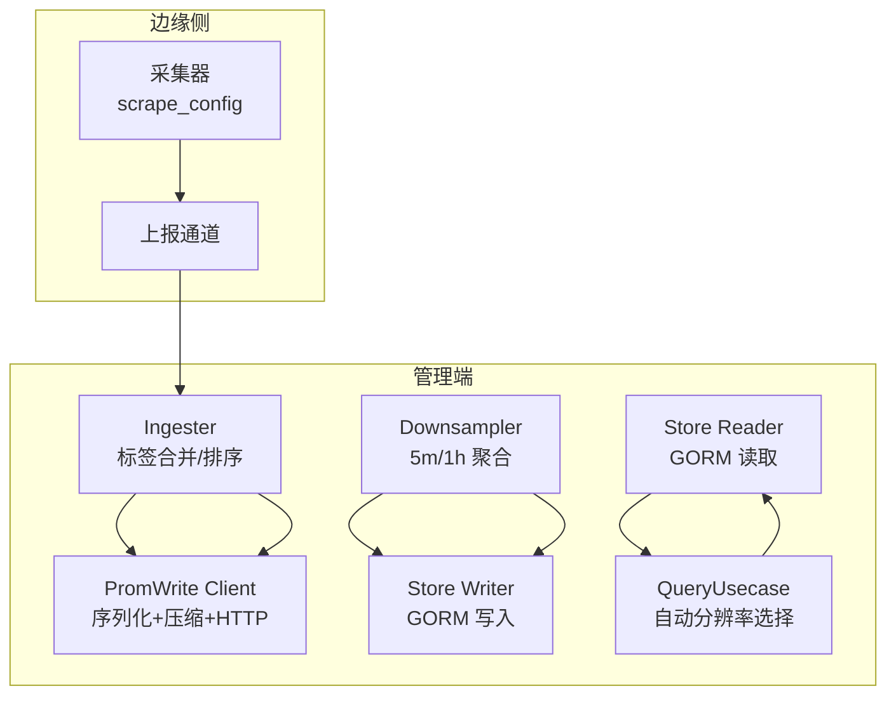
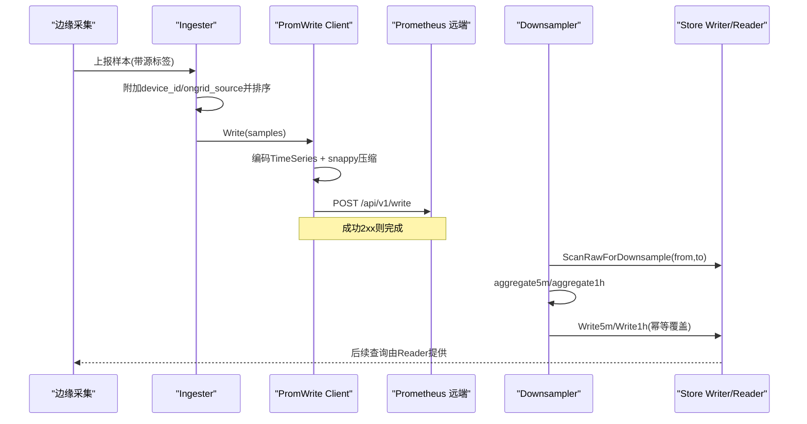
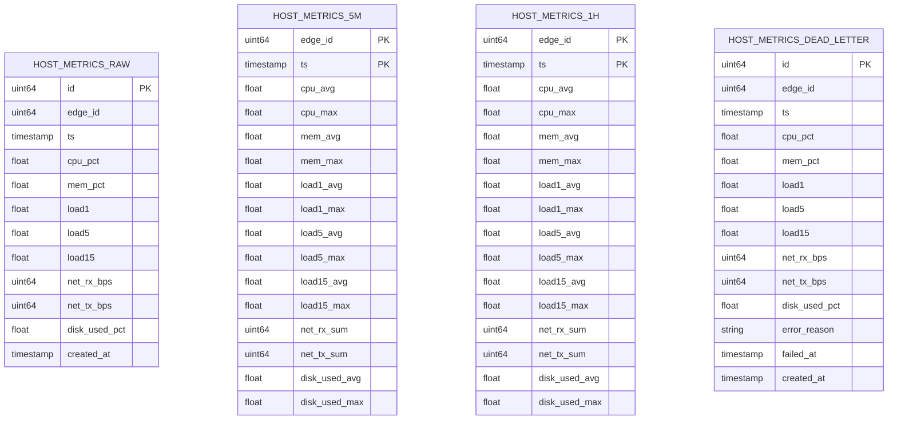
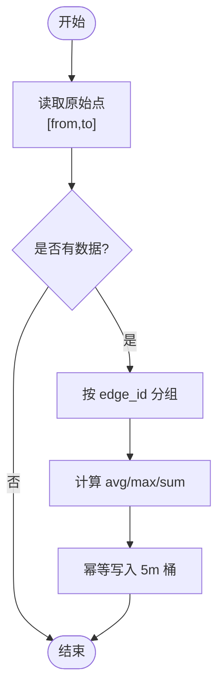
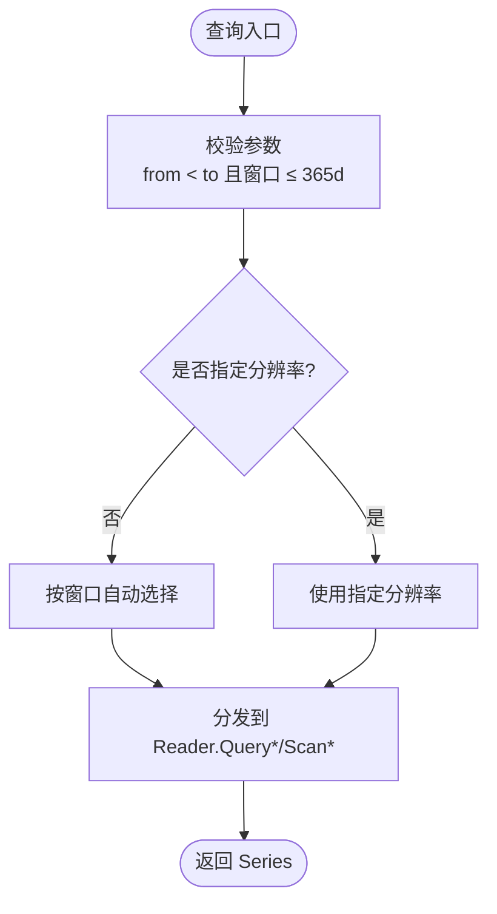
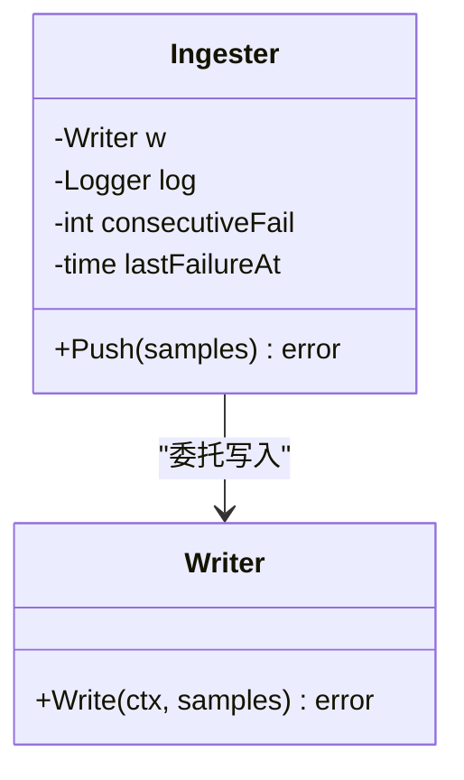
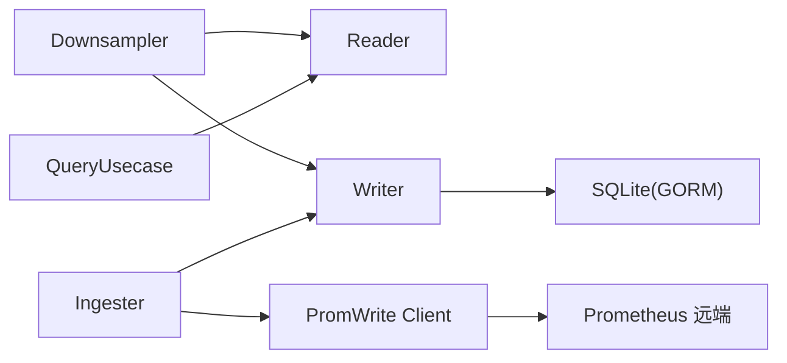

# 指标处理管道

<cite>
**本文引用的文件**
- [downsample.go](file://internal/manager/biz/metric/downsample.go)
- [query.go](file://internal/manager/biz/metric/query.go)
- [repo.go](file://internal/manager/biz/metric/repo.go)
- [writer.go](file://internal/manager/data/metric/store/writer.go)
- [reader.go](file://internal/manager/data/metric/store/reader.go)
- [model.go](file://internal/manager/model/metric/model.go)
- [client.go](file://internal/pkg/promwrite/client.go)
- [ingester.go](file://internal/manager/biz/promwrite/ingester.go)
- [scrape_config.example.yaml](file://internal/edgeagent/collector/scrape_config.example.yaml)
- [main.go](file://cmd/ongrid-edge/main.go)
- [metric_catalog_tool.go](file://internal/manager/biz/aiops/tools/metric_catalog_tool.go)
- [systemHealth.ts](file://web/src/api/systemHealth.ts)
</cite>

## 目录
1. [简介](#简介)
2. [项目结构](#项目结构)
3. [核心组件](#核心组件)
4. [架构总览](#架构总览)
5. [详细组件分析](#详细组件分析)
6. [依赖关系分析](#依赖关系分析)
7. [性能考虑](#性能考虑)
8. [故障排查指南](#故障排查指南)
9. [结论](#结论)
10. [附录](#附录)

## 简介
本技术文档围绕“指标处理管道”展开，覆盖从边缘侧采集、云端接收与存储、降采样聚合、查询路由到远程写入 Prometheus 的完整链路。重点说明：
- 指标数据的接收、存储与查询流程
- Prometheus Remote Write 协议实现（序列化、压缩、HTTP 发送）
- 指标降采样、聚合算法与存储优化
- 标签管理与元数据维护（含命名规范建议）
- 实时查询引擎、历史数据访问与批量导出思路
- 监控指标定义与系统健康检查集成
- 高吞吐指标系统的构建要点

## 项目结构
该仓库将指标相关能力分布在多个子域：
- 业务层（biz）：负责调度降采样、查询路由等
- 数据层（data/store）：基于 GORM 的读写实现
- 模型层（model）：领域值类型与持久化行结构
- 客户端库（pkg/promwrite）：Remote Write 协议实现
- 边缘侧（edgeagent）：采集与上报配置
- 前端（web）：系统健康检查 API 调用



图表来源
- [ingester.go:1-69](file://internal/manager/biz/promwrite/ingester.go#L1-L69)
- [client.go:126-176](file://internal/pkg/promwrite/client.go#L126-L176)
- [downsample.go:11-115](file://internal/manager/biz/metric/downsample.go#L11-L115)
- [writer.go:36-148](file://internal/manager/data/metric/store/writer.go#L36-L148)
- [reader.go:24-50](file://internal/manager/data/metric/store/reader.go#L24-L50)
- [query.go:70-133](file://internal/manager/biz/metric/query.go#L70-L133)

章节来源
- [scrape_config.example.yaml:1-30](file://internal/edgeagent/collector/scrape_config.example.yaml#L1-L30)
- [main.go:456-488](file://cmd/ongrid-edge/main.go#L456-L488)

## 核心组件
- 指标模型与分层存储
  - 原始点 Point、5分钟桶 Bucket5m、1小时桶 Bucket1h，分别对应 host_metrics_raw、host_metrics_5m、host_metrics_1h 三张表
  - 失败重试落盘 DeadLetter，用于记录无法写入的样本
- 写入与读取
  - Writer：批量写入 raw/5m/1h，支持幂等覆盖（Save），并支持按时间删除保留策略
  - Reader：按边设备 ID 和时间范围查询各层数据
- 降采样调度
  - Downsampler：定时对齐边界，扫描原始数据或 5m 桶进行聚合，产出下一层桶
- 查询路由
  - QueryUsecase：根据窗口大小自动选择 raw/5m/1h 表，统一返回 Series
- Remote Write 客户端
  - Client：将样本编码为 TimeSeries，snappy 压缩后 POST 到 Prometheus 兼容后端
- Ingester（云端桥接）
  - 将隧道上报的样本附加云侧标签并排序，再交给 promwrite.Client 发送

章节来源
- [model.go:18-96](file://internal/manager/model/metric/model.go#L18-L96)
- [writer.go:36-148](file://internal/manager/data/metric/store/writer.go#L36-L148)
- [reader.go:24-50](file://internal/manager/data/metric/store/reader.go#L24-L50)
- [downsample.go:11-115](file://internal/manager/biz/metric/downsample.go#L11-L115)
- [query.go:14-60](file://internal/manager/biz/metric/query.go#L14-L60)
- [client.go:17-40](file://internal/pkg/promwrite/client.go#L17-L40)
- [ingester.go:1-69](file://internal/manager/biz/promwrite/ingester.go#L1-L69)

## 架构总览
整体数据流分为两条主线：
- 写入路径：边缘采集 → 云端 Ingester（标签合并/排序）→ PromWrite Client（Proto + snappy）→ Prometheus 远端
- 存储与查询路径：原始点入 host_metrics_raw → 定时降采样至 5m/1h → 查询时按窗口自动选择层级



图表来源
- [ingester.go:1-69](file://internal/manager/biz/promwrite/ingester.go#L1-L69)
- [client.go:126-176](file://internal/pkg/promwrite/client.go#L126-L176)
- [downsample.go:41-115](file://internal/manager/biz/metric/downsample.go#L41-L115)
- [writer.go:90-148](file://internal/manager/data/metric/store/writer.go#L90-L148)

## 详细组件分析

### 指标模型与存储设计
- 三层存储：raw（高频）、5m（中频）、1h（低频）
- 主键与索引：raw 使用 edge_id + ts 复合索引；5m/1h 使用 (edge_id, ts) 作为联合主键，便于幂等覆盖
- 失败重试：DeadLetter 表记录失败样本及原因，便于事后恢复与审计



图表来源
- [model.go:102-188](file://internal/manager/model/metric/model.go#L102-L188)

章节来源
- [model.go:18-96](file://internal/manager/model/metric/model.go#L18-L96)
- [writer.go:28-34](file://internal/manager/data/metric/store/writer.go#L28-L34)

### 写入与降采样流水线
- 写入路径：Writer.WriteRaw 批量插入 raw；失败样本通过 WriteDeadLetter 落盘
- 降采样：Downsampler 在 5m/1h 边界触发，ScanRawForDownsample/Scan5mForDownsample 拉取数据，aggregate5m/aggregate1h 计算均值/最大值/累加值，Write5m/Write1h 幂等覆盖



图表来源
- [downsample.go:41-80](file://internal/manager/biz/metric/downsample.go#L41-L80)
- [downsample.go:121-195](file://internal/manager/biz/metric/downsample.go#L121-L195)
- [writer.go:90-118](file://internal/manager/data/metric/store/writer.go#L90-L118)

章节来源
- [downsample.go:11-115](file://internal/manager/biz/metric/downsample.go#L11-L115)
- [writer.go:36-148](file://internal/manager/data/metric/store/writer.go#L36-L148)

### 查询引擎与自动分辨率
- 输入：RangeQuery（edge_id、from、to、resolution）
- 自动分辨率：窗口 ≤ 6h → raw；≤ 7d → 5m；否则 → 1h
- 输出：Series（包含 Resolution 与对应数据切片）



图表来源
- [query.go:70-133](file://internal/manager/biz/metric/query.go#L70-L133)
- [repo.go:35-52](file://internal/manager/biz/metric/repo.go#L35-L52)

章节来源
- [query.go:14-60](file://internal/manager/biz/metric/query.go#L14-L60)
- [query.go:70-133](file://internal/manager/biz/metric/query.go#L70-L133)
- [reader.go:24-50](file://internal/manager/data/metric/store/reader.go#L24-L50)

### Prometheus Remote Write 实现
- 协议细节：每个 Sample 编码为一个 TimeSeries，序列化为 Protobuf，再用 snappy 压缩
- HTTP 请求：POST 到 /api/v1/write，设置 Content-Type、Content-Encoding、X-Prometheus-Remote-Write-Version
- 错误处理：非 2xx 响应会记录状态码与部分响应体，并返回错误供上层重试

```mermaid
sequenceDiagram
participant C as "Client"
participant P as "Prometheus"
C->>C : 编码 TimeSeries
C->>C : snappy 压缩
C->>P : POST /api/v1/write (application/x-protobuf; snappy)
P-->>C : 2xx/204 成功
P-->>C : 其他状态码 -> 记录日志并返回错误
```

图表来源
- [client.go:126-176](file://internal/pkg/promwrite/client.go#L126-L176)

章节来源
- [client.go:17-40](file://internal/pkg/promwrite/client.go#L17-L40)
- [client.go:126-176](file://internal/pkg/promwrite/client.go#L126-L176)

### 云端桥接与标签管理
- Ingester 职责：将设备 ID 与 ongrid_source 标签附加到每条样本，并按名称字典序排序（remote_write 要求）
- 健康快照：记录连续失败次数与最近失败时间，便于告警与降级



图表来源
- [ingester.go:32-69](file://internal/manager/biz/promwrite/ingester.go#L32-L69)

章节来源
- [ingester.go:1-69](file://internal/manager/biz/promwrite/ingester.go#L1-L69)

### 边缘采集与上报
- 采集模式：embedded/scrape/auto，支持多目标抓取与独立间隔
- 配置示例：targets 列表包含 name、role、url、interval、timeout、认证与静态标签

章节来源
- [main.go:456-488](file://cmd/ongrid-edge/main.go#L456-L488)
- [scrape_config.example.yaml:1-30](file://internal/edgeagent/collector/scrape_config.example.yaml#L1-L30)

### 指标命名规范与标签设计建议
- 指标名：采用小写下划线分隔，体现资源与度量语义（如 cpu_usage_percent、memory_used_bytes）
- 标签：
  - 维度标签：edge_id、instance、job、app、env 等，避免高基数
  - 稳定标签：on_grid_source、collector_type 等，便于区分来源
- 标签规范化：对空串、数字、布尔等进行统一转换，生成稳定的标签键值

章节来源
- [metric_catalog_tool.go:391-418](file://internal/manager/biz/aiops/tools/metric_catalog_tool.go#L391-L418)
- [metric_catalog_tool.go:550-598](file://internal/manager/biz/aiops/tools/metric_catalog_tool.go#L550-L598)

### 实时监控与系统健康检查
- 健康检查接口：前端通过 POST /system/health/check 获取系统健康报告
- 指标健康：Ingester 暴露 Health 快照（连续失败数、最近失败时间），可用于评估远端写入健康度

章节来源
- [systemHealth.ts:1-31](file://web/src/api/systemHealth.ts#L1-L31)
- [ingester.go:32-41](file://internal/manager/biz/promwrite/ingester.go#L32-L41)

## 依赖关系分析
- 组件耦合
  - Downsampler 依赖 Reader/Writer 接口，解耦具体存储实现
  - QueryUsecase 仅依赖 Reader，屏蔽底层表选择逻辑
  - Ingester 依赖 Writer 接口，可注入测试替身
  - PromWrite Client 依赖 EndpointResolver，支持动态写端点解析
- 外部依赖
  - GORM 用于 SQLite 批写与删除
  - snappy 用于压缩
  - HTTP 客户端用于远程写入



图表来源
- [downsample.go:11-34](file://internal/manager/biz/metric/downsample.go#L11-L34)
- [query.go:56-68](file://internal/manager/biz/metric/query.go#L56-L68)
- [ingester.go:43-69](file://internal/manager/biz/promwrite/ingester.go#L43-L69)
- [writer.go:14-23](file://internal/manager/data/metric/store/writer.go#L14-L23)
- [client.go:42-117](file://internal/pkg/promwrite/client.go#L42-L117)

章节来源
- [downsample.go:11-34](file://internal/manager/biz/metric/downsample.go#L11-L34)
- [query.go:56-68](file://internal/manager/biz/metric/query.go#L56-L68)
- [ingester.go:43-69](file://internal/manager/biz/promwrite/ingester.go#L43-L69)
- [writer.go:14-23](file://internal/manager/data/metric/store/writer.go#L14-L23)
- [client.go:42-117](file://internal/pkg/promwrite/client.go#L42-L117)

## 性能考虑
- 写入优化
  - 批量写入：CreateInBatches 分批提交，减少事务开销
  - 幂等覆盖：5m/1h 使用 Save 按主键覆盖，支持重跑任务
  - 失败落盘：DeadLetter 避免阻塞主流程
- 降采样优化
  - 对齐边界：避免与当前桶竞争，保证一致性
  - 聚合复杂度：O(N) 单次扫描，内存按 edge_id 分组
- 查询优化
  - 自动分辨率：短窗口读 raw，长窗口读聚合层，降低 IO
  - 索引利用：edge_id + ts 复合索引提升范围查询效率
- 网络优化
  - snappy 压缩减少带宽占用
  - 超时与重试：客户端默认超时，上层可实现退避重试

[本节为通用性能指导，不直接分析具体文件]

## 故障排查指南
- 远端写入失败
  - 现象：Ingester.Health.Failures 增加，LastFailureAt 更新
  - 排查：检查 EndpointResolver 返回的 URL、HTTP 状态码与响应体
- 降采样未产出
  - 现象：5m/1h 表无新数据
  - 排查：确认定时器对齐边界、Scan 区间是否正确、聚合函数是否返回空
- 查询结果异常
  - 现象：Resolution 不符合预期
  - 排查：检查窗口长度与自动分辨率阈值，确认 Reader 返回数据

章节来源
- [ingester.go:32-41](file://internal/manager/biz/promwrite/ingester.go#L32-L41)
- [client.go:164-176](file://internal/pkg/promwrite/client.go#L164-L176)
- [downsample.go:82-115](file://internal/manager/biz/metric/downsample.go#L82-L115)
- [query.go:70-133](file://internal/manager/biz/metric/query.go#L70-L133)

## 结论
本管道以“分层存储 + 定时降采样 + 自动分辨率查询”为核心，结合 Remote Write 协议实现与 Ingester 标签治理，形成高吞吐、可扩展的指标处理体系。通过批量写入、幂等覆盖、失败落盘与压缩传输等手段，兼顾了写入稳定性与查询性能。配合系统健康检查与标签规范化，可在生产环境中稳定运行并持续演进。

## 附录
- 指标命名与标签设计最佳实践
  - 指标名：小写下划线，明确资源与度量
  - 标签：控制基数，稳定维度优先
  - 来源标识：on_grid_source、collector_type 等
- 批量导出思路
  - 基于 Reader 的分页/分片拉取 raw/5m/1h 数据
  - 按 edge_id 与时间窗口切分，顺序导出为 CSV/Parquet
  - 注意并发与限流，避免对数据库造成压力

[本节为概念性内容，不直接分析具体文件]