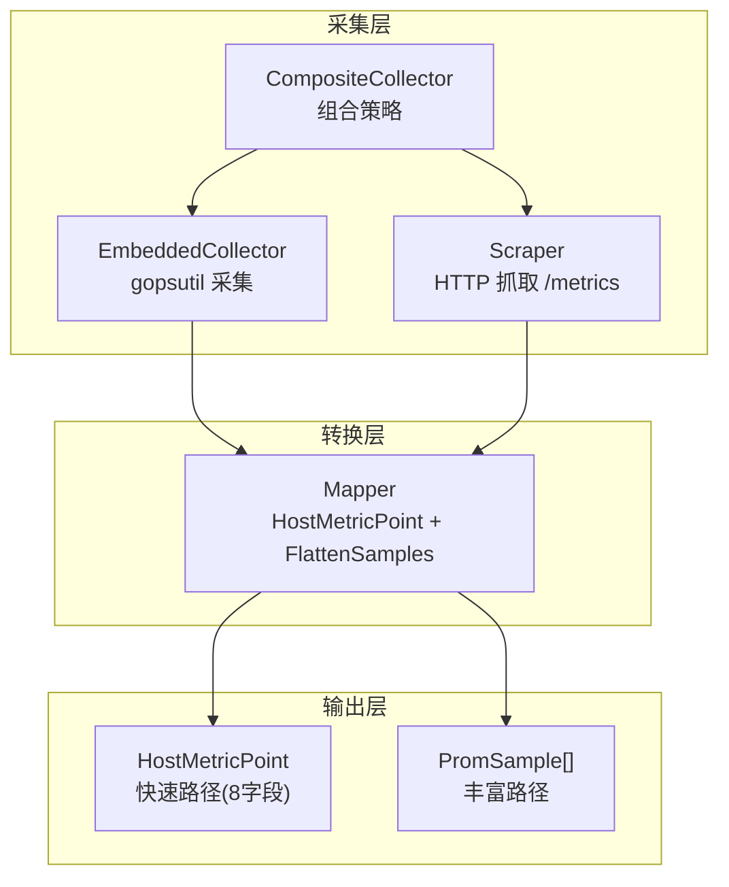
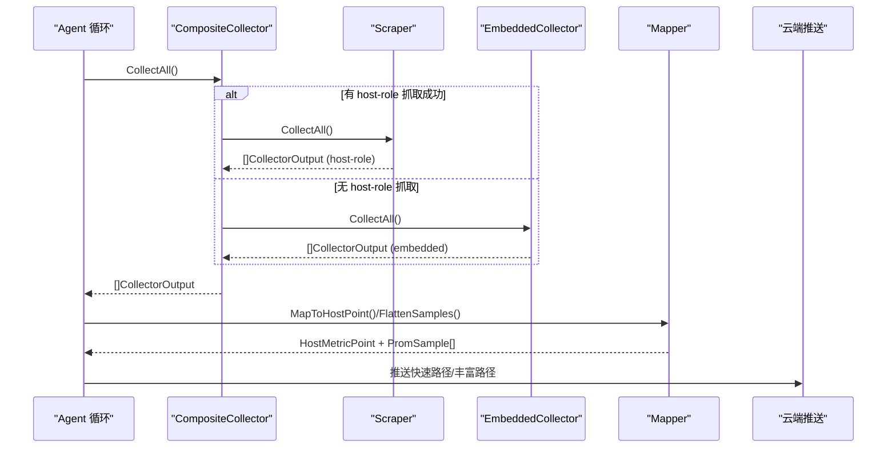
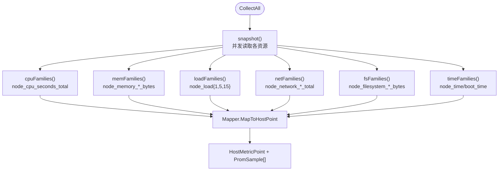
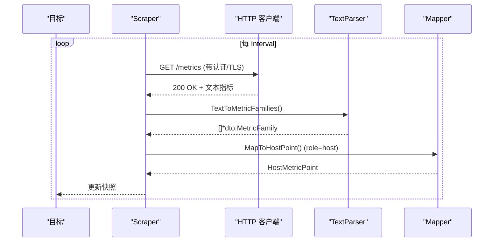
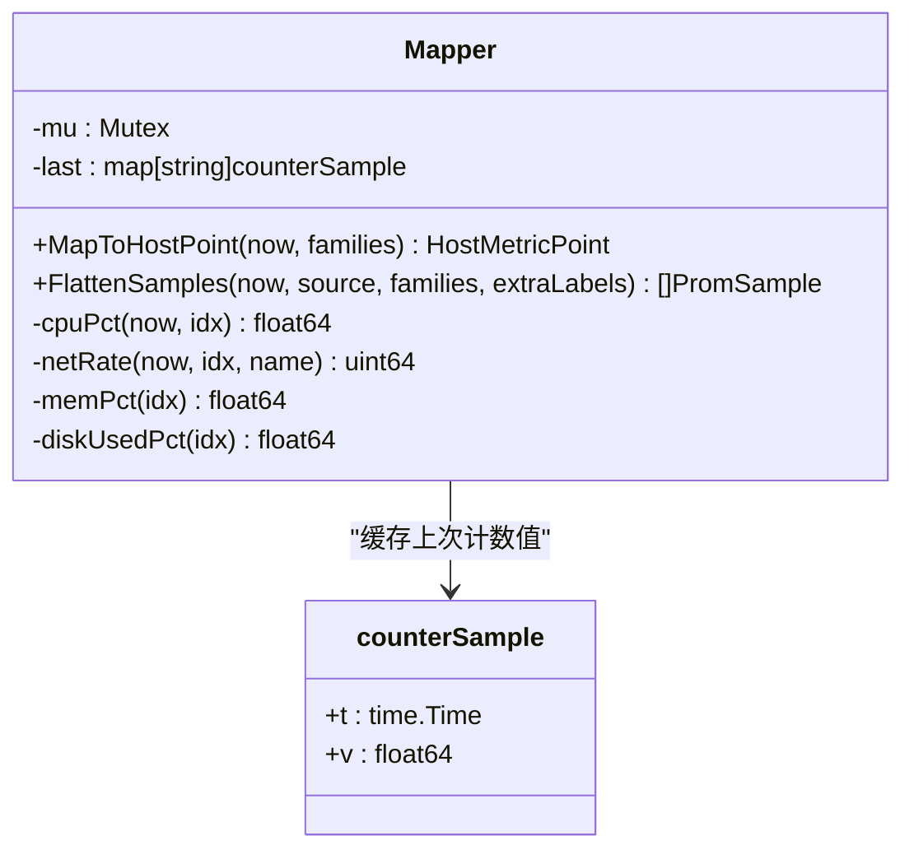
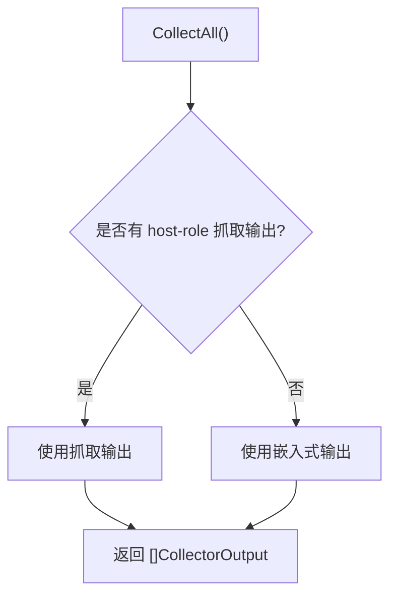
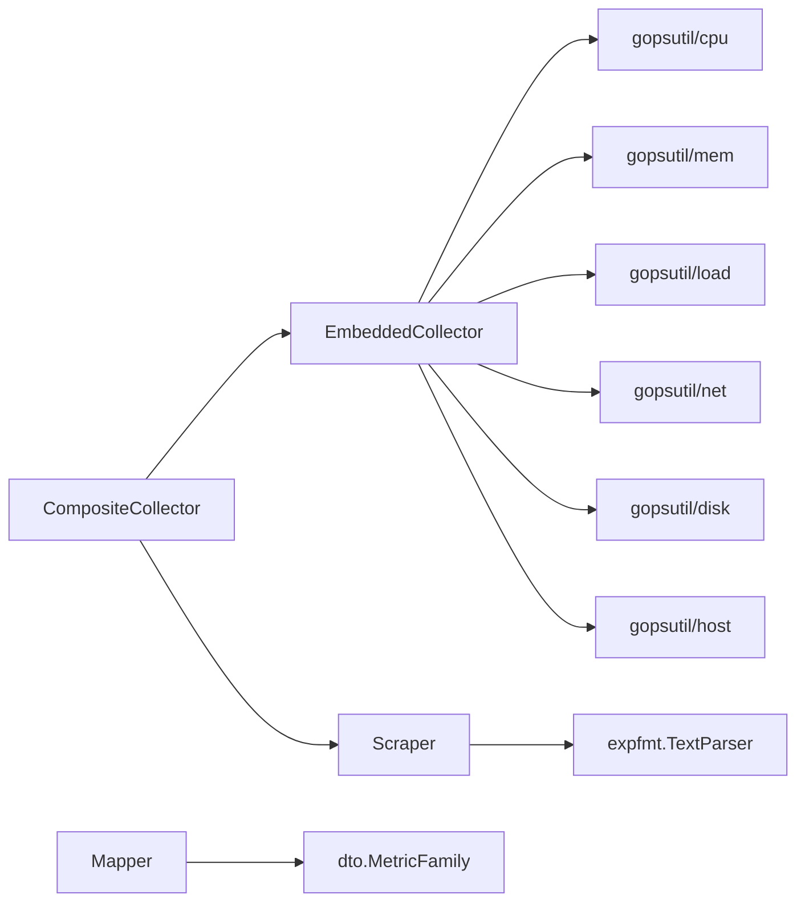

# 内置采集器

<cite>
**本文引用的文件**
- [embedded.go](file://internal/edgeagent/collector/embedded.go)
- [scrape.go](file://internal/edgeagent/collector/scrape.go)
- [mapper.go](file://internal/edgeagent/collector/mapper.go)
- [composite.go](file://internal/edgeagent/collector/composite.go)
- [types.go](file://internal/edgeagent/collector/types.go)
- [scrapecfg.go](file://internal/edgeagent/collector/scrapecfg.go)
- [hwfingerprint.go](file://internal/edgeagent/collector/hwfingerprint.go)
- [doc.go](file://internal/edgeagent/collector/doc.go)
</cite>

## 目录
1. [简介](#简介)
2. [项目结构](#项目结构)
3. [核心组件](#核心组件)
4. [架构总览](#架构总览)
5. [详细组件分析](#详细组件分析)
6. [依赖关系分析](#依赖关系分析)
7. [性能考量](#性能考量)
8. [故障排查指南](#故障排查指南)
9. [结论](#结论)
10. [附录](#附录)

## 简介
本技术文档聚焦于系统级指标采集器的实现，覆盖 CPU 使用率、内存占用与网络统计数据的采集方法。文档详细说明：
- 底层 API 调用方式（gopsutil）与数据转换逻辑
- 指标标准化处理（单位、标签映射、数据校验）
- 多平台兼容性（Linux、Windows、macOS）
- 指标含义与业务价值
- 性能影响分析与优化建议

该采集子系统提供两种互补的采集模式：
- 嵌入式采集：进程内通过 gopsutil 读取系统指标，输出 node_exporter 兼容的 Prometheus 指标族
- HTTP 抓取采集：按配置周期拉取外部 /metrics 端点，解析并统一进入同一处理管线

两者均产出两类结果：
- 快速路径：8 字段 HostMetricPoint（CPU%、内存%、负载、网络速率、磁盘使用率等）
- 丰富路径：扁平化的 PromSample 列表，用于 push_prom_samples 新协议

## 项目结构
采集器位于 internal/edgeagent/collector 包，关键文件职责如下：
- embedded.go：嵌入式采集器，基于 gopsutil 收集 CPU、内存、负载、网络、文件系统、时间等指标
- scrape.go：HTTP 抓取器，定时拉取目标 /metrics，解析为 MetricFamily 并缓存快照
- mapper.go：将 MetricFamily 转换为 HostMetricPoint（含计数器差分求速率），以及 FlattenSamples 生成 PromSample
- composite.go：组合采集器，优先使用 host-role 抓取源，否则回退到嵌入式基线
- types.go：Collector 接口定义与输出结构
- scrapecfg.go：抓取配置加载与默认值填充
- hwfingerprint.go：硬件指纹（MAC/CPU/Disk）用于设备去重与克隆识别
- doc.go：包级说明与设计取舍

图表来源
- [embedded.go:26-73](file://internal/edgeagent/collector/embedded.go#L26-L73)
- [scrape.go:29-77](file://internal/edgeagent/collector/scrape.go#L29-L77)
- [mapper.go:16-68](file://internal/edgeagent/collector/mapper.go#L16-L68)
- [composite.go:10-55](file://internal/edgeagent/collector/composite.go#L10-L55)

章节来源
- [doc.go:1-21](file://internal/edgeagent/collector/doc.go#L1-L21)

## 核心组件
- EmbeddedCollector：进程内采集 CPU、内存、负载、网络、文件系统、时间；输出 node_exporter 命名规范的 MetricFamily
- Scraper：按目标配置并发抓取 /metrics，解析为 MetricFamily 并维护每目标快照；支持 BearerToken、TLS、超时控制
- Mapper：从 MetricFamily 计算 HostMetricPoint（CPU%、内存%、负载、网络速率、磁盘使用率），同时生成 PromSample 列表
- CompositeCollector：自动模式，优先 host-role 抓取源，否则回退嵌入式基线；统一 HostInfo、GetHostLoad、GetProcessList 行为
- 类型与配置：Collector 接口、CollectorOutput、ScrapeConfig、ScrapeTarget

章节来源
- [types.go:9-57](file://internal/edgeagent/collector/types.go#L9-L57)
- [scrapecfg.go:12-90](file://internal/edgeagent/collector/scrapecfg.go#L12-L90)

## 架构总览
采集器采用“双源+统一转换”的架构：
- 双源：嵌入式（gopsutil）与 HTTP 抓取（expfmt）并行存在
- 统一转换：Mapper 将不同来源的 MetricFamily 统一映射为 HostMetricPoint 与 PromSample
- 组合策略：CompositeCollector 决定何时使用抓取源或回退到嵌入式基线

图表来源
- [composite.go:27-55](file://internal/edgeagent/collector/composite.go#L27-L55)
- [scrape.go:185-226](file://internal/edgeagent/collector/scrape.go#L185-L226)
- [embedded.go:53-73](file://internal/edgeagent/collector/embedded.go#L53-L73)
- [mapper.go:40-68](file://internal/edgeagent/collector/mapper.go#L40-L68)

## 详细组件分析

### 嵌入式采集器（EmbeddedCollector）
- 采集范围：CPU、内存、负载、网络、文件系统、时间
- 指标命名：遵循 node_exporter 规范，便于云侧统一查询
- 底层 API：gopsutil/v3 的 cpu、mem、load、net、disk、host、process
- 错误处理：各子采集失败仅记录日志，不中断整体快照
- 主机信息：HostInfo 包含 OS、Arch、CPUCount、Hostname、KernelVersion、Fingerprint、HardwareFingerprint、IPAddress、MemTotalBytes

图表来源
- [embedded.go:176-235](file://internal/edgeagent/collector/embedded.go#L176-L235)
- [embedded.go:239-340](file://internal/edgeagent/collector/embedded.go#L239-L340)
- [mapper.go:40-68](file://internal/edgeagent/collector/mapper.go#L40-L68)

章节来源
- [embedded.go:26-130](file://internal/edgeagent/collector/embedded.go#L26-L130)
- [embedded.go:176-340](file://internal/edgeagent/collector/embedded.go#L176-L340)

### HTTP 抓取采集器（Scraper）
- 目标管理：每个目标独立 http.Client，支持 TLS 最小版本、可选跳过证书验证、Bearer Token 文件
- 抓取流程：构造请求→设置 Accept 文本格式→解析为 MetricFamily→更新 per-target 快照
- 并发模型：errgroup 为每个目标启动一个 goroutine，按 Interval 定时抓取
- 输出：CollectAll 返回每个目标的 CollectorOutput，若 role=host 则尝试映射 HostMetricPoint

图表来源
- [scrape.go:82-113](file://internal/edgeagent/collector/scrape.go#L82-L113)
- [scrape.go:117-183](file://internal/edgeagent/collector/scrape.go#L117-L183)
- [scrape.go:185-226](file://internal/edgeagent/collector/scrape.go#L185-L226)
- [scrapecfg.go:22-49](file://internal/edgeagent/collector/scrapecfg.go#L22-L49)

章节来源
- [scrape.go:29-226](file://internal/edgeagent/collector/scrape.go#L29-L226)
- [scrapecfg.go:12-90](file://internal/edgeagent/collector/scrapecfg.go#L12-L90)

### 转换器（Mapper）
- 快速路径：MapToHostPoint 提取 8 字段（CPU%、内存%、负载、网络速率、磁盘使用率、采样时间）
- 计数器差分：CPU%、网络速率通过上次快照与本次快照差值除以时间间隔计算
- 丰富路径：FlattenSamples 将 MetricFamily 展开为 PromSample，处理 Gauge/Counter/Summary/Histogram
- 标签合并：extraLabels（如 static_labels）与指标自带标签合并，指标标签优先

图表来源
- [mapper.go:16-68](file://internal/edgeagent/collector/mapper.go#L16-L68)
- [mapper.go:227-307](file://internal/edgeagent/collector/mapper.go#L227-L307)
- [mapper.go:64-146](file://internal/edgeagent/collector/mapper.go#L64-L146)

章节来源
- [mapper.go:16-146](file://internal/edgeagent/collector/mapper.go#L16-L146)
- [mapper.go:150-373](file://internal/edgeagent/collector/mapper.go#L150-L373)

### 组合采集器（CompositeCollector）
- 策略：优先 host-role 抓取源；若无有效 host 抓取，则回退到嵌入式基线
- 统一接口：HostInfo、GetHostLoad、GetProcessList 委托给可用源

图表来源
- [composite.go:27-55](file://internal/edgeagent/collector/composite.go#L27-L55)

章节来源
- [composite.go:10-92](file://internal/edgeagent/collector/composite.go#L10-L92)

### 指标标准化与数据验证
- 指标命名：遵循 node_exporter 命名规范，确保云侧查询一致
- 单位：
  - CPU 时间：秒（累计计数器）
  - 内存：字节（Gauge）
  - 网络：字节（累计计数器），速率由差分/时间得到 bytes/s
  - 文件系统：字节（Gauge）
  - 负载：无单位（系统负载均值）
- 标签映射：
  - device、cpu、mode、mountpoint、fstype、quantile、le 等
  - 静态标签 static_labels 与指标标签合并，指标标签优先
- 数据验证：
  - 过滤 NaN/Inf 样本
  - 首次调用速率类指标返回 0（无历史快照）
  - 忽略 lo 等回环网络设备

章节来源
- [mapper.go:64-146](file://internal/edgeagent/collector/mapper.go#L64-L146)
- [mapper.go:175-206](file://internal/edgeagent/collector/mapper.go#L175-L206)
- [mapper.go:227-307](file://internal/edgeagent/collector/mapper.go#L227-L307)

### 多平台兼容性（Linux、Windows、macOS）
- gopsutil 跨平台抽象：CPU、内存、负载、网络、磁盘、主机信息等在不同平台以统一接口暴露
- 主机标识：
  - Fingerprint：gopsutil 的平台稳定 ID（Linux machine-id、macOS IOPlatformUUID、Windows MachineGuid）
  - HardwareFingerprint：MAC+CPU 型号+磁盘序列号哈希，抵抗克隆场景
- 差异处理：
  - CPU 标签前缀清理（如 “cpu0” → “0”）
  - 回环设备过滤（lo）
  - 文件系统挂载点选择（根分区）

章节来源
- [embedded.go:75-112](file://internal/edgeagent/collector/embedded.go#L75-L112)
- [embedded.go:344-355](file://internal/edgeagent/collector/embedded.go#L344-L355)
- [hwfingerprint.go:104-156](file://internal/edgeagent/collector/hwfingerprint.go#L104-L156)

### 指标含义与业务价值
- CPU 使用率（CPUPct）：反映系统计算资源紧张程度，用于容量规划与告警阈值
- 内存使用率（MemPct）：评估内存压力，避免 OOM 风险
- 系统负载（Load1/5/15）：衡量系统排队情况，结合 CPU 核数判断过载
- 网络速率（NetRxBps/NetTxBps）：监控带宽使用，发现异常流量或拥塞
- 磁盘使用率（DiskUsedPct）：防止磁盘写满导致服务不可用
- 进程列表：定位高 CPU/内存进程，辅助排障

章节来源
- [mapper.go:40-68](file://internal/edgeagent/collector/mapper.go#L40-L68)
- [embedded.go:176-235](file://internal/edgeagent/collector/embedded.go#L176-L235)

## 依赖关系分析
- 内部依赖：
  - EmbeddedCollector 依赖 gopsutil 系列模块
  - Scraper 依赖 expfmt 解析 Prometheus 文本格式
  - Mapper 依赖 dto.MetricFamily 与 tunnel 协议类型
  - CompositeCollector 组合 EmbeddedCollector 与 Scraper
- 外部依赖：
  - gopsutil/v3：跨平台系统指标采集
  - prometheus/client_model：指标数据结构
  - prometheus/common/expfmt：文本格式解析

图表来源
- [embedded.go:14-24](file://internal/edgeagent/collector/embedded.go#L14-L24)
- [scrape.go:18-27](file://internal/edgeagent/collector/scrape.go#L18-L27)
- [mapper.go:11-14](file://internal/edgeagent/collector/mapper.go#L11-L14)
- [composite.go:10-25](file://internal/edgeagent/collector/composite.go#L10-L25)

章节来源
- [embedded.go:14-24](file://internal/edgeagent/collector/embedded.go#L14-L24)
- [scrape.go:18-27](file://internal/edgeagent/collector/scrape.go#L18-L27)
- [mapper.go:11-14](file://internal/edgeagent/collector/mapper.go#L11-L14)
- [composite.go:10-25](file://internal/edgeagent/collector/composite.go#L10-L25)

## 性能考量
- 并发抓取：每个目标独立 goroutine，errgroup 管理生命周期，避免单点阻塞
- 连接复用：每目标一个 http.Client，启用连接池与空闲超时
- 计数器差分：Mapper 缓存上次计数值，避免重复计算
- 首调语义：首次速率指标返回 0，避免误报
- 资源限制：抓取超时、间隔可配置，防止过度消耗
- 数据过滤：忽略 NaN/Inf、回环设备，减少无效数据

优化建议：
- 合理设置抓取间隔与超时，平衡实时性与开销
- 对高频指标（如网络）关注差分稳定性，必要时增加平滑
- 监控抓取失败率，及时告警目标不可达
- 在大规模部署中，考虑批量聚合与压缩传输

[本节为通用指导，无需特定文件引用]

## 故障排查指南
常见问题与定位：
- 抓取失败：检查 URL、认证、TLS 配置与网络连通性
- 指标缺失：确认目标是否暴露对应指标族，名称是否符合预期
- 速率异常：检查首次调用语义与时间间隔是否过短
- 平台差异：确认 gopsutil 在该平台的可用性（如某些虚拟环境限制）
- 设备去重：使用 HardwareFingerprint 解决克隆 VM 重复问题

排查步骤：
- 查看抓取日志中的警告（非 2xx、解析失败）
- 验证 ScrapeConfig 的 role、interval、timeout、bearer_token_file
- 检查 Mapper 的 last 缓存是否生效（首次速率为 0 属正常）
- 对比嵌入式与抓取源输出，定位差异

章节来源
- [scrape.go:117-183](file://internal/edgeagent/collector/scrape.go#L117-L183)
- [mapper.go:40-68](file://internal/edgeagent/collector/mapper.go#L40-L68)
- [hwfingerprint.go:104-156](file://internal/edgeagent/collector/hwfingerprint.go#L104-L156)

## 结论
内置采集器通过“嵌入式+HTTP 抓取”的双源架构，提供了稳定、可扩展的系统指标采集能力。其优势包括：
- 标准化：遵循 node_exporter 命名，便于云侧统一处理
- 兼容性：跨 Linux、Windows、macOS 平台
- 灵活性：支持 host-role 与 component-role 的目标分类
- 可靠性：错误隔离、首调语义、连接复用

建议在生产环境中：
- 明确角色划分（host/component）
- 合理配置抓取间隔与超时
- 监控抓取健康度与指标质量
- 利用 HardwareFingerprint 处理设备克隆问题

[本节为总结，无需特定文件引用]

## 附录
- 指标族清单（嵌入式）：
  - CPU：node_cpu_seconds_total{cpu, mode}
  - 内存：node_memory_MemTotal_bytes、node_memory_MemAvailable_bytes、node_memory_MemFree_bytes、node_memory_Buffers_bytes、node_memory_Cached_bytes
  - 负载：node_load1、node_load5、node_load15
  - 网络：node_network_receive_bytes_total{device}、node_network_transmit_bytes_total{device}、node_network_receive_packets_total{device}、node_network_transmit_packets_total{device}
  - 文件系统：node_filesystem_size_bytes{mountpoint, fstype}、node_filesystem_avail_bytes{mountpoint, fstype}、node_filesystem_free_bytes{mountpoint, fstype}
  - 时间：node_time_seconds、node_boot_time_seconds

章节来源
- [embedded.go:176-235](file://internal/edgeagent/collector/embedded.go#L176-L235)