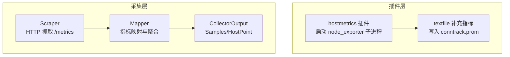
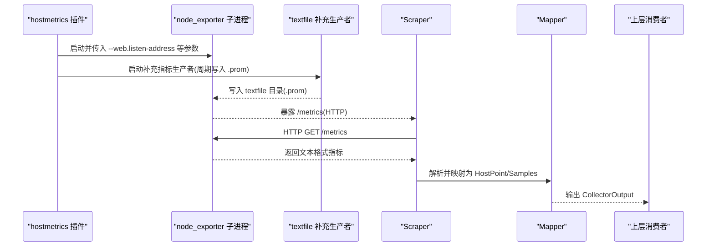
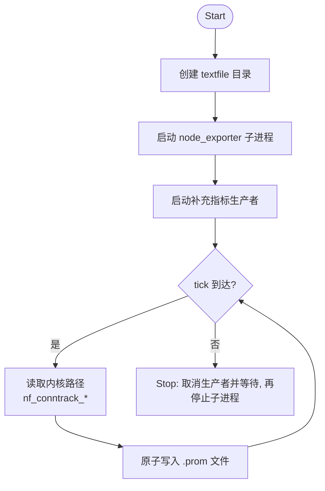
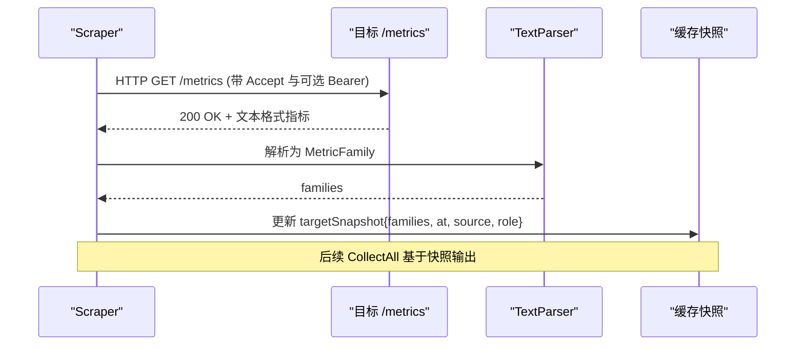
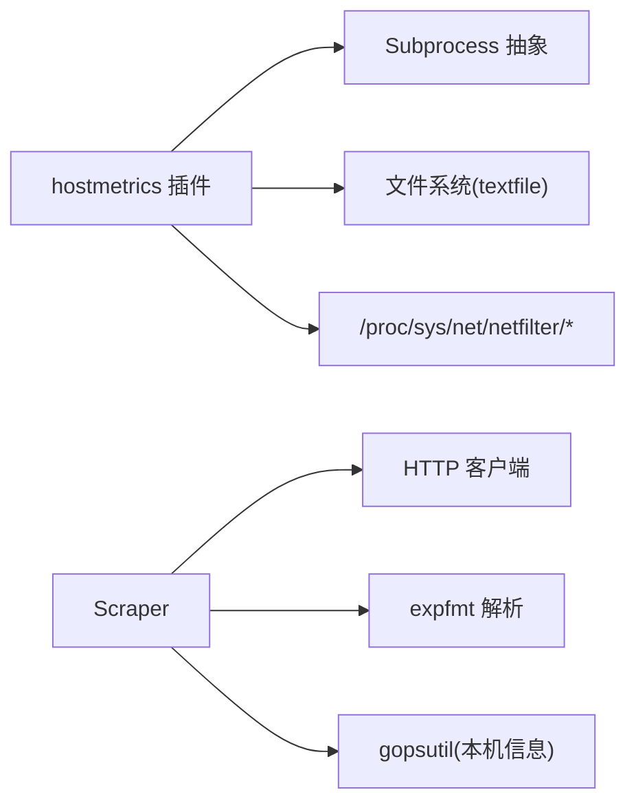

# 主机指标插件

<cite>
**本文引用的文件**
- [internal/edgeagent/plugins/hostmetrics/plugin.go](file://internal/edgeagent/plugins/hostmetrics/plugin.go)
- [internal/edgeagent/collector/scrape.go](file://internal/edgeagent/collector/scrape.go)
- [internal/edgeagent/collector/types.go](file://internal/edgeagent/collector/types.go)
- [internal/edgeagent/biz/collector/cpu.go](file://internal/edgeagent/biz/collector/cpu.go)
- [internal/edgeagent/biz/collector/mem.go](file://internal/edgeagent/biz/collector/mem.go)
- [internal/edgeagent/biz/collector/net.go](file://internal/edgeagent/biz/collector/net.go)
</cite>

## 目录
1. [简介](#简介)
2. [项目结构](#项目结构)
3. [核心组件](#核心组件)
4. [架构总览](#架构总览)
5. [详细组件分析](#详细组件分析)
6. [依赖关系分析](#依赖关系分析)
7. [性能考虑](#性能考虑)
8. [故障排查指南](#故障排查指南)
9. [结论](#结论)
10. [附录：配置与使用示例](#附录：配置与使用示例)

## 简介
本技术文档聚焦于“主机指标插件”的实现与工作原理，覆盖 CPU、内存、磁盘、网络等系统指标的采集方法；说明指标收集器的架构设计（数据采集器、处理器、导出器的协作）；解释跨平台兼容性（Linux、Windows、macOS）；阐述指标数据的预处理（清洗、格式转换、标签添加、时间序列对齐）；提供完整的配置示例与性能调优建议，并给出常见问题的故障排查指南。

## 项目结构
主机指标相关代码主要分布在两个层次：
- 插件层：以子进程方式运行 node_exporter，并通过 textfile 机制补充内核级连接跟踪指标。
- 采集层：通过 HTTP 抓取目标暴露的 Prometheus 文本格式指标，解析为内部统一模型，再输出到上层。

图表来源
- [internal/edgeagent/plugins/hostmetrics/plugin.go:62-93](file://internal/edgeagent/plugins/hostmetrics/plugin.go#L62-L93)
- [internal/edgeagent/plugins/hostmetrics/plugin.go:150-231](file://internal/edgeagent/plugins/hostmetrics/plugin.go#L150-L231)
- [internal/edgeagent/collector/scrape.go:58-77](file://internal/edgeagent/collector/scrape.go#L58-L77)
- [internal/edgeagent/collector/scrape.go:117-183](file://internal/edgeagent/collector/scrape.go#L117-L183)

章节来源
- [internal/edgeagent/plugins/hostmetrics/plugin.go:1-277](file://internal/edgeagent/plugins/hostmetrics/plugin.go#L1-L277)
- [internal/edgeagent/collector/scrape.go:1-415](file://internal/edgeagent/collector/scrape.go#L1-L415)
- [internal/edgeagent/collector/types.go:1-58](file://internal/edgeagent/collector/types.go#L1-L58)

## 核心组件
- hostmetrics 插件：负责启动 node_exporter 子进程，管理监听地址、启用/禁用 collectors、追加额外参数；同时维护一个 in-process 补充指标生产者，周期性将内核连接跟踪指标写入 textfile 目录，由 node_exporter 自动采集并对外暴露。
- Scraper 采集器：按目标配置周期发起 HTTP GET 抓取 /metrics，解析为 MetricFamily，缓存快照，并在 CollectAll 时转换为统一的 CollectorOutput（包含 Samples 和可选 HostPoint）。
- 类型与接口：定义 CollectorSource、CollectorOutput、Collector 接口，明确多目标采集与单源采集的统一返回约定。

章节来源
- [internal/edgeagent/plugins/hostmetrics/plugin.go:22-28](file://internal/edgeagent/plugins/hostmetrics/plugin.go#L22-L28)
- [internal/edgeagent/plugins/hostmetrics/plugin.go:62-93](file://internal/edgeagent/plugins/hostmetrics/plugin.go#L62-L93)
- [internal/edgeagent/collector/scrape.go:29-49](file://internal/edgeagent/collector/scrape.go#L29-L49)
- [internal/edgeagent/collector/types.go:9-58](file://internal/edgeagent/collector/types.go#L9-L58)

## 架构总览
主机指标插件采用“子进程 + 文本文件补充 + HTTP 抓取”的组合架构：
- 子进程：node_exporter 作为独立进程暴露 /metrics，支持丰富的系统指标采集能力。
- 文本文件补充：插件在本地工作目录下生成 .prom 文件，node_exporter 的 textfile collector 自动读取并合并到 /metrics。
- 抓取与处理：Scraper 定时抓取各目标的 /metrics，解析为 MetricFamily，映射为 HostPoint 或 Samples，供上层消费。

图表来源
- [internal/edgeagent/plugins/hostmetrics/plugin.go:62-93](file://internal/edgeagent/plugins/hostmetrics/plugin.go#L62-L93)
- [internal/edgeagent/plugins/hostmetrics/plugin.go:150-231](file://internal/edgeagent/plugins/hostmetrics/plugin.go#L150-L231)
- [internal/edgeagent/collector/scrape.go:117-183](file://internal/edgeagent/collector/scrape.go#L117-L183)
- [internal/edgeagent/collector/scrape.go:185-226](file://internal/edgeagent/collector/scrape.go#L185-L226)

## 详细组件分析

### hostmetrics 插件（子进程与补充指标）
- 启动与参数构建：根据 Spec 配置 listen_address、collectors_enabled、collectors_disabled、extra_args，并始终附加 textfile 目录参数，确保补充指标可被采集。
- 补充指标生产者：周期性读取内核路径（如 nf_conntrack_count/max），生成标准 Prometheus 文本格式，原子写入 .prom 文件，避免部分写入导致的解析失败。
- 生命周期管理：Start 创建 textfile 目录、启动子进程与生产者；Stop 先取消生产者并等待退出，再停止子进程，保证资源清理顺序正确。

图表来源
- [internal/edgeagent/plugins/hostmetrics/plugin.go:111-148](file://internal/edgeagent/plugins/hostmetrics/plugin.go#L111-L148)
- [internal/edgeagent/plugins/hostmetrics/plugin.go:150-231](file://internal/edgeagent/plugins/hostmetrics/plugin.go#L150-L231)

章节来源
- [internal/edgeagent/plugins/hostmetrics/plugin.go:62-93](file://internal/edgeagent/plugins/hostmetrics/plugin.go#L62-L93)
- [internal/edgeagent/plugins/hostmetrics/plugin.go:150-231](file://internal/edgeagent/plugins/hostmetrics/plugin.go#L150-L231)
- [internal/edgeagent/plugins/hostmetrics/plugin.go:233-246](file://internal/edgeagent/plugins/hostmetrics/plugin.go#L233-L246)

### Scraper 采集器（HTTP 抓取与处理）
- 多目标并发：每个目标一个 goroutine，按 Interval 周期抓取，立即执行一次抓取以减少首拍延迟。
- 请求与认证：支持 Bearer Token 文件注入 Authorization 头；TLS 最小版本限制；超时控制。
- 解析与缓存：使用 TextParser 解析响应体为 MetricFamily，更新 per-target 快照（含时间戳、source、role）。
- 输出转换：CollectAll 将快照转换为 CollectorOutput，包含 Samples（开放集合）和可选 HostPoint（快速路径，用于主机负载）。

图表来源
- [internal/edgeagent/collector/scrape.go:97-113](file://internal/edgeagent/collector/scrape.go#L97-L113)
- [internal/edgeagent/collector/scrape.go:117-183](file://internal/edgeagent/collector/scrape.go#L117-L183)
- [internal/edgeagent/collector/scrape.go:185-226](file://internal/edgeagent/collector/scrape.go#L185-L226)

章节来源
- [internal/edgeagent/collector/scrape.go:58-77](file://internal/edgeagent/collector/scrape.go#L58-L77)
- [internal/edgeagent/collector/scrape.go:97-113](file://internal/edgeagent/collector/scrape.go#L97-L113)
- [internal/edgeagent/collector/scrape.go:117-183](file://internal/edgeagent/collector/scrape.go#L117-L183)
- [internal/edgeagent/collector/scrape.go:185-226](file://internal/edgeagent/collector/scrape.go#L185-L226)

### 类型与接口（统一输出契约）
- CollectorSource：标识数据来源（embedded 或 scrape:<target_name>）。
- CollectorOutput：单次采集结果，包含 Source、HostPoint（快速路径）、Samples（开放集合）。
- Collector 接口：定义 CollectAll、HostInfo、GetHostLoad、GetProcessList 等方法，统一多目标与单源采集行为。

章节来源
- [internal/edgeagent/collector/types.go:9-58](file://internal/edgeagent/collector/types.go#L9-L58)

### 内置采集器占位（CPU/内存/网络）
当前内置采集器实现为 Phase 1 占位，返回零值，实际指标由 Scraper 从外部目标抓取或通过 hostmetrics 插件提供的 node_exporter 暴露。

章节来源
- [internal/edgeagent/biz/collector/cpu.go:9-14](file://internal/edgeagent/biz/collector/cpu.go#L9-L14)
- [internal/edgeagent/biz/collector/mem.go:9-14](file://internal/edgeagent/biz/collector/mem.go#L9-L14)
- [internal/edgeagent/biz/collector/net.go:9-14](file://internal/edgeagent/biz/collector/net.go#L9-L14)

## 依赖关系分析
- hostmetrics 插件依赖：
  - 子进程管理：通过通用 Subprocess 抽象启动 node_exporter。
  - 文件系统：读写 textfile 目录下的 .prom 文件。
  - 内核路径：读取 /proc/sys/net/netfilter/nf_conntrack_*（现代内核）或回退逻辑以避免重复指标冲突。
- Scraper 依赖：
  - HTTP 客户端：每目标独立 client，支持 TLS 与超时。
  - 解析库：expfmt.TextParser 将文本格式转为 MetricFamily。
  - gopsutil：用于 HostInfo、GetProcessList 等本机信息获取。

图表来源
- [internal/edgeagent/plugins/hostmetrics/plugin.go:62-93](file://internal/edgeagent/plugins/hostmetrics/plugin.go#L62-L93)
- [internal/edgeagent/plugins/hostmetrics/plugin.go:150-231](file://internal/edgeagent/plugins/hostmetrics/plugin.go#L150-L231)
- [internal/edgeagent/collector/scrape.go:360-377](file://internal/edgeagent/collector/scrape.go#L360-L377)
- [internal/edgeagent/collector/scrape.go:228-259](file://internal/edgeagent/collector/scrape.go#L228-L259)

章节来源
- [internal/edgeagent/plugins/hostmetrics/plugin.go:62-93](file://internal/edgeagent/plugins/hostmetrics/plugin.go#L62-L93)
- [internal/edgeagent/collector/scrape.go:360-377](file://internal/edgeagent/collector/scrape.go#L360-L377)
- [internal/edgeagent/collector/scrape.go:228-259](file://internal/edgeagent/collector/scrape.go#L228-L259)

## 性能考虑
- 采样间隔调整：
  - Scraper 的抓取间隔由目标配置决定；首次抓取立即执行以降低首拍延迟。
  - 补充指标生产者固定周期（约 15 秒），与典型 Prom 抓取节奏匹配，避免多余 I/O。
- 内存使用优化：
  - 每目标仅缓存最近一次 MetricFamily 快照，减少内存占用。
  - 使用 errgroup 并发抓取，避免阻塞主循环。
- CPU 占用控制：
  - 解析过程使用 expfmt，尽量复用解析器实例；对非 2xx 响应快速丢弃。
  - 子进程 node_exporter 承担系统指标采集开销，插件本身轻量。
- 连接池与超时：
  - 每目标独立 http.Client，设置 MaxIdleConns、IdleConnTimeout 与 TLS 最小版本，提升吞吐与安全性。
  - 抓取请求带超时，防止慢目标拖垮整体。

[本节为通用性能指导，不直接分析具体文件]

## 故障排查指南
- 连接跟踪指标为空：
  - 现象：conntrack 利用率面板空白。
  - 原因：旧版内核路径不存在，node_exporter 内置 collector 未命中。
  - 解决：插件会检测旧路径存在与否，若不存在则从 netfilter 路径读取并写入 textfile；确认 textfile 目录可写且 .prom 文件已生成。
- 指标重复冲突：
  - 现象：Prometheus 拒绝重复样本。
  - 原因：旧内核路径存在时，插件跳过补充写入以避免与 node_exporter 内置 collector 重复。
  - 解决：保持默认逻辑，不要手动重复写入相同指标。
- 抓取失败：
  - 现象：日志出现 “scrape: http error” 或 “non-2xx”。
  - 原因：目标不可达、端口错误、证书问题、鉴权失败。
  - 解决：检查 URL、Bearer Token 文件内容、TLS 配置与目标服务状态。
- 解析失败：
  - 现象：日志出现 “scrape: parse failed”。
  - 原因：/metrics 返回非标准文本格式或内容损坏。
  - 解决：验证目标 /metrics 输出是否符合 Prometheus 文本格式。
- 子进程异常：
  - 现象：node_exporter 无法启动或崩溃。
  - 原因：二进制缺失、端口冲突、参数错误。
  - 解决：检查 binDir 下 node_exporter 是否存在、listen_address 是否可用、Spec 中 collectors_enabled/disabled 是否正确。

章节来源
- [internal/edgeagent/plugins/hostmetrics/plugin.go:150-231](file://internal/edgeagent/plugins/hostmetrics/plugin.go#L150-L231)
- [internal/edgeagent/collector/scrape.go:117-183](file://internal/edgeagent/collector/scrape.go#L117-L183)

## 结论
主机指标插件通过子进程模式集成 node_exporter，并以 textfile 机制补齐内核级指标；Scraper 负责统一抓取、解析与输出，形成稳定的采集流水线。该设计具备良好的扩展性与跨平台兼容性，适用于 Linux、Windows、macOS 等多环境部署。通过合理的配置与性能调优，可实现高效、可靠的主机资源监控。

[本节为总结性内容，不直接分析具体文件]

## 附录：配置与使用示例
- 插件 Spec 键（manager UI Edge → Plugins → hostmetrics → Spec）：
  - listen_address：字符串，默认 :9102，用于 node_exporter 监听地址。
  - collectors_enabled：字符串数组，逐项传递 --collector.<name>。
  - collectors_disabled：字符串数组，逐项传递 --no-collector.<name>。
  - extra_args：字符串数组，原样追加到命令行参数末尾。
- 启用步骤：
  - 确保 binDir 下存在 node_exporter 二进制。
  - 配置 Spec 中的 listen_address 与 collectors 列表。
  - 启动插件后，Prometheus 可通过 docker bridge 抓取 host:port。
- 自定义采集：
  - 通过 collectors_enabled/disabled 精确控制启用的子系统采集器。
  - 通过 extra_args 透传更多 node_exporter 参数（谨慎使用）。
- 补充指标：
  - 插件自动写入 textfile 目录下的 .prom 文件，无需额外配置。
  - 若内核路径变化或模块未加载，插件会静默跳过，避免日志噪音。

章节来源
- [internal/edgeagent/plugins/hostmetrics/plugin.go:22-28](file://internal/edgeagent/plugins/hostmetrics/plugin.go#L22-L28)
- [internal/edgeagent/plugins/hostmetrics/plugin.go:62-93](file://internal/edgeagent/plugins/hostmetrics/plugin.go#L62-L93)
- [internal/edgeagent/plugins/hostmetrics/plugin.go:233-246](file://internal/edgeagent/plugins/hostmetrics/plugin.go#L233-L246)