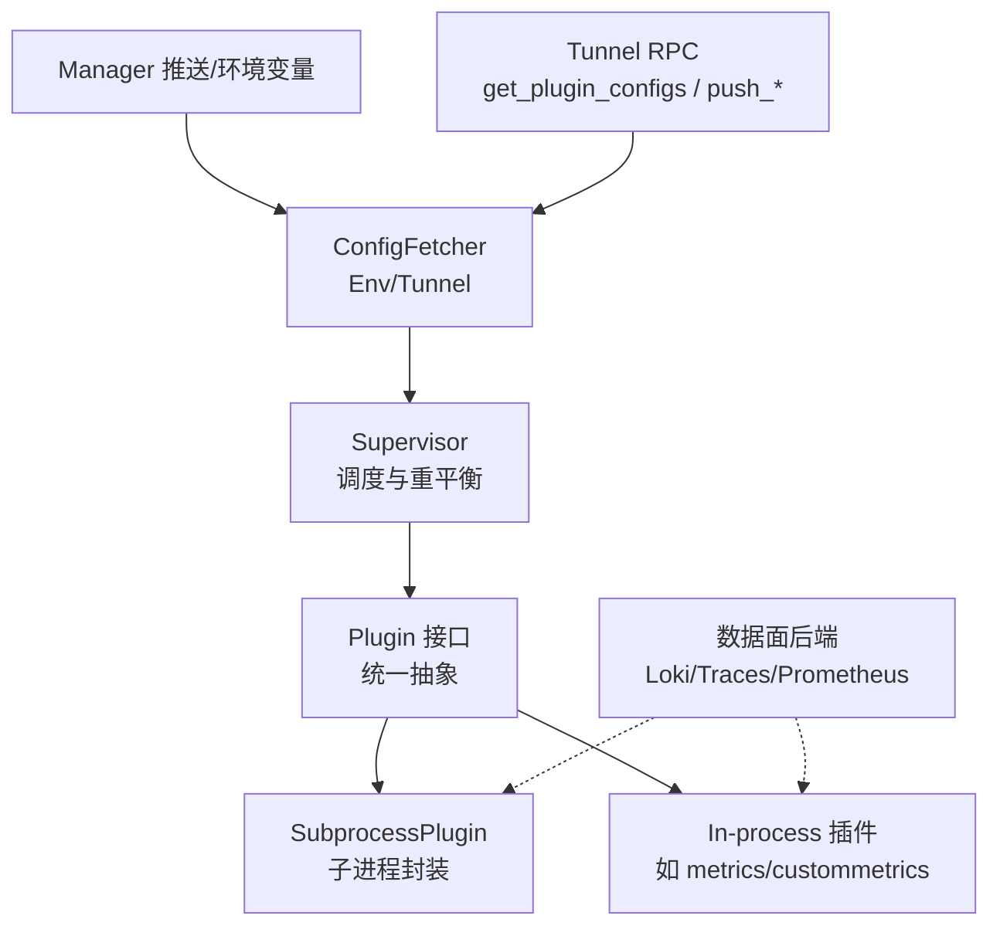
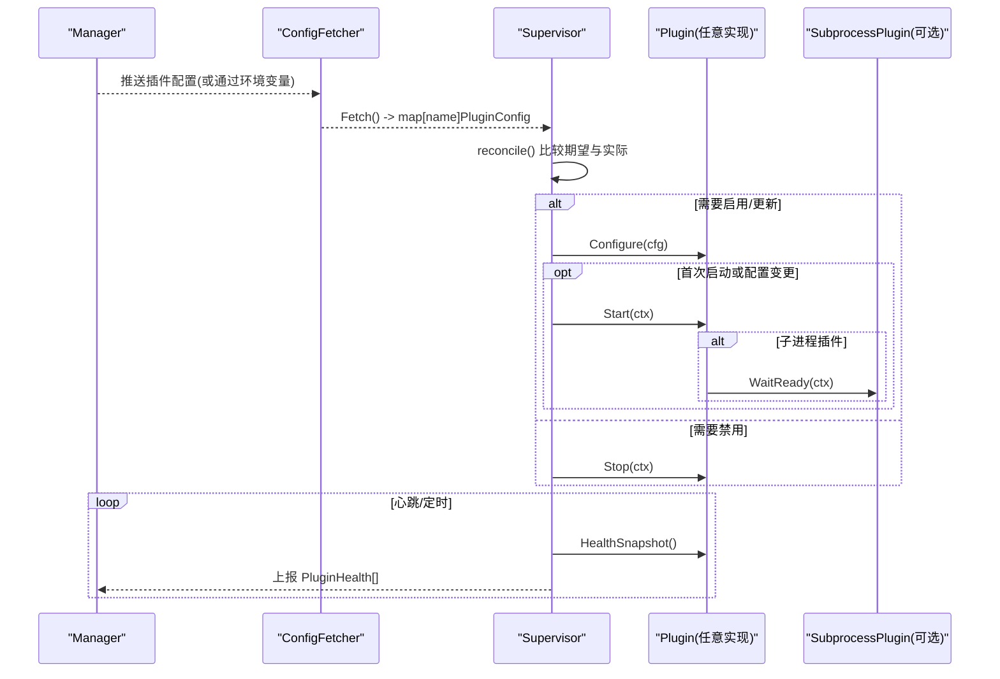
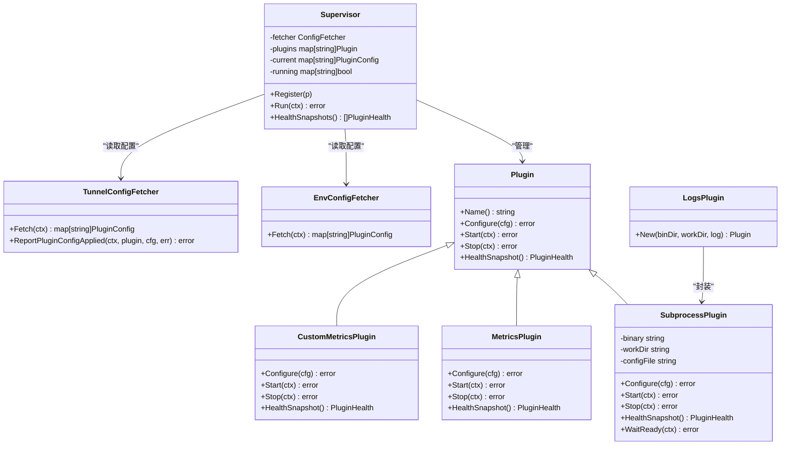
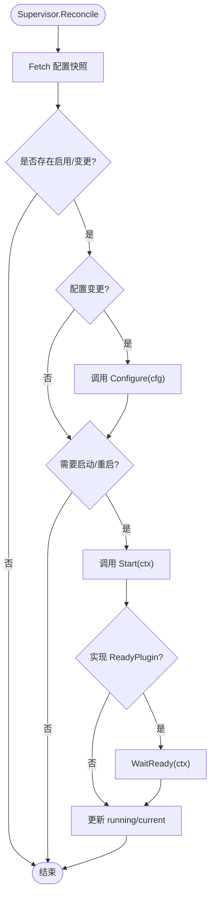
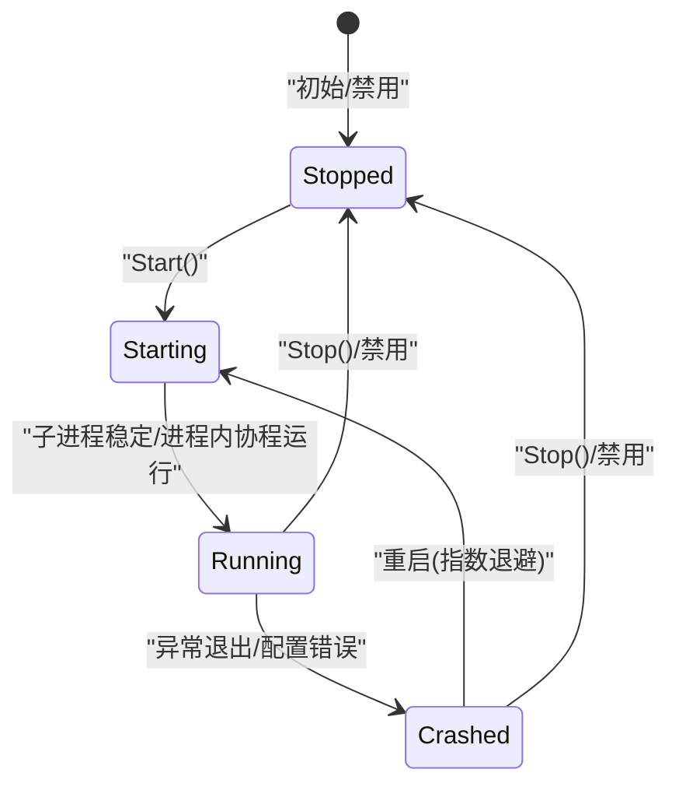

# 插件接口规范

<cite>
**本文引用的文件**
- [internal/edgeagent/plugins/plugin.go](file://internal/edgeagent/plugins/plugin.go)
- [internal/edgeagent/plugins/supervisor.go](file://internal/edgeagent/plugins/supervisor.go)
- [internal/edgeagent/plugins/config_env.go](file://internal/edgeagent/plugins/config_env.go)
- [internal/edgeagent/plugins/config_tunnel.go](file://internal/edgeagent/plugins/config_tunnel.go)
- [internal/edgeagent/plugins/subprocess.go](file://internal/edgeagent/plugins/subprocess.go)
- [internal/edgeagent/plugins/metrics/plugin.go](file://internal/edgeagent/plugins/metrics/plugin.go)
- [internal/edgeagent/plugins/logs/plugin.go](file://internal/edgeagent/plugins/logs/plugin.go)
- [internal/edgeagent/plugins/custommetrics/plugin.go](file://internal/edgeagent/plugins/custommetrics/plugin.go)
</cite>

## 目录
1. [简介](#简介)
2. [项目结构](#项目结构)
3. [核心组件](#核心组件)
4. [架构总览](#架构总览)
5. [详细组件分析](#详细组件分析)
6. [依赖关系分析](#依赖关系分析)
7. [性能考量](#性能考量)
8. [故障排查指南](#故障排查指南)
9. [结论](#结论)
10. [附录](#附录)

## 简介
本规范定义边缘侧插件的运行时接口与生命周期管理，涵盖：
- Plugin 接口的职责划分与调用时机（Name、Configure、Start、Stop、HealthSnapshot）
- 插件配置结构 PluginConfig 字段语义与配置来源
- 插件生命周期状态机（StateStopped、StateStarting、StateRunning、StateCrashed）及转换规则
- 健康检查机制（PluginHealth、TargetHealth）与上报频率
- 子进程插件封装与实现示例（logs/traces 等）
- 最佳实践与常见陷阱

## 项目结构
插件子系统位于 internal/edgeagent/plugins，核心由“接口 + 调度器 + 配置拉取 + 子进程封装 + 具体插件”组成。Supervisor 负责按配置驱动插件 Configure/Start/Stop，并周期性收集 HealthSnapshot 上报。

图表来源
- [internal/edgeagent/plugins/supervisor.go:12-47](file://internal/edgeagent/plugins/supervisor.go#L12-L47)
- [internal/edgeagent/plugins/plugin.go:18-52](file://internal/edgeagent/plugins/plugin.go#L18-L52)
- [internal/edgeagent/plugins/config_tunnel.go:18-27](file://internal/edgeagent/plugins/config_tunnel.go#L18-L27)
- [internal/edgeagent/plugins/config_env.go:10-34](file://internal/edgeagent/plugins/config_env.go#L10-L34)
- [internal/edgeagent/plugins/subprocess.go:17-31](file://internal/edgeagent/plugins/subprocess.go#L17-L31)

章节来源
- [internal/edgeagent/plugins/plugin.go:1-52](file://internal/edgeagent/plugins/plugin.go#L1-L52)
- [internal/edgeagent/plugins/supervisor.go:12-47](file://internal/edgeagent/plugins/supervisor.go#L12-L47)

## 核心组件
- Plugin 接口：统一抽象所有插件能力，规定 Name、Configure、Start、Stop、HealthSnapshot 的职责与调用顺序。
- Supervisor：注册插件、周期拉取配置、对比期望与实际状态、执行 Configure/Start/Stop、收集健康快照。
- ConfigFetcher：从环境变量或隧道 RPC 获取每插件配置，支持回退与缓存。
- SubprocessPlugin：通用子进程插件封装，处理配置渲染、校验、启动、崩溃重启、日志输出与健康状态。
- 具体插件：metrics（进程内抓取）、custommetrics（多目标抓取）、logs（otelcol-contrib 子进程）。

章节来源
- [internal/edgeagent/plugins/plugin.go:18-127](file://internal/edgeagent/plugins/plugin.go#L18-L127)
- [internal/edgeagent/plugins/supervisor.go:12-133](file://internal/edgeagent/plugins/supervisor.go#L12-L133)
- [internal/edgeagent/plugins/config_env.go:10-76](file://internal/edgeagent/plugins/config_env.go#L10-L76)
- [internal/edgeagent/plugins/config_tunnel.go:18-186](file://internal/edgeagent/plugins/config_tunnel.go#L18-L186)
- [internal/edgeagent/plugins/subprocess.go:17-135](file://internal/edgeagent/plugins/subprocess.go#L17-L135)
- [internal/edgeagent/plugins/metrics/plugin.go:64-102](file://internal/edgeagent/plugins/metrics/plugin.go#L64-L102)
- [internal/edgeagent/plugins/custommetrics/plugin.go:31-63](file://internal/edgeagent/plugins/custommetrics/plugin.go#L31-L63)
- [internal/edgeagent/plugins/logs/plugin.go:20-41](file://internal/edgeagent/plugins/logs/plugin.go#L20-L41)

## 架构总览
Supervisor 在启动时读取已知插件集合，通过 ConfigFetcher 获取当前配置快照，计算差异后对每个插件执行 Configure/Start/Stop；同时周期性触发健康快照收集。子进程插件通过 SubprocessPlugin 统一管理二进制生命周期与崩溃恢复。

图表来源
- [internal/edgeagent/plugins/supervisor.go:112-243](file://internal/edgeagent/plugins/supervisor.go#L112-L243)
- [internal/edgeagent/plugins/config_tunnel.go:100-186](file://internal/edgeagent/plugins/config_tunnel.go#L100-L186)
- [internal/edgeagent/plugins/config_env.go:45-76](file://internal/edgeagent/plugins/config_env.go#L45-L76)
- [internal/edgeagent/plugins/subprocess.go:53-84](file://internal/edgeagent/plugins/subprocess.go#L53-L84)

## 详细组件分析

### Plugin 接口与生命周期
- Name：返回信号名（如 metrics/logs/traces），作为注册键与显示标识。
- Configure：接收 manager 推送或环境回退的配置；必须幂等可重入；错误将导致插件进入“crashed”可见态。
- Start：开始工作；对子进程即拉起二进制，对进程内插件即启动协程；需幂等（重复 Start 安全）。
- Stop：优雅关闭；对子进程发送 SIGTERM 并等待退出；对进程内取消上下文；未运行调用为 no-op。
- HealthSnapshot：非阻塞地返回当前健康快照；由 Supervisor 周期性调用。

调用顺序：Configure → Start → (HealthSnapshot)* → Stop。

章节来源
- [internal/edgeagent/plugins/plugin.go:18-52](file://internal/edgeagent/plugins/plugin.go#L18-L52)

### 插件配置结构 PluginConfig
- Enabled：是否启用该插件。
- EdgeID：用于遥测标签的设备 ID（manager 解析后的 host device_id）。
- Endpoint：数据面推送地址（如 Loki/Traces/Prometheus 端点）。
- AuthUser/AuthPass：数据面认证凭据（Basic 用户名/密码或 bearer token）。
- Spec：插件特定 JSON 设置（如 logs 的 journald units/files，traces 的 receiver 设置等）。

配置来源：
- 隧道 RPC：TunnelConfigFetcher 从 Manager 拉取 per-edge 配置，并在 Kubernetes 场景下注入默认值。
- 环境变量：EnvConfigFetcher 从固定命名空间的环境变量构建快照，作为冷启动或离线回退。

章节来源
- [internal/edgeagent/plugins/plugin.go:54-71](file://internal/edgeagent/plugins/plugin.go#L54-L71)
- [internal/edgeagent/plugins/config_tunnel.go:18-27](file://internal/edgeagent/plugins/config_tunnel.go#L18-L27)
- [internal/edgeagent/plugins/config_tunnel.go:100-186](file://internal/edgeagent/plugins/config_tunnel.go#L100-L186)
- [internal/edgeagent/plugins/config_env.go:10-76](file://internal/edgeagent/plugins/config_env.go#L10-L76)

### 生命周期状态与转换
状态枚举：
- StateStopped：已停止或未运行。
- StateStarting：正在启动（子进程已创建但未稳定）。
- StateRunning：正常运行。
- StateCrashed：崩溃（非预期退出或配置/启动失败）。

关键转换：
- 禁用：→ StateStopped
- 首次启动/重启：→ StateStarting → StateRunning
- 子进程异常退出：→ StateCrashed（随后按指数退避重试）
- 配置变更：先 Configure，再视需要 Stop+Start

Supervisor 在每次 reconcile 中根据期望配置决定动作；子进程插件内部维护 RestartCount 与 PID。

章节来源
- [internal/edgeagent/plugins/plugin.go:73-95](file://internal/edgeagent/plugins/plugin.go#L73-L95)
- [internal/edgeagent/plugins/supervisor.go:175-243](file://internal/edgeagent/plugins/supervisor.go#L175-L243)
- [internal/edgeagent/plugins/subprocess.go:267-308](file://internal/edgeagent/plugins/subprocess.go#L267-L308)

### 健康检查机制
- PluginHealth：包含 Name、State、LastError、RestartCount、PID、StartedAt、UpdatedAt、Targets（多目标插件）。
- TargetHealth：针对多目标插件（如 custommetrics/databasemetrics）的单个目标状态，含 ID、Name、Kind、State、LastError、Samples、LastSuccessAt、UpdatedAt。

上报频率：
- Supervisor 周期性调用 HealthSnapshots() 汇总各插件健康信息，供心跳路径上报给 Manager。
- 插件自身在每次健康快照中刷新 UpdatedAt；子进程插件在每次运行/崩溃/重启时更新状态与时间戳。

章节来源
- [internal/edgeagent/plugins/plugin.go:83-108](file://internal/edgeagent/plugins/plugin.go#L83-L108)
- [internal/edgeagent/plugins/supervisor.go:94-110](file://internal/edgeagent/plugins/supervisor.go#L94-L110)
- [internal/edgeagent/plugins/subprocess.go:258-265](file://internal/edgeagent/plugins/subprocess.go#L258-L265)
- [internal/edgeagent/plugins/custommetrics/plugin.go:122-133](file://internal/edgeagent/plugins/custommetrics/plugin.go#L122-L133)

### 子进程插件封装（SubprocessPlugin）
职责：
- 配置渲染与原子替换（临时文件 + 校验 + rename）
- 子进程启动、SIGTERM 优雅退出、WaitDelay 兜底
- 崩溃检测与指数退避重启（1s 起，上限 5min）
- 日志写入工作目录下的 .log 文件
- 提供 WaitReady 以等待子进程稳定

实现要点：
- Configure：确保工作目录存在，渲染配置到文件，校验通过后原子替换。
- Start：检查二进制存在，启动 runLoop，记录 StartedAt/PID。
- Stop：取消上下文并等待退出，超时保护。
- HealthSnapshot：返回当前健康记录。

章节来源
- [internal/edgeagent/plugins/subprocess.go:17-135](file://internal/edgeagent/plugins/subprocess.go#L17-L135)
- [internal/edgeagent/plugins/subprocess.go:140-206](file://internal/edgeagent/plugins/subprocess.go#L140-L206)
- [internal/edgeagent/plugins/subprocess.go:208-265](file://internal/edgeagent/plugins/subprocess.go#L208-L265)
- [internal/edgeagent/plugins/subprocess.go:267-384](file://internal/edgeagent/plugins/subprocess.go#L267-L384)

### 具体插件实现示例

#### metrics（进程内抓取）
- 类型：进程内插件，定期抓取本地 /metrics 并通过隧道 RPC 推送样本。
- 生命周期：Configure 校验 spec；Start 启动抓取循环；Stop 取消并等待；HealthSnapshot 返回统计与状态。
- 健康：scrape/push 成功则 State=running，失败累积 LastError；EdgeID 未就绪时延迟推送。

章节来源
- [internal/edgeagent/plugins/metrics/plugin.go:64-102](file://internal/edgeagent/plugins/metrics/plugin.go#L64-L102)
- [internal/edgeagent/plugins/metrics/plugin.go:107-179](file://internal/edgeagent/plugins/metrics/plugin.go#L107-L179)
- [internal/edgeagent/plugins/metrics/plugin.go:181-306](file://internal/edgeagent/plugins/metrics/plugin.go#L181-L306)

#### custommetrics（多目标抓取）
- 类型：进程内插件，支持多个 Prometheus 目标并行抓取，维护 Targets 列表。
- 生命周期：Configure 解析 targets；Start 启动并发任务；Stop 取消并等待；HealthSnapshot 聚合 Targets。
- 健康：每个目标独立状态（disabled/running/failed），记录 Samples、LastSuccessAt、LastError。

章节来源
- [internal/edgeagent/plugins/custommetrics/plugin.go:31-63](file://internal/edgeagent/plugins/custommetrics/plugin.go#L31-L63)
- [internal/edgeagent/plugins/custommetrics/plugin.go:67-133](file://internal/edgeagent/plugins/custommetrics/plugin.go#L67-L133)
- [internal/edgeagent/plugins/custommetrics/plugin.go:135-291](file://internal/edgeagent/plugins/custommetrics/plugin.go#L135-L291)

#### logs（子进程 otelcol-contrib）
- 类型：子进程插件，使用 SubprocessPlugin 包装 otelcol-contrib 二进制。
- 生命周期：Configure 渲染 otelcol.yaml；Start 启动子进程；Stop 优雅终止；HealthSnapshot 反映子进程状态。
- 健康：子进程崩溃会进入 StateCrashed，自动重启；PID 与 StartedAt 由子进程封装维护。

章节来源
- [internal/edgeagent/plugins/logs/plugin.go:20-41](file://internal/edgeagent/plugins/logs/plugin.go#L20-L41)
- [internal/edgeagent/plugins/subprocess.go:140-206](file://internal/edgeagent/plugins/subprocess.go#L140-L206)
- [internal/edgeagent/plugins/subprocess.go:208-384](file://internal/edgeagent/plugins/subprocess.go#L208-L384)

### 类图（代码级）

图表来源
- [internal/edgeagent/plugins/plugin.go:18-127](file://internal/edgeagent/plugins/plugin.go#L18-L127)
- [internal/edgeagent/plugins/supervisor.go:12-133](file://internal/edgeagent/plugins/supervisor.go#L12-L133)
- [internal/edgeagent/plugins/config_env.go:10-76](file://internal/edgeagent/plugins/config_env.go#L10-L76)
- [internal/edgeagent/plugins/config_tunnel.go:18-186](file://internal/edgeagent/plugins/config_tunnel.go#L18-L186)
- [internal/edgeagent/plugins/subprocess.go:17-135](file://internal/edgeagent/plugins/subprocess.go#L17-L135)
- [internal/edgeagent/plugins/metrics/plugin.go:64-102](file://internal/edgeagent/plugins/metrics/plugin.go#L64-L102)
- [internal/edgeagent/plugins/custommetrics/plugin.go:31-63](file://internal/edgeagent/plugins/custommetrics/plugin.go#L31-L63)
- [internal/edgeagent/plugins/logs/plugin.go:20-41](file://internal/edgeagent/plugins/logs/plugin.go#L20-L41)

### 流程图（算法/逻辑）

图表来源
- [internal/edgeagent/plugins/supervisor.go:135-243](file://internal/edgeagent/plugins/supervisor.go#L135-L243)
- [internal/edgeagent/plugins/subprocess.go:53-84](file://internal/edgeagent/plugins/subprocess.go#L53-L84)

## 依赖关系分析
- Supervisor 强依赖 ConfigFetcher 提供的配置快照；若 Fetch 失败，保持上一状态并记录告警。
- 子进程插件依赖外部二进制存在性与可执行权限；缺失将直接报错。
- 进程内插件依赖隧道客户端进行数据面推送；EdgeID 未就绪时会延迟推送。
- TunnelConfigFetcher 在 Kubernetes 环境下注入默认值（如 endpoint、extra_attrs、CLI args）。

潜在耦合：
- Supervisor 与具体插件通过 Plugin 接口解耦，新增插件只需实现接口并注册。
- 配置来源切换（Env/Tunnel）通过 ConfigFetcher 接口隔离，便于扩展。

章节来源
- [internal/edgeagent/plugins/supervisor.go:135-143](file://internal/edgeagent/plugins/supervisor.go#L135-L143)
- [internal/edgeagent/plugins/subprocess.go:208-229](file://internal/edgeagent/plugins/subprocess.go#L208-L229)
- [internal/edgeagent/plugins/metrics/plugin.go:246-282](file://internal/edgeagent/plugins/metrics/plugin.go#L246-L282)
- [internal/edgeagent/plugins/config_tunnel.go:212-393](file://internal/edgeagent/plugins/config_tunnel.go#L212-L393)

## 性能考量
- 抓取间隔与超时：进程内插件应合理设置 scrape_interval 与 timeout，避免频繁 I/O。
- 子进程重启退避：指数退避上限 5 分钟，防止风暴式重启。
- 配置变更最小化：仅当配置语义变化时才触发重启，减少不必要的抖动。
- 健康快照非阻塞：HealthSnapshot 必须快速返回，避免影响心跳。

[本节为通用指导，不直接分析具体文件]

## 故障排查指南
常见问题与定位：
- 插件未启动：检查 Supervisor 日志中的 “starting/stopping plugin”，确认 Enable 与配置是否正确。
- 子进程崩溃：查看工作目录下 .log 文件与 LastError；关注 RestartCount 增长。
- 配置应用失败：TunnelConfigFetcher 会在 materialize 阶段报告错误；检查 Spec 合法性。
- 数据面推送失败：进程内插件会记录 push 错误；确认 Endpoint、AuthUser/AuthPass、EdgeID 就绪。

章节来源
- [internal/edgeagent/plugins/supervisor.go:175-243](file://internal/edgeagent/plugins/supervisor.go#L175-L243)
- [internal/edgeagent/plugins/subprocess.go:267-308](file://internal/edgeagent/plugins/subprocess.go#L267-L308)
- [internal/edgeagent/plugins/config_tunnel.go:172-186](file://internal/edgeagent/plugins/config_tunnel.go#L172-L186)
- [internal/edgeagent/plugins/metrics/plugin.go:220-282](file://internal/edgeagent/plugins/metrics/plugin.go#L220-L282)

## 结论
本规范通过统一的 Plugin 接口与 Supervisor 调度，实现了插件能力的标准化接入与生命周期管理。结合 ConfigFetcher 的多源配置与 SubprocessPlugin 的健壮封装，系统可在不同部署形态下稳定运行。遵循本规范可实现插件的可插拔、可观测与可运维。

[本节为总结性内容，不直接分析具体文件]

## 附录

### 插件状态机（代码级）

图表来源
- [internal/edgeagent/plugins/plugin.go:73-95](file://internal/edgeagent/plugins/plugin.go#L73-L95)
- [internal/edgeagent/plugins/subprocess.go:267-308](file://internal/edgeagent/plugins/subprocess.go#L267-L308)

### 最佳实践
- 正确实现 Configure：校验 Spec，幂等处理，错误及时返回以便 Supervisor 标记为 crashed。
- Start/Stop 幂等：重复调用不应产生副作用；Stop 必须能优雅退出。
- HealthSnapshot 非阻塞：避免耗时操作；及时刷新 UpdatedAt。
- 子进程插件：确保二进制存在、配置校验严格、日志落盘清晰。
- 配置来源：优先使用 TunnelConfigFetcher；EnvConfigFetcher 作为回退。

[本节为通用指导，不直接分析具体文件]

### 常见陷阱
- 忽略 EdgeID 未就绪：进程内插件应在 EdgeID=0 时延迟推送而非丢弃全部数据。
- 配置变更未触发重启：仅当配置语义变化才重启，避免无意义抖动。
- 子进程未优雅退出：SIGTERM 后需等待退出，避免僵尸进程。
- 健康快照阻塞：影响心跳上报，导致监控延迟。

[本节为通用指导，不直接分析具体文件]