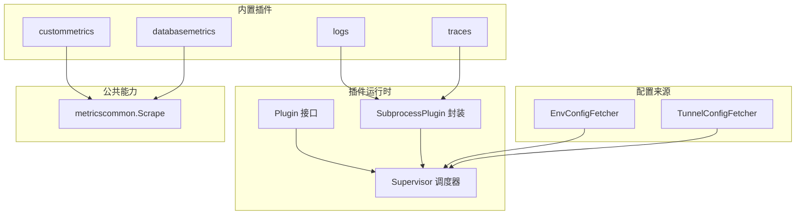
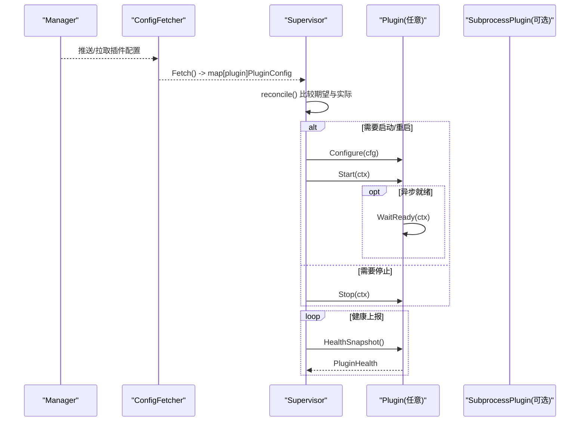
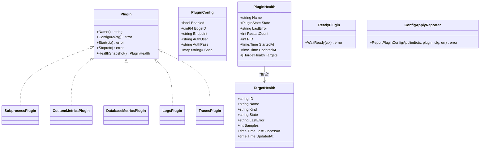
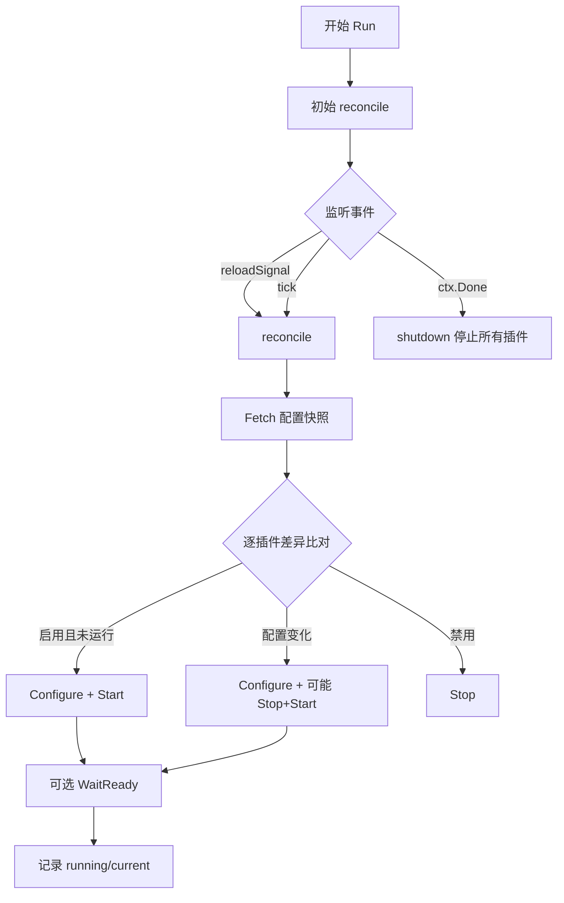
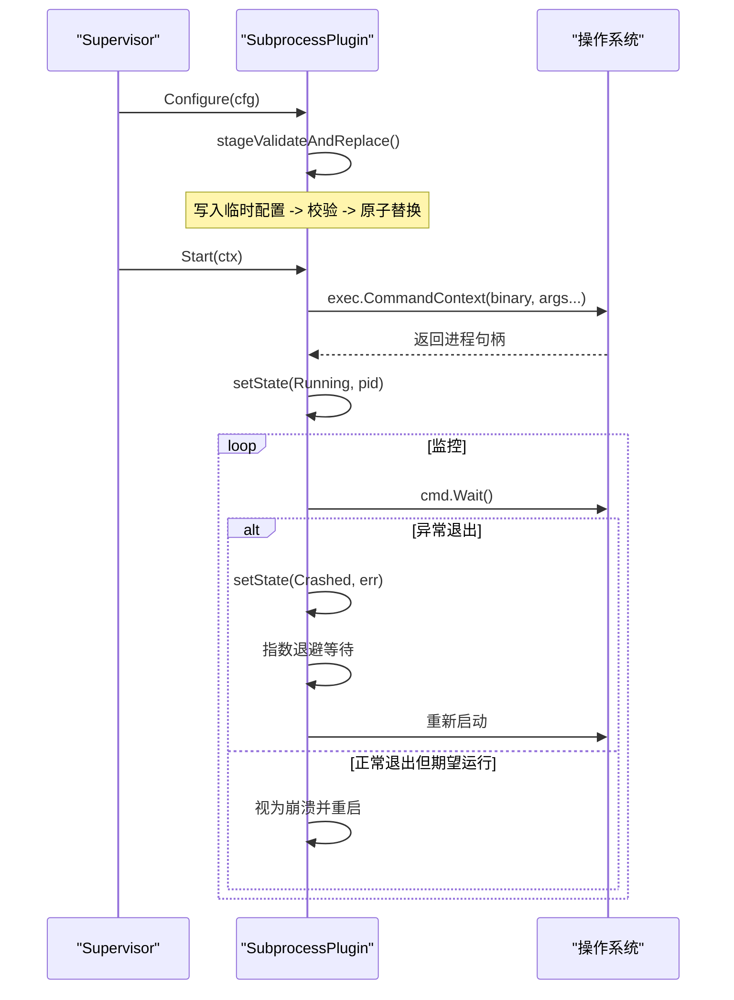
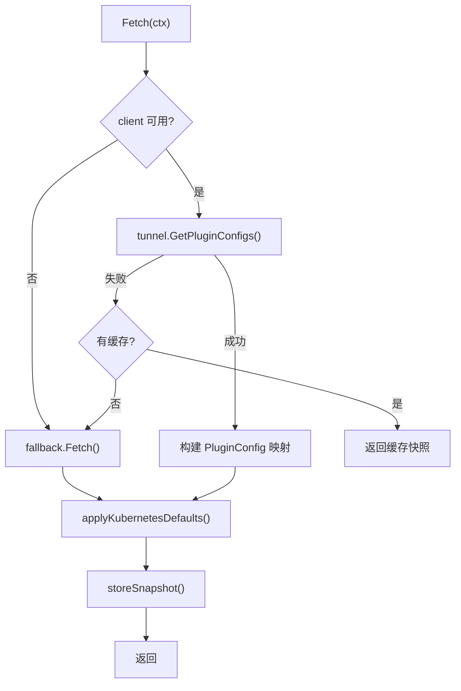
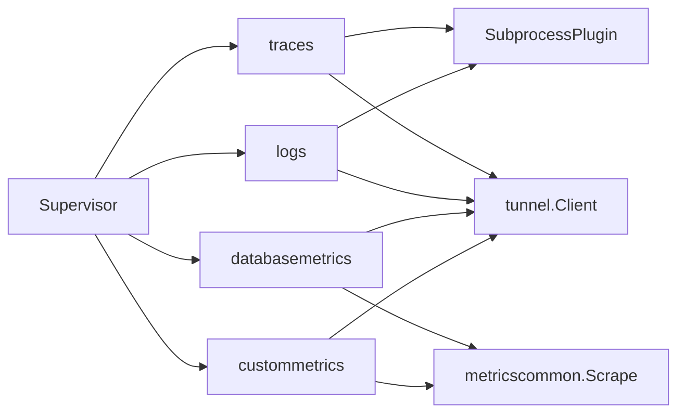

# 插件系统

<cite>
**本文引用的文件**
- [internal/edgeagent/plugins/plugin.go](file://internal/edgeagent/plugins/plugin.go)
- [internal/edgeagent/plugins/supervisor.go](file://internal/edgeagent/plugins/supervisor.go)
- [internal/edgeagent/plugins/subprocess.go](file://internal/edgeagent/plugins/subprocess.go)
- [internal/edgeagent/plugins/config_env.go](file://internal/edgeagent/plugins/config_env.go)
- [internal/edgeagent/plugins/config_tunnel.go](file://internal/edgeagent/plugins/config_tunnel.go)
- [internal/edgeagent/plugins/logs/plugin.go](file://internal/edgeagent/plugins/logs/plugin.go)
- [internal/edgeagent/plugins/traces/plugin.go](file://internal/edgeagent/plugins/traces/plugin.go)
- [internal/edgeagent/plugins/custommetrics/plugin.go](file://internal/edgeagent/plugins/custommetrics/plugin.go)
- [internal/edgeagent/plugins/custommetrics/spec.go](file://internal/edgeagent/plugins/custommetrics/spec.go)
- [internal/edgeagent/plugins/databasemetrics/plugin.go](file://internal/edgeagent/plugins/databasemetrics/plugin.go)
- [internal/edgeagent/plugins/databasemetrics/spec.go](file://internal/edgeagent/plugins/databasemetrics/spec.go)
- [internal/edgeagent/plugins/metricscommon/scrape.go](file://internal/edgeagent/plugins/metricscommon/scrape.go)
- [cmd/ongrid/main.go](file://cmd/ongrid/main.go)
</cite>

## 目录
1. [简介](#简介)
2. [项目结构](#项目结构)
3. [核心组件](#核心组件)
4. [架构总览](#架构总览)
5. [详细组件分析](#详细组件分析)
6. [依赖关系分析](#依赖关系分析)
7. [性能考量](#性能考量)
8. [故障排查指南](#故障排查指南)
9. [结论](#结论)
10. [附录](#附录)

## 简介
本插件系统为边缘侧（ongrid-edge）提供可插拔的遥测能力，包括指标、日志、链路追踪等。其设计目标：
- 统一插件接口与生命周期管理，支持进程内插件与子进程插件两种形态
- 通过配置拉取器（环境变量或隧道 RPC）动态下发配置并热更新
- 提供健壮的重启策略、健康上报与错误传播机制
- 为自定义采集器提供清晰的开发规范与示例

## 项目结构
插件子系统位于 internal/edgeagent/plugins，围绕以下关键模块组织：
- 插件接口与通用数据结构：plugin.go
- 插件编排与调度：supervisor.go
- 子进程插件封装：subprocess.go
- 配置来源：config_env.go、config_tunnel.go
- 内置插件实现：logs、traces、custommetrics、databasemetrics、hostmetrics、procmetrics、metrics
- 公共采集工具：metricscommon

图表来源
- [internal/edgeagent/plugins/plugin.go:18-52](file://internal/edgeagent/plugins/plugin.go#L18-L52)
- [internal/edgeagent/plugins/supervisor.go:12-47](file://internal/edgeagent/plugins/supervisor.go#L12-L47)
- [internal/edgeagent/plugins/subprocess.go:17-51](file://internal/edgeagent/plugins/subprocess.go#L17-L51)
- [internal/edgeagent/plugins/config_env.go:10-36](file://internal/edgeagent/plugins/config_env.go#L10-L36)
- [internal/edgeagent/plugins/config_tunnel.go:18-55](file://internal/edgeagent/plugins/config_tunnel.go#L18-L55)
- [internal/edgeagent/plugins/logs/plugin.go:20-41](file://internal/edgeagent/plugins/logs/plugin.go#L20-L41)
- [internal/edgeagent/plugins/traces/plugin.go:20-49](file://internal/edgeagent/plugins/traces/plugin.go#L20-L49)
- [internal/edgeagent/plugins/custommetrics/plugin.go:23-43](file://internal/edgeagent/plugins/custommetrics/plugin.go#L23-L43)
- [internal/edgeagent/plugins/databasemetrics/plugin.go:29-51](file://internal/edgeagent/plugins/databasemetrics/plugin.go#L29-L51)
- [internal/edgeagent/plugins/metricscommon/scrape.go:22-51](file://internal/edgeagent/plugins/metricscommon/scrape.go#L22-L51)

章节来源
- [internal/edgeagent/plugins/plugin.go:1-135](file://internal/edgeagent/plugins/plugin.go#L1-L135)
- [internal/edgeagent/plugins/supervisor.go:1-301](file://internal/edgeagent/plugins/supervisor.go#L1-L301)
- [internal/edgeagent/plugins/subprocess.go:1-391](file://internal/edgeagent/plugins/subprocess.go#L1-L391)

## 核心组件
- Plugin 接口：定义 Name、Configure、Start、Stop、HealthSnapshot，统一进程内与子进程插件的生命周期
- Supervisor：注册插件、周期性拉取配置、对比差异并应用（启动/停止/重配）、健康快照汇总
- SubprocessPlugin：封装子进程二进制（如 otelcol-contrib），负责配置渲染、校验、原子替换、崩溃重启与日志捕获
- ConfigFetcher：抽象配置来源，支持环境变量与隧道 RPC，具备回退与缓存能力
- 内置插件：
  - logs/traces：基于 otelcol-contrib 子进程，直接推送至数据面
  - custommetrics：按目标 URL 抓取 Prometheus 指标并通过隧道上报
  - databasemetrics：为数据库源启动 exporter 子进程并抓取指标

章节来源
- [internal/edgeagent/plugins/plugin.go:18-135](file://internal/edgeagent/plugins/plugin.go#L18-L135)
- [internal/edgeagent/plugins/supervisor.go:56-133](file://internal/edgeagent/plugins/supervisor.go#L56-L133)
- [internal/edgeagent/plugins/subprocess.go:86-135](file://internal/edgeagent/plugins/subprocess.go#L86-L135)
- [internal/edgeagent/plugins/config_env.go:45-76](file://internal/edgeagent/plugins/config_env.go#L45-L76)
- [internal/edgeagent/plugins/config_tunnel.go:100-186](file://internal/edgeagent/plugins/config_tunnel.go#L100-L186)

## 架构总览
插件系统采用“接口 + 调度器 + 具体实现”的分层架构：
- 上层：Supervisor 负责协调所有已注册插件
- 中层：各插件实现遵循 Plugin 接口，内部可选择进程内或子进程模式
- 下层：配置拉取器提供配置快照；metricscommon 提供统一的抓取与上报能力

图表来源
- [internal/edgeagent/plugins/supervisor.go:114-243](file://internal/edgeagent/plugins/supervisor.go#L114-L243)
- [internal/edgeagent/plugins/plugin.go:18-52](file://internal/edgeagent/plugins/plugin.go#L18-L52)
- [internal/edgeagent/plugins/subprocess.go:53-84](file://internal/edgeagent/plugins/subprocess.go#L53-L84)

## 详细组件分析

### 插件接口与生命周期
- 生命周期顺序：Configure → Start → (HealthSnapshot)* → Stop
- 幂等性要求：Start/Stop 需可重复调用；Configure 需能安全重载
- 健康状态：stopped/starting/running/crashed，包含 PID、错误信息、重启计数、时间戳
- 可选扩展：
  - ReadyPlugin：WaitReady 用于等待子进程稳定
  - ConfigApplyReporter：向 Manager 报告配置应用结果

图表来源
- [internal/edgeagent/plugins/plugin.go:18-135](file://internal/edgeagent/plugins/plugin.go#L18-L135)

章节来源
- [internal/edgeagent/plugins/plugin.go:18-135](file://internal/edgeagent/plugins/plugin.go#L18-L135)

### 调度器（Supervisor）
- 职责：注册插件、定时拉取配置、差异比对与应用、健康快照聚合
- 并发模型：Run 在独立 goroutine 中运行；Register 应在启动前调用
- 重配策略：
  - 新增启用：Configure + Start
  - 禁用：Stop
  - 配置变更：先 Configure，再根据是否需要重启决定 Stop+Start
- 优雅关闭：shutdown 时对所有插件执行带超时的 Stop

图表来源
- [internal/edgeagent/plugins/supervisor.go:114-243](file://internal/edgeagent/plugins/supervisor.go#L114-L243)

章节来源
- [internal/edgeagent/plugins/supervisor.go:56-301](file://internal/edgeagent/plugins/supervisor.go#L56-L301)

### 子进程插件封装（SubprocessPlugin）
- 配置写入：渲染为字节流，写入临时文件，校验后原子替换为目标配置文件
- 进程管理：
  - Start：检查二进制存在，创建上下文与通道，启动 runLoop
  - Stop：取消上下文，等待退出或超时
  - runOnce：设置 SIGTERM 优雅退出，捕获输出到日志文件
- 崩溃恢复：指数退避重启（1s→2s→...上限5分钟），重启计数单调递增
- 就绪检测：WaitReady 持续观察健康状态，确保非瞬时失败

图表来源
- [internal/edgeagent/plugins/subprocess.go:140-206](file://internal/edgeagent/plugins/subprocess.go#L140-L206)
- [internal/edgeagent/plugins/subprocess.go:208-308](file://internal/edgeagent/plugins/subprocess.go#L208-L308)
- [internal/edgeagent/plugins/subprocess.go:310-360](file://internal/edgeagent/plugins/subprocess.go#L310-L360)

章节来源
- [internal/edgeagent/plugins/subprocess.go:17-391](file://internal/edgeagent/plugins/subprocess.go#L17-L391)

### 配置拉取器（ConfigFetcher）
- EnvConfigFetcher：从环境变量读取每个插件的配置，适用于本地/离线场景
- TunnelConfigFetcher：通过隧道 RPC 获取配置，具备：
  - 缓存与回退：RPC 失败时回退到 env 快照
  - Kubernetes 默认值注入：根据角色与环境自动填充 endpoint、extra_attrs、端口等
  - 日志运行时材料化：对 logs 插件进行额外处理
- 认证与设备标识：从环境或运行时注入 ACCESS_KEY/SECRET_KEY 与 device_id

图表来源
- [internal/edgeagent/plugins/config_tunnel.go:100-186](file://internal/edgeagent/plugins/config_tunnel.go#L100-L186)
- [internal/edgeagent/plugins/config_tunnel.go:212-393](file://internal/edgeagent/plugins/config_tunnel.go#L212-L393)
- [internal/edgeagent/plugins/config_env.go:45-76](file://internal/edgeagent/plugins/config_env.go#L45-L76)

章节来源
- [internal/edgeagent/plugins/config_env.go:1-106](file://internal/edgeagent/plugins/config_env.go#L1-L106)
- [internal/edgeagent/plugins/config_tunnel.go:1-519](file://internal/edgeagent/plugins/config_tunnel.go#L1-L519)

### 内置插件详解

#### logs 插件
- 基于 otelcol-contrib 子进程，将 manager 下发的 PluginConfig 渲染为 otelcol.yaml
- 使用 OTel 配置校验器验证配置，避免无效配置导致子进程启动失败
- 子进程直接推送日志至数据面（Loki/Elasticsearch），不经过 ongrid-edge 代理

章节来源
- [internal/edgeagent/plugins/logs/plugin.go:1-42](file://internal/edgeagent/plugins/logs/plugin.go#L1-L42)
- [internal/edgeagent/plugins/subprocess.go:140-206](file://internal/edgeagent/plugins/subprocess.go#L140-L206)

#### traces 插件
- 同样基于 otelcol-contrib，接收本地应用的 OTLP gRPC/HTTP 并推送到 /v1/traces
- 参数构造与 logs 类似，仅配置渲染逻辑不同

章节来源
- [internal/edgeagent/plugins/traces/plugin.go:1-50](file://internal/edgeagent/plugins/traces/plugin.go#L1-L50)

#### custommetrics 插件
- 解析 spec.targets 列表，为每个目标启动采集循环
- 使用 metricscommon.Scrape 抓取 /metrics，附加 up 指标并通过隧道上报
- 支持鉴权（Bearer/Basic）、TLS 跳过、标签过滤与样本限制

章节来源
- [internal/edgeagent/plugins/custommetrics/plugin.go:23-291](file://internal/edgeagent/plugins/custommetrics/plugin.go#L23-L291)
- [internal/edgeagent/plugins/custommetrics/spec.go:13-112](file://internal/edgeagent/plugins/custommetrics/spec.go#L13-L112)
- [internal/edgeagent/plugins/metricscommon/scrape.go:74-115](file://internal/edgeagent/plugins/metricscommon/scrape.go#L74-L115)

#### databasemetrics 插件
- 为每个数据库源启动对应 exporter 子进程（mysqld_exporter/postgres_exporter/redis_exporter/mongodb_exporter）
- 从受管密钥文件读取连接凭据，校验权限与安全
- 周期性抓取 exporter 暴露的 /metrics，附加 up 与状态指标并上报

章节来源
- [internal/edgeagent/plugins/databasemetrics/plugin.go:29-403](file://internal/edgeagent/plugins/databasemetrics/plugin.go#L29-L403)
- [internal/edgeagent/plugins/databasemetrics/spec.go:54-203](file://internal/edgeagent/plugins/databasemetrics/spec.go#L54-L203)

### 插件间通信与共享状态
- 插件之间无直接耦合，通过 Supervisor 统一管理生命周期与健康状态
- 共享状态：
  - PluginHealth 与 TargetHealth 作为健康快照上报给 Manager
  - 配置变更通过 ConfigFetcher 广播，Supervisor 驱动重配
- 事件传递：
  - 通过 Supervisor 的 TriggerReload 触发重新拉取配置
  - 子进程崩溃通过健康状态与重启计数体现
- 错误传播：
  - Configure/Start 错误会记录并上报，插件进入 crashed 状态
  - 子进程退出码与日志路径可用于定位问题

章节来源
- [internal/edgeagent/plugins/supervisor.go:84-110](file://internal/edgeagent/plugins/supervisor.go#L84-L110)
- [internal/edgeagent/plugins/subprocess.go:267-308](file://internal/edgeagent/plugins/subprocess.go#L267-L308)
- [internal/edgeagent/plugins/custommetrics/plugin.go:135-211](file://internal/edgeagent/plugins/custommetrics/plugin.go#L135-L211)

## 依赖关系分析
- 松耦合：插件仅依赖 Plugin 接口与 metricscommon，不感知其他插件实现
- 强内聚：每个插件内部封装自身业务逻辑（配置解析、子进程管理、抓取与上报）
- 外部依赖：
  - tunnel.Client：用于配置拉取与指标上报
  - otelcol-contrib：日志与链路追踪的数据面客户端
  - 数据库 exporter：各数据库官方 exporter 二进制

图表来源
- [internal/edgeagent/plugins/supervisor.go:12-47](file://internal/edgeagent/plugins/supervisor.go#L12-L47)
- [internal/edgeagent/plugins/logs/plugin.go:20-41](file://internal/edgeagent/plugins/logs/plugin.go#L20-L41)
- [internal/edgeagent/plugins/traces/plugin.go:20-49](file://internal/edgeagent/plugins/traces/plugin.go#L20-L49)
- [internal/edgeagent/plugins/custommetrics/plugin.go:23-43](file://internal/edgeagent/plugins/custommetrics/plugin.go#L23-L43)
- [internal/edgeagent/plugins/databasemetrics/plugin.go:29-51](file://internal/edgeagent/plugins/databasemetrics/plugin.go#L29-L51)
- [internal/edgeagent/plugins/metricscommon/scrape.go:22-51](file://internal/edgeagent/plugins/metricscommon/scrape.go#L22-L51)

章节来源
- [internal/edgeagent/plugins/supervisor.go:12-47](file://internal/edgeagent/plugins/supervisor.go#L12-L47)

## 性能考量
- 配置比较：使用语义相等判断避免不必要的重启
- 子进程崩溃恢复：指数退避防止雪崩，上限保护资源
- 指标抓取：
  - 增量解析与样本限制，避免内存膨胀
  - HTTP 客户端复用与 TLS 最小版本控制
  - 标签丢弃降低基数
- 健康快照：定期收集，排序后上报，减少抖动

章节来源
- [internal/edgeagent/plugins/supervisor.go:278-301](file://internal/edgeagent/plugins/supervisor.go#L278-L301)
- [internal/edgeagent/plugins/subprocess.go:267-308](file://internal/edgeagent/plugins/subprocess.go#L267-L308)
- [internal/edgeagent/plugins/metricscommon/scrape.go:74-115](file://internal/edgeagent/plugins/metricscommon/scrape.go#L74-L115)
- [internal/edgeagent/plugins/metricscommon/scrape.go:230-248](file://internal/edgeagent/plugins/metricscommon/scrape.go#L230-L248)

## 故障排查指南
- 插件无法启动：
  - 检查二进制是否存在、工作目录权限
  - 查看子进程日志文件路径与内容
- 配置应用失败：
  - 确认 ConfigRender 与 ConfigValidator 是否通过
  - 检查环境变量或隧道 RPC 返回的配置格式
- 指标未上报：
  - 验证 target_url 可达性与鉴权
  - 检查样本限制与标签丢弃规则
  - 确认 edge_id 已正确注入
- 子进程频繁重启：
  - 观察崩溃错误信息与退出码
  - 调整 scrape_interval/timeout 避免过载
  - 检查资源限制与磁盘空间

章节来源
- [internal/edgeagent/plugins/subprocess.go:310-360](file://internal/edgeagent/plugins/subprocess.go#L310-L360)
- [internal/edgeagent/plugins/config_tunnel.go:100-186](file://internal/edgeagent/plugins/config_tunnel.go#L100-L186)
- [internal/edgeagent/plugins/custommetrics/plugin.go:187-229](file://internal/edgeagent/plugins/custommetrics/plugin.go#L187-L229)
- [internal/edgeagent/plugins/databasemetrics/plugin.go:220-274](file://internal/edgeagent/plugins/databasemetrics/plugin.go#L220-L274)

## 结论
该插件系统通过统一接口、健壮调度与可插拔实现，提供了高内聚、低耦合的边缘遥测能力。开发者可基于现有模板快速实现自定义采集器，并利用内置的重试、健康上报与配置热更新机制，构建稳定可靠的采集插件。

## 附录

### 自定义采集器开发规范
- 实现 Plugin 接口：
  - Name：唯一标识，建议使用 OTel 信号名（如 metrics/logs/traces）
  - Configure：解析 spec，准备运行时资源
  - Start：启动采集循环或子进程
  - Stop：释放资源，保证幂等
  - HealthSnapshot：返回当前健康状态
- 配置参数定义：
  - 使用 PluginConfig.Spec 承载插件特定配置
  - 对敏感字段（如密钥）使用受管文件或环境变量
- 执行上下文：
  - 使用 context.Context 控制超时与取消
  - 合理设置 scrape_interval/timeout，避免资源耗尽

章节来源
- [internal/edgeagent/plugins/plugin.go:18-71](file://internal/edgeagent/plugins/plugin.go#L18-L71)
- [internal/edgeagent/plugins/custommetrics/spec.go:13-112](file://internal/edgeagent/plugins/custommetrics/spec.go#L13-L112)
- [internal/edgeagent/plugins/databasemetrics/spec.go:54-166](file://internal/edgeagent/plugins/databasemetrics/spec.go#L54-L166)

### 插件注册与发现机制
- 注册：在应用启动时将插件实例注册到 Supervisor
- 发现：Supervisor 通过 ConfigFetcher 获取配置快照，按名称匹配已注册插件
- 动态加载：支持运行时启用/禁用与配置热更新
- 版本管理：通过配置中的 spec 字段管理插件行为版本
- 冲突解决：
  - 同名插件覆盖注册
  - 端口/URL 冲突在配置解析阶段报错

章节来源
- [internal/edgeagent/plugins/supervisor.go:75-92](file://internal/edgeagent/plugins/supervisor.go#L75-L92)
- [internal/edgeagent/plugins/config_tunnel.go:137-171](file://internal/edgeagent/plugins/config_tunnel.go#L137-L171)
- [internal/edgeagent/plugins/custommetrics/spec.go:23-45](file://internal/edgeagent/plugins/custommetrics/spec.go#L23-L45)
- [internal/edgeagent/plugins/databasemetrics/spec.go:64-92](file://internal/edgeagent/plugins/databasemetrics/spec.go#L64-L92)

### 完整开发示例
- 简单指标采集：参考 custommetrics，解析 targets 并周期性抓取 /metrics
- 复杂业务逻辑：参考 databasemetrics，启动 exporter 子进程，处理多源并发与重试

章节来源
- [internal/edgeagent/plugins/custommetrics/plugin.go:79-211](file://internal/edgeagent/plugins/custommetrics/plugin.go#L79-L211)
- [internal/edgeagent/plugins/databasemetrics/plugin.go:145-274](file://internal/edgeagent/plugins/databasemetrics/plugin.go#L145-L274)

### 测试策略与调试技巧
- 单元测试：
  - 模拟 ConfigFetcher 返回不同配置
  - 验证 Configure/Start/Stop 的边界条件
- 集成测试：
  - 启动真实子进程，验证配置渲染与进程生命周期
  - 使用 mock 数据面端点验证指标上报
- 调试技巧：
  - 查看子进程日志文件
  - 启用详细日志级别，观察 reconcile 过程
  - 使用 TriggerReload 手动触发配置重载

章节来源
- [internal/edgeagent/plugins/supervisor.go:114-243](file://internal/edgeagent/plugins/supervisor.go#L114-L243)
- [internal/edgeagent/plugins/subprocess.go:310-360](file://internal/edgeagent/plugins/subprocess.go#L310-L360)
- [internal/edgeagent/plugins/config_tunnel.go:100-186](file://internal/edgeagent/plugins/config_tunnel.go#L100-L186)