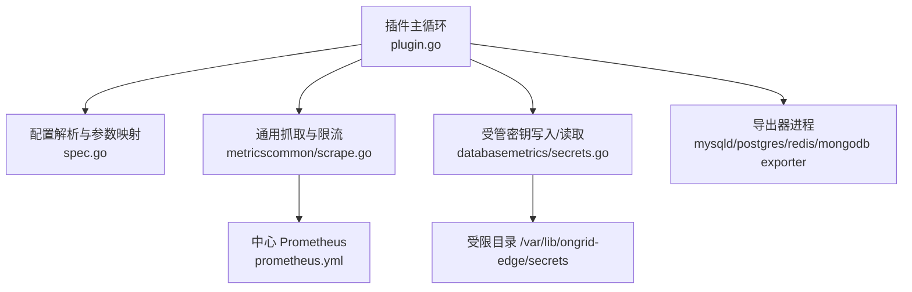
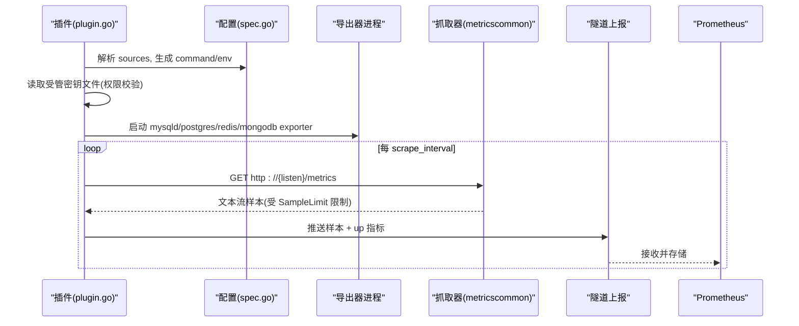
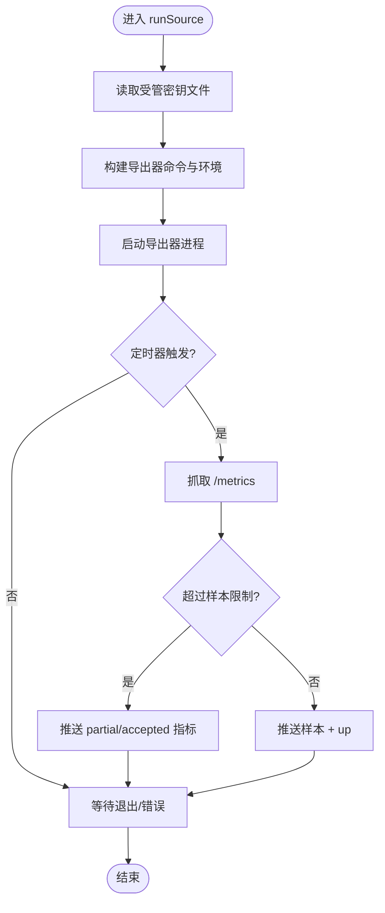
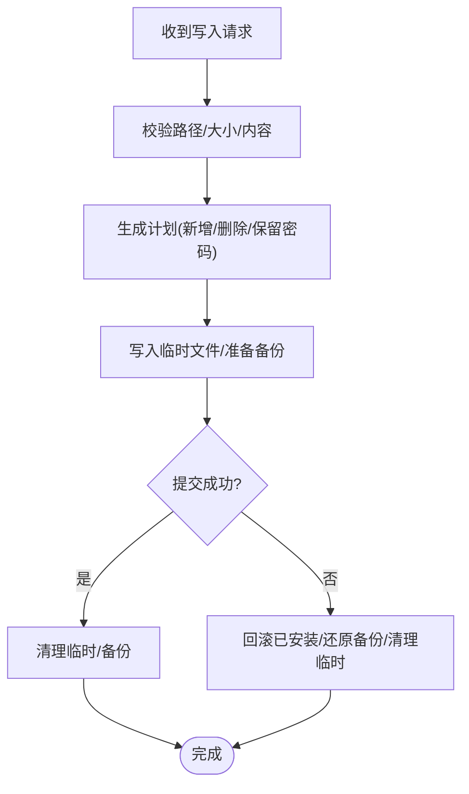
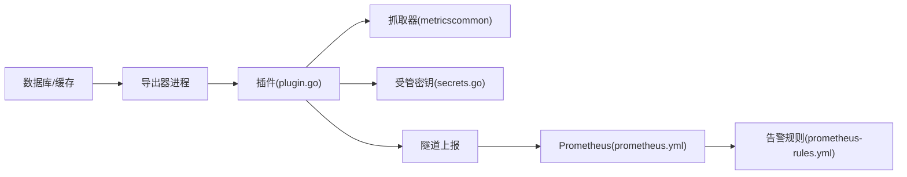

# 数据库指标插件

<cite>
**本文引用的文件**
- [plugin.go](file://internal/edgeagent/plugins/databasemetrics/plugin.go)
- [spec.go](file://internal/edgeagent/plugins/databasemetrics/spec.go)
- [secrets.go](file://internal/edgeagent/plugins/databasemetrics/secrets.go)
- [scrape.go](file://internal/edgeagent/plugins/metricscommon/scrape.go)
- [prometheus.yml](file://deploy/install/prometheus/prometheus.yml)
- [prometheus-rules.yml](file://deploy/install/prometheus-rules.yml)
- [secrets.go](file://internal/edgeagent/config/secrets.go)
</cite>

## 目录
1. [简介](#简介)
2. [项目结构](#项目结构)
3. [核心组件](#核心组件)
4. [架构总览](#架构总览)
5. [详细组件分析](#详细组件分析)
6. [依赖关系分析](#依赖关系分析)
7. [性能与优化](#性能与优化)
8. [监控与告警建议](#监控与告警建议)
9. [故障排查指南](#故障排查指南)
10. [结论](#结论)
11. [附录：配置示例与采集要点](#附录配置示例与采集要点)

## 简介
本插件为边缘侧“数据库指标”子插件，负责按配置启动对应数据库的导出器进程（mysqld_exporter、postgres_exporter、redis_exporter、mongodb_exporter），周期性抓取其 /metrics 暴露面，进行标签裁剪与基数控制后，通过隧道上报到中心 Prometheus。插件对每个数据源独立管理生命周期、健康状态与错误恢复，并通过受管密钥写入机制安全注入连接凭证。

## 项目结构
- 插件主循环与进程管理：位于 databasemetrics 包，负责解析配置、启动/停止导出器、定时抓取、健康快照与错误恢复。
- 配置与参数映射：将 YAML/JSON 配置转换为 sourceSpec，并为不同数据库生成导出器命令行与环境变量。
- 受管密钥管理：在受限目录下原子化写入/删除/备份密钥文件，支持保留密码与格式转换。
- 通用抓取：metricscommon 提供 HTTP 抓取、流式解析、样本限制、Up/Partial/Accepted 等辅助指标。
- 部署与规则：Prometheus 抓取配置与自观测告警规则示例。

图表来源
- [plugin.go:145-274](file://internal/edgeagent/plugins/databasemetrics/plugin.go#L145-L274)
- [spec.go:168-203](file://internal/edgeagent/plugins/databasemetrics/spec.go#L168-L203)
- [scrape.go:74-115](file://internal/edgeagent/plugins/metricscommon/scrape.go#L74-L115)
- [secrets.go:71-113](file://internal/edgeagent/plugins/databasemetrics/secrets.go#L71-L113)

章节来源
- [plugin.go:1-176](file://internal/edgeagent/plugins/databasemetrics/plugin.go#L1-L176)
- [spec.go:54-166](file://internal/edgeagent/plugins/databasemetrics/spec.go#L54-L166)
- [scrape.go:22-115](file://internal/edgeagent/plugins/metricscommon/scrape.go#L22-L115)
- [secrets.go:24-113](file://internal/edgeagent/plugins/databasemetrics/secrets.go#L24-L113)

## 核心组件
- 插件实例与生命周期：维护运行态、目标健康、取消上下文与停止通道；支持 panic 恢复与优雅停止。
- 数据源调度：按 enabled 开关并行启动各数据源的抓取循环，带指数退避重试。
- 导出器进程管理：构造命令与环境变量，写日志到工作目录，超时与信号终止。
- 抓取与上报：调用 metricscommon.Scrape 获取样本，附加 up 指标，通过隧道推送。
- 健康快照：汇总插件与各目标的 ID、名称、类型、状态、最近成功时间与错误信息。

章节来源
- [plugin.go:37-143](file://internal/edgeagent/plugins/databasemetrics/plugin.go#L37-L143)
- [plugin.go:178-274](file://internal/edgeagent/plugins/databasemetrics/plugin.go#L178-L274)
- [plugin.go:276-324](file://internal/edgeagent/plugins/databasemetrics/plugin.go#L276-L324)

## 架构总览
插件以“每数据源一个导出器进程 + 本地定时抓取”的模式工作。配置中指定 db_type、监听地址、连接凭证路径、抓取间隔/超时、采样限制与标签策略。运行时：
- 从受管密钥目录读取凭证文件（权限校验）。
- 根据 db_type 组装导出器命令与环境变量。
- 启动进程并周期抓取 /metrics，应用标签丢弃与样本上限。
- 将样本与 up 指标通过隧道推送到中心 Prometheus。

图表来源
- [plugin.go:178-274](file://internal/edgeagent/plugins/databasemetrics/plugin.go#L178-L274)
- [spec.go:168-203](file://internal/edgeagent/plugins/databasemetrics/spec.go#L168-L203)
- [scrape.go:74-115](file://internal/edgeagent/plugins/metricscommon/scrape.go#L74-L115)

## 详细组件分析

### 插件主循环与进程管理
- 启动/停止：Start 创建运行上下文与停止通道；Stop 取消上下文并等待退出或超时。
- 运行循环：run 解析配置，初始化工作目录，为每个 enabled 数据源起协程 runSource。
- 单源循环：runSource 封装 runExporterAndScraper，失败时记录状态并指数退避重试。
- 进程管理：runExporterAndScraper 读取密钥文件、构建命令与环境、启动进程、写日志、设置超时与 SIGTERM 取消。
- 抓取与上报：scrapeAndPush 使用 metricscommon.Scrape 抓取，追加 up 指标，调用 pushPromSamples 上报。
- 健康状态：setPluginState/setSourceState 更新插件与目标的健康快照，包含 last_error、last_success_at、samples 计数。

图表来源
- [plugin.go:178-274](file://internal/edgeagent/plugins/databasemetrics/plugin.go#L178-L274)
- [scrape.go:74-115](file://internal/edgeagent/plugins/metricscommon/scrape.go#L74-L115)

章节来源
- [plugin.go:89-176](file://internal/edgeagent/plugins/databasemetrics/plugin.go#L89-L176)
- [plugin.go:178-274](file://internal/edgeagent/plugins/databasemetrics/plugin.go#L178-L274)
- [plugin.go:276-324](file://internal/edgeagent/plugins/databasemetrics/plugin.go#L276-L324)
- [plugin.go:351-403](file://internal/edgeagent/plugins/databasemetrics/plugin.go#L351-L403)

### 配置解析与导出器参数映射
- 支持数据库类型：mysql、postgresql、redis、mongodb。
- 默认监听端口：按数据库类型分配，避免冲突。
- 连接类型：仅允许 managed，凭证通过 path 指向受管密钥文件。
- 抓取间隔/超时：默认值与约束（timeout ≤ interval）。
- 标签策略：source_label、extra_labels、label_drop（默认丢弃 query/statement/collection 等高基数字段）。
- 导出器参数：按数据库类型白名单映射布尔、字符串、整数、列表参数，确保只传递合法选项。
- 环境变量注入：PostgreSQL 使用 DATA_SOURCE_NAME，Redis 使用 REDIS_ADDR，MongoDB 使用 MONGODB_URI；MySQL 使用 my-cnf 配置文件路径。

章节来源
- [spec.go:54-166](file://internal/edgeagent/plugins/databasemetrics/spec.go#L54-L166)
- [spec.go:168-203](file://internal/edgeagent/plugins/databasemetrics/spec.go#L168-L203)
- [spec.go:390-423](file://internal/edgeagent/plugins/databasemetrics/spec.go#L390-L423)
- [spec.go:425-558](file://internal/edgeagent/plugins/databasemetrics/spec.go#L425-L558)

### 受管密钥管理与安全
- 注册处理器：通过隧道 RPC 写入受管密钥，仅接受受限目录下的绝对路径，拒绝符号链接。
- 内容校验：最大大小限制、非空检查、删除请求不允许附带内容或 preserve_password。
- 原子写入：先写临时文件，再 rename 覆盖；已有文件先备份；失败时回滚。
- 密码保留：当 PreservePassword=true 且未提供新密码时，尝试从现有文件中提取旧密码。
- 格式转换：根据 db_type 将统一凭据对象转换为 MySQL my-cnf、PostgreSQL DSN、Redis URI、MongoDB URI。
- 权限控制：密钥文件权限严格限制（0600），读取时校验权限位。

图表来源
- [secrets.go:71-113](file://internal/edgeagent/plugins/databasemetrics/secrets.go#L71-L113)
- [secrets.go:392-476](file://internal/edgeagent/plugins/databasemetrics/secrets.go#L392-L476)
- [secrets.go:496-637](file://internal/edgeagent/plugins/databasemetrics/secrets.go#L496-L637)
- [secrets.go:657-727](file://internal/edgeagent/plugins/databasemetrics/secrets.go#L657-L727)

章节来源
- [secrets.go:24-113](file://internal/edgeagent/plugins/databasemetrics/secrets.go#L24-L113)
- [secrets.go:392-637](file://internal/edgeagent/plugins/databasemetrics/secrets.go#L392-L637)
- [secrets.go:657-727](file://internal/edgeagent/plugins/databasemetrics/secrets.go#L657-L727)

### 抓取与指标输出
- 抓取流程：HTTP GET /metrics，Accept text/plain，支持 Bearer/BASIC 认证（由 Target 配置）。
- 流式解析：逐行解析 Prometheus 文本格式，边读边消费，避免大响应内存膨胀。
- 基数控制：label_drop 移除高基数字段；SampleLimit 限制样本数，超出返回错误并上报 partial/accepted。
- 健康指标：up 指标用于目标可用性；partial 与 accepted 指标用于判断是否截断。
- 客户端连接池：最小连接数与空闲超时、TLS 最低版本、拨号超时等。

章节来源
- [scrape.go:22-115](file://internal/edgeagent/plugins/metricscommon/scrape.go#L22-L115)
- [scrape.go:150-190](file://internal/edgeagent/plugins/metricscommon/scrape.go#L150-L190)
- [scrape.go:230-270](file://internal/edgeagent/plugins/metricscommon/scrape.go#L230-L270)

## 依赖关系分析
- 插件依赖 metricscommon 实现抓取与限流。
- 插件依赖 spec 将配置映射为导出器命令与环境。
- 插件依赖 secrets 处理受管密钥的读写与格式转换。
- 插件通过隧道接口上报样本至中心 Prometheus。
- 部署层提供 Prometheus 抓取配置与告警规则。

图表来源
- [plugin.go:178-274](file://internal/edgeagent/plugins/databasemetrics/plugin.go#L178-L274)
- [scrape.go:74-115](file://internal/edgeagent/plugins/metricscommon/scrape.go#L74-L115)
- [secrets.go:71-113](file://internal/edgeagent/plugins/databasemetrics/secrets.go#L71-L113)
- [prometheus.yml:6-20](file://deploy/install/prometheus/prometheus.yml#L6-L20)
- [prometheus-rules.yml:7-79](file://deploy/install/prometheus-rules.yml#L7-L79)

章节来源
- [prometheus.yml:6-20](file://deploy/install/prometheus/prometheus.yml#L6-L20)
- [prometheus-rules.yml:7-79](file://deploy/install/prometheus-rules.yml#L7-L79)

## 性能与优化
- 抓取间隔与超时：合理设置 scrape_interval 与 scrape_timeout，确保 timeout ≤ interval，避免堆积。
- 样本限制：通过 sample_limit 控制单次抓取样本量，防止高基数导致内存与带宽压力。
- 标签裁剪：使用 label_drop 丢弃 query/statement/collection 等高基数字段，降低存储与查询成本。
- 连接与 TLS：抓取客户端使用最小连接池与 TLS 最低版本，拨号超时短，减少资源占用。
- 进程健壮性：导出器进程异常退出会触发重试与状态上报，配合指数退避避免雪崩。
- 日志隔离：每个导出器进程日志写入工作目录，便于定位问题。

[本节为通用指导，不直接分析具体文件]

## 监控与告警建议
- 目标可用性：基于 up{plugin="databasemetrics", target_id=...} 监控导出器进程与抓取链路。
- 抓取质量：监控 ongrid_scrape_partial 与 ongrid_scrape_samples_accepted，识别截断与超限。
- 数据库健康：结合导出器指标（如连接数、慢查询、锁等待、缓存命中率）建立面板与阈值。
- 系统级告警：参考 prometheus-rules.yml 中的自观测告警模式，为自身服务建立类似规则。
- 告警路由：利用 source 标签区分业务与自观测告警，便于通知与处置。

章节来源
- [scrape.go:150-190](file://internal/edgeagent/plugins/metricscommon/scrape.go#L150-L190)
- [prometheus-rules.yml:7-79](file://deploy/install/prometheus-rules.yml#L7-L79)

## 故障排查指南
- 连接问题
  - 检查受管密钥文件是否存在、权限是否为 0600、内容非空。
  - 确认连接类型必须为 managed，path 指向正确文件。
  - 验证导出器二进制存在且可执行。
- 权限问题
  - 受管密钥写入路径必须在受限目录内，拒绝符号链接。
  - 删除操作不得附带内容或 preserve_password。
- 性能问题
  - 观察 ongrid_scrape_partial 与 ongrid_scrape_samples_accepted，若频繁截断需增大 sample_limit 或启用更严格的 label_drop。
  - 调整 scrape_interval 与 scrape_timeout，避免超时导致的失败。
  - 检查导出器进程日志（工作目录下按 source.id 命名的日志文件）。
- 健康状态
  - 查看插件 HealthSnapshot 中各目标的 state、last_error、last_success_at。
  - 关注指数退避重试是否持续失败，必要时重启插件或修正配置。

章节来源
- [plugin.go:326-349](file://internal/edgeagent/plugins/databasemetrics/plugin.go#L326-L349)
- [secrets.go:478-494](file://internal/edgeagent/plugins/databasemetrics/secrets.go#L478-L494)
- [scrape.go:74-115](file://internal/edgeagent/plugins/metricscommon/scrape.go#L74-L115)

## 结论
该插件以进程隔离的方式管理多类数据库指标采集，具备安全的受管密钥注入、严格的权限与路径校验、流式抓取与基数控制、完善的健康与错误恢复能力。通过合理的配置与告警策略，可有效支撑数据库连接数、慢查询、锁等待、缓存命中率等关键指标的持续采集与运维预警。

[本节为总结，不直接分析具体文件]

## 附录：配置示例与采集要点

- 支持的数据库类型
  - MySQL：导出器 mysqld_exporter，使用 my-cnf 配置文件路径传入凭证。
  - PostgreSQL：导出器 postgres_exporter，通过 DATA_SOURCE_NAME 环境变量注入 DSN。
  - Redis：导出器 redis_exporter，通过 REDIS_ADDR 环境变量注入 URI。
  - MongoDB：导出器 mongodb_exporter，通过 MONGODB_URI 环境变量注入 URI。

- 关键配置项
  - id/name：唯一标识与显示名。
  - db_type：数据库类型，仅支持 mysql/postgresql/redis/mongodb。
  - listen_address：导出器监听地址，默认按数据库类型分配。
  - connection.type/path：仅支持 managed，path 指向受管密钥文件。
  - scrape_interval/scrape_timeout：抓取间隔与超时，timeout ≤ interval。
  - sample_limit：单次抓取样本上限。
  - label_drop：丢弃高基数字段，默认针对 SQL 与集合相关字段。
  - extra_labels/source_label：自定义标签与来源标签。
  - exporter.*：按数据库类型白名单映射导出器参数。

- 采集要点
  - 连接数：通过导出器提供的连接池/连接数指标采集。
  - 慢查询：MySQL/PostgreSQL 可通过统计模块或慢查询日志采集。
  - 锁等待：MySQL 锁等待、PostgreSQL 锁事件均可采集。
  - 缓存命中率：Redis 命中率、PostgreSQL 缓冲命中等。
  - 结果集大小控制：通过 sample_limit 与 label_drop 控制。
  - 超时与重试：抓取超时与导出器进程异常退避重试。
  - 审计与日志：导出器进程日志落盘，便于定位问题。

- 监控告警建议
  - 基于 up 指标监控导出器与抓取链路。
  - 基于 partial/accepted 指标识别截断与超限。
  - 结合数据库内部指标建立阈值告警（如连接饱和、慢查询激增、锁等待升高、缓存命中率下降）。
  - 参考 prometheus-rules.yml 的自观测告警模式，建立一致的通知与分级策略。

章节来源
- [spec.go:168-203](file://internal/edgeagent/plugins/databasemetrics/spec.go#L168-L203)
- [spec.go:390-423](file://internal/edgeagent/plugins/databasemetrics/spec.go#L390-L423)
- [spec.go:425-558](file://internal/edgeagent/plugins/databasemetrics/spec.go#L425-L558)
- [scrape.go:74-115](file://internal/edgeagent/plugins/metricscommon/scrape.go#L74-L115)
- [prometheus-rules.yml:7-79](file://deploy/install/prometheus-rules.yml#L7-L79)