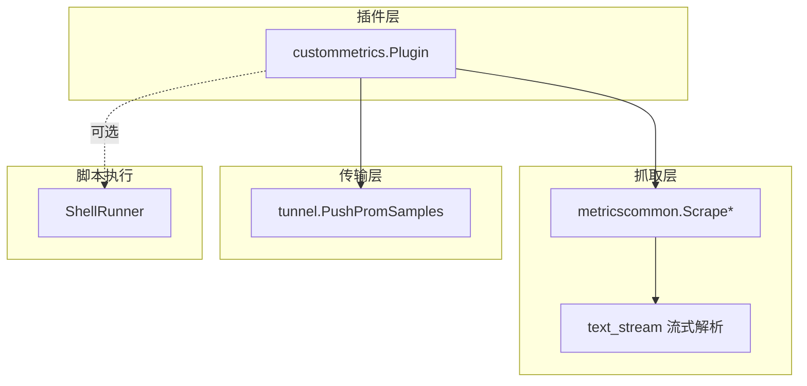
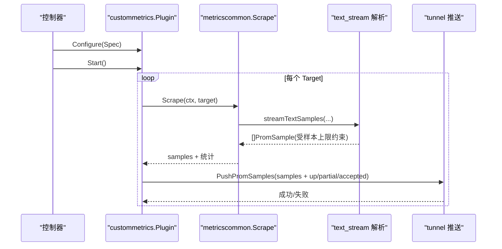
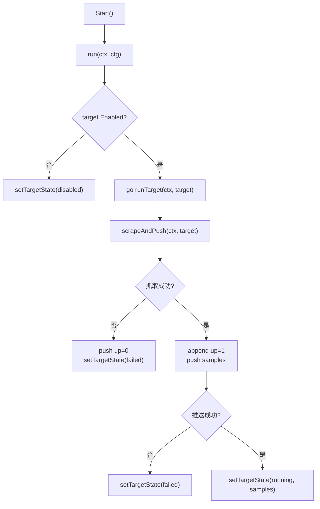
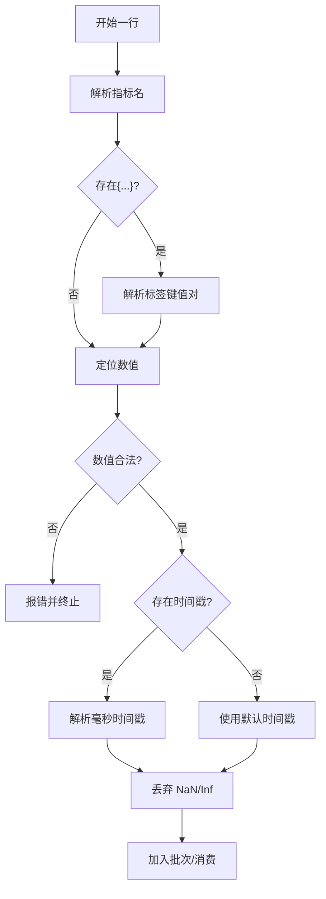
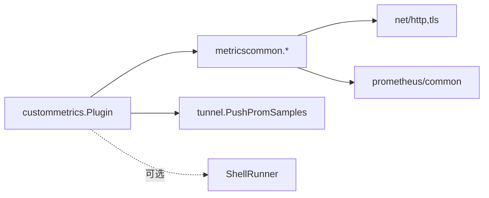

# 自定义指标插件

<cite>
**本文引用的文件**
- [internal/edgeagent/plugins/custommetrics/plugin.go](file://internal/edgeagent/plugins/custommetrics/plugin.go)
- [internal/edgeagent/plugins/custommetrics/spec.go](file://internal/edgeagent/plugins/custommetrics/spec.go)
- [internal/edgeagent/plugins/metricscommon/scrape.go](file://internal/edgeagent/plugins/metricscommon/scrape.go)
- [internal/edgeagent/plugins/metricscommon/text_stream.go](file://internal/edgeagent/plugins/metricscommon/text_stream.go)
- [internal/pkg/runner/shell.go](file://internal/pkg/runner/shell.go)
</cite>

## 目录
1. [简介](#简介)
2. [项目结构](#项目结构)
3. [核心组件](#核心组件)
4. [架构总览](#架构总览)
5. [详细组件分析](#详细组件分析)
6. [依赖关系分析](#依赖关系分析)
7. [性能考虑](#性能考虑)
8. [故障排查指南](#故障排查指南)
9. [结论](#结论)
10. [附录：配置规范与示例](#附录：配置规范与示例)

## 简介
本插件用于在边缘侧采集任意 Prometheus /metrics 端点，并将结果通过隧道推送到中心。它不管理导出器子进程或数据库凭据，仅负责目标发现、定时抓取、流式解析、标签处理、限流与上报。插件支持多目标并发采集、超时控制、TLS 安全、认证（Bearer Token、Basic Auth）、样本上限与标签过滤，并提供 up/partial/accepted 等健康与质量指标。

## 项目结构
- custommetrics 插件：负责生命周期管理、目标调度、抓取与推送、健康状态维护。
- metricscommon：通用抓取与文本流解析、HTTP 客户端与安全策略、样本限制与健康指标生成。
- runner：通用脚本执行器（ShellRunner），可用于运行外部脚本以产出指标数据（如 Bash/Python/Go 可执行脚本）。

图表来源
- [internal/edgeagent/plugins/custommetrics/plugin.go:135-229](file://internal/edgeagent/plugins/custommetrics/plugin.go#L135-L229)
- [internal/edgeagent/plugins/metricscommon/scrape.go:74-115](file://internal/edgeagent/plugins/metricscommon/scrape.go#L74-L115)
- [internal/edgeagent/plugins/metricscommon/text_stream.go:24-72](file://internal/edgeagent/plugins/metricscommon/text_stream.go#L24-L72)
- [internal/pkg/runner/shell.go:25-101](file://internal/pkg/runner/shell.go#L25-L101)

章节来源
- [internal/edgeagent/plugins/custommetrics/plugin.go:1-291](file://internal/edgeagent/plugins/custommetrics/plugin.go#L1-L291)
- [internal/edgeagent/plugins/metricscommon/scrape.go:1-270](file://internal/edgeagent/plugins/metricscommon/scrape.go#L1-L270)
- [internal/edgeagent/plugins/metricscommon/text_stream.go:1-237](file://internal/edgeagent/plugins/metricscommon/text_stream.go#L1-L237)
- [internal/pkg/runner/shell.go:1-150](file://internal/pkg/runner/shell.go#L1-L150)

## 核心组件
- custommetrics.Plugin
  - 职责：解析 Spec、启动/停止循环、按 Interval 并发抓取每个 Target、将样本通过 tunnel 推送、维护插件与目标健康快照。
  - 关键流程：Configure -> Start -> run -> runTarget -> scrapeAndPush -> pushPromSamples。
- metricscommon.Target
  - 字段：ID、Name、URL、Enabled、Interval、Timeout、TLSInsecure、BearerToken、BasicUsername/Password、SourceLabel、ExtraLabels、SampleLimit、LabelDrop、Kind 等。
- metricscommon 抓取与解析
  - Scrape/ScrapeIncremental：发起 HTTP GET，流式读取 Prometheus text exposition，逐行解析为 PromSample，应用样本上限与标签过滤。
  - 文本解析：严格校验指标名、标签键值、数值与时戳；丢弃 NaN/Inf；默认时间戳使用抓取时刻。
- ShellRunner
  - 职责：隔离执行任意脚本或命令，限制输出大小、超时、工作目录与环境变量替换，避免父进程敏感信息泄露。

章节来源
- [internal/edgeagent/plugins/custommetrics/plugin.go:31-120](file://internal/edgeagent/plugins/custommetrics/plugin.go#L31-L120)
- [internal/edgeagent/plugins/metricscommon/scrape.go:22-51](file://internal/edgeagent/plugins/metricscommon/scrape.go#L22-L51)
- [internal/edgeagent/plugins/metricscommon/text_stream.go:74-146](file://internal/edgeagent/plugins/metricscommon/text_stream.go#L74-L146)
- [internal/pkg/runner/shell.go:14-101](file://internal/pkg/runner/shell.go#L14-L101)

## 架构总览
插件采用“配置驱动 + 并发调度 + 流式解析 + 批量上报”的架构。Spec 定义多个 Target，每个 Target 独立运行一个协程，按 Interval 定时抓取并推送。解析阶段采用流式扫描，避免大响应导致的内存峰值。上报前附加 up/partial/accepted 等质量指标，便于中心侧观测。

图表来源
- [internal/edgeagent/plugins/custommetrics/plugin.go:135-229](file://internal/edgeagent/plugins/custommetrics/plugin.go#L135-L229)
- [internal/edgeagent/plugins/metricscommon/scrape.go:74-115](file://internal/edgeagent/plugins/metricscommon/scrape.go#L74-L115)
- [internal/edgeagent/plugins/metricscommon/text_stream.go:24-72](file://internal/edgeagent/plugins/metricscommon/text_stream.go#L24-L72)

## 详细组件分析

### 插件生命周期与调度
- Configure：解析 Spec 中的 targets，构建 Target 列表，重置目标健康状态。
- Start：创建取消上下文，启动 run goroutine。
- run：遍历 targets，跳过 disabled，为每个 enabled target 启动协程 runTarget。
- runTarget：首次立即抓取一次，然后按 Interval 定时抓取。
- scrapeAndPush：带超时的抓取，成功后追加 up=1，失败时追加 up=0；统一通过 pushPromSamples 上报。
- HealthSnapshot：返回插件与所有目标的健康快照（状态、样本数、最近错误、更新时间）。

图表来源
- [internal/edgeagent/plugins/custommetrics/plugin.go:79-120](file://internal/edgeagent/plugins/custommetrics/plugin.go#L79-L120)
- [internal/edgeagent/plugins/custommetrics/plugin.go:135-229](file://internal/edgeagent/plugins/custommetrics/plugin.go#L135-L229)

章节来源
- [internal/edgeagent/plugins/custommetrics/plugin.go:67-120](file://internal/edgeagent/plugins/custommetrics/plugin.go#L67-L120)
- [internal/edgeagent/plugins/custommetrics/plugin.go:135-229](file://internal/edgeagent/plugins/custommetrics/plugin.go#L135-L229)

### 抓取与流式解析
- HTTP 请求：设置 Accept 为 text/plain，支持 Bearer Token 与 Basic Auth，TLS 最小版本 1.2，连接复用与超时控制。
- 流式解析：按行扫描，解析指标名、标签、数值、可选毫秒时间戳；丢弃非法名称、重复标签、NaN/Inf；默认时间戳为抓取时刻。
- 样本限制：达到 SampleLimit 后停止解析并标记 LimitExceeded，保证内存与带宽可控。
- 标签处理：合并 ExtraLabels，支持 LabelDrop 删除指定标签。

图表来源
- [internal/edgeagent/plugins/metricscommon/text_stream.go:24-72](file://internal/edgeagent/plugins/metricscommon/text_stream.go#L24-L72)
- [internal/edgeagent/plugins/metricscommon/text_stream.go:74-146](file://internal/edgeagent/plugins/metricscommon/text_stream.go#L74-L146)
- [internal/edgeagent/plugins/metricscommon/scrape.go:117-148](file://internal/edgeagent/plugins/metricscommon/scrape.go#L117-L148)

章节来源
- [internal/edgeagent/plugins/metricscommon/scrape.go:74-115](file://internal/edgeagent/plugins/metricscommon/scrape.go#L74-L115)
- [internal/edgeagent/plugins/metricscommon/text_stream.go:24-72](file://internal/edgeagent/plugins/metricscommon/text_stream.go#L24-L72)
- [internal/edgeagent/plugins/metricscommon/text_stream.go:74-146](file://internal/edgeagent/plugins/metricscommon/text_stream.go#L74-L146)

### 指标标准化与质量指标
- 标准化：指标名必须合法；标签键值需符合模型规则；数值必须为有限浮点数；时间戳为毫秒整数。
- 质量指标：
  - up：目标可达性（抓取成功为 1，失败为 0）。
  - ongrid_scrape_partial：本次抓取是否被截断（达到样本上限时为 1）。
  - ongrid_scrape_samples_accepted：本次接受的样本数量。
- 标签：自动注入 plugin、target_id、target_name、kind，以及用户配置的 ExtraLabels。

章节来源
- [internal/edgeagent/plugins/metricscommon/scrape.go:150-213](file://internal/edgeagent/plugins/metricscommon/scrape.go#L150-L213)
- [internal/edgeagent/plugins/metricscommon/text_stream.go:24-72](file://internal/edgeagent/plugins/metricscommon/text_stream.go#L24-L72)

### 脚本执行引擎（可选）
- ShellRunner 提供隔离执行能力：
  - 支持传入 argv 或脚本字符串；默认使用 /bin/sh -c。
  - 完全替换环境变量，避免继承父进程敏感信息；自动补充 PATH。
  - 限制输出大小，防止 OOM；支持超时控制；记录退出码与耗时。
- 适用场景：通过 Bash/Python/Go 等脚本动态计算指标并输出标准文本格式，再由上层逻辑转换为 PromSample 或通过管道接入。

章节来源
- [internal/pkg/runner/shell.go:14-101](file://internal/pkg/runner/shell.go#L14-L101)
- [internal/pkg/runner/shell.go:104-125](file://internal/pkg/runner/shell.go#L104-L125)
- [internal/pkg/runner/shell.go:127-150](file://internal/pkg/runner/shell.go#L127-L150)

## 依赖关系分析
- custommetrics.Plugin 依赖 metricscommon 进行抓取与解析，并通过 tunnel 接口上报。
- metricscommon 依赖标准库 http/tls/net 与 prometheus/common/expfmt/model 进行协议兼容与校验。
- ShellRunner 依赖系统 exec，具备环境隔离与资源限制能力。

图表来源
- [internal/edgeagent/plugins/custommetrics/plugin.go:1-21](file://internal/edgeagent/plugins/custommetrics/plugin.go#L1-L21)
- [internal/edgeagent/plugins/metricscommon/scrape.go:1-20](file://internal/edgeagent/plugins/metricscommon/scrape.go#L1-L20)
- [internal/pkg/runner/shell.go:1-12](file://internal/pkg/runner/shell.go#L1-L12)

章节来源
- [internal/edgeagent/plugins/custommetrics/plugin.go:1-21](file://internal/edgeagent/plugins/custommetrics/plugin.go#L1-L21)
- [internal/edgeagent/plugins/metricscommon/scrape.go:1-20](file://internal/edgeagent/plugins/metricscommon/scrape.go#L1-L20)
- [internal/pkg/runner/shell.go:1-12](file://internal/pkg/runner/shell.go#L1-L12)

## 性能考虑
- 并发控制：每个 Target 独立协程，互不影响；可通过合理设置 Interval 控制总体并发度。
- 流式解析：按行扫描，避免一次性加载整个响应；每 1000 条样本为一个批次消费，降低内存峰值。
- 样本上限：SampleLimit 保护后端与网络带宽；超过限制会触发 partial 指标。
- 标签过滤：LabelDrop 减少高基数标签带来的存储与查询压力。
- 连接复用：HTTP 客户端启用连接池与空闲超时，减少握手开销。
- 超时控制：抓取与推送均设置超时，避免阻塞。
- 脚本执行：ShellRunner 限制输出大小与执行超时，防止异常脚本导致资源耗尽。

[本节为通用指导，无需特定文件引用]

## 故障排查指南
- 抓取失败：检查 URL、认证、TLS 设置与网络连通性；查看 up=0 与 last_error。
- 解析错误：确认指标名、标签键值、数值与时戳格式；关注 invalid metric name/label/value/timestamp 等错误。
- 样本超限：提高 SampleLimit 或优化指标维度；关注 ongrid_scrape_partial=1。
- 推送失败：检查 edge_id 是否为 0（未注册）、隧道服务可用性；查看推送超时与错误日志。
- 脚本执行问题：确认 PATH、权限、工作目录与超时；查看 stdout/stderr 与退出码。

章节来源
- [internal/edgeagent/plugins/custommetrics/plugin.go:187-229](file://internal/edgeagent/plugins/custommetrics/plugin.go#L187-L229)
- [internal/edgeagent/plugins/metricscommon/text_stream.go:74-146](file://internal/edgeagent/plugins/metricscommon/text_stream.go#L74-L146)
- [internal/pkg/runner/shell.go:25-101](file://internal/pkg/runner/shell.go#L25-L101)

## 结论
该插件以轻量、可扩展的方式实现边缘侧自定义指标采集，通过流式解析与严格的输入校验保障稳定性与安全性，配合质量指标与标签治理满足生产环境的监控需求。结合 ShellRunner 可灵活集成多种脚本语言，适配复杂业务场景。

[本节为总结性内容，无需特定文件引用]

## 附录：配置规范与示例

### Spec 语法概览
- targets：数组，每项为一个目标对象。
- 必填字段：id、target_url。
- 可选字段：
  - name：显示名称，默认同 id。
  - scrape_interval：抓取间隔，默认 30s。
  - scrape_timeout：抓取超时，默认 5s，且不得大于 interval。
  - enabled：是否启用，默认 true。
  - source_label：源标签，默认 "custom:<id>"。
  - tls_insecure：是否跳过 TLS 验证，默认 false。
  - auth：包含 bearer_token、username、password。
  - extra_labels：额外标签映射。
  - sample_limit：单次抓取最大样本数，默认 5000。
  - label_drop：需要删除的标签键列表。
  - resource：资源分类，当前支持 category="database"，type 支持 mysql/postgresql/redis/mongodb（含别名 pg/mongo）。

章节来源
- [internal/edgeagent/plugins/custommetrics/spec.go:13-112](file://internal/edgeagent/plugins/custommetrics/spec.go#L13-L112)
- [internal/edgeagent/plugins/custommetrics/spec.go:114-170](file://internal/edgeagent/plugins/custommetrics/spec.go#L114-L170)

### 支持的脚本语言与集成方式
- 通过 ShellRunner 执行任意可执行文件或脚本：
  - Bash：直接调用 shell 或脚本。
  - Python：确保 PATH 中包含 python 解释器，或使用绝对路径。
  - Go：编译为二进制后作为 argv 执行。
- 注意：ShellRunner 会完全替换环境变量，不会继承父进程的环境；如需访问密钥，请在 Env 中显式注入。

章节来源
- [internal/pkg/runner/shell.go:25-101](file://internal/pkg/runner/shell.go#L25-L101)
- [internal/pkg/runner/shell.go:104-125](file://internal/pkg/runner/shell.go#L104-L125)

### 指标数据标准化
- 数据类型：数值为 64 位浮点；NaN/Inf 会被丢弃。
- 单位换算：由上游指标提供方决定；插件不做单位转换。
- 时间戳：可选毫秒时间戳；若缺失则使用抓取时刻。
- 错误处理：非法指标名、标签、数值、时间戳将导致该行解析失败；达到样本上限会中断解析并标记 partial。

章节来源
- [internal/edgeagent/plugins/metricscommon/text_stream.go:74-146](file://internal/edgeagent/plugins/metricscommon/text_stream.go#L74-L146)
- [internal/edgeagent/plugins/metricscommon/text_stream.go:24-72](file://internal/edgeagent/plugins/metricscommon/text_stream.go#L24-L72)

### 配置示例（说明性）
- 系统指标：采集主机或容器运行时暴露的 /metrics。
- 应用指标：采集微服务或中间件暴露的 /metrics。
- 业务指标：通过脚本动态计算并输出标准文本格式，再经上层逻辑转换为 PromSample。
- 数据库指标：使用 resource.category="database" 与支持的 db_type，自动注入 resource_category 与 db_type 标签。

[本节为概念性示例说明，不直接展示具体代码片段]