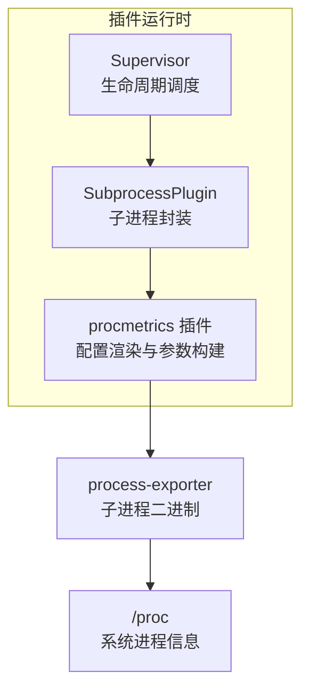
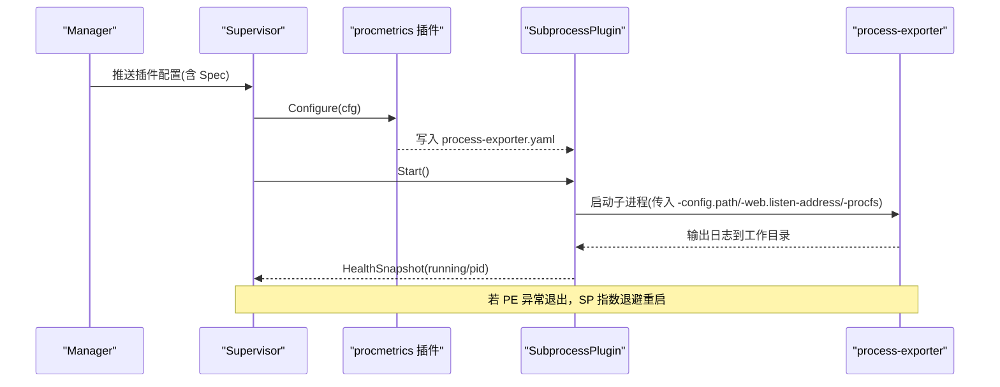
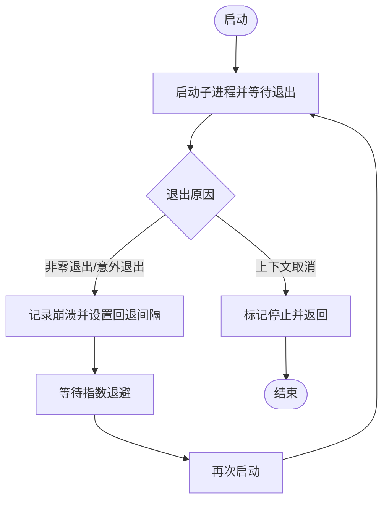
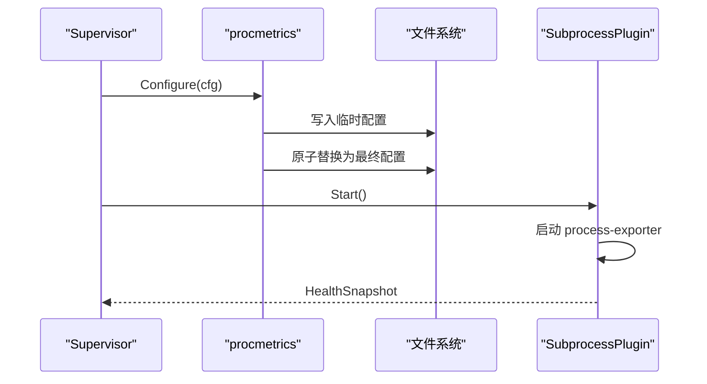
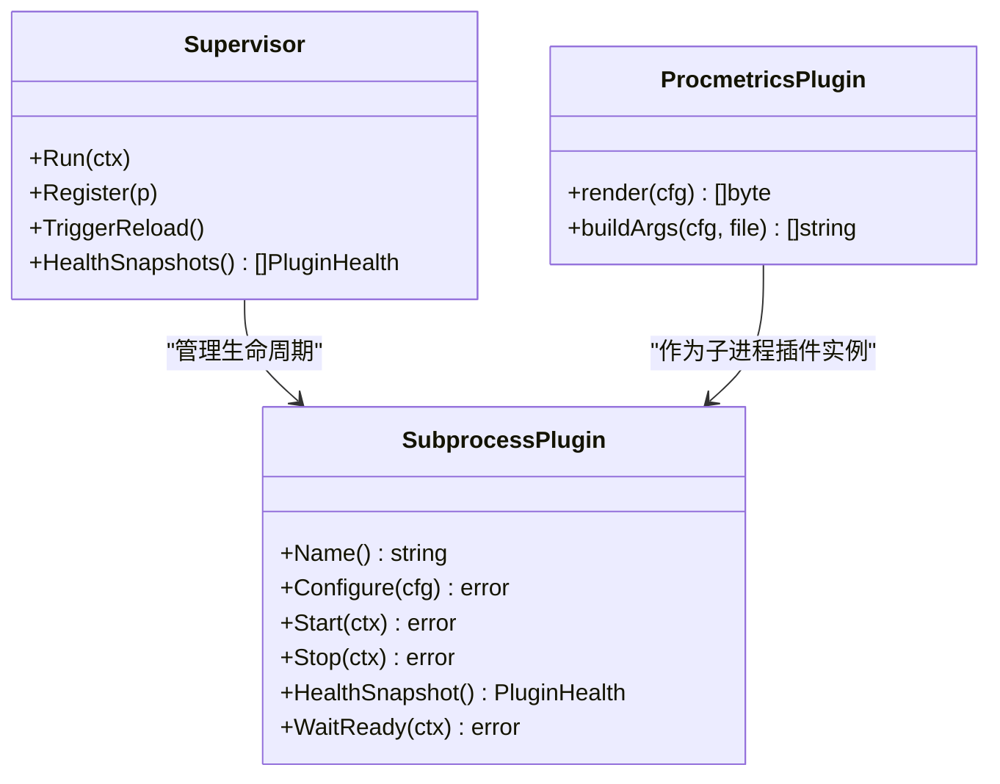

# 进程指标插件

<cite>
**本文引用的文件**
- [internal/edgeagent/plugins/procmetrics/plugin.go](file://internal/edgeagent/plugins/procmetrics/plugin.go)
- [internal/edgeagent/plugins/subprocess.go](file://internal/edgeagent/plugins/subprocess.go)
- [internal/edgeagent/plugins/supervisor.go](file://internal/edgeagent/plugins/supervisor.go)
- [internal/edgeagent/plugins/plugin.go](file://internal/edgeagent/plugins/plugin.go)
</cite>

## 目录
1. [简介](#简介)
2. [项目结构](#项目结构)
3. [核心组件](#核心组件)
4. [架构总览](#架构总览)
5. [详细组件分析](#详细组件分析)
6. [依赖关系分析](#依赖关系分析)
7. [性能考虑](#性能考虑)
8. [故障排查指南](#故障排查指南)
9. [结论](#结论)
10. [附录：配置与使用示例](#附录：配置与使用示例)

## 简介
本技术文档聚焦于“进程指标插件”（procmetrics），该插件在边缘侧以子进程方式运行 process-exporter，按进程名或命令行正则将进程分组并暴露每进程的指标。Supervisor 负责统一生命周期管理、配置下发、崩溃重启与健康上报；SubprocessPlugin 封装子进程启动、日志捕获、优雅退出与指数退避重启；procmetrics 插件负责渲染 process-exporter 的 YAML 配置并组装 CLI 参数。

## 项目结构
- 插件接口与运行时：定义 Plugin、PluginConfig、PluginHealth、Supervisor、SubprocessPlugin 等核心类型与行为。
- 进程指标插件实现：procmetrics 插件根据 Spec 渲染 process-exporter 配置，并通过 SubprocessPlugin 托管其生命周期。
- 宿主采集器占位：collector 包中 CPU/内存/网络采集为 Phase 1 占位实现，不改变进程指标插件的工作方式。

图表来源
- [internal/edgeagent/plugins/supervisor.go:112-243](file://internal/edgeagent/plugins/supervisor.go#L112-L243)
- [internal/edgeagent/plugins/subprocess.go:208-360](file://internal/edgeagent/plugins/subprocess.go#L208-L360)
- [internal/edgeagent/plugins/procmetrics/plugin.go:32-117](file://internal/edgeagent/plugins/procmetrics/plugin.go#L32-L117)

章节来源
- [internal/edgeagent/plugins/plugin.go:1-135](file://internal/edgeagent/plugins/plugin.go#L1-L135)
- [internal/edgeagent/plugins/supervisor.go:1-301](file://internal/edgeagent/plugins/supervisor.go#L1-L301)
- [internal/edgeagent/plugins/subprocess.go:1-391](file://internal/edgeagent/plugins/subprocess.go#L1-L391)
- [internal/edgeagent/plugins/procmetrics/plugin.go:1-131](file://internal/edgeagent/plugins/procmetrics/plugin.go#L1-L131)

## 核心组件
- Supervisor：从配置源拉取快照，比较期望与实际状态，驱动 Configure/Start/Stop，周期性健康巡检与重启协调。
- SubprocessPlugin：通用子进程包装器，负责配置落盘、校验、原子替换、启动、优雅停止、崩溃检测与指数退避重启。
- procmetrics 插件：将 Manager 下发的 Spec 渲染为 process-exporter 的 YAML 配置，并生成 CLI 参数（监听地址、procfs 路径、配置文件路径）。
- 插件接口与模型：Plugin、PluginConfig、PluginHealth、ReadyPlugin、ConfigFetcher 等抽象了统一的插件契约。

章节来源
- [internal/edgeagent/plugins/supervisor.go:12-133](file://internal/edgeagent/plugins/supervisor.go#L12-L133)
- [internal/edgeagent/plugins/subprocess.go:17-135](file://internal/edgeagent/plugins/subprocess.go#L17-L135)
- [internal/edgeagent/plugins/procmetrics/plugin.go:1-43](file://internal/edgeagent/plugins/procmetrics/plugin.go#L1-L43)
- [internal/edgeagent/plugins/plugin.go:18-135](file://internal/edgeagent/plugins/plugin.go#L18-L135)

## 架构总览
进程指标插件通过 Supervisor 统一管理，procmetrics 插件仅关注配置渲染与参数构建，具体进程指标采集由外部 process-exporter 子进程完成。Supervisor 保证配置变更的幂等应用与崩溃恢复，SubprocessPlugin 提供健壮的生命周期控制。

图表来源
- [internal/edgeagent/plugins/supervisor.go:135-243](file://internal/edgeagent/plugins/supervisor.go#L135-L243)
- [internal/edgeagent/plugins/subprocess.go:208-360](file://internal/edgeagent/plugins/subprocess.go#L208-L360)
- [internal/edgeagent/plugins/procmetrics/plugin.go:63-117](file://internal/edgeagent/plugins/procmetrics/plugin.go#L63-L117)

## 详细组件分析

### 进程发现与指标暴露原理
- 进程发现：由 process-exporter 读取 /proc 获取可见进程列表，并按 process_names 规则进行分组聚合。
- 指标维度：默认按内核 comm 分组（catch-all）；可通过 Spec.process_names 自定义正则匹配，支持按进程名、命令行片段等维度分组。
- 暴露端口：默认 :9256，避免与宿主机指标端口冲突；可通过 Spec.listen_address 覆盖。
- 可选 procfs：通过 Spec.procfs 指定自定义 /proc 挂载点，便于容器化场景隔离。

章节来源
- [internal/edgeagent/plugins/procmetrics/plugin.go:45-61](file://internal/edgeagent/plugins/procmetrics/plugin.go#L45-L61)
- [internal/edgeagent/plugins/procmetrics/plugin.go:98-117](file://internal/edgeagent/plugins/procmetrics/plugin.go#L98-L117)

### 状态监控与资源使用统计
- 进程列表：由 process-exporter 基于 process_names 规则枚举并分组，供上层查询。
- CPU 使用率：由 process-exporter 基于 /proc/stat 计算各进程 CPU 占比。
- 内存占用：基于 /proc/<pid>/statm 或类似机制统计 RSS/VMS。
- 文件描述符：统计各进程打开的文件句柄数。
- 网络连接：统计各进程建立的 TCP/UDP 连接数量。
说明：上述能力由 process-exporter 提供；本插件负责将其纳入 ongrid-edge 的统一插件生命周期管理。

章节来源
- [internal/edgeagent/plugins/procmetrics/plugin.go:1-14](file://internal/edgeagent/plugins/procmetrics/plugin.go#L1-L14)

### 进程生命周期管理
- 启动监控：Supervisor 调用 Configure 后执行 Start，SubprocessPlugin 启动 process-exporter 并记录 PID、开始时间。
- 异常退出检测：runOnce 捕获 Wait 错误，区分正常取消与非零退出；runLoop 将非预期退出视为崩溃。
- 自动重启机制：崩溃后进入指数退避重启（1s→2s→…上限 5min），并在每次重启时递增 RestartCount。
- 优雅停止：Stop 发送 SIGTERM，等待最多 15s；若超时则继续关闭流程，避免阻塞 Supervisor 关闭。

图表来源
- [internal/edgeagent/plugins/subprocess.go:267-308](file://internal/edgeagent/plugins/subprocess.go#L267-L308)
- [internal/edgeagent/plugins/subprocess.go:310-360](file://internal/edgeagent/plugins/subprocess.go#L310-L360)

章节来源
- [internal/edgeagent/plugins/subprocess.go:208-360](file://internal/edgeagent/plugins/subprocess.go#L208-L360)
- [internal/edgeagent/plugins/supervisor.go:175-243](file://internal/edgeagent/plugins/supervisor.go#L175-L243)

### 指标数据的聚合与过滤
- 分组维度：通过 Spec.process_names 传递 process-exporter 的匹配规则，可按进程名、命令行片段等维度聚合指标。
- 用户/命名空间：当前插件未内置按用户或命名空间维度的过滤；如需可结合 process_names 的正则匹配进行近似控制（例如限定特定用户启动的命令前缀）。
- 数据流向：process-exporter 直接对外暴露指标端点；ongrid-edge 通过 Prometheus 抓取或集成层消费，不在本插件内做二次聚合。

章节来源
- [internal/edgeagent/plugins/procmetrics/plugin.go:63-96](file://internal/edgeagent/plugins/procmetrics/plugin.go#L63-L96)

### 配置项与生效流程
- listen_address：子进程监听地址，默认 :9256。
- procfs：可选，覆盖 process-exporter 使用的 /proc 路径。
- process_names：数组，透传给 process-exporter 的 YAML 配置，用于进程分组匹配。
- 生效流程：Configure 渲染 YAML → 临时文件写入 → 可选校验 → 原子替换 → Start 启动子进程 → Ready 检查（如实现）。

图表来源
- [internal/edgeagent/plugins/procmetrics/plugin.go:63-117](file://internal/edgeagent/plugins/procmetrics/plugin.go#L63-L117)
- [internal/edgeagent/plugins/subprocess.go:143-206](file://internal/edgeagent/plugins/subprocess.go#L143-L206)

章节来源
- [internal/edgeagent/plugins/procmetrics/plugin.go:63-117](file://internal/edgeagent/plugins/procmetrics/plugin.go#L63-L117)
- [internal/edgeagent/plugins/subprocess.go:143-206](file://internal/edgeagent/plugins/subprocess.go#L143-L206)

## 依赖关系分析
- Supervisor 依赖 ConfigFetcher 获取配置快照，并可选择实现 ConfigApplyReporter 上报配置应用结果。
- SubprocessPlugin 依赖操作系统 exec 与信号机制，负责子进程管理与日志落盘。
- procmetrics 插件依赖 yaml.v3 与 text/template 渲染配置，依赖外部 process-exporter 二进制。
- 插件间解耦：Supervisor 对具体插件透明，仅通过统一接口交互。

图表来源
- [internal/edgeagent/plugins/supervisor.go:12-133](file://internal/edgeagent/plugins/supervisor.go#L12-L133)
- [internal/edgeagent/plugins/subprocess.go:17-135](file://internal/edgeagent/plugins/subprocess.go#L17-L135)
- [internal/edgeagent/plugins/procmetrics/plugin.go:32-43](file://internal/edgeagent/plugins/procmetrics/plugin.go#L32-L43)

章节来源
- [internal/edgeagent/plugins/plugin.go:18-135](file://internal/edgeagent/plugins/plugin.go#L18-L135)
- [internal/edgeagent/plugins/supervisor.go:12-133](file://internal/edgeagent/plugins/supervisor.go#L12-L133)
- [internal/edgeagent/plugins/subprocess.go:17-135](file://internal/edgeagent/plugins/subprocess.go#L17-L135)
- [internal/edgeagent/plugins/procmetrics/plugin.go:32-43](file://internal/edgeagent/plugins/procmetrics/plugin.go#L32-L43)

## 性能考虑
- 采样频率：由上游 Prometheus 抓取间隔决定；建议合理设置 scrape_interval，避免过高频率导致 I/O 压力。
- 内存使用控制：限制 process_names 规则复杂度与数量，避免过多分组造成指标基数爆炸；必要时通过正则缩小匹配范围。
- 扫描范围限制：通过 Spec.procfs 指向受限的 /proc 视图，或在 process_names 中精确匹配目标进程组，减少无关进程扫描。
- 崩溃重启开销：指数退避已内置上限，避免频繁重启；若持续崩溃，优先排查配置与权限问题。
- 日志大小：子进程日志写入工作目录，建议定期轮转或限制磁盘配额，防止磁盘写满。

[本节为通用指导，无需代码引用]

## 故障排查指南
- 子进程二进制缺失：
  - 现象：Start 时报错提示二进制不存在。
  - 处理：确认 release 包中包含 process-exporter 且路径正确。
  - 参考位置：[internal/edgeagent/plugins/subprocess.go:210-219](file://internal/edgeagent/plugins/subprocess.go#L210-L219)
- 配置渲染失败：
  - 现象：Configure 阶段报错，插件停留在 crashed 状态。
  - 处理：检查 Spec.process_names 结构是否符合预期；查看渲染后的 YAML 是否合法。
  - 参考位置：[internal/edgeagent/plugins/procmetrics/plugin.go:63-96](file://internal/edgeagent/plugins/procmetrics/plugin.go#L63-L96)
- 子进程异常退出：
  - 现象：HealthSnapshot 显示 State=crashed，LastError 包含退出码或错误信息。
  - 处理：检查工作目录日志文件；检查监听端口冲突、/proc 权限不足、配置语法错误。
  - 参考位置：[internal/edgeagent/plugins/subprocess.go:267-360](file://internal/edgeagent/plugins/subprocess.go#L267-L360)
- 配置未生效：
  - 现象：修改 Spec 后指标未按新规则分组。
  - 处理：触发重新加载（Supervisor 会周期性 reconcile 或通过 TriggerReload）；确认配置已原子替换。
  - 参考位置：[internal/edgeagent/plugins/supervisor.go:135-243](file://internal/edgeagent/plugins/supervisor.go#L135-L243)
- 端口冲突：
  - 现象：无法启动或启动后立即崩溃。
  - 处理：调整 Spec.listen_address 至空闲端口。
  - 参考位置：[internal/edgeagent/plugins/procmetrics/plugin.go:98-117](file://internal/edgeagent/plugins/procmetrics/plugin.go#L98-L117)

章节来源
- [internal/edgeagent/plugins/subprocess.go:210-360](file://internal/edgeagent/plugins/subprocess.go#L210-L360)
- [internal/edgeagent/plugins/procmetrics/plugin.go:63-117](file://internal/edgeagent/plugins/procmetrics/plugin.go#L63-L117)
- [internal/edgeagent/plugins/supervisor.go:135-243](file://internal/edgeagent/plugins/supervisor.go#L135-L243)

## 结论
进程指标插件通过 Supervisor 与 SubprocessPlugin 提供了稳定、可观测、可自愈的子进程管理能力；procmetrics 插件专注于 process-exporter 的配置渲染与参数构建，使进程级指标的采集与分组策略灵活可控。结合合理的配置与性能调优，可在大规模环境中可靠地采集进程列表、CPU、内存、文件描述符与网络连接等关键指标。

[本节为总结性内容，无需代码引用]

## 附录：配置与使用示例
- 基本启用：
  - enabled: true
  - endpoint/auth_user/auth_pass：按数据平面要求配置
  - spec.listen_address：保留默认或改为空闲端口
- 自定义进程分组：
  - spec.process_names：传入 process-exporter 的匹配规则数组，按进程名或命令行片段分组
- 指定 /proc 路径：
  - spec.procfs：在容器化或隔离环境中指向受限的 /proc 视图
- 监控特定进程或进程组：
  - 通过 process_names 中的 cmdline 正则精确匹配目标命令或参数，从而只采集所需进程

章节来源
- [internal/edgeagent/plugins/procmetrics/plugin.go:45-61](file://internal/edgeagent/plugins/procmetrics/plugin.go#L45-L61)
- [internal/edgeagent/plugins/procmetrics/plugin.go:98-117](file://internal/edgeagent/plugins/procmetrics/plugin.go#L98-L117)