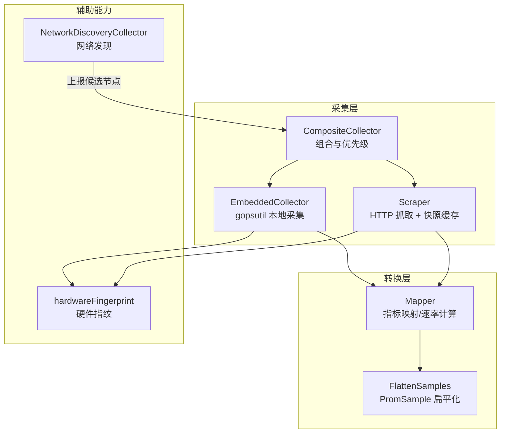
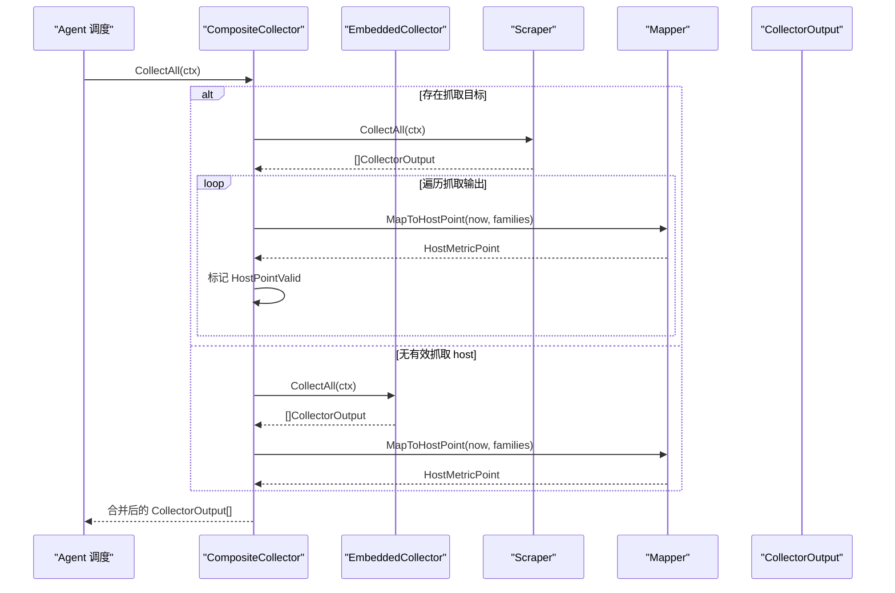
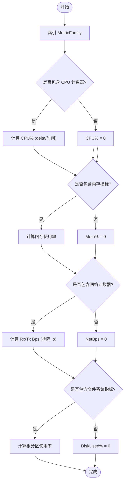
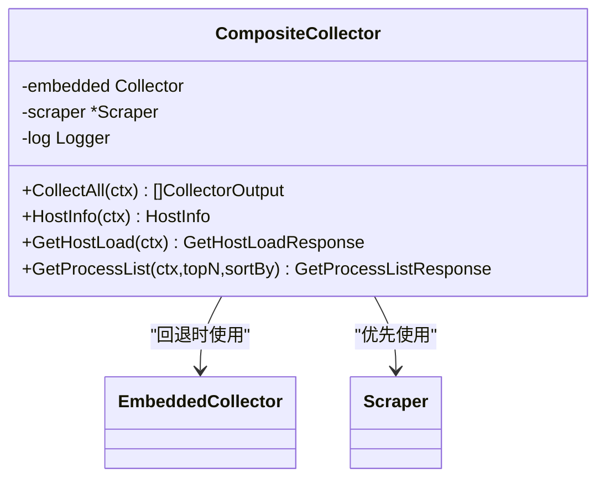
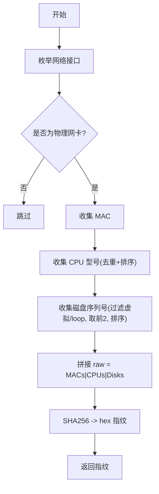
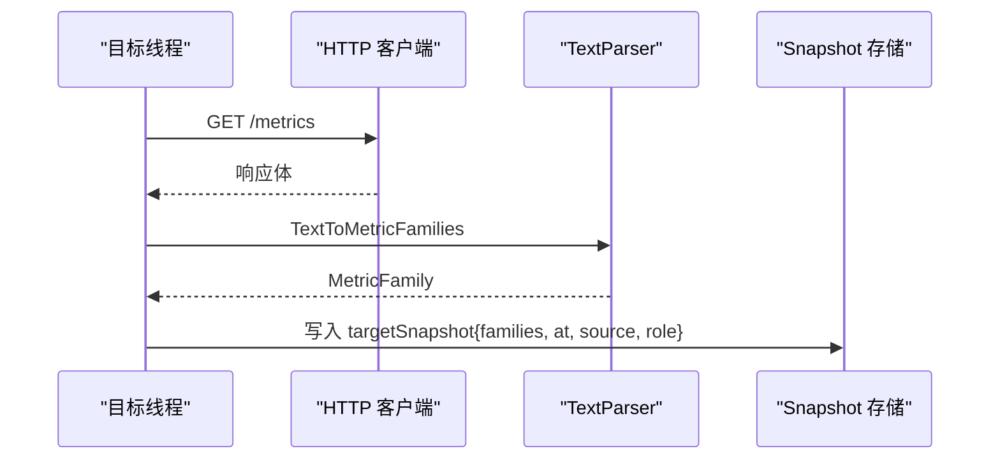
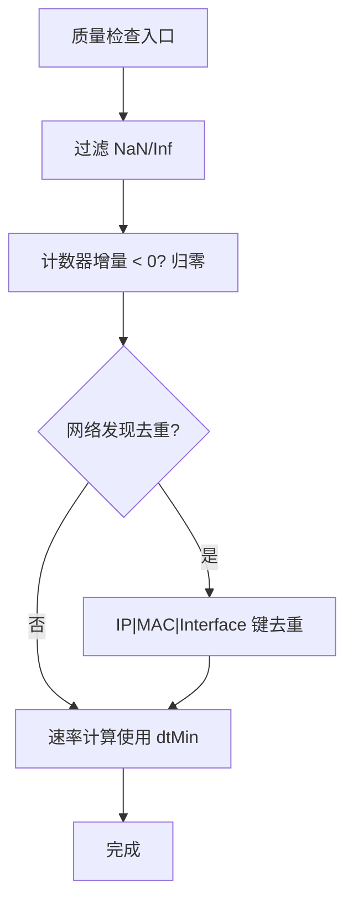
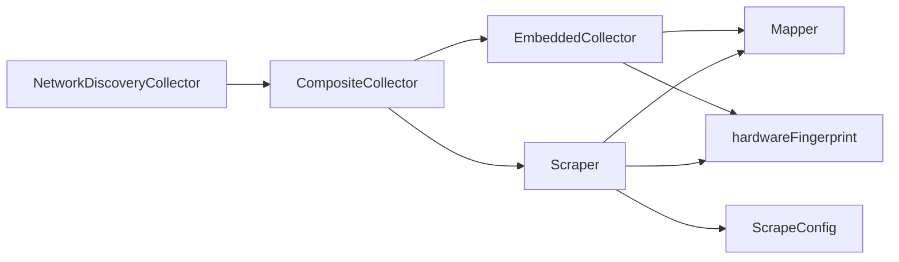

# 数据处理流程

<cite>
**本文引用的文件**
- [composite.go](file://internal/edgeagent/collector/composite.go)
- [embedded.go](file://internal/edgeagent/collector/embedded.go)
- [mapper.go](file://internal/edgeagent/collector/mapper.go)
- [scrape.go](file://internal/edgeagent/collector/scrape.go)
- [scrapecfg.go](file://internal/edgeagent/collector/scrapecfg.go)
- [hwfingerprint.go](file://internal/edgeagent/collector/hwfingerprint.go)
- [types.go](file://internal/edgeagent/collector/types.go)
- [network_discovery.go](file://internal/edgeagent/collector/network_discovery.go)
</cite>

## 目录
1. [简介](#简介)
2. [项目结构](#项目结构)
3. [核心组件](#核心组件)
4. [架构总览](#架构总览)
5. [详细组件分析](#详细组件分析)
6. [依赖关系分析](#依赖关系分析)
7. [性能考量](#性能考量)
8. [故障排查指南](#故障排查指南)
9. [结论](#结论)
10. [附录](#附录)

## 简介
本技术文档聚焦于边缘侧数据采集与处理流水线，覆盖数据映射机制（指标名称转换、标签映射、格式标准化）、Composite 采集器的组合模式（多源聚合与优先级）、嵌入式采集器（本地系统信息收集与硬件指纹生成）、数据质量控制（异常值过滤、去重、时间序列对齐），以及端到端的数据流架构图和性能优化策略（批处理、缓存、内存管理）。

## 项目结构
该数据处理流程位于 edgeagent 的 collector 包中，围绕统一接口 Collector 组织多种采集实现：
- 嵌入式采集器：通过 gopsutil 直接读取主机指标，输出 Prometheus 兼容指标族。
- 抓取采集器：按配置周期性 HTTP 抓取远端 /metrics，解析为 MetricFamily 并缓存快照。
- 组合采集器：将嵌入式与抓取结果组合，按角色与可用性决定最终输出。
- 映射器：将 MetricFamily 转换为统一的 HostMetricPoint（快速路径）与 PromSample（丰富路径）。
- 硬件指纹：基于物理网卡 MAC、CPU 型号、磁盘序列号生成稳定标识，避免克隆环境重复。
- 网络发现：被动收集网关、ARP、LLDP 邻居信息，用于拓扑与设备识别。

图表来源
- [composite.go:10-55](file://internal/edgeagent/collector/composite.go#L10-L55)
- [embedded.go:26-73](file://internal/edgeagent/collector/embedded.go#L26-L73)
- [scrape.go:29-77](file://internal/edgeagent/collector/scrape.go#L29-L77)
- [mapper.go:16-68](file://internal/edgeagent/collector/mapper.go#L16-L68)
- [hwfingerprint.go:15-41](file://internal/edgeagent/collector/hwfingerprint.go#L15-L41)
- [network_discovery.go:18-46](file://internal/edgeagent/collector/network_discovery.go#L18-L46)

章节来源
- [composite.go:10-92](file://internal/edgeagent/collector/composite.go#L10-L92)
- [embedded.go:26-403](file://internal/edgeagent/collector/embedded.go#L26-L403)
- [scrape.go:29-415](file://internal/edgeagent/collector/scrape.go#L29-L415)
- [mapper.go:16-373](file://internal/edgeagent/collector/mapper.go#L16-L373)
- [hwfingerprint.go:15-209](file://internal/edgeagent/collector/hwfingerprint.go#L15-L209)
- [network_discovery.go:18-282](file://internal/edgeagent/collector/network_discovery.go#L18-L282)

## 核心组件
- 统一接口与输出类型
  - Collector 接口定义 CollectAll、HostInfo、GetHostLoad、GetProcessList，屏蔽不同数据源差异。
  - CollectorOutput 包含 Source、HostPoint（快速路径 8 字段）、HostPointValid、Samples（丰富路径 PromSample）。
- 嵌入式采集器
  - 使用 gopsutil 读取 CPU、内存、负载、网络、文件系统、时间等指标，输出 node_exporter 兼容命名。
  - 提供 HostInfo（含硬件指纹与主 IP）、GetHostLoad、GetProcessList。
- 抓取采集器
  - 按目标配置并发抓取 /metrics，解析为 MetricFamily，维护 per-target 快照与独立 Mapper。
  - 支持 host/component 角色；host 角色可参与快速路径；component 仅丰富路径。
- 组合采集器
  - 优先使用抓取结果；若未产生有效的 host 数据则回退到嵌入式基线。
  - 对 GetHostLoad/GetProcessList 也做优先级选择。
- 映射器
  - 从 MetricFamily 提取 HostMetricPoint（CPU%、内存%、负载、网络速率、磁盘使用率）。
  - 将 MetricFamily 扁平化为 PromSample，处理计数器/直方图/摘要等类型。
  - 内部维护计数器采样缓存以计算速率（CPU%、NetRxBps/TxBps）。
- 硬件指纹
  - 基于物理 NIC MAC、CPU 型号、磁盘序列号哈希，避免 VM 克隆导致的重复。
  - 同时返回首选 IPv4 地址。
- 网络发现
  - 读取 /proc/net/route、/proc/net/arp 与可选 lldpctl，产出网关/ARP/LLDP 候选，去重并过滤虚拟接口。

章节来源
- [types.go:9-58](file://internal/edgeagent/collector/types.go#L9-L58)
- [embedded.go:26-174](file://internal/edgeagent/collector/embedded.go#L26-L174)
- [scrape.go:29-356](file://internal/edgeagent/collector/scrape.go#L29-L356)
- [composite.go:10-92](file://internal/edgeagent/collector/composite.go#L10-L92)
- [mapper.go:16-373](file://internal/edgeagent/collector/mapper.go#L16-L373)
- [hwfingerprint.go:15-209](file://internal/edgeagent/collector/hwfingerprint.go#L15-L209)
- [network_discovery.go:18-282](file://internal/edgeagent/collector/network_discovery.go#L18-L282)

## 架构总览
下图展示从原始数据到最终指标的完整转换过程：采集（嵌入式/抓取）→ 映射（HostMetricPoint/PromSample）→ 组合（优先级与回退）→ 输出（快速路径与丰富路径）。

图表来源
- [composite.go:27-55](file://internal/edgeagent/collector/composite.go#L27-L55)
- [scrape.go:185-226](file://internal/edgeagent/collector/scrape.go#L185-L226)
- [embedded.go:53-73](file://internal/edgeagent/collector/embedded.go#L53-L73)
- [mapper.go:40-68](file://internal/edgeagent/collector/mapper.go#L40-L68)

## 详细组件分析

### 数据映射机制（指标名称转换、标签映射、格式标准化）
- 指标名称转换
  - 嵌入式采集器输出 node_exporter 兼容指标名（如 node_cpu_seconds_total、node_memory_*、node_load*、node_network_*、node_filesystem_*、node_time_seconds、node_boot_time_seconds）。
  - 抓取采集器透传上游指标名，并通过静态标签扩展。
- 标签映射
  - FlattenSamples 将 MetricFamily 的 label 与 extraLabels 合并，冲突时保留生产者标签。
  - 针对 Summary/Histogram 展开 quantile/bucket/_sum/_count 等派生样本。
- 格式标准化
  - HostMetricPoint 固定 8 字段（CPU%、内存%、负载、网络速率、磁盘使用率、采样时间），便于快速路径传输。
  - PromSample 扁平化承载所有指标，统一携带 Name、Labels、Value、TsMs。

图表来源
- [mapper.go:40-68](file://internal/edgeagent/collector/mapper.go#L40-L68)
- [mapper.go:175-206](file://internal/edgeagent/collector/mapper.go#L175-L206)
- [mapper.go:227-307](file://internal/edgeagent/collector/mapper.go#L227-L307)

章节来源
- [embedded.go:176-340](file://internal/edgeagent/collector/embedded.go#L176-L340)
- [mapper.go:64-146](file://internal/edgeagent/collector/mapper.go#L64-L146)
- [mapper.go:150-373](file://internal/edgeagent/collector/mapper.go#L150-L373)

### Composite 采集器的组合模式（多源聚合与优先级）
- 多源聚合
  - 先执行抓取采集器，收集所有目标的 CollectorOutput。
  - 若无任何目标产生有效的 host 数据（HostPointValid），则回退到嵌入式基线。
- 优先级处理
  - 对于 HostInfo/GetHostLoad/GetProcessList，优先使用抓取结果；若为空或无效再回退到嵌入式。
  - 抓取目标支持 role=host/component：host 参与快速路径，component 仅丰富路径。

图表来源
- [composite.go:10-92](file://internal/edgeagent/collector/composite.go#L10-L92)
- [scrape.go:185-356](file://internal/edgeagent/collector/scrape.go#L185-L356)
- [embedded.go:53-174](file://internal/edgeagent/collector/embedded.go#L53-L174)

章节来源
- [composite.go:10-92](file://internal/edgeagent/collector/composite.go#L10-L92)
- [scrapecfg.go:12-49](file://internal/edgeagent/collector/scrapecfg.go#L12-L49)

### 嵌入式采集器（本地系统信息收集与硬件指纹）
- 本地系统信息
  - CPU：按核与模式统计累计时间，导出 node_cpu_seconds_total。
  - 内存：Total/Available/Free/Buffers/Cached。
  - 负载：load1/load5/load15。
  - 网络：收发字节/包数，按设备维度。
  - 文件系统：size/avail/free，按挂载点与文件系统类型。
  - 时间：系统时间与启动时间。
- 硬件指纹
  - 基于物理网卡 MAC（最多两个，排序稳定）、CPU 型号去重拼接、磁盘序列号（最多两个，排序稳定）进行 SHA256 哈希。
  - 若无可用的物理网卡，返回空字符串，由调用方回退到 HostID。
  - 同时尝试获取首选 IPv4 地址。

图表来源
- [hwfingerprint.go:15-41](file://internal/edgeagent/collector/hwfingerprint.go#L15-L41)
- [hwfingerprint.go:43-102](file://internal/edgeagent/collector/hwfingerprint.go#L43-L102)
- [hwfingerprint.go:104-156](file://internal/edgeagent/collector/hwfingerprint.go#L104-L156)
- [hwfingerprint.go:158-209](file://internal/edgeagent/collector/hwfingerprint.go#L158-L209)

章节来源
- [embedded.go:26-174](file://internal/edgeagent/collector/embedded.go#L26-L174)
- [hwfingerprint.go:15-209](file://internal/edgeagent/collector/hwfingerprint.go#L15-L209)

### 抓取采集器（HTTP 抓取与快照缓存）
- 并发抓取
  - 每个目标一个 goroutine，周期触发 scrapeOnce，失败不中断整体循环。
- 解析与缓存
  - 使用 expfmt 将文本协议解析为 MetricFamily，按目标维护最近一次成功快照。
  - 每个目标拥有独立 Mapper，保证速率计算正确。
- 角色控制
  - role=host：参与快速路径（HostPoint 计算）。
  - role=component：仅丰富路径（PromSample）。

图表来源
- [scrape.go:79-113](file://internal/edgeagent/collector/scrape.go#L79-L113)
- [scrape.go:115-183](file://internal/edgeagent/collector/scrape.go#L115-L183)
- [scrape.go:185-226](file://internal/edgeagent/collector/scrape.go#L185-L226)

章节来源
- [scrape.go:29-415](file://internal/edgeagent/collector/scrape.go#L29-L415)
- [scrapecfg.go:12-91](file://internal/edgeagent/collector/scrapecfg.go#L12-L91)

### 数据质量控制（异常值检测、去重、时间序列对齐）
- 异常值检测
  - 在生成 PromSample 时过滤 NaN/Inf，避免 JSON 编码问题。
  - 速率计算时对负增量归零，避免反冲导致负值。
- 去重
  - 网络发现阶段对候选项按 IP+MAC+Interface 去重，避免重复上报。
  - 硬件指纹中对 CPU 型号去重，确保稳定性。
- 时间序列对齐
  - 速率计算基于上次采样时间与当前时间的差值，取最小 dt 作为分母，保证一致性。
  - 首次调用返回 0（无历史样本），后续逐步收敛。

图表来源
- [mapper.go:139-146](file://internal/edgeagent/collector/mapper.go#L139-L146)
- [mapper.go:227-307](file://internal/edgeagent/collector/mapper.go#L227-L307)
- [network_discovery.go:46-71](file://internal/edgeagent/collector/network_discovery.go#L46-L71)

章节来源
- [mapper.go:139-146](file://internal/edgeagent/collector/mapper.go#L139-L146)
- [mapper.go:227-307](file://internal/edgeagent/collector/mapper.go#L227-L307)
- [network_discovery.go:46-71](file://internal/edgeagent/collector/network_discovery.go#L46-L71)

## 依赖关系分析
- 组件耦合
  - CompositeCollector 依赖 EmbeddedCollector 与 Scraper，形成组合模式。
  - EmbeddedCollector 与 Scraper 均依赖 Mapper 进行指标映射。
  - Scraper 依赖 ScrapeConfig 驱动目标抓取。
  - 硬件指纹与网络发现为独立能力，被上层逻辑复用。
- 外部依赖
  - gopsutil：系统指标采集。
  - prometheus/common/expfmt：指标文本解析。
  - crypto/sha256：指纹哈希。
  - net/os/exec：网络接口与 LLDP 工具调用。

图表来源
- [composite.go:10-92](file://internal/edgeagent/collector/composite.go#L10-L92)
- [embedded.go:26-73](file://internal/edgeagent/collector/embedded.go#L26-L73)
- [scrape.go:29-77](file://internal/edgeagent/collector/scrape.go#L29-L77)
- [mapper.go:16-68](file://internal/edgeagent/collector/mapper.go#L16-L68)
- [hwfingerprint.go:15-41](file://internal/edgeagent/collector/hwfingerprint.go#L15-L41)
- [network_discovery.go:18-46](file://internal/edgeagent/collector/network_discovery.go#L18-L46)

章节来源
- [composite.go:10-92](file://internal/edgeagent/collector/composite.go#L10-L92)
- [embedded.go:26-73](file://internal/edgeagent/collector/embedded.go#L26-L73)
- [scrape.go:29-77](file://internal/edgeagent/collector/scrape.go#L29-L77)
- [mapper.go:16-68](file://internal/edgeagent/collector/mapper.go#L16-L68)
- [hwfingerprint.go:15-41](file://internal/edgeagent/collector/hwfingerprint.go#L15-L41)
- [network_discovery.go:18-46](file://internal/edgeagent/collector/network_discovery.go#L18-L46)

## 性能考量
- 批处理
  - 抓取采集器按目标并发运行，每个目标独立 goroutine，提升吞吐。
  - 单次 CollectAll 批量产出多个 CollectorOutput，减少调度开销。
- 缓存机制
  - Scraper 维护 per-target 的 MetricFamily 快照，避免重复解析。
  - Mapper 维护计数器采样缓存，用于速率计算，降低重复计算成本。
- 内存管理
  - 快照 map 与 mappers map 按目标隔离，限制内存增长。
  - 网络发现去重使用 map 记录已见候选，防止重复累积。
- 连接池与超时
  - HTTP 客户端使用连接池与空闲超时，减少握手开销。
  - 抓取请求设置超时，避免阻塞。

[本节为通用性能指导，不直接分析具体代码行]

## 故障排查指南
- 抓取失败
  - 非 2xx 状态码会记录警告日志，不会中断整体循环；检查目标 URL、认证与 TLS 配置。
  - 解析失败会记录警告；确认上游指标格式符合 Prometheus 文本协议。
- 速率计算为 0
  - 首次调用无历史样本，速率字段为 0；等待下一次采样后恢复。
  - 计数器回滚会被归零；检查上游指标是否正确单调递增。
- 主机负载查询为空
  - 抓取角色非 host 或未产生有效指标时，GetHostLoad 返回零值；确认 role=host 且指标齐全。
- 硬件指纹为空
  - 无可用物理网卡时返回空；此时依赖 HostID 作为回退；检查网络栈与虚拟化环境。

章节来源
- [scrape.go:115-183](file://internal/edgeagent/collector/scrape.go#L115-L183)
- [mapper.go:227-307](file://internal/edgeagent/collector/mapper.go#L227-L307)
- [scrape.go:261-303](file://internal/edgeagent/collector/scrape.go#L261-L303)
- [hwfingerprint.go:15-41](file://internal/edgeagent/collector/hwfingerprint.go#L15-L41)

## 结论
该数据处理流程通过统一接口抽象了多种采集方式，结合映射器实现了快速路径与丰富路径的双通道输出。组合采集器提供了灵活的优先级与回退策略，确保在不同环境下都能稳定产出关键指标。数据质量控制覆盖了异常值过滤、去重与时间序列对齐，提升了数据的可靠性。性能方面采用并发抓取、快照缓存与内存隔离等手段，保障高吞吐与低延迟。整体设计兼顾可扩展性与鲁棒性，适用于边缘场景的多源指标汇聚与标准化。

## 附录
- 配置参考
  - 抓取配置文件路径与默认值：Interval=30s，Timeout=10s，role 默认 component。
- 指标清单
  - 嵌入式采集器输出的指标族与含义参见各资源构建函数。
- 扩展建议
  - 新增采集源需实现 Collector 接口，并在 CompositeCollector 中注册。
  - 如需自定义快速路径字段，可在 Mapper 中扩展映射逻辑。