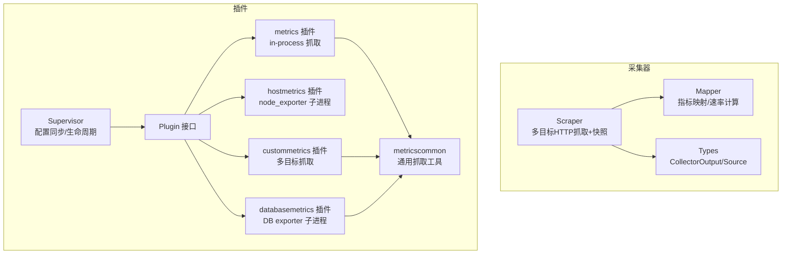
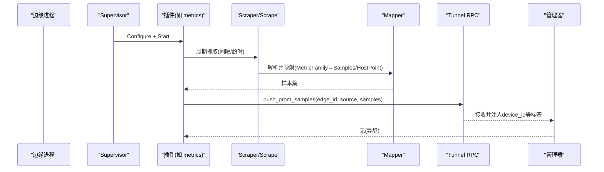
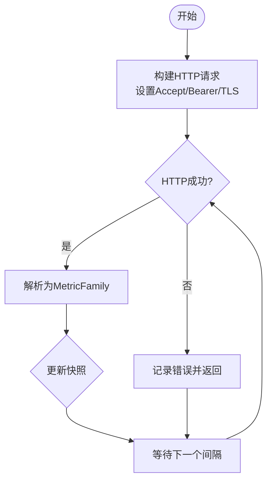
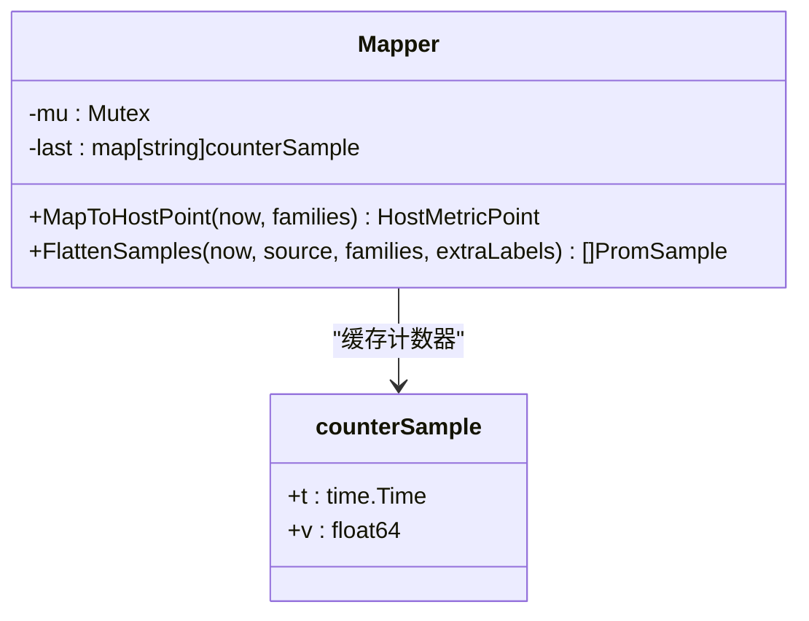
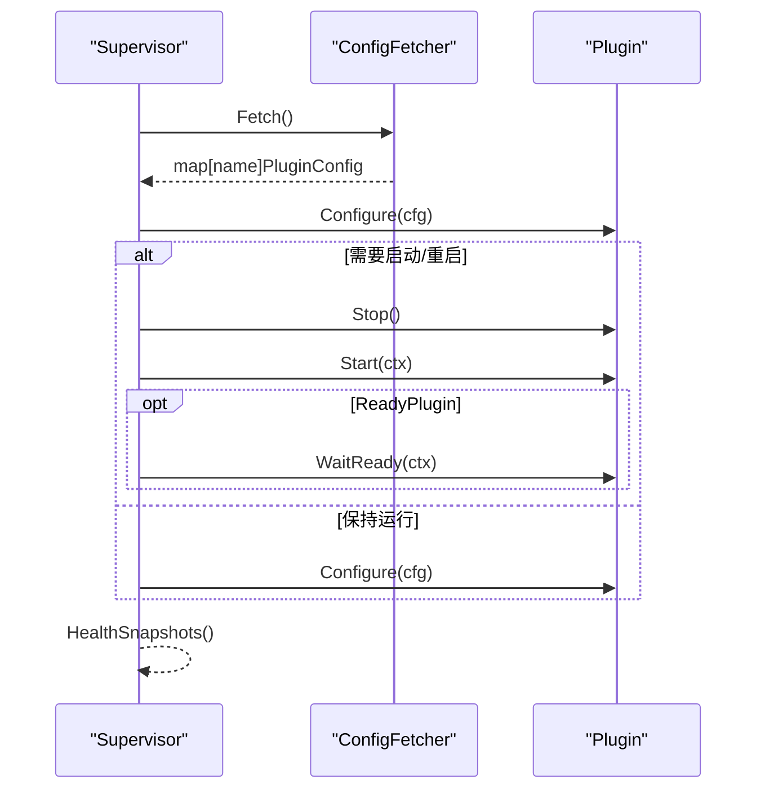
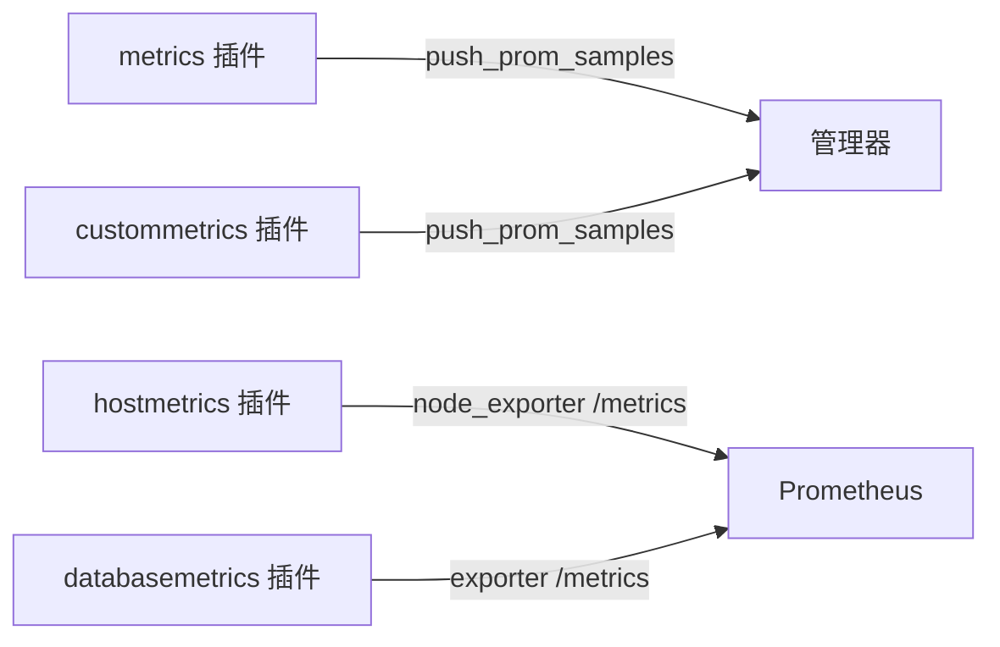
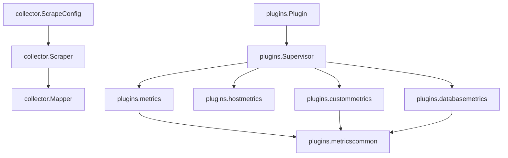

# 数据采集系统

<cite>
**本文引用的文件**
- [scrape.go](file://internal/edgeagent/collector/scrape.go)
- [types.go](file://internal/edgeagent/collector/types.go)
- [mapper.go](file://internal/edgeagent/collector/mapper.go)
- [scrape_config.example.yaml](file://internal/edgeagent/collector/scrape_config.example.yaml)
- [plugin.go](file://internal/edgeagent/plugins/plugin.go)
- [supervisor.go](file://internal/edgeagent/plugins/supervisor.go)
- [metrics_plugin.go](file://internal/edgeagent/plugins/metrics/plugin.go)
- [hostmetrics_plugin.go](file://internal/edgeagent/plugins/hostmetrics/plugin.go)
- [custommetrics_plugin.go](file://internal/edgeagent/plugins/custommetrics/plugin.go)
- [databasemetrics_plugin.go](file://internal/edgeagent/plugins/databasemetrics/plugin.go)
- [metricscommon_scrape.go](file://internal/edgeagent/plugins/metricscommon/scrape.go)
</cite>

## 目录
1. [简介](#简介)
2. [项目结构](#项目结构)
3. [核心组件](#核心组件)
4. [架构总览](#架构总览)
5. [详细组件分析](#详细组件分析)
6. [依赖关系分析](#依赖关系分析)
7. [性能考虑](#性能考虑)
8. [故障排查指南](#故障排查指南)
9. [结论](#结论)
10. [附录](#附录)

## 简介
本技术文档面向边缘侧数据采集系统，聚焦以下目标：
- 解释 HTTP 指标抓取与插件化采集器架构
- 深入说明 Scraper 组件的多目标并发、快照管理、错误处理与重试机制
- 阐述数据映射与转换（Prometheus 文本格式到内部样本）
- 覆盖内置采集器：CPU、内存、网络等系统指标的收集方法
- 说明插件扩展机制与自定义采集器开发接口、数据格式规范
- 提供配置示例与最佳实践，构建高效的数据采集管道
- 给出性能优化建议与故障排查指南

## 项目结构
边缘侧采集能力由“采集器”和“插件”两大层次组成：
- 采集器层（collector）：负责从本地或远端 HTTP /metrics 抓取 Prometheus 文本格式，解析为统一样本，并维护每目标的最新快照；同时提供主机信息、负载与进程列表等内嵌能力。
- 插件层（plugins）：以统一的 Plugin 生命周期管理多种采集能力（metrics、hostmetrics、custommetrics、databasemetrics、logs、traces），通过 Supervisor 进行配置拉取、启停、健康上报与崩溃恢复。

**图表来源**
- [scrape.go:29-77](file://internal/edgeagent/collector/scrape.go#L29-L77)
- [mapper.go:16-68](file://internal/edgeagent/collector/mapper.go#L16-L68)
- [types.go:9-57](file://internal/edgeagent/collector/types.go#L9-L57)
- [plugin.go:18-52](file://internal/edgeagent/plugins/plugin.go#L18-L52)
- [supervisor.go:12-47](file://internal/edgeagent/plugins/supervisor.go#L12-L47)
- [metrics_plugin.go:1-35](file://internal/edgeagent/plugins/metrics/plugin.go#L1-L35)
- [hostmetrics_plugin.go:1-28](file://internal/edgeagent/plugins/hostmetrics/plugin.go#L1-L28)
- [custommetrics_plugin.go:1-23](file://internal/edgeagent/plugins/custommetrics/plugin.go#L1-L23)
- [databasemetrics_plugin.go:1-29](file://internal/edgeagent/plugins/databasemetrics/plugin.go#L1-L29)
- [metricscommon_scrape.go:1-51](file://internal/edgeagent/plugins/metricscommon/scrape.go#L1-L51)

**章节来源**
- [scrape.go:29-77](file://internal/edgeagent/collector/scrape.go#L29-L77)
- [plugin.go:18-52](file://internal/edgeagent/plugins/plugin.go#L18-L52)
- [supervisor.go:12-47](file://internal/edgeagent/plugins/supervisor.go#L12-L47)

## 核心组件
- Scraper：按目标并发抓取 HTTP /metrics，解析为 MetricFamily 并维护 per-target 快照；支持 Bearer Token、TLS、超时控制；失败不阻塞其他目标。
- Mapper：将 Prometheus 文本格式的 MetricFamily 映射为两类输出：
  - HostMetricPoint：8字段快速路径（CPU%、内存%、磁盘使用%、Load1/5/15、网络收发速率）
  - PromSample：开放集合的扁平样本（Gauge/Counter/Histogram/Summary 等）
- Collector 接口：统一抽象采集源，支持单源与多源（如 scrape）；提供 CollectAll、HostInfo、GetHostLoad、GetProcessList。
- 插件体系：
  - metrics：in-process 抓取默认 node_exporter 或通过 spec 指定 URL，直接通过隧道 RPC 推送样本
  - hostmetrics：启动 node_exporter 子进程暴露 /metrics，并通过 textfile 补充内核指标
  - custommetrics：按 spec 配置多个目标，并发抓取并推送
  - databasemetrics：为每个数据库源启动专用 exporter 子进程，读取本地受管密钥后抓取并推送
- metricscommon：通用抓取逻辑，支持流式解析、基数限制、标签过滤、Up/Partial/Accepted 状态样本

**章节来源**
- [types.go:9-57](file://internal/edgeagent/collector/types.go#L9-L57)
- [mapper.go:16-137](file://internal/edgeagent/collector/mapper.go#L16-L137)
- [metrics_plugin.go:1-35](file://internal/edgeagent/plugins/metrics/plugin.go#L1-L35)
- [hostmetrics_plugin.go:1-28](file://internal/edgeagent/plugins/hostmetrics/plugin.go#L1-L28)
- [custommetrics_plugin.go:1-23](file://internal/edgeagent/plugins/custommetrics/plugin.go#L1-L23)
- [databasemetrics_plugin.go:1-29](file://internal/edgeagent/plugins/databasemetrics/plugin.go#L1-L29)
- [metricscommon_scrape.go:22-91](file://internal/edgeagent/plugins/metricscommon/scrape.go#L22-L91)

## 架构总览
整体数据流：
- 插件层根据配置启动相应采集能力（in-process 或子进程）
- 采集器/插件周期性抓取 HTTP /metrics，解析为样本
- 通过隧道 RPC push_prom_samples 推送到管理器侧
- 管理器侧注入 device_id 等标签，供查询与关联

**图表来源**
- [supervisor.go:112-133](file://internal/edgeagent/plugins/supervisor.go#L112-L133)
- [metrics_plugin.go:181-282](file://internal/edgeagent/plugins/metrics/plugin.go#L181-L282)
- [scrape.go:115-183](file://internal/edgeagent/collector/scrape.go#L115-L183)
- [mapper.go:64-137](file://internal/edgeagent/collector/mapper.go#L64-L137)

## 详细组件分析

### Scraper 组件：多目标并发、快照与错误处理
- 并发模型：Run 使用 errgroup 为每个目标启动一个 goroutine，独立调度、独立失败
- 抓取流程：构造带 Accept 头请求，可选 Bearer Token 文件读取，设置 TLS 与安全策略，解析响应为 MetricFamily
- 快照管理：维护 per-target 的 targetSnapshot（families、时间戳、source、role），写锁保护
- 数据输出：CollectAll 基于快照生成 CollectorOutput，支持 HostPoint 快速路径与 Samples 开放路径
- 错误处理：非 2xx、解析失败、HTTP 错误均记录日志但不中断其他目标；首次抓取立即执行以减少冷启动延迟

**图表来源**
- [scrape.go:82-113](file://internal/edgeagent/collector/scrape.go#L82-L113)
- [scrape.go:115-183](file://internal/edgeagent/collector/scrape.go#L115-L183)

**章节来源**
- [scrape.go:29-77](file://internal/edgeagent/collector/scrape.go#L29-L77)
- [scrape.go:82-113](file://internal/edgeagent/collector/scrape.go#L82-L113)
- [scrape.go:115-183](file://internal/edgeagent/collector/scrape.go#L115-L183)
- [scrape.go:185-226](file://internal/edgeagent/collector/scrape.go#L185-L226)

### 数据映射与转换：Mapper
- HostMetricPoint 提取：
  - CPU%：对 node_cpu_seconds_total 按 (cpu, mode) 维度缓存上次值，计算增量并求 busy/(busy+idle)
  - 内存%：优先 MemAvailable，否则回退到 MemFree+Buffers+Cached
  - 磁盘使用%：匹配根挂载点的 size/avail
  - Load：直接读取 node_load{1,5,15}
  - 网络速率：对 node_network_{receive,transmit}_bytes_total 按设备维度去环回，计算 delta/dt
- 开放样本 Flatten：
  - Gauge/Counter/Untyped 直接采样
  - Histogram/Summary 展开为 bucket/quantile + _sum/_count
  - 合并 extraLabels（静态标签），丢弃 NaN/Inf 以保证 JSON 可序列化

**图表来源**
- [mapper.go:16-68](file://internal/edgeagent/collector/mapper.go#L16-L68)
- [mapper.go:227-307](file://internal/edgeagent/collector/mapper.go#L227-L307)

**章节来源**
- [mapper.go:16-137](file://internal/edgeagent/collector/mapper.go#L16-L137)
- [mapper.go:175-225](file://internal/edgeagent/collector/mapper.go#L175-L225)
- [mapper.go:227-307](file://internal/edgeagent/collector/mapper.go#L227-L307)

### 插件系统与生命周期：Supervisor 与 Plugin
- Plugin 接口：Name、Configure、Start、Stop、HealthSnapshot；支持 ReadyPlugin 等待就绪
- Supervisor：
  - 定期从 ConfigFetcher 拉取配置，diff 当前状态并 Apply
  - 新增启用：Configure → Start；配置变更：Configure 后按需 Stop+Start
  - 健康上报：聚合各插件 HealthSnapshot，包含 Targets 级健康（多目标插件）
  - 优雅关闭：在退出时停止所有运行中的插件

**图表来源**
- [plugin.go:18-52](file://internal/edgeagent/plugins/plugin.go#L18-L52)
- [supervisor.go:112-243](file://internal/edgeagent/plugins/supervisor.go#L112-L243)

**章节来源**
- [plugin.go:18-52](file://internal/edgeagent/plugins/plugin.go#L18-L52)
- [supervisor.go:12-47](file://internal/edgeagent/plugins/supervisor.go#L12-L47)
- [supervisor.go:112-243](file://internal/edgeagent/plugins/supervisor.go#L112-L243)

### 内置采集器实现
- metrics 插件（in-process）：
  - 默认抓取 localhost:9100/metrics，可通过 spec 调整 URL、间隔、超时、TLS、Bearer、extra_labels
  - 通过隧道 RPC push_prom_samples 推送样本，source 形如 "metrics:<host>:<port>"
  - 健康统计：抓取次数、失败次数、最近错误
- hostmetrics 插件（子进程）：
  - 启动 node_exporter，监听地址默认 :9102，避免端口冲突
  - 通过 textfile 写入补充指标（如 nf_conntrack），解决新版内核路径差异
  - 支持 collectors_enabled/disabled、extra_args
- custommetrics 插件（多目标）：
  - 按 spec 配置多个目标，并发抓取，每个目标独立健康状态
  - 推送 up/partial/accepted 状态样本，便于观测抓取质量
- databasemetrics 插件（DB exporter 子进程）：
  - 为每个数据库源启动专用 exporter，读取本地受管密钥文件（权限校验）
  - 指数退避重试，崩溃恢复，目标级健康上报

**图表来源**
- [metrics_plugin.go:181-282](file://internal/edgeagent/plugins/metrics/plugin.go#L181-L282)
- [hostmetrics_plugin.go:59-93](file://internal/edgeagent/plugins/hostmetrics/plugin.go#L59-L93)
- [custommetrics_plugin.go:135-211](file://internal/edgeagent/plugins/custommetrics/plugin.go#L135-L211)
- [databasemetrics_plugin.go:145-274](file://internal/edgeagent/plugins/databasemetrics/plugin.go#L145-L274)

**章节来源**
- [metrics_plugin.go:1-306](file://internal/edgeagent/plugins/metrics/plugin.go#L1-L306)
- [hostmetrics_plugin.go:1-277](file://internal/edgeagent/plugins/hostmetrics/plugin.go#L1-L277)
- [custommetrics_plugin.go:1-291](file://internal/edgeagent/plugins/custommetrics/plugin.go#L1-L291)
- [databasemetrics_plugin.go:1-403](file://internal/edgeagent/plugins/databasemetrics/plugin.go#L1-L403)

### 插件扩展机制与自定义采集器
- 扩展点：实现 Plugin 接口（Name、Configure、Start、Stop、HealthSnapshot），可选择实现 ReadyPlugin
- 配置规范：
  - 标准字段：Enabled、EdgeID、Endpoint、AuthUser/AuthPass、Spec
  - Spec 为插件特定 JSON 结构，例如 metrics 的 target_url、scrape_interval、tls_insecure、bearer_token、extra_labels
- 数据格式：
  - 样本使用 tunnel.PromSample（name、labels、value、ts_ms）
  - 支持 up/partial/accepted 状态样本用于抓取质量监控
- 多目标健康：TargetHealth 提供 id/name/kind/state/last_error/samples/last_success_at

**章节来源**
- [plugin.go:54-108](file://internal/edgeagent/plugins/plugin.go#L54-L108)
- [metrics_plugin.go:23-35](file://internal/edgeagent/plugins/metrics/plugin.go#L23-L35)
- [metricscommon_scrape.go:150-190](file://internal/edgeagent/plugins/metricscommon/scrape.go#L150-L190)

## 依赖关系分析
- 采集器与插件解耦：采集器专注抓取与映射，插件负责生命周期与推送
- 共享库：metricscommon 提供通用抓取、限流、标签处理与状态样本
- 外部依赖：
  - Prometheus expfmt 解析文本格式
  - gopsutil 获取主机信息与进程列表（内嵌采集器）
  - 隧道 RPC 用于样本推送与健康上报

**图表来源**
- [scrape.go:29-77](file://internal/edgeagent/collector/scrape.go#L29-L77)
- [supervisor.go:12-47](file://internal/edgeagent/plugins/supervisor.go#L12-L47)
- [metrics_plugin.go:1-35](file://internal/edgeagent/plugins/metrics/plugin.go#L1-L35)
- [metricscommon_scrape.go:1-51](file://internal/edgeagent/plugins/metricscommon/scrape.go#L1-L51)

**章节来源**
- [scrape.go:29-77](file://internal/edgeagent/collector/scrape.go#L29-L77)
- [supervisor.go:12-47](file://internal/edgeagent/plugins/supervisor.go#L12-L47)
- [metricscommon_scrape.go:1-51](file://internal/edgeagent/plugins/metricscommon/scrape.go#L1-L51)

## 性能考虑
- 并发与隔离：
  - Scraper 为每个目标独立 goroutine，失败不互相影响
  - custommetrics/databasemetrics 为目标/源级别并发，互不影响
- 资源控制：
  - 抓取超时、连接池大小、空闲连接超时合理设置
  - 流式解析与样本上限（SampleLimit）防止内存膨胀
  - 标签过滤（LabelDrop）降低基数
- 速率计算：
  - 计数器差值法计算 CPU%/网络速率，避免瞬时抖动
  - 首次调用返回 0，稳定后再计算
- I/O 优化：
  - textfile 原子写入（tmp+rename）避免半写污染
  - 子进程日志定向到文件，减少主进程 I/O 压力

[本节为通用指导，无需具体文件引用]

## 故障排查指南
- 抓取失败：
  - 检查 HTTP 状态码、URL 可达性、TLS 配置、Bearer Token 文件内容
  - 查看插件健康 LastError 与 TargetHealth.LastError
- 样本为空：
  - 确认目标是否至少返回一个指标（如 process_*）
  - 检查 SampleLimit 是否触发导致截断
- 指标缺失：
  - 核对 Mapper 期望的指标名（如 node_cpu_seconds_total、node_memory_*、node_filesystem_*）
  - 对于 hostmetrics，确认 textfile 目录存在且可写，内核模块是否加载
- 推送失败：
  - 确认 edge_id 已注册完成（非 0）
  - 检查隧道 RPC 超时与网络连通性
- 子进程异常：
  - 查看 exporter 日志文件（workDir 下按 ID 命名）
  - 检查二进制是否存在、权限是否正确

**章节来源**
- [scrape.go:115-183](file://internal/edgeagent/collector/scrape.go#L115-L183)
- [metrics_plugin.go:220-282](file://internal/edgeagent/plugins/metrics/plugin.go#L220-L282)
- [custommetrics_plugin.go:164-211](file://internal/edgeagent/plugins/custommetrics/plugin.go#L164-L211)
- [databasemetrics_plugin.go:220-274](file://internal/edgeagent/plugins/databasemetrics/plugin.go#L220-L274)
- [hostmetrics_plugin.go:150-231](file://internal/edgeagent/plugins/hostmetrics/plugin.go#L150-L231)

## 结论
本系统通过插件化架构与统一的采集器抽象，实现了灵活、可扩展的边缘数据采集能力。Scraper 提供高可用的多目标并发抓取与快照管理，Mapper 确保指标的一致性与高性能转换。内置插件覆盖主机、自定义与数据库场景，配合 Supervisor 的生命周期管理与健康上报，形成完整的采集闭环。通过合理的性能优化与故障排查策略，可在复杂环境中稳定运行。

## 附录

### 配置示例与最佳实践
- scrape 配置（多目标）：
  - 参考 scrape_config.example.yaml，为每个目标设置 name、role、url、interval、timeout、bearer_token_file、tls_insecure、static_labels
  - 建议为关键目标设置较短 interval 与合理 timeout，避免拖慢整体
- metrics 插件 spec：
  - 默认抓取 node_exporter，可按需替换 target_url
  - 使用 extra_labels 添加业务上下文（如环境、集群）
  - 开启 tls_insecure 仅用于测试环境
- hostmetrics 插件：
  - 默认监听 :9102，避免与宿主机 9100 冲突
  - 通过 collectors_enabled/disabled 精细控制采集项
- custommetrics/databasemetrics：
  - 为每个目标/源设置唯一 ID，便于健康追踪
  - 合理设置 SampleLimit 与 LabelDrop，控制基数与内存占用

**章节来源**
- [scrape_config.example.yaml:1-30](file://internal/edgeagent/collector/scrape_config.example.yaml#L1-L30)
- [metrics_plugin.go:23-35](file://internal/edgeagent/plugins/metrics/plugin.go#L23-L35)
- [hostmetrics_plugin.go:22-28](file://internal/edgeagent/plugins/hostmetrics/plugin.go#L22-L28)
- [custommetrics_plugin.go:135-211](file://internal/edgeagent/plugins/custommetrics/plugin.go#L135-L211)
- [databasemetrics_plugin.go:145-274](file://internal/edgeagent/plugins/databasemetrics/plugin.go#L145-L274)