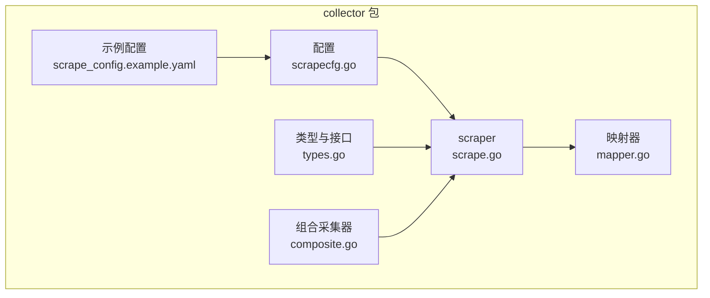
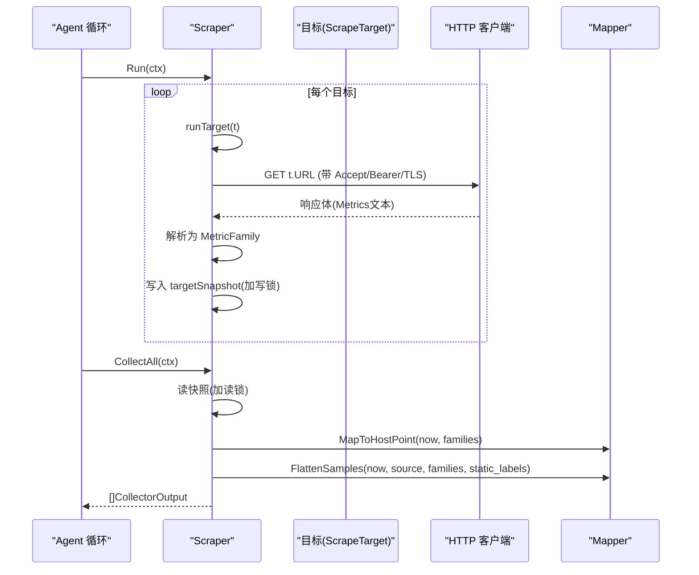
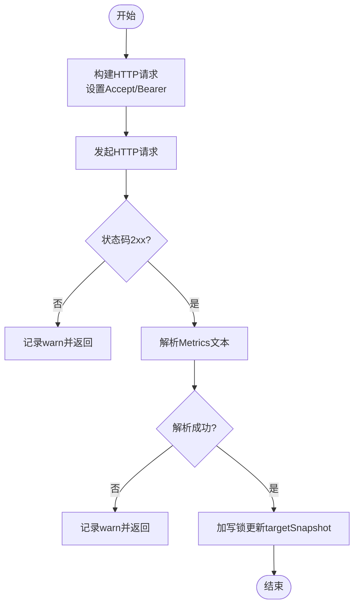
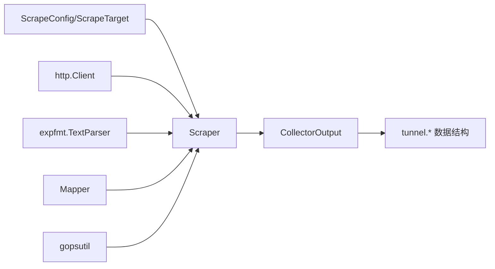
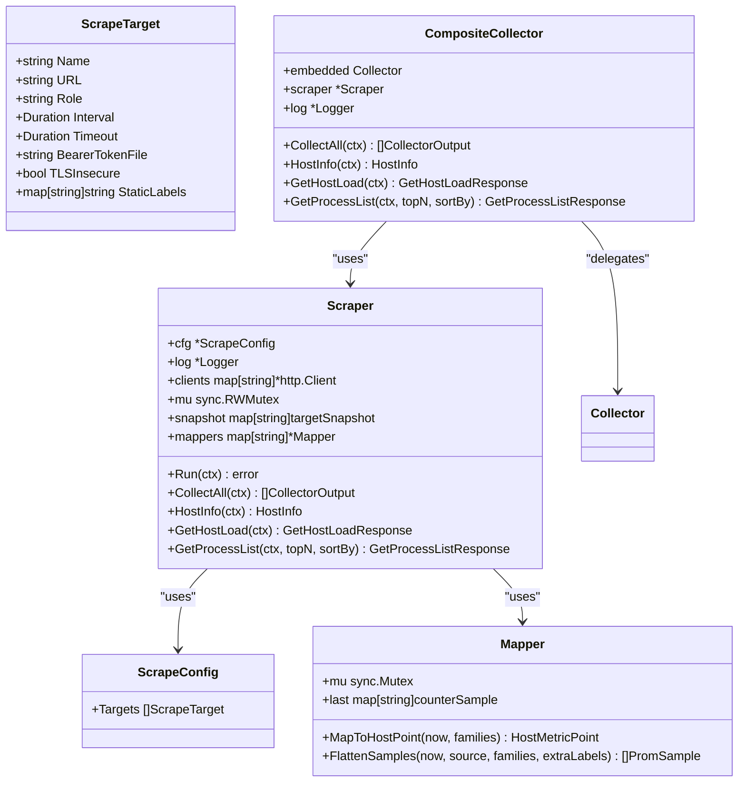

# 核心采集器

<cite>
**本文引用的文件**
- [scrape.go](file://internal/edgeagent/collector/scrape.go)
- [scrapecfg.go](file://internal/edgeagent/collector/scrapecfg.go)
- [types.go](file://internal/edgeagent/collector/types.go)
- [mapper.go](file://internal/edgeagent/collector/mapper.go)
- [composite.go](file://internal/edgeagent/collector/composite.go)
- [scrape_config.example.yaml](file://internal/edgeagent/collector/scrape_config.example.yaml)
</cite>

## 目录
1. [简介](#简介)
2. [项目结构](#项目结构)
3. [核心组件](#核心组件)
4. [架构总览](#架构总览)
5. [详细组件分析](#详细组件分析)
6. [依赖关系分析](#依赖关系分析)
7. [性能考量](#性能考量)
8. [故障排查指南](#故障排查指南)
9. [结论](#结论)
10. [附录](#附录)

## 简介
本文件面向“核心采集器”的 Scraper 组件，系统性阐述其架构设计、多目标并发采集机制、HTTP 指标抓取流程、快照管理、错误处理策略、目标配置管理（ScrapeTarget、连接池、TLS、认证）、数据采集生命周期（从请求构建到响应解析）、并发安全设计（读写锁与 goroutine 管理），并提供配置示例、最佳实践、性能调优建议与故障排查指南。

## 项目结构
Scraper 位于 edgeagent/collector 包中，围绕以下关键文件组织：
- scrape.go：实现 Scraper 主逻辑，包括多目标并发运行、HTTP 抓取、快照存储、CollectAll 输出等。
- scrapecfg.go：定义 ScrapeConfig 与 ScrapeTarget 结构体及默认值校验。
- types.go：定义 Collector 接口、CollectorOutput、Source 常量等。
- mapper.go：将 Prometheus MetricFamily 映射为 HostMetricPoint 与扁平 PromSample，并维护计数器差值缓存。
- composite.go：组合内嵌采集器与 Scraper，实现自动模式下的回退与合并。
- scrape_config.example.yaml：提供多目标采集配置示例。

图表来源
- [scrape.go:39-77](file://internal/edgeagent/collector/scrape.go#L39-L77)
- [scrapecfg.go:12-49](file://internal/edgeagent/collector/scrapecfg.go#L12-L49)
- [types.go:21-57](file://internal/edgeagent/collector/types.go#L21-L57)
- [mapper.go:16-68](file://internal/edgeagent/collector/mapper.go#L16-L68)
- [composite.go:10-55](file://internal/edgeagent/collector/composite.go#L10-L55)
- [scrape_config.example.yaml:9-30](file://internal/edgeagent/collector/scrape_config.example.yaml#L9-L30)

章节来源
- [scrape.go:39-77](file://internal/edgeagent/collector/scrape.go#L39-L77)
- [scrapecfg.go:12-49](file://internal/edgeagent/collector/scrapecfg.go#L12-L49)
- [types.go:21-57](file://internal/edgeagent/collector/types.go#L21-L57)
- [mapper.go:16-68](file://internal/edgeagent/collector/mapper.go#L16-L68)
- [composite.go:10-55](file://internal/edgeagent/collector/composite.go#L10-L55)
- [scrape_config.example.yaml:9-30](file://internal/edgeagent/collector/scrape_config.example.yaml#L9-L30)

## 核心组件
- Scraper：驱动每个目标一个 HTTP 抓取 goroutine，维护 per-target 的最近成功 MetricFamily 快照，支持 CollectAll 输出。
- ScrapeConfig / ScrapeTarget：描述目标 URL、角色（host/component）、间隔、超时、Bearer Token 文件、TLS 跳过验证、静态标签等。
- Mapper：将 MetricFamily 转换为 HostMetricPoint（快速路径）与 PromSample（丰富路径），维护计数器差值缓存以计算速率。
- CompositeCollector：组合内嵌采集器与 Scraper，在 host 角色可用时优先使用 scraped 数据，否则回退到内嵌基线。

章节来源
- [scrape.go:39-77](file://internal/edgeagent/collector/scrape.go#L39-L77)
- [scrapecfg.go:12-49](file://internal/edgeagent/collector/scrapecfg.go#L12-L49)
- [mapper.go:16-68](file://internal/edgeagent/collector/mapper.go#L16-L68)
- [composite.go:10-55](file://internal/edgeagent/collector/composite.go#L10-L55)

## 架构总览
Scraper 采用“每目标一协程”的并发模型，通过 errgroup 统一管理生命周期；每个目标独立维护 http.Client（含连接池与 TLS 配置），按 Interval 定时触发一次抓取，成功后更新内存快照；CollectAll 读取快照并生成 CollectorOutput，Mapper 负责将 MetricFamily 转为 HostMetricPoint 与 PromSample。CompositeCollector 在 host 角色不可用时回退到内嵌采集器。

图表来源
- [scrape.go:79-113](file://internal/edgeagent/collector/scrape.go#L79-L113)
- [scrape.go:117-183](file://internal/edgeagent/collector/scrape.go#L117-L183)
- [scrape.go:185-226](file://internal/edgeagent/collector/scrape.go#L185-L226)
- [mapper.go:40-68](file://internal/edgeagent/collector/mapper.go#L40-L68)
- [mapper.go:64-137](file://internal/edgeagent/collector/mapper.go#L64-L137)

## 详细组件分析

### Scraper：多目标并发采集与快照管理
- 并发模型：Run 使用 errgroup 为每个目标启动一个 goroutine，统一等待上下文取消或错误。
- 抓取循环：runTarget 立即执行一次抓取，随后按 Interval 定时器周期性抓取；每次抓取设置 context 超时。
- 请求构建：构造 GET 请求，设置 Accept 为 text/plain；若配置了 BearerTokenFile，则读取并注入 Authorization 头。
- 响应处理：仅接受 2xx 状态码；使用 TextParser 解析为 MetricFamily；失败记录 warn 日志但不中断其他目标。
- 快照存储：使用 RWMutex 保护 snapshot map，写入时使用写锁，读取时使用读锁；快照包含 families、时间戳、source、role。
- 输出聚合：CollectAll 遍历快照，结合 StaticLabels 与 Mapper 生成 CollectorOutput；对 role=host 的目标额外填充 HostPoint。

图表来源
- [scrape.go:117-183](file://internal/edgeagent/collector/scrape.go#L117-L183)

章节来源
- [scrape.go:79-113](file://internal/edgeagent/collector/scrape.go#L79-L113)
- [scrape.go:117-183](file://internal/edgeagent/collector/scrape.go#L117-L183)
- [scrape.go:185-226](file://internal/edgeagent/collector/scrape.go#L185-L226)

### ScrapeTarget：目标配置与连接池/TLS/认证
- 字段说明：
  - name：唯一标识，用于 Source = "scrape:<name>"。
  - url：绝对 /metrics 地址（http/https）。
  - role：host 或 component；host 可参与主机负载快速路径。
  - interval：抓取间隔，默认 30s。
  - timeout：单次抓取超时，默认 10s。
  - bearer_token_file：Bearer Token 文件路径，首次抓取读取并注入 Authorization。
  - tls_insecure：是否跳过证书验证（谨慎使用，适用于自签名 kubelet 等）。
  - static_labels：附加到该目标所有样本的静态标签。
- 默认值与校验：LoadScrapeConfig 会校验必填字段、role 合法性，并应用默认 interval/timeout。

章节来源
- [scrapecfg.go:12-49](file://internal/edgeagent/collector/scrapecfg.go#L12-L49)
- [scrapecfg.go:51-90](file://internal/edgeagent/collector/scrapecfg.go#L51-L90)

### HTTP 客户端与连接池
- 每目标一个 http.Client，复用连接，减少握手开销。
- Transport 配置：
  - MaxIdleConns: 4
  - MaxIdleConnsPerHost: 2
  - IdleConnTimeout: 90s
  - TLS MinVersion: TLS1.2
  - 可选 InsecureSkipVerify（由 tls_insecure 控制）
- 客户端 Timeout 来自目标配置的 timeout。

章节来源
- [scrape.go:360-377](file://internal/edgeagent/collector/scrape.go#L360-L377)

### 认证机制
- Bearer Token：从文件读取并在首次抓取时注入 Authorization 头；若读取失败记录 warn 并继续。
- TLS：默认启用最小版本限制；可按需跳过证书验证（生产环境慎用）。

章节来源
- [scrape.go:130-139](file://internal/edgeagent/collector/scrape.go#L130-L139)
- [scrape.go:360-377](file://internal/edgeagent/collector/scrape.go#L360-L377)

### 快照管理与并发安全
- 数据结构：snapshot map[string]targetSnapshot，保存最近一次成功的 MetricFamily 快照。
- 并发安全：
  - 写：scrapeOnce 更新快照时使用 mu.Lock()。
  - 读：CollectAll、GetHostLoad 使用 mu.RLock() 读取快照。
- 快照内容：families、at（时间戳）、source（"scrape:<name>"）、role（host/component）。

章节来源
- [scrape.go:46-56](file://internal/edgeagent/collector/scrape.go#L46-L56)
- [scrape.go:175-182](file://internal/edgeagent/collector/scrape.go#L175-L182)
- [scrape.go:185-226](file://internal/edgeagent/collector/scrape.go#L185-L226)
- [scrape.go:264-303](file://internal/edgeagent/collector/scrape.go#L264-L303)

### Mapper：指标映射与速率计算
- HostMetricPoint 快速路径：
  - CPU%：基于 node_cpu_seconds_total 的计数器差值计算 busy%。
  - 内存使用率：node_memory_MemAvailable_bytes 或 MemFree+Buffers+Cached。
  - 负载：node_load1/5/15。
  - 网络速率：node_network_receive/transmit_bytes_total 的差值除以时间差。
  - 磁盘使用率：根挂载点文件系统大小与可用空间。
- PromSample 丰富路径：
  - 将 Gauge/Counter/Untyped/Summary/Histogram 展开为扁平样本，合并静态标签。
  - 过滤 NaN/Inf 以保证 JSON 编码安全。
- 并发安全：Mapper 内部使用互斥锁保证计数器缓存的一致性。

章节来源
- [mapper.go:16-68](file://internal/edgeagent/collector/mapper.go#L16-L68)
- [mapper.go:64-137](file://internal/edgeagent/collector/mapper.go#L64-L137)
- [mapper.go:227-307](file://internal/edgeagent/collector/mapper.go#L227-L307)

### CompositeCollector：组合与回退
- 行为：
  - 先收集 Scraper 的输出；若存在 host 角色的有效快照，则优先使用。
  - 若无 host 角色有效快照，则回退到内嵌采集器的输出。
- 方法：
  - CollectAll：合并 scrape 与 embedded 输出。
  - HostInfo/GetHostLoad/GetProcessList：优先 scraper，其次 embedded。

章节来源
- [composite.go:10-55](file://internal/edgeagent/collector/composite.go#L10-L55)
- [composite.go:57-91](file://internal/edgeagent/collector/composite.go#L57-L91)

## 依赖关系分析
- Scraper 依赖：
  - ScrapeConfig/ScrapeTarget：目标配置与默认值。
  - http.Client：HTTP 请求与连接池。
  - expfmt.TextParser：解析 Metrics 文本。
  - Mapper：指标映射与速率计算。
  - gopsutil：本地主机信息获取（HostInfo/GetProcessList）。
- 外部集成：
  - tunnel.HostInfo/GetHostLoadResponse/PromSample：与云端通信的数据结构。
  - slog：结构化日志。

图表来源
- [scrape.go:3-27](file://internal/edgeagent/collector/scrape.go#L3-L27)
- [types.go:21-57](file://internal/edgeagent/collector/types.go#L21-L57)
- [mapper.go:1-14](file://internal/edgeagent/collector/mapper.go#L1-L14)

章节来源
- [scrape.go:3-27](file://internal/edgeagent/collector/scrape.go#L3-L27)
- [types.go:21-57](file://internal/edgeagent/collector/types.go#L21-L57)
- [mapper.go:1-14](file://internal/edgeagent/collector/mapper.go#L1-L14)

## 性能考量
- 连接复用：每目标一个 http.Client，开启连接池与空闲连接超时，减少握手与资源消耗。
- 并发隔离：errgroup 管理每个目标的 goroutine，单个目标失败不影响其他目标。
- 快照粒度：仅保留最近一次成功快照，降低内存占用。
- 指标展开优化：FlattenSamples 预分配容量，避免频繁扩容；过滤 NaN/Inf 减少无效传输。
- 速率计算：Mapper 使用稳定键（metric_name + 排序后的 label 对）缓存上次计数，确保差值计算正确。
- 超时控制：每个抓取设置 context 超时，防止慢目标阻塞整体调度。

[本节为通用性能指导，不直接分析具体文件]

## 故障排查指南
- 抓取失败（非 2xx）：检查目标 URL、网络连通性、服务端状态码；日志记录 warn 并忽略，不影响其他目标。
- 解析失败：确认目标返回的是 Prometheus text/plain 格式；查看解析错误日志。
- 认证失败：检查 BearerTokenFile 是否存在且可读；确认 token 内容非空；必要时调整权限。
- TLS 问题：如使用自签名证书，可临时启用 tls_insecure；生产环境建议使用有效证书。
- 无主机负载：若 role=host 但无有效快照，CompositeCollector 会回退到内嵌采集器；检查目标是否暴露 node_* 指标。
- 性能瓶颈：适当调整 interval/timeout；评估连接池参数；监控目标端指标导出性能。

章节来源
- [scrape.go:145-172](file://internal/edgeagent/collector/scrape.go#L145-L172)
- [scrape.go:130-139](file://internal/edgeagent/collector/scrape.go#L130-L139)
- [scrape.go:360-377](file://internal/edgeagent/collector/scrape.go#L360-L377)
- [composite.go:27-55](file://internal/edgeagent/collector/composite.go#L27-L55)

## 结论
Scraper 通过“每目标一协程”的并发模型、严格的快照管理与并发安全设计，实现了高效、稳定的多目标 HTTP 指标采集。配合 ScrapeTarget 的灵活配置（角色、间隔、超时、认证、TLS、静态标签）与 Mapper 的指标映射能力，既能满足主机负载的快速路径需求，也能提供丰富的 Prometheus 样本。CompositeCollector 提供了健壮的回退机制，确保在无 host 角色数据时仍能提供基础监控。

[本节为总结性内容，不直接分析具体文件]

## 附录

### 配置示例与最佳实践
- 示例配置见 scrape_config.example.yaml，展示了 host 与 component 角色、interval/timeout、bearer_token_file、tls_insecure、static_labels 的使用。
- 最佳实践：
  - 为每个目标设置合理的 interval 与 timeout，避免过度抓取或长时间阻塞。
  - 生产环境禁用 tls_insecure，使用有效证书。
  - 合理设置 static_labels，便于后续查询与区分。
  - 定期轮换 Bearer Token 文件，确保权限最小化。
  - 监控抓取成功率与延迟，及时调整目标端或网络策略。

章节来源
- [scrape_config.example.yaml:9-30](file://internal/edgeagent/collector/scrape_config.example.yaml#L9-L30)
- [scrapecfg.go:51-90](file://internal/edgeagent/collector/scrapecfg.go#L51-L90)

### 类图：核心对象关系

图表来源
- [scrape.go:39-77](file://internal/edgeagent/collector/scrape.go#L39-L77)
- [scrapecfg.go:12-49](file://internal/edgeagent/collector/scrapecfg.go#L12-L49)
- [mapper.go:16-68](file://internal/edgeagent/collector/mapper.go#L16-L68)
- [composite.go:10-55](file://internal/edgeagent/collector/composite.go#L10-L55)