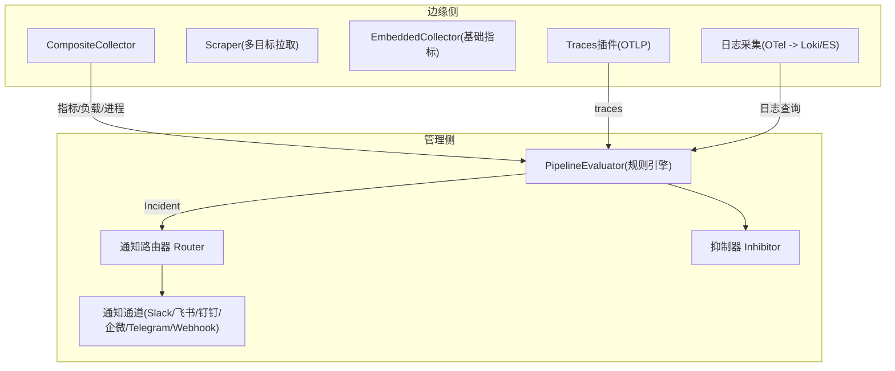
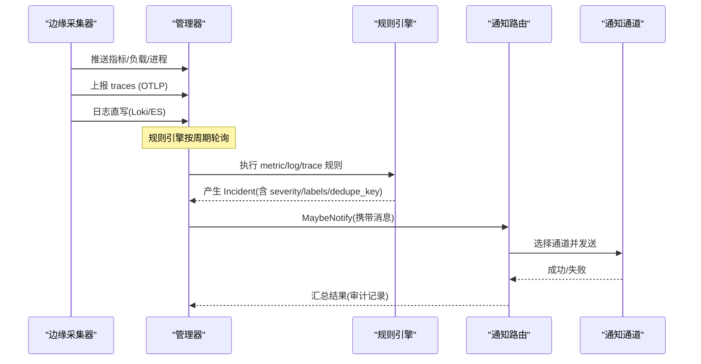
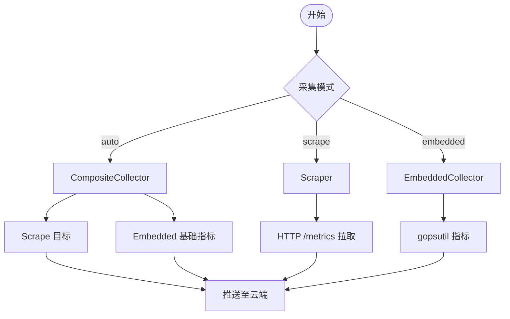
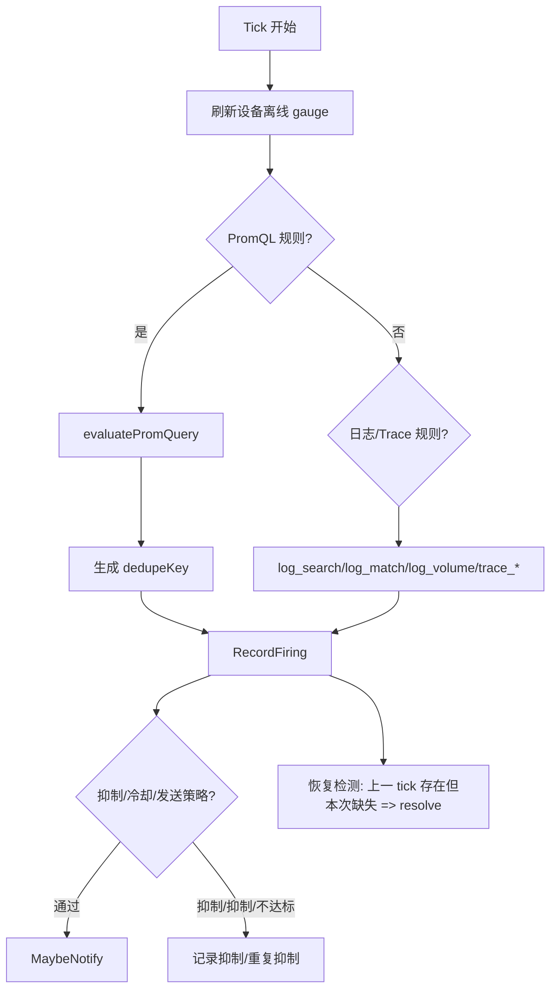
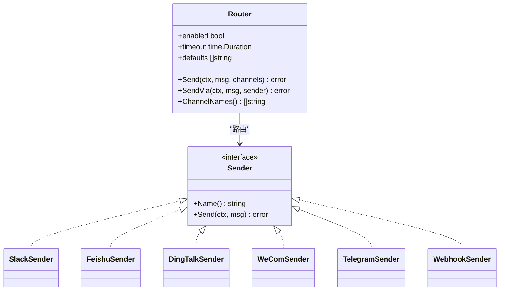
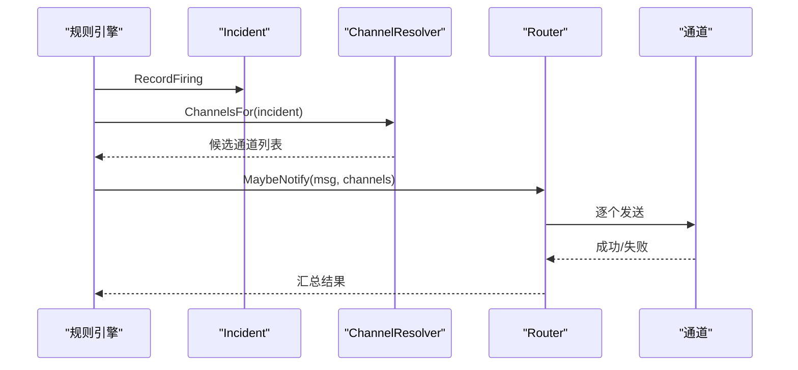
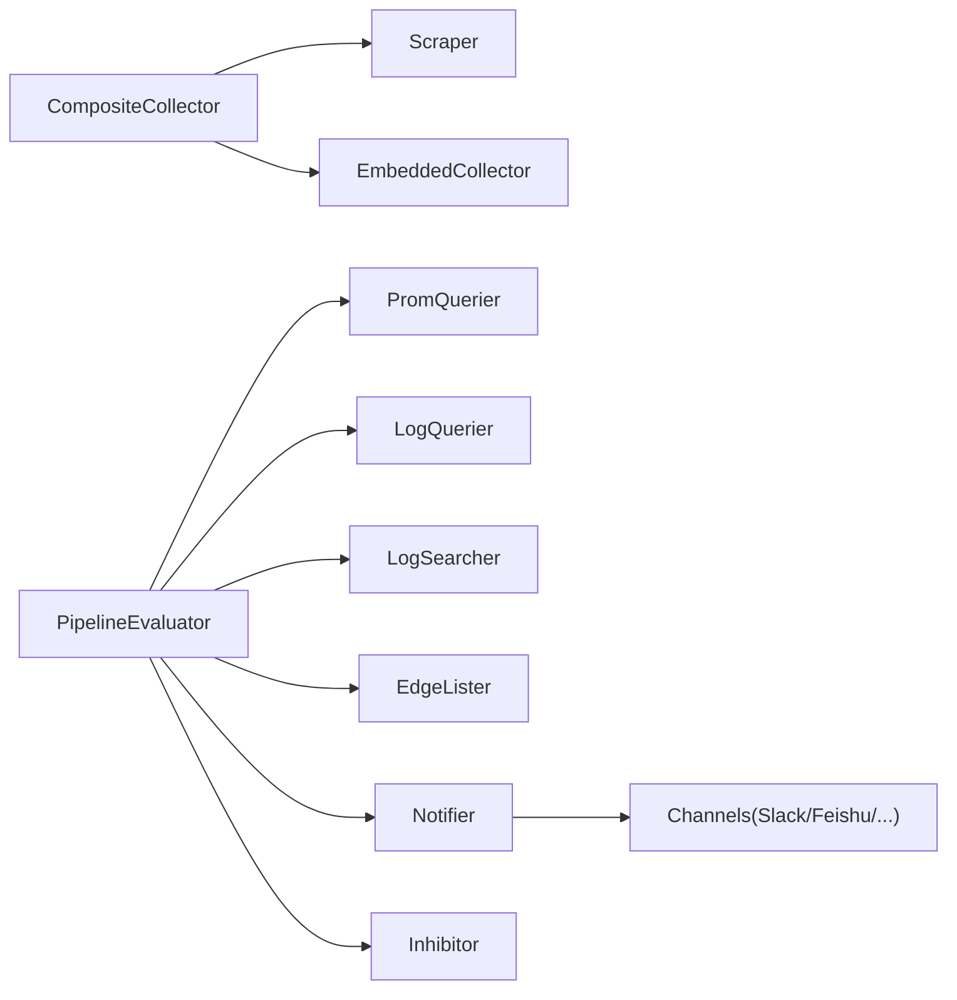

# 监控告警系统

<cite>
**本文引用的文件**
- [pipeline.go](file://internal/manager/biz/alert/pipeline.go)
- [model.go](file://internal/manager/model/alert/model.go)
- [usecase.go](file://internal/manager/biz/alert/usecase.go)
- [router.go](file://internal/manager/biz/alert/router.go)
- [inhibit.go](file://internal/manager/biz/alert/inhibit.go)
- [evaluators_phaseB.go](file://internal/manager/biz/alert/evaluators_phaseB.go)
- [evaluators_phaseA.go](file://internal/manager/biz/alert/evaluators_phaseA.go)
- [burn_rate_sli.go](file://internal/manager/biz/alert/burn_rate_sli.go)
- [notify.go](file://internal/pkg/notify/notify.go)
- [webhook.go](file://internal/pkg/notify/webhook.go)
- [config_test.go](file://internal/pkg/config/config_test.go)
- [main.go](file://cmd/ongrid-edge/main.go)
- [composite.go](file://internal/edgeagent/collector/composite.go)
- [scrape.go](file://internal/edgeagent/collector/scrape.go)
- [types.go](file://internal/edgeagent/collector/types.go)
- [render.go](file://internal/edgeagent/plugins/traces/render.go)
- [RFC-003-otel-elasticsearch-logs.md](file://docs/rfc/RFC-003-otel-elasticsearch-logs.md)
- [alerting.md](file://internal/manager/biz/knowledge/builtin_vault/concepts/alerting.md)
- [rca_pipeline_test.go](file://tests/e2e/rca_pipeline_test.go)
- [investigator/usecase.go](file://internal/manager/biz/alert/investigator/usecase.go)
</cite>

## 目录
1. [简介](#简介)
2. [项目结构](#项目结构)
3. [核心组件](#核心组件)
4. [架构总览](#架构总览)
5. [详细组件分析](#详细组件分析)
6. [依赖关系分析](#依赖关系分析)
7. [性能考量](#性能考量)
8. [故障排查指南](#故障排查指南)
9. [结论](#结论)
10. [附录](#附录)

## 简介
本技术文档围绕 Ongrid 监控告警系统，系统性说明边缘采集器的数据采集机制（指标、日志、分布式追踪），告警规则引擎的工作原理（规则定义、评估算法、去重与抑制），多渠道通知系统（Slack、Telegram、飞书、钉钉、企业微信等）集成方式，以及告警路由策略、优先级管理与升级机制。文档同时提供配置示例与最佳实践，并给出性能调优与故障排查建议，帮助构建高可用、低噪声、可观测的监控告警体系。

## 项目结构
- 边缘侧（Edge Agent）
  - 指标采集：嵌入式采集器 + 可插拔 scrape 目标，统一通过 CompositeCollector 输出 CollectorOutput 推送到云端。
  - 日志采集：基于 OTel Collector 模板渲染，支持内置 Loki 或外部 Elasticsearch 后端直写。
  - 分布式追踪：OTLP gRPC/HTTP 接收本地应用 traces，经资源注入与批处理后上报 Manager /v1/traces。
- 管理侧（Manager）
  - 规则引擎：PipelineEvaluator 按周期轮询 PromQL/LogQL/结构化日志查询/Trace 衍生指标，产出 Incident。
  - 通知路由：Router 将消息分发到 Slack、飞书、钉钉、企业微信、Telegram、Webhook 等通道。
  - 抑制与降噪：内置抑制规则（如 edge_offline 抑制同设备主机指标；prom_ingest_fail 抑制 scrape_down）。
  - 发送策略：窗口内最小触发次数阈值（dampening），避免抖动告警。
  - 自动根因分析：可选开启，对首次触发的严重事件异步发起调查并生成诊断报告。

**图表来源**
- [composite.go:10-55](file://internal/edgeagent/collector/composite.go#L10-L55)
- [scrape.go:29-113](file://internal/edgeagent/collector/scrape.go#L29-L113)
- [render.go:16-34](file://internal/edgeagent/plugins/traces/render.go#L16-L34)
- [pipeline.go:96-224](file://internal/manager/biz/alert/pipeline.go#L96-L224)
- [notify.go:39-130](file://internal/pkg/notify/notify.go#L39-L130)
- [inhibit.go:25-59](file://internal/manager/biz/alert/inhibit.go#L25-L59)

**章节来源**
- [main.go:130-157](file://cmd/ongrid-edge/main.go#L130-L157)
- [composite.go:10-55](file://internal/edgeagent/collector/composite.go#L10-L55)
- [scrape.go:29-113](file://internal/edgeagent/collector/scrape.go#L29-L113)
- [render.go:16-34](file://internal/edgeagent/plugins/traces/render.go#L16-L34)
- [RFC-003-otel-elasticsearch-logs.md:12-31](file://docs/rfc/RFC-003-otel-elasticsearch-logs.md#L12-L31)
- [pipeline.go:96-224](file://internal/manager/biz/alert/pipeline.go#L96-L224)

## 核心组件
- 边缘采集器
  - 接口契约：Collector.CollectAll 返回每源一条 CollectorOutput；HostInfo/GetHostLoad/GetProcessList 用于云->边 RPC。
  - 组合采集：CompositeCollector 优先使用 scrape 成功的主机指标，否则回退到 EmbeddedCollector。
  - 拉取器：Scraper 为每个目标独立 goroutine，定时抓取 HTTP /metrics，解析为 MetricFamily 快照。
- 规则引擎
  - PipelineEvaluator：周期性执行 metric_raw/anomaly/forecast/burn_rate、log_match/log_volume/log_search、trace_latency/error_rate 等评估。
  - 恢复检测：维护上一 tick 的 firingSnapshot，PromQL 比较过滤导致系列消失时自动 resolve。
  - 设备离线信号：刷新 device_last_seen_seconds_ago gauge，metric_raw 规则以“> 阈值”表达离线。
- 通知系统
  - Router：从配置或持久化 Channel 构造 Sender，统一超时、默认通道、启用开关。
  - 通道实现：Slack attachments、飞书签名、钉钉 URL 签名、企业微信文本、Telegram sendMessage、通用 Webhook HMAC。
- 抑制与降噪
  - BuiltinInhibitor：edge_offline 抑制同设备主机指标；prom_ingest_fail 抑制 scrape_down。
  - 发送策略：NotifyWindowSeconds + NotifyMinFires 窗口内达到最小触发次数才通知，否则记录 repeat_suppressed。

**章节来源**
- [types.go:38-57](file://internal/edgeagent/collector/types.go#L38-L57)
- [composite.go:10-55](file://internal/edgeagent/collector/composite.go#L10-L55)
- [scrape.go:29-113](file://internal/edgeagent/collector/scrape.go#L29-L113)
- [pipeline.go:96-224](file://internal/manager/biz/alert/pipeline.go#L96-L224)
- [pipeline.go:226-280](file://internal/manager/biz/alert/pipeline.go#L226-L280)
- [pipeline.go:282-408](file://internal/manager/biz/alert/pipeline.go#L282-L408)
- [notify.go:39-130](file://internal/pkg/notify/notify.go#L39-L130)
- [webhook.go:27-192](file://internal/pkg/notify/webhook.go#L27-L192)
- [inhibit.go:25-59](file://internal/manager/biz/alert/inhibit.go#L25-L59)
- [usecase.go:1362-1385](file://internal/manager/biz/alert/usecase.go#L1362-L1385)

## 架构总览
下图展示从边缘采集到规则评估、再到通知投递的全链路数据流。

**图表来源**
- [pipeline.go:172-224](file://internal/manager/biz/alert/pipeline.go#L172-L224)
- [pipeline.go:410-461](file://internal/manager/biz/alert/pipeline.go#L410-L461)
- [notify.go:92-156](file://internal/pkg/notify/notify.go#L92-L156)
- [webhook.go:27-192](file://internal/pkg/notify/webhook.go#L27-L192)

## 详细组件分析

### 边缘采集器：指标、日志、追踪
- 指标采集
  - 模式：auto/scrape/embedded，auto 下 CompositeCollector 合并 embedded 与 scrape。
  - 拉取：Scraper 为每个目标启动独立 goroutine，带超时、Bearer Token、TLS 支持，解析 Prometheus 文本格式。
  - 回退：当 scrape 未成功覆盖 host 指标时，回退到 EmbeddedCollector 保证基础指标连续性。
- 日志采集
  - 单一采集链路：OTel Collector 统一 Host/K8s/File 日志，当前只启用一个 exporter（Loki 或 ES）。
  - 边界控制：Edge 仅允许 data stream auto_configure/create_doc；Manager 查询固定 endpoint、pattern、字段与限制。
- 分布式追踪
  - 模板渲染：receivers 绑定 docker bridge/localhost，exporter 指向 Manager /v1/traces。
  - 管道：receivers -> resourcedetection -> resource(device_id) -> batch -> exporter；tail_sampling 留在 Manager 侧。

**图表来源**
- [main.go:456-488](file://cmd/ongrid-edge/main.go#L456-L488)
- [composite.go:10-55](file://internal/edgeagent/collector/composite.go#L10-L55)
- [scrape.go:29-113](file://internal/edgeagent/collector/scrape.go#L29-L113)
- [render.go:16-34](file://internal/edgeagent/plugins/traces/render.go#L16-L34)
- [RFC-003-otel-elasticsearch-logs.md:12-31](file://docs/rfc/RFC-003-otel-elasticsearch-logs.md#L12-L31)

**章节来源**
- [main.go:130-157](file://cmd/ongrid-edge/main.go#L130-L157)
- [main.go:456-488](file://cmd/ongrid-edge/main.go#L456-L488)
- [composite.go:10-55](file://internal/edgeagent/collector/composite.go#L10-L55)
- [scrape.go:29-113](file://internal/edgeagent/collector/scrape.go#L29-L113)
- [render.go:16-34](file://internal/edgeagent/plugins/traces/render.go#L16-L34)
- [RFC-003-otel-elasticsearch-logs.md:12-31](file://docs/rfc/RFC-003-otel-elasticsearch-logs.md#L12-L31)

### 规则引擎：定义、评估、去重与抑制
- 规则模型
  - Kind：metric_raw/anomaly/forecast/burn_rate、log_search/log_match/log_volume、trace_latency/error_rate。
  - Scope：host/global/monitoring_pipeline；JoinMode：all/any；Severity：critical/warning/info。
  - 条件：ConditionsJSON 随 kind 不同而不同；UI 友好表单 metric_threshold 在保存时编译为 metric_raw。
- 评估流程
  - 设备离线信号：refreshDeviceStalenessGauge 写入 device_last_seen_seconds_ago，metric_raw 规则以“> 阈值”判定离线。
  - PromQL 评估：evaluatePromQuery 遍历向量结果，按 label 集生成 dedupeKey，RecordFiring 后进入通知流程；缺失项则 system-resolve。
  - 日志评估：Phase-B 的 log_search/log_match/log_volume 走 logquery.CountGrouped 或 LogQL 范围查询。
  - Trace 评估：trace_latency/error_rate 基于 spanmetrics（Prom）进行计算。
  - Burn Rate：多窗口 multi-burn-rate 必须全部满足才触发，clear 时统一 resolve。
- 去重与抑制
  - 去重：dedupeKey 由 rule_key + label 集构成，忽略 __name__/ongrid_source/source_id 等非身份标签。
  - 抑制：BuiltinInhibitor 在 edge_offline 或 prom_ingest_fail 活跃时抑制下游噪音。
  - 发送策略：窗口内未达到最小触发次数则记录 repeat_suppressed 并跳过通知。

**图表来源**
- [pipeline.go:195-224](file://internal/manager/biz/alert/pipeline.go#L195-L224)
- [pipeline.go:226-280](file://internal/manager/biz/alert/pipeline.go#L226-L280)
- [pipeline.go:282-408](file://internal/manager/biz/alert/pipeline.go#L282-L408)
- [evaluators_phaseB.go:28-53](file://internal/manager/biz/alert/evaluators_phaseB.go#L28-L53)
- [evaluators_phaseA.go:246-338](file://internal/manager/biz/alert/evaluators_phaseA.go#L246-L338)
- [inhibit.go:25-59](file://internal/manager/biz/alert/inhibit.go#L25-L59)
- [usecase.go:1362-1385](file://internal/manager/biz/alert/usecase.go#L1362-L1385)

**章节来源**
- [model.go:61-184](file://internal/manager/model/alert/model.go#L61-L184)
- [pipeline.go:195-224](file://internal/manager/biz/alert/pipeline.go#L195-L224)
- [pipeline.go:226-280](file://internal/manager/biz/alert/pipeline.go#L226-L280)
- [pipeline.go:282-408](file://internal/manager/biz/alert/pipeline.go#L282-L408)
- [evaluators_phaseB.go:28-53](file://internal/manager/biz/alert/evaluators_phaseB.go#L28-L53)
- [evaluators_phaseA.go:246-338](file://internal/manager/biz/alert/evaluators_phaseA.go#L246-L338)
- [burn_rate_sli.go:10-27](file://internal/manager/biz/alert/burn_rate_sli.go#L10-L27)
- [inhibit.go:25-59](file://internal/manager/biz/alert/inhibit.go#L25-L59)
- [usecase.go:1362-1385](file://internal/manager/biz/alert/usecase.go#L1362-L1385)

### 多渠道通知系统：Slack、Telegram、飞书、钉钉、企业微信
- 通道抽象
  - Message：标准化载荷（subject/body/severity/source/dedupe_key/labels/occurred_at）。
  - Sender：Name() + Send(ctx, msg)。
  - Router：根据 enabled/timeout/defaults 路由到具体 Sender；SendVia 支持按行构建的持久化通道。
- 通道实现
  - Slack：attachments 格式，severity 色条，结构化字段（Rule/Incident/Device/Dedupe key）。
  - 飞书：text payload，支持 timestamp+sign（HMAC-SHA256 base64）。
  - 钉钉：URL 签名（timestamp/sign 参数）。
  - 企业微信：文本 payload，bot URL 自带密钥。
  - Telegram：sendMessage，chat_id 在 body。
  - Webhook：通用 JSON，支持 HMAC 签名头。
- 配置加载
  - 从 NotificationConfig 构建 senders，支持 webhook/slack/feishu/dingtalk 等；测试覆盖默认通道、超时、secret 读取。

**图表来源**
- [notify.go:39-156](file://internal/pkg/notify/notify.go#L39-L156)
- [webhook.go:27-192](file://internal/pkg/notify/webhook.go#L27-L192)
- [config_test.go:257-294](file://internal/pkg/config/config_test.go#L257-L294)

**章节来源**
- [notify.go:13-156](file://internal/pkg/notify/notify.go#L13-L156)
- [webhook.go:27-192](file://internal/pkg/notify/webhook.go#L27-L192)
- [config_test.go:257-294](file://internal/pkg/config/config_test.go#L257-L294)

### 告警路由策略、优先级与升级
- 路由策略
  - DBChannelResolver：按 incident 的 severity/scope_type 过滤启用的 channel；支持规则级 notify_channel_ids 覆盖。
  - 默认通道：Router.defaults 作为兜底；未配置通道会报错。
- 优先级
  - Severity：info/warning/critical；影响路由与 UI 呈现。
  - 抑制：BuiltinInhibitor 在高优先级根因活跃时抑制下游噪音。
- 升级机制
  - 发送策略：窗口内达到最小触发次数才通知，避免抖动。
  - 自动 RCA：可选开启，首次触发即异步调查，生成诊断报告（需设置 ONGRID_INVESTIGATOR_ENABLED）。

**图表来源**
- [router.go:11-37](file://internal/manager/biz/alert/router.go#L11-L37)
- [usecase.go:1520-1549](file://internal/manager/biz/alert/usecase.go#L1520-L1549)
- [notify.go:92-156](file://internal/pkg/notify/notify.go#L92-L156)

**章节来源**
- [router.go:11-37](file://internal/manager/biz/alert/router.go#L11-L37)
- [usecase.go:1520-1549](file://internal/manager/biz/alert/usecase.go#L1520-L1549)
- [alerting.md:28-48](file://internal/manager/biz/knowledge/builtin_vault/concepts/alerting.md#L28-L48)
- [rca_pipeline_test.go:50-75](file://tests/e2e/rca_pipeline_test.go#L50-L75)
- [investigator/usecase.go:102-133](file://internal/manager/biz/alert/investigator/usecase.go#L102-L133)

## 依赖关系分析
- 边缘侧依赖
  - CompositeCollector 依赖 Scraper 与 EmbeddedCollector；Scraper 依赖 HTTP 客户端与 gopsutil。
  - Traces 插件依赖 OTel Collector 模板渲染与 Manager /v1/traces。
- 管理侧依赖
  - PipelineEvaluator 依赖 PromQuerier、LogQuerier、LogSearcher、EdgeLister、Notifier、ChannelResolver、Inhibitor。
  - Notifier.Router 依赖各 Sender 实现；ChannelResolver 依赖 RuleLookup 与 channel 存储。
  - Inhibitor 依赖 IncidentLookup 查询活跃 incident。

**图表来源**
- [composite.go:10-55](file://internal/edgeagent/collector/composite.go#L10-L55)
- [pipeline.go:63-94](file://internal/manager/biz/alert/pipeline.go#L63-L94)
- [notify.go:39-156](file://internal/pkg/notify/notify.go#L39-L156)
- [inhibit.go:20-36](file://internal/manager/biz/alert/inhibit.go#L20-L36)

**章节来源**
- [composite.go:10-55](file://internal/edgeagent/collector/composite.go#L10-L55)
- [pipeline.go:63-94](file://internal/manager/biz/alert/pipeline.go#L63-L94)
- [notify.go:39-156](file://internal/pkg/notify/notify.go#L39-L156)
- [inhibit.go:20-36](file://internal/manager/biz/alert/inhibit.go#L20-L36)

## 性能考量
- 采集侧
  - 多目标并发：Scraper 为每个目标独立 goroutine，注意连接池与超时配置。
  - 回退策略：CompositeCollector 在 scrape 失败时回退 embedded，保障基础指标连续性。
  - 日志直写：OTel Collector 使用 queue/retry/checkpoint，减少丢日志风险。
- 规则评估
  - 评估间隔：默认 5 分钟（可配置），PromQL/LogQL 查询应精简表达式与时间窗。
  - 恢复检测：firingSnapshot 仅在 evaluatePromQuery 中更新，避免额外锁竞争。
  - 抑制与降噪：抑制规则减少无效通知；发送策略降低抖动。
- 通知侧
  - 超时控制：Router 默认 10s 超时，避免阻塞主循环。
  - 通道选择：优先使用轻量通道（如 Webhook），复杂通道（如 Slack attachments）按需启用。
  - 批量与节流：结合规则级 dampening 与全局冷却时间，降低风暴。

[本节为通用指导，无需特定文件引用]

## 故障排查指南
- 采集问题
  - scrape 失败：检查目标 URL、认证（Bearer Token）、TLS、非 2xx 响应；查看 warn 日志定位目标名。
  - 指标缺失：确认 CompositeCollector 是否回退到 embedded；检查 scrape 是否成功填充 host 指标。
  - 日志不可用：确认 OTel Collector 配置（Loki/ES）与权限；验证 data stream pattern 与字段映射。
- 规则问题
  - 未触发：检查 PromQL/LogQL 表达式与时间窗；确认 scope_type 与 labels 匹配；查看 evaluate 错误日志。
  - 误报/漏报：调整抑制规则与 dampening 参数；核对 dedupeKey 生成逻辑（排除非身份标签）。
  - 恢复延迟：确认 device_last_seen_seconds_ago gauge 刷新频率与规则阈值。
- 通知问题
  - 未送达：检查 Router.enabled、默认通道、通道 endpoint/secret；查看通知失败记录。
  - 签名失败：飞书/钉钉签名算法与时间戳；Telegram chat_id 是否正确。
  - 风暴告警：启用 dampening 与抑制；增加冷却时间；拆分规则粒度。

**章节来源**
- [scrape.go:115-183](file://internal/edgeagent/collector/scrape.go#L115-L183)
- [pipeline.go:282-408](file://internal/manager/biz/alert/pipeline.go#L282-L408)
- [pipeline.go:410-461](file://internal/manager/biz/alert/pipeline.go#L410-L461)
- [notify.go:92-156](file://internal/pkg/notify/notify.go#L92-L156)
- [webhook.go:141-192](file://internal/pkg/notify/webhook.go#L141-L192)
- [inhibit.go:43-73](file://internal/manager/biz/alert/inhibit.go#L43-L73)

## 结论
Ongrid 监控告警系统通过边缘侧灵活采集（指标/日志/追踪）与管理侧强大的规则引擎（PromQL/LogQL/结构化日志/Trace 衍生指标）相结合，实现了高可扩展、低噪声的告警能力。内置抑制与发送策略有效降噪，多渠道通知满足不同团队需求。配合自动 RCA 与完善的审计记录，形成闭环的可观测性与运维效率提升。建议在生产环境中合理配置采集间隔、规则表达式、抑制与 dampening 参数，并持续优化通道与路由策略，以获得最佳稳定性与可维护性。

[本节为总结性内容，无需特定文件引用]

## 附录
- 配置示例要点
  - 边缘采集模式：auto/scrape/embedded；scrape 目标需配置 URL、Interval、Timeout、BearerTokenFile。
  - 日志后端：选择内置 Loki 或外部 Elasticsearch；确保 data stream 权限与字段映射。
  - 通知通道：Slack/飞书/钉钉/企微/Telegram/Webhook；正确填写 endpoint/secret/chat_id。
  - 规则参数：Kind/ScopeType/Severity/ConditionsJSON；BurnRate 的 SLI/SLO/窗口与倍数。
  - 发送策略：NotifyWindowSeconds + NotifyMinFires；冷却时间与默认通道。
- 最佳实践
  - 指标命名与标签规范化，避免 dedupeKey 爆炸。
  - 规则分层：基础健康（edge_offline/prom_ingest_fail）优先，业务指标次之。
  - 抑制与降噪：启用 edge_offline 抑制与 prom_ingest_fail 抑制；合理设置 dampening。
  - 通知分级：critical 走 page+即时通讯；warning 走工单/频道；info 仅记录。
  - 可观测性：关注 alert_events 审计记录；利用 RCA 报告快速定位根因。

[本节为补充信息，无需特定文件引用]