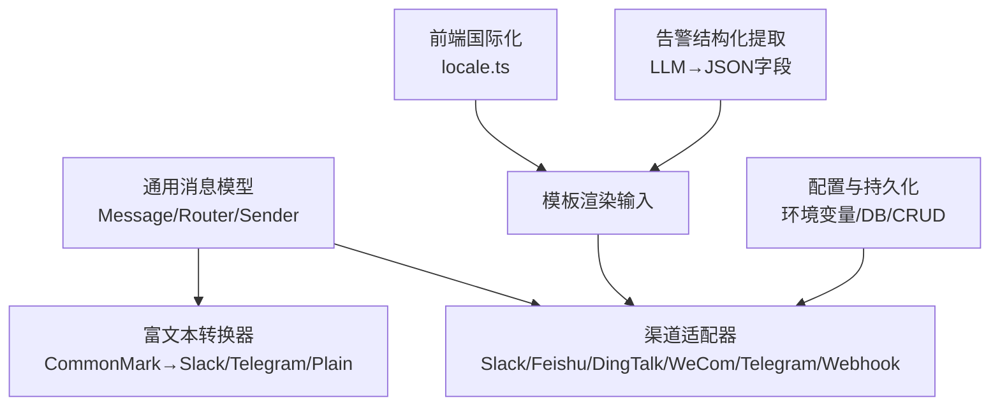
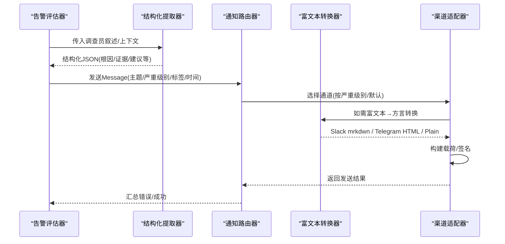
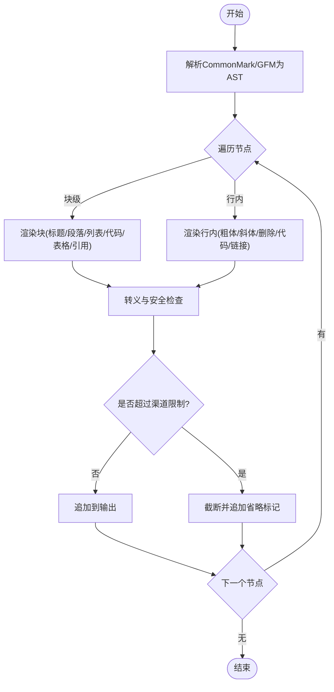
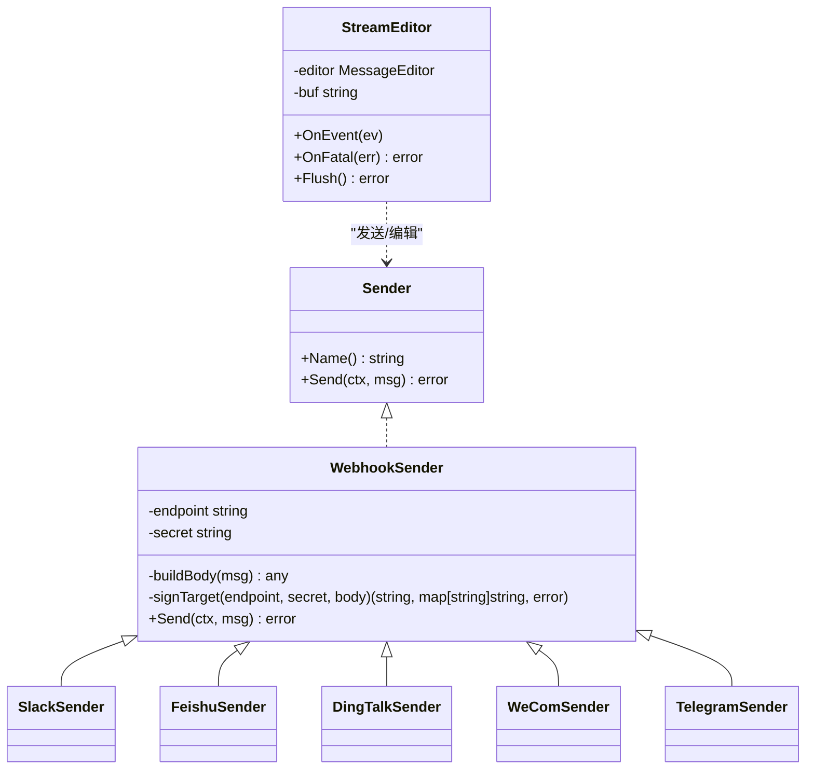
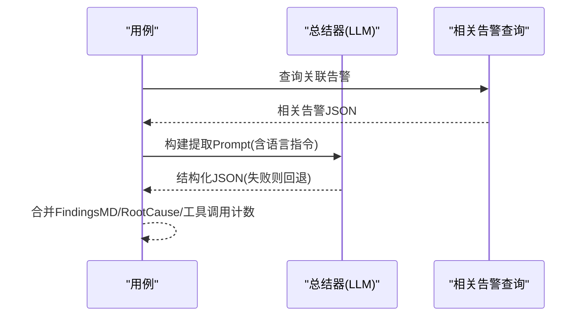
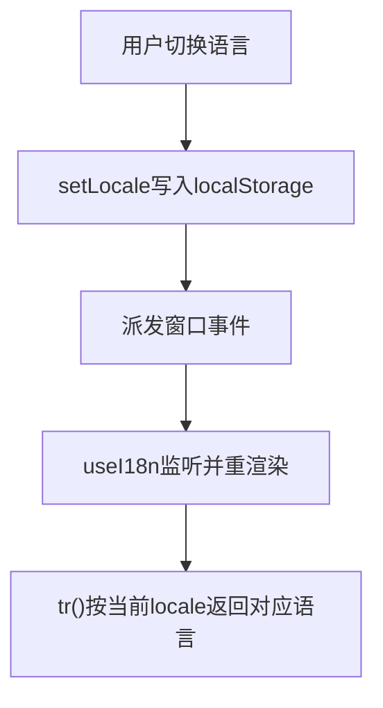
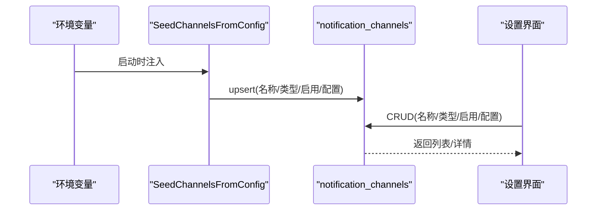
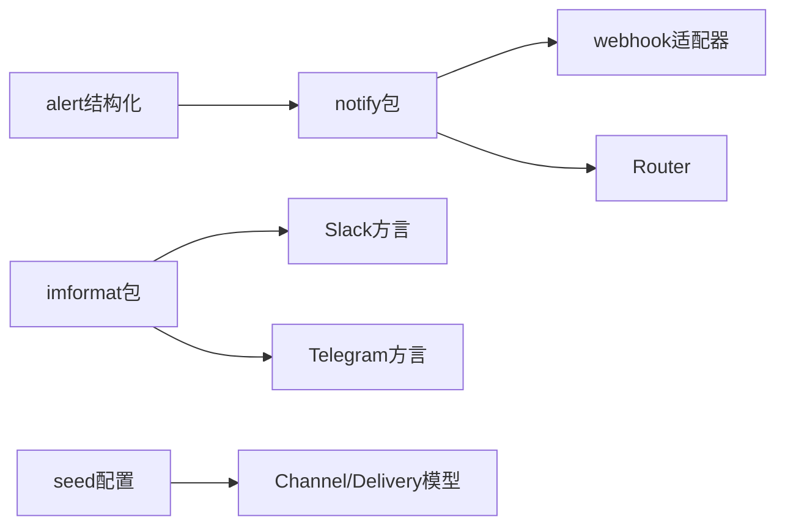

# 模板系统与消息格式化

<cite>
**本文引用的文件**
- [notify.go](file://internal/pkg/notify/notify.go)
- [webhook.go](file://internal/pkg/notify/webhook.go)
- [format.go](file://internal/manager/biz/imbridge/imformat/format.go)
- [sender.go](file://internal/manager/biz/imbridge/sender.go)
- [seed.go](file://internal/manager/data/alert/store/seed.go)
- [service.go](file://internal/manager/service/alert/service.go)
- [model.go](file://internal/manager/model/alert/model.go)
- [notification.proto](file://api/manager/notification/v1/notification.proto)
- [repo.go](file://internal/manager/biz/alert/repo.go)
- [report_extractor.go](file://internal/manager/biz/alert/investigator/report_extractor.go)
- [locale.ts](file://web/src/i18n/locale.ts)
</cite>

## 目录
1. [简介](#简介)
2. [项目结构](#项目结构)
3. [核心组件](#核心组件)
4. [架构总览](#架构总览)
5. [详细组件分析](#详细组件分析)
6. [依赖关系分析](#依赖关系分析)
7. [性能与限制](#性能与限制)
8. [故障排查指南](#故障排查指南)
9. [结论](#结论)
10. [附录：模板开发规范与最佳实践](#附录模板开发规范与最佳实践)

## 简介
本技术文档围绕通知模板系统，系统性说明消息模板的设计、渲染引擎、变量替换、条件渲染、富文本支持、多渠道适配与格式转换、告警信息结构化提取与格式化、多语言支持与本地化配置、模板版本管理与热更新机制，以及自定义模板与扩展渲染功能的实现方式。该系统以“通用消息模型 + 渠道适配器 + 富文本到渠道方言的转换器”为核心，确保同一份内容可安全、稳定地投递至多种 IM/Webhook 渠道。

## 项目结构
通知与模板相关代码主要分布在以下层次：
- 通用通知层：定义统一的消息模型、路由与发送器抽象，负责将 Message 分发到具体渠道。
- 渠道适配层：为 Slack、飞书、钉钉、企业微信、Telegram、通用 Webhook 等提供专用载荷构建与签名逻辑。
- 富文本转换层：将 LLM/CommonMark/GFM 输出转换为各渠道原生方言（Slack mrkdwn、Telegram HTML、纯文本摘要）。
- 告警结构化层：从调查员报告或最终回答中抽取结构化字段，便于后续模板渲染与展示。
- 配置与持久化：通过环境变量注入通道、数据库存储通道与投递记录，并提供 UI CRUD。
- 前端国际化：基于内联双语字符串与窗口事件驱动的语言切换，影响提示语与指令语言。

**图表来源**
- [notify.go:22-37](file://internal/pkg/notify/notify.go#L22-L37)
- [webhook.go:27-192](file://internal/pkg/notify/webhook.go#L27-L192)
- [format.go:1-118](file://internal/manager/biz/imbridge/imformat/format.go#L1-L118)
- [report_extractor.go:34-63](file://internal/manager/biz/alert/investigator/report_extractor.go#L34-L63)
- [seed.go:13-37](file://internal/manager/data/alert/store/seed.go#L13-L37)
- [locale.ts:1-101](file://web/src/i18n/locale.ts#L1-L101)

**章节来源**
- [notify.go:22-37](file://internal/pkg/notify/notify.go#L22-L37)
- [webhook.go:27-192](file://internal/pkg/notify/webhook.go#L27-L192)
- [format.go:1-118](file://internal/manager/biz/imbridge/imformat/format.go#L1-L118)
- [report_extractor.go:34-63](file://internal/manager/biz/alert/investigator/report_extractor.go#L34-L63)
- [seed.go:13-37](file://internal/manager/data/alert/store/seed.go#L13-L37)
- [locale.ts:1-101](file://web/src/i18n/locale.ts#L1-L101)

## 核心组件
- 通用消息模型与路由
  - Message：包含主题、正文、严重级别、来源、去重键、标签、发生时间等标准化字段。
  - Router：按名称路由到已注册的 Sender；支持默认通道、超时控制、启用开关。
  - Sender：统一的发送接口，屏蔽渠道差异。
- 渠道适配器
  - Slack：使用 attachments 格式，带颜色条与结构化字段；顶部 text 用于推送预览。
  - 飞书/钉钉/企业微信：构造各自平台兼容的 JSON 文本负载，部分支持签名。
  - Telegram：通过 sendMessage 发送，chat_id 在请求体中。
  - 通用 Webhook：直接 POST Message JSON，可选 HMAC 签名头。
- 富文本转换器
  - 将 CommonMark/GFM 解析为 Slack mrkdwn、Telegram HTML、纯文本摘要；严格转义与长度限制，避免原始 HTML 泄露。
- 告警结构化提取
  - 调用 LLM 将调查员叙述转为结构化 JSON（根因、受影响窗口、目标、证据、建议动作、置信度等），失败时回退到首段启发式。
- 配置与持久化
  - 启动时从环境变量注入通道并写入 DB；UI 可对通道进行 CRUD；Delivery 表记录每次投递状态与请求/响应。
- 前端国际化
  - 内联双语字符串与窗口事件驱动切换；影响助手回复语言指令与界面文案。

**章节来源**
- [notify.go:22-37](file://internal/pkg/notify/notify.go#L22-L37)
- [notify.go:47-90](file://internal/pkg/notify/notify.go#L47-L90)
- [webhook.go:27-192](file://internal/pkg/notify/webhook.go#L27-L192)
- [format.go:36-118](file://internal/manager/biz/imbridge/imformat/format.go#L36-L118)
- [report_extractor.go:34-63](file://internal/manager/biz/alert/investigator/report_extractor.go#L34-L63)
- [seed.go:13-37](file://internal/manager/data/alert/store/seed.go#L13-L37)
- [model.go:366-388](file://internal/manager/model/alert/model.go#L366-L388)
- [locale.ts:1-101](file://web/src/i18n/locale.ts#L1-L101)

## 架构总览
下图展示了从告警事件到多渠道投递的整体流程，包括富文本转换、结构化提取、渠道适配与签名。

**图表来源**
- [notify.go:92-130](file://internal/pkg/notify/notify.go#L92-L130)
- [webhook.go:56-115](file://internal/pkg/notify/webhook.go#L56-L115)
- [format.go:120-130](file://internal/manager/biz/imbridge/imformat/format.go#L120-L130)
- [report_extractor.go:213-247](file://internal/manager/biz/alert/investigator/report_extractor.go#L213-L247)

## 详细组件分析

### 富文本渲染引擎（CommonMark/GFM → 渠道方言）
- 设计要点
  - 使用 Goldmark 解析 AST，逐节点渲染为 Slack mrkdwn、Telegram HTML 或纯文本。
  - 严格转义：禁止原始 HTML 透传；链接仅允许 http/https/mailto；代码块语言名白名单过滤。
  - 长度限制：Telegram 消息上限 4096 字符；Slack 段落拆分与最大节数限制；超长段落回退为纯文本摘要。
  - 列表、表格、引用、分隔线等块级元素分别映射到目标方言。
- 关键函数路径
  - render/renderBlock/renderInline/writeBlock/escapeText/safeLink/safeLanguage
  - SlackSections：按段落拆分并遵守每节字符上限与最大节数。
  - TelegramHTML：保证标签平衡并在截断处追加省略标记。

**图表来源**
- [format.go:120-130](file://internal/manager/biz/imbridge/imformat/format.go#L120-L130)
- [format.go:140-198](file://internal/manager/biz/imbridge/imformat/format.go#L140-L198)
- [format.go:266-331](file://internal/manager/biz/imbridge/imformat/format.go#L266-L331)
- [format.go:392-429](file://internal/manager/biz/imbridge/imformat/format.go#L392-L429)
- [format.go:431-472](file://internal/manager/biz/imbridge/imformat/format.go#L431-L472)

**章节来源**
- [format.go:1-118](file://internal/manager/biz/imbridge/imformat/format.go#L1-L118)
- [format.go:120-198](file://internal/manager/biz/imbridge/imformat/format.go#L120-L198)
- [format.go:266-331](file://internal/manager/biz/imbridge/imformat/format.go#L266-L331)
- [format.go:392-429](file://internal/manager/biz/imbridge/imformat/format.go#L392-L429)
- [format.go:431-472](file://internal/manager/biz/imbridge/imformat/format.go#L431-L472)

### 渠道适配与格式转换（Slack/飞书/钉钉/企业微信/Telegram/Webhook）
- Slack
  - 使用 attachments 格式，附带颜色条与结构化字段（严重级别、来源、规则、事件ID、设备ID、去重键）。
  - 顶部 text 作为推送/侧边栏/邮件摘要的降级显示。
- 飞书/钉钉/企业微信
  - 构造文本型负载；飞书/钉钉支持签名（HMAC+时间戳）；企业微信通过 URL 查询参数携带密钥。
- Telegram
  - 通过 Bot API sendMessage 发送；chat_id 在请求体中；不使用 secret/signing 路径。
- 通用 Webhook
  - 直接 POST Message JSON；可选 HMAC 签名头 X-Ongrid-Signature。
- 流式编辑（IM桥接）
  - 对支持编辑的平台（如飞书/Telegram/Slack），采用节流策略周期性 EditText 更新消息体，避免频繁覆盖。

**图表来源**
- [notify.go:33-37](file://internal/pkg/notify/notify.go#L33-L37)
- [webhook.go:18-25](file://internal/pkg/notify/webhook.go#L18-L25)
- [webhook.go:27-192](file://internal/pkg/notify/webhook.go#L27-L192)
- [sender.go:13-26](file://internal/manager/biz/imbridge/sender.go#L13-L26)
- [sender.go:28-66](file://internal/manager/biz/imbridge/sender.go#L28-L66)

**章节来源**
- [webhook.go:27-192](file://internal/pkg/notify/webhook.go#L27-L192)
- [sender.go:13-66](file://internal/manager/biz/imbridge/sender.go#L13-L66)
- [sender.go:119-159](file://internal/manager/biz/imbridge/sender.go#L119-L159)

### 告警信息的结构化提取与格式化
- 结构化提取
  - 通过 LLM 将调查员叙述解析为 JSON，包含根因、受影响窗口、目标、证据、建议动作、置信度等。
  - 若 LLM 不可用或失败，回退到首段启发式，保留 findings_md 与 root_cause。
  - 相关告警查询独立于 Pass-2，失败时返回空数组以保证列非空约束。
- 格式化
  - 提取后的 JSON 可被模板系统消费，生成可读的结构化卡片或富文本片段。
  - 语言指令可强制 JSON 字符串字段使用指定语言，确保跨语言一致性。

**图表来源**
- [report_extractor.go:34-63](file://internal/manager/biz/alert/investigator/report_extractor.go#L34-L63)
- [report_extractor.go:151-190](file://internal/manager/biz/alert/investigator/report_extractor.go#L151-L190)
- [report_extractor.go:213-247](file://internal/manager/biz/alert/investigator/report_extractor.go#L213-L247)

**章节来源**
- [report_extractor.go:34-63](file://internal/manager/biz/alert/investigator/report_extractor.go#L34-L63)
- [report_extractor.go:151-190](file://internal/manager/biz/alert/investigator/report_extractor.go#L151-L190)
- [report_extractor.go:213-247](file://internal/manager/biz/alert/investigator/report_extractor.go#L213-L247)

### 多语言支持与本地化配置
- 后端语言指令
  - 根据 locale 注入语言指令，要求 LLM 输出指定语言的字符串字段，保持标识符、路径、命令原样。
- 前端国际化
  - 内联双语字符串 tr('中文', 'English')，通过窗口事件触发重新渲染；localStorage 持久化语言偏好。
- 设置项
  - 支持配置助手输出语言（自动/中文/英文），保存后对新任务立即生效。

**图表来源**
- [locale.ts:67-101](file://web/src/i18n/locale.ts#L67-L101)
- [report_extractor.go:213-247](file://internal/manager/biz/alert/investigator/report_extractor.go#L213-L247)

**章节来源**
- [locale.ts:1-101](file://web/src/i18n/locale.ts#L1-L101)
- [report_extractor.go:213-247](file://internal/manager/biz/alert/investigator/report_extractor.go#L213-L247)

### 模板版本管理与热更新机制
- 通道配置热更新
  - 启动时从环境变量同步通道到数据库（幂等），运行时可通过 UI 修改端点与密钥；服务层编码/合并 ConfigJSON，保证 env 注入与 UI 管理一致。
- 投递审计
  - Delivery 表记录每次投递的状态、尝试次数、提供商消息 ID、请求/响应 JSON、错误信息与时间戳，便于排障与回溯。
- 版本与变更
  - 通过 gorm 软删除与 CreatedAt/UpdatedAt 追踪通道生命周期；API 暴露通道 CRUD 与测试能力。

**图表来源**
- [seed.go:13-37](file://internal/manager/data/alert/store/seed.go#L13-L37)
- [service.go:856-910](file://internal/manager/service/alert/service.go#L856-L910)
- [model.go:366-388](file://internal/manager/model/alert/model.go#L366-L388)
- [notification.proto:10-35](file://api/manager/notification/v1/notification.proto#L10-L35)

**章节来源**
- [seed.go:13-37](file://internal/manager/data/alert/store/seed.go#L13-L37)
- [service.go:856-910](file://internal/manager/service/alert/service.go#L856-L910)
- [model.go:366-388](file://internal/manager/model/alert/model.go#L366-L388)
- [notification.proto:10-35](file://api/manager/notification/v1/notification.proto#L10-L35)

### 创建自定义模板与扩展渲染功能
- 扩展渠道适配器
  - 实现 Sender 接口，封装 buildBody 与 signTarget，注册到 Router。
  - 复用 webhookSender 的 HTTP 发送与签名流程，降低重复代码。
- 扩展富文本转换
  - 在 imformat 中添加新的 dialect，复用 render/renderBlock/renderInline 框架，注意转义与长度限制。
- 扩展结构化字段
  - 在 report_extractor 中调整 Prompt 与 JSON 结构，保持失败回退与列非空约束。
- 前端集成
  - 新增语言选项或提示文案，遵循内联双语模式；通过 useI18n 获取翻译。

**章节来源**
- [notify.go:47-90](file://internal/pkg/notify/notify.go#L47-L90)
- [webhook.go:194-216](file://internal/pkg/notify/webhook.go#L194-L216)
- [format.go:120-130](file://internal/manager/biz/imbridge/imformat/format.go#L120-L130)
- [report_extractor.go:213-247](file://internal/manager/biz/alert/investigator/report_extractor.go#L213-L247)
- [locale.ts:67-101](file://web/src/i18n/locale.ts#L67-L101)

## 依赖关系分析
- 组件耦合
  - Router 依赖 Sender 集合；渠道适配器依赖 HTTP 客户端与签名函数；富文本转换器依赖 Goldmark 与 HTML 转义库。
  - 告警结构化提取依赖 LLM 总结器与相关告警查询；失败时回退到启发式。
- 外部依赖
  - Goldmark（Markdown 解析）、x/net/html（HTML 剥离）、crypto/hmac（签名）、net/http（HTTP 发送）。
- 潜在循环依赖
  - 模块边界清晰：notify 与 imformat 解耦；imbridge sender 与 provider 通过接口隔离；alert 结构化与 notify 通过 Message 传递。

**图表来源**
- [notify.go:47-90](file://internal/pkg/notify/notify.go#L47-L90)
- [webhook.go:27-192](file://internal/pkg/notify/webhook.go#L27-L192)
- [format.go:1-118](file://internal/manager/biz/imbridge/imformat/format.go#L1-L118)
- [report_extractor.go:34-63](file://internal/manager/biz/alert/investigator/report_extractor.go#L34-L63)
- [seed.go:13-37](file://internal/manager/data/alert/store/seed.go#L13-L37)
- [model.go:366-388](file://internal/manager/model/alert/model.go#L366-L388)

**章节来源**
- [notify.go:47-90](file://internal/pkg/notify/notify.go#L47-L90)
- [webhook.go:27-192](file://internal/pkg/notify/webhook.go#L27-L192)
- [format.go:1-118](file://internal/manager/biz/imbridge/imformat/format.go#L1-L118)
- [report_extractor.go:34-63](file://internal/manager/biz/alert/investigator/report_extractor.go#L34-L63)
- [seed.go:13-37](file://internal/manager/data/alert/store/seed.go#L13-L37)
- [model.go:366-388](file://internal/manager/model/alert/model.go#L366-L388)

## 性能与限制
- 富文本转换
  - 使用 AST 遍历与增量写入，避免全量拼接；对超长内容按段落拆分与截断，减少内存占用。
  - 严格转义与白名单过滤，防止恶意输入导致解析开销。
- 渠道发送
  - 统一超时控制与重试规避；签名计算轻量；HTTP 请求复用默认客户端。
- 告警结构化
  - 相关告警查询带超时与失败回退；LLM 调用带超时；失败时快速回退，保障管道单线程主路径简洁。
- 前端国际化
  - 内联双语字符串零维护成本；窗口事件驱动重渲染，避免全局状态库开销。

[本节为通用性能讨论，不直接分析具体文件]

## 故障排查指南
- 通道未配置或禁用
  - 检查 Router 是否启用、默认通道是否存在；确认环境变量注入与 DB 行 enabled 标志。
- 发送失败
  - 查看 Delivery 表的 status、attempt_count、error_message、request_json/response_json；核对端点与签名。
- 富文本异常
  - 确认输入 Markdown 合法；检查链接协议白名单；验证 Telegram/Slack 长度限制与标签平衡。
- 结构化提取失败
  - 检查 LLM 总结器是否可用；确认 Prompt 与语言指令；关注回退字段是否填充。
- 前端语言不生效
  - 确认 localStorage 与窗口事件；检查 useI18n 监听与 tr 调用位置。

**章节来源**
- [notify.go:92-130](file://internal/pkg/notify/notify.go#L92-L130)
- [model.go:366-388](file://internal/manager/model/alert/model.go#L366-L388)
- [format.go:392-429](file://internal/manager/biz/imbridge/imformat/format.go#L392-L429)
- [report_extractor.go:34-63](file://internal/manager/biz/alert/investigator/report_extractor.go#L34-L63)
- [locale.ts:67-101](file://web/src/i18n/locale.ts#L67-L101)

## 结论
该通知模板系统以通用消息模型为核心，结合富文本转换与多渠道适配器，实现了安全、稳定、可扩展的消息投递能力。告警结构化提取提升了可操作性与可观测性；配置与持久化保障了通道管理的灵活性与可审计性；前端国际化确保了多语言体验。通过接口化设计与严格的转义与长度限制，系统在复杂场景下仍保持高可靠性与易维护性。

[本节为总结，不直接分析具体文件]

## 附录：模板开发规范与最佳实践
- 模板设计
  - 优先使用结构化字段（根因、目标、证据、建议）而非长段落；富文本仅用于必要强调与链接。
  - 所有外部输入必须转义；链接仅允许 http/https/mailto；代码块语言名白名单过滤。
- 变量替换与条件渲染
  - 通过 Message.Labels 与结构化 JSON 字段进行变量替换；在渠道适配器中按严重级别与标签进行条件渲染。
- 多语言
  - 后端通过语言指令强制 JSON 字符串字段语言；前端使用内联双语字符串与 useI18n。
- 版本管理与热更新
  - 通过环境变量与 UI 双通道管理通道配置；Delivery 表记录投递历史；软删除保留审计。
- 自定义扩展
  - 实现 Sender 接口添加新渠道；在 imformat 中添加新方言；在 report_extractor 中扩展结构化字段。
- 性能与安全
  - 控制富文本长度与段落拆分；避免原始 HTML 透传；签名校验防止篡改；超时与回退保障稳定性。

[本节为通用指导，不直接分析具体文件]