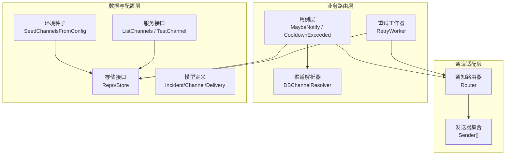
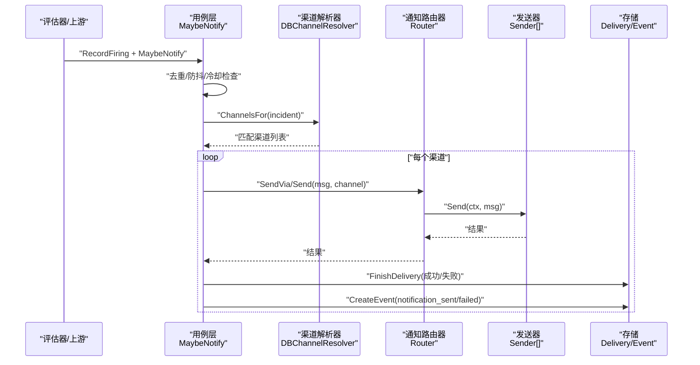
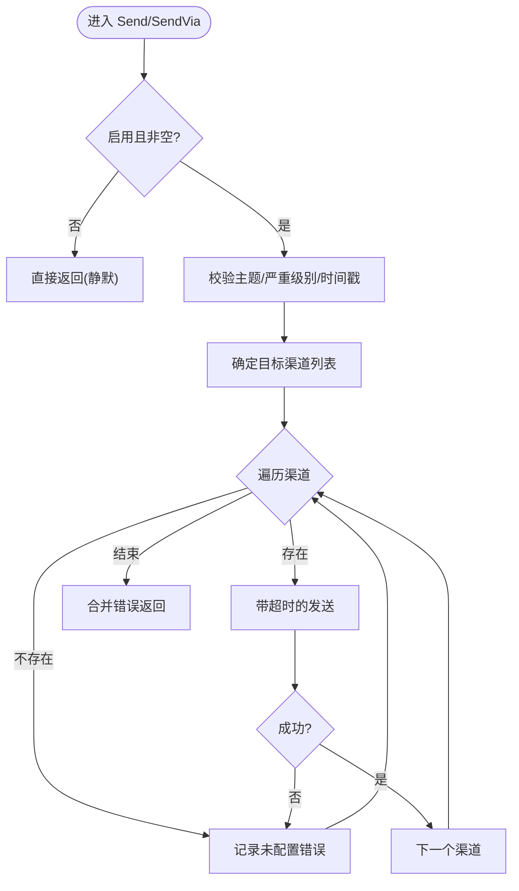
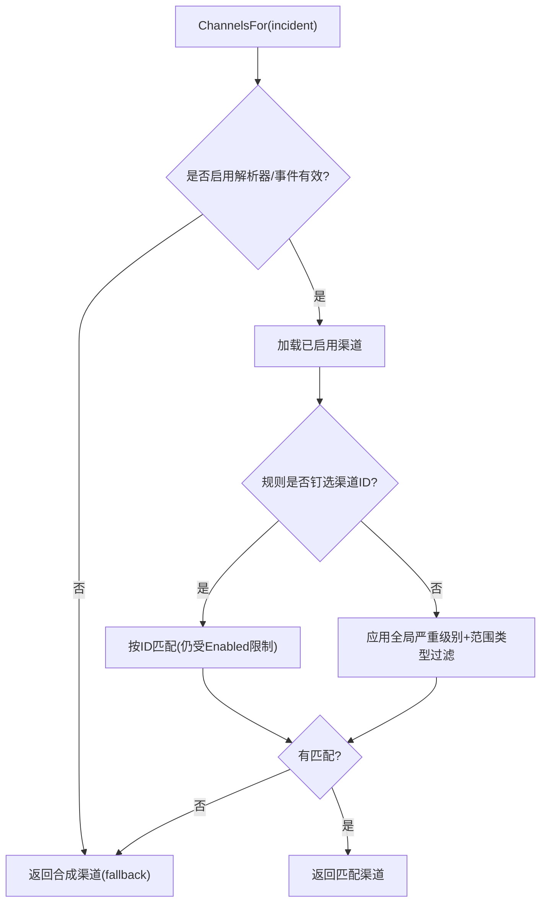
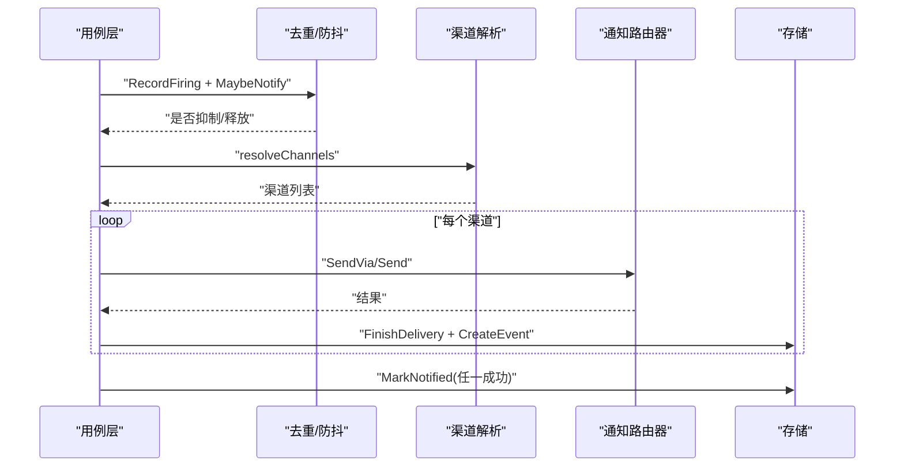
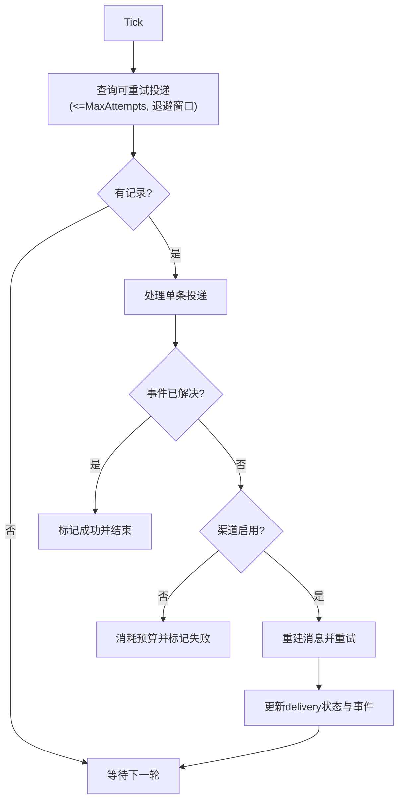
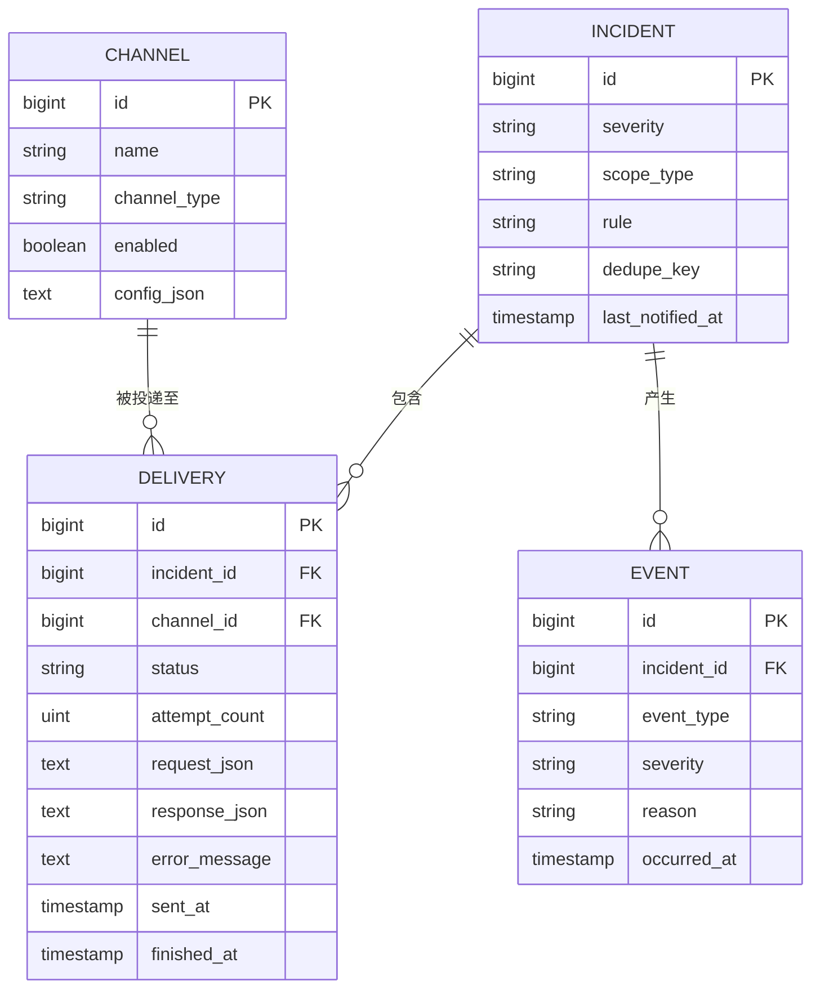
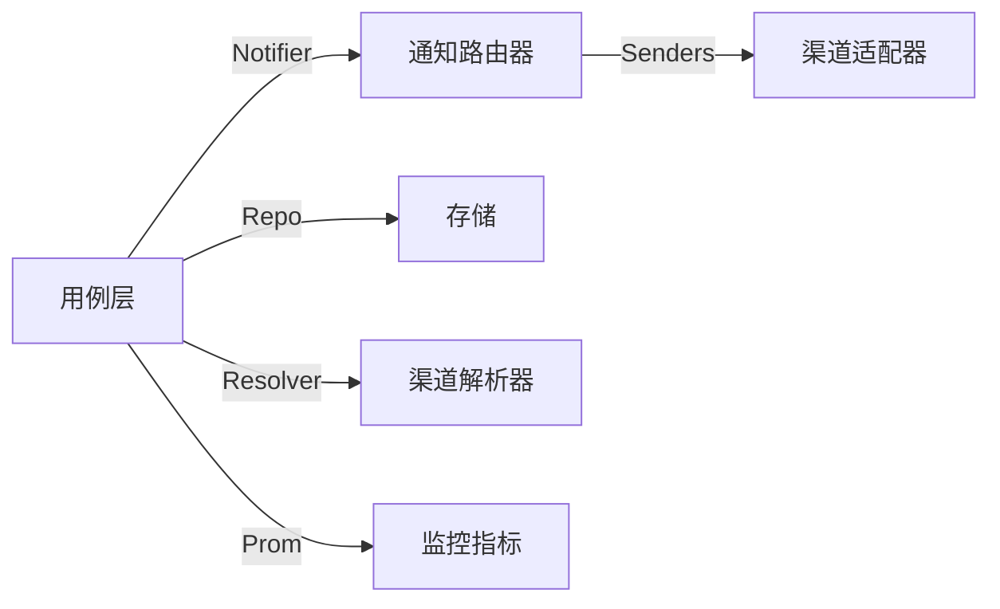

# 路由策略与优先级

<cite>
**本文引用的文件**
- [internal/pkg/notify/notify.go](file://internal/pkg/notify/notify.go)
- [internal/manager/biz/alert/router.go](file://internal/manager/biz/alert/router.go)
- [internal/manager/biz/alert/usecase.go](file://internal/manager/biz/alert/usecase.go)
- [internal/manager/biz/alert/retry.go](file://internal/manager/biz/alert/retry.go)
- [internal/manager/data/alert/store/types.go](file://internal/manager/data/alert/store/types.go)
- [internal/manager/model/alert/model.go](file://internal/manager/model/alert/model.go)
- [internal/manager/data/alert/store/seed.go](file://internal/manager/data/alert/store/seed.go)
- [internal/manager/service/alert/service.go](file://internal/manager/service/alert/service.go)
- [internal/pkg/prom/manager_metrics.go](file://internal/pkg/prom/manager_metrics.go)
- [web/src/pages/AlertRules.tsx](file://web/src/pages/AlertRules.tsx)
</cite>

## 目录
1. [简介](#简介)
2. [项目结构](#项目结构)
3. [核心组件](#核心组件)
4. [架构总览](#架构总览)
5. [详细组件分析](#详细组件分析)
6. [依赖关系分析](#依赖关系分析)
7. [性能考量](#性能考量)
8. [故障排查指南](#故障排查指南)
9. [结论](#结论)
10. [附录](#附录)

## 简介
本技术文档聚焦于通知路由策略与优先级，系统性地说明通知路由器、渠道选择、严重级别映射、规则匹配与过滤、去重与防抖、批量重试与投递追踪、配置最佳实践、监控指标与审计日志，以及复杂场景下的路由设计模式。目标是帮助读者在不深入源码的情况下，也能准确理解并正确配置告警通知的路由策略。

## 项目结构
通知路由涉及三层：
- 通道适配器层（pkg/notify）：提供统一的 Sender 接口与 Router，负责将消息发送到具体渠道（Webhook、Slack、飞书、钉钉等）。
- 业务路由层（biz/alert）：根据事件严重级别、范围类型、规则级“钉选”等条件，动态选择目标渠道；实现去重、防抖、冷却、重试与投递追踪。
- 数据与配置层（data/store、model、service）：持久化渠道、投递记录、事件与规则；从环境变量或 UI 管理渠道；暴露服务接口。

**图表来源**
- [internal/pkg/notify/notify.go:39-130](file://internal/pkg/notify/notify.go#L39-L130)
- [internal/manager/biz/alert/router.go:11-111](file://internal/manager/biz/alert/router.go#L11-L111)
- [internal/manager/biz/alert/usecase.go:1408-1484](file://internal/manager/biz/alert/usecase.go#L1408-L1484)
- [internal/manager/biz/alert/retry.go:75-108](file://internal/manager/biz/alert/retry.go#L75-L108)
- [internal/manager/data/alert/store/seed.go:13-68](file://internal/manager/data/alert/store/seed.go#L13-L68)

**章节来源**
- [internal/pkg/notify/notify.go:39-130](file://internal/pkg/notify/notify.go#L39-L130)
- [internal/manager/biz/alert/router.go:11-111](file://internal/manager/biz/alert/router.go#L11-L111)
- [internal/manager/biz/alert/usecase.go:1408-1484](file://internal/manager/biz/alert/usecase.go#L1408-L1484)
- [internal/manager/biz/alert/retry.go:75-108](file://internal/manager/biz/alert/retry.go#L75-L108)
- [internal/manager/data/alert/store/seed.go:13-68](file://internal/manager/data/alert/store/seed.go#L13-L68)

## 核心组件
- 通知路由器（Router）：统一入口，支持按名称选择多个渠道发送，具备超时控制、默认渠道、启用开关。
- 渠道解析器（DBChannelResolver）：基于数据库中的渠道行，结合事件的严重级别与范围类型进行匹配；支持规则级“钉选”覆盖。
- 用例层（Usecase）：协调去重、防抖、冷却、渠道解析、发送、投递记录与事件写入。
- 重试工作器（RetryWorker）：周期性扫描失败的投递记录，按线性退避重试，更新状态并记录事件。
- 存储与模型：渠道、投递、事件、规则等实体定义与查询接口。
- 服务与种子：对外提供渠道 CRUD 与测试能力；启动时将环境变量配置的渠道同步到数据库。

**章节来源**
- [internal/pkg/notify/notify.go:13-130](file://internal/pkg/notify/notify.go#L13-L130)
- [internal/manager/biz/alert/router.go:11-111](file://internal/manager/biz/alert/router.go#L11-L111)
- [internal/manager/biz/alert/usecase.go:1408-1484](file://internal/manager/biz/alert/usecase.go#L1408-L1484)
- [internal/manager/biz/alert/retry.go:14-108](file://internal/manager/biz/alert/retry.go#L14-L108)
- [internal/manager/model/alert/model.go:366-386](file://internal/manager/model/alert/model.go#L366-L386)
- [internal/manager/service/alert/service.go:397-430](file://internal/manager/service/alert/service.go#L397-L430)
- [internal/manager/data/alert/store/seed.go:13-68](file://internal/manager/data/alert/store/seed.go#L13-L68)

## 架构总览
通知路由的核心流程如下：
- 告警触发后，用例层先执行去重与防抖判断，再解析目标渠道。
- 对每个目标渠道，若为持久化渠道则构建对应 Sender，通过 Router.SendVia 发送；否则通过 Router.Send 按名称发送。
- 每次发送均记录投递行（成功/失败），并写入事件用于审计与监控。
- 失败投递由重试工作器按线性退避策略重试，直至成功或达到最大尝试次数。

**图表来源**
- [internal/manager/biz/alert/usecase.go:1408-1484](file://internal/manager/biz/alert/usecase.go#L1408-L1484)
- [internal/manager/biz/alert/router.go:65-111](file://internal/manager/biz/alert/router.go#L65-L111)
- [internal/pkg/notify/notify.go:92-156](file://internal/pkg/notify/notify.go#L92-L156)
- [internal/manager/model/alert/model.go:366-386](file://internal/manager/model/alert/model.go#L366-L386)

## 详细组件分析

### 通知路由器（Router）
- 功能要点
  - 支持多通道扇出，未指定渠道时回退到默认渠道。
  - 全局启用开关与超时控制，避免阻塞。
  - 提供 Send（按名称）与 SendVia（显式 Sender）两种路径，后者用于持久化渠道的动态构造。
- 关键行为
  - 空主题或缺失严重级别会填充默认值。
  - 未配置的目标渠道会收集错误并合并返回。
- 适用场景
  - 环境配置驱动的渠道（如 Webhook、Slack、飞书、钉钉）。
  - 作为持久化渠道的网关，统一超时与启用门控。

**图表来源**
- [internal/pkg/notify/notify.go:92-156](file://internal/pkg/notify/notify.go#L92-L156)

**章节来源**
- [internal/pkg/notify/notify.go:13-130](file://internal/pkg/notify/notify.go#L13-L130)

### 渠道解析器（DBChannelResolver）
- 匹配逻辑
  - 优先读取所有已启用渠道，按事件严重级别与范围类型过滤。
  - 支持规则级“钉选”：若规则指定了 notify_channel_ids_json，则仅匹配这些渠道 ID（仍受 Enabled 限制）。
  - 若无匹配，回退到合成渠道（fallback），保证通知不丢失。
- 严重级别映射
  - 严格有序：info < warning < critical。
  - 未知级别视为最低（info）。
- 范围类型匹配
  - 支持逗号分隔的范围类型列表匹配。

**图表来源**
- [internal/manager/biz/alert/router.go:65-111](file://internal/manager/biz/alert/router.go#L65-L111)
- [internal/manager/biz/alert/router.go:130-161](file://internal/manager/biz/alert/router.go#L130-L161)

**章节来源**
- [internal/manager/biz/alert/router.go:11-111](file://internal/manager/biz/alert/router.go#L11-L111)
- [internal/manager/biz/alert/router.go:130-161](file://internal/manager/biz/alert/router.go#L130-L161)

### 用例层（Usecase）：去重、防抖、冷却与发送
- 去重与防抖
  - 通过 RecordFiring 累计触发次数，结合 NotifyWindowSeconds 与 NotifyMinFires 控制是否在窗口内达到阈值才发送。
  - 抑制的触发会记录 repeat_suppressed 事件，便于审计。
- 冷却（Cooldown）
  - 基于 incident.LastNotifiedAt 与冷却时长判断是否允许再次通知。
- 渠道解析与发送
  - 使用 ChannelResolver 解析目标渠道；对持久化渠道构建 Sender 并通过 SendVia 发送；对合成渠道通过 Send 按名称发送。
  - 每条投递记录写入 delivery 表，并记录 notification_sent/failed 事件。
- 标记已通知
  - 任一渠道成功即标记 incident 已通知，避免重复通知。

**图表来源**
- [internal/manager/biz/alert/usecase.go:1408-1484](file://internal/manager/biz/alert/usecase.go#L1408-L1484)
- [internal/manager/biz/alert/usecase.go:1560-1582](file://internal/manager/biz/alert/usecase.go#L1560-L1582)

**章节来源**
- [internal/manager/biz/alert/usecase.go:1408-1484](file://internal/manager/biz/alert/usecase.go#L1408-L1484)
- [internal/manager/biz/alert/usecase.go:1560-1582](file://internal/manager/biz/alert/usecase.go#L1560-L1582)

### 重试工作器（RetryWorker）
- 策略
  - 周期扫描 failed 投递，按 attempt_count * backoffPerAttempt 线性退避。
  - 若事件已解决，直接标记投递成功；若渠道被禁用，消耗预算并停止重试。
  - 重建消息并调用 Notifier.Send 重试，更新 delivery 状态与事件。
- 参数
  - MaxAttempts：最大尝试次数（默认 5）。
  - BackoffPerAttempt：每次重试的最小间隔（默认 1 分钟）。
  - Tick：轮询频率（默认 30 秒）。

**图表来源**
- [internal/manager/biz/alert/retry.go:75-108](file://internal/manager/biz/alert/retry.go#L75-L108)
- [internal/manager/biz/alert/retry.go:110-200](file://internal/manager/biz/alert/retry.go#L110-L200)

**章节来源**
- [internal/manager/biz/alert/retry.go:14-108](file://internal/manager/biz/alert/retry.go#L14-L108)
- [internal/manager/biz/alert/retry.go:110-200](file://internal/manager/biz/alert/retry.go#L110-L200)

### 数据模型与存储
- 渠道（Channel）
  - 包含名称、类型、启用状态、配置 JSON（endpoint/url、secret 等）。
- 投递（Delivery）
  - 关联 incident 与 channel，记录状态、尝试次数、请求/响应、错误信息、时间戳。
- 事件（Event）
  - 记录 firing、repeat_suppressed、notification_sent/failed、inhibited 等，用于审计与监控。

**图表来源**
- [internal/manager/model/alert/model.go:366-386](file://internal/manager/model/alert/model.go#L366-L386)
- [internal/manager/data/alert/store/types.go:11-58](file://internal/manager/data/alert/store/types.go#L11-L58)

**章节来源**
- [internal/manager/model/alert/model.go:366-386](file://internal/manager/model/alert/model.go#L366-L386)
- [internal/manager/data/alert/store/types.go:11-58](file://internal/manager/data/alert/store/types.go#L11-L58)

### 配置与环境种子
- 环境变量驱动
  - 启动时将启用的 Webhook/Slack/Feishu/DingTalk 渠道 upsert 到数据库，保留历史投递关联。
  - 清理遗留的“log”类型渠道，避免无意义投递噪音。
- 服务接口
  - 提供 ListChannels、GetChannel、TestChannel 等能力，便于运维验证与排障。

**章节来源**
- [internal/manager/data/alert/store/seed.go:13-68](file://internal/manager/data/alert/store/seed.go#L13-L68)
- [internal/manager/service/alert/service.go:397-430](file://internal/manager/service/alert/service.go#L397-L430)

### 前端规则编辑与默认模式
- 默认模式
  - 勾选“默认”表示命中全部“已启用 + 严重级别达标”的渠道。
  - 未勾选任何渠道在自定义模式下等效默认（后端 fallback 仍会扇出），如需真正静默需禁用规则。
- 可视化提示
  - 当自定义模式未勾选任何渠道时，给出警告提示，避免误以为完全静默。

**章节来源**
- [web/src/pages/AlertRules.tsx:2062-2094](file://web/src/pages/AlertRules.tsx#L2062-L2094)
- [web/src/pages/AlertRules.tsx:2121-2141](file://web/src/pages/AlertRules.tsx#L2121-L2141)

## 依赖关系分析
- 松耦合设计
  - 用例层通过 Notifier 接口与 Router 解耦，便于测试与替换。
  - 渠道解析器通过 channelLister 接口隔离存储细节。
- 外部依赖
  - 通知适配器（Webhook/Slack/飞书/钉钉）通过 NewFromConfig 注册。
  - 监控指标通过 prom 包统一上报。

**图表来源**
- [internal/manager/biz/alert/usecase.go:21-31](file://internal/manager/biz/alert/usecase.go#L21-L31)
- [internal/pkg/notify/notify.go:67-90](file://internal/pkg/notify/notify.go#L67-L90)
- [internal/pkg/prom/manager_metrics.go:63-76](file://internal/pkg/prom/manager_metrics.go#L63-L76)

**章节来源**
- [internal/manager/biz/alert/usecase.go:21-31](file://internal/manager/biz/alert/usecase.go#L21-L31)
- [internal/pkg/notify/notify.go:67-90](file://internal/pkg/notify/notify.go#L67-L90)
- [internal/pkg/prom/manager_metrics.go:63-76](file://internal/pkg/prom/manager_metrics.go#L63-L76)

## 性能考量
- 超时与并发
  - 路由器为每次发送设置上下文超时，避免慢下游拖垮整体链路。
- 去重与防抖
  - 通过窗口与最小触发次数减少风暴；抑制事件记录用于观测。
- 重试与退避
  - 线性退避降低瞬时压力；最大尝试次数防止无限重试。
- 指标与采样
  - 事件计数、评估延迟、HTTP 请求等指标用于容量规划与瓶颈定位。
- 建议
  - 合理设置 NotifyWindowSeconds 与 NotifyMinFires，平衡及时性与稳定性。
  - 调整 BackoffPerAttempt 与 MaxAttempts 以匹配下游恢复速度。
  - 关注 alert_events_total 中 notification_failed 的增长趋势，及时治理不稳定渠道。

[本节为通用指导，不直接分析具体文件]

## 故障排查指南
- 常见问题
  - 渠道未配置：Router 会记录“channel not configured”错误；检查环境变量或 UI 渠道配置。
  - 渠道禁用：重试工作器会消耗预算并停止重试；确认渠道启用状态。
  - 事件已解决：重试工作器会直接标记投递成功，无需再次发送。
- 审计与监控
  - 查看 delivery 表获取每渠道投递结果与错误信息。
  - 通过 alert_events_total 观察 notification_sent/failed 与 repeat_suppressed 的趋势。
  - 使用服务接口 TestChannel 快速验证渠道连通性。

**章节来源**
- [internal/pkg/notify/notify.go:92-130](file://internal/pkg/notify/notify.go#L92-L130)
- [internal/manager/biz/alert/retry.go:110-200](file://internal/manager/biz/alert/retry.go#L110-L200)
- [internal/pkg/prom/manager_metrics.go:63-76](file://internal/pkg/prom/manager_metrics.go#L63-L76)
- [internal/manager/service/alert/service.go:397-430](file://internal/manager/service/alert/service.go#L397-L430)

## 结论
本系统通过分层设计与严格的匹配、去重、防抖与重试机制，实现了高可靠的通知路由。严重级别与渠道优先级的映射清晰可控，规则级“钉选”提供了灵活的多目标分发能力。配合完善的投递追踪与监控指标，可在复杂场景下稳定运行并易于排障。

[本节为总结，不直接分析具体文件]

## 附录

### 严重级别与渠道优先级映射
- 严重级别顺序：info < warning < critical。
- 渠道可通过 MatchSeverityMin 设置最低匹配级别；事件严重级别必须不低于该阈值才会命中。
- 未知级别视为 info，确保最保守的匹配。

**章节来源**
- [internal/manager/biz/alert/router.go:143-161](file://internal/manager/biz/alert/router.go#L143-L161)

### 路由规则定义与条件匹配
- 规则级“钉选”：通过规则的 notify_channel_ids_json 指定固定渠道 ID，优先级高于全局过滤。
- 全局过滤：按严重级别与范围类型筛选已启用渠道。
- 回退机制：若无匹配，使用 fallback 合成渠道，保证通知不丢失。

**章节来源**
- [internal/manager/biz/alert/router.go:65-111](file://internal/manager/biz/alert/router.go#L65-L111)
- [internal/manager/biz/alert/router.go:113-128](file://internal/manager/biz/alert/router.go#L113-L128)

### 通知去重、防抖与批量优化
- 去重：基于 dedupe_key 识别同一事件，避免重复投递。
- 防抖：在 NotifyWindowSeconds 窗口内，至少 NotifyMinFires 次触发才发送；抑制记录 repeat_suppressed。
- 批量：重试工作器批量拉取可重试投递（上限 200），降低数据库压力。

**章节来源**
- [internal/manager/biz/alert/retry.go:98-108](file://internal/manager/biz/alert/retry.go#L98-L108)

### 路由配置最佳实践
- 明确渠道最低严重级别，避免低级别噪声。
- 使用规则级“钉选”针对关键告警定向通知。
- 合理设置窗口与最小触发次数，平衡及时性与稳定性。
- 定期通过 TestChannel 验证渠道可用性。

**章节来源**
- [web/src/pages/AlertRules.tsx:2062-2094](file://web/src/pages/AlertRules.tsx#L2062-L2094)
- [internal/manager/service/alert/service.go:397-430](file://internal/manager/service/alert/service.go#L397-L430)

### 监控指标与审计日志
- 指标
  - alert_events_total：统计各类事件（含 notification_sent/failed、repeat_suppressed）。
  - ongrid_alert_eval_ticks_total：评估器迭代统计，辅助发现异常。
- 审计
  - delivery 表：记录每渠道投递结果、错误信息与时间戳。
  - event 表：记录事件生命周期与原因，便于回溯。

**章节来源**
- [internal/pkg/prom/manager_metrics.go:63-76](file://internal/pkg/prom/manager_metrics.go#L63-L76)
- [internal/manager/model/alert/model.go:366-386](file://internal/manager/model/alert/model.go#L366-L386)

### 复杂场景下的路由策略设计模式
- 多目标分发：通过规则级“钉选”将同一告警同时发送至多个团队渠道。
- 分级路由：不同严重级别匹配不同渠道，critical 直达电话/短信，warning 走 IM，info 走日志。
- 降级与回退：当数据库渠道不可用或为空，自动回退到环境变量默认渠道，保障基本可达性。
- 风暴抑制：在高并发告警场景下，通过窗口与最小触发次数抑制风暴，避免渠道过载。

[本节为概念性内容，不直接分析具体文件]