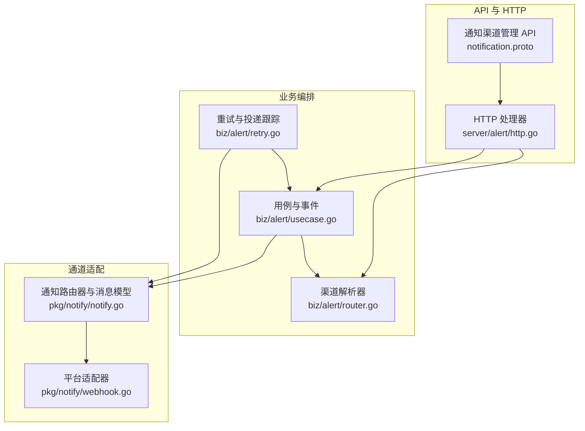
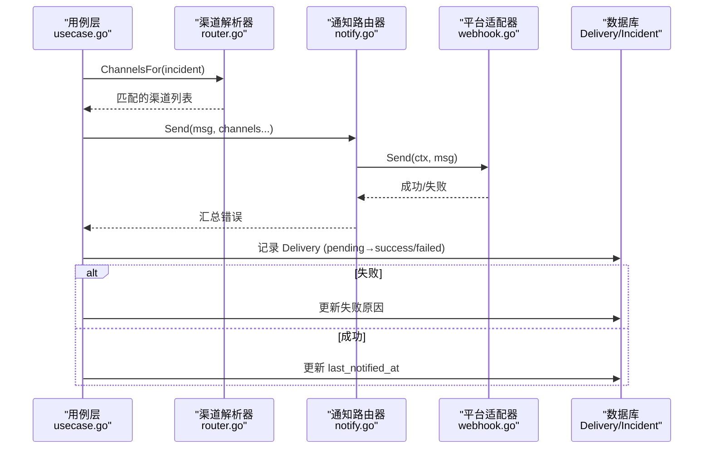
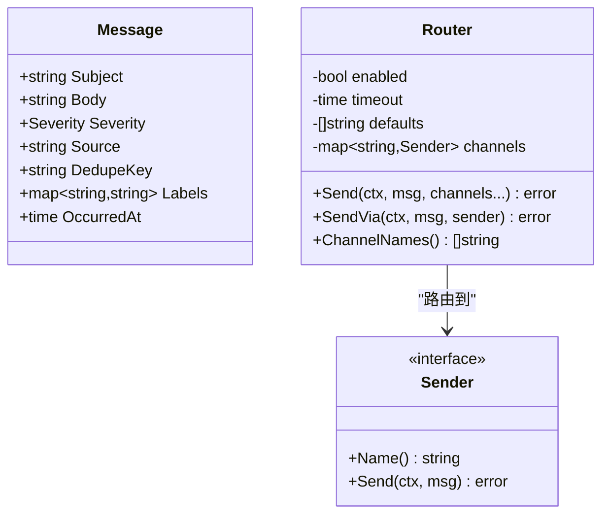
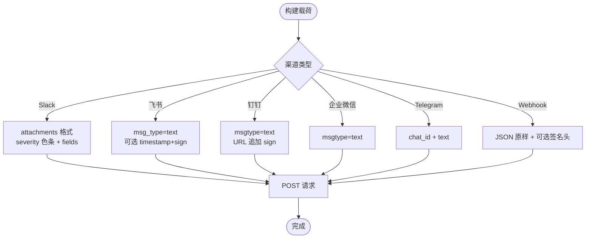
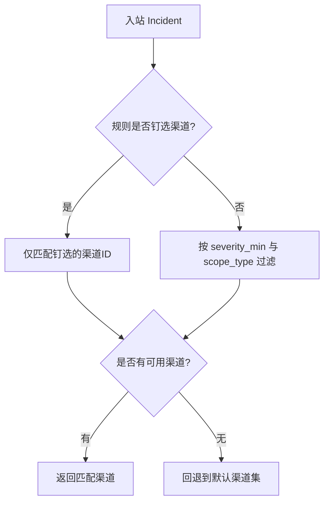
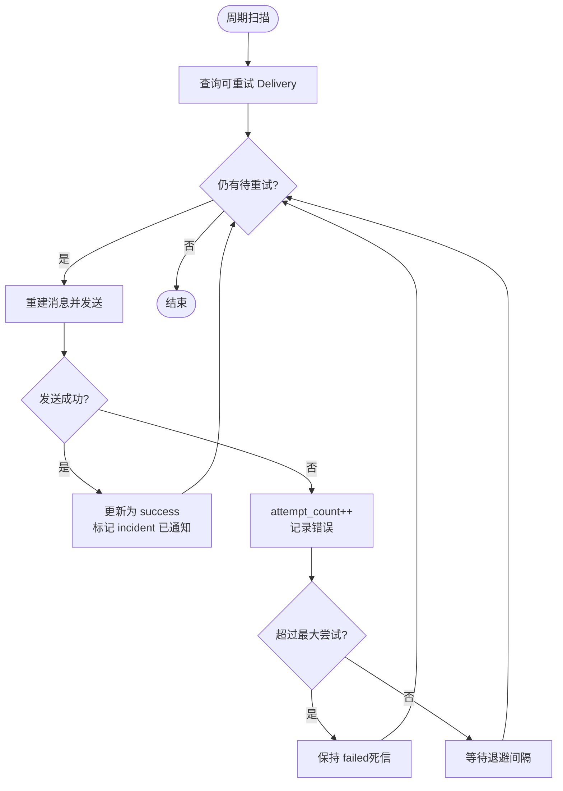
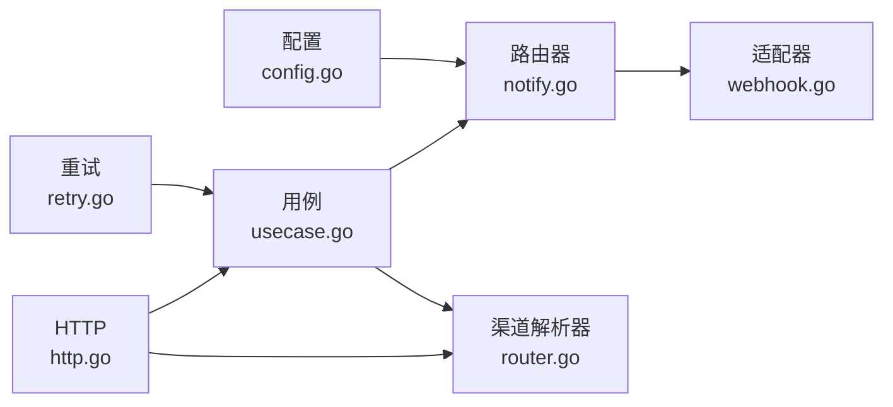

# 通知分发系统

<cite>
**本文引用的文件**
- [notification.proto](file://api/manager/notification/v1/notification.proto)
- [notify.go](file://internal/pkg/notify/notify.go)
- [webhook.go](file://internal/pkg/notify/webhook.go)
- [config.go](file://internal/pkg/config/config.go)
- [model.go](file://internal/manager/model/alert/model.go)
- [router.go](file://internal/manager/biz/alert/router.go)
- [retry.go](file://internal/manager/biz/alert/retry.go)
- [usecase.go](file://internal/manager/biz/alert/usecase.go)
- [http.go](file://internal/manager/server/alert/http.go)
- [Notifications.tsx](file://web/src/pages/settings/Notifications.tsx)
- [send_im_message_basetool.go](file://internal/manager/biz/aiops/tools/send_im_message_basetool.go)
- [notify_signed_test.go](file://tests/e2e/notify_signed_test.go)
</cite>

## 目录
1. [简介](#简介)
2. [项目结构](#项目结构)
3. [核心组件](#核心组件)
4. [架构总览](#架构总览)
5. [详细组件分析](#详细组件分析)
6. [依赖关系分析](#依赖关系分析)
7. [性能与可靠性](#性能与可靠性)
8. [故障排查指南](#故障排查指南)
9. [结论](#结论)
10. [附录](#附录)

## 简介
本技术文档面向“通知分发系统”，覆盖多渠道（Slack、Telegram、飞书、钉钉、企业微信、通用 Webhook）的集成实现，说明通知路由策略、优先级排序与升级机制，解释模板与富文本格式，详述重试、失败处理与死信队列管理，并提供渠道配置与认证方法、审计监控调试工具使用指南，帮助构建可靠的通知管道，确保重要告警及时送达。

## 项目结构
通知能力由三层构成：
- 协议与接口层：定义通知渠道管理的 API 契约（gRPC/HTTP）。
- 业务编排层：负责渠道解析、规则匹配、发送编排、重试与事件记录。
- 通道适配层：将统一消息模型转换为各平台特定载荷并签名发送。

**图表来源**
- [notification.proto:10-17](file://api/manager/notification/v1/notification.proto#L10-L17)
- [http.go:154-181](file://internal/manager/server/alert/http.go#L154-L181)
- [router.go:11-47](file://internal/manager/biz/alert/router.go#L11-L47)
- [usecase.go:21-31](file://internal/manager/biz/alert/usecase.go#L21-L31)
- [retry.go:14-43](file://internal/manager/biz/alert/retry.go#L14-L43)
- [notify.go:22-45](file://internal/pkg/notify/notify.go#L22-L45)
- [webhook.go:18-45](file://internal/pkg/notify/webhook.go#L18-L45)

**章节来源**
- [notification.proto:10-17](file://api/manager/notification/v1/notification.proto#L10-L17)
- [http.go:154-181](file://internal/manager/server/alert/http.go#L154-L181)
- [router.go:11-47](file://internal/manager/biz/alert/router.go#L11-L47)
- [usecase.go:21-31](file://internal/manager/biz/alert/usecase.go#L21-L31)
- [retry.go:14-43](file://internal/manager/biz/alert/retry.go#L14-L43)
- [notify.go:22-45](file://internal/pkg/notify/notify.go#L22-L45)
- [webhook.go:18-45](file://internal/pkg/notify/webhook.go#L18-L45)

## 核心组件
- 统一消息模型与路由器：定义 Severity、Message、Sender 接口与 Router，提供 Send/SendVia、超时控制、默认渠道与开关门控。
- 渠道适配器：为 Slack、飞书、钉钉、企业微信、Telegram、通用 Webhook 提供载荷格式化与签名。
- 渠道解析器：基于数据库中的 Channel 行，按严重级别与范围过滤，支持规则级“钉选”到指定渠道。
- 重试与投递跟踪：持久化 Delivery 行，周期性重试，线性退避，最终进入失败状态；成功时标记 incident 已通知。
- 配置与前端：环境变量驱动全局开关、默认渠道、超时；Web 设置页提供渠道创建、测试与管理。

**章节来源**
- [notify.go:22-45](file://internal/pkg/notify/notify.go#L22-L45)
- [notify.go:67-90](file://internal/pkg/notify/notify.go#L67-L90)
- [webhook.go:27-45](file://internal/pkg/notify/webhook.go#L27-L45)
- [router.go:31-111](file://internal/manager/biz/alert/router.go#L31-L111)
- [retry.go:30-96](file://internal/manager/biz/alert/retry.go#L30-L96)
- [config.go:177-212](file://internal/pkg/config/config.go#L177-L212)
- [Notifications.tsx:30-37](file://web/src/pages/settings/Notifications.tsx#L30-L37)

## 架构总览
通知从“告警触发”到“平台送达”的关键路径如下：
- 触发后写入 Incident，并产生事件。
- 通过渠道解析器选择目标渠道（支持规则级钉选与全局严重级别/范围过滤）。
- 构造 notify.Message，调用 Router.Send 或 SendVia（对 DB 存储的渠道）。
- 适配器将 Message 转为平台载荷并签名发送。
- 投递结果写入 Delivery 表，失败进入重试循环，成功则更新 incident 通知时间。

**图表来源**
- [usecase.go:547-607](file://internal/manager/biz/alert/usecase.go#L547-L607)
- [router.go:65-111](file://internal/manager/biz/alert/router.go#L65-L111)
- [notify.go:92-130](file://internal/pkg/notify/notify.go#L92-L130)
- [webhook.go:220-258](file://internal/pkg/notify/webhook.go#L220-L258)

## 详细组件分析

### 通知消息与路由器
- 消息模型：包含主题、正文、严重级别、来源、去重键、标签与发生时间。
- 路由器：集中管理启用开关、超时、默认渠道；Send 会校验必填字段、补齐默认值、按名称查找 Sender 并发出；SendVia 用于按行构建的 Sender。
- 配置加载：NewFromConfig 根据环境配置构建 senders 并返回 Router。

**图表来源**
- [notify.go:22-45](file://internal/pkg/notify/notify.go#L22-L45)
- [notify.go:92-169](file://internal/pkg/notify/notify.go#L92-L169)

**章节来源**
- [notify.go:22-45](file://internal/pkg/notify/notify.go#L22-L45)
- [notify.go:67-90](file://internal/pkg/notify/notify.go#L67-L90)
- [notify.go:92-169](file://internal/pkg/notify/notify.go#L92-L169)

### 多渠道适配器与富文本
- Slack：attachments 格式，带颜色条与结构化字段；忽略 secret（凭据在 URL）。
- 飞书：text 类型，可选 timestamp+sign 签名（HMAC-SHA256 base64）。
- 钉钉：text 类型，URL 追加 timestamp+sign 查询参数。
- 企业微信：与钉钉相同 JSON 形状，无额外签名。
- Telegram：sendMessage，chat_id 在 body，token 在 URL。
- 通用 Webhook：发送原始 Message JSON，可选 HMAC 签名头。

**图表来源**
- [webhook.go:35-45](file://internal/pkg/notify/webhook.go#L35-L45)
- [webhook.go:141-192](file://internal/pkg/notify/webhook.go#L141-L192)
- [webhook.go:274-313](file://internal/pkg/notify/webhook.go#L274-L313)

**章节来源**
- [webhook.go:35-45](file://internal/pkg/notify/webhook.go#L35-L45)
- [webhook.go:141-192](file://internal/pkg/notify/webhook.go#L141-L192)
- [webhook.go:220-258](file://internal/pkg/notify/webhook.go#L220-L258)
- [webhook.go:274-313](file://internal/pkg/notify/webhook.go#L274-L313)

### 通知路由策略、优先级与升级
- 渠道匹配：按严重级别下限与 scope_type 白名单过滤。
- 规则级钉选：若规则指定了 notify_channel_ids，则仅这些渠道接收（仍受 channel.enabled 保护）。
- 降级与兜底：若无匹配渠道，回退到环境变量配置的默认渠道集合。
- 严重级别顺序：info < warning < critical。

**图表来源**
- [router.go:65-111](file://internal/manager/biz/alert/router.go#L65-L111)
- [router.go:130-161](file://internal/manager/biz/alert/router.go#L130-L161)

**章节来源**
- [router.go:65-111](file://internal/manager/biz/alert/router.go#L65-L111)
- [router.go:130-161](file://internal/manager/biz/alert/router.go#L130-L161)

### 模板系统与消息格式化
- 统一模板：Message 作为标准化输入，各适配器将其渲染为平台友好格式。
- 富文本/结构化：Slack attachments 展示 severity/source/rule/incident/device/dedupe key；其他 IM 以纯文本分段呈现。
- 可观测性：labels 中保留关键维度，便于下游聚合与报表。

**章节来源**
- [webhook.go:56-115](file://internal/pkg/notify/webhook.go#L56-L115)
- [webhook.go:260-272](file://internal/pkg/notify/webhook.go#L260-L272)

### 重试机制、失败处理与死信队列
- 投递跟踪：每次尝试插入 pending 状态的 Delivery 行，完成后更新为 success/failed，并记录错误信息、请求/响应快照。
- 重试策略：线性退避，最小间隔 = attempt_count × backoff_per_attempt；最大尝试次数可配。
- 死信与终结：达到最大尝试或渠道被禁用等不可恢复错误时，保持 failed 状态，不再重试。
- 指标与审计：成功/失败均写入 alert_events，并通过 Prometheus 计数器上报。

**图表来源**
- [retry.go:75-108](file://internal/manager/biz/alert/retry.go#L75-L108)
- [retry.go:110-201](file://internal/manager/biz/alert/retry.go#L110-L201)

**章节来源**
- [retry.go:14-43](file://internal/manager/biz/alert/retry.go#L14-L43)
- [retry.go:75-108](file://internal/manager/biz/alert/retry.go#L75-L108)
- [retry.go:110-201](file://internal/manager/biz/alert/retry.go#L110-L201)

### 渠道配置与认证
- 环境变量：全局开关、默认渠道、超时；各渠道 enable/name/url/secret。
- 数据库渠道：通过 API 创建/更新/删除/测试；channel.config_json 存储 endpoint/secret/chat_id 等。
- 认证方式：
  - Slack：URL 即凭据，无需 secret。
  - 飞书：可选 timestamp+sign（HMAC-SHA256 base64）。
  - 钉钉：URL 追加 timestamp+sign。
  - 企业微信：URL 携带密钥查询参数。
  - Telegram：bot token 在 URL，chat_id 在 body。
  - 通用 Webhook：可选 X-Ongrid-Signature 头部。

**章节来源**
- [config.go:177-212](file://internal/pkg/config/config.go#L177-L212)
- [config.go:509-534](file://internal/pkg/config/config.go#L509-L534)
- [http.go:592-699](file://internal/manager/server/alert/http.go#L592-L699)
- [usecase.go:1520-1549](file://internal/manager/biz/alert/usecase.go#L1520-L1549)
- [webhook.go:274-313](file://internal/pkg/notify/webhook.go#L274-L313)
- [notify_signed_test.go:3-16](file://tests/e2e/notify_signed_test.go#L3-L16)

### 通知审计、监控与调试
- 审计事件：所有通知尝试（首次与重试）写入 alert_events，区分 notification_sent / notification_failed。
- 指标：alert_events_total 按事件类型、严重级别、规则键计数，可用于告警风暴检测。
- 调试：
  - 设置页“测试渠道”端点验证连通性与签名。
  - 查看“告警事件”页面追踪投递历史。
  - e2e 测试覆盖飞书/钉钉签名行为，便于回归验证。

**章节来源**
- [usecase.go:121-139](file://internal/manager/biz/alert/usecase.go#L121-L139)
- [usecase.go:547-607](file://internal/manager/biz/alert/usecase.go#L547-L607)
- [retry.go:177-201](file://internal/manager/biz/alert/retry.go#L177-L201)
- [http.go:683-699](file://internal/manager/server/alert/http.go#L683-L699)
- [notify_signed_test.go:38-57](file://tests/e2e/notify_signed_test.go#L38-L57)

### 与 AI 助手/IM 桥的联动
- 助手工具：SendNotificationTool 允许通过已配置的通知渠道主动推送消息（非双向会话）。
- IM 桥：IMMessageSender 面向双向 IM 会话（如飞书 open_chat_id、Telegram chat_id、Slack channel ID），与通知渠道解耦。

**章节来源**
- [send_im_message_basetool.go:38-68](file://internal/manager/biz/aiops/tools/send_im_message_basetool.go#L38-L68)

## 依赖关系分析
- 配置 → 路由器：NewFromConfig 读取 NotificationConfig，实例化各 Sender 并注入 Router。
- 业务 → 适配器：UseCase 通过 Notifier 接口调用 Router；DB 渠道通过 BuildSenderFromChannel 动态构建 Sender。
- 重试 → 业务：RetryWorker 依赖 Repo/Notifier/Resolver/Usecase 完成投递闭环。
- HTTP 层 → 服务：HTTP Handler 暴露渠道 CRUD 与测试端点，委托 Service 层。

**图表来源**
- [config.go:177-212](file://internal/pkg/config/config.go#L177-L212)
- [notify.go:67-90](file://internal/pkg/notify/notify.go#L67-L90)
- [usecase.go:21-31](file://internal/manager/biz/alert/usecase.go#L21-L31)
- [router.go:31-47](file://internal/manager/biz/alert/router.go#L31-L47)
- [retry.go:14-43](file://internal/manager/biz/alert/retry.go#L14-L43)
- [http.go:154-181](file://internal/manager/server/alert/http.go#L154-L181)

**章节来源**
- [config.go:177-212](file://internal/pkg/config/config.go#L177-L212)
- [notify.go:67-90](file://internal/pkg/notify/notify.go#L67-L90)
- [usecase.go:21-31](file://internal/manager/biz/alert/usecase.go#L21-L31)
- [router.go:31-47](file://internal/manager/biz/alert/router.go#L31-L47)
- [retry.go:14-43](file://internal/manager/biz/alert/retry.go#L14-L43)
- [http.go:154-181](file://internal/manager/server/alert/http.go#L154-L181)

## 性能与可靠性
- 超时控制：Router 为每个渠道发送设置超时，避免长尾阻塞。
- 退避重试：线性退避降低瞬时压力，避免雪崩。
- 开关门控：全局 Enabled 与渠道 Enabled 双重门控，便于灰度与紧急关停。
- 幂等与去重：Message.DedupeKey 与 Incident 去重键保障重复告警不重复通知。
- 可观测性：事件与指标完整记录，便于容量规划与问题定位。

[本节为通用指导，不直接分析具体文件]

## 故障排查指南
- 渠道未生效：检查渠道 Enabled、严重级别/范围过滤、规则级钉选是否正确；确认默认渠道是否配置。
- 签名失败：核对飞书/钉钉 secret 与时间戳生成逻辑；使用“测试渠道”端点验证。
- 频繁失败：查看 Delivery 错误信息与 retry 日志；确认网络可达性与平台限流。
- 未收到通知：确认 Router.Enabled、DefaultChannels、渠道名称匹配；检查 incident 是否处于 silenced 或抑制状态。
- 审计与指标：在“告警事件”页面查看 delivery 历史；通过 alert_events_total 指标观察失败趋势。

**章节来源**
- [router.go:65-111](file://internal/manager/biz/alert/router.go#L65-L111)
- [webhook.go:274-313](file://internal/pkg/notify/webhook.go#L274-L313)
- [retry.go:110-201](file://internal/manager/biz/alert/retry.go#L110-L201)
- [http.go:683-699](file://internal/manager/server/alert/http.go#L683-L699)
- [usecase.go:547-607](file://internal/manager/biz/alert/usecase.go#L547-L607)

## 结论
该通知分发系统通过统一消息模型、可扩展的渠道适配器、灵活的渠道解析与严格的投递跟踪，实现了多渠道、高可靠的告警触达。结合规则级钉选、严重级别过滤、线性退避重试与完善的审计指标，能够确保重要告警及时、可追溯地送达目标平台。

## 附录

### API 概览（通知渠道）
- ListChannels / GetChannel / CreateChannel / UpdateChannel / DeleteChannel / TestChannel
- 通道类型常量：webhook、slack、feishu、dingtalk（proto 中定义）
- 前端支持类型：webhook、slack、feishu、dingtalk、wecom、telegram

**章节来源**
- [notification.proto:10-91](file://api/manager/notification/v1/notification.proto#L10-L91)
- [Notifications.tsx:30-37](file://web/src/pages/settings/Notifications.tsx#L30-L37)

### 配置项速查
- 全局：ONGRID_NOTIFY_ENABLED、ONGRID_NOTIFY_DEFAULT_CHANNELS、ONGRID_NOTIFY_TIMEOUT
- 渠道：各渠道的 ENABLED/NAME/URL/SECRET 环境变量
- 运行时：评估间隔与冷却期由 AlertConfig 控制

**章节来源**
- [config.go:177-212](file://internal/pkg/config/config.go#L177-L212)
- [config.go:509-534](file://internal/pkg/config/config.go#L509-L534)