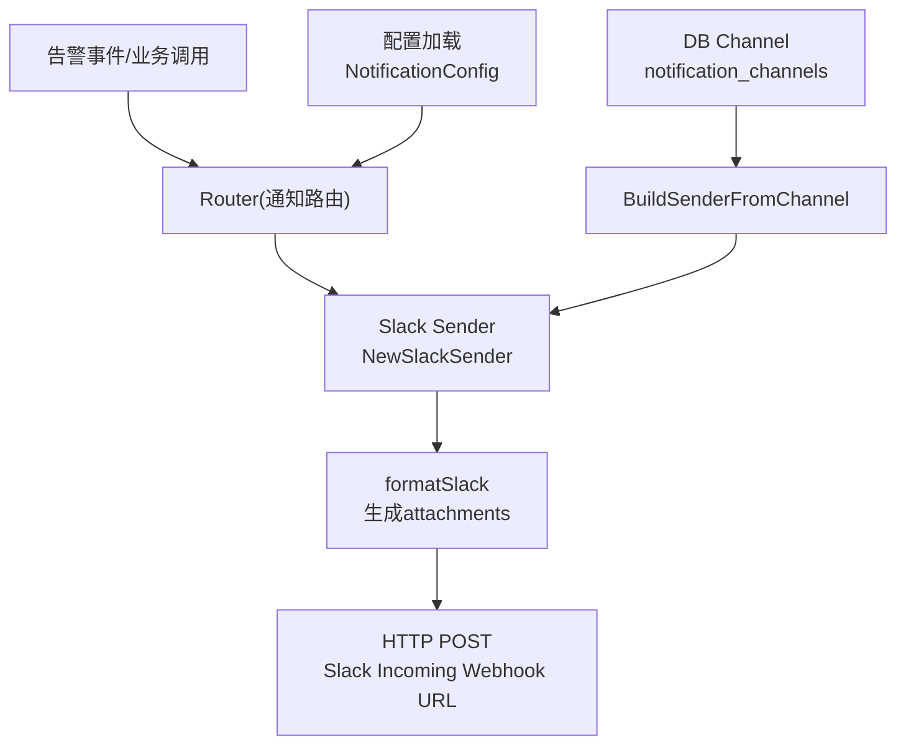
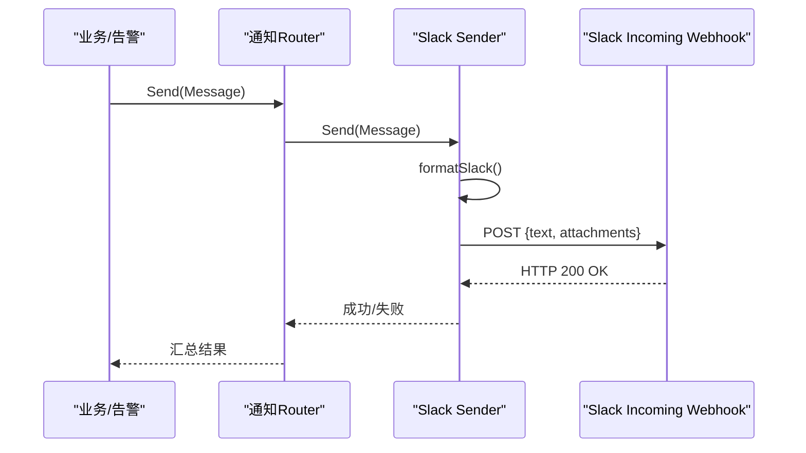
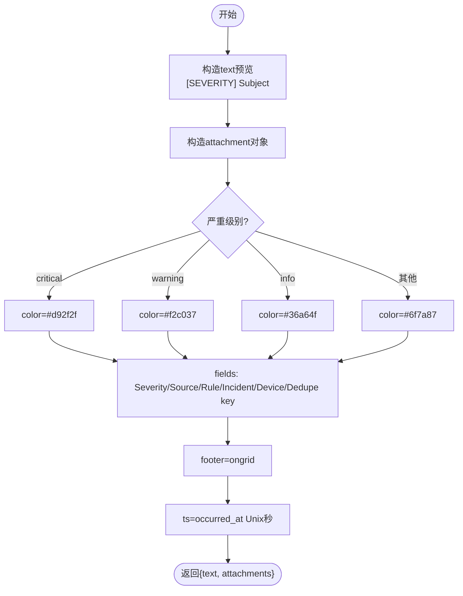
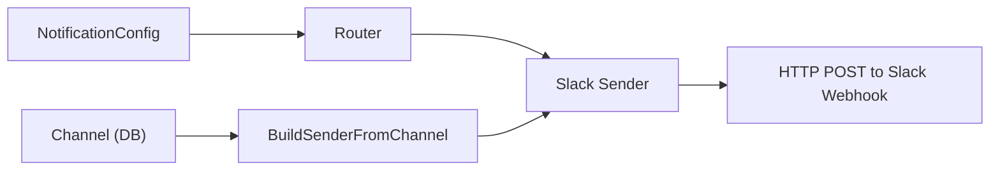

# Slack渠道集成

<cite>
**本文引用的文件**
- [webhook.go](file://internal/pkg/notify/webhook.go)
- [notify.go](file://internal/pkg/notify/notify.go)
- [config.go](file://internal/pkg/config/config.go)
- [model.go](file://internal/manager/model/alert/model.go)
- [seed.go](file://internal/manager/data/alert/store/seed.go)
- [usecase.go](file://internal/manager/biz/alert/usecase.go)
- [Notifications.tsx](file://web/src/pages/settings/Notifications.tsx)
- [notify_slack_test.go](file://tests/e2e/notify_slack_test.go)
- [notify_test.go](file://internal/pkg/notify/notify_test.go)
</cite>

## 目录
1. [简介](#简介)
2. [项目结构](#项目结构)
3. [核心组件](#核心组件)
4. [架构总览](#架构总览)
5. [详细组件分析](#详细组件分析)
6. [依赖关系分析](#依赖关系分析)
7. [性能与可靠性](#性能与可靠性)
8. [故障排查指南](#故障排查指南)
9. [结论](#结论)
10. [附录：配置与使用示例](#附录配置与使用示例)

## 简介
本技术文档聚焦于Slack渠道集成，覆盖Incoming Webhook的认证机制、消息格式要求、attachments富文本结构、严重级别到颜色的映射、工作区与权限配置、端到端使用示例以及常见问题排查。内容基于代码库中的通知子系统实现与测试用例进行说明，确保可操作且可验证。

## 项目结构
Slack渠道集成涉及以下关键模块：
- 通知发送器与消息格式化：internal/pkg/notify
- 运行时配置加载：internal/pkg/config
- 告警通道模型与持久化：internal/manager/model/alert, internal/manager/data/alert/store
- 从数据库通道构建发送器：internal/manager/biz/alert/usecase.go
- 前端设置页提示：web/src/pages/settings/Notifications.tsx
- 端到端与单元测试：tests/e2e/notify_slack_test.go, internal/pkg/notify/notify_test.go

图表来源
- [notify.go:75-90](file://internal/pkg/notify/notify.go#L75-L90)
- [webhook.go:41-45](file://internal/pkg/notify/webhook.go#L41-L45)
- [usecase.go:1528-1543](file://internal/manager/biz/alert/usecase.go#L1528-L1543)
- [config.go:177-212](file://internal/pkg/config/config.go#L177-L212)

章节来源
- [notify.go:75-90](file://internal/pkg/notify/notify.go#L75-L90)
- [webhook.go:41-45](file://internal/pkg/notify/webhook.go#L41-L45)
- [config.go:177-212](file://internal/pkg/config/config.go#L177-L212)
- [usecase.go:1528-1543](file://internal/manager/biz/alert/usecase.go#L1528-L1543)

## 核心组件
- 通知消息模型Message：包含主题、正文、严重级别、来源、去重键、标签、发生时间等字段，作为所有渠道的统一输入。
- 发送器接口Sender：统一Send方法，具体实现包括Slack、Webhook、飞书、钉钉、企业微信、Telegram等。
- Slack发送器NewSlackSender：将Message格式化为Slack attachments payload并POST到Incoming Webhook URL。
- 颜色映射slackColor：将严重级别映射为Slack附件左侧色条颜色（Critical红色、Warning黄色、Info绿色）。
- 配置加载NotificationConfig：通过环境变量启用/配置Slack渠道（名称、URL、是否启用）。
- 通道模型Channel：持久化的通知通道，包含类型、配置JSON、最小匹配严重级别等。
- 从DB通道构建发送器BuildSenderFromChannel：根据ChannelType和ConfigJSON构造对应Sender。

章节来源
- [notify.go:13-37](file://internal/pkg/notify/notify.go#L13-L37)
- [webhook.go:41-45](file://internal/pkg/notify/webhook.go#L41-L45)
- [webhook.go:117-132](file://internal/pkg/notify/webhook.go#L117-L132)
- [config.go:177-212](file://internal/pkg/config/config.go#L177-L212)
- [model.go:347-364](file://internal/manager/model/alert/model.go#L347-L364)
- [usecase.go:1528-1543](file://internal/manager/biz/alert/usecase.go#L1528-L1543)

## 架构总览
Slack渠道集成的数据流如下：
- 业务侧触发告警或通知，构造统一的Message。
- Router根据默认或指定通道名选择发送器；若来自DB通道，则先由BuildSenderFromChannel解析为具体Sender。
- Slack发送器将Message转换为attachments格式的payload，并通过HTTP POST发送到Slack Incoming Webhook URL。
- Slack服务端渲染消息卡片，显示严重级别对应的色条、标题、字段、时间戳与页脚。

图表来源
- [notify.go:92-130](file://internal/pkg/notify/notify.go#L92-L130)
- [webhook.go:220-258](file://internal/pkg/notify/webhook.go#L220-L258)

## 详细组件分析

### Slack消息格式与attachments结构
- 顶层字段：
  - text：用于推送、侧边栏、邮件摘要等场景的纯文本预览，内容为“[严重级别] 主题”。
  - attachments：数组，包含一个附件对象，承载富文本展示。
- 附件对象关键字段：
  - color：左侧色条颜色，依据严重级别映射。
  - fallback：当客户端不支持富格式时的降级文本，通常等于text。
  - title：卡片标题，优先使用主题，否则回退到严重级别。
  - text：可选正文，支持mrkdwn富文本（通过mrkdwn_in声明）。
  - fields：结构化字段列表，包含Severity、Source、Rule、Incident、Device、Dedupe key等。
  - footer：固定为“ongrid”。
  - ts：Unix时间戳，来源于消息的发生时间。

图表来源
- [webhook.go:56-115](file://internal/pkg/notify/webhook.go#L56-L115)
- [webhook.go:117-132](file://internal/pkg/notify/webhook.go#L117-L132)

章节来源
- [webhook.go:56-115](file://internal/pkg/notify/webhook.go#L56-L115)
- [webhook.go:117-132](file://internal/pkg/notify/webhook.go#L117-L132)
- [notify_test.go:129-193](file://internal/pkg/notify/notify_test.go#L129-L193)

### 严重级别到颜色的映射
- Critical → #d92f2f（红色）
- Warning → #f2c037（黄色）
- Info → #36a64f（绿色）
- 未知级别 → #6f7a87（中性灰），保证色条始终渲染

章节来源
- [webhook.go:117-132](file://internal/pkg/notify/webhook.go#L117-L132)
- [notify_test.go:195-212](file://internal/pkg/notify/notify_test.go#L195-L212)

### 认证机制与权限
- Incoming Webhook认证：仅依赖URL本身作为凭证，无需额外secret或签名。系统在为Slack通道创建发送器时不会传递secret。
- 权限要求：在Slack工作区中创建Incoming Webhook并授予写入目标频道/用户的权限，然后将生成的Webhook URL配置到系统中。

章节来源
- [webhook.go:35-45](file://internal/pkg/notify/webhook.go#L35-L45)
- [usecase.go:1528-1543](file://internal/manager/biz/alert/usecase.go#L1528-L1543)

### 配置方式与环境变量
- 通过NotificationConfig启用Slack渠道：
  - 启用开关：ONGRID_NOTIFY_SLACK_ENABLED
  - 通道名称：ONGRID_NOTIFY_SLACK_NAME
  - Webhook URL：ONGRID_NOTIFY_SLACK_WEBHOOK_URL
- 全局通知开关与超时：
  - ONGRID_NOTIFY_ENABLED：总开关
  - ONGRID_NOTIFY_TIMEOUT：单通道发送超时
- 默认通道列表：
  - ONGRID_NOTIFY_DEFAULT_CHANNELS：逗号分隔的通道名列表

章节来源
- [config.go:177-212](file://internal/pkg/config/config.go#L177-L212)
- [config.go:509-534](file://internal/pkg/config/config.go#L509-L534)
- [notify.go:75-90](file://internal/pkg/notify/notify.go#L75-L90)

### 从数据库通道构建发送器
- 通道模型Channel包含：
  - channel_type：如“slack”
  - config_json：存储endpoint、secret等配置
  - match_severity_min：按严重级别过滤通道
- BuildSenderFromChannel根据channel_type与config_json构造对应Sender；对于Slack，忽略secret，仅使用endpoint。

章节来源
- [model.go:347-364](file://internal/manager/model/alert/model.go#L347-L364)
- [usecase.go:1528-1543](file://internal/manager/biz/alert/usecase.go#L1528-L1543)

### 前端设置页提示
- 在设置页面中，Slack渠道的endpoint占位符提示为Slack Incoming Webhook URL格式，便于用户正确填写。

章节来源
- [Notifications.tsx:89-90](file://web/src/pages/settings/Notifications.tsx#L89-L90)

## 依赖关系分析
- notify.Router依赖各Sender实现；Slack Sender通过NewSlackSender注册。
- 配置层NotificationConfig提供Slack渠道的环境变量入口。
- 数据层Channel模型与Store负责持久化通道信息，并在启动时同步环境配置到DB。
- 业务层usecase根据ChannelType解析并构建具体Sender。

图表来源
- [notify.go:75-90](file://internal/pkg/notify/notify.go#L75-L90)
- [usecase.go:1528-1543](file://internal/manager/biz/alert/usecase.go#L1528-L1543)
- [config.go:177-212](file://internal/pkg/config/config.go#L177-L212)

章节来源
- [notify.go:75-90](file://internal/pkg/notify/notify.go#L75-L90)
- [usecase.go:1528-1543](file://internal/manager/biz/alert/usecase.go#L1528-L1543)
- [config.go:177-212](file://internal/pkg/config/config.go#L177-L212)

## 性能与可靠性
- 发送超时：每通道发送受Router超时控制，避免阻塞。
- 错误处理：HTTP非2xx状态会返回错误；请求构建、序列化、签名等环节均有错误包装。
- 降级兼容：text字段保证在不支持富格式的客户端仍可阅读摘要。
- 颜色鲁棒性：未知严重级别使用中性色，避免色条渲染失败。

章节来源
- [notify.go:92-130](file://internal/pkg/notify/notify.go#L92-L130)
- [webhook.go:220-258](file://internal/pkg/notify/webhook.go#L220-L258)
- [webhook.go:117-132](file://internal/pkg/notify/webhook.go#L117-L132)

## 故障排查指南
- 未收到消息：
  - 检查Slack渠道是否启用且endpoint已配置。
  - 确认Slack工作区的Incoming Webhook URL有效且目标频道可用。
  - 查看通知日志与alert_events表，确认投递状态。
- 消息格式异常：
  - 确认attachments存在且包含color、fallback、title、fields等字段。
  - 检查严重级别是否正确映射到颜色。
- 网络错误：
  - 检查HTTP状态码与错误信息，确认Slack服务可达。
  - 调整Router超时以适配网络状况。

章节来源
- [notify_slack_test.go:17-86](file://tests/e2e/notify_slack_test.go#L17-L86)
- [notify_test.go:129-193](file://internal/pkg/notify/notify_test.go#L129-L193)
- [webhook.go:220-258](file://internal/pkg/notify/webhook.go#L220-L258)

## 结论
Slack渠道集成通过统一的Message模型与灵活的Sender架构，实现了告警消息的结构化投递。attachments格式提供了丰富的视觉呈现能力，严重级别到颜色的映射确保了直观的风险感知。通过环境变量与UI配置，用户可以便捷地启用和管理Slack渠道。结合端到端测试与单元验证，该集成具备高可靠性和可维护性。

## 附录：配置与使用示例

### 工作区与权限配置步骤
- 在Slack工作区创建Incoming Webhook，并授予写入目标频道的权限。
- 复制生成的Webhook URL，用于后续系统配置。

### 系统配置（环境变量）
- 启用Slack渠道：ONGRID_NOTIFY_SLACK_ENABLED=true
- 设置通道名称：ONGRID_NOTIFY_SLACK_NAME=ops-alerts
- 设置Webhook URL：ONGRID_NOTIFY_SLACK_WEBHOOK_URL=https://hooks.slack.com/services/T.../B.../...
- 全局通知开关：ONGRID_NOTIFY_ENABLED=true
- 发送超时：ONGRID_NOTIFY_TIMEOUT=10s
- 默认通道列表：ONGRID_NOTIFY_DEFAULT_CHANNELS=ops-alerts

### 使用示例（通过API创建通道并测试）
- 创建Slack通道：
  - 方法：POST /api/v1/notification-channels
  - 参数：name、type="slack"、endpoint（Slack Webhook URL）、enabled=true
- 测试发送：
  - 方法：POST /api/v1/notification-channels/{id}/test
  - 预期：Slack端点收到包含attachments的消息，包含色条、字段与时间戳

章节来源
- [notify_slack_test.go:17-86](file://tests/e2e/notify_slack_test.go#L17-L86)
- [Notifications.tsx:89-90](file://web/src/pages/settings/Notifications.tsx#L89-L90)