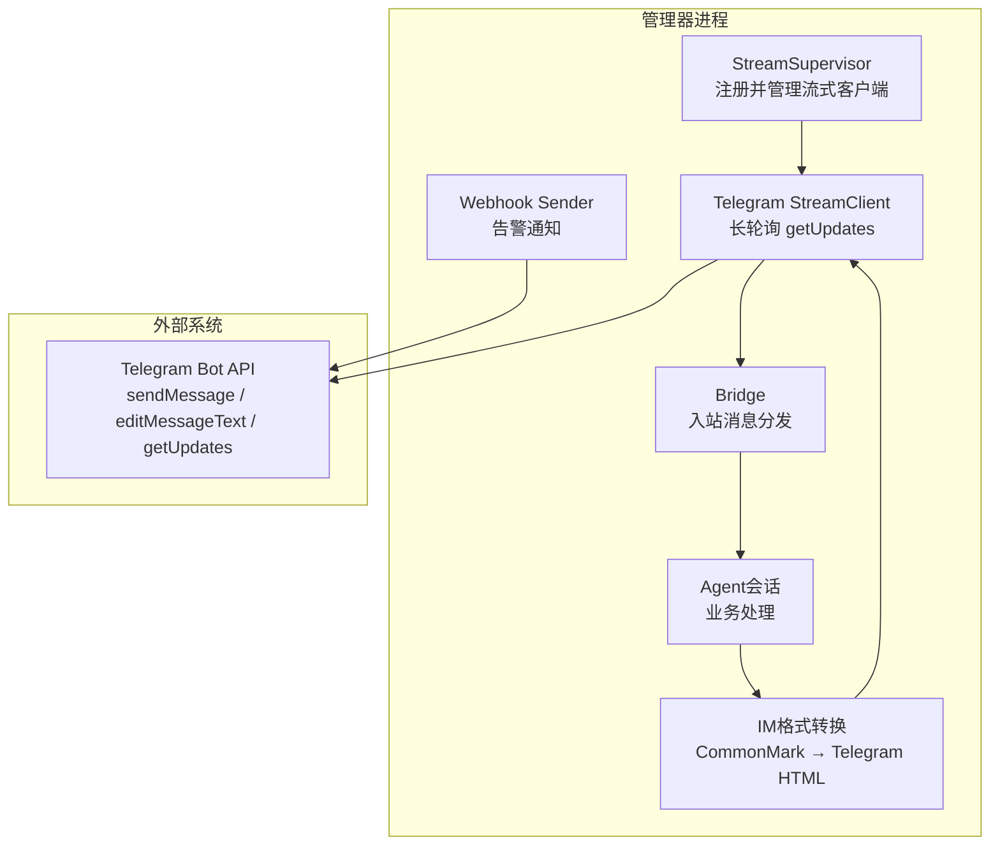
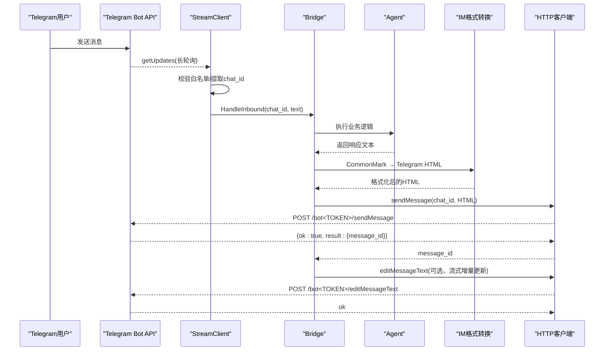
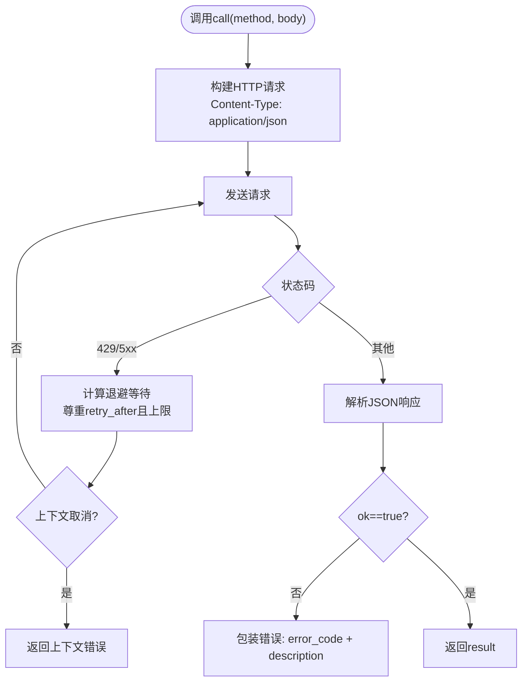
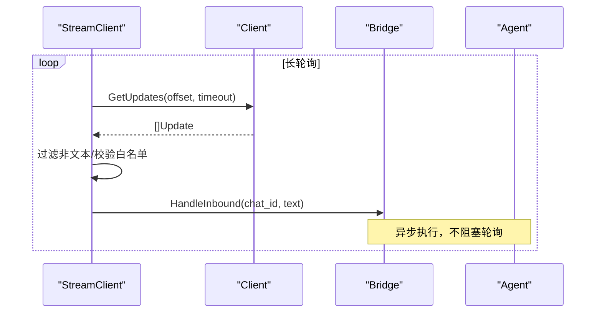
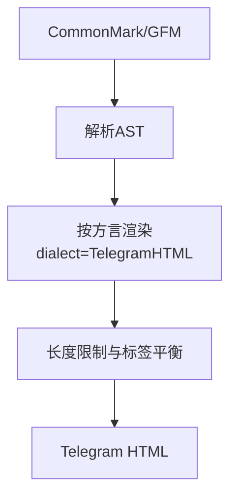
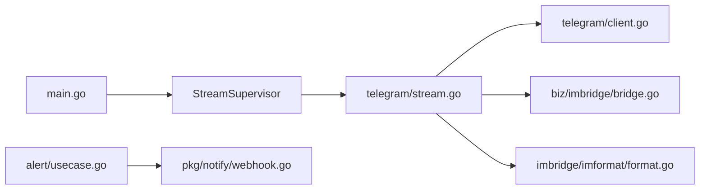

# Telegram渠道集成

<cite>
**本文引用的文件**
- [internal/manager/biz/imbridge/provider/telegram/client.go](file://internal/manager/biz/imbridge/provider/telegram/client.go)
- [internal/manager/biz/imbridge/provider/telegram/stream.go](file://internal/manager/biz/imbridge/provider/telegram/stream.go)
- [internal/manager/biz/imbridge/imformat/format.go](file://internal/manager/biz/imbridge/imformat/format.go)
- [cmd/ongrid/main.go](file://cmd/ongrid/main.go)
- [internal/manager/model/imbridge/model.go](file://internal/manager/model/imbridge/model.go)
- [internal/pkg/notify/webhook.go](file://internal/pkg/notify/webhook.go)
- [internal/manager/biz/alert/usecase.go](file://internal/manager/biz/alert/usecase.go)
- [web/src/pages/settings/Channels.tsx](file://web/src/pages/settings/Channels.tsx)
- [tests/e2e/testenv/fakes.go](file://tests/e2e/testenv/fakes.go)
</cite>

## 目录
1. [简介](#简介)
2. [项目结构](#项目结构)
3. [核心组件](#核心组件)
4. [架构总览](#架构总览)
5. [详细组件分析](#详细组件分析)
6. [依赖关系分析](#依赖关系分析)
7. [性能与可靠性](#性能与可靠性)
8. [故障排查指南](#故障排查指南)
9. [结论](#结论)
10. [附录：配置与使用示例](#附录配置与使用示例)

## 简介
本文件面向需要在系统中接入Telegram渠道的工程师与运维人员，系统性说明基于Telegram Bot API的认证方式、消息发送机制、流式通信实现（长轮询getUpdates）、Markdown到HTML的渲染策略与限制、以及完整的配置与使用示例。文档同时覆盖告警通知通道与IM桥接两种路径，帮助读者在不同场景下正确集成与排障。

## 项目结构
Telegram集成涉及“IM桥接（双向对话）”和“告警通知（单向推送）”两条路径：
- IM桥接：通过StreamClient长轮询getUpdates接收消息，调用Bridge将入站消息路由至Agent，并通过senderAdapter回写消息（支持编辑更新）。
- 告警通知：通过Webhook Sender向Bot API的sendMessage端点发送结构化文本。

**图表来源**
- [cmd/ongrid/main.go:1669-1692](file://cmd/ongrid/main.go#L1669-L1692)
- [internal/manager/biz/imbridge/provider/telegram/stream.go:18-86](file://internal/manager/biz/imbridge/provider/telegram/stream.go#L18-L86)
- [internal/manager/biz/imbridge/provider/telegram/client.go:137-193](file://internal/manager/biz/imbridge/provider/telegram/client.go#L137-L193)
- [internal/manager/biz/imbridge/imformat/format.go:112-130](file://internal/manager/biz/imbridge/imformat/format.go#L112-L130)
- [internal/pkg/notify/webhook.go:180-192](file://internal/pkg/notify/webhook.go#L180-L192)

**章节来源**
- [cmd/ongrid/main.go:1669-1692](file://cmd/ongrid/main.go#L1669-L1692)
- [internal/manager/model/imbridge/model.go:15-34](file://internal/manager/model/imbridge/model.go#L15-L34)

## 核心组件
- Telegram HTTP客户端：封装对Bot API的调用，包含重试、限流退避、错误解析与结果反序列化。
- 流式客户端：维护offset进行长轮询，过滤非文本消息，执行发送者白名单校验，并将消息桥接到Agent。
- 格式转换器：将Agent输出的CommonMark/GFM转换为Telegram支持的HTML格式，并强制长度上限与标签平衡。
- Webhook通知器：为告警场景提供简洁的sendMessage调用，chat_id作为body字段传递。
- 启动装配：在管理器主流程中注册Telegram流式工厂，由Supervisor统一生命周期管理。

**章节来源**
- [internal/manager/biz/imbridge/provider/telegram/client.go:21-117](file://internal/manager/biz/imbridge/provider/telegram/client.go#L21-L117)
- [internal/manager/biz/imbridge/provider/telegram/stream.go:18-86](file://internal/manager/biz/imbridge/provider/telegram/stream.go#L18-L86)
- [internal/manager/biz/imbridge/imformat/format.go:112-130](file://internal/manager/biz/imbridge/imformat/format.go#L112-L130)
- [internal/pkg/notify/webhook.go:180-192](file://internal/pkg/notify/webhook.go#L180-L192)
- [cmd/ongrid/main.go:1669-1692](file://cmd/ongrid/main.go#L1669-L1692)

## 架构总览
下图展示从用户消息到Agent响应再回写到Telegram的完整序列，包括格式转换与编辑更新。

**图表来源**
- [internal/manager/biz/imbridge/provider/telegram/stream.go:58-86](file://internal/manager/biz/imbridge/provider/telegram/stream.go#L58-L86)
- [internal/manager/biz/imbridge/provider/telegram/client.go:155-193](file://internal/manager/biz/imbridge/provider/telegram/client.go#L155-L193)
- [internal/manager/biz/imbridge/imformat/format.go:112-130](file://internal/manager/biz/imbridge/imformat/format.go#L112-L130)

## 详细组件分析

### Telegram HTTP客户端（client.go）
- 认证方式：通过URL路径中的bot token进行鉴权；所有请求均POST到https://api.telegram.org/bot<TOKEN>/<method>。
- 关键方法：
  - GetUpdates：长轮询获取消息，参数包含offset、timeout、allowed_updates。
  - SendMessage：发送文本，自动将输入转为Telegram HTML，设置parse_mode=HTML，禁用链接预览。
  - EditMessageText：用于流式编辑，忽略“未修改”的无操作错误以适配增量刷新。
- 重试与限流：对429与5xx进行指数退避重试，尊重retry_after但限制单次最大等待时间；网络层错误交由上层重连。
- 错误处理：解析API返回的error_code与description，构造可读错误信息。

**图表来源**
- [internal/manager/biz/imbridge/provider/telegram/client.go:67-117](file://internal/manager/biz/imbridge/provider/telegram/client.go#L67-L117)

**章节来源**
- [internal/manager/biz/imbridge/provider/telegram/client.go:21-117](file://internal/manager/biz/imbridge/provider/telegram/client.go#L21-L117)
- [internal/manager/biz/imbridge/provider/telegram/client.go:137-193](file://internal/manager/biz/imbridge/provider/telegram/client.go#L137-L193)

### 流式客户端（stream.go）
- 长轮询循环：维护offset，每次poll后更新ack位置；每轮带超时防止连接停滞。
- 入站过滤：仅处理text消息，忽略编辑等非文本事件。
- 安全控制：基于AllowFrom配置的发送者白名单，拒绝非授权用户，避免泄露机器人存在性。
- 桥接与回写：将入站消息封装为InboundMessage交给Bridge；回写时绑定chat_id，支持SendText与EditText。

**图表来源**
- [internal/manager/biz/imbridge/provider/telegram/stream.go:58-86](file://internal/manager/biz/imbridge/provider/telegram/stream.go#L58-L86)
- [internal/manager/biz/imbridge/provider/telegram/stream.go:88-129](file://internal/manager/biz/imbridge/provider/telegram/stream.go#L88-L129)

**章节来源**
- [internal/manager/biz/imbridge/provider/telegram/stream.go:18-168](file://internal/manager/biz/imbridge/provider/telegram/stream.go#L18-L168)

### 格式转换（imformat/format.go）
- 输入输出：将CommonMark/GFM转换为Telegram HTML，保证标签成对闭合，超出Telegram单条消息限制（4096字符）时截断并追加省略标记。
- 支持能力：粗体、斜体、删除线、代码块、链接、引用等；代码块会转义内容并保留语言类名。
- 限制说明：不使用MarkdownV2以避免复杂转义问题；HTML更稳定且易于边界控制。

**图表来源**
- [internal/manager/biz/imbridge/imformat/format.go:112-130](file://internal/manager/biz/imbridge/imformat/format.go#L112-L130)
- [internal/manager/biz/imbridge/imformat/format.go:220-236](file://internal/manager/biz/imbridge/imformat/format.go#L220-L236)
- [internal/manager/biz/imbridge/imformat/format.go:333-390](file://internal/manager/biz/imbridge/imformat/format.go#L333-L390)

**章节来源**
- [internal/manager/biz/imbridge/imformat/format.go:1-57](file://internal/manager/biz/imbridge/imformat/format.go#L1-L57)
- [internal/manager/biz/imbridge/imformat/format.go:112-130](file://internal/manager/biz/imbridge/imformat/format.go#L112-L130)

### 告警通知通道（webhook.go + usecase.go）
- 通道类型：ChannelTypeTelegram对应告警通知路径。
- 认证与目标：endpoint为完整sendMessage URL（含token），chat_id来自channel配置的secret字段。
- 消息体：包含chat_id与text，text由通用格式化函数生成，适合告警摘要。

**章节来源**
- [internal/pkg/notify/webhook.go:180-192](file://internal/pkg/notify/webhook.go#L180-L192)
- [internal/manager/biz/alert/usecase.go:1540-1557](file://internal/manager/biz/alert/usecase.go#L1540-L1557)

### 启动装配与提供者常量
- 提供者常量：ProviderTelegram标识流式通道，app_secret存储BotFather令牌。
- 启动注册：main中注册Telegram流式工厂，由Supervisor统一管理生命周期与重连。

**章节来源**
- [internal/manager/model/imbridge/model.go:15-34](file://internal/manager/model/imbridge/model.go#L15-L34)
- [cmd/ongrid/main.go:1669-1692](file://cmd/ongrid/main.go#L1669-L1692)

## 依赖关系分析
- StreamClient依赖Client进行HTTP调用，依赖Bridge进行消息路由，依赖imformat进行格式转换。
- Webhook Sender独立于IM桥接，用于告警通知，依赖通用消息格式化。
- main负责装配与注册，确保Supervisor能发现并运行Telegram流式客户端。

**图表来源**
- [cmd/ongrid/main.go:1669-1692](file://cmd/ongrid/main.go#L1669-L1692)
- [internal/manager/biz/imbridge/provider/telegram/stream.go:18-86](file://internal/manager/biz/imbridge/provider/telegram/stream.go#L18-L86)
- [internal/manager/biz/imbridge/provider/telegram/client.go:67-117](file://internal/manager/biz/imbridge/provider/telegram/client.go#L67-L117)
- [internal/manager/biz/alert/usecase.go:1540-1557](file://internal/manager/biz/alert/usecase.go#L1540-L1557)
- [internal/pkg/notify/webhook.go:180-192](file://internal/pkg/notify/webhook.go#L180-L192)

**章节来源**
- [internal/manager/biz/imbridge/provider/telegram/stream.go:18-168](file://internal/manager/biz/imbridge/provider/telegram/stream.go#L18-L168)
- [internal/manager/biz/imbridge/provider/telegram/client.go:1-200](file://internal/manager/biz/imbridge/provider/telegram/client.go#L1-L200)
- [internal/manager/biz/alert/usecase.go:1540-1557](file://internal/manager/biz/alert/usecase.go#L1540-L1557)
- [internal/pkg/notify/webhook.go:180-192](file://internal/pkg/notify/webhook.go#L180-L192)

## 性能与可靠性
- 长轮询效率：getUpdates使用server-side超时减少空转，配合per-poll context deadline检测停滞连接。
- 重试策略：对429与5xx进行指数退避，尊重retry_after并限制单次最大等待，避免无限阻塞。
- 流式编辑：EditMessageText忽略“未修改”错误，适配节流或最终flush重复更新的场景。
- 长度限制：TelegramHTML强制4096字符上限并保持标签平衡，避免发送失败。
- 代理友好：出站调用可穿越HTTP(S)_PROXY，适合受限网络环境。

[本节为通用指导，无需特定文件引用]

## 故障排查指南
- 认证失败：检查endpoint是否包含正确的bot token；确认AppSecret已正确配置。
- 权限不足：确认Chat ID有效且机器人具备发送权限；检查白名单AllowFrom是否包含发送者user id。
- 限流与错误：关注429与retry_after；查看错误码与描述定位具体原因。
- 消息未送达：验证chat_id与text格式；确认TelegramHTML未超过长度限制且标签平衡。
- 测试与模拟：可使用测试环境的FakeTelegram模拟getUpdates与sendMessage行为，便于端到端验证。

**章节来源**
- [internal/manager/biz/imbridge/provider/telegram/client.go:67-117](file://internal/manager/biz/imbridge/provider/telegram/client.go#L67-L117)
- [internal/manager/biz/imbridge/provider/telegram/stream.go:99-111](file://internal/manager/biz/imbridge/provider/telegram/stream.go#L99-L111)
- [tests/e2e/testenv/fakes.go:370-437](file://tests/e2e/testenv/fakes.go#L370-L437)

## 结论
本项目对Telegram渠道提供了健壮的集成方案：通过长轮询实现双向对话，通过Webhook实现告警通知；采用HTML格式保障渲染稳定性与长度限制；内置重试与限流处理提升可靠性；通过白名单与出站调用设计兼顾安全与网络适应性。按照本文配置与示例，可快速完成Telegram渠道的创建、认证与消息收发。

[本节为总结性内容，无需特定文件引用]

## 附录：配置与使用示例

### 创建Telegram Bot与获取Token
- 使用BotFather创建Bot并获取Token，该Token将填入应用的app_secret字段。
- 在设置页面选择Telegram渠道，粘贴Token并保存。

**章节来源**
- [web/src/pages/settings/Channels.tsx:462-490](file://web/src/pages/settings/Channels.tsx#L462-L490)
- [internal/manager/model/imbridge/model.go:15-34](file://internal/manager/model/imbridge/model.go#L15-L34)

### 配置Chat ID
- 告警通知：在channel配置的secret字段填写chat_id，endpoint为完整sendMessage URL。
- IM桥接：chat_id由入站消息的chat对象提供，系统自动绑定并用于回写。

**章节来源**
- [internal/pkg/notify/webhook.go:180-192](file://internal/pkg/notify/webhook.go#L180-L192)
- [internal/manager/biz/alert/usecase.go:1540-1557](file://internal/manager/biz/alert/usecase.go#L1540-L1557)
- [internal/manager/biz/imbridge/provider/telegram/stream.go:88-129](file://internal/manager/biz/imbridge/provider/telegram/stream.go#L88-L129)

### 发送文本消息（告警通知）
- 构造payload：包含chat_id与text，text由通用格式化函数生成。
- 发送方式：POST到https://api.telegram.org/bot<TOKEN>/sendMessage。

**章节来源**
- [internal/pkg/notify/webhook.go:180-192](file://internal/pkg/notify/webhook.go#L180-L192)

### 格式化内容与流式更新（IM桥接）
- 输入：Agent输出的CommonMark/GFM。
- 转换：TelegramHTML转换为HTML，限制长度并保证标签平衡。
- 发送与编辑：先sendMessage获取message_id，后续可通过editMessageText进行流式更新。

**章节来源**
- [internal/manager/biz/imbridge/imformat/format.go:112-130](file://internal/manager/biz/imbridge/imformat/format.go#L112-L130)
- [internal/manager/biz/imbridge/provider/telegram/client.go:155-193](file://internal/manager/biz/imbridge/provider/telegram/client.go#L155-L193)

### 错误处理与调试
- 常见错误：401未授权、400参数错误、429限流、5xx服务端错误。
- 调试建议：检查token与chat_id有效性；查看日志中的warn提示（如非白名单发送者）；使用FakeTelegram进行端到端验证。

**章节来源**
- [internal/manager/biz/imbridge/provider/telegram/client.go:67-117](file://internal/manager/biz/imbridge/provider/telegram/client.go#L67-L117)
- [internal/manager/biz/imbridge/provider/telegram/stream.go:99-111](file://internal/manager/biz/imbridge/provider/telegram/stream.go#L99-L111)
- [tests/e2e/testenv/fakes.go:370-437](file://tests/e2e/testenv/fakes.go#L370-L437)