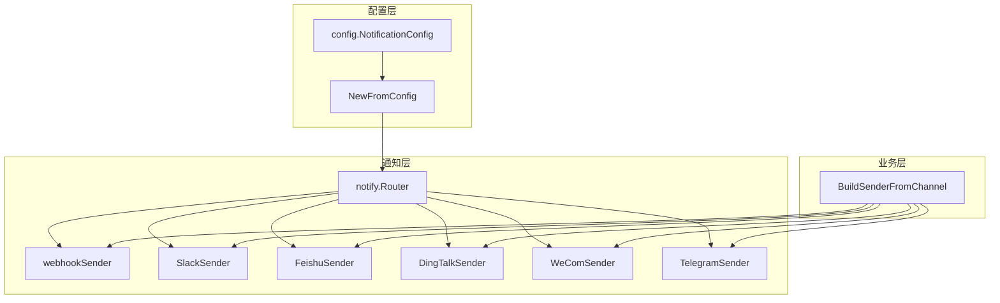
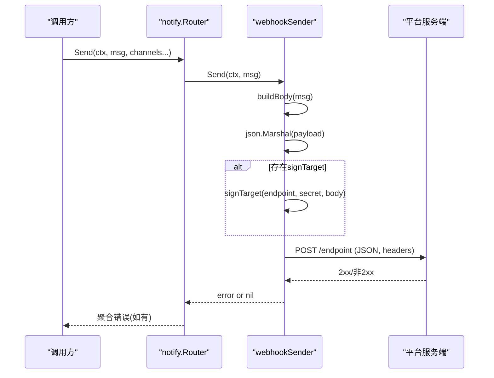
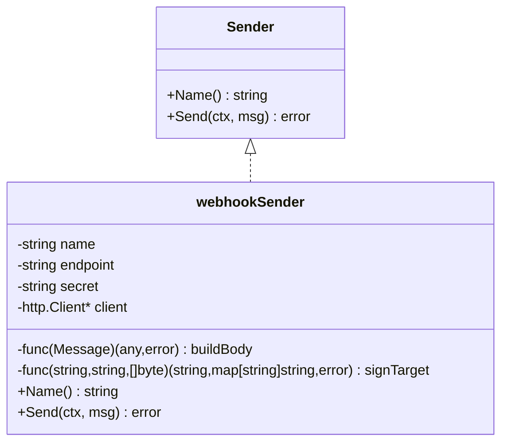
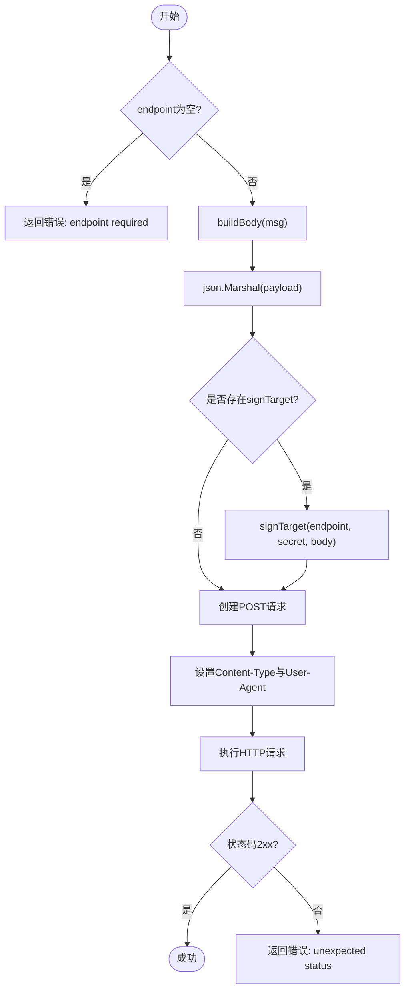
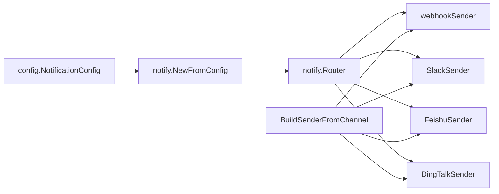

# Webhook通用发送器

<cite>
**本文引用的文件**
- [webhook.go](file://internal/pkg/notify/webhook.go)
- [notify.go](file://internal/pkg/notify/notify.go)
- [config.go](file://internal/pkg/config/config.go)
- [usecase.go](file://internal/manager/biz/alert/usecase.go)
- [notify_signed_test.go](file://tests/e2e/notify_signed_test.go)
</cite>

## 目录
1. [简介](#简介)
2. [项目结构](#项目结构)
3. [核心组件](#核心组件)
4. [架构总览](#架构总览)
5. [详细组件分析](#详细组件分析)
6. [依赖关系分析](#依赖关系分析)
7. [性能与可靠性](#性能与可靠性)
8. [故障排查指南](#故障排查指南)
9. [结论](#结论)
10. [附录：配置与最佳实践](#附录：配置与最佳实践)

## 简介
本技术文档围绕“Webhook通用发送器”展开，重点解析 webhookSender 的设计模式与实现原理，包括消息构建函数、签名机制与HTTP请求处理流程。文档深入说明HMAC签名算法的实现细节（SHA256哈希、时间戳处理、签名验证思路），并分别解释各平台特定的签名方式：
- 通用Webhook：通过请求头 X-Ongrid-Signature 携带签名
- 飞书：在JSON body中附带 timestamp + sign 参数
- 钉钉：将 timestamp + sign 附加到URL查询参数中

同时提供完整的配置示例与错误处理策略，并给出自定义Webhook适配器的开发指南与最佳实践。

## 项目结构
通知子系统位于 internal/pkg/notify，负责统一封装多种出站通道；配置加载位于 internal/pkg/config；告警业务侧通过 BuildSenderFromChannel 将持久化的通道配置转换为具体 Sender；端到端测试覆盖签名行为。

图表来源
- [notify.go:39-90](file://internal/pkg/notify/notify.go#L39-L90)
- [usecase.go:1520-1558](file://internal/manager/biz/alert/usecase.go#L1520-L1558)
- [config.go:177-212](file://internal/pkg/config/config.go#L177-L212)

章节来源
- [notify.go:1-171](file://internal/pkg/notify/notify.go#L1-L171)
- [config.go:177-212](file://internal/pkg/config/config.go#L177-L212)
- [usecase.go:1500-1558](file://internal/manager/biz/alert/usecase.go#L1500-L1558)

## 核心组件
- Message：标准化消息体，包含主题、正文、严重级别、来源、去重键、标签与发生时间。
- Sender：统一的发送接口，所有通道适配器均实现 Name() 与 Send(ctx, msg)。
- Router：路由分发器，按名称选择已注册的 Sender 并发超时发送。
- webhookSender：通用Webhook发送器，支持可插拔的消息构建与签名策略。

关键职责划分：
- 消息构建：不同平台通过 buildBody 回调定制payload形状。
- 签名策略：通过 signTarget 回调注入平台特定签名逻辑（头部、URL或body）。
- HTTP发送：统一构造请求、设置Content-Type与User-Agent、执行Do并校验状态码。

章节来源
- [notify.go:22-37](file://internal/pkg/notify/notify.go#L22-L37)
- [notify.go:39-90](file://internal/pkg/notify/notify.go#L39-L90)
- [webhook.go:18-25](file://internal/pkg/notify/webhook.go#L18-L25)
- [webhook.go:220-258](file://internal/pkg/notify/webhook.go#L220-L258)

## 架构总览
下图展示从配置到发送的完整链路：配置加载生成各通道实例，Router根据默认或显式通道名进行分发，webhookSender依据平台策略构建消息并签名后发起HTTP POST。

图表来源
- [notify.go:92-130](file://internal/pkg/notify/notify.go#L92-L130)
- [webhook.go:220-258](file://internal/pkg/notify/webhook.go#L220-L258)

## 详细组件分析

### webhookSender 设计模式与实现
- 结构体字段
  - name：通道名称
  - endpoint：目标URL
  - secret：密钥（用于签名）
  - client：HTTP客户端
  - buildBody：消息构建函数，返回平台相关payload
  - signTarget：签名函数，返回最终endpoint与额外headers
- 构造工厂
  - NewGenericWebhookSender：通用Webhook，buildBody直接返回Message，signTarget为X-Ongrid-Signature头部签名
  - NewSlackSender：Slack attachments格式，无secret签名
  - NewFeishuSender：飞书自定义机器人，buildBody添加timestamp+sign到body顶层
  - NewDingTalkSender：钉钉自定义机器人，signTarget将timestamp+sign追加到URL query
  - NewWeComSender：企业微信群机器人，无额外签名
  - NewTelegramSender：Telegram Bot API，chat_id在body中，无secret签名
- 发送流程
  - 校验endpoint
  - 构建payload并序列化
  - 可选签名（修改endpoint或注入headers）
  - 创建带Context的POST请求，设置Content-Type与User-Agent
  - 执行请求并校验响应状态码范围

图表来源
- [notify.go:33-37](file://internal/pkg/notify/notify.go#L33-L37)
- [webhook.go:18-25](file://internal/pkg/notify/webhook.go#L18-L25)
- [webhook.go:218-258](file://internal/pkg/notify/webhook.go#L218-L258)

章节来源
- [webhook.go:18-25](file://internal/pkg/notify/webhook.go#L18-L25)
- [webhook.go:27-45](file://internal/pkg/notify/webhook.go#L27-L45)
- [webhook.go:141-192](file://internal/pkg/notify/webhook.go#L141-L192)
- [webhook.go:194-216](file://internal/pkg/notify/webhook.go#L194-L216)
- [webhook.go:220-258](file://internal/pkg/notify/webhook.go#L220-L258)

### 消息构建函数
- 通用Webhook：直接透传Message为payload
- Slack：使用attachments格式，包含颜色条、结构化字段与时间戳
- 飞书：msg_type=text，content.text为格式化文本，当有secret时增加timestamp和sign
- 钉钉：msgtype=text，text.content为格式化文本，签名走URL query
- 企业微信：同钉钉payload形状，无签名
- Telegram：chat_id在body，text为格式化文本，无secret签名

格式化文本由formatText组装，包含严重级别、主题、正文、source与dedupe_key等。

章节来源
- [webhook.go:27-45](file://internal/pkg/notify/webhook.go#L27-L45)
- [webhook.go:47-115](file://internal/pkg/notify/webhook.go#L47-L115)
- [webhook.go:141-192](file://internal/pkg/notify/webhook.go#L141-L192)
- [webhook.go:260-272](file://internal/pkg/notify/webhook.go#L260-L272)

### 签名机制与HTTP请求处理流程
- 通用Webhook签名（X-Ongrid-Signature）
  - 使用HMAC-SHA256(secret, body)，结果为hex编码，前缀“sha256=”
  - 作为请求头X-Ongrid-Signature附加
- 飞书签名（timestamp+sign在body）
  - 计算sign = base64(HMAC-SHA256(key="<timestamp>\n<secret>", msg=""))
  - 将timestamp与sign放入JSON顶层字段
- 钉钉签名（timestamp+sign在URL）
  - 生成毫秒级时间戳ts
  - 计算sign = base64(HMAC-SHA256(secret, "<timestamp>\n<secret>"))
  - 将timestamp与sign追加到URL查询参数

HTTP请求处理：
- 设置Content-Type=application/json
- 设置User-Agent=ongrid-notify/1.0
- 使用http.NewRequestWithContext创建请求
- 执行client.Do并检查状态码范围（2xx成功，其他视为异常）

图表来源
- [webhook.go:220-258](file://internal/pkg/notify/webhook.go#L220-L258)
- [webhook.go:274-313](file://internal/pkg/notify/webhook.go#L274-L313)

章节来源
- [webhook.go:274-313](file://internal/pkg/notify/webhook.go#L274-L313)
- [webhook.go:220-258](file://internal/pkg/notify/webhook.go#L220-L258)

### HMAC签名算法详解
- 通用Webhook
  - 输入：secret、请求体body
  - 算法：HMAC-SHA256(secret, body)
  - 输出：hex编码，附加“sha256=”前缀，写入X-Ongrid-Signature头
- 飞书
  - 输入：timestamp、secret
  - 算法：HMAC-SHA256(key="<timestamp>\n<secret>", msg="")
  - 输出：base64标准编码，放入body顶层sign字段
- 钉钉
  - 输入：timestamp（毫秒）、secret
  - 算法：HMAC-SHA256(secret, "<timestamp>\n<secret>")
  - 输出：base64标准编码，放入URL查询参数sign，同时附带timestamp

时间戳处理：
- 飞书：秒级时间戳（Unix时间）
- 钉钉：毫秒级时间戳（UnixMilli）

验证过程（接收端思路）：
- 通用Webhook：用相同secret对收到的body计算HMAC-SHA256，比较头部值
- 飞书：用timestamp与secret组合为key，对空消息计算HMAC-SHA256，比较sign
- 钉钉：用timestamp与secret组合为待签串，计算HMAC-SHA256并base64，比较sign

章节来源
- [webhook.go:274-313](file://internal/pkg/notify/webhook.go#L274-L313)
- [notify_signed_test.go:178-196](file://tests/e2e/notify_signed_test.go#L178-L196)

### 各平台特定签名方法
- 通用Webhook：X-Ongrid-Signature头
- 飞书：timestamp+sign在JSON body顶层
- 钉钉：timestamp+sign在URL查询参数

章节来源
- [webhook.go:141-165](file://internal/pkg/notify/webhook.go#L141-L165)
- [webhook.go:274-313](file://internal/pkg/notify/webhook.go#L274-L313)
- [notify_signed_test.go:38-97](file://tests/e2e/notify_signed_test.go#L38-L97)
- [notify_signed_test.go:99-175](file://tests/e2e/notify_signed_test.go#L99-L175)

### 配置与通道构建
- 配置项
  - Notification.Enabled：全局开关
  - DefaultChannels：默认通道列表
  - Timeout：单通道发送超时
  - Webhook/Slack/Feishu/DingTalk：各自Enabled、Name、URL、Secret
- 构建流程
  - NewFromConfig根据配置创建对应Sender
  - BuildSenderFromChannel从持久化通道配置构建Sender（支持DB存储的通道）

章节来源
- [config.go:177-212](file://internal/pkg/config/config.go#L177-L212)
- [config.go:509-534](file://internal/pkg/config/config.go#L509-L534)
- [notify.go:67-90](file://internal/pkg/notify/notify.go#L67-L90)
- [usecase.go:1520-1558](file://internal/manager/biz/alert/usecase.go#L1520-L1558)

## 依赖关系分析
- notify.Router依赖多个Sender实现
- webhookSender依赖crypto/hmac、crypto/sha256、encoding/base64、encoding/hex、net/http等标准库
- 配置加载依赖环境变量，构建通知通道
- 业务层通过BuildSenderFromChannel将通道模型映射到具体Sender

图表来源
- [notify.go:67-90](file://internal/pkg/notify/notify.go#L67-L90)
- [usecase.go:1520-1558](file://internal/manager/biz/alert/usecase.go#L1520-L1558)

章节来源
- [notify.go:67-90](file://internal/pkg/notify/notify.go#L67-L90)
- [usecase.go:1520-1558](file://internal/manager/biz/alert/usecase.go#L1520-L1558)

## 性能与可靠性
- 超时控制：Router为每个通道发送设置context.WithTimeout，避免阻塞
- 错误聚合：多通道发送失败时errors.Join汇总错误
- 状态码校验：仅接受2xx响应，其他视为异常
- 连接复用：可通过传入http.Client实现连接池与重试策略
- 日志与审计：alert_events表记录每次尝试状态，便于追踪

优化建议：
- 合理设置超时时间与重试策略
- 使用连接池减少握手开销
- 对高频通道实施限流与退避

[本节为通用指导，不直接分析具体文件]

## 故障排查指南
常见问题与定位要点：
- endpoint为空：返回“endpoint required”，检查通道配置
- payload构建失败：包装错误“build payload: ...”，检查buildBody实现
- JSON序列化失败：包装错误“marshal payload: ...”，检查payload结构
- 签名失败：包装错误“sign request: ...”，检查secret与签名算法
- HTTP请求失败：包装错误“post: ...”，检查网络与证书
- 非2xx响应：包装错误“unexpected status: ...”，检查服务端响应

调试技巧：
- 使用e2e测试中的FakeSlack捕获请求，验证URL、Query与Body
- 对比期望签名与实际签名，确认时间戳与secret一致性
- 检查Header是否包含X-Ongrid-Signature或URL是否包含timestamp/sign

章节来源
- [webhook.go:220-258](file://internal/pkg/notify/webhook.go#L220-L258)
- [notify_signed_test.go:38-175](file://tests/e2e/notify_signed_test.go#L38-L175)

## 结论
Webhook通用发送器通过可插拔的消息构建与签名策略，实现了多平台通知的统一抽象。其设计清晰、职责单一，易于扩展新平台。HMAC签名机制保障了请求的完整性与可信性。配合配置系统与路由分发，形成了高内聚、低耦合的通知体系。

[本节为总结，不直接分析具体文件]

## 附录：配置与最佳实践

### 环境变量配置示例
- 通用Webhook
  - ONGRID_NOTIFY_WEBHOOK_ENABLED=true
  - ONGRID_NOTIFY_WEBHOOK_NAME=ops-webhook
  - ONGRID_NOTIFY_WEBHOOK_URL=https://example.com/notify
  - ONGRID_NOTIFY_WEBHOOK_SECRET=your-secret
- 飞书
  - ONGRID_NOTIFY_FEISHU_ENABLED=true
  - ONGRID_NOTIFY_FEISHU_NAME=feishu
  - ONGRID_NOTIFY_FEISHU_WEBHOOK_URL=https://open.feishu.cn/open-apis/bot/v2/hook/...
  - ONGRID_NOTIFY_FEISHU_SECRET=your-secret
- 钉钉
  - ONGRID_NOTIFY_DINGTALK_ENABLED=true
  - ONGRID_NOTIFY_DINGTALK_NAME=dingtalk
  - ONGRID_NOTIFY_DINGTALK_WEBHOOK_URL=https://oapi.dingtalk.com/robot/send?access_token=...
  - ONGRID_NOTIFY_DINGTALK_SECRET=your-secret

章节来源
- [config.go:509-534](file://internal/pkg/config/config.go#L509-L534)

### 自定义Webhook适配器开发指南
步骤：
1. 定义新的Sender构造函数，调用newWebhookSender
2. 实现buildBody函数，返回平台要求的payload结构
3. 实现signTarget函数（如需要），返回最终endpoint与headers
4. 在BuildSenderFromChannel中添加类型分支，返回新Sender
5. 编写单元测试与e2e测试，验证payload与签名

最佳实践：
- 保持payload简洁，避免冗余字段
- 签名算法严格遵循平台规范，注意时间戳精度
- 错误信息明确，便于定位问题
- 使用http.Client共享连接，提升性能

章节来源
- [webhook.go:194-216](file://internal/pkg/notify/webhook.go#L194-L216)
- [usecase.go:1520-1558](file://internal/manager/biz/alert/usecase.go#L1520-L1558)