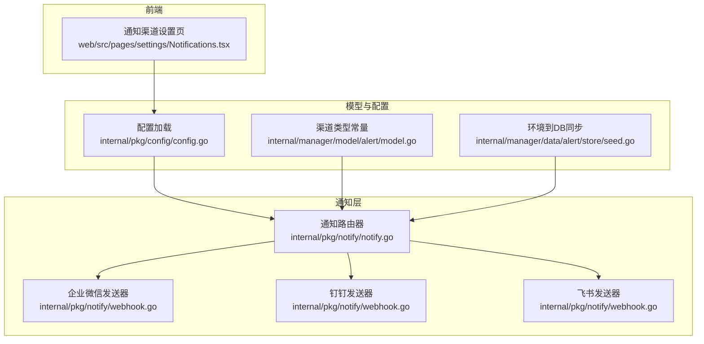
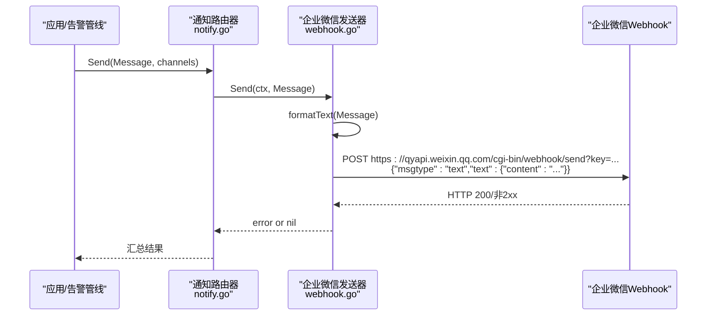
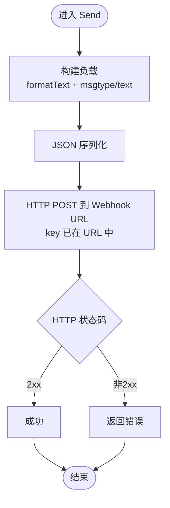
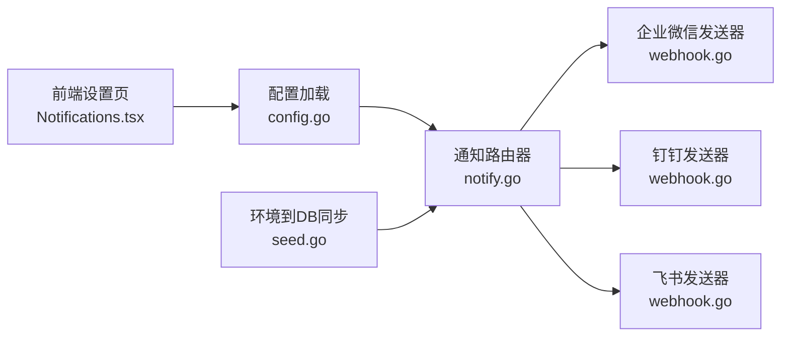

# 企业微信渠道集成

<cite>
**本文引用的文件**
- [webhook.go](file://internal/pkg/notify/webhook.go)
- [notify.go](file://internal/pkg/notify/notify.go)
- [model.go](file://internal/manager/model/alert/model.go)
- [Notifications.tsx](file://web/src/pages/settings/Notifications.tsx)
- [config.go](file://internal/pkg/config/config.go)
- [seed.go](file://internal/manager/data/alert/store/seed.go)
- [main.go](file://cmd/ongrid/main.go)
</cite>

## 目录
1. [简介](#简介)
2. [项目结构](#项目结构)
3. [核心组件](#核心组件)
4. [架构总览](#架构总览)
5. [详细组件分析](#详细组件分析)
6. [依赖关系分析](#依赖关系分析)
7. [性能与可靠性](#性能与可靠性)
8. [故障排查指南](#故障排查指南)
9. [结论](#结论)
10. [附录：配置与使用示例](#附录配置与使用示例)

## 简介
本文件面向需要在系统中接入“企业微信群机器人”的工程师，说明如何通过通知渠道将告警、巡检或主动式 AIOps 消息发送到企业微信群。系统采用统一的 Webhook 发送器，对企微群机器人使用与钉钉相同的 JSON 文本格式，但认证方式不同：企业微信通过 URL 中的 key 进行鉴权，无需额外签名。文档同时对比与钉钉消息格式的异同，并给出创建机器人、获取 Webhook URL、配置权限、发送消息、格式化与错误处理的完整流程。

## 项目结构
- 通知通道抽象与实现位于 internal/pkg/notify，提供通用 Webhook、Slack、飞书、钉钉、企业微信、Telegram 等发送器。
- 告警模型与渠道类型定义在 internal/manager/model/alert，包含 ChannelTypeWeCom（企业微信）常量及注释说明。
- 前端设置页 web/src/pages/settings/Notifications.tsx 提供企业微信渠道的 UI 配置入口与提示文案。
- 运行时配置加载在 internal/pkg/config/config.go，负责读取环境变量并构建通知路由。
- 启动时环境到数据库的同步在 internal/manager/data/alert/store/seed.go，用于将 env 配置的渠道落库。
- 业务侧调用入口在 cmd/ongrid/main.go，演示了 IM 消息发送的分发逻辑（当前未直接支持企业微信直发，但通知渠道已支持）。

图表来源
- [webhook.go:157-178](file://internal/pkg/notify/webhook.go#L157-L178)
- [notify.go:75-90](file://internal/pkg/notify/notify.go#L75-L90)
- [model.go:192-203](file://internal/manager/model/alert/model.go#L192-L203)
- [Notifications.tsx:70-80](file://web/src/pages/settings/Notifications.tsx#L70-L80)
- [config.go:177-200](file://internal/pkg/config/config.go#L177-L200)
- [seed.go:13-37](file://internal/manager/data/alert/store/seed.go#L13-L37)

章节来源
- [webhook.go:157-178](file://internal/pkg/notify/webhook.go#L157-L178)
- [notify.go:75-90](file://internal/pkg/notify/notify.go#L75-L90)
- [model.go:192-203](file://internal/manager/model/alert/model.go#L192-L203)
- [Notifications.tsx:70-80](file://web/src/pages/settings/Notifications.tsx#L70-L80)
- [config.go:177-200](file://internal/pkg/config/config.go#L177-L200)
- [seed.go:13-37](file://internal/manager/data/alert/store/seed.go#L13-L37)

## 核心组件
- 通知路由器 Router：统一入口，按名称选择 Sender，带超时控制与启用开关。
- 企业微信发送器 NewWeComSender：构造与钉钉一致的 JSON 文本负载，URL 中携带 key 作为凭证，不附加签名。
- 消息格式 formatText：将告警主题、正文、来源、去重键拼接为多行纯文本，适配各平台 text.content 渲染。
- 渠道类型常量：ChannelTypeWeCom 标识企业微信渠道。
- 前端配置：提供企业微信渠道卡片、占位符与字段说明，secret 字段被忽略。

章节来源
- [notify.go:22-37](file://internal/pkg/notify/notify.go#L22-L37)
- [notify.go:92-130](file://internal/pkg/notify/notify.go#L92-L130)
- [webhook.go:167-178](file://internal/pkg/notify/webhook.go#L167-L178)
- [webhook.go:260-272](file://internal/pkg/notify/webhook.go#L260-L272)
- [model.go:192-203](file://internal/manager/model/alert/model.go#L192-L203)
- [Notifications.tsx:70-80](file://web/src/pages/settings/Notifications.tsx#L70-L80)

## 架构总览
企业微信渠道集成的数据流如下：上层业务生成标准化 Message，Router 根据配置选择企业微信 Sender，Sender 将消息序列化为 {"msgtype":"text","text":{"content":"..."}} 并通过 HTTP POST 到企业微信群机器人 Webhook URL（key 在 URL 查询参数中），由企业微信服务端完成鉴权与投递。

图表来源
- [notify.go:92-130](file://internal/pkg/notify/notify.go#L92-L130)
- [webhook.go:167-178](file://internal/pkg/notify/webhook.go#L167-L178)
- [webhook.go:220-258](file://internal/pkg/notify/webhook.go#L220-L258)
- [webhook.go:260-272](file://internal/pkg/notify/webhook.go#L260-L272)

## 详细组件分析

### 企业微信发送器与消息格式
- 负载形状：与钉钉一致，均为 {"msgtype":"text","text":{"content":"..."}}。
- 认证机制：企业微信群机器人的 key 嵌入在 Webhook URL 的查询参数中；v1 链路不要求额外签名。
- 文本渲染规则：text.content 由 formatText 生成，包含 severity + subject、可选 body、source、dedupe_key，以换行分隔。
- 发送过程：buildBody 组装 payload，JSON 序列化后发起 HTTP POST，Content-Type 为 application/json，User-Agent 固定。
- 状态码处理：非 2xx 响应视为错误返回。

图表来源
- [webhook.go:167-178](file://internal/pkg/notify/webhook.go#L167-L178)
- [webhook.go:220-258](file://internal/pkg/notify/webhook.go#L220-L258)
- [webhook.go:260-272](file://internal/pkg/notify/webhook.go#L260-L272)

章节来源
- [webhook.go:167-178](file://internal/pkg/notify/webhook.go#L167-L178)
- [webhook.go:220-258](file://internal/pkg/notify/webhook.go#L220-L258)
- [webhook.go:260-272](file://internal/pkg/notify/webhook.go#L260-L272)

### 与钉钉消息格式的相似性与差异
- 相似点：
  - 文本消息负载结构相同：{"msgtype":"text","text":{"content":"..."}}。
  - 均通过 Webhook 单向推送，适合告警与通知场景。
- 差异点：
  - 认证方式：钉钉支持可选签名（timestamp+sign 追加到 URL），企业微信 v1 不使用签名，仅依赖 URL 中的 key。
  - 双向会话：钉钉在本仓库中还有 Stream 模式的双向 IM 桥接实现；企业微信在此仓库中仅支持单向 Webhook 通知。

章节来源
- [webhook.go:157-178](file://internal/pkg/notify/webhook.go#L157-L178)
- [webhook.go:293-313](file://internal/pkg/notify/webhook.go#L293-L313)
- [stream.go:17-18](file://internal/manager/biz/imbridge/provider/dingtalk/stream.go#L17-L18)

### 渠道类型与配置注入
- 渠道类型常量：ChannelTypeWeCom 表示企业微信。
- 配置加载：NotificationConfig 包含各渠道的 Enabled、Name、URL、Secret 等字段；企业微信 Secret 会被忽略。
- 环境到数据库同步：启动时将 env 配置的渠道写入 notification_channels 表，便于后续管理与审计。

章节来源
- [model.go:192-203](file://internal/manager/model/alert/model.go#L192-L203)
- [config.go:177-200](file://internal/pkg/config/config.go#L177-L200)
- [seed.go:13-37](file://internal/manager/data/alert/store/seed.go#L13-L37)

### 前端配置界面
- 提供企业微信渠道卡片，包含中文/英文标签、提示信息与 endpoint 占位符。
- 当 type 为 wecom 时，secret 字段被忽略，界面会提示 key 已在 endpoint URL 中。

章节来源
- [Notifications.tsx:70-80](file://web/src/pages/settings/Notifications.tsx#L70-L80)
- [Notifications.tsx:531-555](file://web/src/pages/settings/Notifications.tsx#L531-L555)

### 业务侧调用与限制
- 业务侧存在 IM 消息发送的调度逻辑，当前对钉钉直发群组有明确限制；企业微信直发群组不在该路径中，但通知渠道（Webhook）已可用。
- 如需通过 AI 助手主动推送消息，可使用通知渠道（而非双向 IM 机器人）。

章节来源
- [main.go:5257-5288](file://cmd/ongrid/main.go#L5257-L5288)

## 依赖关系分析
- notify.Router 依赖各 Sender 实现；NewWeComSender 依赖 formatText 与 HTTP 客户端。
- 配置层 NotificationConfig 驱动 Router 初始化；seed 将 env 配置持久化到 DB。
- 前端 Notifications.tsx 提供可视化配置入口，与后端 API 交互管理渠道。

图表来源
- [config.go:177-200](file://internal/pkg/config/config.go#L177-L200)
- [notify.go:75-90](file://internal/pkg/notify/notify.go#L75-L90)
- [webhook.go:141-178](file://internal/pkg/notify/webhook.go#L141-L178)
- [seed.go:13-37](file://internal/manager/data/alert/store/seed.go#L13-L37)
- [Notifications.tsx:70-80](file://web/src/pages/settings/Notifications.tsx#L70-L80)

章节来源
- [config.go:177-200](file://internal/pkg/config/config.go#L177-L200)
- [notify.go:75-90](file://internal/pkg/notify/notify.go#L75-L90)
- [webhook.go:141-178](file://internal/pkg/notify/webhook.go#L141-L178)
- [seed.go:13-37](file://internal/manager/data/alert/store/seed.go#L13-L37)
- [Notifications.tsx:70-80](file://web/src/pages/settings/Notifications.tsx#L70-L80)

## 性能与可靠性
- 超时控制：Router 为每个 channel 发送设置超时，避免阻塞主流程。
- 错误聚合：多个 channel 失败时汇总错误，便于定位问题。
- 网络健壮性：HTTP 非 2xx 即视为失败，建议在上层重试或降级。
- 并发与资源：默认使用标准 HTTP 客户端，注意连接复用与限流策略。

[本节为通用指导，不直接分析具体文件]

## 故障排查指南
- 常见错误
  - 未配置 endpoint：返回“endpoint required”。
  - HTTP 非 2xx：返回“unexpected status”，需检查企业微信 Webhook URL 是否正确、网络是否可达。
  - 渠道未启用或未注册：Router 不会发送，需检查配置与 seed 同步结果。
- 排查步骤
  - 确认渠道类型为 wecom，且 endpoint 为企业微信群机器人地址，key 在 URL 中。
  - 检查通知路由器是否启用，timeout 是否合理。
  - 查看 delivery 记录（告警事件）确认请求与响应内容。

章节来源
- [webhook.go:220-258](file://internal/pkg/notify/webhook.go#L220-L258)
- [notify.go:92-130](file://internal/pkg/notify/notify.go#L92-L130)

## 结论
本仓库已原生支持企业微信群机器人作为单向通知渠道。其消息格式与钉钉一致，但认证方式更简单——仅依赖 URL 中的 key。通过统一的通知路由器与发送器，企业微信渠道可无缝接入告警、巡检与主动式 AIOps 消息推送。结合前端配置与启动时的环境同步，可实现快速上线与运维可观测。

[本节为总结，不直接分析具体文件]

## 附录：配置与使用示例

### 在企业微信创建群机器人并获取 Webhook URL
- 在企业微信群中添加“群机器人”，复制生成的 Webhook 地址，形如：https://qyapi.weixin.qq.com/cgi-bin/webhook/send?key=xxxx。
- 该 key 即为鉴权凭据，无需额外签名。

章节来源
- [Notifications.tsx:70-80](file://web/src/pages/settings/Notifications.tsx#L70-L80)

### 在系统中配置企业微信渠道
- 在前端“设置 → 通知渠道”中选择“企业微信”，填入 endpoint（含 key），secret 留空即可。
- 或通过环境变量配置，并在启动时同步到数据库。

章节来源
- [Notifications.tsx:70-80](file://web/src/pages/settings/Notifications.tsx#L70-L80)
- [config.go:177-200](file://internal/pkg/config/config.go#L177-L200)
- [seed.go:13-37](file://internal/manager/data/alert/store/seed.go#L13-L37)

### 发送消息与格式化
- 消息体将被转换为 {"msgtype":"text","text":{"content":"..."}}，其中 content 由 formatText 生成，包含 severity、subject、body、source、dedupe_key。
- 发送成功后企业微信群将收到一条纯文本消息。

章节来源
- [webhook.go:167-178](file://internal/pkg/notify/webhook.go#L167-L178)
- [webhook.go:260-272](file://internal/pkg/notify/webhook.go#L260-L272)

### 错误处理
- 若 HTTP 响应非 2xx，将返回错误；请检查 endpoint、网络连通性与企业微信服务状态。
- 可在“设置 → 告警事件”中查看投递记录与错误信息。

章节来源
- [webhook.go:220-258](file://internal/pkg/notify/webhook.go#L220-L258)

### 版本兼容性与网络访问要求
- 兼容性：企业微信渠道基于官方群机器人 Webhook，遵循其 JSON 文本格式；当前实现不依赖特定 SDK，具备良好兼容性。
- 网络要求：管理器需能访问企业微信公网 API（qyapi.weixin.qq.com），确保出站 HTTPS 未被防火墙拦截。

[本节为通用指导，不直接分析具体文件]