# 通知渠道集成

<cite>
**本文引用的文件**
- [internal/pkg/notify/webhook.go](file://internal/pkg/notify/webhook.go)
- [internal/pkg/notify/notify.go](file://internal/pkg/notify/notify.go)
- [internal/manager/biz/imbridge/bridge.go](file://internal/manager/biz/imbridge/bridge.go)
- [internal/manager/biz/imbridge/sender.go](file://internal/manager/biz/imbridge/sender.go)
- [internal/manager/biz/imbridge/stream_supervisor.go](file://internal/manager/biz/imbridge/stream_supervisor.go)
- [internal/manager/biz/imbridge/provider/slack/client.go](file://internal/manager/biz/imbridge/provider/slack/client.go)
- [internal/manager/biz/imbridge/provider/telegram/client.go](file://internal/manager/biz/imbridge/provider/telegram/client.go)
- [internal/manager/biz/imbridge/provider/feishu/client.go](file://internal/manager/biz/imbridge/provider/feishu/client.go)
- [internal/manager/biz/imbridge/provider/dingtalk/stream.go](file://internal/manager/biz/imbridge/provider/dingtalk/stream.go)
- [internal/manager/data/alert/store/seed.go](file://internal/manager/data/alert/store/seed.go)
- [internal/manager/data/alert/store/repo.go](file://internal/manager/data/alert/store/repo.go)
- [internal/manager/model/alert/model.go](file://internal/manager/model/alert/model.go)
- [internal/manager/service/alert/service.go](file://internal/manager/service/alert/service.go)
- [internal/manager/biz/alert/retry.go](file://internal/manager/biz/alert/retry.go)
- [api/manager/notification/v1/notification.proto](file://api/manager/notification/v1/notification.proto)
- [tests/e2e/notify_signed_test.go](file://tests/e2e/notify_signed_test.go)
</cite>

## 目录
1. [简介](#简介)
2. [项目结构](#项目结构)
3. [核心组件](#核心组件)
4. [架构总览](#架构总览)
5. [详细组件分析](#详细组件分析)
6. [依赖关系分析](#依赖关系分析)
7. [性能与可靠性](#性能与可靠性)
8. [故障排查指南](#故障排查指南)
9. [结论](#结论)
10. [附录：配置示例与最佳实践](#附录：配置示例与最佳实践)

## 简介
本技术文档聚焦于通知渠道集成的实现，覆盖以下方面：
- 即时通讯平台（Slack、Telegram、飞书、钉钉）的认证机制、消息格式化和 API 调用方式
- Webhook 通用发送器的实现原理与配置方法
- 各渠道的消息模板支持、富文本渲染与附件处理能力
- 渠道连接管理、健康检查与故障转移机制
- 渠道特定的错误处理与重试策略
- 如何扩展新的通知渠道适配器

## 项目结构
通知能力由“告警通知路由 + IM 桥接”两部分组成：
- 通知路由：负责将标准化消息投递到已配置的渠道（Webhook、Slack、飞书、钉钉、企业微信、Telegram）
- IM 桥接：负责接入双向 IM 平台（Slack、Telegram、飞书、钉钉），将用户消息转给 AI 助手，并将流式回复逐步更新到平台消息中

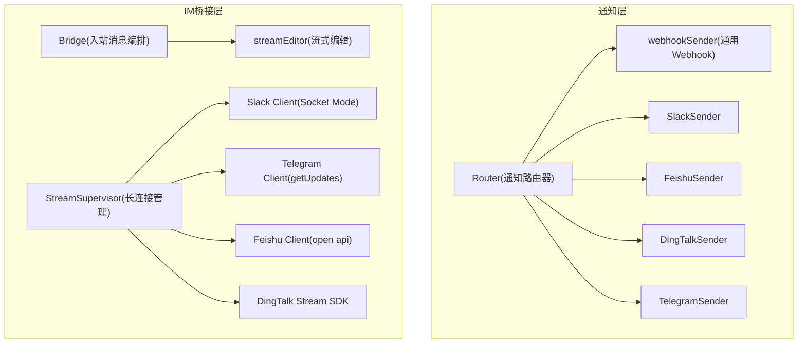

图表来源
- [internal/pkg/notify/notify.go:39-130](file://internal/pkg/notify/notify.go#L39-L130)
- [internal/pkg/notify/webhook.go:18-314](file://internal/pkg/notify/webhook.go#L18-L314)
- [internal/manager/biz/imbridge/bridge.go:50-236](file://internal/manager/biz/imbridge/bridge.go#L50-L236)
- [internal/manager/biz/imbridge/stream_supervisor.go:34-96](file://internal/manager/biz/imbridge/stream_supervisor.go#L34-L96)

章节来源
- [internal/pkg/notify/notify.go:39-130](file://internal/pkg/notify/notify.go#L39-L130)
- [internal/pkg/notify/webhook.go:18-314](file://internal/pkg/notify/webhook.go#L18-L314)
- [internal/manager/biz/imbridge/bridge.go:50-236](file://internal/manager/biz/imbridge/bridge.go#L50-L236)
- [internal/manager/biz/imbridge/stream_supervisor.go:34-96](file://internal/manager/biz/imbridge/stream_supervisor.go#L34-L96)

## 核心组件
- 标准化消息模型与发送器接口
  - Message：统一承载主题、正文、严重级别、来源、去重键、标签、发生时间
  - Sender：统一 Send(ctx, msg) 接口，所有渠道实现该接口
- 通知路由器 Router
  - 从配置或数据库加载启用渠道，按名称分发消息，支持超时控制与默认渠道
- Webhook 通用发送器
  - 支持自定义签名（HMAC-SHA256）、请求头注入、URL 签名等
- IM 桥接 Bridge
  - 解析入站消息、映射会话、驱动 AI 流式输出、按平台能力进行占位与编辑
- 流式编辑器 streamEditor
  - 对支持编辑的平台（Slack、Telegram、飞书）节流更新；不支持编辑的平台（钉钉）缓冲最终结果一次性回复
- 长连接管理器 StreamSupervisor
  - 周期扫描启用的 IM App，启动/停止/重建对应平台的长连接客户端，具备指数退避重连

章节来源
- [internal/pkg/notify/notify.go:22-130](file://internal/pkg/notify/notify.go#L22-L130)
- [internal/pkg/notify/webhook.go:18-314](file://internal/pkg/notify/webhook.go#L18-L314)
- [internal/manager/biz/imbridge/sender.go:13-175](file://internal/manager/biz/imbridge/sender.go#L13-L175)
- [internal/manager/biz/imbridge/bridge.go:98-236](file://internal/manager/biz/imbridge/bridge.go#L98-L236)
- [internal/manager/biz/imbridge/stream_supervisor.go:34-96](file://internal/manager/biz/imbridge/stream_supervisor.go#L34-L96)

## 架构总览
通知链路分为两条主线：
- 单向告警通知：Router → 具体 Sender（Webhook/Slack/飞书/钉钉/企业微信/Telegram）
- 双向 IM 对话：平台回调/长连接 → Bridge → 流式编辑器 → 平台消息编辑/回复

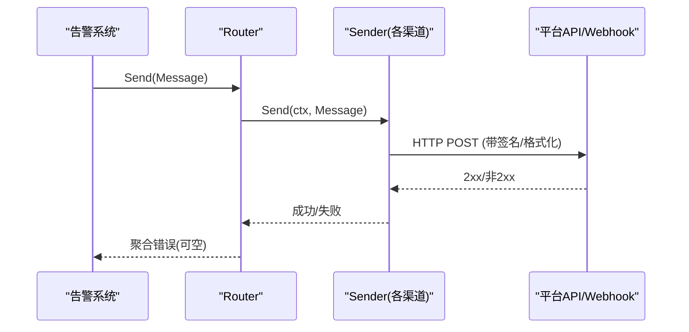

图表来源
- [internal/pkg/notify/notify.go:92-130](file://internal/pkg/notify/notify.go#L92-L130)
- [internal/pkg/notify/webhook.go:220-258](file://internal/pkg/notify/webhook.go#L220-L258)

章节来源
- [internal/pkg/notify/notify.go:92-130](file://internal/pkg/notify/notify.go#L92-L130)
- [internal/pkg/notify/webhook.go:220-258](file://internal/pkg/notify/webhook.go#L220-L258)

## 详细组件分析

### 通知路由器与标准化消息
- 路由规则
  - 未启用时直接丢弃
  - 必填字段校验（subject、severity、occurred_at）
  - 无显式渠道时使用默认渠道列表
  - 逐个渠道发送，收集错误并合并返回
- 配置装配
  - 从配置构建 senders（Webhook/Slack/飞书/钉钉）
  - 通过数据层种子函数将配置同步至 notification_channels 表

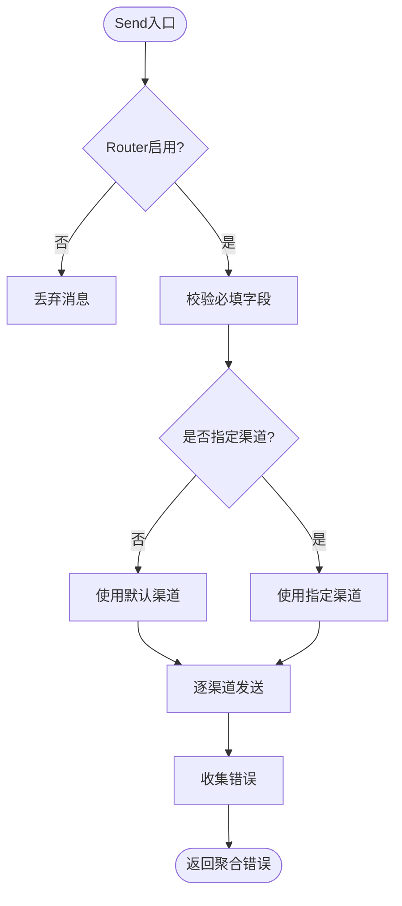

图表来源
- [internal/pkg/notify/notify.go:92-130](file://internal/pkg/notify/notify.go#L92-L130)
- [internal/manager/data/alert/store/seed.go:25-37](file://internal/manager/data/alert/store/seed.go#L25-L37)

章节来源
- [internal/pkg/notify/notify.go:92-130](file://internal/pkg/notify/notify.go#L92-L130)
- [internal/manager/data/alert/store/seed.go:25-37](file://internal/manager/data/alert/store/seed.go#L25-L37)

### Webhook 通用发送器
- 功能要点
  - 将标准化 Message 序列化为 JSON 并 POST
  - 可选签名：
    - 通用：在请求头添加 HMAC-SHA256 摘要
    - 飞书：在 JSON body 增加 timestamp 与 sign
    - 钉钉：在 URL 追加 timestamp 与 sign
  - 统一设置 Content-Type 与 User-Agent
- 错误处理
  - 仅接受 2xx 状态码，否则返回错误

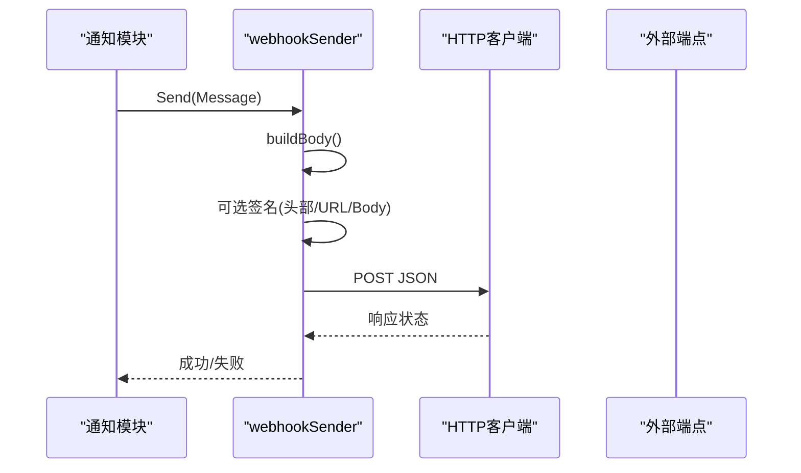

图表来源
- [internal/pkg/notify/webhook.go:220-258](file://internal/pkg/notify/webhook.go#L220-L258)
- [internal/pkg/notify/webhook.go:274-314](file://internal/pkg/notify/webhook.go#L274-L314)

章节来源
- [internal/pkg/notify/webhook.go:220-258](file://internal/pkg/notify/webhook.go#L220-L258)
- [internal/pkg/notify/webhook.go:274-314](file://internal/pkg/notify/webhook.go#L274-L314)

### Slack 渠道
- 认证
  - Socket Mode：使用 app_token 建立 WebSocket 接收事件；使用 bot_token 调用 chat.postMessage/chat.update
  - 配置为 JSON 对象，包含 app_token 与 bot_token
- 消息格式
  - 出站：Block Kit 富文本（sections/mrkdwn），同时保留顶层 text 用于预览
  - 入站：Socket Mode 接收事件
- 流式编辑
  - 先发送占位消息，后续通过 chat.update 以 ts 标识替换内容
- 错误处理
  - 统一解析 ok=false 的错误信息，便于定位 channel_not_found、invalid_auth 等问题

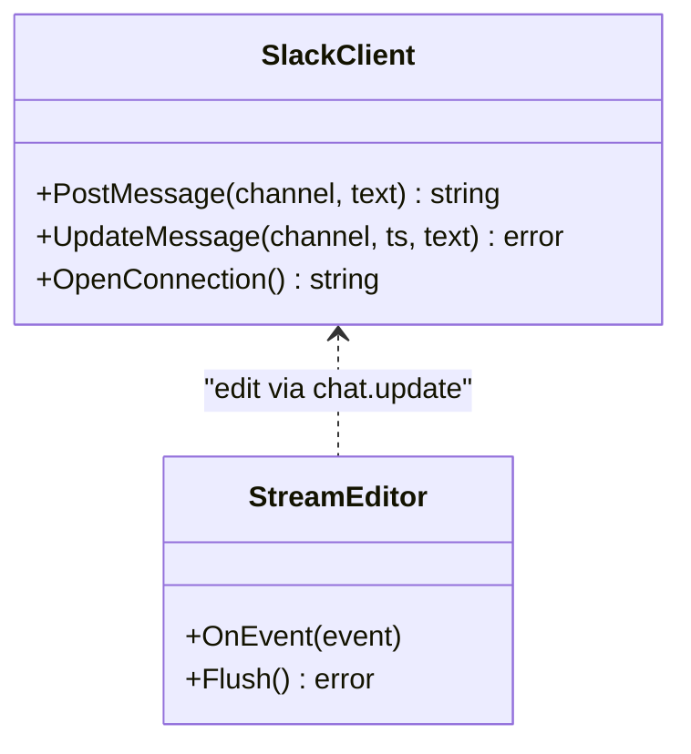

图表来源
- [internal/manager/biz/imbridge/provider/slack/client.go:166-215](file://internal/manager/biz/imbridge/provider/slack/client.go#L166-L215)
- [internal/manager/biz/imbridge/sender.go:126-159](file://internal/manager/biz/imbridge/sender.go#L126-L159)

章节来源
- [internal/manager/biz/imbridge/provider/slack/client.go:166-215](file://internal/manager/biz/imbridge/provider/slack/client.go#L166-L215)
- [internal/manager/biz/imbridge/sender.go:126-159](file://internal/manager/biz/imbridge/sender.go#L126-L159)

### Telegram 渠道
- 认证
  - Bot Token 嵌入 URL（/bot<TOKEN>/...）
- 消息格式
  - HTML 模式，禁用链接预览
- 流式编辑
  - editMessageText 支持渐进更新；当内容未变化会返回特定错误，被吞掉视为成功
- 限流与重试
  - 针对 429/5xx 做指数退避重试，尊重 retry_after，上限限制等待时长

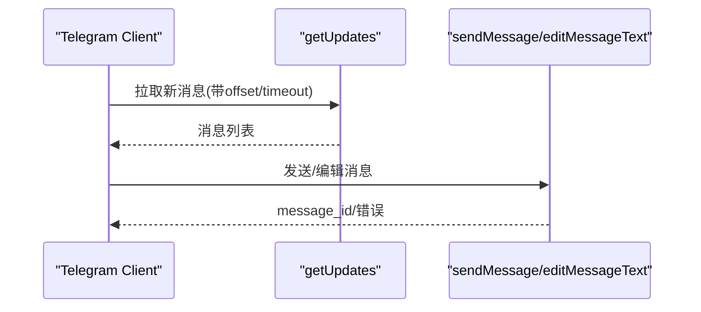

图表来源
- [internal/manager/biz/imbridge/provider/telegram/client.go:67-117](file://internal/manager/biz/imbridge/provider/telegram/client.go#L67-L117)
- [internal/manager/biz/imbridge/provider/telegram/client.go:155-184](file://internal/manager/biz/imbridge/provider/telegram/client.go#L155-L184)

章节来源
- [internal/manager/biz/imbridge/provider/telegram/client.go:67-117](file://internal/manager/biz/imbridge/provider/telegram/client.go#L67-L117)
- [internal/manager/biz/imbridge/provider/telegram/client.go:155-184](file://internal/manager/biz/imbridge/provider/telegram/client.go#L155-L184)

### 飞书渠道
- 认证
  - tenant_access_token 缓存与主动刷新（提前 200s 刷新）
- 消息格式
  - 原生富文本 post/md 节点，支持表格、任务列表、代码块
  - 当富文本负载接近 30 KiB 限制时自动降级为纯文本
- 流式编辑
  - 通过 PUT /messages/{message_id} 更新内容，需携带 msg_type
- 语言与本地化
  - 同时提供 zh_cn 与 en_us 内容，避免 UI 语言差异导致消息隐藏

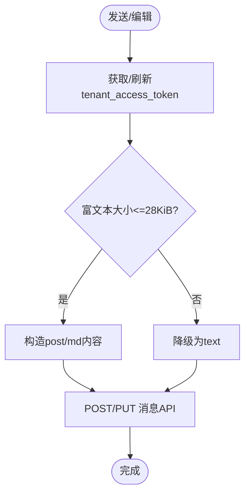

图表来源
- [internal/manager/biz/imbridge/provider/feishu/client.go:50-94](file://internal/manager/biz/imbridge/provider/feishu/client.go#L50-L94)
- [internal/manager/biz/imbridge/provider/feishu/client.go:96-145](file://internal/manager/biz/imbridge/provider/feishu/client.go#L96-L145)
- [internal/manager/biz/imbridge/provider/feishu/client.go:147-196](file://internal/manager/biz/imbridge/provider/feishu/client.go#L147-L196)
- [internal/manager/biz/imbridge/provider/feishu/client.go:198-224](file://internal/manager/biz/imbridge/provider/feishu/client.go#L198-L224)

章节来源
- [internal/manager/biz/imbridge/provider/feishu/client.go:50-94](file://internal/manager/biz/imbridge/provider/feishu/client.go#L50-L94)
- [internal/manager/biz/imbridge/provider/feishu/client.go:96-145](file://internal/manager/biz/imbridge/provider/feishu/client.go#L96-L145)
- [internal/manager/biz/imbridge/provider/feishu/client.go:147-196](file://internal/manager/biz/imbridge/provider/feishu/client.go#L147-L196)
- [internal/manager/biz/imbridge/provider/feishu/client.go:198-224](file://internal/manager/biz/imbridge/provider/feishu/client.go#L198-L224)

### 钉钉渠道
- 认证
  - 使用官方 Stream SDK 建立出站长连接，无需公网回调地址
- 消息格式
  - 基于 Markdown 的一次性回复（无法编辑历史消息）
- 流式行为
  - 由于不支持编辑，Bridge 会在收到完整答案后一次性回复
- 签名
  - Webhook 通道（告警）采用 URL 签名（timestamp + sign）

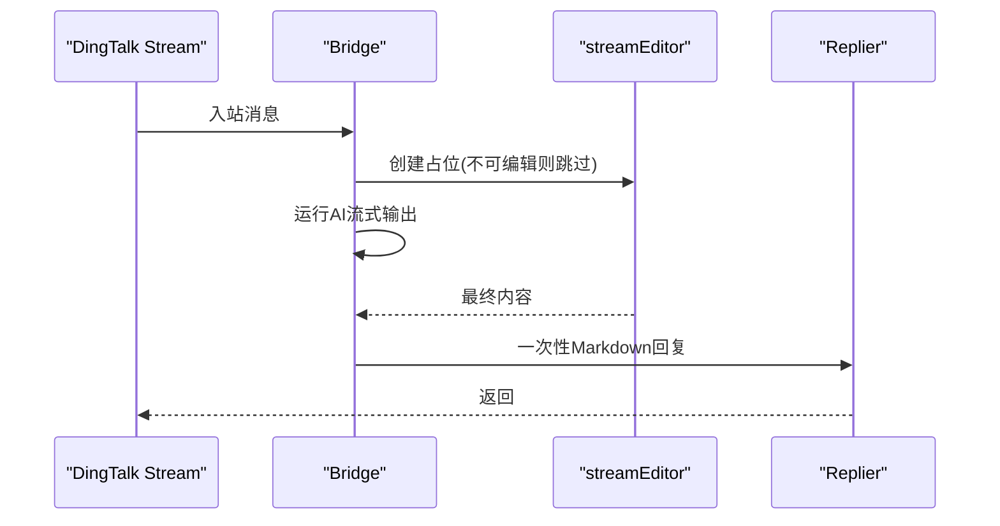

图表来源
- [internal/manager/biz/imbridge/provider/dingtalk/stream.go:41-78](file://internal/manager/biz/imbridge/provider/dingtalk/stream.go#L41-L78)
- [internal/manager/biz/imbridge/provider/dingtalk/stream.go:105-121](file://internal/manager/biz/imbridge/provider/dingtalk/stream.go#L105-L121)
- [internal/manager/biz/imbridge/sender.go:126-159](file://internal/manager/biz/imbridge/sender.go#L126-L159)

章节来源
- [internal/manager/biz/imbridge/provider/dingtalk/stream.go:41-78](file://internal/manager/biz/imbridge/provider/dingtalk/stream.go#L41-L78)
- [internal/manager/biz/imbridge/provider/dingtalk/stream.go:105-121](file://internal/manager/biz/imbridge/provider/dingtalk/stream.go#L105-L121)
- [internal/manager/biz/imbridge/sender.go:126-159](file://internal/manager/biz/imbridge/sender.go#L126-L159)

### IM 桥接与会话管理
- 会话映射
  - 每个聊天（含线程）映射到一个 ongrid 会话；支持命令重置会话
- 流式编辑
  - 支持编辑的平台：先发占位，再节流更新；不支持编辑的平台：缓冲最终结果
- 去重
  - 基于事件 ID 的去重集合，防止重复处理
- 语言指令
  - 根据渠道默认语言附加提示，确保回复语言一致

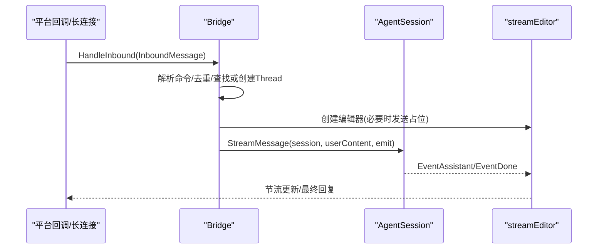

图表来源
- [internal/manager/biz/imbridge/bridge.go:98-236](file://internal/manager/biz/imbridge/bridge.go#L98-L236)
- [internal/manager/biz/imbridge/sender.go:126-159](file://internal/manager/biz/imbridge/sender.go#L126-L159)

章节来源
- [internal/manager/biz/imbridge/bridge.go:98-236](file://internal/manager/biz/imbridge/bridge.go#L98-L236)
- [internal/manager/biz/imbridge/sender.go:126-159](file://internal/manager/biz/imbridge/sender.go#L126-L159)

### 长连接管理与健康检查
- 生命周期
  - 周期扫描启用的 IM App，新增则启动，禁用则停止，密钥变更则重建
- 重连策略
  - 客户端异常退出后指数退避重连，最大间隔限制
- 健康检查
  - 通过 StreamSupervisor 的运行状态与日志判断连接健康度

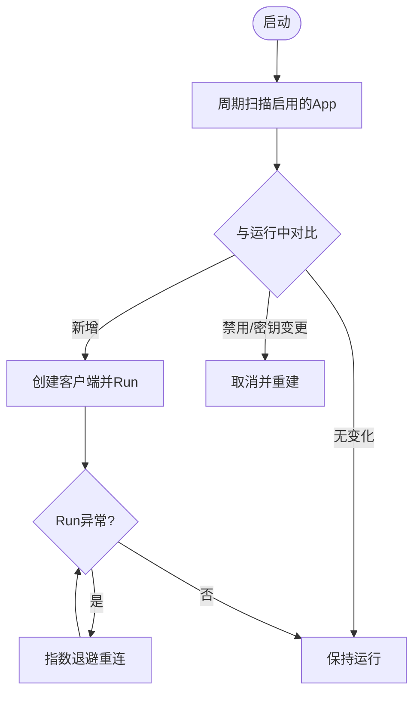

图表来源
- [internal/manager/biz/imbridge/stream_supervisor.go:80-96](file://internal/manager/biz/imbridge/stream_supervisor.go#L80-L96)
- [internal/manager/biz/imbridge/stream_supervisor.go:162-191](file://internal/manager/biz/imbridge/stream_supervisor.go#L162-L191)

章节来源
- [internal/manager/biz/imbridge/stream_supervisor.go:80-96](file://internal/manager/biz/imbridge/stream_supervisor.go#L80-L96)
- [internal/manager/biz/imbridge/stream_supervisor.go:162-191](file://internal/manager/biz/imbridge/stream_supervisor.go#L162-L191)

### 告警通知重试与交付追踪
- 重试工作器
  - 定期拉取失败的 delivery，按线性退避重新尝试发送
  - 若事件已解决，直接标记成功
- 交付记录
  - 每条 delivery 记录状态、尝试次数、请求/响应、错误信息、时间戳
- 指标与审计
  - 成功/失败写入 incident events，便于审计与度量

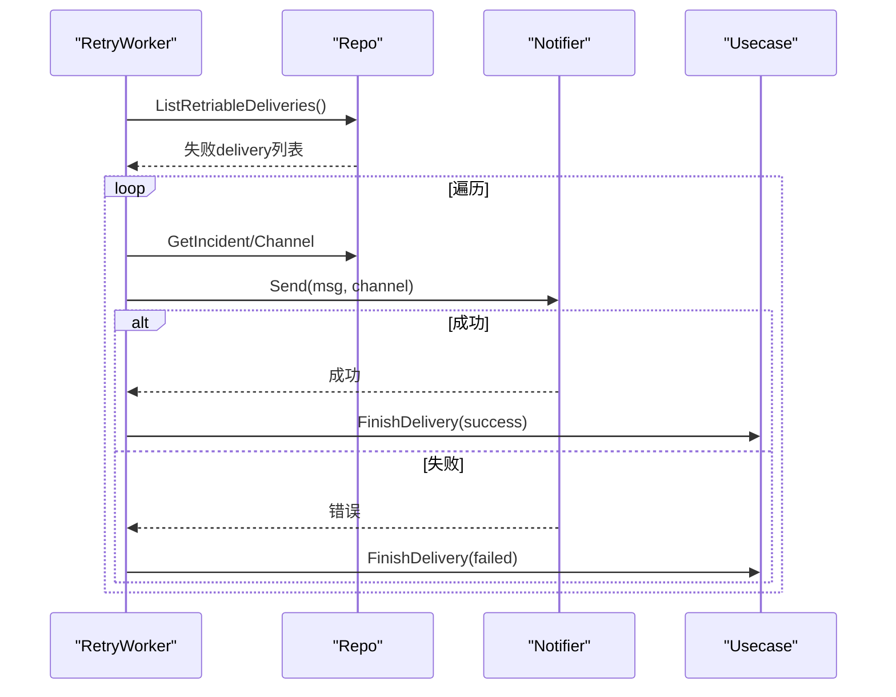

图表来源
- [internal/manager/biz/alert/retry.go:14-43](file://internal/manager/biz/alert/retry.go#L14-L43)
- [internal/manager/data/alert/store/repo.go:285-316](file://internal/manager/data/alert/store/repo.go#L285-L316)
- [internal/manager/model/alert/model.go:366-388](file://internal/manager/model/alert/model.go#L366-L388)
- [internal/manager/biz/alert/usecase.go:566-607](file://internal/manager/biz/alert/usecase.go#L566-L607)

章节来源
- [internal/manager/biz/alert/retry.go:14-43](file://internal/manager/biz/alert/retry.go#L14-L43)
- [internal/manager/data/alert/store/repo.go:285-316](file://internal/manager/data/alert/store/repo.go#L285-L316)
- [internal/manager/model/alert/model.go:366-388](file://internal/manager/model/alert/model.go#L366-L388)
- [internal/manager/biz/alert/usecase.go:566-607](file://internal/manager/biz/alert/usecase.go#L566-L607)

### 渠道管理 API
- 定义
  - 提供渠道的增删改查与测试接口
- 用途
  - 前端设置页管理渠道，支持测试连通性

章节来源
- [api/manager/notification/v1/notification.proto:37-90](file://api/manager/notification/v1/notification.proto#L37-L90)
- [internal/manager/service/alert/service.go:397-430](file://internal/manager/service/alert/service.go#L397-L430)

## 依赖关系分析
- 通知层
  - notify.Router 依赖各 Sender 实现（webhook、slack、feishu、dingtalk、telegram、wecom）
  - webhook.go 提供通用签名与格式化逻辑
- IM 桥接层
  - Bridge 依赖 AgentSession（aiops.Service 适配）与 Repo（im_threads 映射）
  - 各 Provider 实现各自平台的认证、消息与流式编辑
  - StreamSupervisor 管理长连接生命周期
- 数据层
  - alert store 提供渠道与交付记录查询
  - model 定义 Channel/Delivery 等实体

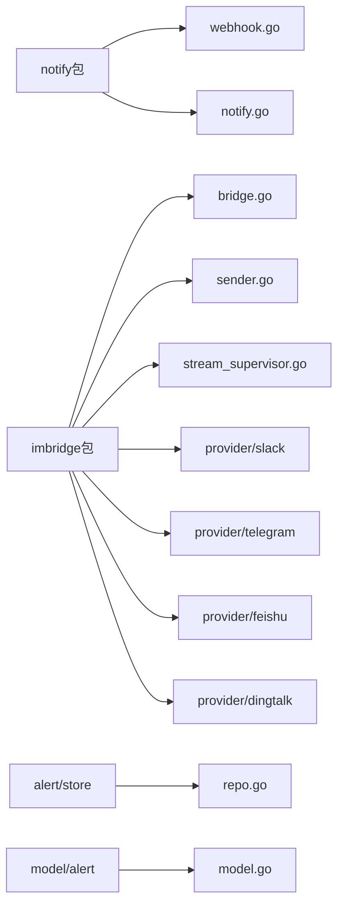

图表来源
- [internal/pkg/notify/notify.go:39-130](file://internal/pkg/notify/notify.go#L39-L130)
- [internal/pkg/notify/webhook.go:18-314](file://internal/pkg/notify/webhook.go#L18-L314)
- [internal/manager/biz/imbridge/bridge.go:50-236](file://internal/manager/biz/imbridge/bridge.go#L50-L236)
- [internal/manager/biz/imbridge/stream_supervisor.go:34-96](file://internal/manager/biz/imbridge/stream_supervisor.go#L34-L96)
- [internal/manager/data/alert/store/repo.go:271-316](file://internal/manager/data/alert/store/repo.go#L271-L316)
- [internal/manager/model/alert/model.go:366-388](file://internal/manager/model/alert/model.go#L366-L388)

章节来源
- [internal/pkg/notify/notify.go:39-130](file://internal/pkg/notify/notify.go#L39-L130)
- [internal/pkg/notify/webhook.go:18-314](file://internal/pkg/notify/webhook.go#L18-L314)
- [internal/manager/biz/imbridge/bridge.go:50-236](file://internal/manager/biz/imbridge/bridge.go#L50-L236)
- [internal/manager/biz/imbridge/stream_supervisor.go:34-96](file://internal/manager/biz/imbridge/stream_supervisor.go#L34-L96)
- [internal/manager/data/alert/store/repo.go:271-316](file://internal/manager/data/alert/store/repo.go#L271-L316)
- [internal/manager/model/alert/model.go:366-388](file://internal/manager/model/alert/model.go#L366-L388)

## 性能与可靠性
- 性能
  - 流式编辑节流：避免频繁编辑造成平台限流
  - 富文本大小检测：飞书超过阈值自动降级为纯文本
  - Telegram 限流重试：尊重 retry_after，限制最大等待时间
- 可靠性
  - 通知重试：线性退避，最多尝试次数，避免风暴
  - IM 长连接：指数退避重连，密钥轮换自动重建
  - 去重：基于事件 ID 防止重复处理
- 可观测性
  - 交付记录：request/response 与错误信息持久化
  - 事件审计：成功/失败写入 incident events

[本节为通用指导，不直接分析具体文件]

## 故障排查指南
- 常见问题
  - 渠道未启用或无默认渠道：Router 会返回“未配置渠道”错误
  - Webhook 签名失败：检查 secret 与签名算法（通用/飞书/钉钉）
  - 平台错误：如 Slack 的 invalid_auth/channel_not_found，Telegram 的 429/5xx
  - 飞书 token 过期：检查 tenant_access_token 刷新逻辑
  - 钉钉会话 webhook 缺失：无法编辑消息，将退回一次性回复
- 排查步骤
  - 查看 delivery 表的 request/response 与错误信息
  - 检查 RetryWorker 的重试次数与退避时间
  - 确认 StreamSupervisor 的运行状态与重连日志
  - 验证渠道配置与密钥是否正确

章节来源
- [internal/pkg/notify/notify.go:92-130](file://internal/pkg/notify/notify.go#L92-L130)
- [internal/pkg/notify/webhook.go:274-314](file://internal/pkg/notify/webhook.go#L274-L314)
- [internal/manager/biz/imbridge/provider/telegram/client.go:67-117](file://internal/manager/biz/imbridge/provider/telegram/client.go#L67-L117)
- [internal/manager/biz/imbridge/provider/feishu/client.go:50-94](file://internal/manager/biz/imbridge/provider/feishu/client.go#L50-L94)
- [internal/manager/biz/imbridge/provider/dingtalk/stream.go:105-121](file://internal/manager/biz/imbridge/provider/dingtalk/stream.go#L105-L121)
- [internal/manager/data/alert/store/repo.go:285-316](file://internal/manager/data/alert/store/repo.go#L285-L316)
- [internal/manager/model/alert/model.go:366-388](file://internal/manager/model/alert/model.go#L366-L388)

## 结论
本方案通过统一的标准化消息与发送器接口，实现了多平台通知与 IM 桥接。Webhook 通用发送器提供了灵活的签名与格式化能力；IM 桥接层通过流式编辑与长连接管理，提升了用户体验与系统稳定性。配合重试与交付追踪，保证了通知的可靠送达。

[本节为总结，不直接分析具体文件]

## 附录：配置示例与最佳实践
- 配置要点
  - Webhook：填写 endpoint 与 secret（可选），用于通用签名
  - Slack：配置 app_token 与 bot_token（JSON），启用 Socket Mode
  - 飞书：配置 app_id 与 app_secret，注意租户访问令牌刷新
  - 钉钉：配置 app_id 与 app_secret，使用 Stream SDK 出站连接
  - Telegram：配置 bot token，使用 getUpdates 拉取消息
- 最佳实践
  - 合理设置 Router 超时与默认渠道
  - 使用 delivery 表与 incident events 进行审计与排障
  - 对高并发场景启用流式编辑节流与平台限流重试
  - 定期轮换密钥并验证渠道连通性

章节来源
- [internal/pkg/notify/webhook.go:27-192](file://internal/pkg/notify/webhook.go#L27-L192)
- [internal/manager/biz/imbridge/provider/slack/client.go:30-68](file://internal/manager/biz/imbridge/provider/slack/client.go#L30-L68)
- [internal/manager/biz/imbridge/provider/feishu/client.go:37-48](file://internal/manager/biz/imbridge/provider/feishu/client.go#L37-L48)
- [internal/manager/biz/imbridge/provider/dingtalk/stream.go:123-131](file://internal/manager/biz/imbridge/provider/dingtalk/stream.go#L123-L131)
- [internal/manager/biz/imbridge/provider/telegram/client.go:48-55](file://internal/manager/biz/imbridge/provider/telegram/client.go#L48-L55)
- [internal/manager/data/alert/store/seed.go:25-37](file://internal/manager/data/alert/store/seed.go#L25-L37)

## 扩展指南：新增通知渠道适配器
- 步骤
  - 实现 Sender 接口（Name 与 Send）
  - 如需签名或特殊格式化，复用 webhookSender 的 buildBody 与 signTarget
  - 在 NewFromConfig 中注册新渠道（或数据层种子函数中登记）
  - 若为双向 IM，实现平台 Client 与 StreamClient，并在 StreamSupervisor 中注册工厂
- 注意事项
  - 遵循平台限流与重试策略
  - 保证消息格式与富文本兼容
  - 完善错误信息与日志，便于排障

[本节为通用指导，不直接分析具体文件]