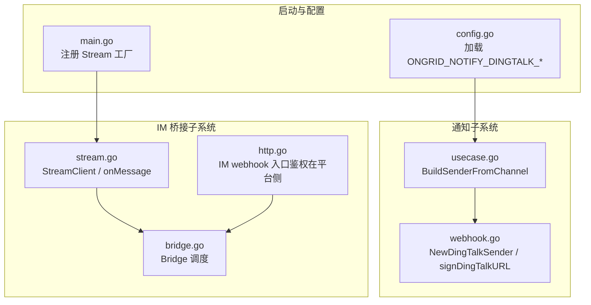
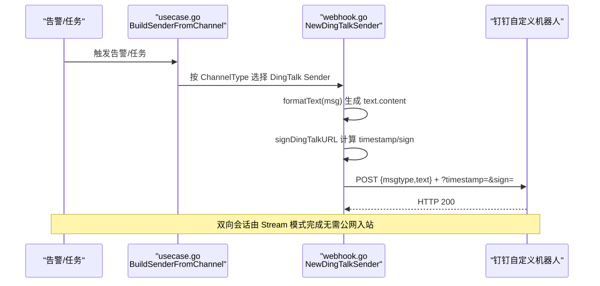
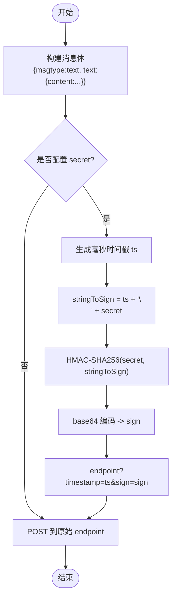
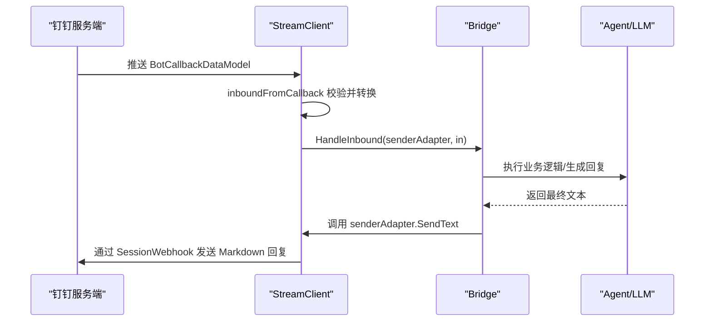
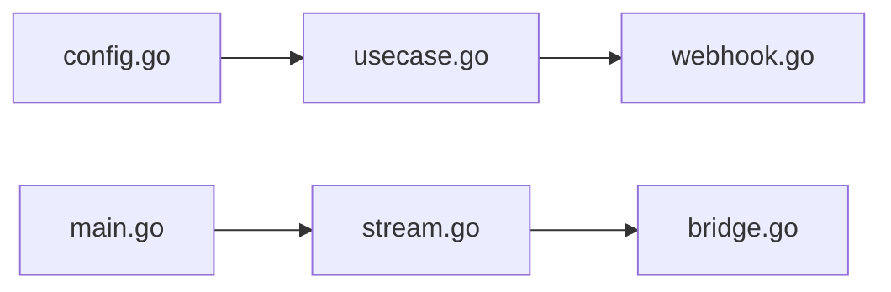

# 钉钉渠道集成

<cite>
**本文引用的文件**
- [webhook.go](file://internal/pkg/notify/webhook.go)
- [stream.go](file://internal/manager/biz/imbridge/provider/dingtalk/stream.go)
- [main.go](file://cmd/ongrid/main.go)
- [config.go](file://internal/pkg/config/config.go)
- [usecase.go](file://internal/manager/biz/alert/usecase.go)
- [http.go](file://internal/manager/server/imbridge/http.go)
- [bridge.go](file://internal/manager/biz/imbridge/bridge.go)
- [notify_signed_test.go](file://tests/e2e/notify_signed_test.go)
</cite>

## 目录
1. [简介](#简介)
2. [项目结构](#项目结构)
3. [核心组件](#核心组件)
4. [架构总览](#架构总览)
5. [详细组件分析](#详细组件分析)
6. [依赖关系分析](#依赖关系分析)
7. [性能与可靠性](#性能与可靠性)
8. [故障排查指南](#故障排查指南)
9. [结论](#结论)
10. [附录：配置与部署要点](#附录配置与部署要点)

## 简介
本文件面向“钉钉渠道集成”，覆盖两类能力：
- 单向通知（告警/巡检/AIOps 等）通过钉钉自定义机器人 Webhook 发送消息，并在 URL 中附加签名参数。
- 双向会话（IM Bridge）通过钉钉官方 Stream SDK 建立出站长连接，接收用户消息并回复 Markdown 内容。

文档重点说明：
- 钉钉自定义机器人的认证机制与 URL 签名验证流程（时间戳、HMAC-SHA256、URL 参数拼接）。
- 钉钉消息格式要求与 text.content 字段的文本渲染规则。
- 如何创建钉钉机器人、获取 Webhook URL 与安全设置。
- 完整使用示例：消息发送、签名验证、流式通信。
- 企业版与公共版的差异说明与部署注意事项。

## 项目结构
本项目将“通知”和“IM 桥接”解耦为两个子系统：
- 通知子系统：负责构造各平台的消息体与签名，并通过 HTTP 发送。钉钉通道位于 internal/pkg/notify/webhook.go。
- IM 桥接子系统：负责与钉钉官方 Stream 服务建立长连接，处理回调消息并调用业务层进行对话。钉钉提供者位于 internal/manager/biz/imbridge/provider/dingtalk/stream.go。

图表来源
- [webhook.go:157-165](file://internal/pkg/notify/webhook.go#L157-L165)
- [webhook.go:293-313](file://internal/pkg/notify/webhook.go#L293-L313)
- [stream.go:17-54](file://internal/manager/biz/imbridge/provider/dingtalk/stream.go#L17-L54)
- [bridge.go:50-81](file://internal/manager/biz/imbridge/bridge.go#L50-L81)
- [http.go:1-40](file://internal/manager/server/imbridge/http.go#L1-L40)
- [main.go:1669-1692](file://cmd/ongrid/main.go#L1669-L1692)
- [config.go:527-534](file://internal/pkg/config/config.go#L527-L534)

章节来源
- [webhook.go:157-165](file://internal/pkg/notify/webhook.go#L157-L165)
- [webhook.go:293-313](file://internal/pkg/notify/webhook.go#L293-L313)
- [stream.go:17-54](file://internal/manager/biz/imbridge/provider/dingtalk/stream.go#L17-L54)
- [main.go:1669-1692](file://cmd/ongrid/main.go#L1669-L1692)
- [config.go:527-534](file://internal/pkg/config/config.go#L527-L534)

## 核心组件
- 通知发送器（钉钉）：负责构建钉钉自定义机器人消息体，并在 URL 上追加 timestamp 与 sign 查询参数。
- IM 桥接（钉钉 Stream）：通过官方 SDK 建立出站连接，接收回调消息，转换为内部 InboundMessage，交由 Bridge 统一处理。
- 启动装配：主程序注册钉钉 Stream 工厂；配置模块加载环境变量到通知配置。
- 告警路由：根据 ChannelType 选择 DingTalk Sender 并投递。

章节来源
- [webhook.go:157-165](file://internal/pkg/notify/webhook.go#L157-L165)
- [webhook.go:293-313](file://internal/pkg/notify/webhook.go#L293-L313)
- [stream.go:17-54](file://internal/manager/biz/imbridge/provider/dingtalk/stream.go#L17-L54)
- [main.go:1669-1692](file://cmd/ongrid/main.go#L1669-L1692)
- [usecase.go:1520-1549](file://internal/manager/biz/alert/usecase.go#L1520-L1549)
- [config.go:527-534](file://internal/pkg/config/config.go#L527-L534)

## 架构总览
下图展示“通知”与“IM 桥接”两条路径的端到端交互。

图表来源
- [usecase.go:1520-1549](file://internal/manager/biz/alert/usecase.go#L1520-L1549)
- [webhook.go:157-165](file://internal/pkg/notify/webhook.go#L157-L165)
- [webhook.go:260-272](file://internal/pkg/notify/webhook.go#L260-L272)
- [webhook.go:293-313](file://internal/pkg/notify/webhook.go#L293-L313)

## 详细组件分析

### 钉钉通知通道：消息体与 URL 签名
- 消息体
  - msgtype: "text"
  - text.content: 由 formatText 生成，包含级别、主题、正文、来源、去重键等，以换行拼接。
- URL 签名
  - 当配置了 secret 时，signDingTalkURL 会：
    - 取当前毫秒级时间戳 ts = UnixMilli()
    - 计算 stringToSign = ts + "\n" + secret
    - 使用 HMAC-SHA256(secret, stringToSign) 得到签名
    - base64 编码后作为 sign 查询参数
    - 将 timestamp 与 sign 追加到 endpoint 的 query 中
- 发送过程
  - 构造 JSON body，设置 Content-Type 为 application/json
  - 若配置了 secret，则先对 endpoint 进行签名处理，再发起请求
  - 响应码非 2xx 视为失败

图表来源
- [webhook.go:157-165](file://internal/pkg/notify/webhook.go#L157-L165)
- [webhook.go:260-272](file://internal/pkg/notify/webhook.go#L260-L272)
- [webhook.go:293-313](file://internal/pkg/notify/webhook.go#L293-L313)

章节来源
- [webhook.go:157-165](file://internal/pkg/notify/webhook.go#L157-L165)
- [webhook.go:260-272](file://internal/pkg/notify/webhook.go#L260-L272)
- [webhook.go:293-313](file://internal/pkg/notify/webhook.go#L293-L313)
- [usecase.go:1520-1549](file://internal/manager/biz/alert/usecase.go#L1520-L1549)

### 钉钉 IM 桥接：Stream 长连接与回调处理
- 启动与连接
  - 主程序在启动时注册钉钉 Stream 工厂，运行期由 Supervisor 管理每个 ImApp 的连接生命周期。
  - StreamClient 使用 AppID/AppSecret 建立出站连接，并注册聊天机器人回调处理器。
- 消息入站
  - 收到回调后，仅接受 text 类型且 content 非空的消息，提取 ConversationId、SessionWebhook、SenderNick、SenderStaffId/SenderId、MsgId 等字段，封装为 InboundMessage。
  - 通过 Bridge.HandleInbound 进入业务层，后续可调用 LLM/工具链进行处理。
- 消息回发
  - 由于钉钉单条会话 Webhook 不支持编辑历史消息，实现采用“缓冲输出，最终一次性 Markdown 回复”的策略。
  - senderAdapter.SendText 将最终结果以 Markdown 形式通过 SessionWebhook 回复。

图表来源
- [stream.go:17-54](file://internal/manager/biz/imbridge/provider/dingtalk/stream.go#L17-L54)
- [stream.go:56-99](file://internal/manager/biz/imbridge/provider/dingtalk/stream.go#L56-L99)
- [stream.go:105-121](file://internal/manager/biz/imbridge/provider/dingtalk/stream.go#L105-L121)
- [bridge.go:50-81](file://internal/manager/biz/imbridge/bridge.go#L50-L81)
- [main.go:1669-1692](file://cmd/ongrid/main.go#L1669-L1692)

章节来源
- [stream.go:17-54](file://internal/manager/biz/imbridge/provider/dingtalk/stream.go#L17-L54)
- [stream.go:56-99](file://internal/manager/biz/imbridge/provider/dingtalk/stream.go#L56-L99)
- [stream.go:105-121](file://internal/manager/biz/imbridge/provider/dingtalk/stream.go#L105-L121)
- [bridge.go:50-81](file://internal/manager/biz/imbridge/bridge.go#L50-L81)
- [main.go:1669-1692](file://cmd/ongrid/main.go#L1669-L1692)

### 配置与环境变量
- 通知通道环境变量（用于启动时注入默认通道）：
  - ONGRID_NOTIFY_DINGTALK_ENABLED
  - ONGRID_NOTIFY_DINGTALK_NAME
  - ONGRID_NOTIFY_DINGTALK_WEBHOOK_URL
  - ONGRID_NOTIFY_DINGTALK_SECRET
- 这些值会被加载到 NotificationConfig.DingTalk，并在需要时通过 BuildSenderFromChannel 构造 DingTalk Sender。

章节来源
- [config.go:527-534](file://internal/pkg/config/config.go#L527-L534)
- [usecase.go:1520-1549](file://internal/manager/biz/alert/usecase.go#L1520-L1549)

### 安全与鉴权
- 通知通道：当配置了 secret 时，所有请求会在 URL 上附带 timestamp 与 sign，签名算法为 HMAC-SHA256(base64(HMAC-SHA256(secret, "<timestamp>\n<secret>")))。
- IM 桥接：采用官方 Stream 出站连接，无需暴露公网入站；鉴权由 AppID/AppSecret 控制。
- IM webhook 入口：对外部 webhook 的鉴权由平台签名方案承担，handler 层不依赖 JWT。

章节来源
- [webhook.go:293-313](file://internal/pkg/notify/webhook.go#L293-L313)
- [stream.go:17-54](file://internal/manager/biz/imbridge/provider/dingtalk/stream.go#L17-L54)
- [http.go:1-40](file://internal/manager/server/imbridge/http.go#L1-L40)

## 依赖关系分析
- 通知链路依赖：
  - usecase.go 根据 ChannelType 选择 DingTalk Sender
  - webhook.go 提供 NewDingTalkSender 与 signDingTalkURL
  - config.go 提供环境变量到配置的映射
- IM 链路依赖：
  - main.go 注册钉钉 Stream 工厂
  - stream.go 使用官方 SDK 建立连接并处理回调
  - bridge.go 提供统一的入站消息处理与去重

图表来源
- [config.go:527-534](file://internal/pkg/config/config.go#L527-L534)
- [usecase.go:1520-1549](file://internal/manager/biz/alert/usecase.go#L1520-L1549)
- [webhook.go:157-165](file://internal/pkg/notify/webhook.go#L157-L165)
- [main.go:1669-1692](file://cmd/ongrid/main.go#L1669-L1692)
- [stream.go:17-54](file://internal/manager/biz/imbridge/provider/dingtalk/stream.go#L17-L54)
- [bridge.go:50-81](file://internal/manager/biz/imbridge/bridge.go#L50-L81)

章节来源
- [config.go:527-534](file://internal/pkg/config/config.go#L527-L534)
- [usecase.go:1520-1549](file://internal/manager/biz/alert/usecase.go#L1520-L1549)
- [webhook.go:157-165](file://internal/pkg/notify/webhook.go#L157-L165)
- [main.go:1669-1692](file://cmd/ongrid/main.go#L1669-L1692)
- [stream.go:17-54](file://internal/manager/biz/imbridge/provider/dingtalk/stream.go#L17-L54)
- [bridge.go:50-81](file://internal/manager/biz/imbridge/bridge.go#L50-L81)

## 性能与可靠性
- 通知通道
  - 单次 POST 请求，超时由 Router 控制；错误码非 2xx 即失败。
  - 签名计算开销极低（HMAC-SHA256 + base64），不影响吞吐。
- IM 桥接
  - 使用官方 Stream SDK 维护长连接，自动重连；关闭时显式禁用自动重连以避免旧凭据残留。
  - 回调处理使用 goroutine 异步执行，避免阻塞回调线程；panic 被捕获并记录堆栈。
  - 回复策略为“最终一次性 Markdown 回复”，减少频繁小消息带来的网络与 UI 抖动。

[本节为通用指导，不直接分析具体文件]

## 故障排查指南
- 通知通道常见问题
  - 未配置 secret：不会附加签名参数，钉钉侧需允许无签名或已配置白名单。
  - 时间戳漂移：钉钉服务端通常对时间戳有容忍窗口，确保服务器时钟同步。
  - 签名不匹配：检查 secret 是否与机器人配置一致；确认 stringToSign 为 "<timestamp>\n<secret>"。
  - 响应异常：检查 HTTP 状态码与钉钉返回的错误码。
- IM 桥接常见问题
  - 无法建立连接：检查 AppID/AppSecret 是否正确；网络出站可达性。
  - 收不到消息：确认 Stream 已启动且回调路由已注册；检查日志中的 start dingtalk stream 与 onMessage 相关条目。
  - 无法回复：确认 SessionWebhook 存在；Markdown 回复失败会记录错误。

章节来源
- [webhook.go:220-258](file://internal/pkg/notify/webhook.go#L220-L258)
- [webhook.go:293-313](file://internal/pkg/notify/webhook.go#L293-L313)
- [stream.go:41-54](file://internal/manager/biz/imbridge/provider/dingtalk/stream.go#L41-L54)
- [stream.go:56-78](file://internal/manager/biz/imbridge/provider/dingtalk/stream.go#L56-L78)

## 结论
本项目对钉钉渠道提供了两种集成方式：
- 通知通道：通过自定义机器人 Webhook 发送结构化文本，并在 URL 中携带基于 HMAC-SHA256 的签名参数，适合告警与巡检等单向场景。
- IM 桥接：通过官方 Stream SDK 建立出站长连接，接收用户消息并以 Markdown 形式回复，适合双向会话与交互式运维。

两者均具备完善的错误处理与可观测性，便于在生产环境稳定运行。

[本节为总结，不直接分析具体文件]

## 附录：配置与部署要点

### 创建钉钉机器人并获取 Webhook URL
- 在钉钉群中添加“自定义机器人”，选择“加签”安全模式，复制生成的 Secret。
- 机器人会提供一个 Webhook 地址，形如 https://oapi.dingtalk.com/robot/send?access_token=...
- 将该地址填入通知通道的 endpoint，并将 Secret 填入 secret。

### 配置通知通道（环境变量）
- 启用与标识：
  - ONGRID_NOTIFY_DINGTALK_ENABLED=true
  - ONGRID_NOTIFY_DINGTALK_NAME=dingtalk
- 目标地址与密钥：
  - ONGRID_NOTIFY_DINGTALK_WEBHOOK_URL=https://oapi.dingtalk.com/robot/send?access_token=...
  - ONGRID_NOTIFY_DINGTALK_SECRET=<机器人加签密钥>

### 配置 IM 桥接（Stream 模式）
- 在 IM 应用中配置 provider=dingtalk，mode=stream，并填写 AppID 与 AppSecret。
- 应用启动后会自动建立出站连接，无需暴露公网入站。

### 企业版与公共版差异
- 公共版：支持自定义机器人 Webhook 与 Stream 模式的基本功能。
- 企业版：可能涉及更严格的网络策略与权限控制，建议：
  - 确保出站访问钉钉 API 与 Stream 域名可达。
  - 如需内网隔离，可通过反向代理或网关转发至钉钉开放平台。
  - 结合组织安全策略，限制 IM 应用的 allow_from 白名单（针对其他平台如 Telegram/Slack 更安全，钉钉 Stream 本身为出站连接）。

### 使用示例
- 发送通知（告警/巡检）
  - 通过 Settings → Notifications 添加 DingTalk 通道，或配置上述环境变量。
  - 触发告警后，系统会构造 text.content 并附带 URL 签名发送到钉钉。
- 签名验证（服务端视角）
  - 钉钉会校验 URL 上的 timestamp 与 sign；若不一致则拒绝请求。
  - 验证逻辑与实现参考 signDingTalkURL。
- 流式通信（IM 桥接）
  - 用户在钉钉群 @机器人 发送消息，系统通过 Stream 接收并回复 Markdown 内容。
  - 回复策略为最终一次性 Markdown 回复，避免多次小消息刷屏。

章节来源
- [webhook.go:157-165](file://internal/pkg/notify/webhook.go#L157-L165)
- [webhook.go:293-313](file://internal/pkg/notify/webhook.go#L293-L313)
- [config.go:527-534](file://internal/pkg/config/config.go#L527-L534)
- [stream.go:17-54](file://internal/manager/biz/imbridge/provider/dingtalk/stream.go#L17-L54)
- [notify_signed_test.go:99-175](file://tests/e2e/notify_signed_test.go#L99-L175)