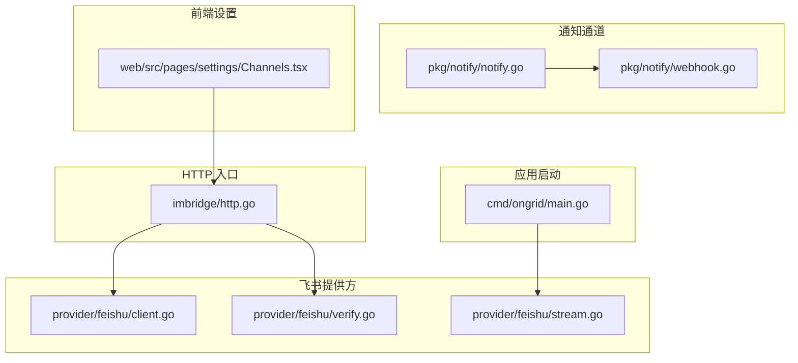
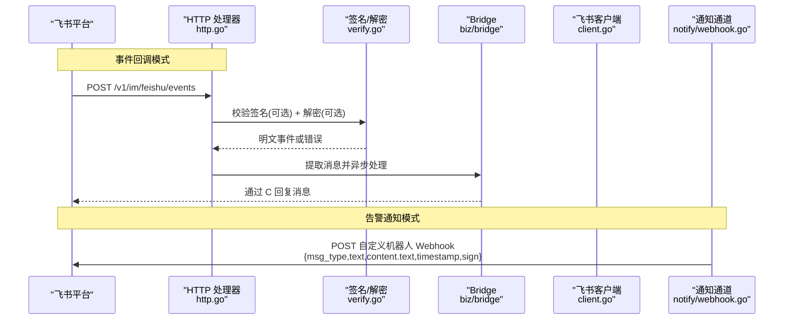
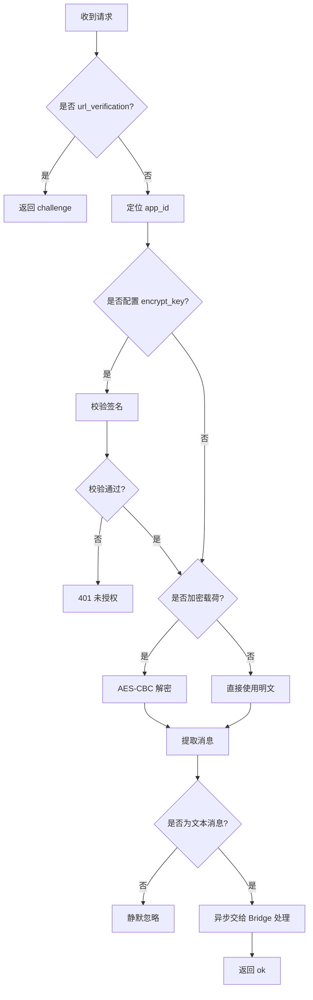
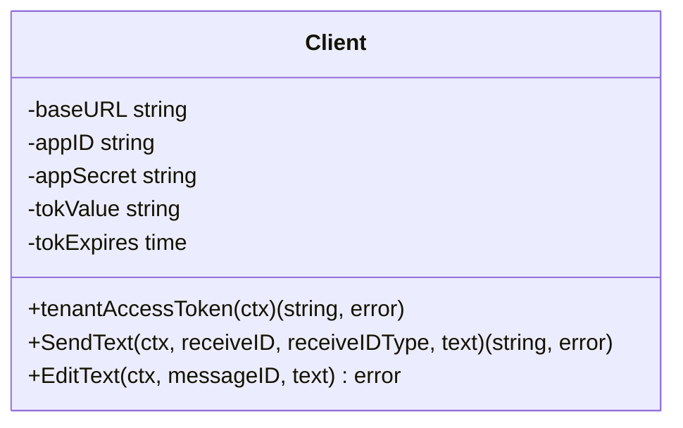
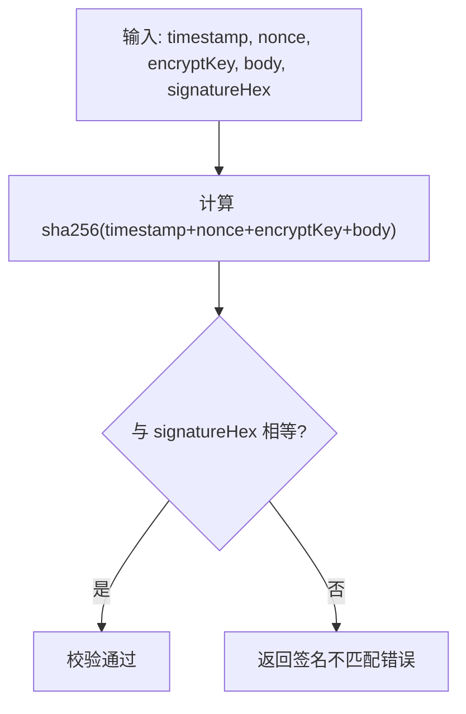
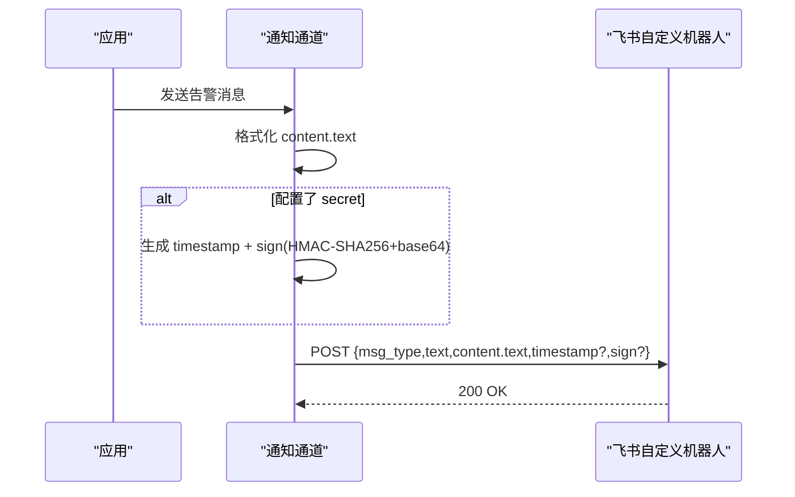
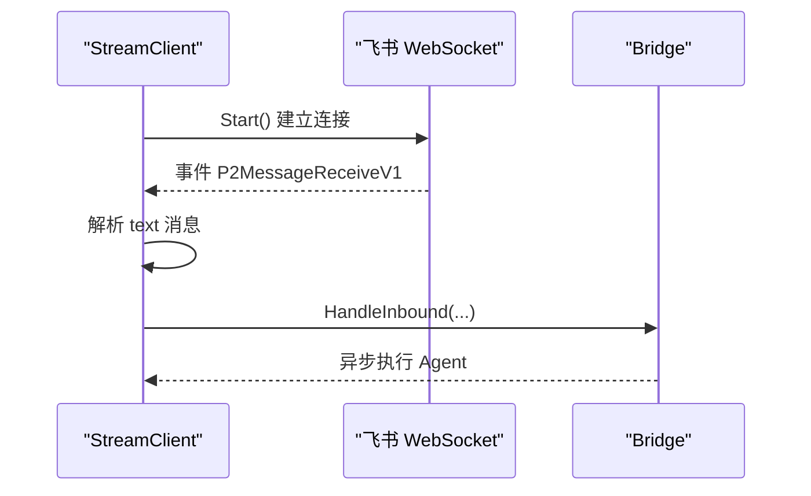
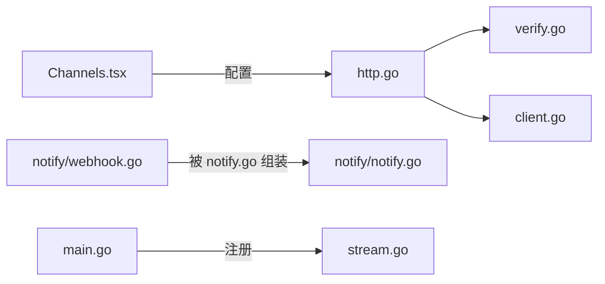

# 飞书渠道集成

<cite>
**本文引用的文件**
- [internal/manager/server/imbridge/http.go](file://internal/manager/server/imbridge/http.go)
- [internal/manager/biz/imbridge/provider/feishu/client.go](file://internal/manager/biz/imbridge/provider/feishu/client.go)
- [internal/manager/biz/imbridge/provider/feishu/stream.go](file://internal/manager/biz/imbridge/provider/feishu/stream.go)
- [internal/manager/biz/imbridge/provider/feishu/verify.go](file://internal/manager/biz/imbridge/provider/feishu/verify.go)
- [internal/pkg/notify/webhook.go](file://internal/pkg/notify/webhook.go)
- [internal/pkg/notify/notify.go](file://internal/pkg/notify/notify.go)
- [cmd/ongrid/main.go](file://cmd/ongrid/main.go)
- [web/src/pages/settings/Channels.tsx](file://web/src/pages/settings/Channels.tsx)
- [tests/e2e/notify_signed_test.go](file://tests/e2e/notify_signed_test.go)
</cite>

## 目录
1. [简介](#简介)
2. [项目结构](#项目结构)
3. [核心组件](#核心组件)
4. [架构总览](#架构总览)
5. [详细组件分析](#详细组件分析)
6. [依赖关系分析](#依赖关系分析)
7. [性能与可靠性](#性能与可靠性)
8. [故障排查指南](#故障排查指南)
9. [结论](#结论)
10. [附录：使用示例与配置清单](#附录使用示例与配置清单)

## 简介
本文件面向“飞书渠道集成”，系统性说明本项目中飞书（含企业版 Lark）的两种接入模式：
- 事件回调（Webhook）：通过 HTTP 接收飞书事件，完成签名校验、解密与消息解析。
- 长连接（Stream）：主动拨号至飞书 WebSocket，订阅事件，无需公网 Webhook。

同时覆盖告警通知场景下的飞书自定义机器人发送流程，包括 HMAC 签名算法、timestamp 生成与 base64 编码、content 文本渲染规则，以及错误处理与兼容性注意事项。

## 项目结构
围绕飞书集成的关键代码分布在以下模块：
- IM 桥接 HTTP 入口：负责路由、签名验证、解密、消息提取与异步处理。
- 飞书客户端：封装 tenant_access_token 缓存、富文本消息发送与编辑。
- 飞书签名与解密：实现 v2 事件签名校验与 AES-CBC 解密。
- 通知通道：面向告警等场景的飞书自定义机器人发送器，包含签名与内容格式化。
- 启动装配：注册 Stream 工厂与公共路由。
- 前端设置页：提供 verify_token、encrypt_key 等字段配置。

图表来源
- [internal/manager/server/imbridge/http.go:105-226](file://internal/manager/server/imbridge/http.go#L105-L226)
- [internal/manager/biz/imbridge/provider/feishu/client.go:50-145](file://internal/manager/biz/imbridge/provider/feishu/client.go#L50-L145)
- [internal/manager/biz/imbridge/provider/feishu/verify.go:17-69](file://internal/manager/biz/imbridge/provider/feishu/verify.go#L17-L69)
- [internal/manager/biz/imbridge/provider/feishu/stream.go:16-53](file://internal/manager/biz/imbridge/provider/feishu/stream.go#L16-L53)
- [internal/pkg/notify/webhook.go:141-155](file://internal/pkg/notify/webhook.go#L141-L155)
- [internal/pkg/notify/notify.go:75-90](file://internal/pkg/notify/notify.go#L75-L90)
- [cmd/ongrid/main.go:1669-1692](file://cmd/ongrid/main.go#L1669-L1692)
- [web/src/pages/settings/Channels.tsx:533-560](file://web/src/pages/settings/Channels.tsx#L533-L560)

章节来源
- [internal/manager/server/imbridge/http.go:1-81](file://internal/manager/server/imbridge/http.go#L1-L81)
- [cmd/ongrid/main.go:1669-1692](file://cmd/ongrid/main.go#L1669-L1692)

## 核心组件
- 事件回调处理器：解析请求体、URL 验证握手、按 app_id 查找应用、签名校验、可选解密、提取消息并异步交由 Bridge 处理。
- 飞书客户端：维护 tenant_access_token 缓存；将 Markdown 转为飞书原生 post/md 节点；支持大消息回退为 text；发送与编辑消息。
- 签名与解密：v2 事件签名（SHA-256 拼接 timestamp + nonce + encryptKey + body），AES-256-CBC 解密（PKCS#7）。
- 通知通道：构建飞书自定义机器人 payload（msg_type=text, content.text），当配置 secret 时附加 timestamp 与 sign（HMAC-SHA256 + base64）。
- 启动装配：注册 Stream 工厂，启用长连接模式；公共路由暴露 /v1/im/feishu/events。
- 前端设置：提供 verify_token 与 encrypt_key 输入框，用于事件回调安全配置。

章节来源
- [internal/manager/server/imbridge/http.go:105-226](file://internal/manager/server/imbridge/http.go#L105-L226)
- [internal/manager/biz/imbridge/provider/feishu/client.go:19-145](file://internal/manager/biz/imbridge/provider/feishu/client.go#L19-L145)
- [internal/manager/biz/imbridge/provider/feishu/verify.go:17-69](file://internal/manager/biz/imbridge/provider/feishu/verify.go#L17-L69)
- [internal/pkg/notify/webhook.go:141-155](file://internal/pkg/notify/webhook.go#L141-L155)
- [web/src/pages/settings/Channels.tsx:533-560](file://web/src/pages/settings/Channels.tsx#L533-L560)

## 架构总览
下图展示从飞书事件到内部 Agent 执行的端到端流程，以及告警通知的发送路径。

图表来源
- [internal/manager/server/imbridge/http.go:105-226](file://internal/manager/server/imbridge/http.go#L105-L226)
- [internal/manager/biz/imbridge/provider/feishu/verify.go:17-69](file://internal/manager/biz/imbridge/provider/feishu/verify.go#L17-L69)
- [internal/manager/biz/imbridge/provider/feishu/client.go:96-145](file://internal/manager/biz/imbridge/provider/feishu/client.go#L96-L145)
- [internal/pkg/notify/webhook.go:141-155](file://internal/pkg/notify/webhook.go#L141-L155)

## 详细组件分析

### 事件回调处理器（HTTP）
- 路由：POST /v1/im/feishu/events
- URL 验证：遇到 type=url_verification 直接回显 challenge
- 应用定位：优先从 X-Lark-Source-App 读取 app_id，否则从明文 header.app_id 回退
- 签名校验：当 encrypt_key 存在时，调用 SHA-256 签名校验
- 解密：当存在 encrypt 字段且配置了 encrypt_key，进行 AES-CBC 解密
- 消息提取：仅处理 im.message.receive_v1 的 text 类型消息，提取 chat_id、root_id、text、open_id 等
- 异步处理：在后台 goroutine 调用 Bridge，避免阻塞飞书 3 秒 ACK 时限

图表来源
- [internal/manager/server/imbridge/http.go:105-226](file://internal/manager/server/imbridge/http.go#L105-L226)
- [internal/manager/biz/imbridge/provider/feishu/verify.go:17-69](file://internal/manager/biz/imbridge/provider/feishu/verify.go#L17-L69)

章节来源
- [internal/manager/server/imbridge/http.go:105-226](file://internal/manager/server/imbridge/http.go#L105-L226)

### 飞书客户端（发送与富文本）
- tenant_access_token：带过期时间缓存，提前刷新避免 401
- 富文本渲染：优先使用 native post/md 节点，支持表格、任务列表、代码块；超过阈值自动回退为 text
- 发送接口：POST /open-apis/im/v1/messages?receive_id_type=...
- 编辑接口：PUT /open-apis/im/v1/messages/{message_id}，用于流式更新

图表来源
- [internal/manager/biz/imbridge/provider/feishu/client.go:19-145](file://internal/manager/biz/imbridge/provider/feishu/client.go#L19-L145)

章节来源
- [internal/manager/biz/imbridge/provider/feishu/client.go:50-145](file://internal/manager/biz/imbridge/provider/feishu/client.go#L50-L145)
- [internal/manager/biz/imbridge/provider/feishu/client.go:198-223](file://internal/manager/biz/imbridge/provider/feishu/client.go#L198-L223)

### 事件签名与解密
- 签名算法（v2 事件）：sha256(timestamp + nonce + encryptKey + body)，十六进制比较
- 解密算法：AES-256-CBC，key=SHA-256(encrypt_key)，IV 为密文前 16 字节，PKCS#7 去填充

图表来源
- [internal/manager/biz/imbridge/provider/feishu/verify.go:17-39](file://internal/manager/biz/imbridge/provider/feishu/verify.go#L17-L39)

章节来源
- [internal/manager/biz/imbridge/provider/feishu/verify.go:17-69](file://internal/manager/biz/imbridge/provider/feishu/verify.go#L17-L69)

### 通知通道：飞书自定义机器人
- 消息体：msg_type=text，content.text 为格式化后的文本
- 签名：当配置 secret 时，构造 timestamp（当前 Unix 秒）与 sign
  - 签名原文："<timestamp>\n<secret>"
  - 算法：HMAC-SHA256，结果 base64 标准编码
- 发送：POST 到配置的 Webhook URL

图表来源
- [internal/pkg/notify/webhook.go:141-155](file://internal/pkg/notify/webhook.go#L141-L155)
- [internal/pkg/notify/webhook.go:287-291](file://internal/pkg/notify/webhook.go#L287-L291)

章节来源
- [internal/pkg/notify/webhook.go:141-155](file://internal/pkg/notify/webhook.go#L141-L155)
- [internal/pkg/notify/webhook.go:287-291](file://internal/pkg/notify/webhook.go#L287-L291)
- [tests/e2e/notify_signed_test.go:38-89](file://tests/e2e/notify_signed_test.go#L38-L89)

### 长连接模式（Stream）
- 通过官方 SDK 的 ws.Client 建立长连接，无需公网 Webhook
- 事件分发：P2MessageReceiveV1 → onMessage → 转换为 InboundMessage → 交给 Bridge
- 适合部署在 NAT/防火墙后，避免暴露入站端口

图表来源
- [internal/manager/biz/imbridge/provider/feishu/stream.go:16-53](file://internal/manager/biz/imbridge/provider/feishu/stream.go#L16-L53)

章节来源
- [internal/manager/biz/imbridge/provider/feishu/stream.go:16-53](file://internal/manager/biz/imbridge/provider/feishu/stream.go#L16-L53)
- [cmd/ongrid/main.go:1669-1692](file://cmd/ongrid/main.go#L1669-L1692)

## 依赖关系分析
- HTTP 处理器依赖：
  - 签名与解密：verify.go
  - 飞书客户端：client.go
  - Bridge：biz/bridge（不在本节展开）
- 通知通道依赖：
  - webhook.go 中的 NewFeishuSender 与 signFeishu
- 启动装配：
  - main.go 注册 Stream 工厂，使长连接模式可用
- 前端设置：
  - Channels.tsx 暴露 verify_token 与 encrypt_key 输入项

图表来源
- [internal/manager/server/imbridge/http.go:105-226](file://internal/manager/server/imbridge/http.go#L105-L226)
- [internal/manager/biz/imbridge/provider/feishu/verify.go:17-69](file://internal/manager/biz/imbridge/provider/feishu/verify.go#L17-L69)
- [internal/manager/biz/imbridge/provider/feishu/client.go:50-145](file://internal/manager/biz/imbridge/provider/feishu/client.go#L50-L145)
- [internal/pkg/notify/notify.go:75-90](file://internal/pkg/notify/notify.go#L75-L90)
- [internal/pkg/notify/webhook.go:141-155](file://internal/pkg/notify/webhook.go#L141-L155)
- [cmd/ongrid/main.go:1669-1692](file://cmd/ongrid/main.go#L1669-L1692)
- [web/src/pages/settings/Channels.tsx:533-560](file://web/src/pages/settings/Channels.tsx#L533-L560)

章节来源
- [internal/manager/server/imbridge/http.go:1-81](file://internal/manager/server/imbridge/http.go#L1-L81)
- [internal/pkg/notify/notify.go:75-90](file://internal/pkg/notify/notify.go#L75-L90)

## 性能与可靠性
- token 缓存：tenant_access_token 提前 200s 刷新，减少 401 重试
- 富文本大小限制：post 上限约 30 KiB，超出自动回退 text（允许更大长度）
- 事件处理非阻塞：Webhook 回调在后台 goroutine 执行，避免超时重投
- 长连接模式：无需公网入站，降低网络复杂度与失败面
- 签名与解密：严格校验，失败即拒绝，保障安全性

[本节为通用指导，不直接分析具体文件]

## 故障排查指南
- 401 未授权（签名不匹配）
  - 检查 encrypt_key 是否与飞书控制台一致
  - 确认 X-Lark-Request-Timestamp、X-Lark-Request-Nonce、X-Lark-Signature 头是否存在
  - 参考签名算法：sha256(timestamp + nonce + encryptKey + body)
- 解密失败
  - 确认 encrypt_key 已配置且与飞书一致
  - 检查密文是否为 base64 且满足 AES 块对齐
- 消息未送达
  - 检查飞书 Webhook URL 是否正确
  - 若使用自定义机器人，确认已开启签名并正确传递 timestamp 与 sign
- 富文本显示异常
  - 检查内容是否超过 post 限制，必要时回退为 text
  - 确保 Markdown 语法符合 CommonMark/GFM

章节来源
- [internal/manager/server/imbridge/http.go:152-193](file://internal/manager/server/imbridge/http.go#L152-L193)
- [internal/manager/biz/imbridge/provider/feishu/verify.go:17-69](file://internal/manager/biz/imbridge/provider/feishu/verify.go#L17-L69)
- [internal/manager/biz/imbridge/provider/feishu/client.go:198-223](file://internal/manager/biz/imbridge/provider/feishu/client.go#L198-L223)
- [internal/pkg/notify/webhook.go:141-155](file://internal/pkg/notify/webhook.go#L141-L155)

## 结论
本项目对飞书渠道提供了完备的双模接入能力：
- 事件回调：支持 URL 验证、签名校验与加密解密，适用于需要公网回调的场景。
- 长连接：主动拨号至飞书，适合内网或受限网络环境。
- 通知通道：兼容飞书自定义机器人，支持 HMAC 签名与 base64 编码，确保告警消息的安全投递。
- 富文本渲染：优先使用 native post/md，自动回退保证大消息可达性。

## 附录：使用示例与配置清单

### 创建飞书机器人、获取 Webhook URL 与安全设置
- 在飞书开放平台创建自定义机器人，复制 Webhook URL
- 如需事件回调，配置事件订阅地址为 /v1/im/feishu/events
- 建议开启事件加密（encrypt_key）与签名校验（verify_token）

章节来源
- [web/src/pages/settings/Channels.tsx:533-560](file://web/src/pages/settings/Channels.tsx#L533-L560)
- [internal/manager/server/imbridge/http.go:119-126](file://internal/manager/server/imbridge/http.go#L119-L126)

### 消息发送（告警通知）
- 构造 payload：msg_type=text，content.text 为格式化文本
- 若配置 secret，附加 timestamp 与 sign（HMAC-SHA256 + base64）
- 发送至配置的 Webhook URL

章节来源
- [internal/pkg/notify/webhook.go:141-155](file://internal/pkg/notify/webhook.go#L141-L155)
- [internal/pkg/notify/webhook.go:287-291](file://internal/pkg/notify/webhook.go#L287-L291)
- [tests/e2e/notify_signed_test.go:38-89](file://tests/e2e/notify_signed_test.go#L38-L89)

### 签名验证（事件回调）
- 当 encrypt_key 存在时，必须校验 X-Lark-Signature
- 签名原文：timestamp + nonce + encryptKey + body
- 校验失败返回 401

章节来源
- [internal/manager/server/imbridge/http.go:152-165](file://internal/manager/server/imbridge/http.go#L152-L165)
- [internal/manager/biz/imbridge/provider/feishu/verify.go:17-39](file://internal/manager/biz/imbridge/provider/feishu/verify.go#L17-L39)

### 错误处理
- 读体失败、JSON 解析失败：返回 400
- 未知 app_id：返回 401
- 签名不匹配：返回 401
- 解密失败：返回 401
- 非文本消息：静默忽略

章节来源
- [internal/manager/server/imbridge/http.go:105-226](file://internal/manager/server/imbridge/http.go#L105-L226)

### 企业版（Lark）与个人版（Feishu）差异与兼容性
- 基础 API 与事件模型一致，可通过 BaseURL 切换（默认 open.feishu.cn）
- 国际化租户可使用 larksuite 域名，客户端支持 WithBaseURL 选项
- 富文本渲染与签名机制保持一致

章节来源
- [internal/manager/biz/imbridge/provider/feishu/client.go:15-17](file://internal/manager/biz/imbridge/provider/feishu/client.go#L15-L17)
- [internal/manager/biz/imbridge/provider/feishu/client.go:32-48](file://internal/manager/biz/imbridge/provider/feishu/client.go#L32-L48)