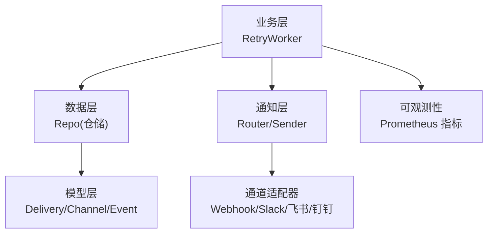
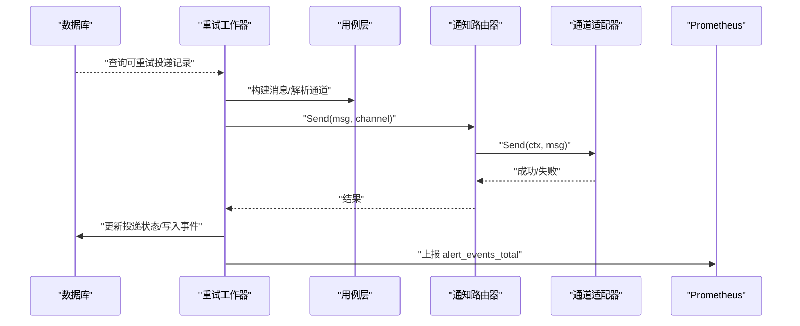
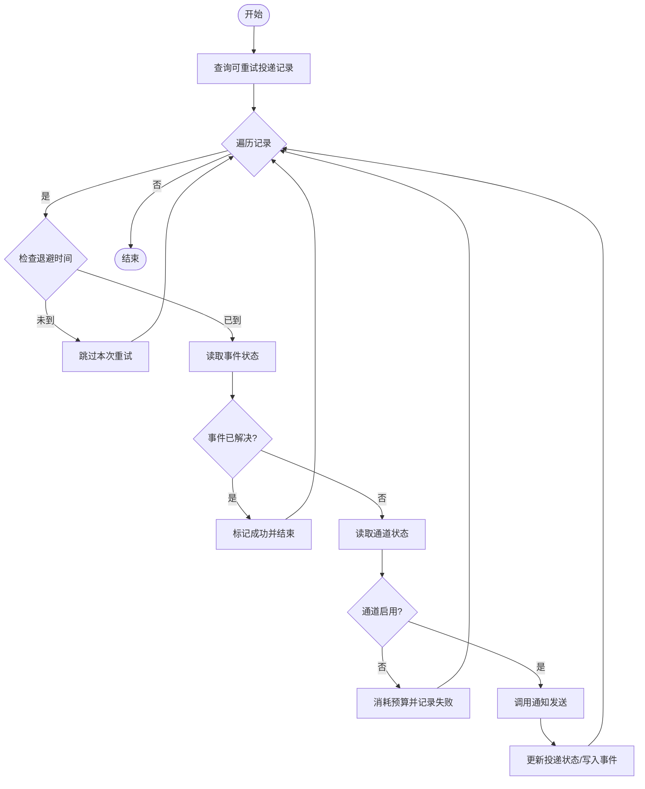
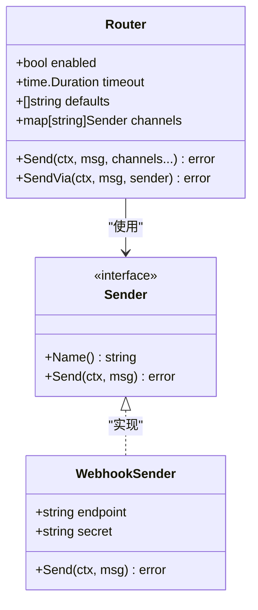
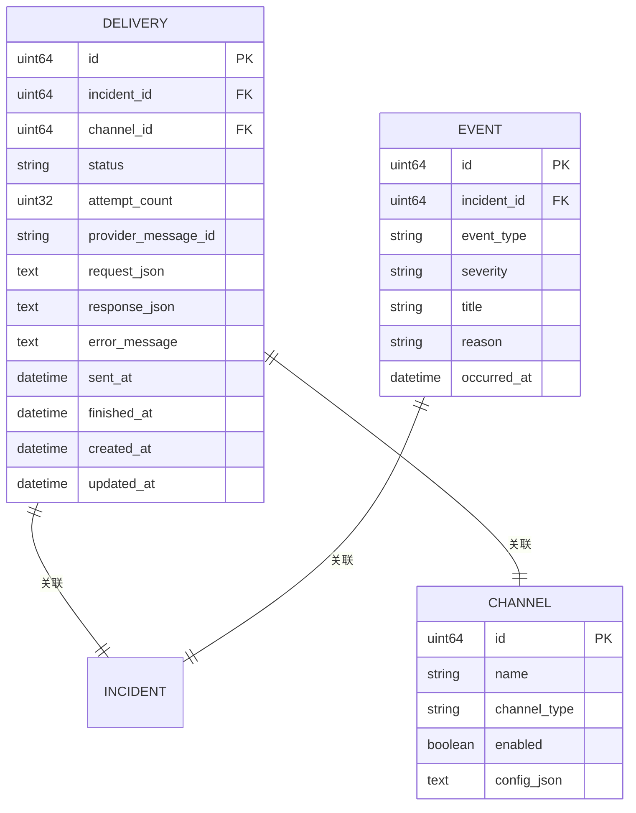
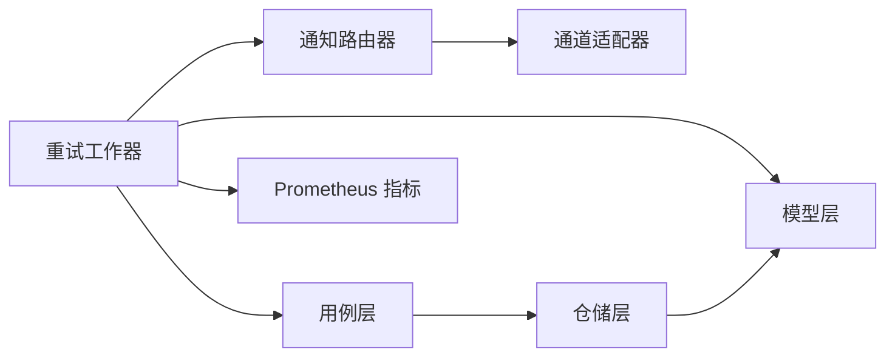

# 重试机制与失败处理

<cite>
**本文引用的文件**
- [retry.go](file://internal/manager/biz/alert/retry.go)
- [retry_test.go](file://internal/manager/biz/alert/retry_test.go)
- [notify.go](file://internal/pkg/notify/notify.go)
- [webhook.go](file://internal/pkg/notify/webhook.go)
- [config.go](file://internal/pkg/config/config.go)
- [model.go](file://internal/manager/model/alert/model.go)
- [repo.go](file://internal/manager/data/alert/store/repo.go)
- [usecase.go](file://internal/manager/biz/alert/usecase.go)
- [manager_metrics.go](file://internal/pkg/prom/manager_metrics.go)
</cite>

## 目录
1. [简介](#简介)
2. [项目结构](#项目结构)
3. [核心组件](#核心组件)
4. [架构总览](#架构总览)
5. [详细组件分析](#详细组件分析)
6. [依赖关系分析](#依赖关系分析)
7. [性能考量](#性能考量)
8. [故障排查指南](#故障排查指南)
9. [结论](#结论)
10. [附录：配置参数与调优建议](#附录：配置参数与调优建议)

## 简介
本技术文档聚焦于通知发送的重试机制与失败处理，覆盖以下主题：
- 重试策略：线性退避、最大重试次数、超时控制
- 失败分类：临时性错误与永久性错误的区分与处理
- 死信队列与消息持久化：基于数据库的投递记录与审计事件
- 并发控制、限流保护与熔断降级：通道级超时、全局开关与可观测性
- 配置参数与调优：环境变量与默认值
- 告警与人工干预：通过事件与指标进行监控和处置
- 状态监控与异常处理：Prometheus 指标与事件表

## 项目结构
通知重试相关代码主要分布在以下模块：
- 业务层（biz）：重试工作器 RetryWorker 负责周期性扫描并重投失败的投递记录
- 数据层（data/store）：仓储接口实现，负责持久化投递记录与事件
- 模型层（model）：定义 Delivery、Channel、Event 等数据结构
- 通知层（pkg/notify）：统一的消息路由与通道适配器（Webhook、Slack、飞书、钉钉等）
- 配置层（pkg/config）：通知开关、默认通道、超时等运行时配置
- 可观测性（pkg/prom）：指标上报，用于监控通知投递成功/失败

图表来源
- [retry.go:14-43](file://internal/manager/biz/alert/retry.go#L14-L43)
- [notify.go:39-65](file://internal/pkg/notify/notify.go#L39-L65)
- [webhook.go:18-33](file://internal/pkg/notify/webhook.go#L18-L33)
- [model.go:366-386](file://internal/manager/model/alert/model.go#L366-L386)
- [manager_metrics.go:188-199](file://internal/pkg/prom/manager_metrics.go#L188-L199)

章节来源
- [retry.go:14-43](file://internal/manager/biz/alert/retry.go#L14-L43)
- [notify.go:39-65](file://internal/pkg/notify/notify.go#L39-L65)
- [model.go:366-386](file://internal/manager/model/alert/model.go#L366-L386)

## 核心组件
- 重试工作器（RetryWorker）：周期扫描失败的投递记录，按退避策略重投，更新状态并记录事件
- 通知路由器（Router）：根据配置启用/禁用通知，设置超时，选择目标通道
- 通道适配器（Sender/Webhook）：将标准化消息转换为各平台格式并发送
- 仓储（Repo）：持久化投递记录（notification_deliveries）与事件（alert_events）
- 模型（Delivery/Channel/Event）：描述投递状态、通道配置与事件类型
- 配置（NotificationConfig）：控制通知开关、默认通道、超时等
- 指标（Prometheus）：统计事件总数、延迟等，支撑监控与告警

章节来源
- [retry.go:14-43](file://internal/manager/biz/alert/retry.go#L14-L43)
- [notify.go:39-65](file://internal/pkg/notify/notify.go#L39-L65)
- [webhook.go:18-33](file://internal/pkg/notify/webhook.go#L18-L33)
- [model.go:366-386](file://internal/manager/model/alert/model.go#L366-L386)
- [config.go:177-212](file://internal/pkg/config/config.go#L177-L212)
- [manager_metrics.go:188-199](file://internal/pkg/prom/manager_metrics.go#L188-L199)

## 架构总览
下图展示了通知重试的整体流程：从失败的投递记录开始，重试工作器按退避策略重投，最终更新状态并记录事件；同时通过 Prometheus 指标上报。

图表来源
- [retry.go:98-107](file://internal/manager/biz/alert/retry.go#L98-L107)
- [usecase.go:547-607](file://internal/manager/biz/alert/usecase.go#L547-L607)
- [notify.go:92-130](file://internal/pkg/notify/notify.go#L92-L130)
- [webhook.go:220-258](file://internal/pkg/notify/webhook.go#L220-L258)
- [manager_metrics.go:525-531](file://internal/pkg/prom/manager_metrics.go#L525-L531)

## 详细组件分析

### 重试工作器（RetryWorker）
- 职责：周期性扫描失败的投递记录，按退避策略重投，更新状态并记录事件
- 关键行为：
  - 线性退避：跳过最近完成时间小于 attempt_count * backoffPerAttempt 的记录
  - 最大重试次数：attempt_count 达到 maxAttempts 时不再重试
  - 已解决事件：若关联事件已解决，直接标记为成功
  - 通道禁用：若通道被禁用，消耗预算并记录失败原因
  - 状态更新：成功或失败均更新 attempt_count、sent_at、finished_at、error_message
  - 事件记录：写入 notification_sent / notification_failed 事件，并上报指标

图表来源
- [retry.go:98-107](file://internal/manager/biz/alert/retry.go#L98-L107)
- [retry.go:117-159](file://internal/manager/biz/alert/retry.go#L117-L159)
- [retry.go:161-201](file://internal/manager/biz/alert/retry.go#L161-L201)

章节来源
- [retry.go:14-43](file://internal/manager/biz/alert/retry.go#L14-L43)
- [retry.go:98-107](file://internal/manager/biz/alert/retry.go#L98-L107)
- [retry.go:117-159](file://internal/manager/biz/alert/retry.go#L117-L159)
- [retry.go:161-201](file://internal/manager/biz/alert/retry.go#L161-L201)
- [retry_test.go:11-69](file://internal/manager/biz/alert/retry_test.go#L11-L69)
- [retry_test.go:116-154](file://internal/manager/biz/alert/retry_test.go#L116-L154)

### 通知路由器与通道适配器
- 路由器（Router）：
  - 支持全局开关（Enabled）
  - 设置每通道发送超时（Timeout）
  - 支持默认通道列表（DefaultChannels）
  - 对未配置的通道返回错误
- 通道适配器（Webhook/Slack/飞书/钉钉等）：
  - 将标准化消息转换为平台特定格式
  - 支持签名（HMAC）与请求头设置
  - 非 2xx 响应视为失败

图表来源
- [notify.go:39-65](file://internal/pkg/notify/notify.go#L39-L65)
- [notify.go:92-130](file://internal/pkg/notify/notify.go#L92-L130)
- [webhook.go:18-33](file://internal/pkg/notify/webhook.go#L18-L33)
- [webhook.go:220-258](file://internal/pkg/notify/webhook.go#L220-L258)

章节来源
- [notify.go:39-65](file://internal/pkg/notify/notify.go#L39-L65)
- [notify.go:92-130](file://internal/pkg/notify/notify.go#L92-L130)
- [webhook.go:220-258](file://internal/pkg/notify/webhook.go#L220-L258)

### 数据持久化与事件记录
- 投递记录（Delivery）：
  - 字段包括 incident_id、channel_id、status、attempt_count、provider_message_id、request/response JSON、error_message、sent_at、finished_at
  - 状态包括 pending、success、failed
- 事件记录（Event）：
  - 记录 notification_sent / notification_failed 等事件类型
  - 包含 severity、title、reason、occurred_at 等上下文信息
- 仓储更新：
  - UpdateDeliveryStatus 更新投递状态与尝试次数
  - CreateEvent 写入事件并上报指标

图表来源
- [model.go:366-386](file://internal/manager/model/alert/model.go#L366-L386)
- [repo.go:847-870](file://internal/manager/data/alert/store/repo.go#L847-L870)
- [usecase.go:547-607](file://internal/manager/biz/alert/usecase.go#L547-L607)

章节来源
- [model.go:366-386](file://internal/manager/model/alert/model.go#L366-L386)
- [repo.go:847-870](file://internal/manager/data/alert/store/repo.go#L847-L870)
- [usecase.go:547-607](file://internal/manager/biz/alert/usecase.go#L547-L607)

### 失败分类与处理策略
- 临时性错误：
  - 网络抖动、上游服务暂时不可用（如 5xx）
  - 处理方式：按退避策略重试，直至达到最大重试次数
- 永久性错误：
  - 通道被禁用、配置缺失、目标地址无效
  - 处理方式：消耗重试预算并记录失败原因，不再重试
- 事件已解决：
  - 若关联事件已解决，直接标记投递成功，避免无意义重试

章节来源
- [retry.go:117-159](file://internal/manager/biz/alert/retry.go#L117-L159)
- [retry.go:161-201](file://internal/manager/biz/alert/retry.go#L161-L201)

### 并发控制、限流保护与熔断降级
- 并发控制：
  - 重试工作器以 Tick 周期驱动，单次扫描限制为固定批次大小（例如 200），避免一次性处理过多记录
- 限流保护：
  - 通知路由器为每个通道设置超时，防止慢下游阻塞
  - 可通过上层限流器（如 TokenBucketLimiter）对工具调用进行限流，间接影响通知触发频率
- 熔断降级：
  - 全局开关（Notification.Enabled）可快速关闭所有通知
  - 通道级禁用（Channel.Enabled=false）停止该通道重试
  - 指标与事件提供可见性，便于动态调整

章节来源
- [retry.go:98-107](file://internal/manager/biz/alert/retry.go#L98-L107)
- [notify.go:92-130](file://internal/pkg/notify/notify.go#L92-L130)
- [config.go:177-212](file://internal/pkg/config/config.go#L177-L212)

### 监控与告警
- 指标：
  - alert_events_total：统计事件写入总数，标签包含 event_type、severity、rule
  - 可用于构建告警规则，例如“通知投递失败”阈值告警
- 事件：
  - notification_sent / notification_failed 事件记录每次投递结果
  - 支持在设置页面查看告警事件历史
- 人工干预：
  - 通过事件与指标定位问题通道或上游服务
  - 调整通道配置或全局开关进行降级

章节来源
- [manager_metrics.go:188-199](file://internal/pkg/prom/manager_metrics.go#L188-L199)
- [manager_metrics.go:525-531](file://internal/pkg/prom/manager_metrics.go#L525-L531)
- [usecase.go:547-607](file://internal/manager/biz/alert/usecase.go#L547-L607)

## 依赖关系分析

图表来源
- [retry.go:14-43](file://internal/manager/biz/alert/retry.go#L14-L43)
- [usecase.go:547-607](file://internal/manager/biz/alert/usecase.go#L547-L607)
- [notify.go:39-65](file://internal/pkg/notify/notify.go#L39-L65)
- [model.go:366-386](file://internal/manager/model/alert/model.go#L366-L386)
- [manager_metrics.go:188-199](file://internal/pkg/prom/manager_metrics.go#L188-L199)

章节来源
- [retry.go:14-43](file://internal/manager/biz/alert/retry.go#L14-L43)
- [usecase.go:547-607](file://internal/manager/biz/alert/usecase.go#L547-L607)
- [notify.go:39-65](file://internal/pkg/notify/notify.go#L39-L65)
- [model.go:366-386](file://internal/manager/model/alert/model.go#L366-L386)
- [manager_metrics.go:188-199](file://internal/pkg/prom/manager_metrics.go#L188-L199)

## 性能考量
- 退避策略：线性退避避免瞬时风暴，降低下游压力
- 批次限制：单次扫描限制为固定批次，避免内存与数据库压力
- 超时控制：通道级超时防止慢下游拖垮整体流程
- 指标开销：仅对成功写入的事件上报指标，减少无效计数

[本节为通用指导，不直接分析具体文件]

## 故障排查指南
- 常见问题：
  - 通知未送达：检查通道是否启用、URL 是否正确、签名是否匹配
  - 频繁失败：观察 alert_events_total 中 notification_failed 的增长趋势
  - 事件已解决但未通知：确认事件状态与通道状态
- 排查步骤：
  - 查看 delivery 记录的 attempt_count、error_message、finished_at
  - 检查通道配置与全局开关
  - 通过 Prometheus 查询 alert_events_total 指标
  - 在设置页面查看告警事件历史

章节来源
- [retry.go:117-159](file://internal/manager/biz/alert/retry.go#L117-L159)
- [repo.go:847-870](file://internal/manager/data/alert/store/repo.go#L847-L870)
- [manager_metrics.go:525-531](file://internal/pkg/prom/manager_metrics.go#L525-L531)

## 结论
本系统通过 RetryWorker 实现了可靠的通知重试机制，结合线性退避、最大重试次数与超时控制，确保在临时性错误下自动恢复，并在永久性错误时及时止损。通过数据库持久化与事件记录，提供了完整的审计轨迹；通过 Prometheus 指标与设置页面，实现了可观测性与人工干预能力。建议在部署时合理配置通知开关、默认通道与超时，并结合指标告警进行持续优化。

[本节为总结，不直接分析具体文件]

## 附录：配置参数与调优建议
- 通知开关：
  - ONGRID_NOTIFY_ENABLED：全局开关，默认开启
- 默认通道：
  - ONGRID_NOTIFY_DEFAULT_CHANNELS：逗号分隔的通道名列表
- 超时：
  - ONGRID_NOTIFY_TIMEOUT：每通道发送超时，默认 10s
- 通道配置：
  - Webhook/Slack/飞书/钉钉：各自 ENABLED、NAME、URL、SECRET
- 调优建议：
  - 在高负载场景适当增大超时与退避间隔
  - 对不稳定上游增加最大重试次数
  - 通过指标告警监控 notification_failed 增长

章节来源
- [config.go:177-212](file://internal/pkg/config/config.go#L177-L212)
- [config.go:509-534](file://internal/pkg/config/config.go#L509-L534)
- [notify.go:67-90](file://internal/pkg/notify/notify.go#L67-L90)