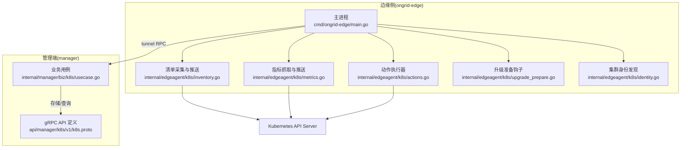
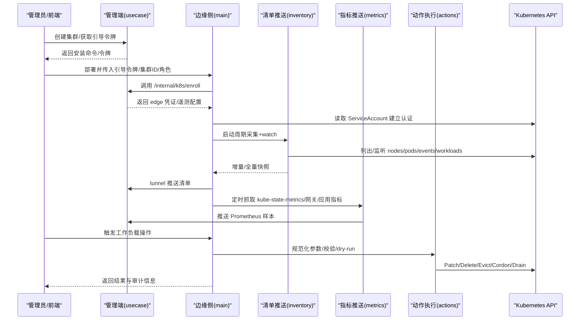
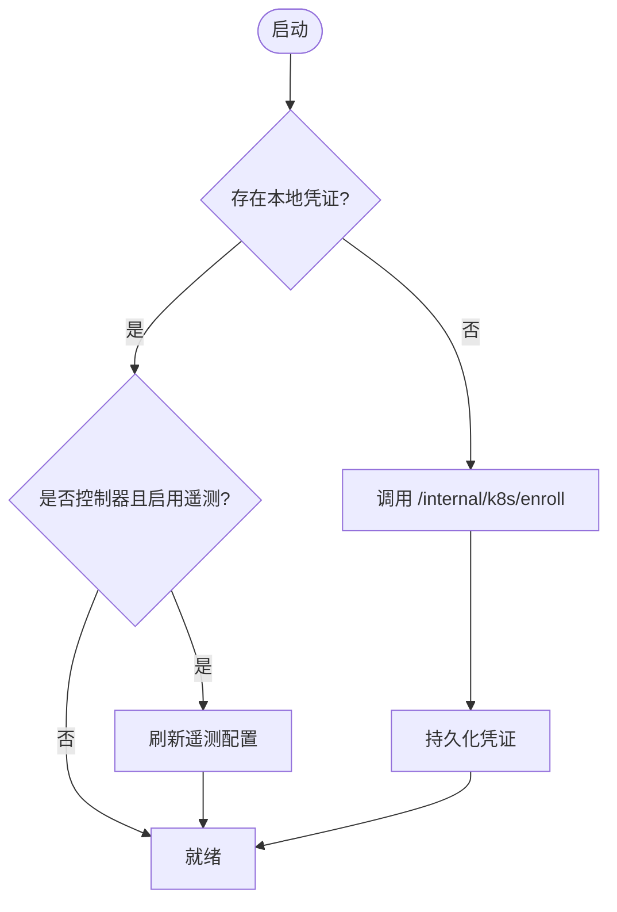
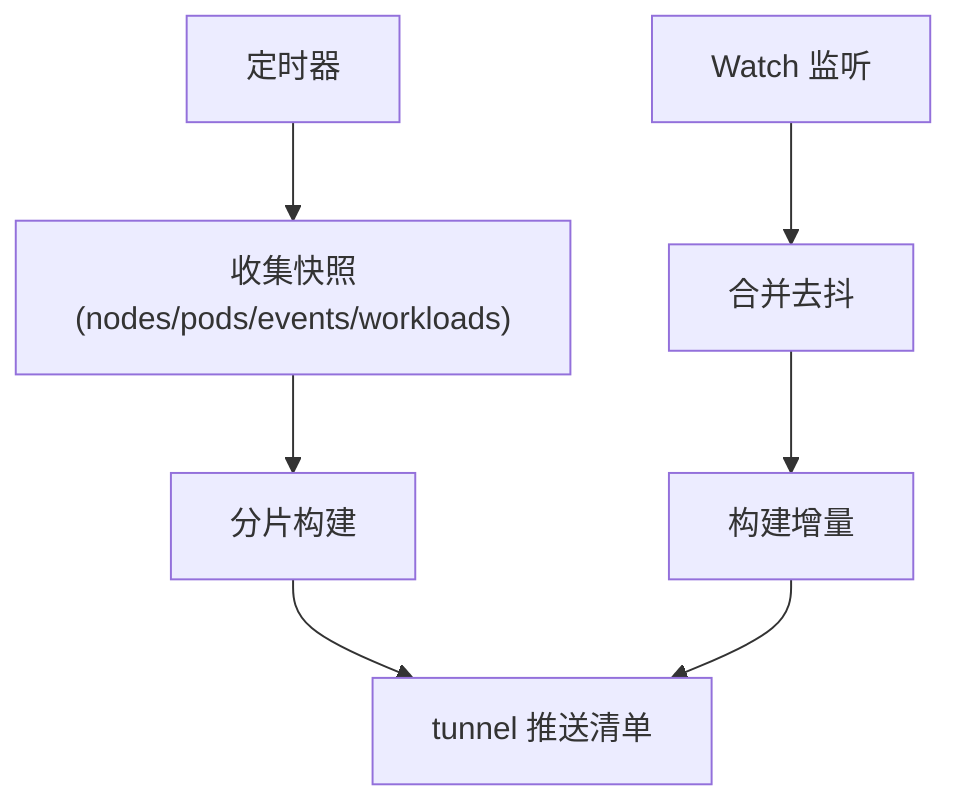
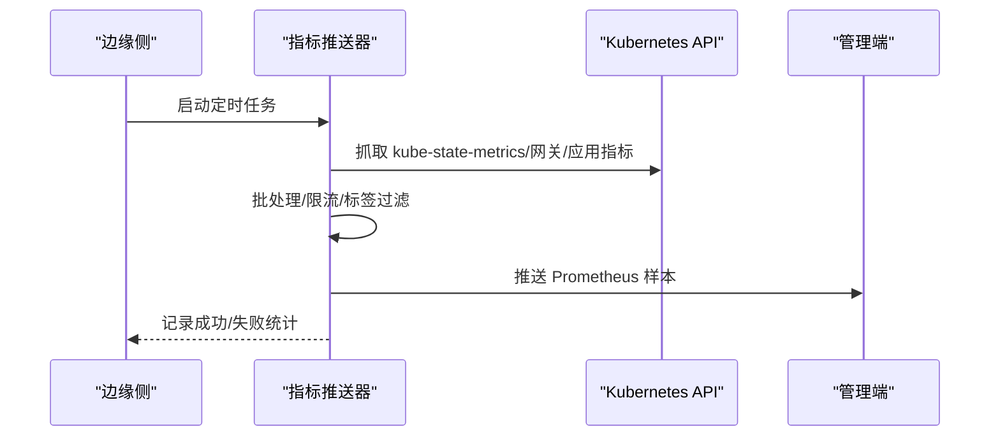
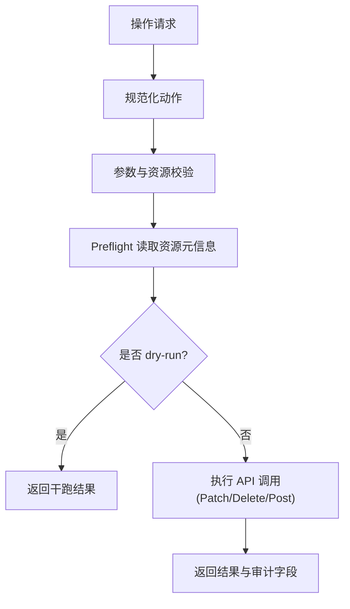
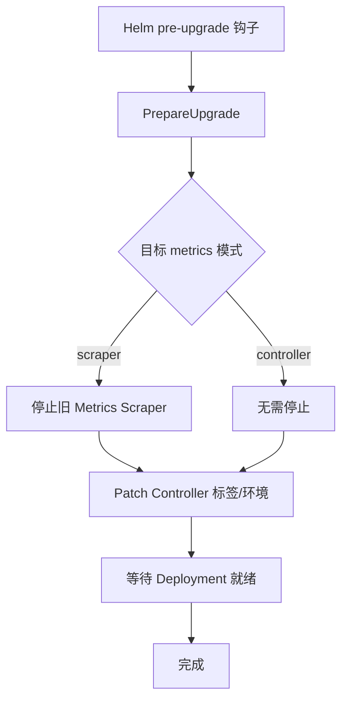
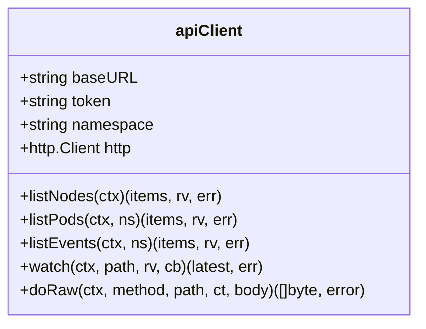
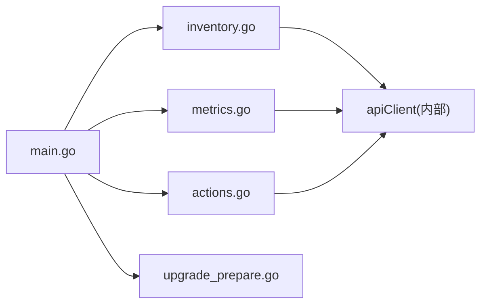

# Kubernetes 集成

<cite>
**本文引用的文件**
- [k8s.proto](file://api/manager/k8s/v1/k8s.proto)
- [main.go](file://cmd/ongrid-edge/main.go)
- [actions.go](file://internal/edgeagent/k8s/actions.go)
- [inventory.go](file://internal/edgeagent/k8s/inventory.go)
- [metrics.go](file://internal/edgeagent/k8s/metrics.go)
- [upgrade_prepare.go](file://internal/edgeagent/k8s/upgrade_prepare.go)
- [identity.go](file://internal/edgeagent/k8s/identity.go)
- [usecase.go](file://internal/manager/biz/k8s/usecase.go)
</cite>

## 目录
1. [简介](#简介)
2. [项目结构](#项目结构)
3. [核心组件](#核心组件)
4. [架构总览](#架构总览)
5. [详细组件分析](#详细组件分析)
6. [依赖关系分析](#依赖关系分析)
7. [性能考量](#性能考量)
8. [故障排查指南](#故障排查指南)
9. [结论](#结论)
10. [附录：配置与 API 参考](#附录：配置与-api-参考)

## 简介
本技术文档聚焦于本项目中的 Kubernetes 集成功能，覆盖集群接入与管理、资源监控与数据采集、API 客户端实现（认证、监听、事件处理）、工作负载管理（Pod/Service/Deployment 等）的监控与操作、升级准备流程（版本检查、依赖验证、预检），以及多集群管理、健康检查、故障诊断与性能调优。文档以代码为依据，提供可追溯的源码路径与图示，帮助读者快速理解并落地使用。

## 项目结构
Kubernetes 集成由“边缘侧 ongrid-edge”和“管理端 manager”两部分协作完成：
- 边缘侧负责：
  - 通过一次性引导令牌完成集群入网；
  - 在集群内建立到 Kubernetes API 的安全连接；
  - 周期性采集节点、工作负载、Pod、事件等清单数据，并通过增量 watch 推送变更；
  - 定时抓取 kube-state-metrics、网关指标与应用指标，打包后推送到管理端；
  - 执行受控的集群操作（重启、扩缩容、驱逐、节点维护等）。
- 管理端负责：
  - 创建集群、颁发引导令牌、绑定集群 UID；
  - 接收并持久化清单与事件，计算健康摘要；
  - 为控制器与节点签发独立凭证，支持遥测配置下发。

图表来源
- [main.go:121-280](file://cmd/ongrid-edge/main.go#L121-L280)
- [inventory.go:85-170](file://internal/edgeagent/k8s/inventory.go#L85-L170)
- [metrics.go:128-171](file://internal/edgeagent/k8s/metrics.go#L128-L171)
- [actions.go:37-141](file://internal/edgeagent/k8s/actions.go#L37-L141)
- [upgrade_prepare.go:35-141](file://internal/edgeagent/k8s/upgrade_prepare.go#L35-L141)
- [identity.go:11-33](file://internal/edgeagent/k8s/identity.go#L11-L33)
- [usecase.go:42-100](file://internal/manager/biz/k8s/usecase.go#L42-L100)
- [k8s.proto:9-27](file://api/manager/k8s/v1/k8s.proto#L9-L27)

章节来源
- [main.go:66-134](file://cmd/ongrid-edge/main.go#L66-L134)
- [k8s.proto:9-27](file://api/manager/k8s/v1/k8s.proto#L9-L27)

## 核心组件
- 集群入网与认证
  - 边缘侧通过环境变量或 Helm 注入获取集群 ID、角色、命名空间等信息，调用管理端 /internal/k8s/enroll 完成入网，获得 edge 凭证与遥测配置。
  - 管理端校验一次性引导令牌，绑定集群 UID，签发节点/控制器凭证，并返回遥测目标地址。
- 清单采集与增量同步
  - 控制器模式启动 InventoryPusher，周期全量采集节点/工作负载/Pod/事件，并开启 watch 监听变更，合并去抖后推送增量。
- 指标采集与推送
  - 支持抓取 kube-state-metrics、OTLP 网关指标、以及基于注解自动发现的应用指标，按批次推送到管理端。
- 工作负载操作
  - 统一入口 executeAction，支持 rollout_restart、scale、delete_pod、evict_pod、cordon/uncordon、drain 等操作，内置参数校验、dry-run、重试与审计字段。
- 升级准备
  - Helm pre-upgrade 钩子调用 PrepareUpgrade，安全地调整 Controller 与 Metrics Scraper Deployment，确保滚动更新不中断。

章节来源
- [main.go:537-668](file://cmd/ongrid-edge/main.go#L537-L668)
- [usecase.go:1299-1322](file://internal/manager/biz/k8s/usecase.go#L1299-L1322)
- [inventory.go:85-170](file://internal/edgeagent/k8s/inventory.go#L85-L170)
- [metrics.go:128-171](file://internal/edgeagent/k8s/metrics.go#L128-L171)
- [actions.go:37-141](file://internal/edgeagent/k8s/actions.go#L37-L141)
- [upgrade_prepare.go:35-141](file://internal/edgeagent/k8s/upgrade_prepare.go#L35-L141)

## 架构总览
下图展示了从 UI/API 到边缘侧再到 Kubernetes API 的完整链路，包括入网、清单与指标采集、工作负载操作与升级准备。

图表来源
- [main.go:537-668](file://cmd/ongrid-edge/main.go#L537-L668)
- [inventory.go:85-170](file://internal/edgeagent/k8s/inventory.go#L85-L170)
- [metrics.go:128-171](file://internal/edgeagent/k8s/metrics.go#L128-L171)
- [actions.go:37-141](file://internal/edgeagent/k8s/actions.go#L37-L141)
- [usecase.go:1299-1322](file://internal/manager/biz/k8s/usecase.go#L1299-L1322)

## 详细组件分析

### 集群入网与认证
- 边缘侧流程
  - 解析环境变量（集群 ID、角色、命名空间、ProviderID 等），若本地无凭证则发起 HTTP 请求至管理端 /internal/k8s/enroll，携带一次性引导令牌。
  - 成功后写入本地凭证，并可选刷新遥测配置（控制器模式且启用遥测时）。
- 管理端流程
  - 校验引导令牌与角色，绑定集群 UID，根据角色签发节点或控制器凭证，返回遥测目标与公共 URL。
- 关键特性
  - 支持 TLS 跳过校验开关用于调试；
  - 控制器模式支持遥测配置轮询刷新；
  - 失败时记录告警并回退策略清晰。

图表来源
- [main.go:537-668](file://cmd/ongrid-edge/main.go#L537-L668)
- [usecase.go:1299-1322](file://internal/manager/biz/k8s/usecase.go#L1299-L1322)

章节来源
- [main.go:537-668](file://cmd/ongrid-edge/main.go#L537-L668)
- [usecase.go:1299-1322](file://internal/manager/biz/k8s/usecase.go#L1299-L1322)

### 清单采集与增量同步
- 全量采集
  - 控制器模式下，InventoryPusher 周期拉取 nodes、pods、events 及多种 workloads（Deployment/StatefulSet/DaemonSet/ReplicaSet/Job/CronJob），记录各资源的 resourceVersion。
- Watch 监听
  - 针对上述资源建立 watch，合并去抖后推送增量；遇到权限不足或资源过期时自动降级或全量重同步。
- 推送机制
  - 将快照切分为多个 chunk 通过 tunnel 方法 PushK8sInventory 推送，管理端统计接受数量并持久化。

图表来源
- [inventory.go:85-170](file://internal/edgeagent/k8s/inventory.go#L85-L170)
- [inventory.go:346-444](file://internal/edgeagent/k8s/inventory.go#L346-L444)
- [inventory.go:536-641](file://internal/edgeagent/k8s/inventory.go#L536-L641)

章节来源
- [inventory.go:85-170](file://internal/edgeagent/k8s/inventory.go#L85-L170)
- [inventory.go:346-444](file://internal/edgeagent/k8s/inventory.go#L346-L444)
- [inventory.go:536-641](file://internal/edgeagent/k8s/inventory.go#L536-L641)

### 指标采集与推送
- 采集目标
  - kube-state-metrics 固定端点；
  - OTLP 网关指标端点（可选）；
  - 应用指标自动发现：扫描 Pod 注解 prometheus.io/*，构造抓取目标。
- 批处理与限流
  - 按样本数与字节数限制分批推送，支持超时控制与状态上报。
- 标签过滤
  - 丢弃敏感或冗余标签（uid、pod_uid、container_id 等），保证指标质量。

图表来源
- [metrics.go:128-171](file://internal/edgeagent/k8s/metrics.go#L128-L171)
- [metrics.go:173-230](file://internal/edgeagent/k8s/metrics.go#L173-L230)
- [metrics.go:290-326](file://internal/edgeagent/k8s/metrics.go#L290-L326)

章节来源
- [metrics.go:128-171](file://internal/edgeagent/k8s/metrics.go#L128-L171)
- [metrics.go:173-230](file://internal/edgeagent/k8s/metrics.go#L173-L230)
- [metrics.go:290-326](file://internal/edgeagent/k8s/metrics.go#L290-L326)

### 工作负载管理（监控与操作）
- 监控
  - 清单中聚合 Workload/Pod/Event，支持按命名空间、类型、问题筛选；管理端提供健康摘要（降级工作负载、Pending/OOM/Killed 等计数）。
- 操作
  - 统一入口 normalize + actionTarget 校验 Kind/Name/Namespace/Replicas 等；
  - 支持 dry-run 预检、资源版本冲突检测、优雅删除与驱逐、节点维护（cordon/uncordon/drain）；
  - drain 具备 PDB 重试、空目录数据处理、DaemonSet 忽略等策略。

图表来源
- [actions.go:37-141](file://internal/edgeagent/k8s/actions.go#L37-L141)
- [actions.go:143-265](file://internal/edgeagent/k8s/actions.go#L143-L265)
- [actions.go:421-544](file://internal/edgeagent/k8s/actions.go#L421-L544)

章节来源
- [actions.go:37-141](file://internal/edgeagent/k8s/actions.go#L37-L141)
- [actions.go:143-265](file://internal/edgeagent/k8s/actions.go#L143-L265)
- [actions.go:421-544](file://internal/edgeagent/k8s/actions.go#L421-L544)

### 升级准备流程
- 目标
  - 在 Helm 应用新清单前，对 Controller 与 Metrics Scraper Deployment 进行最小侵入式调整，避免滚动期间断连。
- 能力
  - 标记 Controller 后端标签，切换服务选择器；
  - 按需停止旧 Metrics Scraper；
  - 清理/设置环境变量，确保新旧版本平滑过渡；
  - 等待 Deployment 就绪后再放行后续步骤。

图表来源
- [upgrade_prepare.go:35-141](file://internal/edgeagent/k8s/upgrade_prepare.go#L35-L141)
- [upgrade_prepare.go:215-287](file://internal/edgeagent/k8s/upgrade_prepare.go#L215-L287)

章节来源
- [upgrade_prepare.go:35-141](file://internal/edgeagent/k8s/upgrade_prepare.go#L35-L141)
- [upgrade_prepare.go:215-287](file://internal/edgeagent/k8s/upgrade_prepare.go#L215-L287)

### Kubernetes API 客户端实现
- 认证
  - 通过 ServiceAccount token 与 CA 证书建立 HTTPS 连接；支持自定义 serviceaccount 目录与环境变量覆盖。
- 资源监听
  - 通用 watch 封装，处理 BOOKMARK、ERROR、Gone（资源过期）等事件，自动重试与指数退避。
- 事件处理
  - 清单模块对事件消息脱敏；watch 错误分类（Forbidden/NotFound/Expired）驱动不同恢复策略。

图表来源
- [inventory.go:700-741](file://internal/edgeagent/k8s/inventory.go#L700-L741)
- [inventory.go:891-942](file://internal/edgeagent/k8s/inventory.go#L891-L942)
- [actions.go:605-644](file://internal/edgeagent/k8s/actions.go#L605-L644)

章节来源
- [inventory.go:700-741](file://internal/edgeagent/k8s/inventory.go#L700-L741)
- [inventory.go:891-942](file://internal/edgeagent/k8s/inventory.go#L891-L942)
- [actions.go:605-644](file://internal/edgeagent/k8s/actions.go#L605-L644)

## 依赖关系分析
- 组件耦合
  - main.go 作为编排入口，依赖 inventory、metrics、actions、upgrade 等模块；
  - inventory 与 metrics 共用 apiClient，降低重复实现；
  - actions 复用 apiClient 的 doRaw 进行底层 HTTP 调用。
- 外部依赖
  - Kubernetes API Server（REST/watch）；
  - 管理端 gRPC 接口（tunnel RPC）；
  - Prometheus 指标格式（样本推送）。
- 潜在循环依赖
  - 当前模块间单向依赖，未见循环引用。

图表来源
- [main.go:121-280](file://cmd/ongrid-edge/main.go#L121-L280)
- [inventory.go:700-741](file://internal/edgeagent/k8s/inventory.go#L700-L741)
- [metrics.go:128-171](file://internal/edgeagent/k8s/metrics.go#L128-L171)
- [actions.go:605-644](file://internal/edgeagent/k8s/actions.go#L605-L644)

章节来源
- [main.go:121-280](file://cmd/ongrid-edge/main.go#L121-L280)
- [inventory.go:700-741](file://internal/edgeagent/k8s/inventory.go#L700-L741)
- [metrics.go:128-171](file://internal/edgeagent/k8s/metrics.go#L128-L171)
- [actions.go:605-644](file://internal/edgeagent/k8s/actions.go#L605-L644)

## 性能考量
- 清单采集
  - 默认 30 秒全量间隔；watch 去抖 2 秒；资源过期时触发全量重同步；
  - 支持按命名空间范围缩小采集面，减少不必要开销。
- 指标推送
  - 默认 30 秒抓取间隔，单次抓取超时 15 秒，推送超时 30 秒；
  - 样本上限 250000，单批样本上限 10000，单批字节上限 4MB；
  - 支持应用指标自动发现，但需合理配置注解以避免过多目标。
- 操作执行
  - drain 默认 120 秒超时，最大 600 秒；驱逐重试间隔默认 2 秒，最大 30 秒；
  - 支持 dry-run 预检，降低误操作风险。

[本节为通用指导，不直接分析具体文件]

## 故障排查指南
- 入网失败
  - 检查引导令牌是否有效、管理端公网地址是否正确、TLS 配置是否允许跳过校验；
  - 查看日志中 enroll 请求状态码与响应体。
- 清单推送异常
  - watch 报错 Forbidden/NotFound/Gone 分别对应权限不足、资源不存在、资源过期；
  - 观察是否触发全量重同步，确认 resourceVersion 是否重置。
- 指标抓取失败
  - 确认 kube-state-metrics/网关/应用指标端点可达；
  - 关注样本限制与批大小，必要时调大限制或降低抓取频率。
- 工作负载操作失败
  - 核对 Kind/Name/Namespace/Replicas 合法性；
  - 使用 dry-run 先验证；drain 注意 PDB 阻塞与 DaemonSet/emptyDir 策略。

章节来源
- [main.go:537-668](file://cmd/ongrid-edge/main.go#L537-L668)
- [inventory.go:377-444](file://internal/edgeagent/k8s/inventory.go#L377-L444)
- [metrics.go:173-230](file://internal/edgeagent/k8s/metrics.go#L173-L230)
- [actions.go:143-265](file://internal/edgeagent/k8s/actions.go#L143-L265)

## 结论
本项目实现了完整的 Kubernetes 集成方案：通过一次性引导令牌完成安全入网，利用清单与 watch 实现高效资源同步，结合指标抓取与自动发现提供全面可观测性，并以统一动作执行器保障工作负载操作的可靠性与可审计性。升级准备流程确保在 Helm 滚动更新过程中保持服务连续性。建议在生产环境中合理配置采集间隔、样本限制与操作超时，并结合命名空间范围与注解策略优化性能。

[本节为总结，不直接分析具体文件]

## 附录：配置与 API 参考

### 环境变量与配置要点
- 边缘侧
  - ONGRID_K8S_CLUSTER_ID：必填，标识集群；
  - ONGRID_K8S_ROLE：controller/node，决定功能集；
  - ONGRID_K8S_POD_NAMESPACE：命名空间范围；
  - ONGRID_K8S_TELEMETRY_GATEWAY_ENABLED：启用网关指标抓取；
  - ONGRID_K8S_METRICS_ENDPOINT：kube-state-metrics 端点；
  - ONGRID_K8S_APP_METRICS_DISCOVERY：启用应用指标自动发现；
  - ONGRID_MANAGER_PUBLIC_URL：管理端公网地址（入网必需）。
- 管理端
  - 通过 CreateCluster 生成 BootstrapToken 与安装命令；
  - Enroll 接口校验令牌并签发凭证。

章节来源
- [main.go:537-668](file://cmd/ongrid-edge/main.go#L537-L668)
- [k8s.proto:9-27](file://api/manager/k8s/v1/k8s.proto#L9-L27)

### gRPC API 概览
- 集群管理
  - CreateCluster/ListClusters/GetCluster/DeleteCluster/RotateBootstrapToken
- 健康与资源
  - GetClusterHealth/ListNodes/ListWorkloads/ListPods/ListEvents
- 入网
  - Enroll（内部一次性令牌认证）

章节来源
- [k8s.proto:9-27](file://api/manager/k8s/v1/k8s.proto#L9-L27)
- [k8s.proto:29-81](file://api/manager/k8s/v1/k8s.proto#L29-L81)
- [k8s.proto:119-177](file://api/manager/k8s/v1/k8s.proto#L119-L177)
- [k8s.proto:179-391](file://api/manager/k8s/v1/k8s.proto#L179-L391)

### 典型操作流程示例
- 创建集群并获取安装命令
  - 调用 CreateCluster，返回 bootstrap_token 与 install_command；
  - 在目标集群部署 ongrid-edge，传入引导令牌与集群 ID。
- 启动清单与指标采集
  - 控制器模式自动启动 InventoryPusher 与 MetricsPusher；
  - 可通过环境变量调整采集间隔与目标端点。
- 执行工作负载操作
  - 通过动作执行器发送 rollouts/scale/delete/evict/cordon/uncordon/drain；
  - 建议使用 dry-run 预检，再正式执行。
- 升级准备
  - 运行 prepare-k8s-upgrade 命令，传入命名空间、Controller/Metrics Scraper 名称与目标模式；
  - 钩子会安全调整 Deployment 并等待就绪。

章节来源
- [main.go:121-280](file://cmd/ongrid-edge/main.go#L121-L280)
- [actions.go:37-141](file://internal/edgeagent/k8s/actions.go#L37-L141)
- [upgrade_prepare.go:35-141](file://internal/edgeagent/k8s/upgrade_prepare.go#L35-L141)