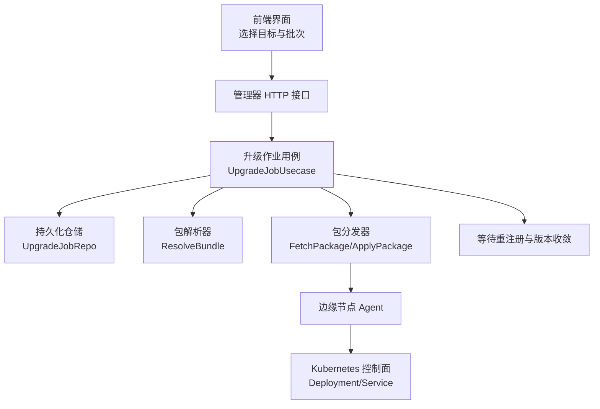
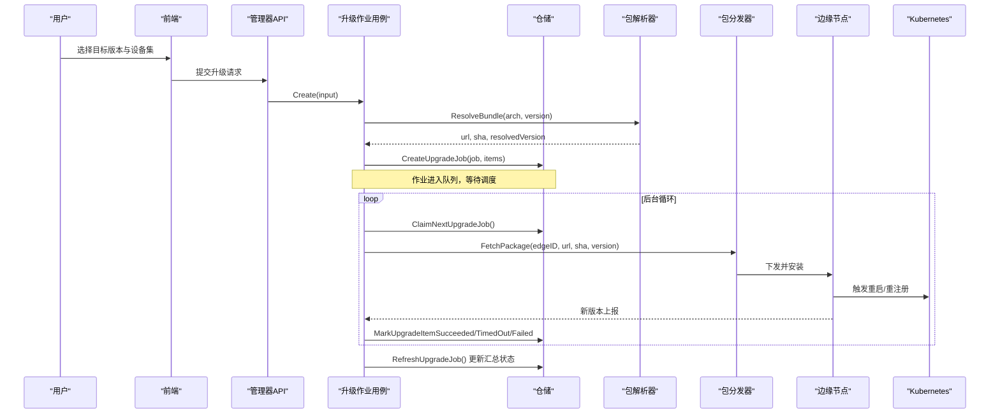
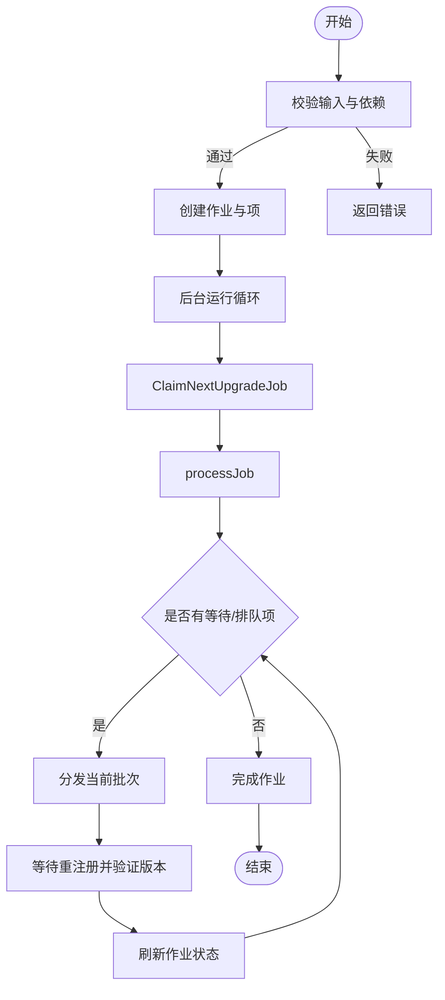
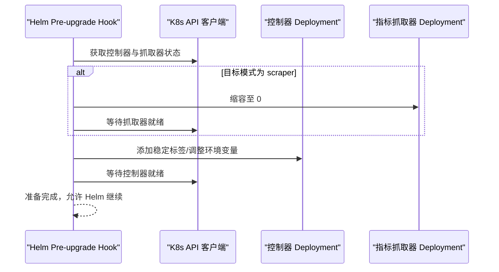
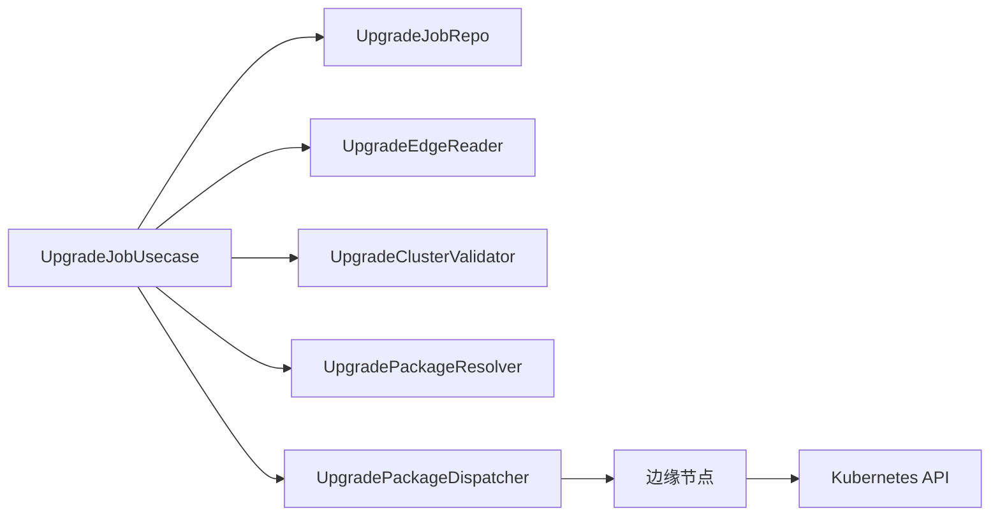

# 升级管理

<cite>
**本文引用的文件**
- [internal/manager/biz/edge/upgrade_job.go](file://internal/manager/biz/edge/upgrade_job.go)
- [internal/manager/biz/edge/upgrade_job_repo.go](file://internal/manager/biz/edge/upgrade_job_repo.go)
- [internal/manager/model/edge/upgrade_job.go](file://internal/manager/model/edge/upgrade_job.go)
- [internal/manager/data/edge/store/upgrade_job_test.go](file://internal/manager/data/edge/store/upgrade_job_test.go)
- [internal/edgeagent/k8s/upgrade_prepare.go](file://internal/edgeagent/k8s/upgrade_prepare.go)
- [cmd/ongrid-edge/k8s_upgrade.go](file://cmd/ongrid-edge/k8s_upgrade.go)
- [deploy/install/edge/fetch-edge-assets.sh](file://deploy/install/edge/fetch-edge-assets.sh)
- [deploy/install/edge/verify-edge-deps-archive.sh](file://deploy/install/edge/verify-edge-deps-archive.sh)
- [scripts/test-upgrade-data-permissions.sh](file://scripts/test-upgrade-data-permissions.sh)
- [web/src/pages/clusters/upgrade.ts](file://web/src/pages/clusters/upgrade.ts)
</cite>

## 目录
1. [简介](#简介)
2. [项目结构](#项目结构)
3. [核心组件](#核心组件)
4. [架构总览](#架构总览)
5. [详细组件分析](#详细组件分析)
6. [依赖关系分析](#依赖关系分析)
7. [性能与扩展性](#性能与扩展性)
8. [故障处理与回滚](#故障处理与回滚)
9. [多集群升级协调](#多集群升级协调)
10. [配置与操作流程](#配置与操作流程)
11. [结论](#结论)

## 简介
本文件面向大规模 Kubernetes 集群的升级管理，围绕“升级准备、版本与依赖校验、环境预检、升级作业调度与执行、进度跟踪与状态管理、风险控制（回滚/错误恢复）、多集群并行与一致性保证”等主题，系统化梳理代码实现与最佳实践。文档以仓库中的边缘节点批量升级编排器、Kubernetes 升级前置准备钩子、安装与依赖校验脚本以及前端分批策略为依据，提供可操作的升级指南与排障建议。

## 项目结构
升级能力由“管理器侧编排 + 边缘侧执行 + 安装与依赖校验 + 前端分批策略”共同构成：
- 管理器侧：负责创建升级作业、批处理调度、分发与验证、重试与清理。
- 边缘侧：接收并应用升级包，完成后重新注册上报版本。
- 安装与依赖：下载并校验 Edge 依赖归档，确保目标环境与依赖一致。
- 前端：按架构分组与分片，生成批次化升级目标集合。

图表来源
- [internal/manager/biz/edge/upgrade_job.go:105-196](file://internal/manager/biz/edge/upgrade_job.go#L105-L196)
- [internal/manager/biz/edge/upgrade_job_repo.go:22-43](file://internal/manager/biz/edge/upgrade_job_repo.go#L22-L43)
- [internal/edgeagent/k8s/upgrade_prepare.go:32-141](file://internal/edgeagent/k8s/upgrade_prepare.go#L32-L141)

章节来源
- [internal/manager/biz/edge/upgrade_job.go:105-196](file://internal/manager/biz/edge/upgrade_job.go#L105-L196)
- [internal/manager/model/edge/upgrade_job.go:5-78](file://internal/manager/model/edge/upgrade_job.go#L5-L78)

## 核心组件
- 升级作业用例（UpgradeJobUsecase）：拥有持久化的发布状态机，负责创建作业、批处理调度、分发、验证、重试与清理。
- 升级作业仓储（UpgradeJobRepo）：定义作业与项的状态迁移、计数刷新、恢复与重试等边界操作。
- 模型（UpgradeJob / UpgradeJobItem）：描述作业元数据、批次信息、状态、基线时间与观测时间等。
- 包解析器与分发器：将目标版本解析为可下载的包地址与校验值，并通过隧道下发到边缘节点执行。
- Kubernetes 升级准备：Helm pre-upgrade 钩子，安全地切换控制器与指标采集模式，避免升级期间断连。
- 安装与依赖校验：下载并校验 Edge 依赖归档，确保目标平台与完整性。
- 前端分批策略：按架构分组与分片，生成批次化升级目标集合。

章节来源
- [internal/manager/biz/edge/upgrade_job.go:55-103](file://internal/manager/biz/edge/upgrade_job.go#L55-L103)
- [internal/manager/biz/edge/upgrade_job_repo.go:22-43](file://internal/manager/biz/edge/upgrade_job_repo.go#L22-L43)
- [internal/manager/model/edge/upgrade_job.go:23-78](file://internal/manager/model/edge/upgrade_job.go#L23-L78)
- [internal/edgeagent/k8s/upgrade_prepare.go:20-141](file://internal/edgeagent/k8s/upgrade_prepare.go#L20-L141)
- [deploy/install/edge/fetch-edge-assets.sh:40-73](file://deploy/install/edge/fetch-edge-assets.sh#L40-L73)
- [deploy/install/edge/verify-edge-deps-archive.sh:66-119](file://deploy/install/edge/verify-edge-deps-archive.sh#L66-L119)
- [web/src/pages/clusters/upgrade.ts:135-186](file://web/src/pages/clusters/upgrade.ts#L135-L186)

## 架构总览
升级流程分为三个阶段：
- 准备阶段：版本兼容性检查、依赖验证与环境预检。
- 执行阶段：作业创建、任务调度、分发与验证、进度跟踪与状态管理。
- 收尾阶段：清理历史作业、统计结果、可选回滚或修复。

图表来源
- [internal/manager/biz/edge/upgrade_job.go:105-196](file://internal/manager/biz/edge/upgrade_job.go#L105-L196)
- [internal/manager/biz/edge/upgrade_job.go:301-363](file://internal/manager/biz/edge/upgrade_job.go#L301-L363)
- [internal/manager/biz/edge/upgrade_job.go:442-564](file://internal/manager/biz/edge/upgrade_job.go#L442-L564)
- [internal/manager/biz/edge/upgrade_job.go:573-631](file://internal/manager/biz/edge/upgrade_job.go#L573-L631)

## 详细组件分析

### 升级作业用例（UpgradeJobUsecase）
- 职责：创建升级作业、参数校验、版本解析、批处理调度、并发分发、等待重注册与版本收敛、失败标记、重试、清理。
- 关键行为：
  - 创建作业：校验 Edge/Device 关联、拓扑节点、架构支持、目标版本解析一致性；写入作业与项，设置初始状态。
  - 运行循环：恢复中断作业、周期性清理、Claim 作业、处理批次、刷新状态。
  - 分发与验证：并发分发，设置基线时间，等待新注册并比对目标版本，超时或版本不匹配则失败。
  - 重试：仅对失败/超时的项进行快照式重试，保持已成功的项不变。

图表来源
- [internal/manager/biz/edge/upgrade_job.go:105-196](file://internal/manager/biz/edge/upgrade_job.go#L105-L196)
- [internal/manager/biz/edge/upgrade_job.go:301-363](file://internal/manager/biz/edge/upgrade_job.go#L301-L363)
- [internal/manager/biz/edge/upgrade_job.go:365-429](file://internal/manager/biz/edge/upgrade_job.go#L365-L429)
- [internal/manager/biz/edge/upgrade_job.go:573-631](file://internal/manager/biz/edge/upgrade_job.go#L573-L631)

章节来源
- [internal/manager/biz/edge/upgrade_job.go:105-196](file://internal/manager/biz/edge/upgrade_job.go#L105-L196)
- [internal/manager/biz/edge/upgrade_job.go:301-363](file://internal/manager/biz/edge/upgrade_job.go#L301-L363)
- [internal/manager/biz/edge/upgrade_job.go:442-564](file://internal/manager/biz/edge/upgrade_job.go#L442-L564)
- [internal/manager/biz/edge/upgrade_job.go:573-631](file://internal/manager/biz/edge/upgrade_job.go#L573-L631)

### 升级作业仓储（UpgradeJobRepo）
- 职责：定义作业与项的状态迁移、计数刷新、恢复与重试、活跃作业计数、历史清理等边界操作。
- 关键点：
  - 事务性与锁：重试时使用行级锁防止并发冲突。
  - 幂等性：恢复与重试需保证重复调用不影响最终一致性。
  - 计数一致性：父作业计数与项状态变更保持一致。

章节来源
- [internal/manager/biz/edge/upgrade_job_repo.go:22-43](file://internal/manager/biz/edge/upgrade_job_repo.go#L22-L43)
- [internal/manager/data/edge/store/upgrade_job_test.go:120-161](file://internal/manager/data/edge/store/upgrade_job_test.go#L120-L161)

### 模型（UpgradeJob / UpgradeJobItem）
- 作业模型：包含目标版本、批次大小、当前批次、总数、成功/失败/跳过/待处理计数、创建者、时间戳等。
- 项模型：记录 Edge/Device 标识、架构、源版本、目标版本、批次号、状态、尝试次数、错误码/信息、观测版本与时间、基线注册时间、验证截止时间等。

章节来源
- [internal/manager/model/edge/upgrade_job.go:23-78](file://internal/manager/model/edge/upgrade_job.go#L23-L78)

### Kubernetes 升级准备（Helm pre-upgrade 钩子）
- 作用：在 Helm 应用新清单前，安全地切换控制器与指标采集模式，避免升级过程中因服务选择器变化导致断连。
- 行为：
  - 校验命名空间、控制器 Deployment、指标抓取器 Deployment、目标网关模式与指标模式。
  - 必要时停止旧指标抓取器，给控制器打上稳定标签，等待就绪。
  - 使用 Strategic Merge Patch 修改 Deployment 模板，轮询等待就绪。

图表来源
- [internal/edgeagent/k8s/upgrade_prepare.go:32-141](file://internal/edgeagent/k8s/upgrade_prepare.go#L32-L141)
- [internal/edgeagent/k8s/upgrade_prepare.go:215-287](file://internal/edgeagent/k8s/upgrade_prepare.go#L215-L287)
- [cmd/ongrid-edge/k8s_upgrade.go:14-44](file://cmd/ongrid-edge/k8s_upgrade.go#L14-L44)

章节来源
- [internal/edgeagent/k8s/upgrade_prepare.go:32-141](file://internal/edgeagent/k8s/upgrade_prepare.go#L32-L141)
- [cmd/ongrid-edge/k8s_upgrade.go:14-44](file://cmd/ongrid-edge/k8s_upgrade.go#L14-L44)

### 安装与依赖校验
- 下载与校验：根据目标版本与依赖标签，拉取归档并校验每个条目哈希与目标平台，拒绝非正规文件或符号链接。
- 权限修复与恢复：安装失败时尝试修复数据目录权限或自动恢复现有栈，保障升级过程可回退。

章节来源
- [deploy/install/edge/fetch-edge-assets.sh:40-73](file://deploy/install/edge/fetch-edge-assets.sh#L40-L73)
- [deploy/install/edge/verify-edge-deps-archive.sh:66-119](file://deploy/install/edge/verify-edge-deps-archive.sh#L66-L119)
- [scripts/test-upgrade-data-permissions.sh:196-231](file://scripts/test-upgrade-data-permissions.sh#L196-L231)

### 前端分批策略
- 架构分组：将目标设备按 packageArch 分组，确保同一批次内架构一致。
- 分片：按固定批次大小切分目标列表，便于后端批量处理。

章节来源
- [web/src/pages/clusters/upgrade.ts:135-186](file://web/src/pages/clusters/upgrade.ts#L135-L186)

## 依赖关系分析
- 组件耦合：
  - UpgradeJobUsecase 依赖 UpgradeJobRepo、UpgradeEdgeReader、UpgradeClusterValidator、UpgradePackageResolver、UpgradePackageDispatcher。
  - 仓储层实现需保证幂等与计数一致性。
  - 边缘侧通过隧道与分发器交互，完成包下载与应用。
- 外部依赖：
  - Kubernetes API：用于升级准备阶段的 Deployment 读取与补丁。
  - 安装脚本：依赖 curl、sha256sum、tar 等工具。

图表来源
- [internal/manager/biz/edge/upgrade_job.go:21-36](file://internal/manager/biz/edge/upgrade_job.go#L21-L36)
- [internal/manager/biz/edge/upgrade_job_repo.go:22-43](file://internal/manager/biz/edge/upgrade_job_repo.go#L22-L43)
- [internal/edgeagent/k8s/upgrade_prepare.go:32-141](file://internal/edgeagent/k8s/upgrade_prepare.go#L32-L141)

章节来源
- [internal/manager/biz/edge/upgrade_job.go:21-36](file://internal/manager/biz/edge/upgrade_job.go#L21-L36)
- [internal/manager/biz/edge/upgrade_job_repo.go:22-43](file://internal/manager/biz/edge/upgrade_job_repo.go#L22-L43)

## 性能与扩展性
- 并发控制：分发阶段按配置的并发度并行处理项，提升吞吐。
- 批处理：默认批次大小与可配置批次大小，限制单批规模，降低风险面。
- 轮询与超时：验证阶段使用间隔轮询与超时控制，避免长时间阻塞。
- 清理策略：定期清理已完成的历史作业，减少存储压力。
- 建议：
  - 根据集群规模调优 Concurrency、BatchSize、VerifyInterval、VerifyTimeout、DispatchTimeout。
  - 对大集群采用多批次、多租户隔离与灰度发布策略。

[本节为通用指导，无需特定文件引用]

## 故障处理与回滚
- 错误分类与标记：
  - 分发失败：网络或包不可用，标记失败并记录错误码与信息。
  - 版本不匹配：重注册后版本与目标不一致，标记失败。
  - 验证超时：未在截止时间内达到目标版本，标记超时。
- 恢复机制：
  - 恢复中断作业：启动时恢复处于派发中或等待状态的项，避免悬挂。
  - 重试：仅对失败/超时的项进行快照式重试，保留已成功项。
  - 回滚与修复：安装脚本支持权限修复与现有栈恢复；Kubernetes 升级准备确保平滑切换。
- 建议：
  - 对关键集群启用灰度与回滚预案。
  - 监控失败率与超时率，及时调整批次与并发。

章节来源
- [internal/manager/biz/edge/upgrade_job.go:566-571](file://internal/manager/biz/edge/upgrade_job.go#L566-L571)
- [internal/manager/biz/edge/upgrade_job.go:573-631](file://internal/manager/biz/edge/upgrade_job.go#L573-L631)
- [internal/manager/data/edge/store/upgrade_job_test.go:120-161](file://internal/manager/data/edge/store/upgrade_job_test.go#L120-L161)
- [scripts/test-upgrade-data-permissions.sh:196-231](file://scripts/test-upgrade-data-permissions.sh#L196-L231)

## 多集群升级协调
- 集群校验：创建或重试作业时，若指定 ClusterNodeID，则校验所有目标设备属于该集群，防止跨集群误升级。
- 删除保护：集群删除前检查是否存在活跃升级作业，阻止危险操作。
- 并行执行：通过批次与并发控制实现多集群并行升级，结合前端分组与分片策略，确保一致性。
- 建议：
  - 为不同集群设定独立批次与并发上限。
  - 使用审批与审计机制，记录每次升级决策与回滚路径。

章节来源
- [internal/manager/biz/edge/upgrade_job.go:167-183](file://internal/manager/biz/edge/upgrade_job.go#L167-L183)
- [internal/manager/biz/edge/upgrade_job.go:274-299](file://internal/manager/biz/edge/upgrade_job.go#L274-L299)
- [web/src/pages/clusters/upgrade.ts:152-186](file://web/src/pages/clusters/upgrade.ts#L152-L186)

## 配置与操作流程
- 升级准备
  - 版本与依赖：确认目标版本与依赖标签有效，校验工具链可用。
  - 环境预检：确保 Edge 在线、架构受支持、拓扑节点存在。
- 创建升级作业
  - 选择目标版本与设备集，按架构分组与分片。
  - 提交请求，系统创建作业并进入队列。
- 执行与跟踪
  - 后台协调器自动 Claim 作业，分发包并等待重注册。
  - 通过作业详情查看批次进度、成功/失败/跳过数量。
- 风险控制
  - 灰度发布：先小批量验证，再逐步扩大。
  - 回滚策略：对失败项重试，必要时回滚到上一版本。
- 清理与归档
  - 定期清理已完成作业，保留必要审计信息。

章节来源
- [internal/manager/biz/edge/upgrade_job.go:105-196](file://internal/manager/biz/edge/upgrade_job.go#L105-L196)
- [internal/manager/biz/edge/upgrade_job.go:301-363](file://internal/manager/biz/edge/upgrade_job.go#L301-L363)
- [web/src/pages/clusters/upgrade.ts:135-186](file://web/src/pages/clusters/upgrade.ts#L135-L186)

## 结论
本方案通过“准备-执行-收尾”的分阶段设计，结合批处理、并发控制、版本收敛验证与恢复重试机制，实现了大规模 Kubernetes 集群的安全升级。配合 Kubernetes 升级准备钩子与安装依赖校验，进一步降低了升级过程中的风险面。建议在真实环境中采用灰度发布、严格监控与回滚预案，确保业务连续性与稳定性。