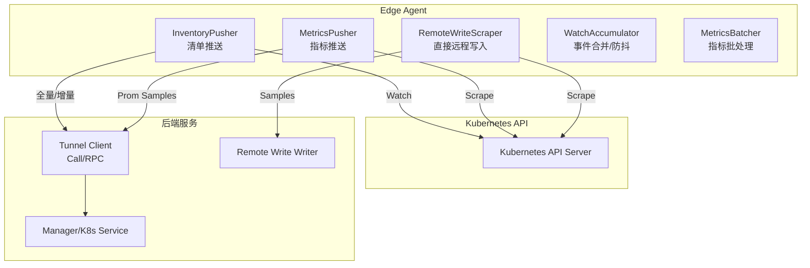
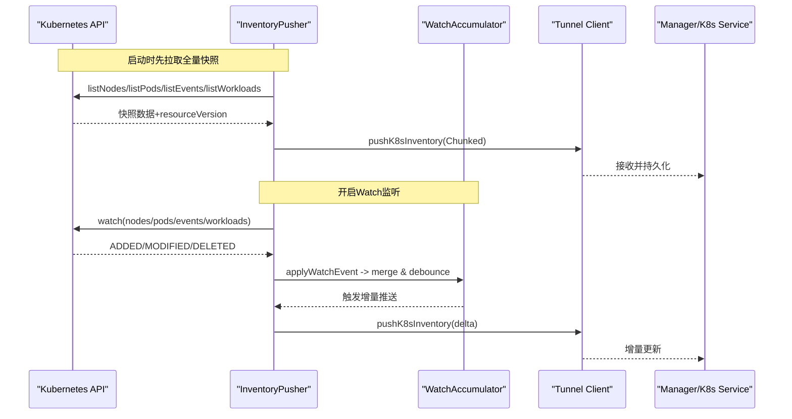
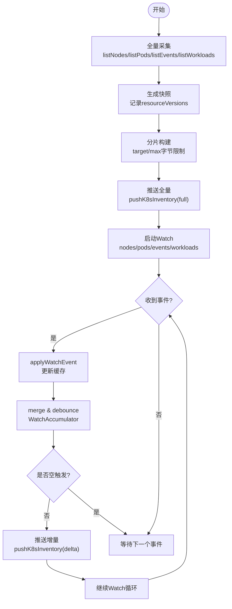
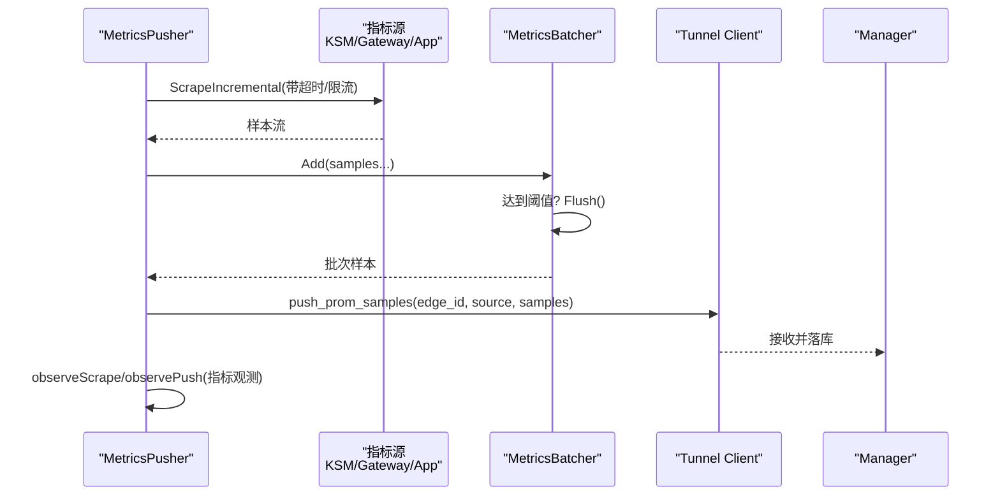
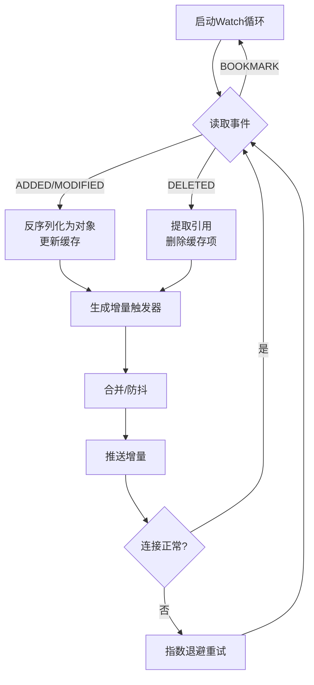
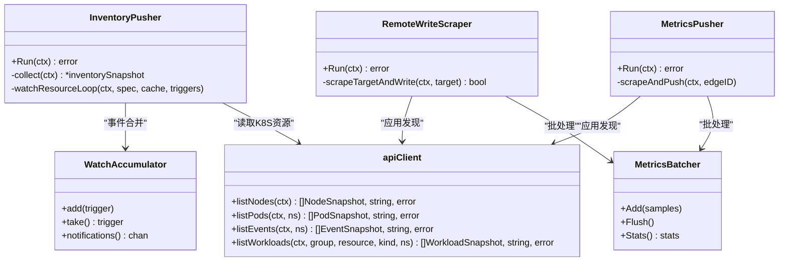

# 资源监控与采集

<cite>
**本文引用的文件**
- [inventory.go](file://internal/edgeagent/k8s/inventory.go)
- [inventory_chunk.go](file://internal/edgeagent/k8s/inventory_chunk.go)
- [inventory_delta.go](file://internal/edgeagent/k8s/inventory_delta.go)
- [inventory_watch_accumulator.go](file://internal/edgeagent/k8s/inventory_watch_accumulator.go)
- [metrics.go](file://internal/edgeagent/k8s/metrics.go)
- [metrics_batch.go](file://internal/edgeagent/k8s/metrics_batch.go)
- [remote_write_scraper.go](file://internal/edgeagent/k8s/remote_write_scraper.go)
- [k8s.proto](file://api/manager/k8s/v1/k8s.proto)
- [types.go](file://internal/pkg/tunnel/types.go)
</cite>

## 目录
1. [简介](#简介)
2. [项目结构](#项目结构)
3. [核心组件](#核心组件)
4. [架构总览](#架构总览)
5. [详细组件分析](#详细组件分析)
6. [依赖关系分析](#依赖关系分析)
7. [性能考量](#性能考量)
8. [故障排查指南](#故障排查指南)
9. [结论](#结论)
10. [附录：配置与查询示例](#附录配置与查询示例)

## 简介
本技术文档聚焦于 Kubernetes 资源监控与数据采集，覆盖以下关键主题：
- 资源清单（Inventory）的构建与维护机制，包括 Node、Pod、Workload、Event 等资源的元数据收集与增量同步。
- 指标数据的采集与处理流程，包括 Prometheus 指标导出、自定义指标收集、批量聚合与传输优化。
- 资源变更监听机制，基于 Watch 模式实现增量更新与事件处理。
- 批量数据处理策略，涵盖数据聚合、去重与优化传输。
- 监控配置与查询示例，帮助获取与分析集群资源状态。
- 性能优化技巧与故障排查指南。

## 项目结构
本项目在 edge agent 侧实现了两类主要能力：
- 资源清单推送：定时全量快照 + Watch 增量事件，按 Chunk 分片上报。
- 指标采集与上报：支持 kube-state-metrics、OTLP Gateway 以及应用自动发现，采用批量化与重试写入。

图表来源
- [inventory.go:85-170](file://internal/edgeagent/k8s/inventory.go#L85-L170)
- [metrics.go:128-171](file://internal/edgeagent/k8s/metrics.go#L128-L171)
- [remote_write_scraper.go:135-189](file://internal/edgeagent/k8s/remote_write_scraper.go#L135-L189)
- [inventory_watch_accumulator.go:12-45](file://internal/edgeagent/k8s/inventory_watch_accumulator.go#L12-L45)
- [metrics_batch.go:19-61](file://internal/edgeagent/k8s/metrics_batch.go#L19-L61)
- [types.go:68-105](file://internal/pkg/tunnel/types.go#L68-L105)

章节来源
- [inventory.go:85-170](file://internal/edgeagent/k8s/inventory.go#L85-L170)
- [metrics.go:128-171](file://internal/edgeagent/k8s/metrics.go#L128-L171)
- [remote_write_scraper.go:135-189](file://internal/edgeagent/k8s/remote_write_scraper.go#L135-L189)
- [types.go:68-105](file://internal/pkg/tunnel/types.go#L68-L105)

## 核心组件
- InventoryPusher：负责周期性全量采集与 Watch 驱动的增量推送，维护资源版本与缓存，按 Chunk 分片上报。
- MetricsPusher：定时从 kube-state-metrics、Gateway 或自动发现的应用端点抓取指标，进行批处理并推送至数据面。
- RemoteWriteScraper：无隧道客户端的直接远程写入模式，抓取后通过 RemoteWriteWriter 写入存储。
- WatchAccumulator：对 Watch 事件进行合并与防抖，减少重复与抖动导致的频繁推送。
- MetricsBatcher：对指标样本进行大小与数量限制下的批处理，控制网络与序列化开销。
- apiClient：封装对 Kubernetes API 的只读访问，用于列举节点、Pod、事件与工作负载，以及应用发现。

章节来源
- [inventory.go:44-83](file://internal/edgeagent/k8s/inventory.go#L44-L83)
- [metrics.go:28-48](file://internal/edgeagent/k8s/metrics.go#L28-L48)
- [remote_write_scraper.go:45-56](file://internal/edgeagent/k8s/remote_write_scraper.go#L45-L56)
- [inventory_watch_accumulator.go:12-45](file://internal/edgeagent/k8s/inventory_watch_accumulator.go#L12-L45)
- [metrics_batch.go:19-61](file://internal/edgeagent/k8s/metrics_batch.go#L19-L61)
- [inventory.go:700-741](file://internal/edgeagent/k8s/inventory.go#L700-L741)

## 架构总览
整体数据流分为两条主线：
- 资源清单线：全量快照 + Watch 增量，按 Chunk 分片，经 Tunnel RPC 推送到 Manager。
- 指标采集线：抓取 kube-state-metrics/Gateway/App 指标，批处理后通过 Tunnel RPC 或直接 RemoteWrite 写入。

图表来源
- [inventory.go:85-170](file://internal/edgeagent/k8s/inventory.go#L85-L170)
- [inventory.go:346-444](file://internal/edgeagent/k8s/inventory.go#L346-L444)
- [inventory_watch_accumulator.go:22-45](file://internal/edgeagent/k8s/inventory_watch_accumulator.go#L22-L45)
- [inventory_delta.go:75-94](file://internal/edgeagent/k8s/inventory_delta.go#L75-L94)

## 详细组件分析

### 资源清单（Inventory）构建与维护
- 全量采集：定时周期内调用 Kubernetes API 列举 Node、Pod、Event、Workload，记录 resourceVersion 并生成快照。
- 增量监听：为各资源类型建立 Watch，根据事件类型（ADDED/MODIFIED/DELETED）更新本地缓存，生成增量触发器。
- 合并与防抖：WatchAccumulator 将短时间内多个事件合并，避免抖动；支持 fullResync 强制全量重建。
- 分片上传：将快照拆分为多个 Chunk，每个 Chunk 包含部分资源列表，控制单条消息大小，降低网络压力。
- 资源版本管理：维护全局与分资源 resourceVersion，并在 Watch 断连或过期时触发全量重同步。

图表来源
- [inventory.go:536-594](file://internal/edgeagent/k8s/inventory.go#L536-L594)
- [inventory.go:346-444](file://internal/edgeagent/k8s/inventory.go#L346-L444)
- [inventory_watch_accumulator.go:47-93](file://internal/edgeagent/k8s/inventory_watch_accumulator.go#L47-L93)
- [inventory_chunk.go:17-94](file://internal/edgeagent/k8s/inventory_chunk.go#L17-L94)

章节来源
- [inventory.go:85-170](file://internal/edgeagent/k8s/inventory.go#L85-L170)
- [inventory.go:536-594](file://internal/edgeagent/k8s/inventory.go#L536-L594)
- [inventory.go:346-444](file://internal/edgeagent/k8s/inventory.go#L346-L444)
- [inventory_chunk.go:17-94](file://internal/edgeagent/k8s/inventory_chunk.go#L17-L94)
- [inventory_delta.go:75-94](file://internal/edgeagent/k8s/inventory_delta.go#L75-L94)

### 指标数据采集与处理
- 目标来源：kube-state-metrics、telemetry-gateway、应用自动发现（基于 Pod 注解）。
- 抓取与限流：使用 metricscommon.ScrapeIncremental 增量抓取，支持 sampleLimit 与超时控制。
- 批处理：MetricsBatcher 按样本数与字节数限制进行分批，避免单次请求过大。
- 推送与观测：通过 Tunnel RPC 推送 Prom Samples，同时暴露过程指标（抓取成功/失败、批次统计、耗时直方图）。
- 可选状态上报：可上报抓取状态样本，便于健康检查与告警。

图表来源
- [metrics.go:161-230](file://internal/edgeagent/k8s/metrics.go#L161-L230)
- [metrics_batch.go:63-112](file://internal/edgeagent/k8s/metrics_batch.go#L63-L112)
- [metrics.go:311-326](file://internal/edgeagent/k8s/metrics.go#L311-L326)

章节来源
- [metrics.go:128-171](file://internal/edgeagent/k8s/metrics.go#L128-L171)
- [metrics.go:161-230](file://internal/edgeagent/k8s/metrics.go#L161-L230)
- [metrics_batch.go:63-112](file://internal/edgeagent/k8s/metrics_batch.go#L63-L112)
- [metrics.go:311-326](file://internal/edgeagent/k8s/metrics.go#L311-L326)

### 资源变更监听机制（Watch）
- 多资源 Watch：为 nodes、pods、events 以及多种 workload（Deployment、StatefulSet、DaemonSet、ReplicaSet、Job、CronJob）建立 Watch。
- 事件处理：根据事件类型更新本地缓存，生成增量触发器；支持 BOOKMARK 忽略。
- 错误恢复：遇到权限不足或资源不存在则禁用该资源 Watch；资源版本过期触发全量重同步。
- 退避重试：Watch 断开后进行指数退避重试，上限控制。

图表来源
- [inventory.go:377-444](file://internal/edgeagent/k8s/inventory.go#L377-L444)
- [inventory_delta.go:75-94](file://internal/edgeagent/k8s/inventory_delta.go#L75-L94)
- [inventory_watch_accumulator.go:163-195](file://internal/edgeagent/k8s/inventory_watch_accumulator.go#L163-L195)

章节来源
- [inventory.go:377-444](file://internal/edgeagent/k8s/inventory.go#L377-L444)
- [inventory_delta.go:75-94](file://internal/edgeagent/k8s/inventory_delta.go#L75-L94)
- [inventory_watch_accumulator.go:163-195](file://internal/edgeagent/k8s/inventory_watch_accumulator.go#L163-L195)

### 批量数据处理策略
- 清单分片：按 target/max 字节限制拆分快照，确保单条消息不超过上限，提升传输稳定性。
- 指标批处理：按样本数与字节数双阈值控制批次大小，超限时立即 Flush，避免阻塞。
- 去重与合并：WatchAccumulator 对同一资源的多事件进行合并，消除重复 upsert/delete 冲突。
- 重试与回退：RemoteWrite 路径支持最大重试次数与指数退避，提高可靠性。

章节来源
- [inventory_chunk.go:17-94](file://internal/edgeagent/k8s/inventory_chunk.go#L17-L94)
- [metrics_batch.go:63-112](file://internal/edgeagent/k8s/metrics_batch.go#L63-L112)
- [inventory_watch_accumulator.go:47-93](file://internal/edgeagent/k8s/inventory_watch_accumulator.go#L47-L93)
- [remote_write_scraper.go:279-306](file://internal/edgeagent/k8s/remote_write_scraper.go#L279-L306)

## 依赖关系分析
- InventoryPusher 依赖 apiClient 进行 Kubernetes API 读取，依赖 tunnel.Client 进行 RPC 推送。
- MetricsPusher 依赖 metricscommon 进行抓取，依赖 tunnel.Client 推送样本，依赖 metricsObserver 暴露过程指标。
- RemoteWriteScraper 依赖 RemoteWriteWriter 直接写入存储，同样具备应用发现能力。
- WatchAccumulator 与 inventoryCache 共同支撑增量逻辑，保证一致性。

图表来源
- [inventory.go:44-83](file://internal/edgeagent/k8s/inventory.go#L44-L83)
- [inventory.go:700-741](file://internal/edgeagent/k8s/inventory.go#L700-L741)
- [metrics.go:28-48](file://internal/edgeagent/k8s/metrics.go#L28-L48)
- [remote_write_scraper.go:45-56](file://internal/edgeagent/k8s/remote_write_scraper.go#L45-L56)
- [inventory_watch_accumulator.go:12-45](file://internal/edgeagent/k8s/inventory_watch_accumulator.go#L12-L45)
- [metrics_batch.go:19-61](file://internal/edgeagent/k8s/metrics_batch.go#L19-L61)

章节来源
- [inventory.go:44-83](file://internal/edgeagent/k8s/inventory.go#L44-L83)
- [inventory.go:700-741](file://internal/edgeagent/k8s/inventory.go#L700-L741)
- [metrics.go:28-48](file://internal/edgeagent/k8s/metrics.go#L28-L48)
- [remote_write_scraper.go:45-56](file://internal/edgeagent/k8s/remote_write_scraper.go#L45-L56)
- [inventory_watch_accumulator.go:12-45](file://internal/edgeagent/k8s/inventory_watch_accumulator.go#L12-L45)
- [metrics_batch.go:19-61](file://internal/edgeagent/k8s/metrics_batch.go#L19-L61)

## 性能考量
- 抓取与推送超时：合理设置 Interval、Timeout、PushTimeout，避免长时间阻塞。
- 样本限制：配置 SampleLimit、BatchSampleLimit、BatchByteLimit，防止大流量冲击。
- Watch 退避：Watch 断开后指数退避重试，上限控制，避免雪崩。
- 分片与批处理：清单按字节分片，指标按样本与字节批处理，降低网络与序列化成本。
- 资源版本：维护 resourceVersion，及时触发全量重同步，保证一致性。

[本节提供通用指导，不直接分析具体文件]

## 故障排查指南
- 权限问题：若 Watch 返回 forbidden/not found，对应资源 Watch 将被禁用，需检查 RBAC 与 API 可用性。
- 资源版本过期：当 resourceVersion 过期时触发全量重同步，检查 API 连通性与版本管理。
- 抓取失败：日志中会记录 scrape failed、limit exceeded、push partially failed 等情况，结合 endpoint 与 timeout 排查。
- 批处理拒绝：当单个样本编码后超过 batch byte limit，会被拒绝并记录，检查样本标签与值大小。
- 远写失败：RemoteWrite 路径支持重试，多次失败后记录错误，检查 writer 实现与网络。

章节来源
- [inventory.go:407-424](file://internal/edgeagent/k8s/inventory.go#L407-L424)
- [metrics.go:257-288](file://internal/edgeagent/k8s/metrics.go#L257-L288)
- [metrics_batch.go:63-87](file://internal/edgeagent/k8s/metrics_batch.go#L63-L87)
- [remote_write_scraper.go:279-306](file://internal/edgeagent/k8s/remote_write_scraper.go#L279-L306)

## 结论
本项目在 Edge Agent 侧实现了高可靠、可扩展的 Kubernetes 资源监控与数据采集能力：
- 通过全量快照与 Watch 增量相结合，保障资源清单的实时性与一致性。
- 通过批处理与分片策略，优化网络与序列化开销，提升吞吐与稳定性。
- 通过指标观测与日志记录，提供可观测性与排障依据。
- 支持两种数据面接入方式（Tunnel RPC 与 RemoteWrite），满足不同部署场景需求。

[本节总结性内容，不直接分析具体文件]

## 附录：配置与查询示例
- 清单查询接口：
  - 列出节点：ListNodesRequest(cluster_id, limit, offset, q, issue_only)
  - 列出工作负载：ListWorkloadsRequest(cluster_id, namespace, kind, limit, offset, q, issue_only, group_replica_sets)
  - 列出 Pod：ListPodsRequest(cluster_id, namespace, node_name, phase, reason, limit, offset, q, issue_only)
  - 列出事件：ListEventsRequest(cluster_id, namespace, type, reason, involved_kind, involved_name, limit, offset, q, issue_only)
- 指标观测：
  - 抓取样本计数：ongrid_edge_k8s_metrics_scrape_samples_total{source}
  - 超出限制计数：ongrid_edge_k8s_metrics_scrape_limit_exceeded_total{source}
  - 推送批次计数：ongrid_edge_k8s_metrics_push_batches_total{source,result}
  - 推送样本计数：ongrid_edge_k8s_metrics_push_samples_total{source,result}
  - 最近成功时间：ongrid_edge_k8s_metrics_last_success_timestamp_seconds{source}
  - 抓取耗时直方图：ongrid_edge_k8s_metrics_scrape_duration_seconds{source}
- 典型查询思路：
  - 查看最近一次成功的抓取时间，判断链路健康。
  - 对比 observed 与 accepted 样本数，评估限流影响。
  - 关注 rejected 样本与失败批次，定位异常指标或网络问题。

章节来源
- [k8s.proto:16-27](file://api/manager/k8s/v1/k8s.proto#L16-L27)
- [k8s.proto:259-329](file://api/manager/k8s/v1/k8s.proto#L259-L329)
- [metrics_observer.go:40-83](file://internal/edgeagent/k8s/metrics_observer.go#L40-L83)
- [metrics_observer.go:85-119](file://internal/edgeagent/k8s/metrics_observer.go#L85-L119)