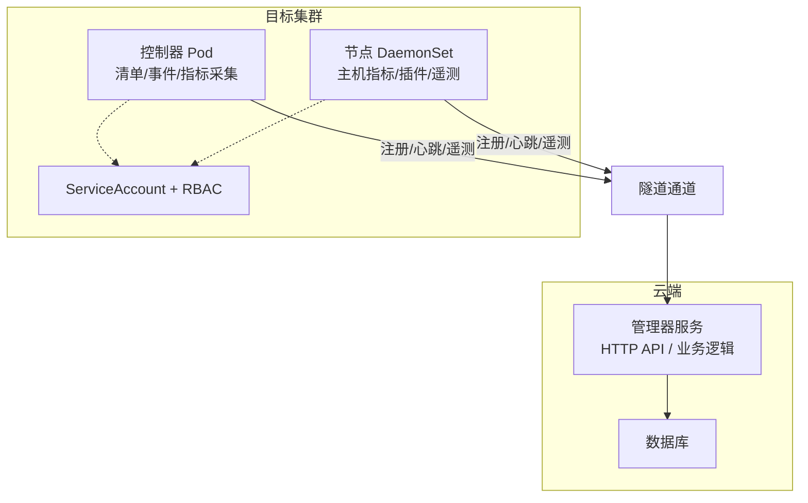
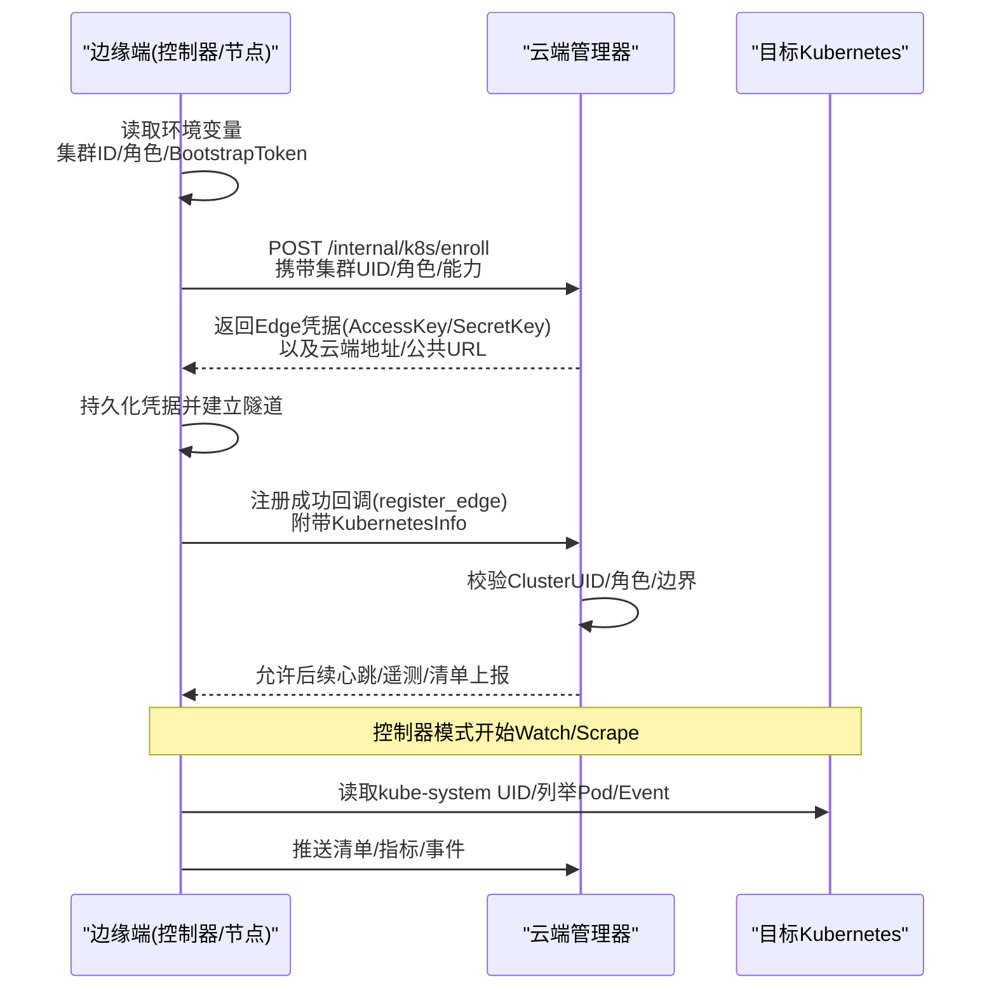
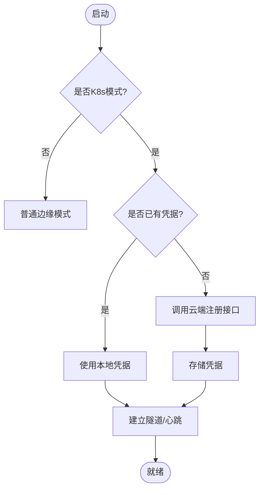
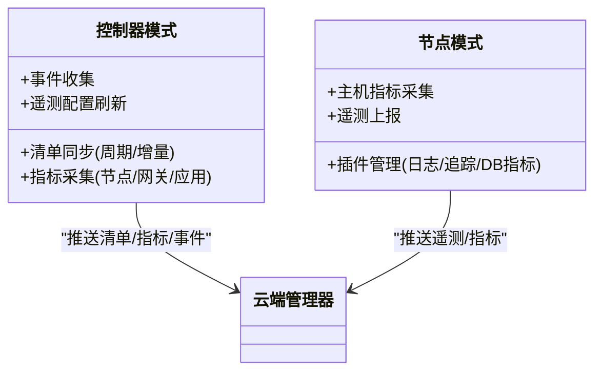
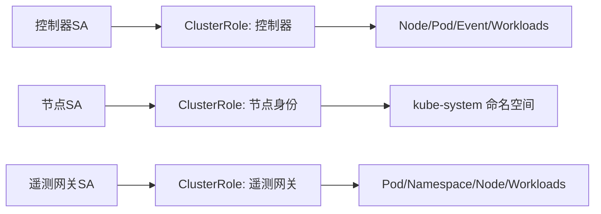
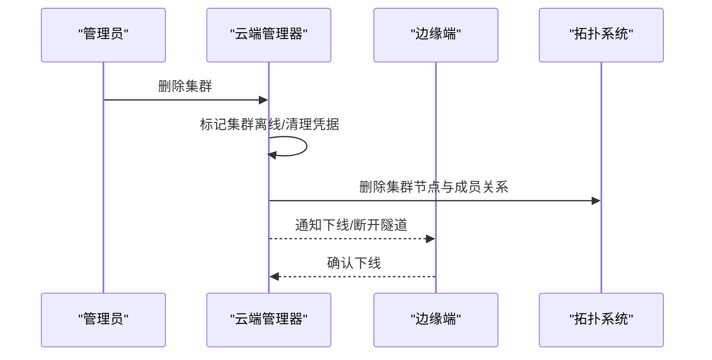
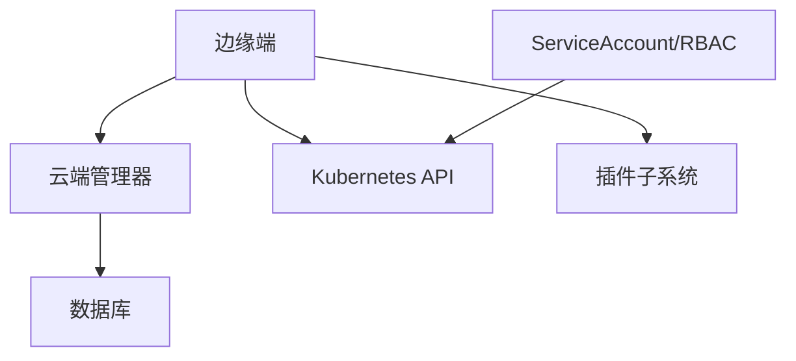

# 集群生命周期管理

<cite>
**本文引用的文件**
- [README.md](file://README.md)
- [main.go（云端管理器）](file://cmd/ongrid/main.go)
- [main.go（边缘端）](file://cmd/ongrid-edge/main.go)
- [k8s.proto（API 定义）](file://api/manager/k8s/v1/k8s.proto)
- [usecase.go（K8s 用例）](file://internal/manager/biz/k8s/usecase.go)
- [repo.go（K8s 存储绑定）](file://internal/manager/data/k8s/store/repo.go)
- [identity.go（集群身份发现）](file://internal/edgeagent/k8s/identity.go)
- [rbac.yaml（RBAC 模板）](file://deploy/kubernetes/ongrid-edge/templates/rbac.yaml)
- [serviceaccount.yaml（ServiceAccount 模板）](file://deploy/kubernetes/ongrid-edge/templates/serviceaccount.yaml)
- [deployment.yaml（控制器部署）](file://deploy/kubernetes/ongrid-edge/templates/deployment.yaml)
- [daemonset.yaml（节点守护进程）](file://deploy/kubernetes/ongrid-edge/templates/daemonset.yaml)
- [controller-credentials-secret.yaml（控制器凭据 Secret）](file://deploy/kubernetes/ongrid-edge/templates/controller-credentials-secret.yaml)
- [redact.go（敏感信息脱敏）](file://internal/pkg/k8sredact/redact.go)
</cite>

## 目录
1. [简介](#简介)
2. [项目结构](#项目结构)
3. [核心组件](#核心组件)
4. [架构总览](#架构总览)
5. [详细组件分析](#详细组件分析)
6. [依赖关系分析](#依赖关系分析)
7. [性能考量](#性能考量)
8. [故障排查指南](#故障排查指南)
9. [结论](#结论)
10. [附录](#附录)

## 简介
本技术文档聚焦于 Ongrid 平台对 Kubernetes 集群的全生命周期管理能力，涵盖：
- 集群注册与连接建立：从边缘侧发起注册、云端校验并下发凭据，建立隧道与心跳。
- 资源发现与健康监控：控制器模式采集清单、事件与指标；节点模式上报主机与插件遥测。
- 身份认证与访问控制：ServiceAccount、RBAC 最小权限原则与凭据轮换。
- 集群下线流程：资源清理、连接断开与状态同步。
- 自动化配置与管理操作：通过 Helm 模板与环境变量完成一键部署与运维。
- 常见问题排查与最佳实践：围绕注册失败、鉴权拒绝、指标缺失等场景提供定位方法。

## 项目结构
Ongrid 由“云端管理器”和“边缘端”两部分组成，并通过隧道协议进行双向通信。Kubernetes 相关能力以“控制器模式”和“节点模式”两种形态运行在目标集群中：
- 云端管理器：负责集群元数据、注册审批、健康聚合、拓扑映射与对外 API。
- 边缘端：负责与云端建立隧道、上报指标/日志/追踪、执行工具调用、在 K8s 模式下拉取清单与事件。

图示来源
- [main.go（云端管理器）:208-294](file://cmd/ongrid/main.go#L208-L294)
- [main.go（边缘端）:130-149](file://cmd/ongrid-edge/main.go#L130-L149)
- [deployment.yaml:68-143](file://deploy/kubernetes/ongrid-edge/templates/deployment.yaml#L68-L143)
- [daemonset.yaml:75-143](file://deploy/kubernetes/ongrid-edge/templates/daemonset.yaml#L75-L143)

章节来源
- [README.md:30-56](file://README.md#L30-L56)
- [main.go（云端管理器）:208-294](file://cmd/ongrid/main.go#L208-L294)
- [main.go（边缘端）:130-149](file://cmd/ongrid-edge/main.go#L130-L149)

## 核心组件
- 集群注册与会话建立
  - 边缘端读取集群 ID、角色、Bootstrap Token 等环境变量，向云端内部接口发起注册请求，获取 Edge 凭据（AccessKey/SecretKey）并持久化。
  - 云端校验 Bootstrap Token 与集群 UID，创建或更新集群记录，下发凭据并建立隧道会话。
- 资源发现与监控
  - 控制器模式：周期性全量同步与增量 Watch，收集 Node/Pod/Event/Workload 等清单，推送指标到云端。
  - 节点模式：采集主机指标、启动插件（日志/追踪/数据库指标等），通过隧道上报。
- 身份认证与访问控制
  - 使用 ServiceAccount 与 RBAC 限制对 kube-system 命名空间、Node/Pod/Event 等的只读或必要写权限。
  - 控制器与节点分别拥有独立 SA 与最小权限集合。
- 集群下线
  - 删除集群时，云端标记离线、清理关联的边设备、拓扑节点与遥测凭据，并触发拓扑回滚。

章节来源
- [main.go（边缘端）:537-668](file://cmd/ongrid-edge/main.go#L537-L668)
- [usecase.go:1395-1448](file://internal/manager/biz/k8s/usecase.go#L1395-L1448)
- [repo.go:169-200](file://internal/manager/data/k8s/store/repo.go#L169-L200)
- [rbac.yaml:101-174](file://deploy/kubernetes/ongrid-edge/templates/rbac.yaml#L101-L174)

## 架构总览
以下序列图展示“集群注册—连接建立—资源发现”的关键流程：

图示来源
- [main.go（边缘端）:537-668](file://cmd/ongrid-edge/main.go#L537-L668)
- [usecase.go:1395-1448](file://internal/manager/biz/k8s/usecase.go#L1395-L1448)
- [identity.go:11-33](file://internal/edgeagent/k8s/identity.go#L11-L33)

章节来源
- [main.go（边缘端）:537-668](file://cmd/ongrid-edge/main.go#L537-L668)
- [usecase.go:1395-1448](file://internal/manager/biz/k8s/usecase.go#L1395-L1448)
- [identity.go:11-33](file://internal/edgeagent/k8s/identity.go#L11-L33)

## 详细组件分析

### 集群注册与会话建立
- 边缘端启动后检测是否处于 K8s 模式，若未加载本地凭据则使用 Bootstrap Token 调用云端内部接口完成注册，获得 AccessKey/SecretKey 并写入本地 Secret。
- 云端收到 register_edge 时，校验 ClusterUID、角色与 Edge 归属，确保同一物理集群不被重复绑定不同 UID。
- 成功后建立隧道会话，开启心跳与遥测通道。

图示来源
- [main.go（边缘端）:537-668](file://cmd/ongrid-edge/main.go#L537-L668)
- [usecase.go:1395-1448](file://internal/manager/biz/k8s/usecase.go#L1395-L1448)

章节来源
- [main.go（边缘端）:537-668](file://cmd/ongrid-edge/main.go#L537-L668)
- [usecase.go:1395-1448](file://internal/manager/biz/k8s/usecase.go#L1395-L1448)

### 资源发现与监控
- 控制器模式：
  - 通过环境变量启用 Watch 与全量同步间隔，周期性抓取 Node/Pod/Event/Workload 并推送到云端。
  - 支持应用指标发现与网关指标采集，按批与字节限制推送，避免过载。
- 节点模式：
  - 采集主机指标，启动日志/追踪/数据库指标等插件，统一通过隧道上报。
  - 支持远程写入 Prometheus Remote Write 或经代理鉴权上报。

图示来源
- [main.go（边缘端）:231-280](file://cmd/ongrid-edge/main.go#L231-L280)
- [main.go（边缘端）:302-417](file://cmd/ongrid-edge/main.go#L302-L417)

章节来源
- [main.go（边缘端）:231-280](file://cmd/ongrid-edge/main.go#L231-L280)
- [main.go（边缘端）:302-417](file://cmd/ongrid-edge/main.go#L302-L417)

### 身份认证与访问控制（ServiceAccount 与 RBAC）
- 控制器 SA：具备对 Node/Pod/Event/Deployment/StatefulSet/DaemonSet/Job/CronJob 的只读与必要的写权限（如驱逐、Patch）。
- 节点 SA：仅能读取 kube-system 命名空间以发现集群 UID，满足最小权限原则。
- 遥测网关 SA：在启用遥测网关时授予对 Pod/Namespace/Node 及工作负载资源的只读权限，用于属性提取。
- 自动挂载令牌：仅在需要 app metrics discovery 时启用，减少不必要暴露。

图示来源
- [rbac.yaml:101-174](file://deploy/kubernetes/ongrid-edge/templates/rbac.yaml#L101-L174)
- [serviceaccount.yaml:1-35](file://deploy/kubernetes/ongrid-edge/templates/serviceaccount.yaml#L1-L35)

章节来源
- [rbac.yaml:101-174](file://deploy/kubernetes/ongrid-edge/templates/rbac.yaml#L101-L174)
- [serviceaccount.yaml:1-35](file://deploy/kubernetes/ongrid-edge/templates/serviceaccount.yaml#L1-L35)

### 集群下线流程
- 删除集群时，云端将集群状态置为离线，清理拓扑中的集群节点与成员关系，并移除遥测凭据。
- 边缘侧停止清单与指标推送，断开隧道，释放本地状态。

图示来源
- [usecase.go:1212-1224](file://internal/manager/biz/k8s/usecase_test.go#L1212-L1224)

章节来源
- [usecase.go:1212-1224](file://internal/manager/biz/k8s/usecase_test.go#L1212-L1224)

### 配置示例与管理操作
- 控制器部署：
  - 通过 Deployment 注入环境变量：集群 ID、Bootstrap Token、凭据 Secret、遥测开关、清单同步间隔、指标端点等。
  - 使用 ConfigMap 与 Secret 管理配置与密钥，变更时通过 checksum 注解触发滚动更新。
- 节点守护进程：
  - 通过 DaemonSet 在每个节点运行，chroot 进入宿主机根文件系统，挂载宿主 /proc 与 /sys，安全地采集主机指标。
  - 通过 projected volume 注入短期有效的 ServiceAccount Token 与 CA，支持 kubelet 令牌轮换。

章节来源
- [deployment.yaml:68-143](file://deploy/kubernetes/ongrid-edge/templates/deployment.yaml#L68-L143)
- [daemonset.yaml:75-143](file://deploy/kubernetes/ongrid-edge/templates/daemonset.yaml#L75-L143)
- [controller-credentials-secret.yaml:1-16](file://deploy/kubernetes/ongrid-edge/templates/controller-credentials-secret.yaml#L1-L16)

## 依赖关系分析
- 边缘端依赖云端管理器提供的注册接口与隧道通道；云端管理器依赖数据库持久化集群与节点信息。
- 控制器模式依赖 Kubernetes API Server 进行清单与事件拉取；节点模式依赖宿主环境与插件子系统。
- RBAC 严格限定各 SA 的读写范围，避免越权访问。

图示来源
- [main.go（云端管理器）:208-294](file://cmd/ongrid/main.go#L208-L294)
- [main.go（边缘端）:130-149](file://cmd/ongrid-edge/main.go#L130-L149)
- [rbac.yaml:101-174](file://deploy/kubernetes/ongrid-edge/templates/rbac.yaml#L101-L174)

章节来源
- [main.go（云端管理器）:208-294](file://cmd/ongrid/main.go#L208-L294)
- [main.go（边缘端）:130-149](file://cmd/ongrid-edge/main.go#L130-L149)
- [rbac.yaml:101-174](file://deploy/kubernetes/ongrid-edge/templates/rbac.yaml#L101-L174)

## 性能考量
- 指标推送采用批量与字节限制，避免网络拥塞与后端压力。
- 清单同步支持 Watch 增量与周期全量结合，降低 API 压力。
- 遥测配置可动态刷新，保证端点与鉴权参数变更无需重启。
- 节点模式 chroot 与只读根文件系统提升安全性与稳定性。

[本节为通用指导，不直接分析具体文件]

## 故障排查指南
- 注册失败
  - 检查 Bootstrap Token 是否正确、云端接口可达性与 TLS 设置。
  - 查看云端日志中关于 ClusterUID 冲突或凭据缺失的错误。
- 鉴权拒绝
  - 核对 RBAC 是否已正确应用，SA 是否具备所需权限。
  - 确认控制器/节点 SA 与对应 Role/ClusterRoleBinding 匹配。
- 指标缺失
  - 验证指标端点配置与超时、样本限制；检查应用指标发现开关。
  - 确认插件子进程健康状态与重启计数。
- 敏感信息泄露
  - 使用内置脱敏工具对日志与标签中的敏感字段进行遮蔽。

章节来源
- [redact.go:1-42](file://internal/pkg/k8sredact/redact.go#L1-L42)

## 结论
Ongrid 通过“云端管理器 + 边缘端”的双端架构，结合严格的 RBAC 与最小权限原则，实现了对 Kubernetes 集群的完整生命周期管理。其注册流程健壮、资源发现高效、监控体系完善，并提供灵活的配置与自动化部署能力。在生产环境中，建议遵循最小权限、定期轮换凭据、合理设置指标与清单同步策略，以确保稳定与安全。

[本节为总结性内容，不直接分析具体文件]

## 附录
- API 参考
  - 集群管理 API 包括创建、列出、健康检查、节点/工作负载/事件查询、引导令牌旋转与删除集群等。

章节来源
- [k8s.proto:9-27](file://api/manager/k8s/v1/k8s.proto#L9-L27)