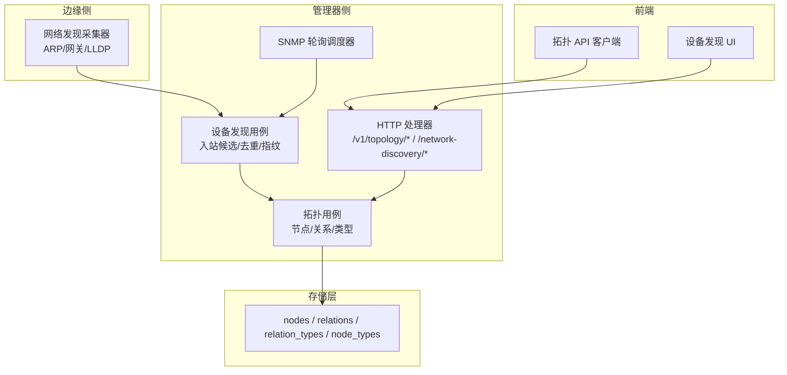
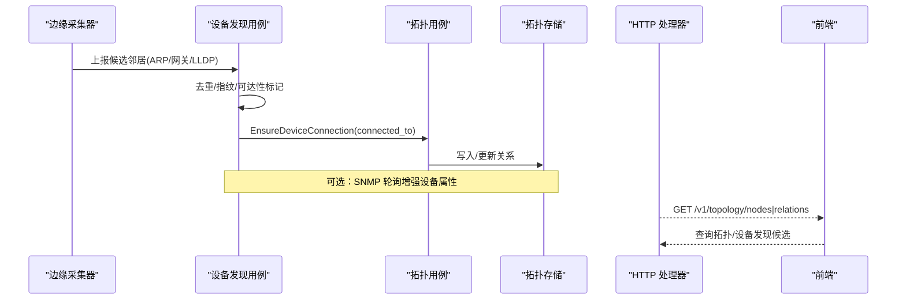
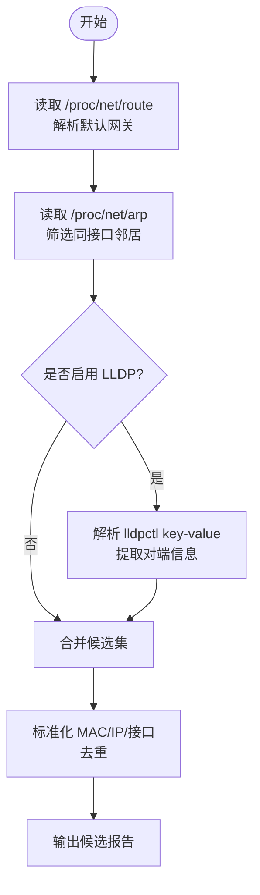
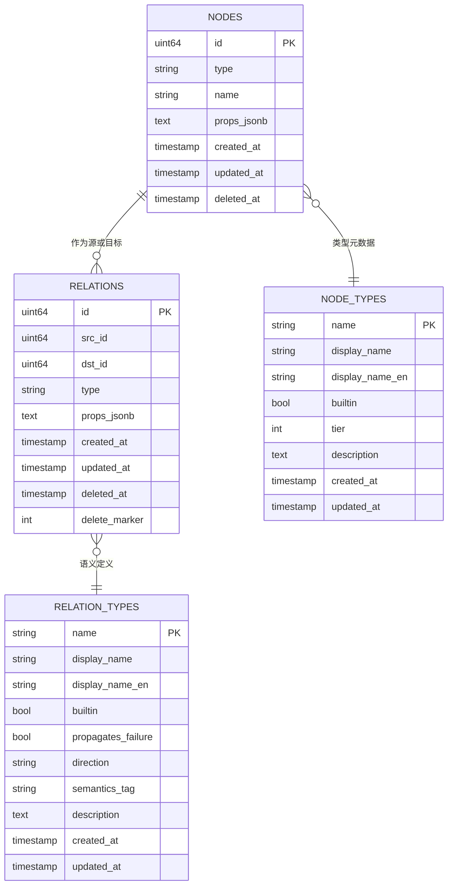
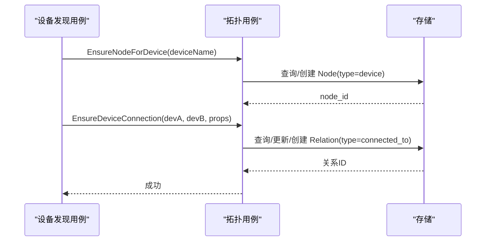
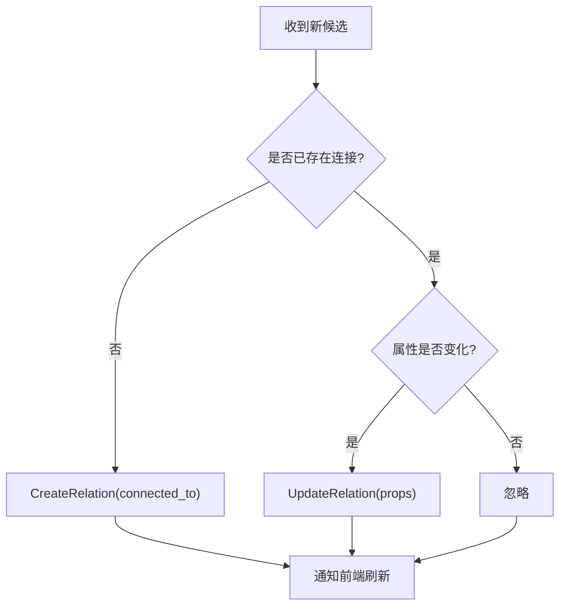
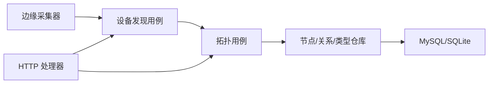

# 网络拓扑管理

<cite>
**本文引用的文件**
- [internal/edgeagent/collector/network_discovery.go](file://internal/edgeagent/collector/network_discovery.go)
- [internal/manager/biz/device/network_discovery.go](file://internal/manager/biz/device/network_discovery.go)
- [internal/manager/biz/device/network_poll_scheduler.go](file://internal/manager/biz/device/network_poll_scheduler.go)
- [internal/manager/server/device/http.go](file://internal/manager/server/device/http.go)
- [internal/manager/model/topology/model.go](file://internal/manager/model/topology/model.go)
- [internal/manager/data/topology/store/migrate.go](file://internal/manager/data/topology/store/migrate.go)
- [internal/manager/data/topology/store/node_repo.go](file://internal/manager/data/topology/store/node_repo.go)
- [internal/manager/data/topology/store/relation_repo.go](file://internal/manager/data/topology/store/relation_repo.go)
- [internal/manager/biz/topology/usecase.go](file://internal/manager/biz/topology/usecase.go)
- [internal/manager/server/topology/http.go](file://internal/manager/server/topology/http.go)
- [web/src/api/topology.ts](file://web/src/api/topology.ts)
- [web/src/api/devices.ts](file://web/src/api/devices.ts)
- [web/src/pages/Edges.tsx](file://web/src/pages/Edges.tsx)
</cite>

## 目录
1. [简介](#简介)
2. [项目结构](#项目结构)
3. [核心组件](#核心组件)
4. [架构总览](#架构总览)
5. [详细组件分析](#详细组件分析)
6. [依赖关系分析](#依赖关系分析)
7. [性能考虑](#性能考虑)
8. [故障排查指南](#故障排查指南)
9. [结论](#结论)
10. [附录：API与使用示例](#附录api与使用示例)

## 简介
本技术文档围绕网络拓扑管理系统，系统性阐述以下能力：
- 拓扑构建算法：设备发现、关系映射与拓扑图生成。
- 网络扫描机制：ARP 邻居读取、默认网关解析、LLDP 邻居收集，以及可选的 SNMP 轮询增强。
- 拓扑数据存储与索引：节点与关系建模、查询优化与软删除策略。
- 动态拓扑更新：实时设备变更检测、连接状态维护与拓扑重构。
- 拓扑查询 API 与前端可视化：如何查询与分析网络结构。
- 准确性验证、性能调优与故障排查建议。

## 项目结构
系统由“边缘采集 + 管理器服务 + 存储层 + 前端”构成：
- 边缘侧（Edge Agent）：被动读取本地 ARP、路由表与 LLDP，产出候选邻居报告。
- 管理器侧（Manager）：接收并合并候选数据，持久化为拓扑节点与关系；提供拓扑 CRUD 与设备发现配置接口；周期性调度 SNMP 轮询以增强信息。
- 存储层（GORM + MySQL/SQLite）：节点、关系、关系类型、节点类型的统一图模型，内置种子数据与迁移脚本。
- 前端（Web SPA）：通过 REST API 展示拓扑、设备发现候选与邻接关系。

图表来源
- [internal/edgeagent/collector/network_discovery.go:18-113](file://internal/edgeagent/collector/network_discovery.go#L18-L113)
- [internal/manager/biz/device/network_discovery.go:138-308](file://internal/manager/biz/device/network_discovery.go#L138-L308)
- [internal/manager/biz/device/network_poll_scheduler.go:9-50](file://internal/manager/biz/device/network_poll_scheduler.go#L9-L50)
- [internal/manager/server/topology/http.go:48-76](file://internal/manager/server/topology/http.go#L48-L76)
- [internal/manager/data/topology/store/migrate.go:16-39](file://internal/manager/data/topology/store/migrate.go#L16-L39)
- [web/src/api/topology.ts:1-39](file://web/src/api/topology.ts#L1-L39)
- [web/src/pages/Edges.tsx:1564-1593](file://web/src/pages/Edges.tsx#L1564-L1593)

章节来源
- [internal/edgeagent/collector/network_discovery.go:18-113](file://internal/edgeagent/collector/network_discovery.go#L18-L113)
- [internal/manager/server/topology/http.go:48-76](file://internal/manager/server/topology/http.go#L48-L76)
- [internal/manager/data/topology/store/migrate.go:16-39](file://internal/manager/data/topology/store/migrate.go#L16-L39)

## 核心组件
- 网络发现采集器（Edge）：从 /proc/net/route、/proc/net/arp 与 lldpctl 被动收集邻居，过滤虚拟接口，标准化 MAC/IP，输出候选报告。
- 设备发现用例（Manager）：将候选报告转换为设备网络资料，计算强标识指纹，支持 SNMP 轮询配置与执行，记录可达性与错误。
- 拓扑用例（Manager）：统一的图操作门面，负责节点/关系/类型的创建、更新、删除与校验，包含设备到拓扑节点的镜像、集群归属、Kubernetes 集群镜像等。
- 拓扑存储（Store）：基于 GORM 的节点、关系、关系类型、节点类型仓库，提供迁移、种子数据与回填逻辑。
- HTTP 处理器（Manager）：暴露 /v1/topology/* 与 /network-discovery/* 接口，进行鉴权、参数校验与 DTO 转换。
- 前端（Web）：调用拓扑与设备发现 API，渲染拓扑节点、关系与设备发现候选列表。

章节来源
- [internal/edgeagent/collector/network_discovery.go:18-113](file://internal/edgeagent/collector/network_discovery.go#L18-L113)
- [internal/manager/biz/device/network_discovery.go:138-308](file://internal/manager/biz/device/network_discovery.go#L138-L308)
- [internal/manager/biz/topology/usecase.go:15-146](file://internal/manager/biz/topology/usecase.go#L15-L146)
- [internal/manager/data/topology/store/migrate.go:16-39](file://internal/manager/data/topology/store/migrate.go#L16-L39)
- [internal/manager/server/topology/http.go:48-76](file://internal/manager/server/topology/http.go#L48-L76)
- [web/src/api/topology.ts:1-39](file://web/src/api/topology.ts#L1-L39)

## 架构总览
下图展示了从边缘采集到管理器处理、再到存储与前端展示的完整链路。

图表来源
- [internal/edgeagent/collector/network_discovery.go:43-113](file://internal/edgeagent/collector/network_discovery.go#L43-L113)
- [internal/manager/biz/device/network_discovery.go:505-542](file://internal/manager/biz/device/network_discovery.go#L505-L542)
- [internal/manager/biz/topology/usecase.go:222-246](file://internal/manager/biz/topology/usecase.go#L222-L246)
- [internal/manager/server/topology/http.go:169-199](file://internal/manager/server/topology/http.go#L169-L199)
- [web/src/api/topology.ts:23-31](file://web/src/api/topology.ts#L23-L31)

## 详细组件分析

### 网络发现与扫描机制（ARP/网关/LLDP/SNMP）
- 被动采集：
  - 解析 /proc/net/route 获取默认网关与出口接口。
  - 解析 /proc/net/arp 获取邻居 ARP 表项，仅保留与默认网关同接口的条目。
  - 调用 lldpctl 解析 LLDP key-value 输出，提取对端机箱 ID、管理 IP、端口名，并附带链路信息。
  - 过滤虚拟化接口前缀（docker、br-、veth、cni、virbr、flannel、cali、tun、tap、lo 等）。
- 标准化与去重：
  - MAC 归一化（去除分隔符、小写、分段），IP 与接口名 trim。
  - 以 IP+MAC+Interface 为键去重，避免重复候选。
- SNMP 轮询增强：
  - 管理器侧可配置 SNMP 轮询开关、间隔、凭证与端口。
  - 调度器按周期触发，通过隧道 RPC 调用边缘探针执行只读 SNMP 查询，填充接口、流量、状态等属性。
  - 失败时记录 last_poll_error 与 reachability_status。

图表来源
- [internal/edgeagent/collector/network_discovery.go:73-113](file://internal/edgeagent/collector/network_discovery.go#L73-L113)
- [internal/edgeagent/collector/network_discovery.go:149-203](file://internal/edgeagent/collector/network_discovery.go#L149-L203)
- [internal/edgeagent/collector/network_discovery.go:205-275](file://internal/edgeagent/collector/network_discovery.go#L205-L275)

章节来源
- [internal/edgeagent/collector/network_discovery.go:18-113](file://internal/edgeagent/collector/network_discovery.go#L18-L113)
- [internal/manager/biz/device/network_poll_scheduler.go:9-50](file://internal/manager/biz/device/network_poll_scheduler.go#L9-L50)
- [internal/manager/biz/device/network_discovery.go:138-308](file://internal/manager/biz/device/network_discovery.go#L138-L308)

### 拓扑数据模型与存储
- 节点（Node）：type/name/props_jsonb，用于承载所有实体（device/service/cluster/app/rack）。
- 关系（Relation）：src_id/dst_id/type/props_jsonb，带软删除与唯一约束（含 delete_marker）。
- 关系类型（RelationType）：内置六种语义类型（member_of、depends_on、deployed_on、replicates_to、monitors、routes_to、connected_to），定义方向、传播失败与语义标签。
- 节点类型（NodeType）：内置五种节点类型，提供显示名与层级（tier）。
- 迁移与种子：启动时 AutoMigrate，插入/更新内置类型，回填 devices.node_id。

图表来源
- [internal/manager/model/topology/model.go:43-78](file://internal/manager/model/topology/model.go#L43-L78)
- [internal/manager/model/topology/model.go:136-217](file://internal/manager/model/topology/model.go#L136-L217)
- [internal/manager/model/topology/model.go:219-330](file://internal/manager/model/topology/model.go#L219-L330)
- [internal/manager/data/topology/store/migrate.go:16-39](file://internal/manager/data/topology/store/migrate.go#L16-L39)

章节来源
- [internal/manager/model/topology/model.go:43-78](file://internal/manager/model/topology/model.go#L43-L78)
- [internal/manager/data/topology/store/migrate.go:16-39](file://internal/manager/data/topology/store/migrate.go#L16-L39)
- [internal/manager/data/topology/store/node_repo.go:24-51](file://internal/manager/data/topology/store/node_repo.go#L24-L51)
- [internal/manager/data/topology/store/relation_repo.go:15-21](file://internal/manager/data/topology/store/relation_repo.go#L15-L21)

### 拓扑构建算法：设备发现 → 关系映射 → 图生成
- 设备→节点镜像：根据设备名称在拓扑中查找或创建 type=device 的节点，返回 node_id。
- 物理连接映射：EnsureDeviceConnection 将两次设备间的物理邻接映射为 connected_to 关系，保证无向且幂等。
- 集群归属：member_of 关系绑定 device→cluster，支持 Kubernetes 镜像与 Edge 注册自动分配，具备冲突保护。
- 拓扑图生成：通过 ListRelations 按 SrcOrDstID 拉取邻边，结合 Node 列表拼装子图。

图表来源
- [internal/manager/biz/topology/usecase.go:294-339](file://internal/manager/biz/topology/usecase.go#L294-L339)
- [internal/manager/biz/topology/usecase.go:222-246](file://internal/manager/biz/topology/usecase.go#L222-L246)
- [internal/manager/data/topology/store/node_repo.go:24-51](file://internal/manager/data/topology/store/node_repo.go#L24-L51)
- [internal/manager/data/topology/store/relation_repo.go:15-21](file://internal/manager/data/topology/store/relation_repo.go#L15-L21)

章节来源
- [internal/manager/biz/topology/usecase.go:222-246](file://internal/manager/biz/topology/usecase.go#L222-L246)
- [internal/manager/biz/topology/usecase.go:294-339](file://internal/manager/biz/topology/usecase.go#L294-L339)

### 动态拓扑更新：变更检测、连接维护与重构
- 变更检测：边缘持续上报新候选；管理器去重后更新设备网络资料与可达性。
- 连接维护：EnsureDeviceConnection 幂等更新 connected_to 关系；删除设备时级联清理关联关系与节点。
- 拓扑重构：前端通过 ListRelations(SrcOrDstID) 拉取邻边，配合节点详情刷新视图。

图表来源
- [internal/manager/biz/topology/usecase.go:222-246](file://internal/manager/biz/topology/usecase.go#L222-L246)
- [internal/manager/biz/topology/usecase.go:372-411](file://internal/manager/biz/topology/usecase.go#L372-L411)
- [internal/manager/server/topology/http.go:289-333](file://internal/manager/server/topology/http.go#L289-L333)

章节来源
- [internal/manager/biz/topology/usecase.go:222-246](file://internal/manager/biz/topology/usecase.go#L222-L246)
- [internal/manager/biz/topology/usecase.go:372-411](file://internal/manager/biz/topology/usecase.go#L372-L411)
- [internal/manager/server/topology/http.go:289-333](file://internal/manager/server/topology/http.go#L289-L333)

### 拓扑查询 API 与使用示例
- 节点查询：GET /v1/topology/nodes?type=&q=&limit=&offset=
- 关系查询：GET /v1/topology/relations?src_id=&dst_id=&src_or_dst_id=&type=&limit=&offset=
- 关系类型：GET /v1/topology/relation-types
- 设备发现候选：GET /network-discovery/candidates?status=
- 设备 SNMP 轮询配置：PATCH /devices/{id}/network-polling（启用/禁用、间隔、凭证、端口）

前端调用示例（路径引用）：
- 拓扑节点列表：[web/src/api/topology.ts:23-31](file://web/src/api/topology.ts#L23-L31)
- 设备发现候选列表：[web/src/api/devices.ts:134-142](file://web/src/api/devices.ts#L134-L142)
- 设备发现表格渲染：[web/src/pages/Edges.tsx:1564-1593](file://web/src/pages/Edges.tsx#L1564-L1593)

章节来源
- [internal/manager/server/topology/http.go:169-199](file://internal/manager/server/topology/http.go#L169-L199)
- [internal/manager/server/topology/http.go:289-333](file://internal/manager/server/topology/http.go#L289-L333)
- [internal/manager/server/device/http.go:430-452](file://internal/manager/server/device/http.go#L430-L452)
- [web/src/api/topology.ts:23-31](file://web/src/api/topology.ts#L23-L31)
- [web/src/api/devices.ts:134-142](file://web/src/api/devices.ts#L134-L142)
- [web/src/pages/Edges.tsx:1564-1593](file://web/src/pages/Edges.tsx#L1564-L1593)

## 依赖关系分析
- 边缘采集器依赖操作系统文件与 lldpctl，不主动扫描网段，降低侵入性。
- 设备发现用例依赖凭证管理与隧道探针，完成 SNMP 增强。
- 拓扑用例依赖节点/关系/类型仓库，提供一致性校验与幂等写入。
- HTTP 处理器依赖租户上下文与角色鉴权，确保写操作仅限管理员。

图表来源
- [internal/edgeagent/collector/network_discovery.go:18-41](file://internal/edgeagent/collector/network_discovery.go#L18-L41)
- [internal/manager/biz/device/network_discovery.go:138-308](file://internal/manager/biz/device/network_discovery.go#L138-L308)
- [internal/manager/biz/topology/usecase.go:15-38](file://internal/manager/biz/topology/usecase.go#L15-L38)
- [internal/manager/server/topology/http.go:48-76](file://internal/manager/server/topology/http.go#L48-L76)

章节来源
- [internal/edgeagent/collector/network_discovery.go:18-41](file://internal/edgeagent/collector/network_discovery.go#L18-L41)
- [internal/manager/biz/device/network_discovery.go:138-308](file://internal/manager/biz/device/network_discovery.go#L138-L308)
- [internal/manager/biz/topology/usecase.go:15-38](file://internal/manager/biz/topology/usecase.go#L15-L38)
- [internal/manager/server/topology/http.go:48-76](file://internal/manager/server/topology/http.go#L48-L76)

## 性能考虑
- 边缘侧被动采集：避免主动扫描 CIDR，减少网络负载与误报。
- 去重与过滤：基于 IP+MAC+Interface 去重，过滤虚拟化接口，降低无效数据量。
- 数据库索引：nodes.type/name 复合索引、relations.src_id/dst_id/type 唯一索引，提升查询与写入效率。
- 轮询节流：SNMP 轮询调度器固定间隔与批量限制，避免对远端设备造成压力。
- 幂等写入：EnsureDeviceConnection 与 EnsureNodeForDevice 保证重复上报不产生冗余。

章节来源
- [internal/edgeagent/collector/network_discovery.go:55-71](file://internal/edgeagent/collector/network_discovery.go#L55-L71)
- [internal/manager/model/topology/model.go:43-78](file://internal/manager/model/topology/model.go#L43-L78)
- [internal/manager/biz/device/network_poll_scheduler.go:9-50](file://internal/manager/biz/device/network_poll_scheduler.go#L9-L50)
- [internal/manager/biz/topology/usecase.go:222-246](file://internal/manager/biz/topology/usecase.go#L222-L246)

## 故障排查指南
- 无法发现邻居：
  - 检查 /proc/net/route 与 /proc/net/arp 是否存在与可读。
  - 确认 lldpctl 可用；若不可用，仍会回退到 ARP/网关候选。
  - 参考实现路径：[internal/edgeagent/collector/network_discovery.go:73-113](file://internal/edgeagent/collector/network_discovery.go#L73-L113)
- SNMP 轮询失败：
  - 检查凭证是否可用、版本/社区/用户名/协议字段是否合法。
  - 查看 last_poll_error 与 reachability_status。
  - 参考实现路径：[internal/manager/biz/device/network_discovery.go:232-308](file://internal/manager/biz/device/network_discovery.go#L232-L308)
- 拓扑关系未生效：
  - 确认两端节点存在且类型正确。
  - 检查 EnsureDeviceConnection 是否被调用，props 是否一致。
  - 参考实现路径：[internal/manager/biz/topology/usecase.go:222-246](file://internal/manager/biz/topology/usecase.go#L222-L246)
- 删除设备后残留节点：
  - 确认 DeleteNodeForDevice 已执行，级联删除关系与节点。
  - 参考实现路径：[internal/manager/biz/topology/usecase.go:372-411](file://internal/manager/biz/topology/usecase.go#L372-L411)

章节来源
- [internal/edgeagent/collector/network_discovery.go:73-113](file://internal/edgeagent/collector/network_discovery.go#L73-L113)
- [internal/manager/biz/device/network_discovery.go:232-308](file://internal/manager/biz/device/network_discovery.go#L232-L308)
- [internal/manager/biz/topology/usecase.go:222-246](file://internal/manager/biz/topology/usecase.go#L222-L246)
- [internal/manager/biz/topology/usecase.go:372-411](file://internal/manager/biz/topology/usecase.go#L372-L411)

## 结论
该系统通过被动采集与可选 SNMP 增强，构建了稳定、可扩展的网络拓扑管理能力。其图模型清晰、接口完备，既能支撑日常运维可视化，也为 AIOps 影响面分析提供了基础。通过幂等写入、索引优化与轮询节流，系统在准确性与性能之间取得良好平衡。建议在大规模部署中关注 ARP/LLDP 质量、SNMP 凭证管理与数据库索引健康度，以获得最佳效果。

## 附录：API与使用示例
- 拓扑节点
  - 列出节点：GET /v1/topology/nodes?type=&q=&limit=&offset=
  - 获取节点：GET /v1/topology/nodes/{id}
  - 创建节点：POST /v1/topology/nodes（admin）
  - 更新节点：PATCH /v1/topology/nodes/{id}（admin）
  - 删除节点：DELETE /v1/topology/nodes/{id}（admin）
- 拓扑关系
  - 列出关系：GET /v1/topology/relations?src_id=&dst_id=&src_or_dst_id=&type=&limit=&offset=
  - 获取关系：GET /v1/topology/relations/{id}
  - 创建关系：POST /v1/topology/relations（admin）
  - 更新关系：PATCH /v1/topology/relations/{id}（admin）
  - 删除关系：DELETE /v1/topology/relations/{id}（admin）
- 关系类型与节点类型
  - 列出关系类型：GET /v1/topology/relation-types
  - 获取关系类型：GET /v1/topology/relation-types/{name}
  - 创建关系类型：POST /v1/topology/relation-types（admin）
  - 删除关系类型：DELETE /v1/topology/relation-types/{name}（admin）
  - 列出节点类型：GET /v1/topology/node-types
  - 获取节点类型：GET /v1/topology/node-types/{name}
  - 创建节点类型：POST /v1/topology/node-types（admin）
  - 删除节点类型：DELETE /v1/topology/node-types/{name}（admin）
- 设备发现与轮询
  - 列出候选：GET /network-discovery/candidates?status=
  - 配置轮询：PATCH /devices/{id}/network-polling（enabled、interval_seconds、credential_name、port）

前端调用路径参考：
- 拓扑 API 客户端：[web/src/api/topology.ts:1-39](file://web/src/api/topology.ts#L1-L39)
- 设备发现 API 客户端：[web/src/api/devices.ts:134-142](file://web/src/api/devices.ts#L134-L142)
- 设备发现表格渲染：[web/src/pages/Edges.tsx:1564-1593](file://web/src/pages/Edges.tsx#L1564-L1593)

章节来源
- [internal/manager/server/topology/http.go:48-76](file://internal/manager/server/topology/http.go#L48-L76)
- [internal/manager/server/device/http.go:430-452](file://internal/manager/server/device/http.go#L430-L452)
- [web/src/api/topology.ts:1-39](file://web/src/api/topology.ts#L1-L39)
- [web/src/api/devices.ts:134-142](file://web/src/api/devices.ts#L134-L142)
- [web/src/pages/Edges.tsx:1564-1593](file://web/src/pages/Edges.tsx#L1564-L1593)