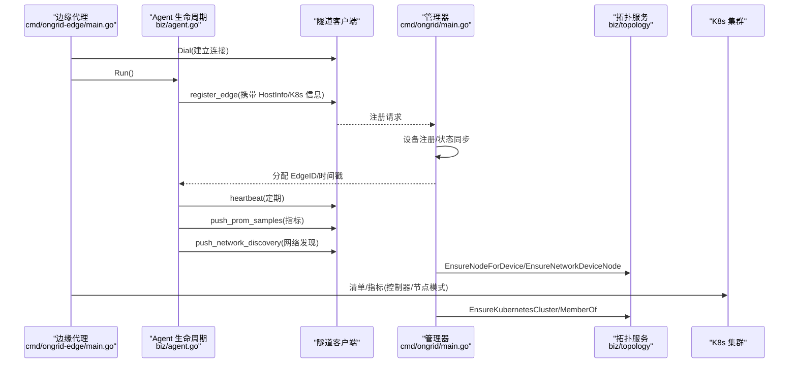
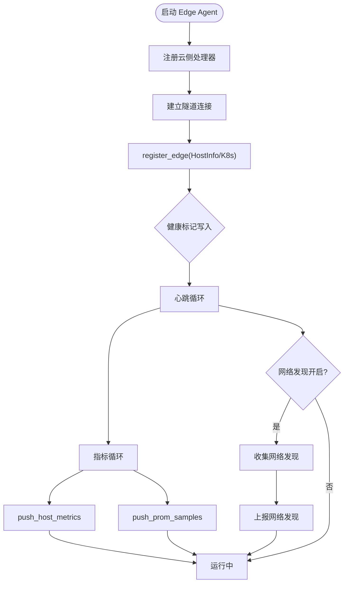
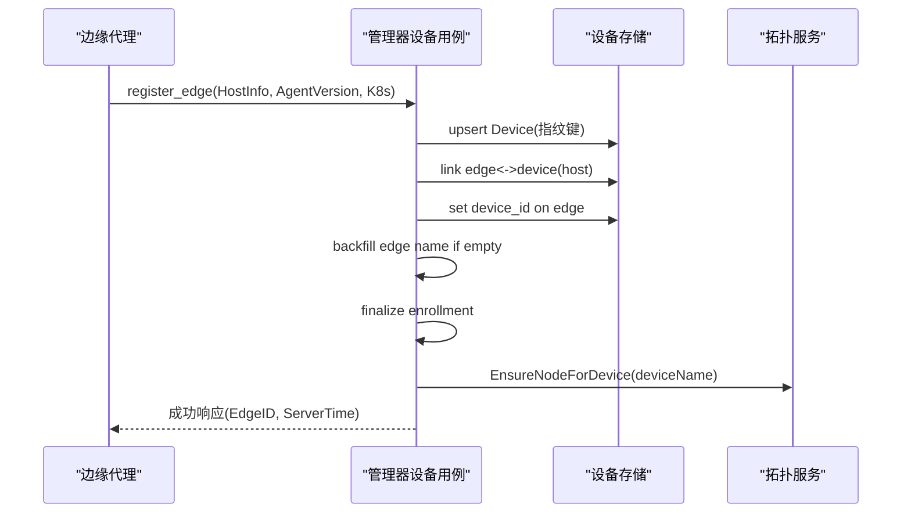
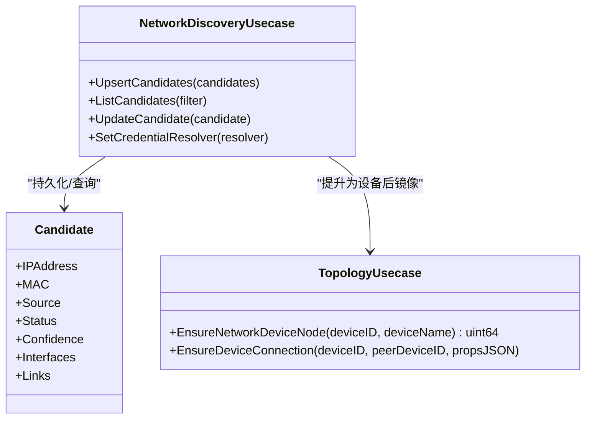
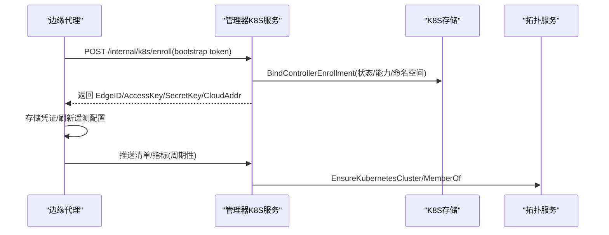
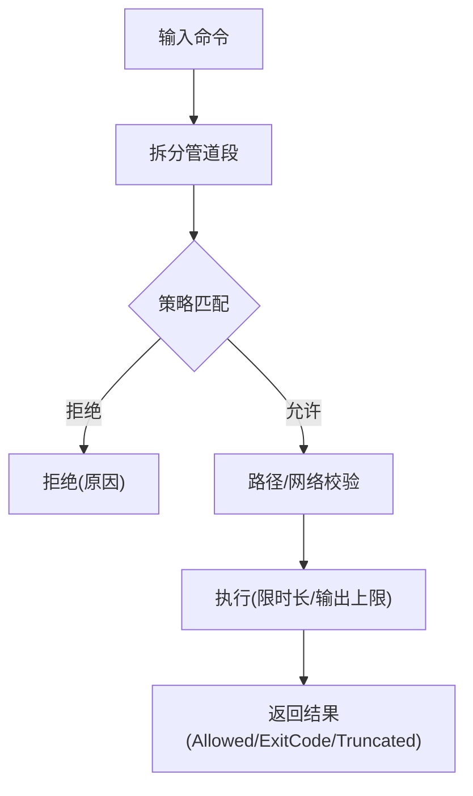
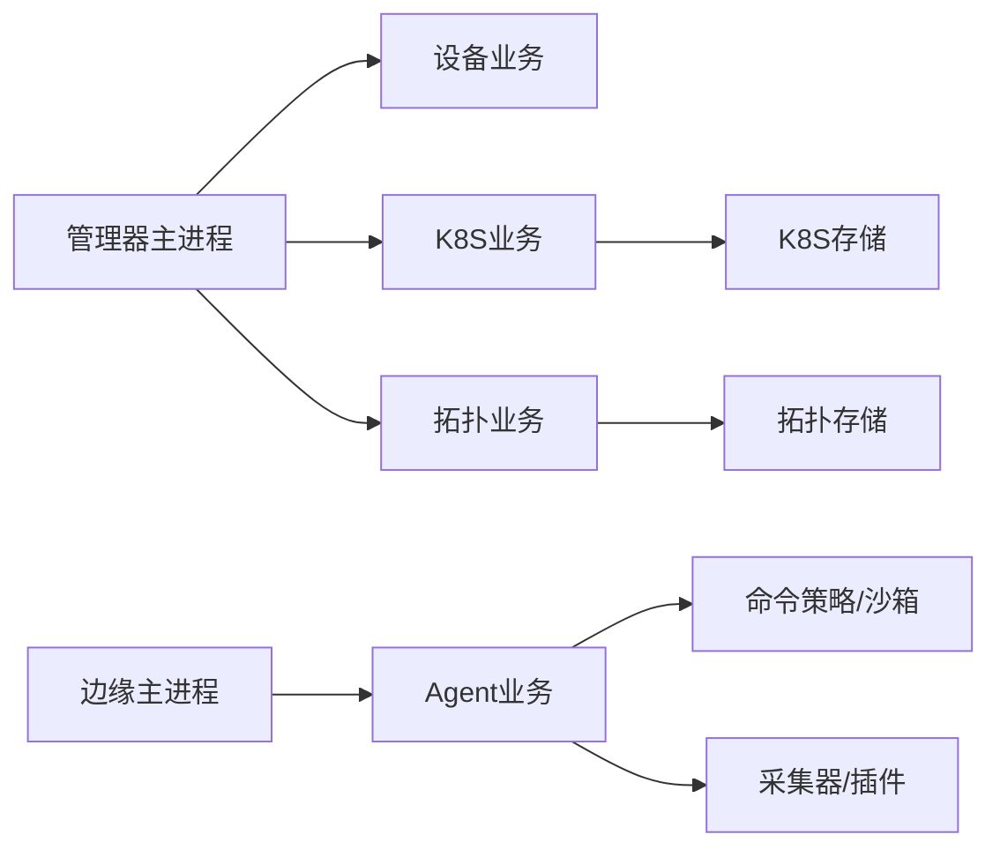

# 设备管理

<cite>
**本文引用的文件**
- [README.md](file://README.md)
- [main.go](file://cmd/ongrid/main.go)
- [edge_main.go](file://cmd/ongrid-edge/main.go)
- [agent.go](file://internal/edgeagent/biz/agent.go)
- [policy.go](file://internal/edgeagent/cmdpolicy/policy.go)
- [sandbox.go](file://internal/edgeagent/cmdpolicy/sandbox.go)
- [network_discovery.go](file://internal/manager/biz/device/network_discovery.go)
- [usecase.go](file://internal/manager/biz/topology/usecase.go)
- [repo.go](file://internal/manager/data/k8s/store/repo.go)
- [http.go](file://internal/manager/server/k8s/http.go)
- [Clusters.tsx](file://web/src/pages/Clusters.tsx)
</cite>

## 目录
1. [简介](#简介)
2. [项目结构](#项目结构)
3. [核心组件](#核心组件)
4. [架构总览](#架构总览)
5. [详细组件分析](#详细组件分析)
6. [依赖关系分析](#依赖关系分析)
7. [性能考量](#性能考量)
8. [故障排查指南](#故障排查指南)
9. [结论](#结论)
10. [附录：配置与管理操作示例](#附录配置与管理操作示例)

## 简介
本技术文档面向“设备管理系统”的运维与研发人员，系统性阐述边缘代理（Edge Agent）的生命周期管理、Kubernetes 集群集成机制、网络拓扑构建算法、远程执行安全保障，以及大规模异构设备与集群资源的管理实践。系统由云端管理器（Manager）与边缘代理（Edge Agent）组成，通过隧道连接实现双向通信；管理器负责设备注册、状态同步、拓扑与能力发现、升级编排等；边缘代理负责采集指标、上报网络邻居、执行受控命令、推送遥测数据并配合完成升级。

## 项目结构
- 云端管理器进程 cmd/ongrid/main.go：启动数据库迁移、鉴权、设置、LLM 路由、各业务域服务与 HTTP API，并通过前端边界（frontier）与边缘建立长连接。
- 边缘代理进程 cmd/ongrid-edge/main.go：初始化隧道客户端、构建采集器、注册云侧回调处理器、运行心跳与指标循环、可选地启用 Kubernetes 控制器模式（清单/指标推送）。
- 边缘业务层 internal/edgeagent/biz/agent.go：封装 Agent 生命周期（注册、心跳、指标、网络发现、插件健康上报、升级流程）。
- 安全沙箱 internal/edgeagent/cmdpolicy/*：提供白名单策略、路径校验、网络出口控制与命令执行隔离。
- 管理器设备与拓扑 internal/manager/biz/device/*, internal/manager/biz/topology/*：处理设备注册、网络发现候选、拓扑节点与关系维护。
- Kubernetes 集成 internal/manager/data/k8s/store/repo.go, internal/manager/server/k8s/http.go：集群入网、控制器绑定、清单与拓扑镜像。
- 前端 web/src/pages/Clusters.tsx：集群视图、成员关系、升级计划与批量操作入口。

```mermaid
graph TB
subgraph "云端管理器"
M["管理器主进程<br/>cmd/ongrid/main.go"]
DB["数据库<br/>MySQL/SQLite"]
API["HTTP API<br/>设备/拓扑/K8S"]
end
subgraph "边缘代理"
E["边缘主进程<br/>cmd/ongrid-edge/main.go"]
A["Agent 生命周期<br/>biz/agent.go"]
S["命令沙箱<br/>cmdpolicy/*"]
C["采集器/插件"]
end
subgraph "Kubernetes"
K8s["K8s 集群<br/>控制器/节点"]
end
M < --> |隧道/远端调用| E
E --> |指标/事件/清单| M
E --> |遥测/日志/追踪| M
E --> |命令执行(受限)| S
E --> |网络发现| M
E --> |K8s 清单/指标| K8s
M --> |拓扑/设备| DB
API --> M
```

图表来源
- [main.go:208-300](file://cmd/ongrid/main.go#L208-L300)
- [edge_main.go:66-150](file://cmd/ongrid-edge/main.go#L66-L150)
- [agent.go:186-271](file://internal/edgeagent/biz/agent.go#L186-L271)

章节来源
- [main.go:208-300](file://cmd/ongrid/main.go#L208-L300)
- [edge_main.go:66-150](file://cmd/ongrid-edge/main.go#L66-L150)

## 核心组件
- 边缘代理 Agent：负责注册、心跳、指标推送、网络发现、插件健康上报、升级流程。
- 命令沙箱与策略：基于白名单的二进制分类、参数匹配、路径与网络出口限制，确保远程执行安全。
- 设备与拓扑：设备注册后映射到拓扑节点，网络发现产生候选并支持 SNMP 验证与提升为正式设备。
- Kubernetes 集成：控制器/节点模式下的清单与指标推送、集群拓扑镜像、升级元数据与成员关系维护。
- 前端集群管理：可视化集群、成员关系、升级计划与批量操作。

章节来源
- [agent.go:186-271](file://internal/edgeagent/biz/agent.go#L186-L271)
- [policy.go:36-492](file://internal/edgeagent/cmdpolicy/policy.go#L36-L492)
- [sandbox.go:134-188](file://internal/edgeagent/cmdpolicy/sandbox.go#L134-L188)
- [network_discovery.go:82-101](file://internal/manager/biz/device/network_discovery.go#L82-L101)
- [usecase.go:294-370](file://internal/manager/biz/topology/usecase.go#L294-L370)
- [repo.go:169-200](file://internal/manager/data/k8s/store/repo.go#L169-L200)
- [http.go:614-630](file://internal/manager/server/k8s/http.go#L614-L630)
- [Clusters.tsx:460-490](file://web/src/pages/Clusters.tsx#L460-L490)

## 架构总览
系统采用“云端管理器 + 边缘代理”的双端架构，通过隧道进行双向通信。管理器暴露 HTTP API 与 Prometheus /metrics，边缘代理周期性上报指标与网络发现结果，并在需要时执行受控命令。Kubernetes 模式下，边缘代理可扮演控制器或节点角色，分别推送清单与指标，管理器将集群镜像到通用拓扑图中。



图表来源
- [edge_main.go:138-150](file://cmd/ongrid-edge/main.go#L138-L150)
- [agent.go:186-271](file://internal/edgeagent/biz/agent.go#L186-L271)
- [main.go:208-300](file://cmd/ongrid/main.go#L208-L300)
- [usecase.go:294-370](file://internal/manager/biz/topology/usecase.go#L294-L370)

## 详细组件分析

### 边缘代理生命周期管理
- 注册流程：Agent 在 Run 中先注册云侧处理器，再 Dial 建立隧道，随后调用 register_edge 上报 HostInfo 与可选的 Kubernetes 身份信息，成功后写入健康标记。
- 心跳与重连：心跳循环周期性发送 Heartbeat，若失败则尝试重新注册；隧道重连时会触发 OnReconnect 回调再次注册，保证 EdgeID 稳定。
- 指标推送：按间隔收集指标，分别走 legacy push_host_metrics 与新式 push_prom_samples 两条路径，失败不阻塞下一次采样。
- 网络发现：当采集器实现 NetworkDiscoveryCollector 且开启时，定时收集 ARP/网关/LLDP 观察并上报管理器。
- 插件健康：插件运行时健康快照随心跳上报，便于监控插件状态。
- 升级流程：支持 fetch_package/apply_package，下载并暂存新版本，应用后退出由 systemd 替换二进制，下次启动检测健康标记决定是否回滚。



图表来源
- [agent.go:186-271](file://internal/edgeagent/biz/agent.go#L186-L271)
- [agent.go:273-321](file://internal/edgeagent/biz/agent.go#L273-L321)
- [agent.go:530-602](file://internal/edgeagent/biz/agent.go#L530-L602)
- [agent.go:608-693](file://internal/edgeagent/biz/agent.go#L608-L693)

章节来源
- [agent.go:186-271](file://internal/edgeagent/biz/agent.go#L186-L271)
- [agent.go:273-321](file://internal/edgeagent/biz/agent.go#L273-L321)
- [agent.go:530-602](file://internal/edgeagent/biz/agent.go#L530-L602)
- [agent.go:608-693](file://internal/edgeagent/biz/agent.go#L608-L693)

### 设备注册与状态同步
- 管理器 HandleRegister：接收已认证隧道的 register_edge RPC，upsert 设备行（基于主机指纹），覆盖最新主机事实，建立 edge_devices 关联（Type=Host），更新 Edge.DeviceID 与在线状态 lastSeenAt。
- 首次注册回填：若 Edge 名称为空，使用上报的主机名回填；同时完成批量入网的 Finalize。
- 版本跟踪：记录 agent_version，用于审计与升级管理。



图表来源
- [usecase.go:337-453](file://internal/manager/biz/edge/usecase.go#L337-L453)
- [usecase.go:294-339](file://internal/manager/biz/topology/usecase.go#L294-L339)

章节来源
- [usecase.go:337-453](file://internal/manager/biz/edge/usecase.go#L337-L453)
- [usecase.go:294-339](file://internal/manager/biz/topology/usecase.go#L294-L339)

### 能力发现与网络拓扑构建
- 网络发现候选：边缘代理周期性收集 ARP/网关/LLDP 观察，上报为候选项；管理器持久化候选表，支持状态流转 unknown→identified→snmp_verified→promoted。
- SNMP 验证：管理器通过隧道调用边缘执行 SNMP 探测，增强身份置信度。
- 拓扑镜像：对确认的网络设备创建拓扑节点，标注 device_kind="network"，并建立物理邻接关系 ConnectedTo。
- 流量分析：通过拓扑关系与观测数据（接口、链路、源/目的）构建邻接图，辅助定位影响范围。



图表来源
- [network_discovery.go:82-101](file://internal/manager/biz/device/network_discovery.go#L82-L101)
- [network_discovery.go:593-630](file://internal/manager/biz/device/network_discovery.go#L593-L630)
- [usecase.go:341-370](file://internal/manager/biz/topology/usecase.go#L341-L370)

章节来源
- [network_discovery.go:82-101](file://internal/manager/biz/device/network_discovery.go#L82-L101)
- [network_discovery.go:593-630](file://internal/manager/biz/device/network_discovery.go#L593-L630)
- [usecase.go:341-370](file://internal/manager/biz/topology/usecase.go#L341-L370)

### Kubernetes 集群集成机制
- 控制器/节点模式：边缘代理根据环境变量识别角色，控制器模式推送清单与指标，节点模式复用宿主能力。
- 集群入网：边缘通过内嵌 HTTP 调用管理器 /internal/k8s/enroll，获取 AccessKey/SecretKey 并本地存储凭证；后续刷新遥测配置。
- 清单与指标：控制器模式支持周期性推送资源清单与指标，支持网关指标与应用指标发现。
- 拓扑镜像：管理器将 Kubernetes 集群镜像为 type=cluster 节点，并将节点设备以 MemberOf 关系关联。
- 升级管理：支持安装元数据与遥测凭证绑定，便于升级历史与回滚决策。



图表来源
- [edge_main.go:537-668](file://cmd/ongrid-edge/main.go#L537-L668)
- [repo.go:169-200](file://internal/manager/data/k8s/store/repo.go#L169-L200)
- [usecase.go:581-634](file://internal/manager/biz/topology/usecase.go#L581-L634)

章节来源
- [edge_main.go:537-668](file://cmd/ongrid-edge/main.go#L537-L668)
- [repo.go:169-200](file://internal/manager/data/k8s/store/repo.go#L169-L200)
- [usecase.go:581-634](file://internal/manager/biz/topology/usecase.go#L581-L634)

### 远程执行的安全保障
- 策略白名单：默认只允许读类工具（如 cat、ls、ps、ss 等），混合类工具需显式声明读写匹配规则，危险命令直接拒绝。
- 参数匹配：针对 iptables、systemctl、ip、nft、bpftool 等复杂 CLI，定义 read-only/write matchers，避免误放行写操作。
- 路径与网络限制：仅允许访问指定路径（/var、/opt、/tmp 等），默认禁止所有出站网络，可通过 YAML 扩展白名单。
- 执行隔离：Sandbox 在执行前解析管道段，逐段校验策略；超时、输出大小限制、截断标志保障稳定性。
- 审计日志：所有执行结果包含 Allowed/Reason/ExitCode/DurationMs，便于审计与回溯。



图表来源
- [policy.go:36-492](file://internal/edgeagent/cmdpolicy/policy.go#L36-L492)
- [policy.go:707-800](file://internal/edgeagent/cmdpolicy/policy.go#L707-L800)
- [sandbox.go:134-188](file://internal/edgeagent/cmdpolicy/sandbox.go#L134-L188)

章节来源
- [policy.go:36-492](file://internal/edgeagent/cmdpolicy/policy.go#L36-L492)
- [policy.go:707-800](file://internal/edgeagent/cmdpolicy/policy.go#L707-L800)
- [sandbox.go:134-188](file://internal/edgeagent/cmdpolicy/sandbox.go#L134-L188)

### 配置示例与管理操作
- 边缘代理环境变量（部分）：
  - ONGRID_EDGE_MODE：k8s-controller/k8s-node 或其他模式
  - ONGRID_K8S_CLUSTER_ID：K8s 集群 ID
  - ONGRID_K8S_ROLE：controller/node
  - ONGRID_K8S_NODE_NAME/NODE_UID/POD_NAMESPACE/POD_NAME
  - ONGRID_NETWORK_DISCOVERY_ENABLED/INTERVAL：网络发现开关与间隔
  - ONGRID_EDGE_UPGRADE_STAGE_DIR：升级暂存目录
  - ONGRID_PACKET_CAPTURE_DIR：抓包目录
- 命令策略 YAML（bash-policy.yaml）：
  - binaries[*]：name/class/read_only_matchers/write_matchers/denied_args
  - network_host_allowlist/path_allowlist：网络与路径白名单
  - stdout_cap_bytes/stderr_cap_bytes/timeout_seconds/max_argv_length：执行限制
- 管理操作：
  - 设备注册：自动完成，无需人工干预
  - 网络发现：开启后自动收集，可在 UI 查看候选与提升
  - 集群入网：通过 bootstrap token 调用 /internal/k8s/enroll
  - 升级管理：选择升级包，分阶段下发 apply_package，健康标记决定回滚

章节来源
- [edge_main.go:215-230](file://cmd/ongrid-edge/main.go#L215-L230)
- [policy.go:550-641](file://internal/edgeagent/cmdpolicy/policy.go#L550-L641)
- [edge_main.go:537-668](file://cmd/ongrid-edge/main.go#L537-L668)

## 依赖关系分析
- 管理器主进程依赖 IAM、设备、K8S、日志、指标、拓扑等多个业务域，统一通过 HTTP 暴露能力。
- 边缘代理依赖隧道客户端、采集器、插件、命令沙箱；在 K8s 模式下额外依赖清单与指标推送。
- 拓扑服务依赖节点与关系存储，受设备与 K8s 上下文驱动。
- 前端页面依赖后端 API 展示集群、设备与拓扑关系。



图表来源
- [main.go:208-300](file://cmd/ongrid/main.go#L208-L300)
- [edge_main.go:66-150](file://cmd/ongrid-edge/main.go#L66-L150)
- [agent.go:186-271](file://internal/edgeagent/biz/agent.go#L186-L271)

章节来源
- [main.go:208-300](file://cmd/ongrid/main.go#L208-L300)
- [edge_main.go:66-150](file://cmd/ongrid-edge/main.go#L66-L150)
- [agent.go:186-271](file://internal/edgeagent/biz/agent.go#L186-L271)

## 性能考量
- 指标推送双通道：legacy push_host_metrics 快速路径与 open-set push_prom_samples 丰富路径并行，失败不阻塞下一轮采样。
- 批量与限制：指标推送支持样本数与字节限制，避免单批过大导致拥塞。
- 网络发现节流：默认每分钟一次，可配置；无候选时跳过上报。
- 插件健康上报：随心跳附带，减少额外开销。
- 超时与截断：命令执行设置超时与输出上限，防止长时间占用与内存膨胀。

章节来源
- [agent.go:608-693](file://internal/edgeagent/biz/agent.go#L608-L693)
- [agent.go:273-321](file://internal/edgeagent/biz/agent.go#L273-L321)
- [policy.go:26-31](file://internal/edgeagent/cmdpolicy/policy.go#L26-L31)

## 故障排查指南
- 注册失败：检查隧道连通性与认证；关注连续失败计数与重注册逻辑。
- 指标未上报：确认采集器模式与目标可达；查看 push_host_metrics 与 push_prom_samples 日志。
- 网络发现无结果：确认采集器实现与边缘环境支持；检查候选状态与 SNMP 凭据。
- 命令被拒绝：查看 Reason 字段，调整策略 YAML 中的白名单与匹配规则；注意路径与网络出口限制。
- K8s 入网失败：核对 bootstrap token、集群 ID、角色与环境变量；检查 /internal/k8s/enroll 响应。
- 升级回滚：健康标记缺失或不匹配会触发回滚；确认 stage 目录可写与版本一致。

章节来源
- [agent.go:530-602](file://internal/edgeagent/biz/agent.go#L530-L602)
- [policy.go:707-800](file://internal/edgeagent/cmdpolicy/policy.go#L707-L800)
- [edge_main.go:537-668](file://cmd/ongrid-edge/main.go#L537-L668)

## 结论
本系统通过清晰的分层与职责划分，实现了边缘代理的全生命周期管理、Kubernetes 集群集成、网络拓扑构建与安全远程执行。管理器与边缘通过隧道解耦，具备高可用与可扩展性；策略与沙箱保障远程操作的安全性；拓扑与设备模型支撑大规模异构资源管理。建议在生产环境中合理配置网络发现、指标推送与命令策略，结合前端界面进行集群与升级管理，持续优化性能与可观测性。

## 附录：配置与管理操作示例
- 边缘代理环境变量示例：
  - ONGRID_EDGE_MODE=k8s-controller
  - ONGRID_K8S_CLUSTER_ID=123
  - ONGRID_K8S_ROLE=controller
  - ONGRID_NETWORK_DISCOVERY_ENABLED=true
  - ONGRID_NETWORK_DISCOVERY_INTERVAL=60s
  - ONGRID_EDGE_UPGRADE_STAGE_DIR=/var/lib/ongrid-edge/.upgrade
  - ONGRID_PACKET_CAPTURE_DIR=/var/lib/ongrid-edge/pcap
- 命令策略 YAML 片段（bash-policy.yaml）：
  - binaries:
    - name: curl
      class: network
      read_only_matchers:
        - any_flag: ["--head", "-I"]
      denied_args: ["-o", "-O", "--output", "-T", "--upload-file"]
  - network_host_allowlist: ["10.0.0.0/8", "192.168.0.0/16"]
  - path_allowlist: ["/var", "/opt", "/tmp"]
  - timeout_seconds: 30
  - stdout_cap_bytes: 65536
  - stderr_cap_bytes: 16384
- 管理操作：
  - 设备注册：自动完成，无需手动干预
  - 网络发现：开启后自动收集，可在 UI 查看候选与提升
  - 集群入网：通过 bootstrap token 调用 /internal/k8s/enroll
  - 升级管理：选择升级包，分阶段下发 apply_package，健康标记决定回滚

章节来源
- [edge_main.go:215-230](file://cmd/ongrid-edge/main.go#L215-L230)
- [policy.go:550-641](file://internal/edgeagent/cmdpolicy/policy.go#L550-L641)
- [edge_main.go:537-668](file://cmd/ongrid-edge/main.go#L537-L668)
- [README.md:43-57](file://README.md#L43-L57)